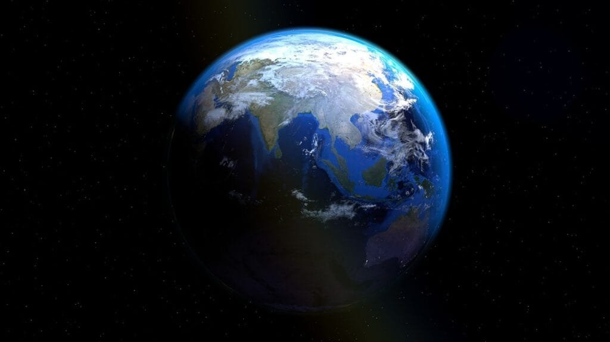
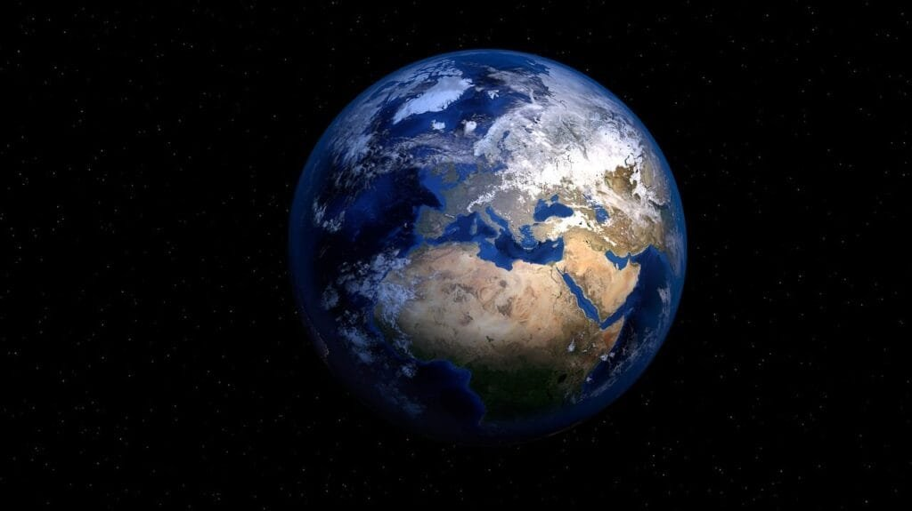
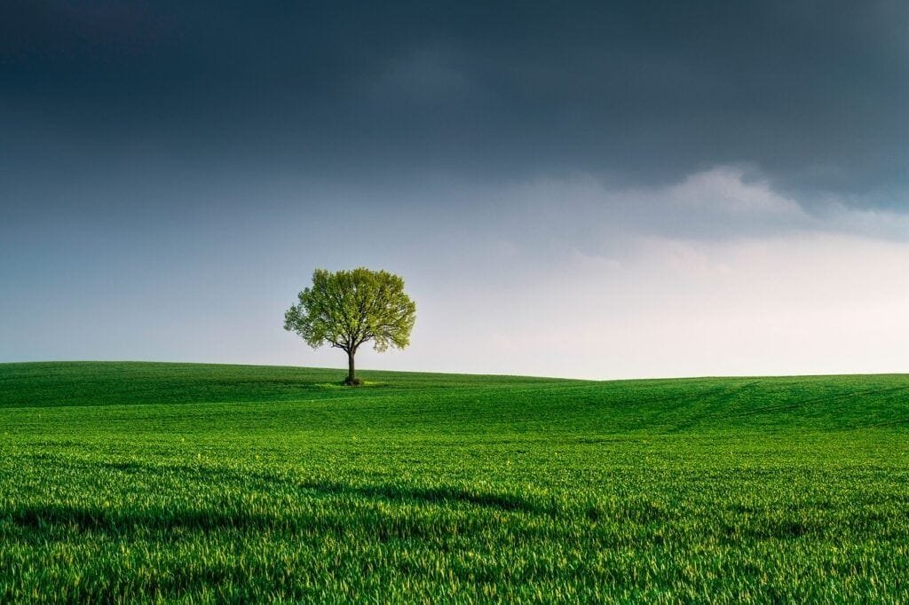

Volcanoes, with their fiery eruptions and molten lava, have a tremendous impact on Earth's crust. These magnificent geological wonders are formed when molten rock, gases, and debris escape to the surface, creating explosive eruptions of lava and ash. They are typically found at plate boundaries, hotspots beneath the Earth's crust, or rift zones where tectonic plates are moving apart. From the majestic ring of fire encircling the Pacific Ocean to the slow-building shield volcanoes in Hawaii, volcanoes exhibit different eruption patterns based on factors like lava viscosity and gas content. While volcanic eruptions can deliver vital nutrients to the surrounding soil, they can also unleash devastating natural disasters. Understanding the influence of volcanoes on Earth's crust is crucial for predicting future activity and mitigating risks for the communities living in their shadow.

This image is property of pixabay.com.

## Why Do Volcanoes Influence Earth's Crust?

Volcanoes have a significant impact on the Earth's crust due to their involvement in various geological processes. Understanding the role of volcanoes in shaping the Earth's topography, their interaction with tectonic plates, and their influence on plate tectonics is crucial in comprehending their overall impact on our planet.

## Role of volcanoes in geological processes

Volcanoes play a vital role in a range of geological processes that shape the Earth's surface. As molten rock, gases, and debris escape to the Earth's surface during volcanic eruptions, they contribute to the deposition of new rocks and minerals. This phenomenon is essential for crust formation and regeneration, as volcanic activity reintroduces materials into the geological cycle.

<iframe width="560" height="315" src="https://www.youtube.com/embed/R_pDKyg5YKY" frameborder="0" allow="accelerometer; autoplay; encrypted-media; gyroscope; picture-in-picture" allowfullscreen></iframe>

  

## Interaction of volcanoes with tectonic plates

Volcanoes are closely intertwined with the movement of tectonic plates, which form the Earth's outermost layer. They commonly occur at plate boundaries, where the Earth's crust is either colliding or diverging. At these boundaries, the interactions between tectonic plates can lead to the formation of magma chambers deep beneath the surface. The movement of these plates can then cause the ascent of magma towards the Earth's crust, leading to volcanic eruptions.

## Volcanoes in shaping the Earth's topography

The topography of the Earth's surface is greatly influenced by volcanic activity. Different types of volcanic formations, such as shield volcanoes, [cinder cone](https://magmamatters.com/the-birth-of-new-land-understanding-cinder-cones/) volcanoes, stratovolcanoes, and volcanic domes, contribute to the diverse landscape we see today. Shield volcanoes, like those found in Hawaii, are formed through repeated effusive eruptions that result in the gradual building of a broad, shield-like structure. On the other hand, cinder cone volcanoes are characterized by steep, cone-shaped structures formed by the accumulation of loose cinders and ash. Stratovolcanoes, also known as composite volcanoes, are tall and symmetrical formations composed of alternating layers of lava and pyroclastic materials. Volcanic domes, on the other hand, are formed by the slow extrusion of highly viscous lava.

This image is property of pixabay.com.

## Types of Volcanoes and their differences

### Shield Volcanoes

Shield volcanoes are unique in their low-profile, broad shape, resembling a shield or a warrior's shield laid flat on the ground. These volcanoes are primarily composed of basaltic lava flows, which have low viscosity. Due to their low viscosity, the lava can travel long distances from the vent before it cools and solidifies. This results in the gradual formation of a wide, gently sloping volcanic structure. Shield volcanoes, such as those found in the Hawaiian Islands, are known for their relatively quiet eruptions with the effusion of lava rather than violent explosions.

### Cinder Cone Volcanoes

Cinder cone volcanoes, also called scoria cones, are typically small, steep-sided volcanoes with a cone-shaped appearance. They are formed by the accumulation of loose cinders, volcanic ash, and other pyroclastic materials ejected during relatively mild volcanic eruptions. The loose and porous nature of these materials allows them to build up quickly around the vent, forming a symmetrical cone shape. Cinder cone volcanoes often have relatively short lifespans, as their eruptions are characterized by short and explosive bursts.

### Stratovolcanoes/Composite Volcanoes

Stratovolcanoes, also known as composite volcanoes, are large, symmetrical mountains formed from alternating layers of lava flows, volcanic ash, and other pyroclastic materials. These volcanoes are characterized by their steep slopes and a summit crater. The eruptions of stratovolcanoes can vary, ranging from explosive eruptions that produce ash clouds to relatively quiet effusive eruptions. Mount Fuji in Japan and Mount St. Helens in the United States are examples of stratovolcanoes.

### Volcanic Domes

Volcanic domes are formed when highly viscous lava accumulates around a vent and creates a steep-sided, rounded mound. These lava domes are typically composed of rhyolite or andesite, which are lava types with higher silica content, resulting in their increased viscosity. Unlike shield or stratovolcanoes, volcanic domes do not typically produce explosive eruptions. Instead, the lava slowly oozes out from the vent and accumulates around it, steadily building up the dome's structure.

## How Volcanic Eruptions Occur

Understanding the process of how volcanic eruptions occur provides valuable insights into the dynamics of volcanoes and their effects on the Earth's crust. The formation and ascent of magma, along with the influence of pressure and gas content, play crucial roles in the eruption process.

### Magma formation and ascent

Volcanic eruptions are triggered by the ascent of magma from deep within the Earth's mantle towards the surface. Magma is formed through the partial melting of rocks in the mantle or crust. This molten rock, which is less dense than the surrounding solid rock, rises towards the surface due to buoyant forces. As the magma ascends, it collects in chambers beneath the surface, known as magma chambers, until the pressure becomes too great, and an eruption occurs.

### Influence of pressure and gas content on eruptions

The pressure within a magma chamber plays a significant role in determining the type and explosivity of volcanic eruptions. When the pressure exceeds a certain threshold, it can cause the magma to fracture and allow gases dissolved within it to escape. The release of these gases can lead to explosive eruptions, where ash, lava bombs, and pyroclastic flows are ejected into the atmosphere. Conversely, if the pressure is relatively low, the magma can flow more freely, resulting in effusive eruptions characterized by the gentle flow of lava.

### Rise of magma towards Earth's crust and volcano formation

As magma rises towards the Earth's crust, it can encounter various pathways, such as fractures and faults, which guide and facilitate its ascent. These pathways are often associated with tectonic plate boundaries or hotspots, which are areas of intense volcanic activity beneath the Earth's surface. When the magma reaches the surface, a volcano is formed, and it can manifest as different types of volcanic structures, as mentioned earlier. The shape and characteristics of the volcano depend on factors such as the composition of the magma, the rate of magma ascent, and the amount of gas present within the magma.

This image is property of pixabay.com.

## Geographic Distribution of Volcanoes

Volcanoes are not uniformly distributed across the Earth's surface but are concentrated along certain regions associated with tectonic plate boundaries, hotspots, and rift zones. Understanding the geographic distribution of volcanoes provides valuable insights into the underlying processes driving their formation and eruption patterns.

### Volcanoes along tectonic plate boundaries

A significant number of volcanoes are located along tectonic plate boundaries, where the Earth's crust is either colliding, converging, or diverging. In subduction zones, where one tectonic plate moves beneath another, volcanoes often form due to the melting of the subducting plate. This can result in the formation of volcanic arcs, such as the "Ring of Fire" encircling the Pacific Ocean, which is characterized by frequent volcanic activity. Similarly, in divergent plate boundaries, where two plates move apart, volcanoes can form along rift zones as the Earth's crust is stretched and thinned.

### Hotspots and their role in volcano formation

Hotspots are areas beneath the Earth's surface where a plume of hot material rises from deep within the mantle, creating localized volcanic activity. These plumes are considered to be relatively stationary, while the tectonic plates move over them. As the lithospheric plate passes over a hotspot, a chain of volcanoes can form. The Hawaiian Islands are a prime example of such a hotspot, with the active volcanoes of Mauna Loa and Kilauea being prominent features.

### Rift Zones and associated volcanoes

Rift zones are regions where the Earth's tectonic plates are moving apart, resulting in the formation of mid-oceanic ridges or continental rifts. These zones often exhibit volcanic activity as the crust is thinned and fractured. Volcanoes form along these rift zones as magma ascends to fill the gaps created by the separating plates. The East African Rift System is a well-known example of a rift zone that stretches across several countries and contains several active volcanoes.

## Impact of Volcanic Eruptions on Earth's Crust

Volcanic eruptions have a profound impact on the Earth's crust, both in terms of physical changes and their influence on the overall structure and integrity. Understanding these impacts is crucial in comprehending the long-term effects of volcanic activity on the Earth's crust.

### Role in crust formation and regeneration

Volcanic eruptions contribute to the formation and regeneration of the Earth's crust through the deposition of new rocks and minerals. The molten rock expelled during these eruptions solidifies and forms igneous rocks. Over time, these rocks can accumulate and contribute to the growth of the Earth's crust. This continuous cycle of eruption and solidification plays a vital role in shaping the Earth's topography and maintaining the geological health of the planet.

### Impact on structural integrity of Earth's crust

The immense energy released during volcanic eruptions can cause significant disruptions to the structural integrity of the Earth's crust. The force of an eruption can trigger earthquakes, which can further alter the stability and arrangement of rocks within the crust. These seismic activities, along with the formation of new volcanic structures, can contribute to the overall stress and strain distribution within the crust.

### Periodic modification and alteration of Earth's crust due to eruptions

Volcanic eruptions lead to periodic modifications and alterations of the Earth's crust. Over time, the repeated deposition of volcanic materials can result in the formation of new landforms, such as lava fields, calderas, and volcanic mountains. The accumulation of volcanic materials can also significantly impact the surrounding landscape, as well as the availability of natural resources and habitats.

## How Volcanoes Influence Plate Tectonics

Volcanic activity is closely linked to the movement of tectonic plates, and understanding their influence on plate tectonics is essential in developing a comprehensive understanding of Earth's geological processes.

### Connection between volcanic activity and plate movements

Volcanoes often occur at plate boundaries, where the interaction between tectonic plates results in magma generation and volcano formation. Subduction zones, where one tectonic plate is forced beneath another, can lead to the formation of explosive volcanoes. Divergent plate boundaries can create rift zones and mid-oceanic ridges that generate volcanic activity. By examining the distribution of volcanoes and their association with tectonic plate boundaries, scientists can gain insights into the underlying processes driving plate movements.

### Role in formation of new tectonic boundaries

Volcanic activity can play a significant role in the formation of new tectonic boundaries. As magma ascends towards the surface, it can rupture and fracture the overlying rocks, creating new faults and fractures. These can potentially develop into future plate boundaries or contribute to the evolution of existing boundaries. By studying the volcanic activity associated with these regions, scientists can gain valuable information about the dynamics of plate tectonics and the driving forces behind it.

### Advancing our understanding of Earth's tectonic system

Volcanic activity provides a unique opportunity to study Earth's tectonic system and advance our understanding of the planet's inner workings. By examining the composition of volcanic rocks and monitoring volcanic eruptions, scientists can determine the characteristics of the mantle and the processes occurring within it. This information contributes to our understanding of the thermal and chemical evolution of the Earth's interior, as well as the broader context of plate tectonics.

## Effects of Volcanic Eruptions on Human Life and Environment

Volcanic eruptions have significant impacts on both human life and the environment. Understanding these effects is crucial for mitigating the risks associated with volcanic activity and developing strategies to minimize their impact on communities.

### Effects on agriculture and soil fertility

Volcanic eruptions can have a profound impact on agriculture and soil fertility in affected regions. While volcanic ash can provide valuable nutrients to the soil, the deposition of thick layers of ash can suffocate vegetation and disrupt local ecosystems. Additionally, the release of poisonous gases during eruptions can contaminate soil and water, further jeopardizing agricultural productivity and posing health risks to humans and animals.

### Impact on air and water quality

Volcanic eruptions release large amounts of gases, such as [sulfur dioxide and carbon](https://magmamatters.com/the-art-and-science-of-volcano-monitoring/ "The Art and Science of Volcano Monitoring") dioxide, into the atmosphere. These gases can contribute to air pollution and have adverse effects on air quality, potentially leading to respiratory problems and other health issues for nearby communities. Volcanic ash can also contaminate water sources, making them unsafe for consumption and posing a threat to aquatic ecosystems.

### Influence on climate and weather patterns

Volcanic eruptions can have a significant influence on climate and weather patterns, both locally and globally. The release of large quantities of volcanic ash and gases into the atmosphere can cause short-term cooling by reflecting sunlight back into space, leading to a decrease in global temperature. This phenomenon, known as volcanic winter, can impact weather patterns worldwide, resulting in altered precipitation patterns and overall climatic instability.

## Risks and Dangers Posed by Volcanoes

Volcanic eruptions pose a range of risks and dangers to human populations and the environment. Understanding these risks is crucial in developing effective strategies for disaster preparedness, response, and mitigation.

### Destruction caused by lava flows and pyroclastic material

One of the most immediate and visible dangers posed by volcanoes is the destruction caused by lava flows and pyroclastic material. Lava flows can engulf and destroy everything in their path, including buildings, vegetation, and infrastructure. Pyroclastic flows, which consist of a mixture of hot gases, ash, and volcanic debris, can travel rapidly down the slopes of volcanoes, wiping out all life in their way.

### Indirect risks such as tsunamis and landslides

Volcanoes can also trigger indirect hazards such as tsunamis and landslides. Explosive volcanic eruptions near coastlines have the potential to generate tsunamis, which can cause widespread devastation and loss of life. Additionally, the destabilization of slopes due to volcanic activity can trigger landslides, which can bury entire communities and further exacerbate the destruction caused by eruptions.

### Long-term effects such as volcanic winters and habitat loss

Volcanic eruptions can have long-term effects on the environment, often resulting in habitat loss and the displacement of wildlife. The deposition of volcanic ash and other materials can alter ecosystems and disrupt the natural balance of flora and fauna. Volcanic winters, caused by the injection of large amounts of ash and gases into the atmosphere, can lead to a decline in agricultural productivity and the loss of food sources for both humans and animals.

## The Benefits of Volcanic Activity

While volcanic eruptions can have devastating effects, they also offer numerous benefits to the Earth's ecosystem and human societies. These benefits highlight the intricate relationship between volcanic activity and the overall functioning of our planet.

### Creation of fertile lands and habitats

Volcanic eruptions play a crucial role in the creation of fertile lands and habitats. The deposition of volcanic ash enriches the soil with essential nutrients, making it highly fertile and suitable for agriculture. In fact, many volcanic regions, such as the volcanic islands of Hawaii and the volcanic soils of Iceland, have become renowned for their agricultural productivity.

### Geothermal energy production

Volcanic activity provides a significant source of geothermal energy. Geothermal power plants harness the natural heat stored within the Earth's crust, using it to generate clean and sustainable energy. Volcanic regions with high geothermal potential, such as Iceland and parts of the United States, have successfully integrated this renewable energy source into their power generation systems.

### Insights into Earth's interior processes and history

Volcanic eruptions provide valuable insights into the interior processes and history of the Earth. By studying volcanic rocks and gases, scientists gain access to material that originated deep within the mantle. This information contributes to our understanding of the Earth's thermal and chemical evolution and helps decipher the complex processes that shape our planet.

### Contribution to the carbon cycle and atmosphere composition

Volcanic activity plays a significant role in the carbon cycle and the composition of the Earth's atmosphere. [Volcanoes release large amounts of carbon dioxide](https://magmamatters.com/geothermal-energy-and-its-volcanic-origins/ "Geothermal Energy and Its Volcanic Origins") and other gases into the atmosphere, contributing to the greenhouse effect and regulating the planet's climate. This exchange of gases between the Earth's interior and the atmosphere is crucial for maintaining the delicate balance necessary for supporting life on our planet.

## Predicting Volcanic Activities

The ability to predict volcanic activities is crucial for minimizing the risks associated with eruptions and protecting vulnerable communities. Advances in technology and the understanding of volcanic processes have led to significant improvements in volcanic prediction and risk mitigation strategies.

### Understanding eruption patterns

Scientists study past volcanic eruptions to understand eruption patterns and develop predictive models. By analyzing the characteristics of historical eruptions, such as eruption duration, magnitude, and frequency, scientists can identify patterns that may help forecast future volcanic activities. This knowledge allows them to make informed decisions regarding proactive measures and disaster response.

### Monitoring seismic activity and gas emissions

Monitoring seismic activity and gas emissions are important tools in predicting volcanic activities. By deploying a network of seismometers and gas sensors, scientists can detect underground movements associated with magma migration and track changes in gas compositions. These monitoring techniques provide crucial data for assessing the state of volcanoes and evaluating the likelihood of an impending eruption.

### Technological advancements in volcanic prediction and risk mitigation

Advancements in technology have revolutionized volcanic prediction and risk mitigation efforts. Remote sensing techniques, such as satellite monitoring and aerial surveys, allow scientists to capture detailed images of volcanic regions and monitor changes in topography and gas emissions. Additionally, sophisticated computer models and simulations enable scientists to predict the behavior of magma and simulate different eruption scenarios.

In conclusion, the influence of volcanoes on Earth's crust is undeniable. From shaping the Earth's topography to contributing to plate tectonics and impacting human life and the environment, volcanoes play a crucial role in our planet's geological processes. Understanding the different types of volcanoes, their distribution, eruption causes, as well as the risks and benefits associated with volcanic activity, allows us to develop strategies to predict eruptions and mitigate their impact. By continuously studying and monitoring volcanoes, we deepen our knowledge of the Earth's inner workings and foster a safer and more sustainable coexistence with these powerful natural phenomena.

