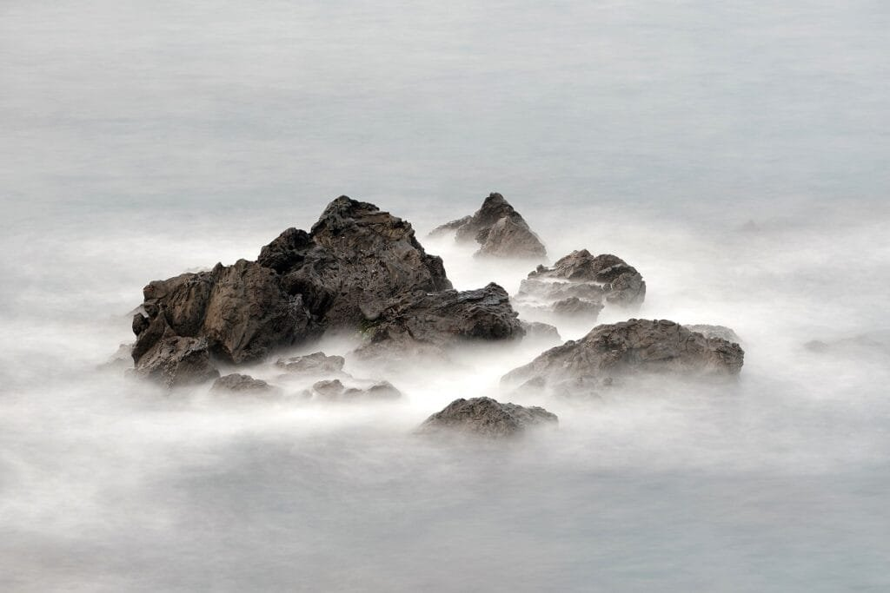
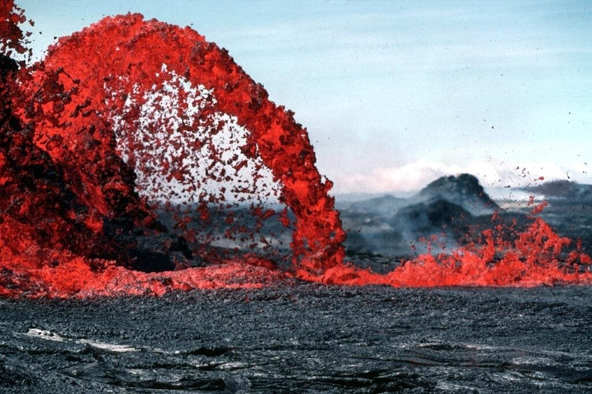
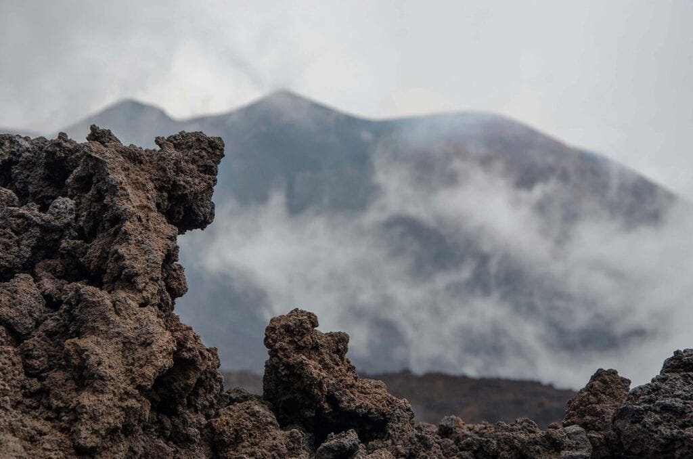

In the article "How to Identify Different Types of Hawaiian Volcanic Rocks," you will discover valuable information about the formation of volcanoes and their various eruption patterns. Volcanoes, located along plate boundaries or hotspots, result from the escape of molten rock, gases, and debris to the earth's surface. Unlike explosive volcanoes found in the "Ring of Fire," Hawaiian shield volcanoes form gradually and erupt less violently. Understanding the different types of volcanic rocks can not only provide insights into their formation but also help predict future volcanic activity and mitigate potential risks. So, whether you're a geology enthusiast or simply curious about the fascinating world of volcanoes, this article will guide you in identifying different Hawaiian volcanic rock types.

<iframe width="560" height="315" src="https://www.youtube.com/embed/vkaGvP8IKJM" frameborder="0" allow="accelerometer; autoplay; encrypted-media; gyroscope; picture-in-picture" allowfullscreen></iframe>

  

## Understanding Volcanoes

[Volcanoes are natural phenomena](https://magmamatters.com/the-art-and-science-of-volcano-monitoring/ "The Art and Science of Volcano Monitoring") that have fascinated humans for centuries. These magnificent structures are formed when molten rock, gases, and debris escape to the Earth's surface, resulting in eruptions of lava and ash. Volcanoes can occur in different areas, and their eruption patterns vary depending on various factors.

### How volcanoes are formed

Volcanoes are primarily formed at three main locations: plate boundaries, hotspots under the Earth's crust, and rift zones where tectonic plates are moving apart. At plate boundaries, such as those found in the "Ring of Fire" encircling the Pacific Ocean, volcanoes often form where tectonic plates meet, creating areas prone to eruptions. Hotspots are areas deep underground where a hot mantle plume rises to the surface, causing volcanic activity. Rift zones occur when tectonic plates are moving apart, leading to the formation of fissures through which magma rises.

### Different areas where volcanoes occur

Volcanoes can be found in various regions around the world. The "Ring of Fire," mentioned earlier, is one of the most volcanic-prone areas, stretching across the Pacific Ocean and encompassing countries like Japan, Indonesia, and the United States. Other volcanic regions include the East African Rift Valley, the Mediterranean region, and several islands in the Atlantic and Indian Oceans. Each of these areas has unique [geological](https://magmamatters.com/geothermal-energy-and-its-volcanic-origins/ "Geothermal Energy and Its Volcanic Origins") characteristics that contribute to the formation and eruption of volcanoes.

### The eruption patterns of different types of volcanoes

Volcanoes exhibit different eruption patterns based on factors such as lava viscosity, gas content, and the [type of volcano](https://magmamatters.com/understanding-volcanic-formation-a-comprehensive-guide/ "Understanding Volcanic Formation: A Comprehensive Guide") itself. Volcanoes can be broadly classified into four main types: shield volcanoes, stratovolcanoes, cinder cone volcanoes, and composite volcanoes. Shield volcanoes, like those found in Hawaii, have relatively low viscosity lava that flows easily and results in gentle eruptions. Stratovolcanoes, on the other hand, have much stickier lava, leading to explosive eruptions. Cinder cone volcanoes are small and have steep slopes, often characterized by short-lived and relatively less explosive eruptions. Composite volcanoes are a combination of shield and stratovolcanoes, displaying both gentle and violent eruptions.

### The impact of volcanic eruptions on the environment and human communities

Volcanic eruptions have both positive and negative impacts on the environment and human communities. While volcanic eruptions can devastate surrounding areas with ash, lava flows, and pyroclastic materials, they also contribute to the creation of new landforms and fertile soil. Volcanic ash and gases release essential nutrients into the soil, making it highly fertile for agriculture. However, volcanic eruptions can pose significant risks to human settlements, including the destruction of infrastructure, displacement of communities, and the potential for deadly [pyroclastic flows and volcanic gases](https://magmamatters.com/the-environmental-impact-of-volcanic-eruptions-2/ "The Environmental Impact of Volcanic Eruptions"). Understanding the behavior of volcanoes is crucial for predicting and managing these risks, ensuring the safety of communities in volcanic regions.

## General Characteristics of Volcanic Rocks

Volcanic rocks are essential in understanding the geological history of volcanic areas. They are formed from solidified magma or lava ejected during volcanic eruptions. Volcanic rocks have several common features that help identify them and provide valuable insights into the Earth's geological processes.

### Defining volcanic rocks

Volcanic rocks, also known as extrusive igneous rocks, are formed from magma that reaches the Earth's surface through volcanic activity. Unlike intrusive igneous rocks, which cool and solidify beneath the surface, volcanic rocks cool rapidly in contact with the air or water, resulting in distinct textures and characteristics.

### Common features of volcanic rocks

Volcanic rocks exhibit various textures and colors, depending on the specific conditions of their formation. They often have a fine-grained texture due to rapid cooling, resulting in smaller crystals. However, volcanic rocks can also have larger crystals if the lava cools slowly. Colors can range from black and dark gray to red, brown, or even green, depending on the mineral composition. Additionally, volcanic rocks may contain vesicles, which are cavities formed by gas bubbles trapped within the cooling lava.

### Why volcanic rocks vary in appearance and structure

The appearance and structure of volcanic rocks can vary significantly due to several factors. The mineral composition of the magma determines the color and overall appearance of the rock. For example, rocks rich in iron and magnesium, like basalt, tend to be darker, while those rich in silica, like rhyolite, are usually lighter in color. The rate of cooling also plays a role in the texture and structure of volcanic rocks, with rapid cooling resulting in a fine-grained texture and slower cooling allowing for larger crystals to form.

This image is property of pixabay.com.

## Basalt Rocks

Basalt rocks are a common type of volcanic rock with unique characteristics. These rocks have played a significant role in shaping the Hawaiian islands and have various uses in different industries.

### Identifying features of basalt rocks

Basalt rocks are typically dark in color, ranging from black to dark gray. They have a fine-grained texture due to rapid cooling, which limits crystal growth. Basalt is rich in iron and magnesium, giving it a dense and heavy feel. It often contains tiny cavities called vesicles, formed by gas bubbles trapped during the cooling process.

### Occurrence of basalt in Hawaii

Basalt is abundant in Hawaii, where shield volcanoes dominate the landscape. The Hawaiian islands are formed by the continuous eruption of basaltic lava flows from various vents and fissures. These lava flows gradually build up the islands over time, creating a unique geological history.

### Uses of basalt rocks

Basalt rocks have multiple industrial uses. Due to its durability and weather resistance, basalt is commonly used as a construction material for roads, sidewalks, and building facades. It is also crushed and used as an aggregate in concrete production. Basalt fibers, derived from melting basalt rocks, are used in manufacturing high-strength materials, such as rebars and reinforcements for composites.

## Andesite Rocks

Andesite rocks are another type of volcanic rock found in Hawaiian volcanoes. These rocks have distinct features and are valuable in various applications.

### Distinct features of andesite rocks

Andesite rocks are typically gray in color and have a medium-grained texture. They contain minerals such as plagioclase feldspar, pyroxene, and amphibole, which give them their characteristic appearance. Andesite rocks are intermediate in composition between basalt and rhyolite, containing moderate amounts of silica.

### How andesite is formed in Hawaiian volcanoes

Andesite rocks are primarily formed in the Hawaiian volcanoes through the process of fractional crystallization. As magma rises to the surface, it begins to cool and solidify. During this process, certain minerals crystallize and separate from the remaining melt, leading to the formation of andesite rocks.

### Applications of andesite rocks

Andesite rocks have several applications across different industries. Due to their strength and durability, andesite is commonly used as a decorative stone in landscaping and construction projects. It is also used as an aggregate in concrete production, providing stability and strength to the final product.

This image is property of pixabay.com.

## Dacite Rocks

Dacite rocks are a type of volcanic rock found in Hawaiian volcanoes, characterized by their distinct characteristics and widespread applications.

### Characteristics of dacite rocks

Dacite rocks have a light to medium gray color and a fine-grained texture. They contain minerals such as plagioclase feldspar, quartz, and biotite, which contribute to their appearance. Dacite rocks have a higher silica content compared to basalt and andesite, making them more resistant to weathering.

### Formation process of dacite in Hawaiian volcanoes

Dacite rocks are formed when magma with intermediate silica content rises to the surface and cools relatively slowly. This slower cooling allows larger crystals to form, resulting in a fine-grained texture. Dacite often forms in the late stages of volcanic activity when more evolved magma compositions are present.

### Utilization of dacite rocks

Dacite rocks have various applications in industries such as construction and landscaping. Their durability and resistance to weathering make them suitable for use as building stones and decorative rock in architectural projects. Dacite can also be crushed and used as an aggregate in concrete production, providing strength and stability to construction materials.

## Rhyolite Rocks

Rhyolite rocks are igneous rocks found in Hawaiian volcanoes, known for their distinctive features and applications in various industries.

### Defining features of rhyolite rocks

Rhyolite rocks are typically light in color, ranging from light gray to pink or red. They have a fine-grained or glassy texture, depending on the cooling rate. Rhyolite contains a high amount of silica and minerals such as quartz, feldspar, and biotite, giving it its characteristic appearance.

### Occurrences of rhyolite in Hawaii

Rhyolite rocks are less common in Hawaii compared to basalt and andesite. However, they can still be found in certain volcanic areas and as volcanic plugs or domes. These formations occur when highly viscous rhyolitic lava erupts and solidifies, creating unique landforms.

### Use of rhyolite rocks in various industries

Rhyolite rocks have various applications due to their unique characteristics. As a decorative stone, rhyolite is used in landscaping and architectural projects to enhance visual appeal. Its glassy texture makes it suitable for use in jewelry and ornamental purposes. Crushed rhyolite can also be used as an aggregate in concrete production, providing strength and stability to the final product.

This image is property of pixabay.com.

## Scoria Rocks

Scoria rocks are volcanic rocks found in Hawaiian volcanoes, characterized by their distinctive appearance and wide range of applications.

### Identifying scoria rocks

Scoria rocks are typically dark in color, ranging from black to dark red or brown. They have a vesicular texture, consisting of numerous small cavities known as vesicles. These cavities are formed by gas bubbles escaping from the lava while it is still molten.

### How scoria forms from Hawaiian volcanoes

Scoria rocks form when gas-rich lava erupts and quickly cools. The rapid cooling causes the gas bubbles within the lava to become trapped, forming the characteristic vesicles. The resulting rock is lightweight and porous, making it buoyant in water.

### Common applications of scoria rocks

Scoria rocks have several applications in different industries. Due to their lightweight and insulating properties, scoria is often used as a lightweight aggregate in concrete production. It provides strength to the concrete while reducing overall weight. Scoria can also be used in landscaping and horticulture as a decorative rock or as a growing medium due to its ability to retain moisture and provide drainage.

## Pumice Rocks

Pumice rocks are unique volcanic rocks found in Hawaiian volcanoes, known for their distinctive properties and widespread applications.

### Characteristics of pumice rocks

Pumice rocks are light in color, ranging from white to gray or light brown. They have a highly porous texture, filled with numerous gas bubbles or vesicles. Pumice is incredibly lightweight and can even float on water due to its high porosity.

### Formation of pumice in Hawaiian volcanoes

Pumice forms when highly gas-charged lava erupts explosively. The rapid expansion of gas within the magma causes it to froth and become filled with vesicles. During the eruption, the pumice is ejected into the air and cools rapidly, solidifying into the lightweight rock we know as pumice.

### Usage of pumice rocks in different fields

Pumice rocks have a wide range of applications due to their unique properties. In skincare and beauty products, pumice is used as a natural exfoliant due to its abrasive texture. It is also used in construction and manufacturing industries for lightweight aggregate in concrete, as a soil amendment for horticulture, and in water filtration systems for its ability to remove impurities.

## Tephra/Pyroclastic Rocks

Tephra, also known as pyroclastic rocks, is a type of volcanic rock found in the Hawaiian islands. These rocks have unique characteristics and find various uses across different fields.

### How to identify pyroclasts or tephra

Tephra, or pyroclasts, are fragmented volcanic materials that are ejected during explosive volcanic eruptions. They are characterized by their small grain size, ranging from ash-sized particles to larger lapilli and volcanic bombs. Tephra can have a variety of shapes and textures depending on the eruptive process and subsequent cooling.

### The formation of tephra in the Hawaiian islands

Tephra is formed when a volcanic eruption generates highly explosive activity, leading to the fragmentation of magma into small particles. These particles are then propelled into the atmosphere, where they cool and solidify before falling back to the ground as tephra deposits.

### Different uses of tephra rocks

Tephra rocks have numerous applications in various fields. In agriculture, tephra deposits can enrich and improve soil fertility due to their mineral content. Tephra can also be used as an abrasive in cleaning products, as an ingredient in construction materials, and in geotechnical applications for slope stabilization.

## Peridotite Rocks

Peridotite rocks are a type of igneous rock found in Hawaiian volcanoes. These rocks have distinctive features and find practical applications in different industries.

### Defining features of peridotite rocks

Peridotite rocks are typically dark green in color, but can also range from brown to black. They have a coarse-grained texture due to slower cooling and larger crystal sizes. Peridotite contains minerals such as olivine and pyroxene, which give it its characteristic appearance.

### Peridotite occurrence in Hawaiian volcanoes

Peridotite rocks are primarily found in the ultramafic zones of Hawaiian volcanoes. These zones exist deeper within the Earth's crust and are characterized by the presence of mantle-derived magma. When this magma reaches the surface, it solidifies and forms peridotite rocks.

### Industrial applications of peridotite rocks

Peridotite rocks have various industrial applications due to their unique composition. One of the most valuable uses is in the diamond industry, where peridotite deposits are known to be associated with the formation of diamonds. Peridotite also has potential in carbon capture and storage (CCS) technologies, as it has the ability to react with carbon dioxide, permanently sequestering it from the atmosphere. Additionally, olivine, a mineral found in peridotite, is used in the production of refractory bricks, ceramics, and as an ingredient in fertilizers.

In conclusion, understanding different types of volcanic rocks is crucial in comprehending the geological processes and history of volcanic areas. Basalt, andesite, dacite, rhyolite, scoria, pumice, tephra, and peridotite rocks are just a few examples of the diverse range of volcanic rocks found in Hawaiian volcanoes. Each rock type has unique characteristics and finds various applications in industries such as construction, landscaping, manufacturing, and agriculture. By studying volcanic rocks, scientists and geologists gain insights into the formation, eruption patterns, and impact of volcanic activity, enabling better prediction and mitigation of volcanic hazards.

