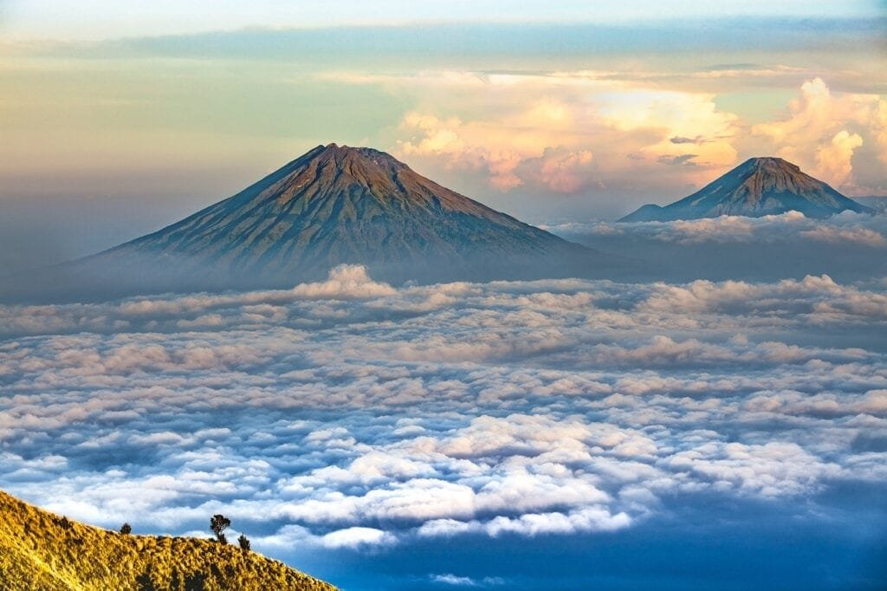

Volcanic landforms have a significant impact on climate change. When volcanoes erupt, they release not only molten rock and ash but also gases into the atmosphere. These gases, such as carbon dioxide and sulfur dioxide, have the potential to affect the Earth's climate. Additionally, volcanic eruptions can produce aerosols, tiny particles that can reflect sunlight and reduce the amount of solar radiation reaching the Earth's surface. This can result in a temporary cooling effect on the climate. Understanding the ways in which volcanic landforms contribute to climate change is crucial in developing strategies to mitigate their potential impacts. In this article, we will explore five of the best volcanic landforms that have a direct influence on climate change.

This image is property of pixabay.com.

## Definition of Volcanic Landforms

### Understanding what constitutes volcanic landforms

Volcanic landforms refer to the various structures that are created as a result of volcanic activities. These landforms are formed when molten rock, gas, and debris, collectively known as magma, rise to the Earth's surface through volcanic eruptions. The immense energy and force associated with these eruptions shape the landscape, leaving behind distinct features that are unique to volcanic areas.

### Differentiations between various volcanic landforms

There are several different types of volcanic landforms, each with its own characteristics and formation processes. Some of the most common volcanic landforms include volcanoes, which are generally conical mountains formed by the accumulation of lava, ash, and other materials expelled during eruptions. Another type of volcanic landform is a caldera, which is a large volcanic crater often caused by the collapse of a volcano following a massive eruption.

Additionally, volcanic landforms can also include lava domes, which are formed when viscous lava accumulates and solidifies around the vent of a volcano. Volcanic cones, also known as cinder cones, are another type of volcanic landform that are typically formed by the accumulation of cinders and other volcanic materials around a vent. These landforms vary in size and shape, depending on the specific eruption characteristics and the composition of the magma involved.

## Origins and Types of Volcanoes

### Exploration of the formation of volcanoes

Volcanoes are formed through a combination of geological processes that occur beneath the Earth's surface. The primary factor contributing to their formation is the movement of tectonic plates, which are large pieces of the Earth's lithosphere. When these plates collide, separate, or slide past each other, they create areas of intense heat and pressure, causing the mantle beneath the Earth's crust to melt and form magma.

As this magma rises towards the surface, it fills up chambers within the Earth's crust. Over time, the accumulating pressure causes the magma to erupt through vents, fissures, or openings in the Earth's surface, giving rise to volcanic activity. The specific characteristics and types of volcanoes formed depend on several factors, including the composition of the magma, the level of gas content, and the eruption style.

### Overview of the different types of volcanoes such as stratovolcanoes, shield volcanoes, and cinder cones

There are various types of volcanoes that can be categorized based on their shape, eruption style, and the type of magma involved. One common type is the stratovolcano, also known as a composite volcano. These volcanoes are characterized by their steep-sided conical shape and alternating layers of lava, ash, and other volcanic materials. Stratovolcanoes are typically associated with explosive eruptions due to the high viscosity of their magma, which allows gas to accumulate and create a buildup of pressure.

On the other hand, shield volcanoes have a much broader shape and gently sloping sides. They are formed by numerous non-explosive eruptions that result in the flow of highly fluid lava over long distances. These eruptions typically occur when basaltic magma, which has a low gas content and low viscosity, reaches the surface. Shield volcanoes are often associated with hotspots, such as the ones found in Hawaii.

Cinder cones, also known as scoria cones, are another [type of volcano](https://magmamatters.com/understanding-volcanic-formation-a-comprehensive-guide/ "Understanding Volcanic Formation: A Comprehensive Guide") that is typically smaller in size compared to stratovolcanoes and shield volcanoes. These volcanoes are formed by the accumulation of cinders and other volcanic materials around a vent. Cinder cones are often characterized by their steep slopes and bowl-like craters.

<iframe width="560" height="315" src="https://www.youtube.com/embed/bHNDRquJ8U8" frameborder="0" allow="accelerometer; autoplay; encrypted-media; gyroscope; picture-in-picture" allowfullscreen></iframe>

  

## Geographical Distribution of Volcanoes

### Volcanoes in the 'Ring of Fire'

One of the most well-known regions for volcanic activity is the 'Ring of Fire.' This area encircles the Pacific Ocean and is characterized by a high concentration of [volcanoes](https://magmamatters.com/the-art-and-science-of-volcano-monitoring/ "The Art and Science of Volcano Monitoring") and frequent seismic activity. The 'Ring of Fire' is associated with the boundaries of several tectonic plates, including the Pacific Plate, the Nazca Plate, and the Philippine Sea Plate. Due to the subduction of these plates, magma is generated and rises to the surface, resulting in numerous volcanic eruptions.

This region is home to some of the most active and dangerous volcanoes in the world, including Mount St. Helens in the United States, Mount Fuji in Japan, and Mount Merapi in Indonesia. The volcanic activity in the 'Ring of Fire' has a significant impact on the local environment and poses a threat to nearby communities.

### Volcanoes in other parts of the world like Hawaii and the Mid-Atlantic ridge

While the 'Ring of Fire' is known for its intense volcanic activity, there are also notable volcanoes in other parts of the world. The Hawaiian Islands, for example, are a result of volcanic activity associated with a hotspot beneath the Pacific Plate. Over millions of years, a chain of shield volcanoes has formed as the Pacific Plate moves steadily northwestward over the hotspot. The most famous volcano in Hawaii is Kilauea, which has been erupting continuously since 1983.

Another interesting area of volcanic activity is the Mid-Atlantic Ridge. This underwater mountain range spans the length of the Atlantic Ocean and is formed by the divergence of tectonic plates. As the plates separate, magma wells up from the mantle and creates new oceanic crust. Volcanic eruptions along the Mid-Atlantic Ridge are relatively common, although they may go unnoticed due to their underwater location. These eruptions contribute to the continuous process of seafloor spreading and the formation of new land.

## Eruption Patterns and Their Characteristics

### Different eruption styles and their unique features

Volcanic eruptions can occur in various styles, each with its own distinctive features. One of the most explosive eruption styles is known as a Plinian eruption, named after the ancient Roman scholar Pliny the Younger. Plinian eruptions are characterized by their towering eruption columns, which can reach heights of several kilometers. During a Plinian eruption, a massive amount of ash, gas, and volcanic material is ejected into the atmosphere, posing significant risks to both human populations and the environment.

In contrast, Hawaiian-style eruptions are much less explosive and are characterized by the continuous flow of highly fluid lava. These eruptions typically occur from shield volcanoes and are associated with effusive eruptions. The lava flows can extend over large distances and pose minimal risk to human life if properly managed.

Another eruption style is the Strombolian eruption, which involves regular and moderate explosions of gas and magma. These eruptions are typically characterized by the ejection of incandescent cinder and the formation of volcanic cones. Strombolian eruptions are common at cinder cone volcanoes and often result in the production of lava fountains and lava flows.

### How eruption patterns differ based on factors like lava viscosity and gas content

The eruption patterns of volcanoes can vary significantly based on several factors, including the viscosity of the magma and the gas content. Viscosity refers to a substance's resistance to flow, and magma viscosity plays a crucial role in determining the style of volcanic eruptions. Magma with low viscosity, such as basaltic magma, allows gases to escape more easily, resulting in effusive eruptions characterized by the flow of lava. On the other hand, magma with high viscosity, such as andesitic or rhyolitic magma, traps gas bubbles, leading to more explosive eruptions with the ejection of volcanic ash and debris.

The gas content of magma also influences eruption patterns. As magma rises, the decrease in pressure causes dissolved gas to come out of the solution and form bubbles. Higher gas content in magma can result in more explosive eruptions, as the buildup of pressure from expanding gas bubbles can lead to violent eruptions. Magma with lower gas content, on the other hand, may result in more effusive eruptions, as the gas is able to escape more easily.

This image is property of pixabay.com.

## Hazards and Benefits of Volcanoes

### The negative impacts of volcanic eruptions

Volcanic eruptions can have severe negative impacts on both human populations and the environment. One of the most immediate and devastating consequences of volcanic eruptions is the destruction caused by pyroclastic flows. These fast-moving currents of hot rock fragments, gas, and ash can travel at extremely high speeds, obliterating everything in their path. Pyroclastic flows pose a significant threat to nearby communities, as they can cause widespread damage, bury buildings, and lead to loss of life.

Another hazardous aspect of volcanic eruptions is the release of volcanic ash. Ash clouds can extend for hundreds of kilometers, affecting air quality and posing risks to aviation. Volcanic ash is abrasive and can cause damage to infrastructure, such as buildings, power lines, and transportation systems. The accumulation of ash on vegetation and bodies of water can also have long-term negative impacts on ecosystems and agriculture.

Volcanic eruptions can also lead to the release of toxic gases, such as sulfur dioxide and hydrogen sulfide. These gases can have detrimental effects on human health, causing respiratory problems and other complications. In addition, volcanic eruptions can trigger secondary hazards such as lahars, which are fast-moving mudflows containing volcanic debris. Lahars can be extremely destructive and can cause widespread damage to infrastructure and ecosystems.

### The positive impacts of volcanic activity on soil fertility

While volcanic eruptions can cause significant damage, they also have positive impacts on the environment. Volcanic ash, for example, is rich in nutrients and minerals, making it highly beneficial for soil fertility. When volcanic ash is deposited on the Earth's surface, it breaks down over time and releases essential nutrients such as nitrogen, phosphorus, and potassium. These nutrients support the growth of plants and contribute to the overall fertility of the soil. Volcanic soils, known as Andisols, are highly productive and used for agriculture in many volcanic regions around the world.

In addition to the direct benefits to soil fertility, volcanic eruptions can also create new landforms that serve as unique habitats for various species of plants and animals. The bare, rocky landscapes created by volcanic eruptions provide opportunities for colonization and diversification of species. Over time, these areas can develop into thriving ecosystems, supporting a wide range of biodiversity.

## Volcanic Gases Contribution to the Atmosphere

### The nature of gases released during volcanic eruptions

During volcanic eruptions, various gases are released into the atmosphere. The composition of these gases can vary depending on the type of magma involved and other factors. Some of the most common gases released during eruptions include water vapor (H2O), carbon dioxide (CO2), sulfur dioxide (SO2), hydrogen sulfide (H2S), and hydrogen chloride (HCl). These gases originate from the magma and are released into the atmosphere as a result of the volcanic activity.

The exact amount and composition of gases emitted during volcanic eruptions can have significant impacts on the surrounding environment and climate. Volcanic gases can contribute to the formation of atmospheric aerosols, which are tiny particles suspended in the air. These aerosols can have both cooling and warming effects on the Earth's climate, depending on their composition and concentration.

### How these gases can contribute to the greenhouse effect

One of the gases released during volcanic eruptions that has a significant impact on the Earth's climate is carbon dioxide (CO2). CO2 is a greenhouse gas, meaning it absorbs and re-emits thermal radiation from the Earth's surface, trapping heat within the atmosphere. The release of large amounts of CO2 from volcanic eruptions can contribute to the greenhouse effect and result in global warming.

However, it is important to note that volcanic CO2 emissions are relatively small compared to human activities such as the burning of fossil fuels. The long-term impact of volcanic CO2 emissions on the climate is therefore considered to be minimal. Nonetheless, volcanic eruptions can release significant amounts of other greenhouse gases, such as sulfur dioxide (SO2), which can have a more immediate and localized impact on climate and air quality.

This image is property of pixabay.com.

## Volcanic Eruption and Its Influence on Solar Radiation

### How volcanic aerosols reflect sunlight

During volcanic eruptions, volcanic aerosols are released into the atmosphere. These aerosols are tiny particles suspended in the air, often consisting of volcanic ash, sulfur dioxide, and other volcanic debris. These aerosols can have a significant impact on solar radiation and the Earth's energy balance.

Volcanic aerosols have the ability to reflect sunlight back into space, a phenomenon known as volcanic cooling. The fine particles in the aerosols scatter and diffuse sunlight, preventing a portion of it from reaching the Earth's surface. This reduction in incoming solar radiation can result in a temporary cooling effect on the climate, as less energy from the sun is absorbed by the Earth's surface.

### The potential cooling effect of volcanoes on the earth's surface

The cooling effect of volcanic eruptions can have both short-term and long-term impacts on the Earth's surface temperature. In the short term, the release of volcanic aerosols can cause a noticeable drop in temperature, particularly in the vicinity of the eruption. This cooling effect is most prominent in the tropics, where the majority of volcanic activity occurs.

In the long term, the injected aerosols can remain in the atmosphere for several years, reflecting sunlight and reducing the overall amount of solar radiation reaching the Earth's surface. This can result in a gradual cooling effect, which can temporarily offset or mitigate the warming caused by other factors such as greenhouse gas emissions. However, it is important to note that the cooling effect of volcanic eruptions is temporary and will eventually dissipate as the aerosols settle out of the atmosphere.

## Volcanic Landforms and Possible Effects on Weather Patterns

### How volcanic activity can disrupt weather patterns

Volcanic eruptions can have significant effects on local and regional weather patterns. The injection of volcanic aerosols into the atmosphere can alter the atmospheric composition, affecting cloud formation, precipitation patterns, and wind patterns.

Volcanic aerosols have the ability to act as cloud condensation nuclei, providing a surface for water vapor to condense and form clouds. These clouds can have different characteristics from normal clouds and can impact local weather patterns. In some cases, volcanic aerosols can suppress rainfall by reducing the size and lifespan of cloud droplets, making it more difficult for them to coalesce and form precipitation.

Additionally, volcanic aerosols can influence wind patterns by altering the distribution of temperature in the atmosphere. The injection of aerosols can create a layer of cooler air in the upper atmosphere, which can disrupt the normal flow of wind patterns. This disruption can lead to changes in atmospheric circulation and the formation of atmospheric pressure systems, potentially affecting weather patterns on a larger scale.

### Case studies of significant volcanic eruptions and subsequent weather impacts

Throughout history, there have been several significant volcanic eruptions that have had notable impacts on weather patterns. One well-known example is the eruption of Mount Pinatubo in the Philippines in 1991. The eruption injected a large amount of aerosols into the stratosphere, resulting in a global cooling effect that was observed for several years. The decrease in incoming solar radiation led to a temporary cooling of the Earth's surface, resulting in reduced global temperatures.

Another example is the eruption of Mount Tambora in Indonesia in 1815. This massive eruption released a large amount of volcanic aerosols into the atmosphere, causing a significant drop in global temperatures the following year. 1816 became known as the "Year Without a Summer" in many parts of the world, as the cooling effect of the eruption led to widespread crop failures and food shortages.

These case studies highlight the potential for volcanic eruptions to have far-reaching impacts on weather patterns, emphasizing the need for continued research and monitoring of volcanic activity to better understand and predict these effects.

## Assessing the Long-Term Impact of Volcanic Activity on Climate Change

### Research on the correlation between volcanic activity and climate change

Scientists have conducted extensive research to understand the correlation between volcanic activity and climate change. Through the analysis of ice cores, tree rings, and other geological records, researchers have been able to reconstruct the climatic impacts of significant historical volcanic eruptions.

This research has provided valuable insights into the long-term impacts of volcanic activity on climate change. For example, the eruption of Mount Pinatubo in 1991 caused a noticeable drop in global temperatures for several years. By studying the effects of this eruption, scientists have been able to better understand the role of volcanic aerosols in climate cooling.

### Long-term climatic impacts of significant historical volcanic eruptions

Significant historical volcanic eruptions have had long-term impacts on climate, primarily through their ability to inject large amounts of aerosols into the atmosphere. These aerosols can remain in the atmosphere for several years, reflecting and scattering sunlight, which can result in a cooling effect on the climate.

For example, the eruption of Mount Tambora in 1815 led to a prolonged cooling period, resulting in decreased global temperatures. The effects of this eruption were felt worldwide, leading to colder and wetter conditions in many parts of the Northern Hemisphere. The cooling effect was particularly pronounced during the following year, which became known as the "Year Without a Summer."

Similarly, the eruption of Mount Pinatubo in 1991 also resulted in a temporary cooling of the Earth's surface. The injected aerosols reflected sunlight, causing a decrease in global temperatures that persisted for several years. These long-term impacts highlight the significant role that volcanic activity can play in influencing climate change on a global scale.

## Mitigating the Impact of Volcanoes on Climate Change

### Strategies for mitigating the climate impacts of volcanic eruptions

While volcanic eruptions are natural processes that cannot be prevented, there are strategies in place to mitigate their impacts on climate change. One approach involves the monitoring and early warning systems for volcanic activity. By closely monitoring volcanic activity and analyzing various indicators, scientists and authorities can provide timely warnings to the surrounding communities, enabling them to evacuate and take necessary precautions.

Another strategy is to develop effective disaster response plans. These plans help in coordinating emergency response efforts, ensuring the safety and protection of affected populations. They involve the establishment of evacuation routes, emergency shelters, and communication systems to facilitate a swift and coordinated response to volcanic eruptions.

Additionally, ongoing research plays a crucial role in understanding volcanic activity and its potential impacts on climate change. By continually studying volcanic processes, scientists can improve their understanding of eruption dynamics and develop more accurate predictive models. This research can aid in better assessing the risks associated with volcanic eruptions and facilitate proactive measures to mitigate their impacts on climate change.

### Ongoing research to predict volcanic activity and its potential impact on climate

Investigations into the prediction of volcanic activity and its potential impact on climate are ongoing. Scientists use a combination of geophysical monitoring techniques, including seismic monitoring, gas measurements, and ground deformation analysis, to monitor and predict volcanic eruptions. These monitoring systems provide valuable information that can help forecast the timing, intensity, and potential impacts of future eruptions.

Furthermore, researchers are developing models to simulate the effects of volcanic eruptions on climate and weather patterns. These models take into account various factors, such as the volume of erupted materials, composition of volcanic gases, and meteorological conditions, to estimate the potential climatic impacts of volcanic activity. By refining these models and incorporating more accurate data, scientists aim to improve their ability to predict the climate effects of future volcanic eruptions.

Overall, ongoing research and monitoring efforts contribute to our understanding of [volcanoes and their potential impact on climate change](https://magmamatters.com/geothermal-energy-and-its-volcanic-origins/ "Geothermal Energy and Its Volcanic Origins"). By combining scientific knowledge with effective disaster response plans, it is possible to mitigate the impacts of volcanic eruptions and minimize their contribution to climate change.

