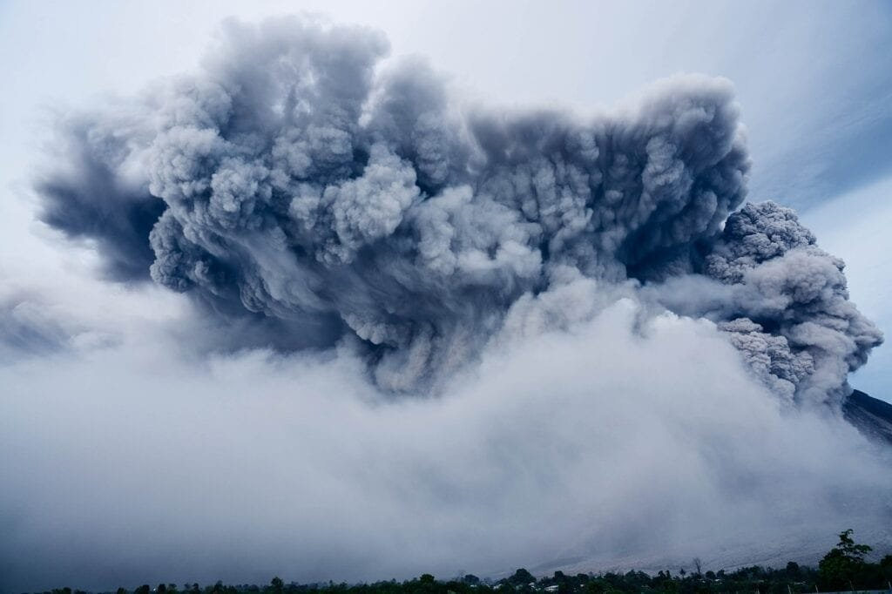

Volcanoes are not only powerful forces of nature, but they also play a surprising role in contributing to global warming. With their eruptions, they release large amounts of carbon dioxide and other greenhouse gases into the atmosphere. This can have a significant impact on our climate and the environment. In this article, we will explore the five best ways in which volcanoes contribute to global warming. From the release of greenhouse gases to the creation of volcanic ash that blankets the Earth, these natural phenomena have a far-reaching effect on our planet's delicate balance. So, let's dive into the fascinating world of volcanoes and uncover their unexpected connection to global warming.

# Understanding Volcanoes

Volcanoes are a fascinating natural phenomenon that have both positive and negative impacts on the Earth. In order to fully grasp the effects of volcanoes on our climate and environment, it is important to have a comprehensive understanding of how they are formed, the various types of volcanoes, their geographic distribution, and the factors that influence their eruption patterns.

This image is property of pixabay.com.

## Definition and formation of volcanoes

Volcanoes are formed when molten rock, gases, and debris escape to the Earth's surface, resulting in eruptions of lava and ash. They can occur at sites along plate boundaries, hotspots under the Earth's crust, or rift zones where the Earth's tectonic plates are moving apart. The formation of a volcano is a complex process that involves the accumulation of magma beneath the Earth's surface. As pressure builds up, the magma eventually finds a way to the surface, leading to volcanic activity.

## Types of volcanoes

There are several types of volcanoes, each with its own unique characteristics. One common classification is based on their shape and structure. Shield volcanoes, like those found in Hawaii, are broad and gently sloping. They form gradually over hotspots deep underground and typically have less explosive eruptions. Stratovolcanoes, on the other hand, are tall and steep, with frequent explosive eruptions. These types of volcanoes are often associated with subduction zones, where one tectonic plate is forced beneath another.

## Geographic distribution of volcanoes

Volcanoes are not evenly distributed around the world. They are concentrated in specific regions, with the "Ring of Fire" encircling the Pacific Ocean being one of the most active volcanic areas. This is because the "Ring of Fire" is located at the meeting points of several tectonic plates, making it prone to volcanic activity. Other volcanic regions include the Mediterranean, with its volcanic islands like Stromboli and Etna, and the East African Rift Valley.

## Factors influencing eruption patterns

The eruption patterns of volcanoes can vary greatly depending on several factors. One key factor is the viscosity of the lava. If the lava is more viscous, it has a higher resistance to flow and can result in explosive eruptions. Another important factor is the gas content within the magma. The higher the gas content, the more explosive the eruption is likely to be. Other factors that influence eruption patterns include the composition of the magma, the presence of water, and the geometry of the volcano's vent.

## Volcanic Gases and Global Warming

When discussing the impact of volcanoes on global warming, one important aspect to consider is the release of gases during volcanic eruptions. These gases can have a significant effect on the Earth's atmosphere and climate.

## Carbon dioxide (CO2) release from volcanoes

Volcanic eruptions release large amounts of carbon dioxide (CO2) into the atmosphere. This is because molten rock contains dissolved gases, including carbon dioxide, which are released when the magma reaches the surface. While the amount of CO2 released from volcanoes is substantial, it is relatively small compared to human-induced emissions. In fact, volcanoes are estimated to account for less than 1% of the total CO2 emissions annually.

## Release of other greenhouse gases

In addition to carbon dioxide, volcanic eruptions also release other greenhouse gases such as sulfur dioxide (SO2), hydrogen sulfide (H2S), and water vapor. These gases can have a significant impact on the Earth's climate system. For example, sulfur dioxide can react with other compounds in the atmosphere to form sulfate aerosols, which reflect sunlight back into space and have a cooling effect on the Earth's surface.

## Comparison of volcanic emissions to human-induced emissions

While volcanic emissions of greenhouse gases are substantial, they are still lower than human-induced emissions. Human activities, such as burning [fossil fuels and deforestation](https://magmamatters.com/the-role-of-volcanoes-in-earths-carbon-cycle-5/ "The Role Of Volcanoes In Earth’s Carbon Cycle"), release far greater amounts of greenhouse gases into the atmosphere. Therefore, it is essential to focus on reducing human-induced emissions in order to mitigate the effects of global warming.

## Role of carbon dioxide from volcanoes in the atmospheric carbon cycle

Although volcanic emissions of carbon dioxide contribute to the greenhouse effect, they also play a role in the Earth's carbon cycle. The carbon dioxide released during volcanic eruptions can be absorbed by vegetation and the oceans, helping to maintain a balance in the carbon cycle. It is worth noting, however, that the rate of CO2 release from volcanoes is much slower compared to the rate at which humans are releasing CO2 into the atmosphere.

  

## Heat Emission and Global Warming

Another way volcanoes contribute to global warming is through the emission of thermal energy during eruptions. This heat energy can have a profound impact on both the oceans and the atmosphere.

## Thermal energy from volcanic eruptions

Volcanic eruptions release a significant amount of thermal energy into the surrounding environment. This heat is generated by the magma as it rises to the surface and can have various effects on the Earth's climate system.

## Heat contribution to oceans and atmosphere

The heat emitted during volcanic eruptions can have both immediate and long-term effects on the oceans and atmosphere. In the short term, the heat can cause localized increases in ocean temperatures, which can lead to coral bleaching and damage to marine ecosystems. In the long term, the heat can contribute to the overall warming of the Earth's atmosphere, which is a key driver of climate change.

## Influence on global temperature

The heat emissions from volcanic eruptions can have a measurable impact on global temperature. While the overall effect may be small compared to other factors contributing to global warming, it is still an important component to consider. Understanding the influence of volcanic heat emissions on global temperature is crucial in order to accurately assess and predict the future climate scenarios.

## Volcanic Aerosols and Climate Change

Volcanic aerosols play a significant role in climate change, primarily through their interaction with solar radiation and their impact on the Earth's atmosphere.

## Effect of volcanic aerosols on the atmosphere

During volcanic eruptions, large amounts of ash and gases are ejected into the atmosphere. These particles can linger in the stratosphere for months to years, forming volcanic aerosols. These aerosols can have a significant impact on the Earth's climate system by scattering and absorbing solar radiation.

## Role in solar radiation and global temperature

The presence of volcanic aerosols in the atmosphere can lead to a cooling effect on the Earth's surface. This is because the aerosols scatter and reflect sunlight back into space, reducing the amount of solar radiation reaching the surface. This cooling effect can temporarily offset the warming effect of greenhouse gases, resulting in a decrease in global temperature.

## Stratospheric changes due to aerosols

Volcanic aerosols can also cause changes in the stratosphere, the second layer of the Earth's atmosphere. These aerosols can alter the stratospheric temperature profile, leading to changes in circulation patterns and the distribution of ozone. The impact of volcanic aerosols on the stratosphere can have implications for weather patterns and climate variability.

## Volcanic Ash and Global Warming

Volcanic ash has both immediate and long-term effects on the Earth's climate. Understanding the composition and quantities of ash produced during eruptions is crucial in assessing its impact on global warming.

This image is property of pixabay.com.

## Ash composition and quantities during eruptions

The composition of volcanic ash can vary depending on the type of volcano and the specific eruption. It is primarily composed of fine rock particles, glass shards, and minerals. The exact composition of ash can have implications for its effect on solar radiation and its potential to cause respiratory problems in humans and animals. The quantities of ash produced during eruptions can vary greatly, ranging from a few tons to millions of tons.

## Impact of ash on solar radiation

Volcanic ash can have a significant impact on solar radiation. Larger particles in the ash can scatter and absorb sunlight, reducing the amount of solar radiation reaching the Earth's surface. This can result in a temporary cooling effect. However, smaller particles can also have a warming effect by absorbing and re-emitting infrared radiation. The net effect of volcanic ash on global temperatures depends on various factors, including the size and composition of the particles, the altitude at which the ash is dispersed, and the duration of the ash cloud.

## Long-term effects of volcanic ash

The long-term effects of volcanic ash on global warming are still not fully understood. While the immediate impact of ash on solar radiation can lead to a temporary cooling effect, the eventual settling of ash particles can contribute to soil fertility, which can enhance vegetation growth. However, the accumulation of ash over time can also lead to changes in land surface reflectivity and albedo, which can have complex effects on the Earth's energy balance and climate system.

## Large-scale Volcanic Eruptions

Large-scale volcanic eruptions are rare events but can have profound effects on the Earth's climate. Understanding the immediate and long-term impacts of these eruptions on climate is crucial in gaining insights into eruption-induced global warming.

## Definition and example of large-scale eruptions

Large-scale volcanic eruptions, often referred to as "super eruptions," are characterized by the massive amounts of volcanic material ejected into the atmosphere. These eruptions are rare but can have catastrophic consequences. One example is the eruption of Mount Tambora in 1815, which released vast amounts of ash and gases into the atmosphere and led to the "Year Without a Summer" in 1816, with significant global cooling and crop failures.

## Immediate and long-term effects on climate

Large-scale volcanic eruptions can have both immediate and long-term effects on the Earth's climate. In the immediate aftermath of an eruption, ash and volcanic gases can cause a temporary cooling effect by blocking solar radiation. However, in the long term, the release of greenhouse gases, such as carbon dioxide, can contribute to global warming. The impact of large-scale eruptions on climate can persist for years or even decades, depending on the magnitude of the eruption and the distribution of volcanic material.

## Historical context of eruption-induced global warming

Throughout history, large-scale volcanic eruptions have been responsible for significant changes in the Earth's climate. The effects of these eruptions can be seen in historical records, such as ice cores and tree rings, which provide evidence of periods of global cooling following major volcanic events. Studying these historical events can provide valuable insights into the potential impacts of future large-scale eruptions on global warming.

## Underwater Volcanoes and Climate Change

While most of our attention is focused on terrestrial volcanoes, underwater volcanoes also play a significant role in climate change. Understanding the emissions and heat [contribution of these underwater volcanoes](https://magmamatters.com/understanding-volcanic-formation-a-comprehensive-guide/ "Understanding Volcanic Formation: A Comprehensive Guide") is crucial for a comprehensive analysis of their impact on climate.

## Definition and examples of underwater volcanoes

Underwater volcanoes, also known as submarine or subaqueous volcanoes, are volcanoes that form beneath the ocean's surface. They are often located along mid-ocean ridges, where tectonic plates are moving apart. Examples of underwater volcanoes include the Axial Seamount in the Pacific Ocean and the Kick 'Em Jenny volcano in the Caribbean Sea.

This image is property of pixabay.com.

## Emissions and heat contribution to oceans

Underwater volcanoes release large amounts of gases, heat, and volcanic material into the surrounding water. The emissions from these volcanoes can have significant implications for the composition of the ocean, including its pH and nutrient levels. The heat emitted by underwater volcanoes can also have a direct impact on ocean temperatures, which can influence local marine ecosystems and the overall circulation of the oceans.

## Impact on sea-level rise and thermal expansion

The emissions and heat contribution from underwater volcanoes can also have indirect effects on climate change. For example, the release of gases can contribute to ocean acidification, which can affect the growth and survival of marine organisms with calcium carbonate shells. Additionally, the heat emitted by underwater volcanoes can contribute to thermal expansion of the oceans, leading to an increase in sea levels.

## Volcanoes and the Greenhouse Effect

Volcanoes are a natural contributor to the greenhouse effect, which is the process by which certain gases in the Earth's atmosphere trap heat and warm the planet. Understanding the interplay between volcanic emissions and existing greenhouse gases is essential in assessing their combined impact on climate change.

## Contributions to the greenhouse effect

Volcanic emissions, such as [carbon dioxide and sulfur](https://magmamatters.com/the-art-and-science-of-volcano-monitoring/ "The Art and Science of Volcano Monitoring") dioxide, contribute to the greenhouse effect by trapping heat in the Earth's atmosphere. These gases absorb and re-emit infrared radiation, leading to an increase in surface temperatures. While the contributions of volcanic emissions to the greenhouse effect are relatively small compared to human-induced emissions, every source of greenhouse gases plays a role in shaping the Earth's climate.

## Interplay between volcanic emissions and existing greenhouse gases

The interplay between volcanic emissions and existing greenhouse gases is complex. While volcanoes release greenhouse gases, they also release other compounds that can have a cooling effect on the Earth's climate, such as sulfate aerosols. These aerosols can reflect sunlight back into space, resulting in a net cooling effect. The overall impact of volcanic emissions on the greenhouse effect depends on the balance between warming gases, like carbon dioxide, and cooling aerosols.

## Volcanoes as a natural part of the carbon cycle

Volcanoes are a natural part of the Earth's carbon cycle. The carbon dioxide released during volcanic eruptions is eventually absorbed by vegetation and the oceans, where it can be stored or used for photosynthesis. This natural process helps to maintain a balance in the Earth's carbon cycle. However, it is important to note the difference in timescales between the release of carbon dioxide from volcanoes and the rate at which humans are releasing carbon dioxide into the atmosphere.

## The Tipping Point

The concept of a "tipping point" refers to a critical threshold beyond which a system undergoes a significant and often irreversible change. Understanding the potential scenarios of increased volcanic activity and the role of [volcanoes in triggering irreversible climate change](https://magmamatters.com/geothermal-energy-and-its-volcanic-origins/ "Geothermal Energy and Its Volcanic Origins") is essential for predicting future climate scenarios.

## Possible scenarios of increased volcanic activity

While the frequency and intensity of volcanic eruptions can vary over time, it is crucial to consider the potential scenarios of increased volcanic activity in the context of climate change. Changes in Earth's climate system, such as melting ice sheets and altered ocean currents, can potentially affect the stability of volcanic systems and lead to an increase in volcanic activity.

## Role of volcanoes in triggering irreversible climate change

Volcanic activity has the potential to trigger significant changes in the Earth's climate, including irreversible climate change. Large-scale volcanic eruptions can release massive amounts of greenhouse gases and aerosols into the atmosphere, which can have long-lasting effects on global temperatures and climate patterns. The impact of volcanic-induced climate change can be compounded by positive feedback loops, where warming temperatures lead to further volcanic activity, creating a cycle of increasing environmental disruption.

## Effect on global warming feedback loops

Global warming feedback loops refer to the complex interactions and amplifications within the Earth's climate system that can enhance or diminish the effects of global warming. Volcanoes, with their ability to release greenhouse gases and aerosols, have the potential to contribute to these feedback loops. Understanding the influence of volcanoes on feedback loops is crucial in predicting and mitigating the future impacts of climate change.

## Mitigation and Adaptation Strategies

Given the potential impacts of volcanoes on global warming, it is essential to develop strategies for monitoring and predicting volcanic activity, as well as implementing measures to mitigate risks and adapt to the changing climate.

## Monitoring and prediction of volcanic activity

Advancements in technology have improved our ability to monitor and predict volcanic activity. Volcanic monitoring networks, including seismometers, gas analyzers, and satellite imagery, provide crucial data for understanding volcanic systems and issuing early warnings. Additionally, computer models and simulations help scientists predict the behavior of volcanoes and assess potential risks.

## Risks and benefits for human societies

Volcanic eruptions pose various risks and benefits for human societies. While volcanic ash and gases can have adverse effects on human health and air quality, volcanic soils are known for their fertility and can support agriculture. It is important to strike a balance between mitigating the risks associated with volcanic activity and harnessing the benefits that volcanic landscapes offer.

## Applying volcanic lessons to climate change mitigation

The lessons learned from studying volcanoes can be applied to climate change mitigation strategies. For example, understanding the factors that influence eruption patterns can help scientists develop models to predict future climate scenarios. Additionally, the monitoring techniques developed for volcanic activity can be adapted for monitoring human-induced emissions and environmental changes, aiding in the development and implementation of effective mitigation strategies.

In conclusion, understanding the role of [volcanoes in global warming](https://magmamatters.com/the-environmental-impact-of-volcanic-eruptions-2/ "The Environmental Impact of Volcanic Eruptions") is crucial for comprehending the complexities of climate change. From the release of greenhouse gases and thermal energy to the impact of volcanic aerosols and ash, volcanoes have both direct and indirect effects on the Earth's climate system. By studying volcanoes, we can gain valuable insights into the mechanisms driving climate change and develop strategies for both mitigating risks and adapting to a changing climate. So next time you come across a volcanic eruption on the news, remember that it is not just a fascinating natural spectacle, but also a significant player in the complex puzzle of global warming.

Related Posts: [Mitigating Risks: Forecasting Volcanic Activity in Prone Areas](https://magmamatters.com/mitigating-risks-forecasting-volcanic-activity-in-prone-areas/), [The Formation and Eruption Patterns of Volcanoes](https://magmamatters.com/the-formation-and-eruption-patterns-of-volcanoes-4/), [The Pyroclastic Phenomena of Pompeii: 7 Insights to Explore](https://magmamatters.com/the-pyroclastic-phenomena-of-pompeii-7-insights-to-explore/), [Tips for Capturing Volcano Pyroclastic Flow Photos](https://magmamatters.com/tips-for-capturing-volcano-pyroclastic-flow-photos/), [Understanding Volcanoes and Their Eruption Patterns](https://magmamatters.com/understanding-volcanoes-and-their-eruption-patterns/)
