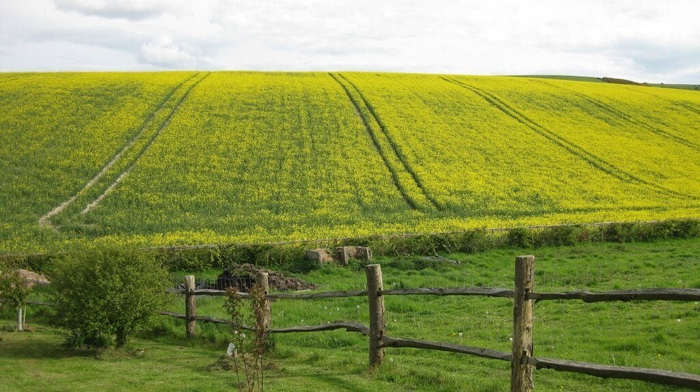

Volcanoes, those magnificent and powerful natural wonders, are formed through a fascinating process that occurs at divergent boundaries. At these divergent boundaries, where tectonic plates are moving apart, molten rock, gases, and debris manage to escape to the Earth's surface, resulting in the awe-inspiring eruptions of lava and ash that we associate with volcanoes. By understanding the formation of volcanoes at divergent boundaries, we gain valuable insights into their eruption patterns, hazards, and benefits. In this guide, we will explore the different types of volcanoes, their geographic distribution, eruption causes, and the risks and rewards they bring. So, prepare to embark on a journey of discovery as we uncover the mysteries behind how volcanoes form at divergent boundaries.

This image is property of pixabay.com.

## Understanding Divergent Boundaries

Divergent boundaries are a type of plate boundary where two tectonic plates are moving away from each other. This movement creates a gap, allowing magma from the Earth's mantle to rise to the surface and form new crust. This process is responsible for the formation of volcanic activity at divergent boundaries.

### Definition of Divergent Boundaries

Divergent boundaries occur where tectonic plates are moving apart. This can happen on land or beneath the ocean's surface. As the plates separate, magma from the mantle rises to fill the gap, creating new crust. The process of crust formation at divergent boundaries is known as seafloor spreading when it occurs in the ocean.

### Common Locations of Divergent Boundaries

Divergent boundaries can be found in various locations around the world. One of the most well-known examples of a divergent boundary is the Mid-Atlantic Ridge, which runs down the center of the Atlantic Ocean. Other common locations include the East African Rift Zone and the Red Sea Rift. These areas experience high volcanic activity due to the separation of tectonic plates.

## The Role of Plate Tectonics in Volcano Formation

Plate tectonics theory explains how the Earth's lithosphere is divided into several plates that float on the semi-fluid asthenosphere beneath them. These plates are in constant motion and interact with each other at plate boundaries. Volcano formation is closely linked to plate tectonics, as the movement and interaction of these plates are crucial for the creation of volcanic activity.

### Understanding Plate Tectonics Theory

Plate tectonics theory states that the Earth's lithosphere is divided into several large and small plates that move relative to each other. These plates are driven by convection currents in the mantle, which push the plates apart or cause them to collide. The interaction of these plates at their boundaries leads to the formation of various geological features, including volcanoes.

### Interaction Between Tectonic Plates

At divergent boundaries, tectonic plates move away from each other. This movement creates a gap, allowing magma from the mantle to rise to the surface. As the magma reaches the surface, it cools and solidifies, forming new crust. This process of crust formation is known as seafloor spreading when it occurs in the ocean. The interaction between tectonic plates at divergent boundaries is responsible for the continuous creation of new crust and the formation of volcanic activity.

  

## How Magma is Generated at Divergent Boundaries

Magma, the molten rock material beneath the Earth's surface, is generated at divergent boundaries through a process involving the melting of mantle rocks. The high heat and pressure at these boundaries cause the rocks to melt, forming magma that eventually rises to the surface and leads to volcanic eruptions.

### Process of Melting Mantle Rocks

The process of melting mantle rocks at divergent boundaries is a result of the increased heat and reduced pressure in these regions. As the tectonic plates move apart, the pressure on the mantle rocks decreases, causing them to partially melt. The melted rocks, or magma, then rise towards the surface, where they can erupt and form volcanoes.

### Role of Heat and Pressure in Magma Generation

Heat and pressure play a critical role in the generation of magma at divergent boundaries. The heat from the Earth's interior, combined with the reduced pressure caused by the separation of tectonic plates, allows the mantle rocks to reach their melting point. This melting process creates the molten rock material known as magma, which is essential for the formation of volcanoes.

## The Creation of the Central Rift

The central rift is a significant feature associated with the formation of volcanoes at divergent boundaries. It plays a crucial role in the development of volcanic activity and is formed as a result of the tectonic forces acting at the boundaries.

### Significance of the Central Rift in Volcano Formation

The central rift is a linear feature that forms along the axis of a divergent boundary. It serves as a conduit for the magma to rise from the mantle to the surface, leading to volcanic eruptions. The central rift helps channel the magma towards the surface, ensuring the formation of volcanoes at divergent boundaries.

### How Central Rifts are Formed

Central rifts are formed as a result of the tensional forces acting along divergent boundaries. These forces cause the crust to crack and break apart, creating a gap. Magma from the mantle then rises along this gap, forming the central rift. Over time, the repeated volcanic eruptions along the central rift lead to the formation of volcanoes.

This image is property of pixabay.com.

## Emergence of Volcanic Island Chains

In certain cases, the volcanic activity at divergent boundaries can result in the formation of volcanic island chains. These chains are formed as a result of the movement of tectonic plates and the eruption of magma along mid-oceanic ridges.

### Formation of Mid-Oceanic Ridges

Mid-oceanic ridges are long underwater mountain ranges that form at divergent boundaries in the oceans. They are created as magma rises to the surface along the central rift. As the magma cools and solidifies, it forms new crust, which gradually builds up to create a ridge. Over time, repeated volcanic activity along the mid-oceanic ridge can result in the emergence of volcanic islands.

### Birth of New Islands through Eruptions

The eruption of magma along mid-oceanic ridges can lead to the birth of new islands. As the volcanic activity continues, the accumulated lava and ash can form a cone-shaped landmass that rises above sea level. Over time, as the eruptions persist, these landmasses can develop into fully-fledged volcanic islands.

## Different Types of Volcanic Eruptions

Volcanic eruptions at divergent boundaries can exhibit various types, which are influenced by factors such as magma composition and gas content. These eruption types can range from effusive, where lava flows steadily, to explosive, where ash and pyroclastic materials are ejected violently into the air.

### Influence of Magma Composition on Eruption Type

The composition of magma plays a significant role in determining the type of volcanic eruption. Magma can vary in viscosity, which affects its ability to flow. Felsic magma, which has high silica content, is more viscous and tends to produce explosive eruptions. In contrast, mafic magma, with low silica content, is less viscous and typically results in effusive eruptions.

### The Effect of Gas Contents on Eruptions

The gas content of magma also influences the type of volcanic eruption. Dissolved gases, such as water vapor, carbon dioxide, and sulfur dioxide, can become trapped in magma. As the pressure on the magma decreases during an eruption, these gases can expand rapidly, causing the magma to explode violently. Therefore, higher gas contents in magma are associated with more explosive eruptions.

This image is property of pixabay.com.

## Physical Features of Volcanoes at Divergent Boundaries

Volcanoes at divergent boundaries can exhibit various physical features, including their shape and size. These features are influenced by factors such as eruption type, magma composition, and the specific geological conditions at the divergent boundary.

### Types of Volcanoes Formed at Divergent Boundaries

Several [types of volcanoes](https://magmamatters.com/understanding-volcanic-formation-a-comprehensive-guide/ "Understanding Volcanic Formation: A Comprehensive Guide") can be formed at divergent boundaries. Shield volcanoes, which have broad, gently sloping sides, are commonly found at these boundaries. They are typically formed when effusive eruptions of low viscosity lava occur. Another type is stratovolcanoes, which have steeper slopes and are formed by explosive eruptions of viscous lava. Cinder cones, characterized by steep sides and a symmetrical shape, can also form at divergent boundaries.

### Analysis of Volcano Morphology

The morphology, or shape, of a volcano can provide valuable information about its eruption history and the underlying geological processes. By analyzing the size, shape, and composition of a volcano, scientists can gain insights into the magma chamber's characteristics, eruption style, and the overall behavior of the volcano. This information is crucial for understanding the potential hazards associated with a volcano and predicting its future activity.

## Examples of Volcanoes Formed at Divergent Boundaries

To better understand the formation and characteristics of volcanoes at divergent boundaries, let's explore two specific examples: the Mid-Atlantic Ridge and the East African Rift Valley. These locations showcase the diverse range of volcanic activity that can occur at divergent boundaries.

### Investigation of the Mid-Atlantic Ridge

The Mid-Atlantic Ridge is an underwater mountain range that runs down the center of the Atlantic Ocean. It is one of the most well-known examples of a divergent boundary and is characterized by high volcanic activity. Along the ridge, magma rises to the surface, creating new crust and giving rise to volcanic eruptions. The Mid-Atlantic Ridge is associated with effusive eruptions, resulting in the formation of shield volcanoes.

### Case Study of the East African Rift Valley

The East African Rift Valley is a region in Eastern Africa where the African Plate is splitting apart. This divergent boundary has led to the formation of a series of valleys, lakes, and volcanoes. The volcanic activity in the East African Rift Valley is primarily effusive, resulting in the formation of shield volcanoes such as Mount Kilimanjaro and Mount Nyiragongo. These volcanoes are prominent features of the region and attract both scientific interest and tourism.

## Impacts of Volcanic Eruptions on Local Environments

Volcanic eruptions at divergent boundaries can have both positive and negative impacts on the local environment. While they can pose significant hazards to nearby communities, volcanic eruptions also provide benefits to the surrounding ecosystem.

### Hazards Posed by Volcanic Eruptions

Volcanic eruptions at divergent boundaries can pose several hazards to nearby communities. These hazards include lava flows, pyroclastic flows, ashfall, volcanic gases, lahars (mudflows), and volcanic landslides. These hazards can cause significant damage to infrastructure, harm human health, and disrupt ecosystems. Therefore, it is crucial to understand and mitigate these hazards to protect vulnerable populations.

### Benefits of Volcanoes to the Local Ecosystem

Despite the hazards associated with volcanic eruptions, volcanoes also provide several benefits to the local ecosystem. The ash produced during eruptions is rich in nutrients and can fertilize the soil, making it highly fertile. This fertile soil supports the growth of vegetation and can benefit agriculture. Additionally, volcanic activity can create new landforms and habitats, promoting biodiversity and providing opportunities for scientific research.

## Predicting Future Volcanic Activity at Divergent Boundaries

Predicting future volcanic activity at divergent boundaries is crucial for mitigating risks to surrounding communities. By monitoring various indicators, scientists can make informed predictions about when and where eruptions are likely to occur.

### Monitoring Techniques for Predicting Eruptions

Scientists utilize various monitoring techniques to predict volcanic eruptions at divergent boundaries. These techniques include seismic [monitoring to detect ground vibrations, gas monitoring to measure changes in volcanic gases](https://magmamatters.com/the-art-and-science-of-volcano-monitoring/ "The Art and Science of Volcano Monitoring"), thermal monitoring to detect temperature changes, and ground deformation monitoring to measure changes in the shape of the volcano. By analyzing these data, scientists can identify patterns and potential signs of volcanic unrest, enabling them to issue timely warnings.

### Mitigating Risks to Surrounding Communities

Mitigating the risks associated with volcanic eruptions at divergent boundaries involves a combination of preparedness, monitoring, and education. Local communities need to be aware of the potential hazards and have robust evacuation plans in place. Monitoring networks should be established to detect signs of volcanic unrest, allowing authorities to make informed decisions and issue timely warnings. Additionally, ongoing research and collaboration between scientists, communities, and government agencies are crucial for effective risk mitigation efforts.

In conclusion, the formation and characteristics of volcanoes at divergent boundaries are fascinating and complex. The movement and interaction of tectonic plates play a crucial role in the generation of magma and the subsequent formation of volcanic activity. Understanding the processes involved in volcano formation, eruption types, and the impacts on local environments is vital for predicting future volcanic activity and mitigating risks to surrounding communities. By studying and monitoring volcanoes at divergent boundaries, scientists can continue to expand our knowledge and develop strategies to protect vulnerable populations.

Related Posts: [Mitigating Risks: Forecasting Volcanic Activity in Prone Areas](https://magmamatters.com/mitigating-risks-forecasting-volcanic-activity-in-prone-areas/), [The Formation and Eruption Patterns of Volcanoes](https://magmamatters.com/the-formation-and-eruption-patterns-of-volcanoes-4/), [The Pyroclastic Phenomena of Pompeii: 7 Insights to Explore](https://magmamatters.com/the-pyroclastic-phenomena-of-pompeii-7-insights-to-explore/), [Tips for Capturing Volcano Pyroclastic Flow Photos](https://magmamatters.com/tips-for-capturing-volcano-pyroclastic-flow-photos/), [Understanding Volcanoes and Their Eruption Patterns](https://magmamatters.com/understanding-volcanoes-and-their-eruption-patterns/)
