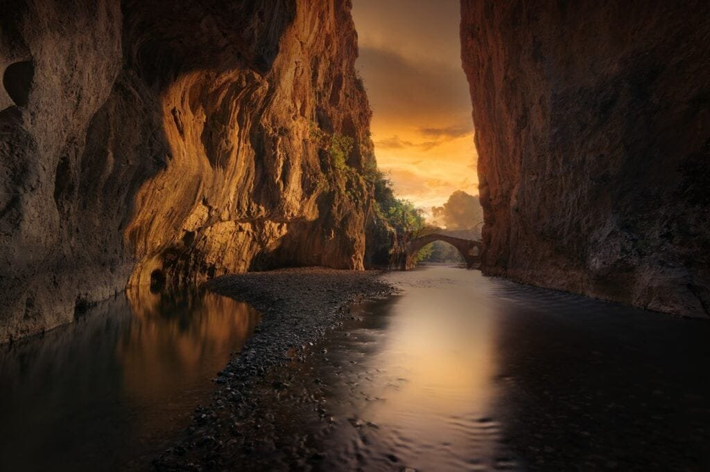

Volcanoes have a remarkable impact on Earth's geology, shaping the very landscapes we see today. They are formed when molten rock, gases, and debris escape to the surface, resulting in eruptions of lava and ash. These powerful formations can be found along plate boundaries, hotspots beneath the Earth's crust, or rift zones. From the explosive eruptions in the "Ring of Fire" to the gradual formation of shield volcanoes in Hawaii, each type of volcano displays unique eruption patterns determined by factors such as lava viscosity and gas content. While volcanic activity provides essential nutrients to soil, it can also bring about devastating natural disasters. Understanding the behavior of volcanoes is crucial in predicting future eruptive activity and minimizing risks to nearby communities. By exploring the different types of volcanoes, their geographic distribution, eruption causes, hazards, and benefits, we can gain a deeper understanding of these fascinating natural phenomena. In this article, we will delve into the three best ways volcanoes shape Earth's geology, offering valuable insight into their significant role in our planet's formation and ongoing evolution.

<iframe width="560" height="315" src="https://www.youtube.com/embed/bHNDRquJ8U8" frameborder="0" allow="accelerometer; autoplay; encrypted-media; gyroscope; picture-in-picture" allowfullscreen></iframe>

  

## Formation and Types of Volcanoes

Volcanoes are fascinating geological formations that are formed when molten rock, gases, and debris escape to the Earth's surface, resulting in eruptions of lava and ash. The nature and composition of volcanoes can vary, but they all share the common characteristic of being created by the movement of molten rock, or magma.

There are several different types of volcanoes, each with its own unique features. One of the most well-known types is the stratovolcano, which is characterized by its steep slopes and conical shape. These volcanoes are formed from layers of lava, ash, and other volcanic materials that have built up over time. Mount Fuji in Japan and Mount St. Helens in the United States are examples of stratovolcanoes.

Another [type of volcano is the shield](https://magmamatters.com/understanding-volcanic-formation-a-comprehensive-guide/ "Understanding Volcanic Formation: A Comprehensive Guide") volcano, which is much broader and flatter in shape compared to stratovolcanoes. These volcanoes are formed by the gradual accumulation of thin, runny lava that spreads out in all directions. The Hawaiian Islands are a prime example of shield volcanoes, with Mauna Loa being one of the largest shield volcanoes in the world.

In addition to stratovolcanoes and shield volcanoes, there are also [cinder cone](https://magmamatters.com/the-birth-of-new-land-understanding-cinder-cones/) volcanoes and composite volcanoes. Cinder cone volcanoes are small, steep-sided volcanoes that are formed from the accumulation of volcanic cinders and ash. They are typically short-lived and can be found in various regions around the world. Composite volcanoes, also known as composite cones or stratovolcanoes, are tall, conical volcanoes that are made up of alternating layers of lava, ash, and other volcanic materials. These types of volcanoes are known for their explosive eruptions and are often found in areas where tectonic plates collide.

The formation of volcanoes is a complex process that involves various factors such as plate tectonics and the movement of magma. Volcanoes can form at sites along plate boundaries, where tectonic plates are either colliding, moving apart, or sliding past each other. These plate boundaries provide pathways for magma to reach the surface, resulting in volcanic eruptions. Volcanoes can also form at hotspots, which are areas beneath the Earth's crust where magma is able to rise to the surface. Hotspots are often associated with volcanic activity that is not directly related to plate boundaries. Finally, volcanoes can form in rift zones, which are areas where the Earth's tectonic plates are moving apart, creating gaps that allow magma to rise and form new volcanic features.

Understanding the formation and types of volcanoes is crucial in comprehending the various ways in which they shape the Earth's geology. From the explosive eruptions of stratovolcanoes to the gradual buildup of shield volcanoes, the diversity of volcanic formations contributes to the rich geological landscape of our planet.

## Geographical Distribution of Volcanoes

Volcanoes are found in various locations around the world, with some areas being more prone to volcanic activity than others. The distribution of volcanoes is closely tied to the movement of tectonic plates, which make up the Earth's crust.

One of the most well-known volcanic regions is the "Ring of Fire," which encircles the Pacific Ocean. This area is highly prone to volcanic activity, as it encompasses many plate boundaries where tectonic plates are colliding or sliding past each other. The Ring of Fire is home to numerous active volcanoes, including Mount St. Helens in the United States, Mount Fuji in Japan, and Mount Pinatubo in the Philippines.

In addition to the Ring of Fire, there are other regions around the world that have a high concentration of volcanoes. These include the East African Rift, which is an area where the African continent is slowly splitting apart, and the Mediterranean region, which is characterized by the presence of volcanoes such as Mount Etna in Italy and Santorini in Greece.

The distribution of volcanoes is directly influenced by the movement of tectonic plates. When two plates collide, one plate may be forced beneath the other in a process known as subduction. This subduction zone is often associated with the formation of volcanoes, as the subducting plate releases water and other volatiles into the mantle, triggering the melting of rocks and the formation of magma. This magma then rises to the surface, resulting in volcanic eruptions.

In contrast, when two plates move apart, such as in a divergent plate boundary, magma from the mantle can rise to fill the gap, forming new volcanic features. This is particularly evident in rift zones, where the Earth's crust is being pulled apart, creating a pathway for magma to reach the surface. The East African Rift is a prime example of this process, with volcanoes such as Mount Kilimanjaro and Nyiragongo being formed as a result of the rifting.

Understanding the geographical distribution of volcanoes is essential for predicting future volcanic activity and mitigating risks to surrounding communities. By studying the patterns of volcanic activity and the movement of tectonic plates, scientists can better understand the potential hazards associated with volcanic eruptions and take measures to protect those who may be affected.

This image is property of pixabay.com.

## Causes of Volcanic Eruptions

Volcanic eruptions are awe-inspiring displays of the Earth's power, but what causes these explosive events? The primary factors that contribute to volcanic eruptions include the role of magma, gas pressure, and tectonic movement.

Magma, a molten mixture of rock, gases, and other substances, plays a crucial role in causing volcanic eruptions. Magma forms beneath the Earth's surface when rocks in the mantle melt due to high temperatures or the addition of volatiles, such as water or carbon dioxide. As magma rises towards the surface, it encounters lower pressure, allowing dissolved gases within the magma to expand and form bubbles. These gas bubbles exert a tremendous amount of pressure on the surrounding magma, eventually causing it to rupture and escape explosively during an eruption.

The gas content of magma is another critical factor in determining the explosivity of a volcanic eruption. Magma can contain various volatile gases, including water vapor, carbon dioxide, and sulfur dioxide. The higher the gas content of the magma, the more explosive the eruption is likely to be. This is because the dissolved gases in the magma expand rapidly when the pressure decreases during ascent, leading to a violent release of gas and magma. In contrast, magma with a lower gas content may erupt more effusively, with the lava flowing more steadily rather than explosively.

Tectonic movement, particularly at plate boundaries, can also trigger volcanic eruptions. When tectonic plates collide or slide past each other, the intense pressure and friction can generate enough energy to rupture the Earth's crust, allowing magma to reach the surface. Subduction zones, where one tectonic plate is forced beneath another, are especially prone to volcanic activity. As the subducting plate descends into the mantle, it releases water and other volatiles, which trigger the melting of rocks and the formation of magma. This magma then rises to the surface, resulting in explosive volcanic eruptions.

Understanding the causes of volcanic eruptions is crucial for monitoring and predicting volcanic activity. By studying the composition of magma, the gas content, and the movement of tectonic plates, scientists and volcanologists can better assess the potential hazards associated with volcanic eruptions and issue timely warnings to at-risk communities.

## Volcanic Eruption Patterns

Volcanic eruptions can vary greatly in their intensity, style, and duration. Understanding different types of volcanic eruptions and the factors that influence eruption patterns is essential for comprehending the behavior of volcanoes.

There are several types of volcanic eruptions commonly observed. One of the most explosive types is a Plinian eruption, named after the Roman historian Pliny the Younger, who witnessed the eruption of Mount Vesuvius in AD 79. Plinian eruptions are characterized by the ejection of vast quantities of ash, volcanic gases, and pyroclastic materials into the atmosphere. They usually produce a tall eruption column and can release large amounts of pyroclastic flows, which are fast-moving currents of hot gas, ash, and volcanic debris. Plinian eruptions are highly explosive and can have severe impacts on the surrounding environment and human settlements.

Another type of volcanic eruption is the Vulcanian eruption, which is characterized by short, violent explosions that expel gas, ash, and volcanic bombs. These eruptions are named after the Roman god of fire, Vulcan, and are often associated with stratovolcanoes. Vulcanian eruptions can produce eruption columns that reach several kilometers in height and can generate powerful pyroclastic flows.

In contrast to the explosive eruptions of Plinian and Vulcanian types, some volcanoes also exhibit effusive eruptions, where lava flows steadily from the vent. These eruptions occur when magma that is relatively low in gas content reaches the surface and allows the lava to flow smoothly. Effusive eruptions can create lava fountains, lava lakes, and lava flows that can travel significant distances, gradually building up new volcanic landforms. Examples of effusive eruptions include the eruptions of Hawaiian shield volcanoes, such as Kilauea and Mauna Loa, which regularly produce flows of runny lava.

Various factors can influence eruption patterns, including the composition and viscosity of the magma, the gas content, and the size of the volcanic conduit through which the magma is released. Magma with a high silica content tends to be more viscous, meaning it is thicker and more resistant to flowing. This high viscosity can result in the buildup of pressure within the volcanic conduit, leading to explosive eruptions. In contrast, magma with a low silica content is more fluid and can flow more easily, resulting in less explosive eruptions.

The gas content of magma also plays a significant role in eruption patterns. Magma with a high gas content tends to be more volatile and can generate more explosive eruptions. The dissolved gases within the magma expand rapidly as pressure decreases during ascent, leading to a violent release of gas and magma. In contrast, magma with a lower gas content may erupt more effusively, with the lava flowing more steadily rather than explosively.

The size and geometry of the volcanic conduit, or the pathway through which magma reaches the surface, can influence eruption patterns as well. Conduits that are narrower or have irregular shapes can cause increased pressure and result in explosive eruptions. In contrast, wider and more open conduits can allow magma to flow more freely, leading to effusive eruptions.

Understanding the various factors that influence eruption patterns is critical for assessing volcanic hazards and formulating appropriate mitigation strategies. By analyzing the composition of magma, the gas content, and the characteristics of the volcanic conduit, scientists can better predict the behavior of volcanoes and take measures to protect at-risk communities.

This image is property of pixabay.com.

## Effects of Volcanic Eruptions on the Atmosphere

Volcanic eruptions have far-reaching effects on the atmosphere, influencing climate patterns, atmospheric composition, and even air travel. The release of volcanic gases and the injection of ash particles into the atmosphere can have significant impacts on both regional and global scales.

One of the most notable effects of volcanic eruptions on the atmosphere is their influence on climate. Volcanoes release large quantities of gases, including water vapor, carbon dioxide, sulfur dioxide, and chlorine. These gases can reach the upper atmosphere, where they can persist for long periods and have a cooling effect on the climate. Sulfur dioxide, in particular, can react with water vapor to form tiny particles called aerosols, which can reflect sunlight back into space, leading to a temporary cooling effect.

The injection of volcanic ash particles into the atmosphere can also have profound effects on regional and global climate patterns. Ash particles ejected during volcanic eruptions can be carried by wind currents for thousands of kilometers, spreading over vast areas. These fine particles can scatter and absorb sunlight, resulting in a decrease in surface temperatures. Additionally, ash particles can act as nuclei for cloud formation, leading to the formation of larger and more persistent clouds. These clouds can reflect more sunlight back into space, further contributing to the cooling effect.

The impact of volcanic eruptions on climate can be both short-term and long-lasting. Larger volcanic eruptions, such as the 1815 eruption of Mount Tambora in Indonesia, can release immense quantities of gases and ash into the atmosphere, resulting in a significant cooling effect that can last for years. The cooling caused by such eruptions can lead to changes in precipitation patterns, with some regions experiencing droughts while others see increased rainfall.

Another notable impact of volcanic eruptions on the atmosphere is their influence on atmospheric composition. Volcanoes release large amounts of gases, including carbon dioxide, which is one of the main greenhouse gases responsible for global warming. While volcanic emissions of carbon dioxide are significant, they are dwarfed by human activities, such as the burning of fossil fuels. However, volcanic emissions can contribute to short-term fluctuations in atmospheric carbon dioxide concentrations.

[Volcanoes can also release sulfur dioxide](https://magmamatters.com/the-art-and-science-of-volcano-monitoring/ "The Art and Science of Volcano Monitoring"), which can react with water vapor in the atmosphere to form sulfuric acid. This sulfuric acid can then combine with water molecules to form tiny aerosols, which can scatter sunlight and contribute to the formation of clouds. In addition to sulfur dioxide, volcanoes can emit other gases such as hydrogen chloride and hydrogen fluoride, which can react with water vapor to form hydrochloric acid and hydrofluoric acid. These acids can contribute to the acidity of rain, leading to what is known as acid rain.

The release of volcanic ash particles into the atmosphere can have significant impacts on air travel. Ash particles can pose a serious threat to aircraft engines, as they can cause engine damage and potentially lead to engine failure. Therefore, when a volcano erupts and releases ash into the atmosphere, it is necessary to close airspace to ensure the safety of flights. The eruption of Eyjafjallajökull in Iceland in 2010, for example, resulted in the closure of airspace over Europe for several days, causing widespread disruption to air travel.

Understanding the effects of volcanic eruptions on the atmosphere is vital for assessing their potential impacts on climate, air quality, and aviation. By studying the gases and ash particles released during eruptions and monitoring their dispersion in the atmosphere, scientists can better predict and mitigate the consequences of volcanic activity.

## Impact of Volcanoes on Soil Fertility

Volcanic eruptions have both short-term and long-term impacts on soil fertility. While volcanic ash and other materials ejected during eruptions can provide valuable nutrients to the soil, the destructive nature of eruptions can also have detrimental effects on agricultural lands.

One of the most significant contributions of volcanic eruptions to soil fertility is through the deposition of volcanic ash. Ash particles, which range in size from fine dust to larger clasts, can blanket the surrounding landscape following an eruption. As ash particles settle onto the soil surface, they introduce a wide range of essential nutrients, including nitrogen, phosphorus, potassium, and trace elements. These nutrients are derived from the underlying magma and can enhance soil fertility, promoting plant growth and crop productivity.

The mineral composition of volcanic ash also plays a role in soil fertility. Ash particles are typically composed of a variety of minerals, such as pyroxenes, feldspars, and glass shards. These minerals weather over time, releasing additional nutrients and minerals into the soil. The weathering of volcanic ash can contribute to the development of highly fertile soils, known as volcanic soils or Andisols, which are renowned for their high nutrient content and water-holding capacity.

However, while volcanic eruptions can provide a valuable influx of nutrients to the soil, the destructive nature of eruptions can also have significant negative impacts on agricultural lands. The rapid deposition of volcanic ash can bury crops and vegetation, leading to their destruction. Ash can also contaminate water sources, making them unsuitable for irrigation and drinking. Additionally, the presence of volcanic gases, such as sulfur dioxide, can lead to the formation of acid rain, which can further damage crops and soil.

The long-term impacts of volcanic eruptions on soil fertility can also be influenced by factors such as erosion and the leaching of nutrients. The loose and porous nature of volcanic ash can make it susceptible to erosion by wind and water. Erosion can remove valuable topsoil and nutrients from the landscape, reducing soil fertility over time. Similarly, heavy rainfall can lead to the leaching of nutrients from the ash layer, causing them to be washed away before plants can access them.

Understanding [the role of volcanic](https://magmamatters.com/the-role-of-volcanoes-in-earths-carbon-cycle-5/ "The Role Of Volcanoes In Earth’s Carbon Cycle") eruptions in soil fertility is crucial for managing agricultural lands in volcanic regions. Farmers and land managers in volcanic areas must consider both the potential benefits and risks associated with volcanic activity. By implementing practices such as ash removal, erosion control measures, and the replenishment of essential nutrients, the impacts of volcanic eruptions on soil fertility can be mitigated, allowing for sustainable agriculture in volcanic regions.

This image is property of pixabay.com.

## Volcano-Induced Natural Disasters

Volcanic eruptions can trigger various natural disasters, which can have devastating impacts on human lives, infrastructure, and the natural environment. The structure and characteristics of pyroclastic flows, the causes and impacts of volcanic tsunamis, and the effects of lava flows are all significant aspects of volcano-induced natural disasters.

[Pyroclastic flows are one of the most lethal volcanic hazards](https://magmamatters.com/the-environmental-impact-of-volcanic-eruptions-2/ "The Environmental Impact of Volcanic Eruptions"), capable of traveling at high speeds and obliterating everything in their path. These flows are composed of a mixture of hot gas, ash, and volcanic debris that cascades down the slopes of a volcano. Pyroclastic flows are generated during explosive volcanic eruptions when the collapse of eruption columns generates a dense, fast-moving current of hot materials. The extreme heat, velocity, and density of pyroclastic flows make them highly destructive, capable of incinerating vegetation, destroying buildings, and causing severe burns to anyone caught in their path. Mount Vesuvius's eruption in AD 79, which buried the Roman cities of Pompeii and Herculaneum, is a famous example of the devastating power of pyroclastic flows.

Volcanic eruptions can also trigger tsunamis, which are large ocean waves that can travel across vast distances and cause widespread destruction along coastlines. When a volcanic eruption occurs beneath or near a body of water, it can generate a sudden displacement of water, resulting in the formation of a tsunami. Tsunamis generated by volcanic activity have the potential to be extremely destructive, as they can inundate coastal areas, carry away buildings and infrastructure, and cause loss of life. The eruption of Krakatoa in 1883, which triggered a series of tsunamis that claimed tens of thousands of lives, is a tragic example of the devastation that volcanic tsunamis can cause.

Lava flows are another significant hazard associated with volcanic eruptions, although they tend to be slower-moving and less immediately destructive compared to pyroclastic flows. Lava flows occur when molten rock, or lava, erupts from a volcano and flows downslope. The speed and viscosity of the lava determine its movement: low-viscosity lava can flow quickly, while high-viscosity lava moves more slowly. Although lava flows generally advance at a slow pace, often giving people time to evacuate, they can still destroy structures, cover vegetation, and alter the landscape. The Hawaiian Islands are known for their frequent lava flows, with Kilauea volcano being particularly active in recent years.

Understanding the structure and characteristics of pyroclastic flows, the causes and impacts of volcanic tsunamis, and the effects of lava flows is crucial for assessing and mitigating the risks associated with volcano-induced natural disasters. By studying past eruptions and monitoring volcanic activity, scientists and emergency management officials can better predict and prepare for these hazards, minimizing the loss of life and property.

## Prevention and Mitigation of Volcanic Hazards

Preventing and mitigating volcanic hazards is essential for safeguarding lives, infrastructure, and the natural environment. The prediction of volcanic eruptions, the role of geology in managing volcanic risks, and the effects of urban planning in volcano-prone areas are all crucial aspects of preventing and minimizing the impact of volcanic hazards.

Predicting volcanic eruptions is a challenging task that requires monitoring various parameters associated with volcanic activity. Volcanologists use a variety of techniques, including seismology, gas monitoring, ground deformation measurements, and thermal imaging, to track changes in volcanic behavior. By analyzing these data, scientists can identify patterns and signals that may indicate an impending eruption. While it is not yet possible to predict volcanic eruptions with complete accuracy, these monitoring techniques can provide valuable insights and allow for timely warnings.

Geology plays a significant role in managing volcanic risks by providing insights into volcanic processes, behavior, and hazard assessment. Understanding the geological history of a particular volcano can help in identifying potential hazards and evaluating risks. By studying past eruptions, scientists can gain knowledge about the frequency, magnitude, and style of volcanic activity, enabling them to make informed decisions regarding land use planning, emergency response, and evacuation procedures. Geological mapping and hazard assessments are crucial tools in managing volcanic risks and ensuring the safety of nearby communities.

Urban planning in volcano-prone areas is another critical aspect of preventing and mitigating volcanic hazards. By carefully considering the location and design of infrastructure, communities can reduce their vulnerability to volcanic eruptions. Building codes and regulations can incorporate provisions for volcanic hazards, such as ash fallout, pyroclastic flows, and lahars (volcanic mudflows). Establishing designated evacuation routes, emergency shelters, and communication systems can help facilitate a swift and organized response in the event of an eruption. Furthermore, community education and awareness programs can ensure that residents are well-informed about volcanic risks and know how to respond effectively.

The prevention and mitigation of volcanic hazards require a multi-faceted approach that encompasses scientific research, collaboration between different stakeholders, and community involvement. By combining the efforts of volcanologists, geologists, emergency management officials, and local communities, it is possible to minimize the impacts of volcanic eruptions and protect the well-being of those living in volcano-prone areas.

## Volcanoes as Sources of Geothermal Energy

[Volcanoes are not only powerful geological](https://magmamatters.com/geothermal-energy-and-its-volcanic-origins/ "Geothermal Energy and Its Volcanic Origins") phenomena but also valuable sources of geothermal energy. Geothermal energy harnesses the heat stored within the Earth to generate electricity, heat buildings, and provide other forms of useful energy. Volcanoes play a crucial role in producing geothermal energy due to the availability of high-temperature rocks and fluids.

Volcanoes produce geothermal energy through a process known as hydrothermal circulation. This process takes place when water seeps into the ground and is heated by the hot rocks and magma beneath the Earth's surface. As the water heats up, it becomes less dense and rises to the surface, forming hot springs and geysers. By tapping into these hot fluids, geothermal power plants can generate electricity using steam or hot water. The steam drives a turbine, which then spins a generator to produce electrical power. The hot water can also be used directly for heating purposes, such as in district heating systems or geothermal heat pumps.

Volcanoes are particularly suitable for geothermal energy extraction due to their proximity to high-temperature rocks and magma reservoirs. In areas of active or recent volcanic activity, the heat transferred from the magma chamber to the surrounding rocks can create geothermal reservoirs with temperatures above 300 degrees Celsius. These reservoirs can be accessed through wells drilled deep into the ground, allowing for the extraction of steam or hot water.

However, harnessing geothermal energy from volcanoes is not without its challenges. The high-temperature and corrosive nature of the fluids extracted from geothermal reservoirs can cause wear and tear on equipment, requiring regular maintenance and monitoring. Additionally, the location of geothermal reservoirs within volcanic regions can pose logistical challenges, as they are often remote or located in environmentally sensitive areas. These factors need to be carefully considered in order to ensure the sustainable and responsible extraction of geothermal energy.

The benefits of harnessing geothermal energy from volcanoes are numerous. Geothermal power is a renewable and environmentally friendly energy source that produces minimal greenhouse gas emissions. It can provide a steady and reliable source of electricity, reducing dependence on fossil fuels and enhancing energy security. Geothermal energy can also have significant socioeconomic benefits, such as job creation, local economic development, and reduced energy costs for the surrounding communities.

By tapping into the abundant heat resources found within volcanoes, we can harness the power of geothermal energy to meet our energy needs in a sustainable and environmentally friendly manner. Continued research, technological advancements, and careful planning are key to maximizing the potential of geothermal energy from volcanoes and ensuring its long-term viability as a clean energy source.

## Impact of Volcanoes on the Geologic Time Scale

Volcanic activity has played a significant role in shaping the Earth's geologic history and has left a lasting impact on the geological time scale. Volcanoes have contributed to the formation of geologic eras, influenced the evolution of life on Earth, and shaped the structure of the Earth's crust.

Volcanoes have been active throughout the Earth's history, with evidence of volcanic activity dating back billions of years. The continuous eruption of lava and the release of volcanic gases have contributed to the formation and alteration of the Earth's crust. Volcanic eruptions inject new materials, such as lava and ash, into the Earth's surface, adding layers of volcanic rocks to the geologic record. These layers provide valuable information about past geological events, environmental conditions, and the evolution of the Earth's crust over time.

The formation of geologic eras, such as the Mesozoic Era (Age of Dinosaurs) and the Cenozoic Era (Age of Mammals), has been influenced by volcanic activity. Large-scale volcanic eruptions, known as flood basalt events, have occurred throughout Earth's history, resulting in the widespread deposition of basaltic lava flows. These flood basalt events mark significant geological boundaries and have been associated with major shifts in climate, ocean chemistry, and the extinction or evolution of species.

Volcanic activity has also had a profound impact on the evolution of life on Earth. Volcanoes have released gases and other substances into the atmosphere, altering its composition and influencing the climate. Changes in the climate, such as global warming or cooling, can have significant effects on ecosystems, leading to the extinction or adaptation of species. Volcanic eruptions can also create new habitats and landforms, providing opportunities for the colonization and diversification of life.

In addition to their impact on geologic eras and the evolution of life, volcanoes have played a crucial role in the formation and structure of the Earth's crust. Volcanic activity is closely associated with tectonic processes, which shape the Earth's surface and influence the location and structure of continents, ocean basins, and mountain ranges. The eruption of volcanic materials can contribute to the uplift of land, the formation of new mountains, and the creation of volcanic islands. Volcanic processes are integral to the dynamic nature of the Earth's crust and the ongoing reshaping of its surface.

By studying the formation and activity of volcanoes, scientists can gain insights into the Earth's geologic history and its ongoing processes. The analysis of volcanic rocks, the examination of volcanic features, and the monitoring of volcanic activity all contribute to our understanding of the Earth's geology and its place in the vast expanse of geologic time.

