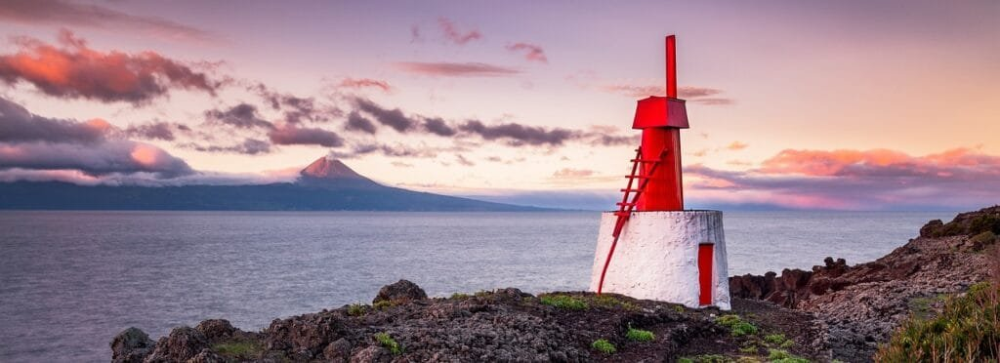
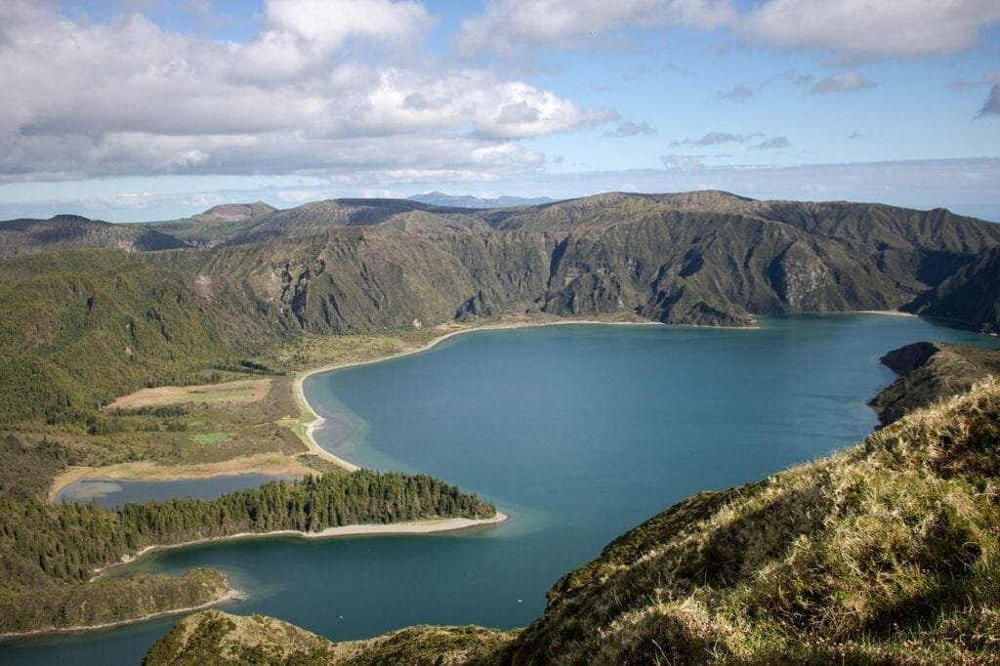
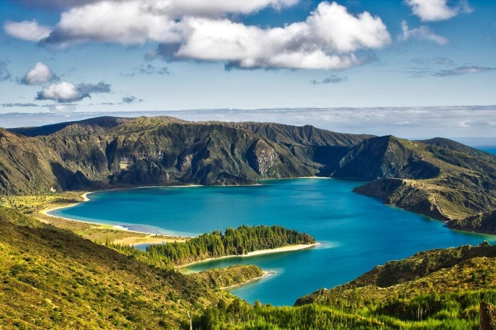

Volcanoes have long been a source of fascination for scientists and adventurers alike. From their awe-inspiring eruptions to the landscapes they shape, these natural wonders have a significant impact on the world around them. But what about their effect on biodiversity? In this comprehensive guide, we will explore how volcanoes influence the delicate balance of life on Earth. We will delve into the various types of volcanoes, their geological origins, and the factors that contribute to their explosive eruptions. By understanding the intricate relationship between volcanoes and biodiversity, we can gain valuable insights into the ecological resilience of our planet and the steps we can take to protect and preserve it. So fasten your seatbelts and get ready for a thrilling journey into the fascinating world of volcanic influence on biodiversity!

This image is property of pixabay.com.

## Understanding Volcanology

Volcanology is the scientific study of volcanoes, their formation, eruptions, and the various factors that influence their behavior. By studying volcanology, scientists can better understand the impact of volcanic activity on the environment and biodiversity. This article will provide a comprehensive guide to understanding the various aspects of volcanology and how it relates to biodiversity.

### Basics of Volcanic Eruptions

Volcanic eruptions are the result of the release of molten rock, gases, and debris from the Earth's interior onto its surface. These eruptions can be explosive or effusive, depending on the type of volcano and the composition of the erupted material. Explosive eruptions occur when gas-rich magma reaches the surface and rapidly expands, leading to powerful explosions and the ejection of volcanic ash and pyroclastic flows. Effusive eruptions, on the other hand, involve the slow and steady release of lava from the volcano's vents.

### Types of Volcanoes

There are several types of volcanoes, each with its own unique characteristics and eruption styles. The most common types include stratovolcanoes, shield volcanoes, cinder cones, and composite volcanoes. Stratovolcanoes, also known as composite volcanoes, are tall and conical in shape, with steep sides made up of layers of volcanic ash, lava, and volcanic rocks. Shield volcanoes, on the other hand, are broad and low-profile volcanoes characterized by gently sloping sides and a large crater at the summit. Cinder cones are small, steep-sided volcanoes formed by the accumulation of loose pyroclastic materials. Composite volcanoes, also known as stratovolcanoes, are a combination of both shield volcanoes and cinder cones, with alternating layers of lava and pyroclastic deposits.

### The Geographic Distribution of Volcanoes

Volcanoes are not evenly distributed across the Earth's surface but are concentrated in specific regions. The majority of volcanoes are located along plate boundaries, where tectonic plates collide or separate. The Pacific Ring of Fire, for example, is a region encircling the Pacific Ocean that is known for its high concentration of [active volcanoes and frequent seismic](https://magmamatters.com/the-art-and-science-of-volcano-monitoring/ "The Art and Science of Volcano Monitoring") activity. Other volcanic hotspots can be found in areas such as Iceland, the East African Rift, and Hawaii. Understanding the geographic distribution of volcanoes is crucial for predicting future eruptions and assessing their potential impact on biodiversity.

### Variables influencing eruption patterns

Several factors can influence the eruption patterns of volcanoes. One of the key factors is the viscosity of the magma, which is determined by its composition and temperature. Magma with low viscosity is more fluid and tends to erupt in a gentle and effusive manner, producing lava flows. In contrast, magma with high viscosity is more sticky and tends to erupt explosively, leading to the formation of pyroclastic flows and ash clouds. The gas content of magma also plays a significant role in eruption patterns. High gas content can cause explosive eruptions by rapidly expanding and fragmenting the magma. Additionally, the presence of a volcanic vent or conduit can influence the direction and intensity of volcanic eruptions.

## Volcanoes and the Environment

Volcanic eruptions have a profound impact on the environment, shaping landscapes and influencing climate patterns. Understanding these effects is essential for comprehending their relationship with biodiversity.

### Volcanic Influence on Landscape

Volcanic eruptions can drastically alter the physical landscape, creating new landforms and modifying existing ones. Lava flows, for example, can form large plateaus or create new islands when they reach the ocean. The deposition of volcanic ash and pyroclastic materials can also lead to the formation of volcanic cones and craters, further shaping the landscape. Over time, volcanic activity can create diverse and unique geological features, providing habitats for various species and contributing to overall biodiversity.

### Impact of Volcanic Eruptions on the Climate

Volcanic eruptions can have a significant impact on the Earth's climate, both in the short term and long term. The release of volcanic gases and aerosols, such as sulfur dioxide and ash, into the atmosphere can reflect sunlight and cause a temporary cooling effect. This phenomenon, known as volcanic winter, can result in lower global temperatures and altered weather patterns. In some cases, large [volcanic eruptions have even caused global climate changes](https://magmamatters.com/geothermal-energy-and-its-volcanic-origins/ "Geothermal Energy and Its Volcanic Origins") and influenced the distribution of species. Understanding the climate impact of volcanic eruptions is crucial for assessing the potential consequences for biodiversity.

### Volcanic Soils and Agriculture

While volcanic eruptions can cause widespread destruction, they can also have positive effects on the environment, particularly in terms of soil fertility. Volcanic ash and lava contain various minerals and nutrients that can enrich the soil, making it highly fertile for agriculture. Volcanic soils, known as Andisols, are characterized by their high water-holding capacity and nutrient retention. These unique soil properties support the growth of diverse plant species and contribute to agricultural productivity. However, the availability of volcanic soils for agriculture depends on various factors, such as the proximity of the eruption and the type of eruption material.

This image is property of pixabay.com.

## The Role of Volcanoes in Shaping Biodiversity

Volcanic eruptions play a significant role in shaping biodiversity, both in terms of creating new habitats and influencing the evolution of species.

### Species Colonization Following Volcanic Eruptions

Volcanic eruptions can create new habitats by depositing volcanic materials and altering the landscape. These newly formed habitats provide opportunities for colonization by pioneer species. Only a few years after a volcanic eruption, plant life can start to establish itself on barren volcanic terrain. As time progresses, more species colonize the area, leading to the development of diverse plant communities. These newly created habitats eventually attract various animal species, resulting in an increase in biodiversity.

### Creation of Unique Habitats

Volcanic eruptions can give rise to unique habitats that are not found in other environments. For example, lava tubes formed during volcanic eruptions can provide shelter for various species, including bats and invertebrates. Volcanic craters and calderas can also serve as protected microenvironments, offering refuge for rare and endemic species. The distinct physical and chemical properties of volcanic habitats create specialized ecological niches that support the survival of unique plant and animal species.

### Volcanic Influence on Genetic Isolation

Volcanic activity can lead to genetic isolation, a process in which populations of species become genetically distinct from one another. The formation of geographical barriers, such as lava flows or newly formed islands, can physically separate populations and prevent gene flow between them. Over time, this isolation can lead to the development of new species through the accumulation of genetic differences. Volcanic islands, in particular, have been recognized as hotspots of speciation due to their isolated nature and unique environmental conditions. Understanding the role of volcanoes in genetic isolation is essential for unraveling the evolutionary history and biodiversity of specific regions.

## Benefits of Volcanoes to Biodiversity

Despite the potential hazards and destruction caused by volcanic eruptions, volcanoes also provide several benefits to biodiversity.

### Volcanic Soils Enhancing Primary Productivity

Volcanic soils are known for their high fertility, which can greatly enhance primary productivity. The nutrient-rich composition of volcanic soils provides essential elements for plant growth, leading to the development of lush vegetation. This abundant plant life creates a food source for herbivores and supports the entire food web. The increased primary productivity resulting from volcanic activity contributes to the overall biodiversity of an ecosystem.

### Volcanic Islands as Hotspots of Endemism

Volcanic islands have a unique characteristic of being isolated and geologically young, making them ideal sites for the evolution of endemic species. Endemic species are found exclusively in specific geographic areas and are highly vulnerable to habitat loss or environmental changes. Volcanic islands, with their diverse array of microhabitats and ecological niches, provide ample opportunities for speciation and the development of endemic species. Preserving the biodiversity of volcanic islands is crucial for protecting these unique and irreplaceable ecosystems.

### Creation of New Landforms and Habitats

Volcanic eruptions can lead to the formation of new landforms and habitats, which can provide opportunities for biodiversity to thrive. For example, volcanic islands, such as those in Hawaii, are constantly being formed through volcanic activity. These new islands offer untouched environments for colonization by various plant and animal species. Over time, these species adapt to their new surroundings and contribute to the overall biodiversity of the island. Understanding the creation of new landforms and habitats through volcanic activity is essential for conservation efforts and the preservation of biodiversity.

This image is property of pixabay.com.

## Threats of Volcanoes to Biodiversity

While volcanoes have beneficial impacts on biodiversity, they also pose significant threats that can result in the loss of species and habitats.

### Direct Loss of Life from Eruptions

One of the most immediate threats posed by volcanic eruptions is the loss of life, both human and animal. Explosive eruptions can cause widespread destruction and casualties, wiping out entire ecosystems and the species that inhabit them. The force of volcanic eruptions, combined with the release of toxic gases and pyroclastic flows, can result in the death of organisms in the surrounding areas. The loss of life from eruptions can have cascading effects on biodiversity, disrupting food chains and causing population declines.

### Destruction of Habitats

Volcanic eruptions can cause severe destruction to existing habitats, wiping out vegetation and altering the landscape. The deposition of volcanic ash and pyroclastic materials can bury and smother plant and animal life, resulting in the loss of entire ecosystems. This habitat destruction can have long-lasting effects on biodiversity, as it takes a significant amount of time for ecosystems to recover and reestablish themselves after a volcanic eruption. Conservation efforts are crucial in protecting and restoring habitats affected by volcanic activity to prevent further biodiversity loss.

### Habitat Loss from Secondary Disasters

Volcanic eruptions can trigger secondary disasters that can further threaten biodiversity. These disasters can include volcanic mudflows (lahars) and landslides, which can bury and destroy habitats far beyond the immediate vicinity of the eruption. Lahars, in particular, pose a significant threat to aquatic ecosystems, as they can carry volcanic debris and toxic sediments into rivers and lakes, causing pollution and disrupting aquatic life. The loss of habitats from these secondary disasters can have a significant impact on biodiversity, especially in areas downstream or adjacent to volcanoes.

## Case Study: Biodiversity in the Wake of Mount St. Helens

The eruption of Mount St. Helens in 1980 provides an excellent case study to examine the immediate and long-term effects of a volcanic eruption on biodiversity.

### Immediate Impact of the Eruption

The eruption of Mount St. Helens resulted in the immediate destruction of large expanses of forests and wildlife habitats. The lateral blast and pyroclastic flows from the eruption wiped out everything in their path, leaving behind a stark and desolate landscape. Many species of plants and animals in the blast zone were killed, and the impact of the eruption was devastating for local biodiversity. However, even in the midst of this destruction, small pockets of life were able to survive, providing the foundation for the recovery of biodiversity in the area.

### Long-Term Biodiversity Effects

In the years following the eruption, life slowly began to return to the devastated landscape around Mount St. Helens. Pioneer plant species were the first to colonize the barren terrain, followed by insects, birds, and small mammals. Over time, these early colonizers facilitated the establishment of more complex plant communities, which in turn attracted larger animals. The recovery of biodiversity in the area has been an ongoing process, with scientists closely studying the interactions between species and the rebuilding of ecosystems. The case of Mount St. Helens serves as a valuable lesson in the resilience of nature and the potential for recovery after a catastrophic event.

### Lessons Learned for Conservation Efforts

The eruption of Mount St. Helens has provided valuable insights for conservation efforts in volcanic regions. It highlighted the importance of early monitoring and understanding of volcanic activity to enable timely evacuation and protection of biodiversity. The case study also emphasized the role of pioneer species in initiating the recovery of ecosystems, showcasing the importance of preserving and restoring habitats for these species. Conservation efforts following the eruption have focused on facilitating natural processes of recovery and minimizing human disturbance to allow ecosystems to regain their natural balance. By incorporating the lessons learned from Mount St. Helens, conservationists can better prepare for and mitigate the impacts of future volcanic eruptions on biodiversity.

## Case Study: Hawaiian Volcano Ecosystems

The volcanic islands of Hawaii provide a unique ecosystem to study the influence of volcanoes on biodiversity and the challenges faced in conserving these fragile environments.

### Volcanic Influence on Hawaiian Biota

The Hawaiian islands are the result of millions of years of volcanic activity, with each island representing a different stage of development. The youngest island, Hawaii Island (also known as the Big Island), is still volcanically active and provides an excellent opportunity to study the ongoing influence of volcanoes on biota. The volcanic landscapes of Hawaii have shaped the evolution of unique plant and animal species found nowhere else on Earth. From the lush rainforests on the windward side of the islands to the barren lava fields on the leeward side, Hawaiian biota have adapted to survive in a variety of extreme environments.

### Endemism and Speciation in Hawaiian Flora and Fauna

The geological isolation of the Hawaiian islands, combined with the ecological niches provided by volcanic activity, has led to the evolution of many endemic species. Endemic species are those that are found only in a specific geographic area and are highly vulnerable to extinction. The unique combination of volcanic landscapes and climatic conditions on each island has resulted in the development of distinct plant and animal communities. The adaptive radiation observed in Hawaiian birds, such as honeycreepers, and the diverse range of endemic plant species, including the silversword and ohia lehua, are examples of the speciation events driven by volcanoes. Protecting these endemic species and their habitats is crucial for preserving the biodiversity of the Hawaiian islands.

### Challenges to Biodiversity Conservation

Despite the unique biodiversity found in Hawaiian volcano ecosystems, they face numerous challenges that threaten their survival. One of the most significant threats is the introduction of invasive species, which can outcompete native species and disrupt ecological balance. Invasive plants, animals, and diseases pose a particular threat to the fragile ecosystems of the Hawaiian islands. Additionally, human activities, such as habitat destruction, urbanization, and tourism, place additional pressure on these already vulnerable ecosystems. Conservation efforts in Hawaii focus on controlling invasive species, restoring native habitats, and raising public awareness about the value of preserving these unique volcanic ecosystems.

## Volcanic Influence on Marine Biodiversity

Volcanic activity not only impacts terrestrial ecosystems but also plays a crucial role in shaping marine biodiversity through the formation of hydrothermal vents.

### Creation of Hydrothermal Vents

Volcanic activity on the ocean floor can create hydrothermal vents, which are hot springs found in the deep-sea environment. These vents are formed when seawater seeps into the oceanic crust and is heated by volcanic activity. The hot water and minerals released through these vents create a unique and extreme environment that supports diverse ecosystems. The temperatures and chemical compositions of hydrothermal vents are drastically different from the surrounding seawater, creating conditions suitable for the growth of unique microbial communities and supporting a wide range of specialized marine species.

### Endemism in Hydrothermal Vent Communities

Hydrothermal vents provide habitats for a variety of specialized and endemic species that are adapted to the extreme conditions found around the vents. These species have unique physiological adaptations that allow them to thrive in high temperatures, low oxygen levels, and high concentrations of heavy metals. Some examples of endemic species found in hydrothermal vent communities include tubeworms, vent crabs, and deep-sea fish. The isolation of hydrothermal vents and the distinct environmental conditions they provide make them hotspots of biodiversity, with high levels of endemism.

### Threats to Marine Biodiversity from Volcanic Activities

While hydrothermal vents support diverse and unique ecosystems, volcanic activities can also pose threats to marine biodiversity. Volcanic eruptions on the ocean floor can release toxic gases, ash, and debris, which can have detrimental effects on marine life. The deposition of volcanic materials can smother and destroy fragile deep-sea habitats, including hydrothermal vents. Additionally, volcanic activity can cause changes in water chemistry, such as increased acidity, which can negatively impact marine organisms. The preservation of marine biodiversity in volcanic regions requires careful monitoring of volcanic activity and the implementation of measures to mitigate the environmental impacts of eruptions.

## Volcano Monitoring and Biodiversity Conservation

Volcano monitoring plays a crucial role in predicting volcanic eruptions and mitigating risks to biodiversity.

### Predicting Volcanic Eruptions for Conservation

The ability to predict volcanic eruptions is essential for ensuring the safety of human populations and mitigating the impacts on biodiversity. Monitoring techniques, such as seismic monitoring, gas measurements, and thermal imaging, can provide valuable information about volcanic activity and signs of impending eruptions. By closely monitoring volcanic activity, scientists and conservationists can better assess the potential risks to biodiversity and develop strategies to protect vulnerable species and habitats. Early warning systems and evacuation plans can be crucial in minimizing the loss of life and facilitating the recovery of ecosystems following volcanic eruptions.

### Mitigating Risks to Biodiversity from Volcanic Eruptions

Mitigating the risks to biodiversity from volcanic eruptions involves implementing proactive conservation measures and post-eruption recovery strategies. Preserving and restoring habitats in volcanic regions is crucial for maintaining biodiversity and providing refuge for species during and after eruptions. Protected areas and conservation corridors can be established to ensure the long-term survival of endemic species. Additionally, conservation efforts should focus on preventing the introduction and spread of invasive species, which pose a significant threat to recovering ecosystems. Collaboration between scientists, conservation organizations, and local communities is essential for effectively mitigating the risks to biodiversity from volcanic eruptions.

## Future Research Directions

As our understanding of volcanoes and their influence on biodiversity continues to evolve, there are several intriguing research directions that can further enhance our knowledge.

### Furthering Understanding of Volcanic Influence on Biodiversity

While significant progress has been made in understanding the relationship between volcanoes and biodiversity, there is still much to learn. Future research can focus on studying the long-term impacts of volcanic eruptions on ecosystems and identifying the mechanisms that allow species to recover and adapt to volcanic environments. Additionally, investigating the interactions between [volcanic activity and climate change](https://magmamatters.com/the-role-of-volcanoes-in-earths-carbon-cycle-5/ "The Role Of Volcanoes In Earth’s Carbon Cycle") can provide insights into the potential effects of future eruptions in a changing climate.

### Advances in Volcano Monitoring for Conservation

The field of volcano monitoring is continuously advancing, with new technologies and techniques being developed. Future research can focus on improving the accuracy and precision of volcanic monitoring methods, allowing for more reliable eruption predictions and better assessment of risks to biodiversity. The use of remote sensing technologies, such as satellite imagery and drones, can provide valuable insights into volcanic activity and its impact on ecosystems. Additionally, incorporating data from multiple monitoring techniques can enhance our understanding of volcanic processes and their effects on biodiversity.

### Potential Volcano-Driven Extinctions Under Climate Change Scenarios

As climate change continues to alter ecosystems around the world, there is a growing need to understand the potential interactions between volcanic activity and climate change. Future research can explore the implications of climate change on volcanic activity and the corresponding impacts on biodiversity. Changes in temperature, precipitation patterns, and sea levels can potentially influence the frequency and intensity of volcanic eruptions, leading to unforeseen consequences for ecosystems and species. By considering the potential synergistic effects of climate change and volcanic activity, scientists can better anticipate and mitigate the risks to biodiversity in the future.

In conclusion, understanding the field of volcanology is crucial for comprehending the effects of volcanic activity on biodiversity. From the basics of volcanic eruptions and the different types [of volcanoes](https://magmamatters.com/understanding-volcanic-formation-a-comprehensive-guide/ "Understanding Volcanic Formation: A Comprehensive Guide") to the ecological impacts on landscapes, climate, and marine ecosystems, volcanoes play a complex role in shaping biodiversity. While the threats posed by volcanic eruptions are significant, there are also benefits to biodiversity, such as the creation of unique habitats and the enhancement of primary productivity. Through case studies and ongoing research, we continue to deepen our understanding of the intricate relationship between volcanoes and biodiversity. By integrating volcano monitoring and conservation efforts, we can work towards preserving and protecting the biodiversity found in volcanic regions and ensure a sustainable coexistence with these natural wonders.

