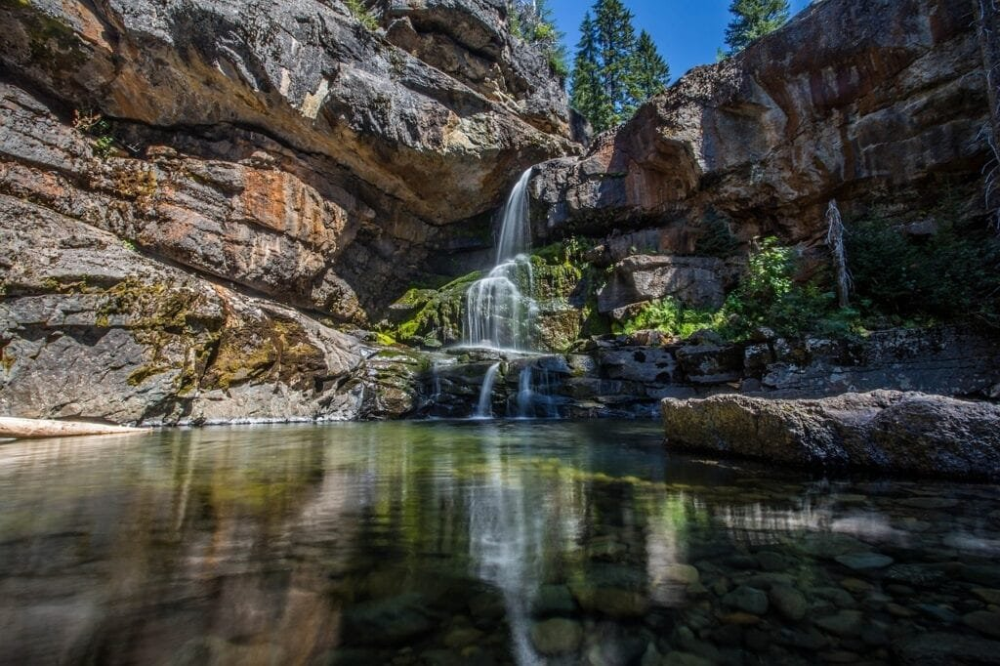
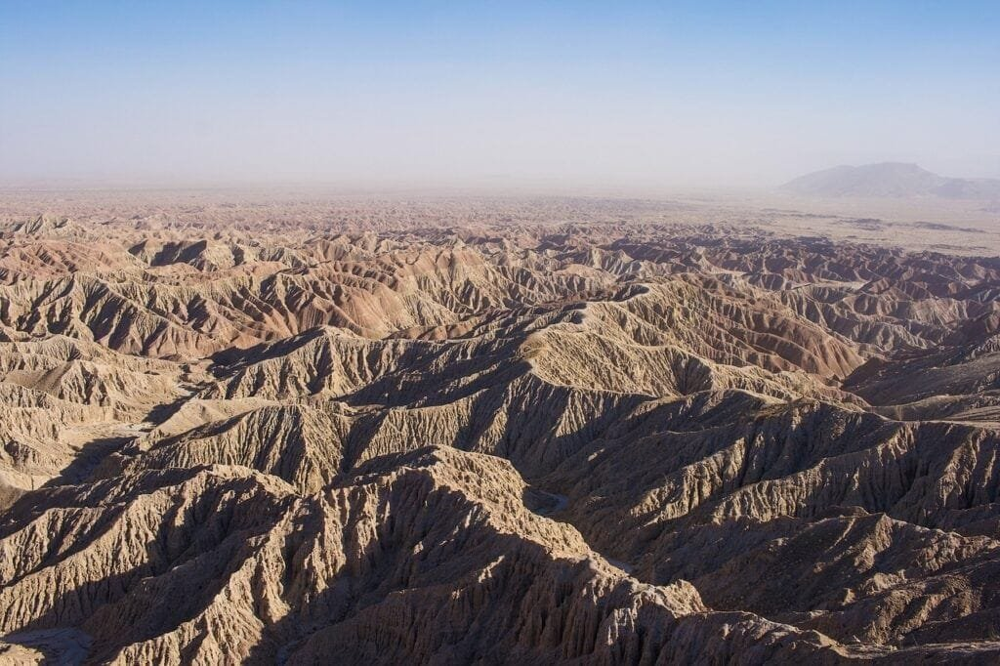

In "Identifying Different Volcanic Rock Types," you will gain a deeper understanding of the fascinating world of volcanoes. From their formation to their eruption patterns, this article provides valuable insights into the diverse range of volcanic rock types. With five helpful tips, you'll learn how to identify these rocks and appreciate the unique characteristics they possess. Whether you're a geology enthusiast or simply curious about the wonders of the Earth, this article will leave you more knowledgeable and intrigued by the beauty and power of volcanoes.

This image is property of pixabay.com.

## Understanding volcanoes and volcanic Rocks

[Volcanoes are fascinating natural phenomena](https://magmamatters.com/the-art-and-science-of-volcano-monitoring/ "The Art and Science of Volcano Monitoring") that have captivated human curiosity for centuries. These majestic mountains, often shrouded in mystery and danger, hold within them a world of geological wonders. In this article, we will explore the formation of volcanoes and the rocks that they produce. By understanding the characteristics and functionality of volcanic rocks, we can gain a deeper appreciation for the dynamic forces that shape our planet.

### Overview of volcanic formation and eruptions

Volcanoes are formed when molten rock, known as magma, rises to the surface of the Earth. This process occurs when the Earth's crust is under immense pressure from tectonic forces or when the mantle beneath the crust melts. As the magma reaches the surface, it erupts, releasing gases, lava, and ash into the air. This eruption can take various forms, ranging from gentle lava flows to explosive events that can cause widespread destruction.

Volcanoes can be found in different locations around the world, primarily along plate boundaries, hotspots, or rift zones. The "Ring of Fire," encompassing the Pacific Ocean, is an area known for its high volcanic activity. These volcanic hotspots occur where tectonic plates collide, creating a vulnerable environment for eruptions. Meanwhile, shield volcanoes, such as those in Hawaii, form gradually over hot spots deep underground and have less explosive eruptions.

### How volcanic rocks are formed

Volcanic rocks, also known as volcaniclastic rocks or pyroclastic rocks, are formed through the solidification of lava or the fragmentation of magma during volcanic eruptions. When lava cools and solidifies on the surface, it forms extrusive volcanic rocks. On the other hand, when magma cools and solidifies below the surface, it forms intrusive volcanic rocks.

The composition of volcanic rocks can vary depending on the mineral content of the magma or lava from which they are derived. Silica-rich lavas tend to produce lighter-colored rocks, while lavas with less silica result in darker rocks. The cooling rate of the lava or magma also plays a role in determining the texture of the resulting rock.

### Characteristics of volcanic rocks

Volcanic rocks possess distinct characteristics that set them apart from other types of rocks. They are often characterized by their fine-grained texture, as they cool rapidly on the Earth's surface. This rapid cooling prevents the growth of large mineral crystals, resulting in a fine-grained appearance.

Volcanic rocks can vary in color, ranging from dark basalt to light-colored rhyolite. They may also exhibit vesicles, which are gas bubbles that form during the eruption and become trapped within the rock as it solidifies. These vesicles give volcanic rocks a porous texture, making them lightweight compared to other rocks.

Additionally, volcanic rocks may contain phenocrysts, which are larger crystals embedded within the fine-grained matrix. Phenocrysts are formed in the magma chamber beneath the volcano and can provide valuable insights into the composition and history of the volcano.

## Extrusive volcanic rocks functionality

Extrusive volcanic rocks refer to the rocks that are formed on the Earth's surface as a result of volcanic eruptions. These rocks have unique features and play a crucial role in the formation of landscapes.

### Basic features and occurrence of extrusive volcanic rocks

Extrusive volcanic rocks are often characterized by their fine-grained texture, resulting from rapid cooling of lava on the surface. This rapid cooling prevents the growth of large mineral crystals, giving the rocks their fine-grained appearance. Examples of extrusive volcanic rocks include basalt, andesite, rhyolite, and obsidian.

Extrusive volcanic rocks can be found in areas where volcanic eruptions have occurred. These rocks are commonly associated with volcanic cones, lava flows, and volcanic ash deposits. They are particularly abundant in volcanic regions such as the Ring of Fire, where tectonic activity is high.

### How extrusive volcanic rocks contribute to landscape formation

Extrusive volcanic rocks play a fundamental role in shaping the Earth's landscape. When lava flows from a volcano, it can spread over vast areas, creating new landforms. Lava flows can form lava plateaus, which are large, flat areas covered in solidified lava. These plateaus can stretch for miles and provide fertile soil for agriculture.

Volcanic ash, another product of volcanic eruptions, can also have a significant impact on landscape formation. Ash deposits can cover large areas and create layers of sediment that contribute to the formation of mountains, valleys, and canyons over time. These ash deposits can also enrich the soil, making it more fertile for plant growth.

### Formation process of extrusive volcanic rocks

Extrusive [volcanic rocks are formed when lava erupts from a volcano](https://magmamatters.com/geothermal-energy-and-its-volcanic-origins/ "Geothermal Energy and Its Volcanic Origins") and rapidly cools on the Earth's surface. The speed at which the lava cools influences the texture of the resulting rock. If the lava cools quickly, it forms a fine-grained rock, while slower cooling allows for the growth of larger mineral crystals.

The composition of the lava also affects the characteristics of the extrusive volcanic rock. Lavas with higher silica content, such as rhyolite, tend to be lighter in color, while lavas with lower silica content, such as basalt, are darker. Other factors, such as the presence of gases in the lava and the rate of eruption, can also influence the formation of extrusive volcanic rocks.

<iframe width="560" height="315" src="https://www.youtube.com/embed/xX6YGpk3DWk" frameborder="0" allow="accelerometer; autoplay; encrypted-media; gyroscope; picture-in-picture" allowfullscreen></iframe>

  

## Intrusive volcanic rocks functionality

Intrusive volcanic rocks, also known as plutonic rocks, are formed when magma cools and solidifies beneath the surface of the Earth. These rocks have distinctive characteristics and can have a profound influence on the geology of an area.

### Distinctive characteristics of intrusive rocks

Intrusive volcanic rocks typically have a coarse-grained texture due to their slow cooling process beneath the Earth's surface. Unlike extrusive volcanic rocks, which cool rapidly, intrusive rocks have larger mineral crystals that are visible to the naked eye. Examples of intrusive volcanic rocks include diorite, gabbro, granite, and pegmatite.

### How intrusive volcanic rocks influence the geology of an area

Intrusive volcanic rocks can have a significant impact on the geology of an area. When magma intrudes into the surrounding rock layers, it can cause the existing rocks to heat up and undergo metamorphism, resulting in the formation of new minerals and rock types.

Intrusive rocks can also create large plutons, which are bodies of igneous rock that have solidified beneath the Earth's surface. These plutons can uplift the overlying rocks, creating mountain ranges and other significant geological features. Additionally, the presence of intrusive rocks can influence the hydrothermal systems of an area, leading to the formation of economically valuable mineral deposits.

### Process of formation for intrusive volcanic rocks

Intrusive volcanic rocks are formed when magma cools and solidifies beneath the Earth's surface. As magma rises through the crust, it can intrude into existing rock formations, displacing and melting the surrounding rocks. The slow cooling of the magma allows the minerals to grow and form larger crystals, resulting in the coarse-grained texture characteristic of intrusive rocks.

The composition of the magma influences the type of intrusive rock that forms. Magma with higher silica content tends to form lighter-colored rocks, such as granite, while magma with lower silica content forms darker rocks, such as gabbro. The cooling rate and depth of the intrusion also play a role in determining the characteristics of the intrusive volcanic rock.

## Types of extrusive volcanic rocks

Extrusive volcanic rocks encompass a wide range of rock types, each with its unique formation process and distinctive properties. Let's explore some of the most notable types of extrusive volcanic rocks.

### Basalt rock formation and properties

Basalt is one of the most common and widely distributed types of extrusive volcanic rocks. It is formed from low-silica magma that erupts from volcanoes, creating extensive lava flows. Basalt is known for its dark color, typically black or dark gray, and its fine-grained texture.

Basaltic lava flows can create vast basalt plateaus, such as the Columbia River Basalts in the northwestern United States and the Deccan Traps in India. Due to its durability and resistance to weathering, basalt is often used as a construction material for roads, buildings, and sculptures.

### Andesite and its notable features

Andesite is an intermediate type of extrusive volcanic rock that falls between basalt and rhyolite in terms of silica content. It derives its name from the Andes Mountains, where it is commonly found. Andesite is typically light to dark gray in color and has a porphyritic texture, characterized by larger crystals embedded in a fine-grained matrix.

Andesite lava flows can create volcanic cones and stratovolcanoes, such as Mount St. Helens in the United States and Mount Fuji in Japan. Due to its durability and ability to hold polish, andesite has been used as a construction material for buildings and monuments throughout history.

### Rhyolite discovery and characteristics

Rhyolite is a silica-rich extrusive volcanic rock that is similar in composition to granite. It is formed from highly viscous magma that can result in explosive eruptions. Rhyolite is often light-colored, ranging from white to pink or gray, and has a fine-grained texture.

Rhyolitic lava flows can form domes and lava plugs, such as those found in the Yellowstone Caldera in the United States. Due to its aesthetically pleasing appearance and ability to be carved, rhyolite has been used in architecture and sculpture throughout the centuries.

### Obsidian rock and its distinctive appearance

Obsidian is a unique type of extrusive volcanic rock that forms when lava cools rapidly, preventing the growth of mineral crystals. It is often referred to as volcanic glass due to its glossy and vitreous appearance. Obsidian can be black, brown, or green and has a sharp conchoidal fracture, making it ideal for tool-making.

Obsidian is found in areas with high volcanic activity and has been used by ancient civilizations for making tools, weapons, and decorative objects. Today, obsidian is still used in various applications, including surgical blades, jewelry, and artistic sculptures.

This image is property of pixabay.com.

## Types of intrusive volcanic rocks

Intrusive volcanic rocks offer a diverse range of rock types, each with its distinct composition and characteristics. Let's delve into some notable examples of intrusive volcanic rocks.

### Diorite rocks and their unique composition

Diorite is an intrusive volcanic rock that is intermediate in composition between granite and gabbro. It is typically gray to black in color and has a coarse-grained texture. Diorite is composed of plagioclase feldspar, hornblende, and smaller amounts of other minerals.

Diorite can be found in various regions around the world, including the Sierra Nevada mountain range in the United States and parts of Europe. It is often used as a construction material for buildings, monuments, and countertops due to its durability and appealing appearance.

### Gabbro formation and characteristics

Gabbro is a coarse-grained intrusive volcanic rock that is composed mainly of calcium-rich plagioclase feldspar and pyroxene minerals. It is typically dark green to black in color and has a granular texture. Gabbro is often found in large plutonic masses and forms the lower layers of the oceanic crust.

Gabbro is known for its durability and strength, making it a popular choice for construction materials such as countertops, tiles, and dimension stones. It is also used as an aggregate in road construction and as a raw material in the production of iron, steel, and cement.

### Granite and its wide-ranging applications

Granite is a common intrusive volcanic rock that is widely used in construction and architectural applications. It is composed primarily of quartz, feldspar, and mica minerals. Granite can vary in color, ranging from light to dark gray, and has a coarse-grained texture.

Granite is renowned for its durability, aesthetic appeal, and ability to withstand weathering. It has been used as a building material for centuries, adorning landmarks such as the Statue of Liberty and Mount Rushmore. In addition to construction, granite is also used in countertops, flooring, and decorative objects.

### Pegmatite notable features

Pegmatite is an intrusive volcanic rock that forms in the late stages of magma cooling. It is characterized by its exceptionally large crystals, which can reach several meters in length. Pegmatite often contains valuable minerals such as quartz, feldspar, and mica, as well as rare elements like lithium and beryllium.

Pegmatite deposits are found in a variety of geological settings and have been mined for their mineral content. They are particularly prized for their gemstone production and as a source of industrial minerals. Pegmatite has also played a significant role in the history of scientific discovery, as it has provided insights into the formation of minerals and the Earth's geological processes.

## Classification of volcanic rocks based on composition

Volcanic rocks can be classified based on their composition, which is determined by the mineral content of the lava or magma from which they form. This classification helps us understand the diversity of volcanic rocks and their geological significance.

### Silicic volcanic rocks

Silicic volcanic rocks, also known as felsic volcanic rocks, are rich in silica and have higher viscosities. They are typically light-colored and include rocks such as rhyolite and dacite. Silicic volcanic rocks are associated with explosive volcanic eruptions and can create volcanic domes and ash clouds.

Silicic volcanic rocks are often found in regions with active volcanic systems or ancient calderas. They are of significant geological interest due to the insights they provide into the Earth's deep processes and the potential hazards they pose during eruptions.

### Intermediate volcanic rocks

Intermediate volcanic rocks, as the name suggests, fall between silicic and mafic volcanic rocks in terms of composition. They have intermediate levels of silica and typically include rocks such as andesite and diorite. Intermediate volcanic rocks can be light to dark gray and are associated with volcanic cones, stratovolcanoes, and volcanic arcs.

The abundance of intermediate volcanic rocks in certain regions, such as the Andes Mountains, provides valuable information about the geodynamic processes occurring beneath the Earth's surface. These rocks also play a significant role in the formation of mineral deposits and the development of mountainous terrains.

### Mafic volcanic rocks

Mafic volcanic rocks, also known as ultramafic volcanic rocks, are low in silica and have low viscosities. They are typically dark-colored and include rocks such as basalt and gabbro. Mafic volcanic rocks are associated with effusive volcanic eruptions that produce lava flows and shield volcanoes.

Mafic volcanic rocks are widespread on Earth's surface, covering extensive areas such as oceanic crusts and flood basalt provinces. They provide valuable insights into the composition and evolution of the Earth's interior, including the processes occurring in the mantle.

### Ultramafic volcanic rocks

Ultramafic volcanic rocks have the lowest silica content of all volcanic rocks and are composed primarily of minerals rich in iron and magnesium. They are typically dark green and include rocks such as komatiite and peridotite. Ultramafic volcanic rocks are associated with rare types of volcanic activity, such as komatiite lava flows.

Ultramafic volcanic rocks are of great interest to geologists as they provide insights into the conditions of early Earth and the composition of the mantle. They are also associated with the formation of economically valuable mineral deposits, including nickel, platinum, and chromite.

This image is property of pixabay.com.

## Classification of volcanic rocks based on texture

In addition to composition, volcanic rocks can also be classified based on their texture, which refers to the size and arrangement of mineral crystals within the rock. This classification helps us understand the cooling history of [volcanic rocks](https://magmamatters.com/understanding-volcanic-formation-a-comprehensive-guide/ "Understanding Volcanic Formation: A Comprehensive Guide") and the processes that occur during their formation.

### Glassy texture

Volcanic rocks with a glassy texture, such as obsidian, are characterized by the rapid cooling of lava, preventing the growth of mineral crystals. As a result, these rocks have a smooth and shiny appearance similar to glass. The lack of crystalline structure gives them unique properties, including sharp edges and excellent fracture resistance.

Glassy volcanic rocks are often formed during highly explosive eruptions, where the lava cools rapidly upon exposure to the atmosphere. The glassy texture provides valuable insights into the eruptive history and dynamics of volcanic activity.

### Aphanitic (fine-grained) texture

Volcanic rocks with an aphanitic texture, also known as fine-grained texture, are characterized by small mineral crystals that are not visible to the naked eye. This texture is a result of the rapid cooling of lava on the Earth's surface, where mineral crystals do not have enough time to grow.

Aphanitic volcanic rocks, such as basalt and andesite, are commonly found in volcanic regions around the world. The fine-grained texture gives these rocks a smooth appearance and can be identified under a microscope. Aphanitic rocks are associated with effusive volcanic eruptions and can create lava flows and volcanic cones.

### Phaneritic (coarse-grained) texture

Volcanic rocks with a phaneritic texture, also known as coarse-grained texture, are characterized by visible mineral crystals that are larger and more distinct. This texture is a result of the slow cooling of magma beneath the Earth's surface, allowing mineral crystals to grow to a larger size.

Phaneritic volcanic rocks, such as granite and diorite, are typically found in plutonic masses and can be associated with mountain-building processes. The coarse-grained texture gives these rocks a rough appearance, with individual mineral crystals easily distinguishable to the naked eye.

### Porphyritic texture

Volcanic rocks with a porphyritic texture exhibit two distinct crystal sizes. They have larger crystals, known as phenocrysts, embedded within a finer-grained matrix. This texture is formed when magma cools slowly beneath the Earth's surface, allowing large crystals to grow, followed by a rapid cooling and the formation of the fine-grained matrix on the surface.

Porphyritic volcanic rocks, such as andesite and rhyolite, are commonly associated with volcanic cones and stratovolcanoes. The porphyritic texture provides insights into the cooling history of the rock and the conditions present during the eruption.

## Importance of volcanic rocks in construction

Volcanic rocks play a significant role in various construction applications due to their unique properties and diverse range of rock types. Let's explore the importance of volcanic rocks in construction and how they are utilized.

### Use of volcanic rocks in road construction

Volcanic rocks, particularly basalt, are highly valued in road construction due to their durability and resistance to weathering. Basalt aggregates are commonly used in the production of asphalt and concrete for road surfaces and foundations. The hardness and strength of basalt make it an ideal material for high-traffic areas that require long-lasting infrastructure.

Additionally, the porous nature of volcanic rocks can contribute to better drainage on road surfaces, reducing the risk of flooding and improving the safety of transportation networks. Volcanic ash has also been used in road construction as a stabilizing agent and for dust suppression.

### Application of volcanic rocks in construction of buildings

Volcanic rocks, such as granite and andesite, have been used in the construction of buildings throughout history. Their durability, aesthetic appeal, and resistance to weathering make them desirable materials for architectural applications. Granite, with its variety of colors and patterns, has adorned numerous iconic structures, including temples, statues, and monuments.

Volcanic rocks can be used in the construction of walls, floors, countertops, and decorative elements. They provide strength, longevity, and a unique visual appeal to buildings. Additionally, volcanic rocks can provide thermal insulation and acoustic properties, enhancing the comfort and energy efficiency of the structures.

### Volcanic rocks in decoration and landscaping

Volcanic rocks are widely used in the field of decoration and landscaping due to their unique appearance and functional properties. Various types of volcanic rocks, such as obsidian, pumice, and tuff, are utilized for decorative purposes, including sculptures, art installations, and jewelry.

Volcanic rocks can also be used in landscaping to create visually appealing features, such as rock gardens, pathways, and retaining walls. Their colors, textures, and versatility allow for creative designs that enhance outdoor spaces. Moreover, volcanic rocks, particularly porous ones, can contribute to better soil drainage and prevent erosion, making them valuable additions to gardens and landscapes.

## Ecological and agricultural importance of volcanic rocks

Volcanic rocks have significant ecological and agricultural importance, as they contribute to various aspects of the natural environment. Let's explore how volcanic rocks impact soil fertility, water filtration, and the habitat for various organisms.

### Role of volcanic rocks in soil fertility

Volcanic rocks play a crucial role in soil fertility due to their mineral composition and ability to release essential nutrients. Over time, volcanic rocks weather and break down, releasing minerals such as potassium, phosphorus, and calcium into the soil. These nutrients are essential for plant growth and contribute to the fertility and productivity of agricultural lands.

Additionally, volcanic rocks, particularly those high in silica, can provide increased soil water retention and enhance resistance to erosion. The porous nature of volcanic rocks allows them to absorb and hold onto water, preventing excessive runoff and improving the moisture content of the soil.

### How volcanic rocks contribute to water filtration

Volcanic rocks can contribute to water filtration due to their porous structure and ability to trap contaminants. The interconnected pores within volcanic rocks act as natural filters, allowing water to pass through while trapping impurities and sediments. This process helps improve the quality and clarity of groundwater and surface water sources.

The filtration capacity of volcanic rocks can be harnessed in various ways, such as constructing gravel-packed wells or using them in efficient water treatment systems. The natural filtration properties of volcanic rocks support the conservation and protection of water resources, benefiting both humans and aquatic ecosystems.

### Volcanic rocks' role in housing various organisms

Volcanic rocks provide a habitat for various organisms, contributing to the biodiversity of ecosystems. The rough and porous surfaces of volcanic rocks offer niches and crevices for plants, mosses, lichens, and microorganisms to establish themselves. These organisms, in turn, can support the growth of higher organisms, such as insects, birds, and small mammals.

Some species of plants have adapted to the harsh conditions of volcanic environments and can only thrive in the presence of volcanic rocks. These specialized plants contribute to the unique flora and fauna found in volcanic regions, adding to the biological richness and ecological value of these areas.

## Hazards associated with volcanic rocks

While volcanic rocks have many benefits, they also pose certain hazards that need to be carefully managed. Let's explore some of the hazards associated with volcanic rocks and the impacts they can have.

### Respiratory complications caused by volcanic ash inhalation

Volcanic eruptions can release large amounts of fine ash particles into the air, posing a significant health risk to nearby communities. Inhaling volcanic ash can cause respiratory complications, such as coughing, wheezing, and shortness of breath. Fine ash particles can penetrate deep into the lungs and irritate the respiratory system, leading to chronic health problems.

During volcanic eruptions, it is crucial to take measures to protect respiratory health, such as wearing appropriate masks and minimizing exposure to ash-covered areas. Prompt evacuation and relocation of affected populations may be necessary in severe cases to prevent long-term health consequences.

### Damage to infrastructure due to pyroclastic flow

Pyroclastic flows, dense and fast-moving currents of volcanic gases, ash, and rock fragments, can cause significant damage to infrastructure in their path. The high temperatures and velocities of pyroclastic flows can destroy buildings, roads, and vegetation, and pose severe risks to human life.

Communities living within the vicinity of [volcanoes prone to pyroclastic flows](https://magmamatters.com/the-environmental-impact-of-volcanic-eruptions-2/ "The Environmental Impact of Volcanic Eruptions") must be prepared and have appropriate evacuation plans in place. Early warning systems, public education, and effective communication channels are vital for minimizing the impact of pyroclastic flows and ensuring the safety of affected populations.

### Effects on air traffic by volcanic ash plumes

Volcanic ash plumes can reach high altitudes and pose a severe hazard to air travel. The presence of volcanic ash particles in the atmosphere can damage jet engines, impairing their performance and causing potential engine failure. This poses a significant risk to aircraft and can lead to disruptions in air traffic.

To mitigate the risks posed by volcanic ash, aviation authorities closely monitor volcanic activity and issue flight advisories and warnings when necessary. Airlines and pilots adhere to strict protocols and avoid flying through areas of high volcanic ash concentrations to ensure the safety of passengers and crew.

In conclusion, understanding volcanoes and volcanic rocks allows us to appreciate the incredible forces at work beneath the Earth's surface. From the formation and eruption of volcanoes to the properties and functionality of different types of volcanic rocks, this comprehensive article has provided insights into a captivating field of study. Whether we admire the majestic landscapes shaped by volcanic rocks, benefit from their use in construction, or recognize their ecological and agricultural importance, volcanic rocks continue to fascinate and influence our lives.

