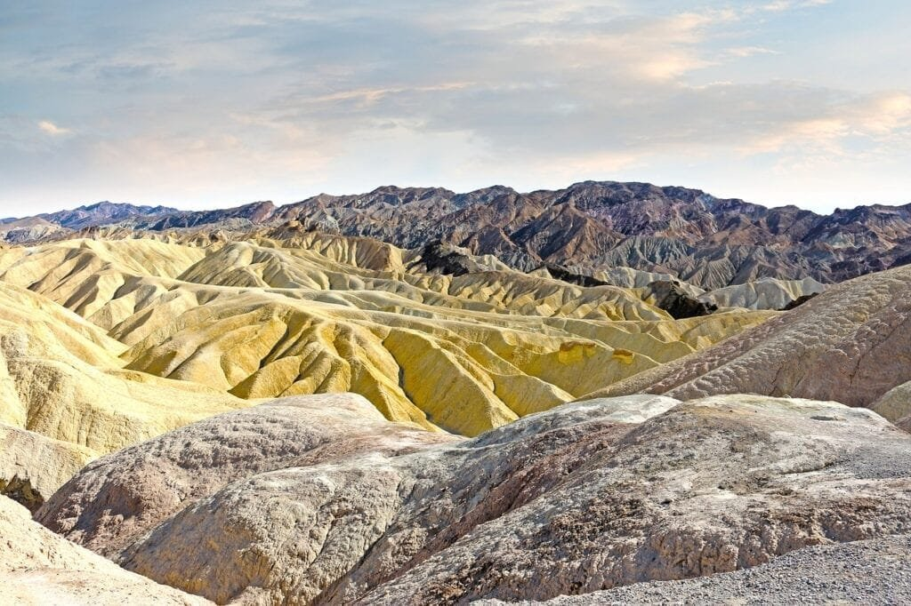
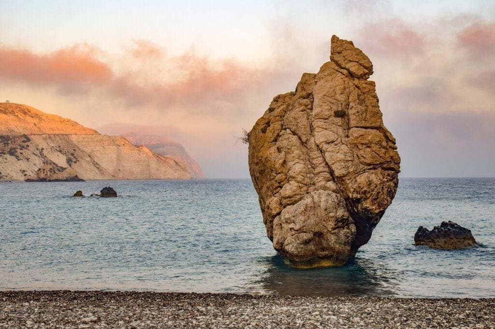

Volcanic eruptions have a profound impact on the Earth's crust. When molten rock, gases, and debris escape to the surface, they unleash a spectacle of lava and ash. These eruptions are not random events, but rather occur at specific locations where plate boundaries meet, beneath hotspots in the Earth's crust, or within rift zones where tectonic plates are pulling apart. Volcanoes scattered along the "Ring of Fire" surrounding the Pacific Ocean are particularly susceptible to activity due to the convergence of tectonic plates. In contrast, shield volcanoes in Hawaii form steadily over underground hotspots and erupt in a less explosive manner. The eruption characteristics of volcanoes vary based on factors such as the viscosity of the lava and the amount of gases present. While volcanic eruptions can provide vital nutrients to the soil, they also pose significant risks and can cause devastating natural disasters. By understanding the different types of volcanoes, their distribution, eruption causes, hazards, and benefits, we can better predict future volcanic activity and take measures to protect vulnerable communities.

This image is property of pixabay.com.

## The process of volcanic eruption

Volcanic eruptions occur when molten rock, gases, and debris escape to the earth's surface. This process involves a release of immense pressure and results in the eruption of lava and ash. The source of these eruptions is the molten rock, known as magma, which is located beneath the earth's surface. When the pressure becomes too great, the magma erupts, creating a volcanic eruption.

During an eruption, the magma rises through fissures in the earth's crust and reaches the surface. As the magma is exposed to the cooler temperatures and lower pressures at the surface, it solidifies and becomes lava. The lava can flow down the slopes of the volcano, creating streams of molten rock. Additionally, gases and debris, such as ash, are expelled into the air.

## Formation of volcanoes

Volcanoes are formed in various ways and occur at different locations. One common occurrence is at sites along plate boundaries, where tectonic plates meet. The movement and collision of these plates create intense pressure and heat, causing the magma to rise and form a volcano.

Another way volcanoes form is over hotspots under the earth's crust. Hotspots are areas where a mantle plume, a column of hot magma rising from the earth's mantle, reaches the surface. This magma forms a volcano that can remain active for long periods, such as the shield volcanoes in Hawaii.

Volcanoes can also form at rift zones, where the earth's tectonic plates are moving apart. As the plates separate, magma rises to fill the gap and creates a volcano. This type of volcanic activity is common along mid-ocean ridges and can lead to the formation of new crust.

This image is property of pixabay.com.

## Geographical distribution of volcanoes

One well-known example of the geographical distribution of volcanoes is the 'Ring of Fire.' The 'Ring of Fire' is a major area in the basin of the Pacific Ocean where a large number of earthquakes and volcanic eruptions occur. It is shaped like a horseshoe and is known for its high volcanic activity. The 'Ring of Fire' is a result of the movement and collision of several tectonic plates, making it a hotspot for volcanic eruptions.

In addition to the 'Ring of Fire,' volcanoes are also present in specific locations, such as shield volcanoes in Hawaii. These [shield volcanoes form over hotspots deep underground and erupt](https://magmamatters.com/understanding-volcanic-formation-a-comprehensive-guide/ "Understanding Volcanic Formation: A Comprehensive Guide") less explosively than other types of volcanoes. The Hawaiian Islands, for example, are a chain of shield volcanoes that formed over millions of years as the Pacific Plate moved over a hotspot.

## Effect on tectonic plates

Volcanic eruptions have a significant effect on tectonic plates. At plate boundaries, where tectonic plates meet, stress accumulates over time as the plates move and interact with each other. This stress can be released through volcanic activity, as the eruption allows the accumulated energy to be discharged. Volcanic eruptions help to relieve the built-up pressure and prevent catastrophic events like earthquakes.

Furthermore, volcanic eruptions can cause shifts and movements in tectonic plates. The force and energy released during an eruption can cause the surrounding rock to fracture and move. These movements, often called volcanic tremors, can lead to changes in the tectonic plate's overall position. While these shifts are relatively small in comparison to the size of the plates, they contribute to the constant motion and evolution of the earth's crust.

This image is property of pixabay.com.

## Volcanic eruption patterns

The eruption patterns of volcanoes can vary depending on several factors. One of these factors is the viscosity of the lava. Viscosity refers to the resistance of a substance to flow. If the lava has high viscosity, it means it is thick and does not flow easily. In this case, the eruption is typically explosive and violent, as the gas bubbles in the lava struggle to escape. Examples of volcanoes with high-viscosity lava are stratovolcanoes like Mount St. Helens.

On the other hand, if the lava has low viscosity, it means it is more fluid and can flow easily. Volcanoes with low-viscosity lava, such as shield volcanoes, tend to have more effusive eruptions. The lava flows smoothly and can cover long distances, creating broad, gently sloping landforms.

Another factor that influences eruption patterns is the gas content of the magma. Magma often contains dissolved gases, such as water vapor, carbon dioxide, and sulfur dioxide. As the magma rises and pressure decreases, these gases begin to escape, leading to the eruption. If the magma has a high gas content, the eruption can be explosive, ejecting large quantities of ash and gases into the air. In contrast, if the magma has a lower gas content, the eruption may be less explosive and more effusive.

The intensity and scale of volcanic explosions can also vary. Some eruptions release relatively small amounts of ash and lava, while others can be catastrophic and cause widespread destruction. The explosiveness of an eruption depends on factors such as the composition of the magma, the amount of gas it contains, and the geological characteristics of the volcano.

## Hazards of volcanic eruptions

Volcanic eruptions pose numerous hazards to surrounding communities and the environment. The immediate effect of an eruption is the release of lava, hot gases, and volcanic ash. These materials can cause significant damage and endanger lives.

Lava flows can destroy everything in their path, including buildings, infrastructure, and agricultural land. The extreme heat of the lava can set structures ablaze and make the surrounding area uninhabitable. The speed and direction of lava flows are unpredictable, making it challenging to protect vulnerable areas.

Volcanic ash is another hazardous component of eruptions. Volcanic ash consists of tiny rock fragments, minerals, and glass shards that are ejected into the air and carried by wind currents. When volcanic ash falls to the ground, it can damage crops, contaminate water sources, and pose health risks to humans and animals. Breathing in airborne ash can cause respiratory problems, particularly for individuals with pre-existing conditions.

Additionally, volcanic eruptions can trigger other natural disasters. Massive volcanic eruptions can generate pyroclastic flows, which are fast-moving currents of hot gas, ash, and rock. These flows are extremely dangerous and can travel at high speeds, destroying everything in their path. Volcanic eruptions can also produce lahars, which are mudflows consisting of volcanic debris mixed with water. Lahars can be highly destructive and can travel long distances, burying entire communities.

## Benefits of volcanic eruptions

Although volcanic eruptions can be catastrophic, they also have some benefits. One of the significant benefits is the enrichment of soil with volcanic material. Volcanic ash is rich in minerals and nutrients, making the soil highly fertile. When volcanic ash settles on the land, it provides essential elements for plant growth, leading to increased agricultural productivity. Volcanic eruptions have played a significant role in the formation of fertile lands and the development of thriving ecosystems.

Volcanic eruptions can also result in the creation of new land masses. As lava flows and cools, it solidifies into rock, gradually building up the land. Over time, the accumulation of lava can form new islands or expand existing land areas. This process is evident in volcanic archipelagos like Hawaii, where volcanic activity has led to the formation of numerous islands.

Furthermore, volcanic eruptions can be a valuable source of geothermal energy. Geothermal energy is generated from the heat stored within the earth's crust. Areas with volcanic activity often have abundant geothermal resources that can be harnessed for electricity generation and heating. Geothermal power plants use the natural heat from volcanic activity to drive turbines, producing clean and renewable energy.

## Mitigating the impact of volcanic eruptions

To minimize the impact of volcanic eruptions, it is essential to predict and prepare for future volcanic activities. Volcanologists and scientists study various indicators to monitor volcanic activity and make predictions. These indicators include seismic activity, ground deformation, gas emissions, and changes in temperature and pressure. By monitoring these factors continuously, scientists can identify patterns and trends in volcanic behavior, allowing them to issue timely warnings and alerts.

Preparation and planning are crucial in mitigating the impact of volcanic hazards. Communities located near active volcanoes should have well-developed evacuation plans and emergency procedures. This includes establishing designated evacuation routes, creating shelters, and educating the population about volcanic hazards and safety measures.

After a volcanic event, rebuilding and recovery efforts are essential for impacted communities. The affected areas may require extensive infrastructure repairs and restoration. Communities can also benefit from government support and assistance in rebuilding homes, schools, hospitals, and other essential facilities. Moreover, post-disaster recovery programs should include support for mental health services, as volcanic eruptions can have a profound psychological impact on affected individuals.

## Studying the earth's crust through volcanic activities

Volcanic activities play a crucial role in understanding the earth's crust and its dynamics. By studying volcanoes, scientists can gain insight into the composition and structure of the earth's lithosphere—the rigid outer layer of the planet. Volcanic materials, such as lava and ash, provide valuable information about the chemical and physical properties of rocks deep within the earth.

Volcanoes also contribute to the shaping of the earth's crust. Through continuous volcanic activity, landforms are created, altered, and destroyed. These processes are part of the dynamic nature of the earth's surface and contribute to the formation of mountains, valleys, and other geologic features. By studying volcanic activity, scientists can better understand the forces and mechanisms that drive the reshaping of the earth's crust.

## Climate change and volcanic eruptions

Volcanic eruptions can have an impact on global temperatures and contribute to greenhouse gases. During an eruption, large amounts of volcanic gases, including [carbon dioxide and sulfur](https://magmamatters.com/the-art-and-science-of-volcano-monitoring/ "The Art and Science of Volcano Monitoring") dioxide, are released into the atmosphere. These gases can contribute to the greenhouse effect, trapping heat and potentially leading to an increase in global temperatures.

However, it is important to note that the impact of [volcanic eruptions on climate change](https://magmamatters.com/geothermal-energy-and-its-volcanic-origins/ "Geothermal Energy and Its Volcanic Origins") is relatively short-term and localized. While volcanic eruptions can result in temporary cooling due to the release of reflective volcanic particles, the overall contribution to long-term climate change is minimal compared to human-induced factors.

Additionally, volcanic eruptions can have indirect effects on weather patterns. The release of volcanic ash into the atmosphere can disrupt air travel and affect weather conditions in the immediate vicinity of the eruption. The ash particles can reflect sunlight, leading to cooling effects and potentially altering precipitation patterns. However, these effects are typically limited to the region surrounding the volcano and may not have significant impacts on a global scale.

In conclusion, understanding the process of volcanic eruptions, their formation, geographical distribution, and the impact on tectonic plates can provide valuable insights into the Earth's crust. While volcanic eruptions pose hazards and risks to the surrounding communities, they also offer benefits in terms of soil enrichment, creation of new land masses, and geothermal energy potential. By studying volcanoes and their activities, scientists can better predict future volcanic events, mitigate risks, and contribute to a deeper understanding of our planet's dynamic nature. Additionally, volcanic eruptions can have short-term effects on global temperatures and weather patterns, but their contribution to long-term climate change is relatively minimal compared to human-induced factors.

