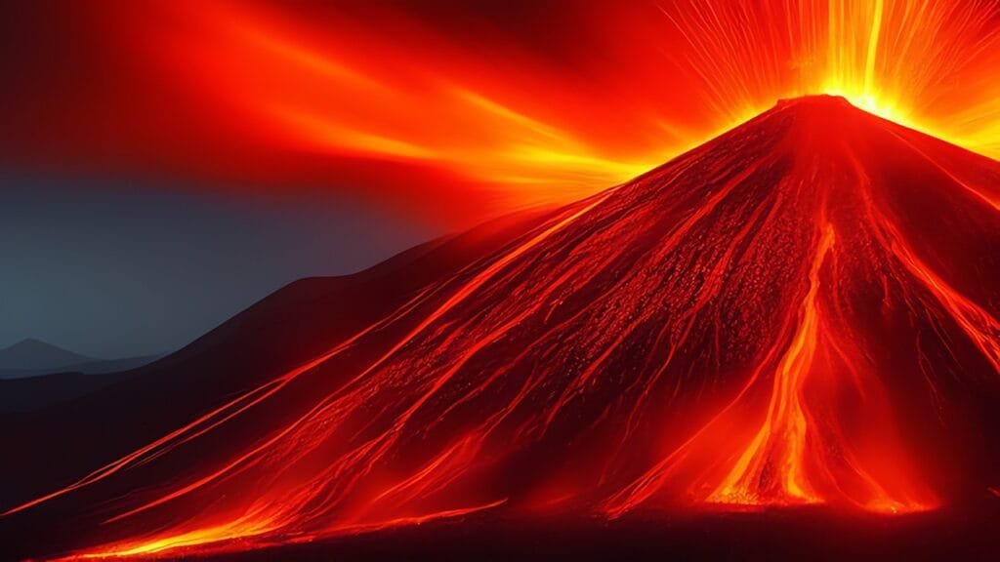

Volcanic eruptions have a significant impact on human settlements, causing both destruction and providing some benefits. When volcanoes erupt, they release molten rock, gases, and debris onto the earth's surface, resulting in the formation of lava and ash. These eruptions occur at various locations, including plate boundaries, hotspots, and rift zones, where the earth's tectonic plates are moving apart or meeting. The "Ring of Fire," which surrounds the Pacific Ocean, is particularly susceptible to volcanic eruptions due to its location atop plate boundaries. While some volcanoes, such as those in Hawaii, erupt gradually and less explosively, others exhibit more violent eruption patterns depending on factors like lava viscosity and gas content. This article explores the different types of volcanoes, their distribution, causes of eruption, hazards, benefits, and their overall impact on human settlements. By understanding volcanoes, we can better predict future activity and implement measures to mitigate risks to surrounding communities.

This image is property of pixabay.com.

## Why Do Volcanoes Disrupt Human Settlements?

[Volcanoes have a long history of disrupting human settlements](https://magmamatters.com/understanding-volcanic-formation-a-comprehensive-guide/ "Understanding Volcanic Formation: A Comprehensive Guide") due to their unpredictable and destructive nature. Understanding the reasons behind the formation of volcanoes, plate tectonics, and their impact on human settlements is crucial in mitigating the risks associated with volcanic eruptions.

### Reason behind the formation of volcanoes

Volcanoes are formed when molten rock, known as magma, rises to the Earth's surface through cracks and vents. This molten rock can come from various sources, such as subduction zones where one tectonic plate slides beneath another, or from hotspots where plumes of hot mantle material rise from deep within the Earth. The magma that reaches the surface is then called lava, and when it solidifies, it forms the volcanic mountains and structures that we see.

### Understanding plate tectonics and hotspots

Plate tectonics plays a significant role in the formation of volcanoes. The Earth's outer shell, known as the lithosphere, is divided into several large and small tectonic plates that float and move atop the semi-fluid asthenosphere beneath them. These plates interact at their boundaries, leading to various geological phenomena, including volcanic eruptions.

At plate boundaries, volcanoes are formed through subduction, where one tectonic plate is forced beneath another. This process occurs primarily at convergent plate boundaries, such as the Pacific Ring of Fire. Here, the subducting plate descends into the mantle, melting as it goes deeper. The released magma rises to the surface, forming explosive and potentially hazardous volcanoes.

Hotspots, on the other hand, are areas where a plume of exceptionally hot material rises from deep within the Earth's mantle. Over millions of years, tectonic plates move over these hotspots, leading to a chain of volcanoes. The Hawaiian Islands are a prime example of hotspot volcanism, where shield volcanoes are formed over hotspots beneath the Pacific Plate.

### The 'Ring of Fire' and its impact on human settlements

The Pacific Ring of Fire, a region encircling the Pacific Ocean, is notorious for its highly active volcanic and seismic activity. This area is home to approximately 75% of the world's volcanoes, and it is where several major tectonic plates meet. As a result, the Ring of Fire experiences frequent volcanic eruptions and earthquakes.

The presence of numerous active volcanoes around the Ring of Fire has had a significant impact on human settlements. The proximity to volcanoes has led to both the risks and benefits associated with volcanic activity. While some communities have been forced to relocate or endure the hazardous effects of eruptions, others have harnessed the benefits of fertile volcanic soil and geothermal energy.

### Volcanoes' eruption patterns and their consequences

Volcanic eruptions are highly unpredictable in nature, and they can vary in intensity, frequency, and eruption style. Understanding these eruption patterns is essential for assessing their potential consequences on human settlements.

Explosive eruptions, characterized by the ejection of magma and volcanic ash into the atmosphere, can have severe consequences. The ash clouds can travel long distances, affecting air quality and posing health hazards to communities far from the eruption site. Additionally, these eruptions can generate pyroclastic flows, fast-moving avalanches of hot gases, ash, and rock fragments that can devastate everything in their path.

Effusive eruptions, on the other hand, are characterized by the relatively gentle flow of lava. This type of eruption usually occurs in shield volcanoes and can be less destructive compared to explosive eruptions. However, even effusive eruptions can cause damage, as flowing lava can destroy infrastructure and disrupt human settlements.

Different types of volcanoes also present varying levels of destructiveness. Stratovolcanoes, such as Mount Vesuvius and Mount St. Helens, are known for their explosive eruptions, which can cause significant damage and loss of life. Shield volcanoes, like those found in Hawaii, have more fluid lava and are less explosive but can still pose risks to nearby communities.

Understanding these eruption patterns and the characteristics of different volcano types can help communities and authorities prepare for and mitigate the impact of volcanic eruptions on human settlements.

## Influence of Geographic Distribution of Volcanoes

The geographic distribution of volcanoes plays a vital role in determining the level of risk they pose to human settlements. The location of volcanoes is closely linked to tectonic plate boundaries and the presence of hotspots. By understanding the differences between these two factors, we can gain insight into the global impact of particularly active volcanoes and why certain areas are more prone to volcanic eruptions.

### Comparison between tectonic plate boundaries and hotspots

Tectonic plate boundaries are areas where two or more tectonic plates interact. These interactions can lead to volcanic activity, as seen in subduction zones and at divergent plate boundaries. Subduction zones occur when an oceanic plate collides with a continental plate, causing the denser oceanic plate to sink beneath the less dense continental plate. This process generates magma, which rises to the surface and results in volcanic eruptions. Divergent plate boundaries, like those in Iceland's Mid-Atlantic Ridge, occur when two tectonic plates move away from each other, allowing magma to reach the surface.

Hotspots, on the other hand, are areas where plumes of hot mantle material rise from deep within the Earth's mantle. These hotspots are not directly linked to plate boundaries but can still create volcanoes when tectonic plates pass over them. This is evident in the Hawaiian Islands, where the Pacific Plate moves northwest over a hotspot, resulting in the formation of shield volcanoes.

The distribution of volcanoes along tectonic plate boundaries and hotspots provides insight into the patterns of volcanic activity globally and helps scientists understand why certain areas are more prone to volcanic eruptions than others.

### The global impact of particularly active volcanoes

Certain active volcanoes have a global impact due to the scale of their eruptions and the far-reaching effects of volcanic ash clouds. Volcanic ash can be propelled high into the atmosphere during explosive eruptions, spreading across vast distances. These ash clouds pose threats to aviation, as ash particles can damage aircraft engines and impact air travel routes.

One notable example is the 2010 eruption of Eyjafjallajökull in Iceland. The eruption's ash cloud disrupted air travel across Europe for several weeks, impacting millions of travelers and causing significant economic losses. The eruption served as a reminder of the far-reaching consequences that volcanic eruptions can have on human settlements, both locally and globally.

Understanding the global impact of particularly active volcanoes is crucial in developing appropriate response plans and ensuring the safety of communities around the world.

### Why certain areas are more prone to volcanic eruptions

The Earth's tectonic activity and the distribution of tectonic plate boundaries significantly influence the areas prone to volcanic eruptions. Locations along plate boundaries, such as the Ring of Fire, have a higher likelihood of experiencing volcanic activity due to the intense geological processes occurring there.

Additionally, the presence of hotspots also contributes to the likelihood of volcanic eruptions in specific areas. As tectonic plates move over hotspots, they create a steady stream of volcanic activity. This is evident in the Hawaiian Islands, where a hotspot has resulted in the formation of a chain of volcanoes stretching across the Pacific Ocean.

Furthermore, the composition of magma and underlying geological structures can also affect the likelihood of volcanic eruptions. High gas content in magma can lead to explosive eruptions, while lower gas content results in more effusive eruptions. The structure of the volcanoes themselves, such as the presence of fractures or vents, can further influence the eruption style and associated hazards.

By studying these various factors, scientists can better understand why certain areas are more prone to volcanic eruptions. This knowledge is invaluable in assessing the risks and preparing communities for potential volcanic hazards.

<iframe width="560" height="315" src="https://www.youtube.com/embed/OQAY2SEMtPg" frameborder="0" allow="accelerometer; autoplay; encrypted-media; gyroscope; picture-in-picture" allowfullscreen></iframe>

  

## Types of Volcanoes and Their Eruptions

Volcanoes come in various forms, each with its distinct characteristics and eruption patterns. Understanding the different types of volcanoes and their eruptions is crucial in assessing their potential destructiveness and the hazards they pose to human settlements.

### Patterns and consequences of explosive eruptions

Explosive eruptions are among the most destructive and life-threatening volcanic events. These eruptions occur when highly viscous magma, rich in gas content, is ejected forcefully from the volcano. The trapped gases in the magma expand rapidly as it reaches the Earth's surface, leading to violent explosive eruptions.

During an explosive eruption, volcanic ash, gases, and rock fragments are propelled into the atmosphere, creating ash clouds that can rise several kilometers high. These ash clouds can travel long distances, posing a threat to aviation, affecting air quality, and causing respiratory health issues for communities downwind from the eruption site. The fine particles of volcanic ash can also contaminate water sources and damage crops, impacting local agriculture and economies.

Additionally, explosive eruptions can generate pyroclastic flows, which are fast-moving avalanches of hot gases, ash, and rock fragments. These flows can surge down the sides of the volcano at speeds of over 100 kilometers per hour, obliterating everything in their path and causing immense destruction to human settlements.

### Patterns and consequences of effusive eruptions

Effusive eruptions, in contrast to explosive eruptions, involve the relatively gentle flow of lava from the volcano. This type of eruption is typically associated with shield volcanoes, such as those found in Hawaii. Shield volcanoes have low-viscosity lava, allowing it to flow smoothly and cover large areas.

During an effusive eruption, lava can flow downslope, gradually engulfing and destroying anything in its path. While effusive eruptions may not be as explosive or destructive as their counterparts, they still pose risks to nearby communities. The constant flow of lava can destroy roads, buildings, and infrastructure, necessitating evacuation and relocation of affected populations.

### The differences between stratovolcanoes, shield volcanoes, and others in terms of destructiveness

Stratovolcanoes, also known as composite volcanoes, are characterized by their steep slopes and cone-shaped appearance. These volcanoes are the result of both explosive and effusive eruptions, producing layers of lava, ash, and other volcanic materials over time. Their eruptions tend to be highly explosive, resulting in significant destruction. Famous examples of stratovolcanoes include Mount Vesuvius in Italy and Mount St. Helens in the United States.

Shield volcanoes, on the other hand, have a broad, low-profile shape resembling a warrior's shield. They are formed by the effusion of highly fluid lava, which spreads out in thin, wide sheets. Shield volcanoes are generally less explosive than stratovolcanoes, with their eruptions characterized by the relatively gentle flow of lava. The Hawaiian Islands are renowned for their shield volcanoes, such as Mauna Loa and Kilauea.

Other types of volcanoes, such as cinder cones and calderas, exhibit their own unique eruption patterns and characteristics. Cinder cones are steep-sided cones formed by the accumulation of volcanic debris ejected during explosive eruptions. Calderas, on the other hand, are large volcanic depressions resulting from the collapse of a magma chamber.

Understanding the varying characteristics and eruption styles of different volcano types is crucial in assessing their potential destructiveness and the risks they pose to human settlements.

## Hazardous Effects of Volcanic Eruptions on Human Settlements

Volcanic eruptions have a range of hazardous effects on human settlements. These hazards include volcanic ash, lahars, pyroclastic flows, and the destruction of infrastructure. Understanding and preparing for these hazardous effects is essential in mitigating risks to communities living near active volcanoes.

### Influence of volcanic ash on air quality and respiratory health

Volcanic ash, comprised of tiny rock particles and glass shards, is one of the most significant hazards associated with volcanic eruptions. When a volcano erupts explosively, it can release massive amounts of ash into the atmosphere. These fine particles can remain suspended for extended periods and be carried by prevailing winds over large distances.

The inhalation of volcanic ash particles can cause respiratory issues, especially for individuals with pre-existing respiratory conditions. The fine particles can irritate the respiratory system, leading to coughing, shortness of breath, and other respiratory symptoms. Prolonged exposure to volcanic ash can also increase the risk of lung infections and other respiratory diseases.

In addition to the health impacts, volcanic ash can also disrupt air travel, as the particles can damage aircraft engines and reduce visibility. This disruption has economic implications and can lead to significant delays and financial losses for airlines and tourism-dependent regions.

### Impacts of lahars and pyroclastic flows

Lahars and pyroclastic flows are two other hazardous effects of volcanic eruptions that can have devastating consequences for human settlements.

Lahars, often referred to as volcanic mudflows, occur when volcanic ash and debris mix with water, either from melted snow and ice or heavy rainfall. The resulting mixture flows downhill, often following river valleys, with tremendous force. Lahars can travel at high speeds and can carry large boulders and debris, making them highly destructive. These mudflows can bury entire communities, destroy infrastructure, and contaminate water sources, posing long-term risks to affected areas.

Pyroclastic flows, as previously mentioned, are fast-moving avalanches of hot gases, ash, and rock fragments that can rush down the sides of a volcano. These dense, superheated flows can travel at speeds of over 100 kilometers per hour, obliterating everything in their path. [Pyroclastic flows are one of the deadliest volcanic hazards](https://magmamatters.com/the-environmental-impact-of-volcanic-eruptions-2/ "The Environmental Impact of Volcanic Eruptions"), as they can cause severe burns, suffocation, and instantaneous death. The destruction caused by pyroclastic flows can be catastrophic, leading to the complete annihilation of human settlements in the affected areas.

### Destruction of infrastructure due to volcanic eruptions

Volcanic eruptions can cause significant destruction to infrastructure, including roads, bridges, buildings, and utility systems. The impact of volcanic eruptions on infrastructure depends on various factors, such as the proximity of human settlements to the eruption site and the eruption style.

Explosive eruptions, with their ability to generate pyroclastic flows and eject volcanic projectiles, pose the greatest threat to infrastructure. These powerful eruptions can cause structural damage to buildings, collapse roofs, and in severe cases, bury entire cities under layers of ash and debris.

Even effusive eruptions, characterized by the gradual flow of lava, can cause infrastructure damage. As lava slowly advances, it can engulf and destroy roads, bridges, and any other human-made structures in its path. The destruction of essential infrastructure can lead to isolation, hampering emergency response efforts and making it challenging to provide aid and support to affected communities.

The destruction of infrastructure due to volcanic eruptions often leads to the displacement of populations and the need for long-term recovery and rebuilding efforts.

This image is property of pixabay.com.

## Beneficial Aspects of Volcanoes for Human Settlements

While volcanic eruptions pose significant risks and challenges for human settlements, there are also beneficial aspects associated with volcanoes. These benefits include nutrient-rich soil, the creation of tourist destinations, and the potential for harnessing geothermal energy sources.

### Nutrient-rich soil resultant from volcanic material

Volcanic eruptions can create some of the most fertile soil on Earth. When volcanic ash and lava cool and break down over time, they release important nutrients and minerals into the soil. These nutrient-rich soils, known as volcanic soils or Andisols, are highly beneficial for agriculture, supporting the growth of diverse crops and enhancing agricultural productivity.

Regions located near active volcanoes often have thriving agricultural industries due to the fertile soil created by past volcanic activity. These areas can produce high-quality crops and support the livelihoods of local communities. Volcanic soils are particularly advantageous in regions where other soil types may be less fertile or more prone to erosion.

### Volcanic areas as tourist destinations

Volcanoes and volcanic landscapes have long fascinated people around the world, attracting tourists and researchers alike. Many volcanic areas have become popular tourist destinations, offering unique geological features, breathtaking landscapes, and opportunities for scientific exploration.

Volcano tourism provides economic benefits to local communities by attracting visitors and generating revenue through accommodation, dining, and various tourist services. These economic benefits can contribute to the development and improvement of infrastructure in the surrounding areas.

Moreover, volcanoes serve as living laboratories for scientific research. Scientists study active volcanoes to better understand volcanic processes, advance volcano monitoring techniques, and improve eruption forecasting capabilities. Research conducted in volcanic areas contributes to the global knowledge of volcanism, leading to improved risk assessment and mitigation strategies.

### Geothermal energy sources in volcanic regions

Volcanic regions can provide a sustainable and renewable source of energy through geothermal resources. Geothermal energy harnesses the heat stored within the Earth to generate electricity and provide heating and cooling.

In areas with high geothermal activity, such as those near active volcanoes, wells can be drilled into the ground to access hot water and steam reservoirs. The heat energy captured from these reservoirs can then be converted into electricity using specialized power plants.

Geothermal energy has several advantages, including its renewable nature, low greenhouse gas emissions, and independence from external fuel sources. In volcanic regions, geothermal power plants can help meet the energy demands of local communities, drive economic development, and reduce reliance on fossil fuels.

Harnessing [geothermal energy in volcanic areas provides an environmentally](https://magmamatters.com/geothermal-energy-and-its-volcanic-origins/ "Geothermal Energy and Its Volcanic Origins") sustainable solution to energy needs, supporting the transition to a cleaner and more sustainable future.

## Evacuation and Response to Volcanic Eruptions

When volcanic activity intensifies and the risk to human settlements increases, a prompt evacuation and effective emergency response become crucial for ensuring the safety and well-being of affected populations. Understanding the procedures for predicting volcanic eruptions, implementing evacuation plans, and establishing long-term relocation strategies are all essential components of mitigating the risks associated with volcanic eruptions.

### Procedures for predicting volcanic eruptions

Volcanic eruptions can be challenging to predict with absolute certainty, but scientists employ various methods and monitoring techniques to assess volcanic activity and provide early warning systems.

Seismic monitoring plays a crucial role in detecting volcanic unrest. By measuring and analyzing seismic waves, scientists can identify changes in magma movement and volcanic activity. Increases in seismicity, such as the occurrence of small earthquakes beneath a volcano, can indicate rising magma and an impending eruption.

Other monitoring techniques include measuring gas emissions, ground deformation, and changes in thermal activity. Gas emissions can be [monitored to detect anomalous increases in volcanic gases](https://magmamatters.com/the-art-and-science-of-volcano-monitoring/ "The Art and Science of Volcano Monitoring"), such as sulfur dioxide. Ground deformation, measured using tools like GPS and satellite imagery, can indicate the swelling or deflation of a volcano, providing valuable information about magma movement beneath the surface. Thermal monitoring can detect changes in the temperature of the volcano, signaling increased heat flow associated with rising magma.

Through continuous monitoring and analysis of these various parameters, scientists can develop forecasting models and alert systems that help predict volcanic eruptions. Early warning systems provide authorities and communities with valuable time to initiate evacuation plans and emergency response measures.

### Prompt evacuation and emergency response methods

When the signs of an impending volcanic eruption become evident, prompt evacuation is crucial for safeguarding the lives and well-being of those living in vulnerable areas. Authorities must establish well-defined evacuation plans, including designated safe zones, evacuation routes, and communication strategies.

The success of evacuation efforts relies primarily on effective communication. Public awareness campaigns and the dissemination of accurate information are necessary to ensure that residents understand the risks posed by volcanic eruptions and are prepared to evacuate when required. Clear and concise instructions, delivered through various channels such as public announcements, emergency alerts, and social media, can help minimize confusion and facilitate timely evacuations.

Additionally, emergency response measures should be in place to provide immediate assistance to evacuees and affected communities. Emergency shelters, medical services, and supplies of food, water, and essential necessities must be coordinated and readily available to support those in need during and after volcanic eruptions.

### Long-term relocation plans after significant eruptions

In some cases, significant volcanic eruptions can render certain areas uninhabitable or too dangerous for human settlement. In such instances, long-term relocation plans must be developed to provide affected communities with alternative housing and livelihood options.

Relocation efforts involve careful urban planning, infrastructure development, and the establishment of support systems to ensure the successful integration of relocated populations into new communities. This process requires a collaborative approach involving government agencies, non-profit organizations, local communities, and other stakeholders.

The experience gained from previous volcanic eruptions and the collaboration of scientists, engineers, and social experts can inform comprehensive relocation plans that address the unique needs and challenges faced by displaced populations. Rehabilitation programs can be designed to help affected communities recover and rebuild their lives in safer and more resilient environments.

This image is property of pixabay.com.

## Community Resilience in Volcano-Prone Areas

Communities in volcano-prone areas face the ongoing challenge of living with the constant risk of volcanic eruptions. Developing community resilience strategies is essential to help these communities adapt and cope with the threats posed by active volcanoes.

### Adaptation methods to live in volcanic areas

Living in volcano-prone areas requires robust adaptation methods to minimize the risks associated with volcanic activity. Community preparedness and education are key components of building resilience.

Communities must be educated about the hazards associated with volcanic eruptions, as well as the necessary precautionary measures and evacuation procedures. Regular emergency drills and exercises can help familiarize residents with evacuation routes, assembly points, and emergency communication systems.

Structural measures, such as building codes and guidelines, can also help enhance resilience in volcano-prone areas. Constructing buildings with materials that can withstand the impacts of volcanic ash and other volcanic hazards, as well as designing structures with proper ventilation systems to filter volcanic particles, can mitigate damage and protect the safety of residents.

Furthermore, land-use planning plays a crucial role in adapting to volcanic hazards. Zoning regulations can help determine safe and suitable areas for human settlements, ensuring that communities are not located in high-risk zones susceptible to volcanic activity. Development in volcanic areas should consider the potential impacts of volcanic hazards and incorporate mitigation measures into the planning process.

### How communities recover after volcanic eruptions

Recovery and rebuilding efforts in the aftermath of volcanic eruptions are complex and challenging. Communities must navigate the process of rebuilding damaged infrastructure, rehabilitating affected areas, and restoring economic stability.

The recovery phase often involves collaboration between government entities, non-profit organizations, and affected communities. Financial assistance, grants, and donations are vital in supporting recovery efforts and providing the necessary resources for rebuilding damaged infrastructure.

In addition to physical recovery, communities must also address the psychological and emotional impacts of volcanic eruptions. Trauma counseling services and support networks can help individuals and communities cope with the aftermath of a volcanic disaster.

Learning from past experiences and incorporating lessons learned into recovery and rebuilding efforts is crucial to enhancing community resilience and ensuring that affected communities can bounce back stronger after volcanic eruptions.

## Impact of Volcanoes on Economy

The impact of volcanoes on the economy can be significant, with both negative and positive implications arising from volcanic eruptions. Understanding and managing these economic impacts is crucial in ensuring the overall well-being of communities living in volcano-prone areas.

### Negative economic implications from volcanic eruptions

Volcanic eruptions can have severe negative economic implications for communities and regions affected by eruptions. The direct costs can include the destruction of property, infrastructure, and agricultural land, leading to financial losses for individuals, businesses, and governments.

The indirect costs of volcanic eruptions can be substantial and felt across various sectors. The disruption to air travel caused by volcanic ash clouds can result in canceled flights, rerouted air traffic, and reduced tourism, impacting airlines, travel agencies, and the tourism industry as a whole. The closure of airports and the presence of volcanic ash in the atmosphere can also impact other sectors, such as agriculture, as ash particles can contaminate and damage crops, decreasing yields and impacting export revenues.

Additionally, the need for evacuation and the subsequent displacement of populations can strain local resources and lead to increased costs for emergency services, accommodation, and support systems.

### Positive economic implications from volcanoes

Despite the negative economic implications, there are also positive economic aspects associated with the presence of volcanoes. Volcanic regions can provide various economic opportunities that contribute to local and regional development.

One significant positive economic impact is tourism. Volcanoes and volcanic landscapes attract visitors from around the world, creating revenue for local communities through accommodations, tour services, and related businesses. The unique geological features and natural beauty of volcanic regions make them popular tourist destinations, contributing to the economic growth of surrounding areas.

Furthermore, volcanic regions often have fertile soil due to past volcanic activity. This nutrient-rich soil supports agricultural activities, contributing to the local economy and food security. Agricultural products grown in volcanic soil often have a high market value due to their unique characteristics and quality.

Finally, volcanic regions can also offer opportunities for geothermal energy production, providing a source of renewable energy that can contribute to regional development and reduce reliance on fossil fuels.

Understanding these positive economic implications allows communities to harness the potential benefits of volcanoes, contributing to sustainable economic growth and resilience in volcanic regions.

## Recent Case Studies of Volcanic Disruptions to Human Settlements

Examining recent case studies of volcanic disruptions provides real-world examples of the impacts of volcanic eruptions on human settlements and the responses implemented to mitigate risks and support affected communities.

### Effects and responses to the 2020 Taal Volcano eruption in the Philippines

In January 2020, Taal Volcano in the Philippines erupted, spewing ash and steam several kilometers high into the atmosphere. The eruption forced the evacuation of thousands of people from nearby areas, with ashfall affecting communities up to 70 kilometers away.

The eruption and subsequent volcanic activity had severe economic impacts, particularly on the agricultural sector. Crops, livestock, and fisheries in the affected areas were damaged, resulting in significant losses for local farmers and fisherfolk. Air travel was also disrupted, with the closure of airports and cancellations of flights affecting tourism and transportation industries.

In response to the eruption, the Philippine government activated emergency protocols, including the establishment of evacuation centers, provision of relief goods and supplies, and the deployment of medical and disaster response teams. Local and international aid organizations provided support in terms of clean water provision, medical assistance, and the distribution of relief goods.

The eruption of Taal Volcano highlighted the importance of effective communication, community preparedness, and the cooperation between government agencies and non-profit organizations in responding to volcanic disasters.

### Effects and responses to the 2010 Eyjafjallajökull eruption in Iceland

The eruption of Eyjafjallajökull in Iceland in 2010 had a significant impact on air travel across Europe. The volcano released a massive ash cloud into the atmosphere, causing the closure of airspace in several countries due to concerns about aircraft safety.

The disruption of air travel resulted in massive economic losses for airlines, airports, and the tourism industry. The cancellations and delays of flights affected millions of passengers, leading to financial setbacks for various sectors of the economy.

In response to the eruption, European authorities established a unified approach to airspace closures and the management of volcanic ash clouds. Improved forecasting models and monitoring techniques were developed to assess the movement and concentration of volcanic ash, allowing airspace restrictions to be more targeted and efficient. This approach aimed to balance the need for aviation safety with minimizing disruptions to air travel.

The Eyjafjallajökull eruption highlighted the importance of international cooperation, standardized protocols, and improved communication channels in managing the economic impacts of volcanic eruptions.

## Prevention and Mitigation of Volcanic Risks

Preventing and mitigating the risks associated with volcanic eruptions requires a multi-faceted approach, combining scientific advancements, community planning strategies, and changes in building design. Implementing these measures can help reduce the potential impact on human settlements and protect lives and infrastructure.

### Current scientific methods to forecast volcanic activity

Advancements in scientific methods and monitoring techniques have significantly improved scientists' ability to forecast volcanic activity. Seismic monitoring, ground deformation analysis, gas measurements, and thermal imaging are some of the tools used to detect and assess volcanic unrest.

By continuously monitoring these various parameters, scientists can identify changes in volcanic activity and provide timely warnings of impending eruptions. These forecasting models allow authorities to initiate evacuation plans and implement emergency response measures promptly.

The development and improvement of volcano monitoring systems and predictive models are essential for enhancing the preparedness of communities and mitigating the risks associated with volcanic eruptions.

### Community planning strategies to mitigate risks

Effective community planning strategies are crucial for mitigating the risks posed by volcanic eruptions. Land-use planning, zoning regulations, and the establishment of hazard maps play critical roles in guiding development away from high-risk areas.

Sensitive land planning can help protect communities by designating safe zones, promoting the construction of disaster-resistant buildings, and ensuring the availability of emergency infrastructure, such as evacuation routes, shelters, and communication networks.

Community education and awareness programs also contribute to risk reduction. These programs educate residents about the hazards associated with volcanic activity, promote emergency preparedness, and encourage individuals and communities to actively participate in disaster management efforts.

Collaboration between government agencies, non-profit organizations, and local communities is essential in developing proactive community planning strategies that mitigate risks and enhance the resilience of human settlements in volcano-prone areas.

### Changes in building design for resilience against volcanic hazards

Incorporating volcanic hazard considerations and implementing changes in building design can significantly improve the resilience of infrastructure in volcano-prone areas. Constructing buildings and infrastructure with materials and features that can withstand volcanic hazards is crucial in minimizing damage and ensuring the safety of residents.

Roofs, windows, and doors can be designed to withstand the impact of volcanic ash and projectiles, reducing the risk of structural collapse during explosive eruptions. Proper ventilation systems can filter volcanic ash to improve indoor air quality and protect the health of occupants.

Furthermore, infrastructure such as roads, bridges, and utility networks can be built with volcanic hazards in mind. Elevation considerations, reinforced structures, and the implementation of mitigation measures, such as debris flow barriers or lava diversion channels, can help protect critical infrastructure and ensure continuity of services during volcanic events.

By incorporating volcanic hazard considerations into building design and infrastructure planning, communities can enhance their resilience and reduce the potential damage caused by volcanic eruptions.

In conclusion, the disruptive nature of volcanoes on human settlements is undeniable. However, through a comprehensive understanding of volcanic processes, effective monitoring systems, proactive community planning, and resilient infrastructure design, the risks associated with volcanic eruptions can be mitigated. By harnessing the benefits of volcanic regions, supporting affected communities, and implementing appropriate response and recovery strategies, human settlements can adapt, grow, and thrive in volcano-prone areas.

