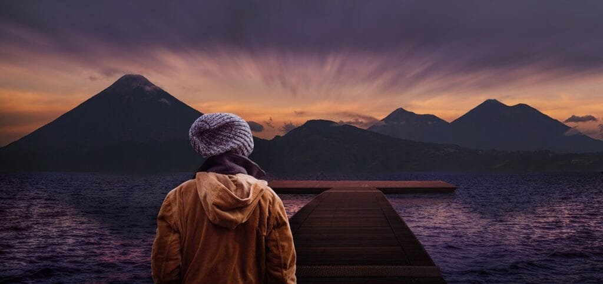

Volcanoes, a fascinating phenomenon of Earth's crust dynamics, are formed when molten rock, gases, and debris escape to the surface, resulting in eruptions of lava and ash. These majestic formations are found along plate boundaries, hotspots beneath the Earth's crust, or regions where tectonic plates are moving apart. The "Ring of Fire," encircling the Pacific Ocean, is a prime location for active volcanoes due to its tectonic plate intersections. On the other hand, shield volcanoes in Hawaii gradually form over deep underground hotspots and erupt with less intensity. By understanding the diverse eruption patterns and factors influencing volcanic activity, we can predict future disturbances and mitigate risks to nearby communities. Moreover, while volcanic eruptions contribute nutrients to the soil, they can also trigger devastating natural disasters. This insightful exploration into volcano formation uncovers the various types, geographical distribution, eruption causes, hazards, and benefits, laying the groundwork for further analysis of these captivating natural wonders.

  

## Foundation of Volcano Formation

Volcanoes are fascinating geological features that form when molten rock, gases, and debris escape from beneath the Earth's surface and erupt onto the land or into the ocean. To fully understand how volcanoes are formed, it is important to have a basic understanding of the Earth's crust and its various layers and components.

### Understanding the Earth's crust: layers and components

The Earth's crust is composed of several layers, including the uppermost layer called the lithosphere. The lithosphere is divided into tectonic plates, which are constantly moving and interacting with each other. These plates are made up of both continental and oceanic crust.

Beneath the lithosphere lies the asthenosphere, a semi-fluid layer that allows the movement of the tectonic plates. Below the asthenosphere is the mesosphere, which is solid and forms the lower part of the mantle. Finally, at the very center of the Earth, lies the core.

### Concept of plate tectonics

Plate tectonics is a scientific theory that explains the movement and interaction of the Earth's tectonic plates. It states that the Earth's lithosphere is divided into several large plates that float on top of the semi-fluid asthenosphere. These plates can either move away from each other, collide, or slide past each other.

It is at the plate boundaries where most volcanoes are formed. There are three main types of plate boundaries: divergent boundaries where plates move away from each other, convergent boundaries where plates collide, and transform boundaries where plates slide past each other.

### Role of molten rock, gases, and debris in volcano formation

The formation of volcanoes begins with the accumulation of molten rock, or magma, beneath the Earth's crust. Magma is formed when the Earth's heat causes rocks to melt deep within the mantle. This molten rock rises towards the surface through cracks and fractures in the crust.

As the magma rises, it collects gases such as water vapor, carbon dioxide, and sulfur dioxide. These gases become trapped within the magma and create pressure. Eventually, this pressure becomes too great, causing the magma to erupt through a vent or fissure in the Earth's surface.

When a volcanic eruption occurs, the magma is expelled from the volcano and is known as lava. Lava can flow slowly or explosively, depending on its viscosity, or resistance to flow. Additionally, the eruption can release solid materials, such as ash and debris, into the air.

## Types of Volcanoes

Volcanoes come in various shapes and sizes, each with its own unique characteristics. Understanding these different types of volcanoes can provide valuable insights into their formation and behavior.

### Stratovolcanoes or Composite Volcanoes

Stratovolcanoes, also known as composite volcanoes, are large and steep-sided volcanoes that are formed by alternating layers of lava, ash, and debris. These volcanoes are typically found at convergent plate boundaries, where one tectonic plate is forced beneath another in a process called subduction.

The explosive eruptions of stratovolcanoes are often characterized by pyroclastic flows, which are fast-moving currents of hot gas, ash, and rock fragments. Examples of stratovolcanoes include Mount Fuji in Japan and Mount St. Helens in the United States.

### Shield Volcanoes

Shield volcanoes are low, broad, and gently sloping volcanoes that are primarily composed of thin layers of lava flows. These volcanoes form gradually over time as a result of numerous eruptions of highly fluid lava.

Shield volcanoes are typically found at hotspots, or localized areas of intense volcanic activity, such as the Hawaiian Islands. The lava erupted by shield volcanoes has low viscosity, allowing it to flow easily and cover large distances. Examples of shield volcanoes include Mauna Loa and Kilauea in Hawaii.

### Cinder Cones

Cinder cones are small, cone-shaped volcanoes that are formed by the accumulation of volcanic material ejected during explosive eruptions. This material consists of small, solidified lava fragments called cinders.

Cinder cones are often found on the flanks of larger volcanoes or in volcanic fields. They typically have a steep, symmetrical shape and are relatively short-lived compared to other types of volcanoes. Examples of cinder cones include Paricutin in Mexico and Sunset Crater in the United States.

### Lava Domes

Lava domes, also known as volcanic domes, are rounded mounds of hardened lava that accumulate around a vent during some volcanic eruptions. These domes are formed when highly viscous lava is erupted, preventing it from flowing far from the vent.

Lava domes are often associated with explosive eruptions and can grow over time as additional lava is erupted and added to the dome. They can be found in various volcanic environments, including stratovolcanoes and volcano calderas. Examples of lava domes include Mount Pelée in Martinique and Mount Unzen in Japan.

This image is property of pixabay.com.

## Geographical Distribution of Volcanoes

Volcanoes are not evenly distributed across the Earth's surface but are rather concentrated in specific regions. Understanding the geographical distribution of volcanoes can help scientists better understand the underlying tectonic processes and identify areas at higher risk of volcanic activity.

### Volcanoes along Plate Boundaries

The majority of volcanoes are found along plate boundaries, where tectonic plates interact with each other. The most common [type of volcano found at plate boundaries is the stratovolcano](https://magmamatters.com/understanding-volcanic-formation-a-comprehensive-guide/ "Understanding Volcanic Formation: A Comprehensive Guide"), which occurs at convergent boundaries where plates collide or subduct.

Convergent plate boundaries, such as the subduction zones in the Pacific Ring of Fire, are the most volcanically active regions on Earth. As plates collide, the subducting plate is forced beneath the overriding plate, creating a deep zone of melting and magma generation.

### 'Ring of Fire' and its significance

The "Ring of Fire" is a vast area encircling the Pacific Ocean that is known for its intense volcanic and seismic activity. It is home to approximately 75% of the world's active volcanoes and is the site of frequent earthquakes and volcanic eruptions.

The Ring of Fire stretches from the western coast of South America, up through the west coast of North America, across the Aleutian Islands of Alaska, down through Japan and Southeast Asia, and back across the western coast of South America. This region is characterized by subduction zones, where one tectonic plate is forced beneath another, resulting in intense volcanic activity.

### Hotspots under the Earth's crust

Hotspots are areas of intense volcanic activity that are not directly associated with plate boundaries. Instead, hotspots are thought to be the result of plumes of hot mantle material that rise from deep within the Earth's interior.

As the tectonic plates move over these stationary hotspots, volcanic activity occurs, resulting in the formation of volcanoes. The Hawaiian Islands are a prime example of hotspots, where a chain of shield volcanoes has formed as the Pacific Plate moves over a stationary hotspot.

### Volcanoes at Rift Zones

Rift zones are areas where the Earth's crust is being pulled apart, resulting in the formation of a linear series of volcanic vents. These volcanoes are typically characterized by relatively gentle eruptions, as the magma generated at rift zones is less viscous.

Rift zones can be found along divergent plate boundaries, such as the Mid-Atlantic Ridge, where new crust is being formed as plates move away from each other. Examples of volcanoes at rift zones include those found along the East African Rift, such as Mount Nyiragongo in the Democratic Republic of Congo.

## Volcanic Eruption Patterns

Volcanic eruptions are not all the same. Different types of volcanoes exhibit varying eruption patterns, from slow and effusive lava flows to explosive and violent eruptions. The viscosity of the lava and the gas content within the magma are two major factors that influence eruption patterns.

### Influence of Lava Viscosity and Gas Content

The viscosity of lava refers to its resistance to flow. Lava with low viscosity, such as that produced by shield volcanoes, flows easily and can cover large areas. On the other hand, lava with high viscosity, like that erupted by stratovolcanoes, is thicker and flows more slowly.

The gas content within the magma also plays a crucial role in eruption patterns. As magma rises towards the surface, the decrease in pressure allows dissolved gases to form bubbles. If the gas content is high and the magma is viscous, the trapped gas can create explosive eruptions. Conversely, low gas content and low viscosity lava result in more effusive eruptions.

### Effusive Eruptions vs. Explosive Eruptions

Effusive eruptions, also known as passive eruptions, are characterized by the slow and steady flow of lava. These eruptions occur when low viscosity magma is expelled from a volcano. The lava flows calmly and can travel significant distances, posing less risk to nearby communities.

Explosive eruptions, on the other hand, are violent and characterized by the ejection of ash, rock fragments, and gas into the atmosphere. These eruptions usually occur when the magma is highly viscous and gas-rich. The explosive nature of these eruptions can result in the [formation of pyroclastic flows](https://magmamatters.com/the-environmental-impact-of-volcanic-eruptions-2/ "The Environmental Impact of Volcanic Eruptions") and pose significant hazards to surrounding areas.

### Variation in eruption patterns among different types of volcanoes

Different types of volcanoes display distinct eruption patterns. Stratovolcanoes, with their high viscosity magma and high gas content, are known for their explosive eruptions. These eruptions can result in the formation of pyroclastic flows and produce ash clouds that can travel long distances.

Shield volcanoes, on the other hand, typically experience more effusive eruptions characterized by the gentle flow of low viscosity lava. These eruptions can last for an extended period and cause the gradual growth of the volcano over time.

Cinder cones, due to their smaller size and short-lived nature, generally have more explosive eruptions. The eruption style of lava domes can vary, depending on the viscosity of the magma being erupted.

This image is property of pixabay.com.

## Causes Behind Eruptions

Volcanic eruptions are the result of various geological processes and factors. Understanding the underlying causes behind eruptions is crucial for monitoring and predicting volcanic activity.

### Movement of Tectonic Plates

One of the primary causes of volcanic eruptions is the movement of tectonic plates. When plates collide at convergent boundaries or move apart at divergent boundaries, the pressure and friction can result in the melting of rock and the generation of magma.

As the magma rises to the surface, it can erupt, leading to volcanic activity. The location, intensity, and nature of eruptions depend on the specific tectonic setting and the characteristics of the magma being erupted.

### Pressure Increase Due To Gas Buildup

The buildup of gases within the magma can also lead to volcanic eruptions. As magma rises towards the surface, the decrease in pressure allows dissolved gases, such as water vapor, carbon dioxide, and sulfur dioxide, to form bubbles.

If the magma is viscous and the gas content is high, the trapped gases can create significant pressure. Once this pressure exceeds the strength of the surrounding rocks, an eruption occurs, allowing the magma, gases, and other volcanic material to be expelled.

### Role of Mantle Plumes and Hot Spots

Mantle plumes and hotspots are another cause of volcanic eruptions. Mantle plumes are areas of abnormally hot rock that rise from deep within the mantle towards the Earth's surface. When these plumes intersect with the lithosphere, they can cause volcanic activity.

Hotspots, which are thought to be the surface expression of mantle plumes, are areas of intense volcanic activity that occur away from plate boundaries. The Hawaiian Islands, for example, are formed by a hotspot that has created a chain of shield volcanoes as the Pacific Plate moves over the stationary hotspot.

## Hazards from Volcanic Eruptions

Volcanic eruptions can have significant impacts on both the natural environment and human populations. The hazards associated with volcanic eruptions are diverse and can range from the destruction of property to the loss of life.

### Lava Flows and Pyroclastic Flows

One of the most recognizable hazards from volcanic eruptions is the flow of lava. Lava flows can cause the destruction of buildings, infrastructure, and agricultural land. While slow-moving lava flows can often be diverted or controlled, fast-moving lava flows can be highly destructive.

Pyroclastic flows, on the other hand, are dense, rapidly moving currents of hot gas, ash, and volcanic debris that can travel at high speeds. They are often associated with explosive eruptions from stratovolcanoes and can be extremely deadly.

### Volcanic Ash and Volcanic Gases

Volcanic eruptions can release large amounts of ash into the atmosphere. Volcanic ash consists of fine rock particles that can be carried by winds over long distances. Ashfall can have serious impacts on agriculture, infrastructure, and air travel.

Volcanic gases, such as sulfur dioxide, carbon dioxide, and hydrogen sulfide, can also pose hazards to both human health and the environment. These gases can contribute to the formation of acid rain and can have detrimental effects on air quality.

### Landslides and Tsunamis induced by Volcanoes

Volcanic eruptions can trigger landslides, especially in steep, mountainous terrain. These landslides can cause additional destruction and can generate secondary hazards such as debris flows and lahars, which are fast-moving mixtures of volcanic debris and water.

Underwater volcanic eruptions can also lead to the formation of tsunamis. When a volcano erupts beneath the ocean surface or collapses into the sea, it can displace a large volume of water, resulting in the generation of potentially devastating tsunamis.

### Climate Impact of Volcanic Eruptions

Volcanic eruptions can have a significant impact on the Earth's climate. When [volcanoes release large quantities of sulfur dioxide](https://magmamatters.com/the-art-and-science-of-volcano-monitoring/ "The Art and Science of Volcano Monitoring") into the atmosphere, it can react with water vapor to form tiny sulfate particles. These particles can remain in the stratosphere for several years, reflecting sunlight and cooling the Earth's surface.

Major volcanic eruptions have been known to cause temporary global cooling, as seen in the aftermath of the 1991 eruption of Mount Pinatubo in the Philippines. The cooling effect of volcanic aerosols can have implications for weather patterns, agriculture, and global climate models.

This image is property of pixabay.com.

## Benefits of Volcanic Eruptions

While volcanic eruptions are often associated with destruction and hazards, they also have some positive impacts on the environment and human society.

### Soil Enrichment

Volcanic eruptions can enrich the soil with valuable nutrients and minerals. The volcanic ash and lava contain essential elements such as potassium, phosphorous, and calcium, which can enhance soil fertility. This soil enrichment can benefit agriculture and promote the growth of crops.

### Creation of new landforms

Volcanic eruptions contribute to the creation of new landforms. Over time, volcanic activity can build up mountains, islands, and other distinctive geological features. These landforms provide unique habitats for diverse ecosystems and can attract tourism and scientific interest.

### Geothermal Energy and Mineral Deposits

[Volcanic regions often have significant geothermal energy](https://magmamatters.com/geothermal-energy-and-its-volcanic-origins/ "Geothermal Energy and Its Volcanic Origins") resources. The heat generated from volcanic activity can be harnessed to generate electricity and provide heating for nearby communities.

Volcanoes also play a role in the formation of mineral deposits. The heat and fluid-rich environments associated with volcanism can drive the deposition of valuable minerals, including copper, gold, and silver. These mineral deposits can be economically significant and contribute to local economies.

### Impact on global temperature

In addition to their short-term climate impacts, volcanic eruptions can also influence global temperature patterns over longer timescales. Volcanic aerosols, by reflecting sunlight, can reduce the amount of solar radiation reaching the Earth's surface, resulting in a cooling effect.

While this cooling effect may be temporary, it can still have [implications for climate models](https://magmamatters.com/the-role-of-volcanoes-in-earths-carbon-cycle-5/ "The Role Of Volcanoes In Earth’s Carbon Cycle") and provide valuable insights into the complex interactions between the atmosphere, volcanoes, and the Earth's climate system.

## Monitoring and Predicting Volcanic Activity

Monitoring and predicting volcanic activity are crucial for mitigating the risks associated with volcanic eruptions and protecting vulnerable populations. Scientists employ various techniques to measure, observe, and interpret volcanic activity.

### Measurement and Monitoring Techniques

Scientists use a range of instruments and techniques to monitor volcanoes. These include seismometers, which measure ground vibrations caused by volcanic activity, and tiltmeters, which measure changes in the tilt of the land surface.

Ground-based and satellite-based remote sensing tools, such as thermal cameras and gas analyzers, can provide insights into changes in volcanic activity. These monitoring techniques help scientists track volcanic gas emissions, ground deformation, and other indicators of volcanic unrest.

### Interpreting Seismic Activity

Seismic activity, or the vibrations and movements of the Earth caused by volcanic processes, is a critical indicator of volcanic activity. By analyzing seismic data, scientists can identify changes in magma movement, the formation of fractures, and other volcanic processes.

Different types of seismic activity, such as volcano-tectonic earthquakes, long-period events, and harmonic tremors, can provide clues about the state of a volcano and the likelihood of an eruption. Monitoring and interpreting seismic activity are essential for predicting volcanic eruptions and issuing timely warnings.

### Gas Emissions and Ground Deformation Monitoring

The measurement and analysis of volcanic gas emissions are integral to volcano monitoring. Volcanic gases, such as sulfur dioxide, carbon dioxide, and water vapor, can provide valuable insights into volcanic processes and potential eruptions.

Ground deformation, or changes in the shape or elevation of the land surface, is another crucial indicator of volcanic activity. By using techniques such as GPS and satellite radar interferometry, scientists can track subtle changes in ground deformation that may precede an eruption.

### Challenges in Predicting Volcanic Eruptions

While significant progress has been made in monitoring and predicting volcanic activity, accurately forecasting volcanic eruptions remains challenging. Volcanic systems are complex, with numerous interacting factors, and each volcano has its own unique behavior.

There are several factors that contribute to the difficulty of predicting volcanic eruptions. These include the inability to directly observe the subsurface processes occurring beneath a volcano, the inherent variability and complexity of volcanic systems, and the limited understanding of all the factors that influence eruption behavior.

Despite these challenges, ongoing research and technological advancements continue to improve our understanding of volcanic processes and enhance eruption forecasting capabilities.

## Mitigating Risks from Volcanoes

Mitigating the risks associated with volcanoes requires a comprehensive approach that involves education, preparedness, and strategic planning. By implementing effective mitigation measures, the impacts of volcanic eruptions can be reduced, and vulnerable communities can be better prepared to respond.

### Community Preparedness and Education

Educating communities at risk of volcanic eruptions is crucial for reducing the potential impacts. Public awareness campaigns that provide information on volcanic hazards, evacuation procedures, and emergency preparedness can help communities understand the risks they face and the necessary steps to take in the event of an eruption.

Schools, local authorities, and community organizations play a key role in disseminating information and conducting drills to ensure that individuals know how to respond during volcanic emergencies. Public education programs can empower communities and save lives in times of crisis.

### Evacuation Plans and Early Warning Systems

Developing robust evacuation plans and early warning systems is essential for protecting communities at risk of volcanic eruptions. Volcano observatories and monitoring agencies work to detect and monitor signs of volcanic unrest and issue timely warnings to the public.

Early warning systems rely on real-time monitoring data, such as seismic activity, gas emissions, and ground deformation, to detect changes in volcanic behavior. Once a potential eruption is detected or volcanic unrest reaches a critical level, warnings can be disseminated through various channels, including sirens, mobile alerts, and media platforms.

Evacuation plans outline the appropriate actions for individuals and communities to take in the event of an eruption. These plans include designated evacuation routes, safe zones, and communication protocols to ensure a coordinated response and minimize risks.

### Urban Planning Around Volcanic Areas

Implementing appropriate urban planning strategies around volcanic areas can mitigate the risks associated with volcanic eruptions. This includes zoning regulations, land use planning, and infrastructure development that take into account the potential hazards and impacts of volcanic activity.

Restricting certain activities, such as residential construction, in high-risk zones can help to reduce exposure to volcanic hazards. Designing buildings and infrastructure to withstand volcanic ashfall, ground shaking, and other volcanic impacts is also essential.

Collaboration between government agencies, urban planners, and scientists is necessary to develop and enforce effective land use policies that balance the need for development with the need to protect communities from volcanic hazards.

### Role of Global Volcano Monitoring Networks

International collaboration and the establishment of global volcano monitoring networks are crucial for enhancing the understanding of volcanic activity and improving eruption forecasting capabilities. By sharing data, resources, and expertise, scientists can better monitor and analyze volcanic processes on a global scale.

Volcano observatories and monitoring agencies around the world work together to exchange information, coordinate research efforts, and support countries at risk of volcanic hazards. This collaborative approach improves the accuracy of volcano monitoring and provides valuable insights into volcanic behavior.

Global volcano monitoring networks also facilitate the sharing of best practices, the development of standardized monitoring techniques, and capacity building in volcanic hazard assessment and response.

## Case Study: Comparing Volcanoes

Comparing different volcanoes can provide valuable insights into their characteristics, eruption patterns, and associated hazards and benefits. In this case study, we will compare volcanoes from the "Ring of Fire" and shield volcanoes in Hawaii.

### Comparison of 'Ring of Fire' Volcanoes and Hawaiian Shield Volcanoes

The volcanoes of the "Ring of Fire" are primarily stratovolcanoes that occur at convergent plate boundaries around the Pacific Ocean. These volcanoes tend to have steep sides, composite structures, and explosive eruption styles.

In contrast, Hawaiian shield volcanoes are characterized by their gently sloping sides and continuous effusive eruptions. These shield volcanoes are formed by the eruption of low viscosity basaltic lava, which flows easily and can cover large distances.

The differences in eruption style between "Ring of Fire" volcanoes and Hawaiian shield volcanoes can be attributed to the variations in magma composition and gas content. The magma erupted by stratovolcanoes is generally more viscous and gas-rich, leading to more explosive eruptions.

### Analyzing Different Eruption Patterns

Stratovolcanoes along the "Ring of Fire" exhibit explosive eruption patterns characterized by pyroclastic flows, ash plumes, and lahars. These eruptions are often dangerous and can cause significant damage to surrounding areas.

On the other hand, Hawaiian shield volcanoes experience continuous effusive eruptions characterized by the gentle flow of lava. These eruptions are less hazardous to human populations but can still have significant impacts on the environment.

The eruption patterns of volcanoes can vary depending on factors such as magma composition, gas content, and the presence of water. By analyzing these patterns, scientists can better understand the behavior of specific volcanoes and make more accurate predictions about future eruptions.

### Comparative Study of Hazards and Benefits

The hazards and benefits associated with "Ring of Fire" volcanoes and Hawaiian shield volcanoes differ due to their distinct eruption styles and geographical locations.

Stratovolcanoes along the "Ring of Fire" pose significant hazards, including pyroclastic flows, lahars, and ashfall. These hazards can result in the loss of life, destruction of infrastructure, and impact on regional and global air quality.

In contrast, Hawaiian shield volcanoes, although less explosive, can still produce lava flows that pose risks to nearby communities. However, these volcanic eruptions also provide benefits, such as the creation of new land and the enrichment of soil with volcanic nutrients. Additionally, the geothermal energy resources associated with shield volcanoes have the potential to provide clean and renewable energy.

Understanding the hazards and benefits associated with different types of volcanoes is crucial for developing effective mitigation strategies, enhancing preparedness, and minimizing the risks to human populations.

In conclusion, understanding the foundation of volcano formation, the different types of volcanoes, their geographical distribution, eruption patterns, and the causes behind volcanic eruptions is essential for comprehending the hazards and benefits associated with volcanoes. Mitigating the risks from volcanic eruptions requires a combination of scientific monitoring and prediction, community preparedness, and strategic planning. By studying and comparing different volcanoes, scientists can gain valuable insights into their behavior and improve their ability to forecast volcanic activity. Ultimately, understanding volcanoes and their impacts can help protect vulnerable communities and foster sustainable development in volcanic regions.

Related Posts: [Mitigating Risks: Forecasting Volcanic Activity in Prone Areas](https://magmamatters.com/mitigating-risks-forecasting-volcanic-activity-in-prone-areas/), [The Formation and Eruption Patterns of Volcanoes](https://magmamatters.com/the-formation-and-eruption-patterns-of-volcanoes-4/), [The Pyroclastic Phenomena of Pompeii: 7 Insights to Explore](https://magmamatters.com/the-pyroclastic-phenomena-of-pompeii-7-insights-to-explore/), [Tips for Capturing Volcano Pyroclastic Flow Photos](https://magmamatters.com/tips-for-capturing-volcano-pyroclastic-flow-photos/), [Understanding Volcanoes and Their Eruption Patterns](https://magmamatters.com/understanding-volcanoes-and-their-eruption-patterns/)
