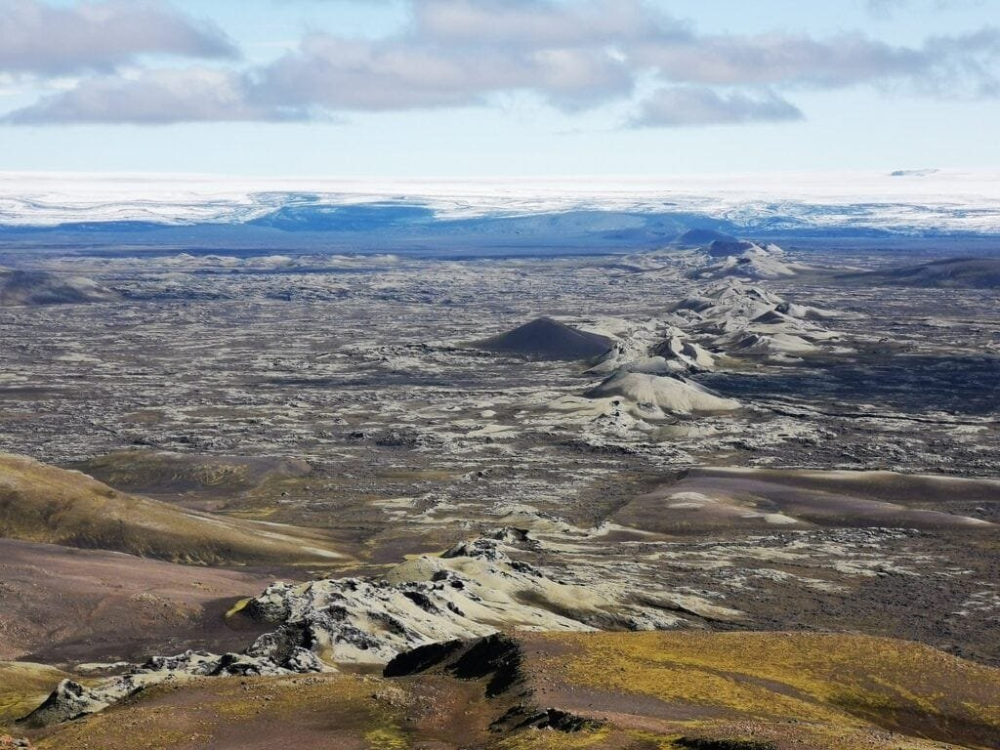
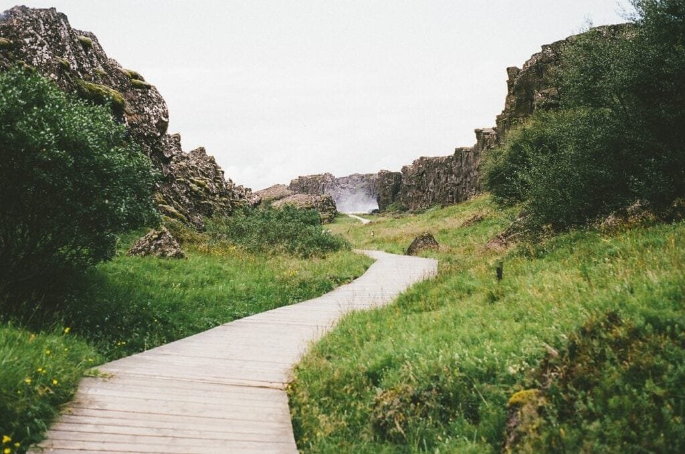

Get ready to uncover the fascinating world of volcanoes at plate boundaries! You'll explore how these awe-inspiring natural formations are created by the powerful forces that lie beneath the Earth's surface. From the explosive volcanoes found along the Ring of Fire to the gradual formation of shield volcanoes in Hawaii, each type offers a unique glimpse into our planet's wonders. Discover the varying eruption patterns, the factors that influence them, and the reasons behind the risks and benefits they bring. By gaining insights into the formation and behavior of volcanoes, you'll gain a deeper understanding of these remarkable geological features and their impact on the surrounding communities. Get ready for an adventure like no other as we delve into the captivating world of volcanoes at plate boundaries!

<iframe width="560" height="315" src="https://www.youtube.com/embed/Y0eWnOZpSpQ" frameborder="0" allow="accelerometer; autoplay; encrypted-media; gyroscope; picture-in-picture" allowfullscreen></iframe>

  

## Definitions and Terminology

### Explanation of key terms including volcano, plate boundaries, and eruption

A volcano is a geological formation where molten rock, gases, and debris escape to the earth's surface through an opening called a vent. This process, known as an eruption, can result in the release of lava, ash, gases, and pyroclastic materials. Plate boundaries refer to the areas where tectonic plates meet and interact. There are three main types of plate boundaries: convergent boundaries where plates collide, divergent boundaries where plates move apart, and transform boundaries where plates slide past each other. These plate boundaries play a significant role in the formation and activity of volcanoes.

### Different types of volcanic activity and their characteristics

Volcanic activity can manifest in different ways, resulting in various types of volcanoes. Understanding the characteristics of each type is essential in studying and predicting volcanic behavior. Some key types of volcanic activity include:

1. **Stratovolcanoes**: Also known as composite volcanoes, stratovolcanoes are characterized by their steep slopes and symmetrical shape. They are composed of layers of hardened lava, volcanic ash, and other volcanic materials. These volcanoes are associated with explosive eruptions, producing thick lava flows and pyroclastic flows.
    
2. **Shield volcanoes**: Shield volcanoes have a broad, gently sloping shape resembling a warrior's shield, which explains their name. They are typically formed through the accumulation of fluid basaltic lava flows over time. Shield volcanoes have a less explosive eruptive style, with lava flowing steadily from vents or fissures.
    
3. **Cinder cones**: Cinder cones are small, conical volcanoes that are often formed from explosive eruptions. They are composed of loose fragments of volcanic material, known as cinders or scoria. These volcanoes have a steep slope and are typically short-lived, erupting for relatively shorter periods compared to other types.
    

Understanding the different types of volcanic activity and their characteristics provides a foundation for further exploration of volcanology.

## Types of Volcanoes

### Stratovolcanoes and their characteristics

Stratovolcanoes, as mentioned earlier, are tall and symmetrical volcanoes with steep slopes. They are characterized by periodic explosive eruptions, which are a result of the magma's high viscosity and high gas content. The volcanic materials, including lava, ash, and pyroclastic flows, solidify and accumulate in alternating layers, giving rise to the stratified appearance of these volcanoes. Mount Fuji in Japan and Mount St. Helens in the United States are examples of stratovolcanoes.

### Shield volcanoes and their features

Shield volcanoes, in contrast to stratovolcanoes, have a low profile with gently sloping sides. They are primarily composed of basaltic lava flows, which have low viscosity and can travel long distances. This low-viscosity lava allows it to spread out in thin layers, creating the shield-like shape. The Hawaiian Islands are home to several shield volcanoes, including Mauna Loa and Kilauea. These volcanoes often exhibit continuous and effusive eruptions, with lava flowing steadily from fissures or vents.

### Cinder cones and their unique properties

Cinder cones, also known as scoria cones, are the simplest and smallest type of volcanoes. They are usually formed from short, explosive eruptions. During these eruptions, volcanic materials such as cinders, lapilli, and bombs are ejected into the air and fall back to form a cone-shaped hill. Cinder cones typically have a bowl-shaped crater at the summit and are found in groups or as solitary features. Paricutin in Mexico is an example of a cinder cone volcano.

Understanding the characteristics and features of different types of [volcanoes helps shed light on the diverse nature](https://magmamatters.com/the-environmental-impact-of-volcanic-eruptions-2/ "The Environmental Impact of Volcanic Eruptions") of these geological formations.

This image is property of pixabay.com.

## Tectonic Plate Boundaries and Volcanoes

### Understanding tectonic plates

Tectonic plates are large, rigid pieces of the Earth's lithosphere that fit together like a jigsaw puzzle. These plates are in constant motion, driven by underlying convective currents in the Earth's mantle. There are several major plates, including the North American, Pacific, Eurasian, and African plates. Along the boundaries where these plates interact, volcanoes are often formed.

### Three types of plate boundaries: convergent, divergent, and transform

Plate boundaries are classified into three main types based on the type of movement occurring between the plates:

1. **Convergent boundaries**: At convergent boundaries, two plates collide, resulting in intense compression and subduction, where one plate is forced beneath the other. This subduction can lead to the formation of stratovolcanoes as the subducting plate releases water into the mantle, inducing partial melting and the ascent of magma.
    
2. **Divergent boundaries**: Divergent boundaries occur where two plates move apart, creating a gap into which magma rises from the mantle. This upwelling of magma forms new crust as it cools and solidifies, resulting in volcanic activity. Shield volcanoes often occur at divergent plate boundaries.
    
3. **Transform boundaries**: Transform boundaries are characterized by plates sliding past each other horizontally. While transform boundaries are not typically associated with volcanic activity, they can influence the behavior of nearby volcanoes.
    

### Connection between plate boundaries and volcanic activity

The movement and interaction of tectonic plates play a crucial role in the formation and activity of volcanoes. The convergence of plates leads to the subduction of one plate beneath the other, generating the pressure and conditions necessary for volcanic eruptions. Divergent boundaries, on the other hand, create pathways for magma to rise and form new crust. The specific characteristics and types of volcanoes formed at plate boundaries are a direct result of the dynamics and forces acting between the plates.

## Hotspots and Their Role in Volcanic Formation

### Definition of a hotspot in geological terms

In geology, a hotspot refers to a volcanic region or area within the Earth's mantle where magma is thought to upwell in a relatively fixed position. The magma originates deep within the mantle and rises through the crust due to a combination of buoyancy and pressure. Hotspots are believed to be stable sources of volcanic activity, with the overlying tectonic plates moving over them.

### Process of volcano formation over hotspots

When a tectonic plate moves over a hotspot, the rising magma can penetrate the crust and form a volcano on the Earth's surface. As the plate continues to move, the volcano is eventually separated from the hotspot, leading to its extinction. However, a new volcano can form in its place, manifesting as a linear chain of volcanic islands or seamounts. This chain of volcanic activity provides evidence of the plate's movement over the hotspot. The Hawaiian Islands, formed by the Pacific Plate's movement over the Hawaiian hotspot, are a well-known example of this process.

### Notable examples of hotspots and resulting volcanoes like those in Hawaii

The Hawaiian Islands, located in the central Pacific Ocean, are the most prominent example of hotspot-related volcanic activity. The islands form a chain with progressively older volcanoes towards the northwest. The active shield volcano Kilauea on the Big Island of Hawaii is one of the most famous examples of hotspot volcanism. Kilauea has been erupting continuously since 1983 and exhibits relatively effusive eruptions characterized by flowing lava. The Hawaiian hotspot has also given rise to other volcanoes, such as Mauna Loa and Mauna Kea, which are now dormant or extinct.

Understanding the role of hotspots in volcanic formation allows scientists to study the history and dynamics of these volcanic regions and their impact on the Earth's surface.

This image is property of pixabay.com.

## The Role of Magma in Volcanic Formation

### Composition of magma

Magma is a molten mixture of rocks, minerals, and dissolved gases that exists beneath the Earth's surface. It is primarily composed of three main components:

1. **Silicate minerals**: Silicate minerals, such as quartz and feldspar, are the most abundant components of magma. These minerals give magma its characteristic properties and can influence its eruptive behavior.
    
2. **Dissolved gases**: Magma contains various volatile gases, including water vapor, carbon dioxide, and sulfur dioxide. These gases accumulate within the magma chamber and play a significant role in determining the explosiveness of volcanic eruptions.
    
3. **Liquids**: Magma also contains a small amount of liquid, which consists of a mixture of silicate melt and dissolved volatiles. The specific composition of the liquid phase can affect the viscosity and density of the magma.
    

### Magma properties influencing volcanic formation and type

The properties of magma, including its viscosity, gas content, and temperature, play a crucial role in determining the type of volcano that forms and its eruptive behavior. Highly viscous magma, characterized by high silica content, tends to resist flow and trap gases, leading to explosive eruptions and the formation of stratovolcanoes. In contrast, low-viscosity magma, with low silica content, allows gases to escape more easily and results in effusive eruptions and shield volcano formation.

Additionally, the temperature of magma affects its density and capacity to rise through the Earth's crust. Cooler, more dense magma tends to remain trapped beneath the surface and can lead to the formation of intrusive igneous features, such as batholiths or dikes. Hotter magma, with lower density, is more likely to rise and erupt, creating extrusive volcanic landforms.

### How magma reaches the earth's surface

Magma reaches the Earth's surface through volcanic vents or fissures during eruptions. The ascent of magma is driven by the buoyancy of the molten rock and the buildup of pressure within the magma chamber. As the pressure exceeds the strength of the overlying rock, the magma is forcefully expelled, leading to volcanic eruptions. The erupted magma, now called lava, flows out onto the Earth's surface, building up layers of solidified volcanic materials over time.

Understanding the composition and properties of magma helps scientists predict eruption styles and provides valuable insights into the formation and behavior of volcanoes.

## Volcanic Eruptions and Associated Patterns

### Different types of eruptions - effusive and explosive

Volcanic eruptions can be classified into two broad categories based on their eruptive behavior:

1. **Effusive eruptions**: Effusive eruptions are characterized by the slow and steady flow of lava onto the Earth's surface. These eruptions typically occur in shield volcanoes and are associated with low-viscosity magma. The lava flows freely, advancing gradually and covering extensive areas.
    
2. **Explosive eruptions**: Explosive eruptions involve the sudden release of gas, magma, and volcanic materials in a violent burst. These eruptions are primarily associated with stratovolcanoes and cinder cones, where the magma is more viscous and gas-rich. The high gas content creates pressure within the magma, leading to explosive fragmentation and the ejection of volcanic ash, pyroclastic flows, and other materials.
    

### Patterns of eruptions and their connection to volcano type and magma properties

The eruptive patterns of volcanoes are influenced by several factors, including the type of volcano and the properties of the magma involved. Effusive eruptions observed in shield volcanoes are often characterized by lava fountains or the steady outpouring of lava from fissures or vents. These eruptions are usually non-explosive and can last for prolonged periods.

In contrast, explosive eruptions associated with stratovolcanoes and cinder cones tend to be more violent and short-lived. These eruptions result from the rapid release of accumulated gases, causing the magma to explode into fragmented rock and ash. The explosive nature of these eruptions is due to the higher viscosity and gas content of the magma involved.

The specific eruptive patterns of volcanoes provide valuable information about the underlying magma properties and the volcanoes' potential hazards.

### Impact of eruptions on volcano shape and size

Volcanic eruptions play a significant role in shaping the appearance and size of volcanoes. During an eruption, lava and other volcanic materials are ejected onto the surface and gradually build up around the vent or fissure. As multiple eruptions occur over time, the accumulated layers of volcanic materials create the characteristic shape and size of the volcano.

Effusive eruptions, which produce steady lava flows, tend to result in broad and gently sloping shield volcanoes. These volcanoes can cover vast areas and exhibit a low, wide profile. In contrast, explosive eruptions, characterized by the ejection of ash, pyroclastic materials, and the formation of steep-sided cones, lead to the formation of stratovolcanoes and cinder cones.

The impact of eruptions on volcano shape and size provides important insights into the eruptive history and behavior of volcanoes.

This image is property of pixabay.com.

## Geographic Distribution of Volcanoes

### Global pattern of volcano distribution

Volcanoes are not evenly distributed across the Earth's surface but instead exhibit specific patterns and concentrations. The global pattern of volcano distribution reveals that the majority of volcanoes are located at plate boundaries. The most well-known concentration of volcanoes is the "Ring of Fire" encircling the Pacific Ocean, where tectonic activity is particularly high. This region experiences a significant number of earthquakes and volcanic eruptions due to the subduction of several tectonic plates.

Outside of the Ring of Fire, other volcanic regions can be found along mid-ocean ridges, where divergent plate boundaries generate volcanic activity. Additionally, hotspots, such as the one in Hawaii, can give rise to clusters of volcanic islands or regions with a higher density of volcanoes.

### Why some areas such as the 'Ring of Fire' have high concentrations of volcanoes

The high concentration of volcanoes in areas like the "Ring of Fire" can be attributed to the intense tectonic activity occurring along plate boundaries. Within this region, several tectonic plates converge, generating significant compressive forces and subduction zones. Subduction allows water-rich oceanic crust to be forced into the mantle, leading to the partial melting of the mantle and the ascent of magma. This magma then rises to the surface, giving rise to volcanic activity.

In addition to the subduction zones, the Ring of Fire also encompasses various transform boundaries, where plates slide past each other. These transform boundaries, while not primarily associated with volcanic activity, can influence the behavior and distribution of volcanoes in the region.

### Role of tectonic plates and hotspots in geographic distribution

Both tectonic plates and hotspots play crucial roles in the geographic distribution of volcanoes. As mentioned earlier, plate boundaries are hotspots for volcanic activity due to the interaction and movement of tectonic plates. The convergence, divergence, and lateral movement of plates generate the conditions necessary for volcanic formation.

Hotspots, on the other hand, can create localized clusters of volcanic activity away from plate boundaries. These geologically stable regions, located within the interior of tectonic plates, provide an alternate source of magma and volcanic activity. The combination of these two factors, plate boundaries, and hotspots, contributes to the overall geographic distribution of volcanoes on Earth.

Understanding the patterns and distribution of volcanoes helps scientists identify regions prone to volcanic activity and assess potential hazards.

## Risks and Hazards Associated with Volcanic Activity

### Short-term hazards such as lava flows, ash fall, and pyroclastic flows

Volcanic eruptions pose various short-term hazards that can impact both the immediate vicinity of the volcano and more extensive areas. Some of the most significant short-term hazards include:

1. **Lava flows**: During an eruption, lava can flow downhill, potentially destroying everything in its path. Fast-moving lava flows can pose a direct threat to human settlements, infrastructure, and agriculture.
    
2. **Ash fall**: Volcanic eruptions eject ash into the atmosphere, which can travel long distances, depending on wind patterns. Ash fall can endanger human health by causing respiratory problems and eye irritation. It can also disrupt transportation, damage infrastructure, and impact agriculture.
    
3. **Pyroclastic flows**: These fast-moving, high-temperature currents of gas, ash, and rock fragments can rush down the sides of a volcano, destroying anything in their path. Pyroclastic flows are extremely dangerous and can cause significant damage to surrounding areas.
    

### Long-term hazards like climate change effects and landscape changes

In addition to the immediate hazards of volcanic eruptions, there are also long-term impacts associated with volcanic activity. These include:

1. **Climate change effects**: Volcanic eruptions release large amounts of gases, including sulfur dioxide, which can combine with water vapor in the atmosphere to form sulfuric acid aerosols. These aerosols can reflect sunlight back into space, resulting in a temporary cooling effect on the Earth's climate.
    
2. **Landscape changes**: Volcanic eruptions can dramatically alter the surrounding landscape. They can create new landmasses, reshape coastlines, form craters, calderas, and lava tubes, and even lead to the collapse of volcanic cones. These landscape changes can have lasting effects on the environment and local ecosystems.
    

### Societal impact of volcanic hazards and risk management strategies

The hazards associated with volcanic activity can have significant societal impacts, both in terms of human lives and infrastructure. It is crucial to develop effective risk management strategies to mitigate these risks and protect vulnerable communities. Some key risk management strategies include:

1. **Monitoring and early warning systems**: Implementing robust monitoring systems that can detect precursory signs of volcanic activity can provide advance warning to at-risk populations. This allows for the implementation of evacuation plans and other necessary measures to minimize the impact on human life.
    
2. **Land-use planning and zoning**: Sensible land-use planning is crucial in areas prone to volcanic hazards. Establishing exclusion zones and limiting construction in high-risk areas can help minimize exposure to potential eruptions and reduce the impact on human settlements.
    
3. **Public education and awareness**: Educating communities about volcanic hazards, emergency preparedness, and evacuation procedures is essential in building resilience and reducing the risk to individuals. Public awareness campaigns can help disseminate important information and raise awareness about the hazards associated with living near active volcanoes.
    

By implementing these risk management strategies, it is possible to reduce the impacts of volcanic hazards on communities and ensure the safety of those living in volcanic regions.

## Volcanic Benefits and Contributions

### Volcanic soil fertility

Volcanic eruptions contribute to the formation of incredibly fertile soils, known as volcanic or Andisol soils. When lava and other volcanic materials break down and weather over time, they release essential nutrients and minerals into the soil. These nutrients, such as potassium, phosphorus, and calcium, promote plant growth and enhance soil fertility. Volcanic soils are highly prized for agricultural purposes and are often used for cultivating crops such as coffee, cocoa, and tropical fruits.

### Creation of new land

Volcanic eruptions can also create new landmasses. As magma reaches the Earth's surface and solidifies, it builds up layers of volcanic material and can eventually form islands or expand existing coastlines. Over time, the accumulation of volcanic materials can result in the formation of new land areas, contributing to the geographical evolution of the Earth.

### Volcanic activity’s contribution to earth's geological and atmospheric evolution

Volcanic activity plays a significant role in the geological and atmospheric evolution of the Earth. Erupting volcanoes release large quantities of gases and aerosols into the atmosphere, which can influence climate patterns. Volcanic gases contribute to the composition of the Earth's atmosphere and have influenced its evolution over billions of years.

Additionally, volcanic activity is associated with the recycling of the Earth's crust and the formation of new rocks. The release of magma during volcanic eruptions can lead to the formation of new igneous rocks, replenishing the Earth's crust and contributing to its geological diversity.

Understanding the benefits and contributions of volcanic activity is essential in appreciating the complex role that these geological phenomena play in shaping our planet.

## Predicting Volcanic Activity and Mitigation Measures

### Current state of volcano prediction methods

Volcano prediction remains a complex and challenging task due to the dynamic and unpredictable nature of volcanic systems. However, advancements in technology and monitoring techniques have improved our understanding of volcanic behavior, allowing for more accurate predictions. Some of the current methods used to predict volcanic activity include:

1. **Monitoring ground deformation**: Measuring changes in the shape and elevation of a volcano can provide valuable information about magma movement and accumulation. Techniques such as GPS, satellite radar interferometry, and tiltmeters help detect ground deformations, which can be indicative of impending eruptions.
    
2. **Gas emissions monitoring**: Volcanoes release various gases, including sulfur dioxide and carbon dioxide, before and during eruptions. Monitoring the composition and volume of these gases can provide insights into magma movement and the potential for an eruption.
    
3. **Seismic monitoring**: [Volcanoes often exhibit increased seismic activity](https://magmamatters.com/the-art-and-science-of-volcano-monitoring/ "The Art and Science of Volcano Monitoring") leading up to an eruption. Monitoring seismic events, such as the frequency and magnitude of earthquakes, can help identify patterns and forecast volcanic eruptions.
    

### Use of technology and monitoring in prediction

Technological advancements have tremendously aided volcanic monitoring and prediction efforts. Remote sensing techniques, such as satellite-based monitoring, provide regular and accurate information about volcanic activity. Ground-based monitoring stations equipped with a variety of sensors and instruments continuously assess volcanic parameters such as gas emissions, ground deformation, and seismic activity.

Real-time data collection and analysis enable volcanologists to detect subtle changes in volcanic behavior and provide timely warnings to at-risk populations. The integration of these technological tools with existing monitoring networks enhances our ability to predict volcanic activity and mitigate potential hazards.

### Mitigation strategies to reduce risk to communities

Mitigation strategies are crucial in reducing the risk to communities living in volcanic regions. Some key measures include:

1. **Emergency preparedness**: Communities at risk should develop comprehensive emergency response plans, including evacuation routes, shelters, and communication systems. Education and drills can help familiarize community members with protocols and ensure they are well-prepared to respond during an eruption.
    
2. **Improving monitoring networks**: Expanding and strengthening volcano monitoring networks is essential to ensure early detection and accurate prediction of volcanic activity. The installation of additional monitoring equipment in high-risk areas can enhance data collection and analysis, facilitating more effective hazard assessment.
    
3. **Land-use planning and zoning regulations**: Implementing zoning regulations that restrict construction and human activities in high-risk areas can reduce vulnerability to volcanic hazards. Zoning regulations should be accompanied by land-use planning that considers potential hazards and promotes safe development practices.
    
4. **Education and public awareness**: Education and awareness programs are essential in educating the public about volcanic hazards and encouraging proactive measures. This includes providing information about potential risks, evacuation procedures, and emergency response strategies.
    

By implementing these mitigation strategies, communities can better prepare for volcanic events and reduce the potential impacts on human life and infrastructure.

In conclusion, understanding the various aspects of volcanoes, including their types, formation processes, eruption patterns, and associated hazards, provides valuable insights into these powerful geological phenomena. The geographical distribution of volcanoes and their connection to plate boundaries and hotspots further enriches our understanding of their occurrence. While volcanic activity presents risks and hazards, including short-term and long-term impacts, it also contributes to the Earth's geological and atmospheric evolution while providing several benefits. Through advanced monitoring techniques and mitigation measures, scientists and communities can work together to predict volcanic activity and reduce the risks associated with volcanic hazards.

