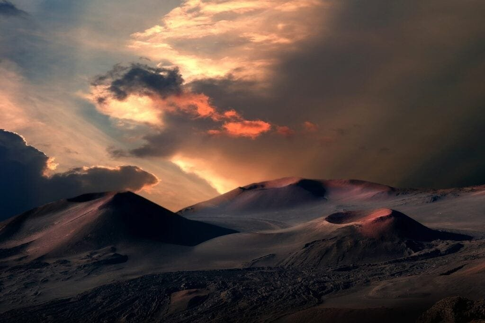

Did you know that volcanoes, those powerful forces of nature, are formed when molten rock, gases, and debris burst through the earth's surface, resulting in eruptions of lava and ash? Fascinating, isn't it? These incredible formations are mainly found along plate boundaries, hotspots beneath the earth's crust, and rift zones where the tectonic plates are moving apart. For instance, the infamous "Ring of Fire" that encircles the Pacific Ocean is home to numerous volcanoes due to the convergence of tectonic plates. However, not all volcanoes are the same. Some, like the shield volcanoes in Hawaii, form gradually over hot spots deep underground and erupt with less violence. Understanding these majestic structures, including their eruption patterns and impact on the Earth's crust, can help us predict future activity and protect the communities residing near these natural wonders. So, let's dive deeper into the captivating world of volcanoes and uncover the top seven insights into their interaction with the Earth's crust.

This image is property of pixabay.com.

## Volcano Formation

### How volcanoes form

Volcanoes are formed when molten rock, gases, and debris escape to the Earth's surface, causing eruptions of lava and ash. This molten rock, known as magma, is formed deep within the Earth's mantle. As pressure builds up and the magma becomes more buoyant, it rises towards the surface through cracks and vents in the Earth's crust. Once it reaches the surface, it is then called lava. Volcanoes can form in various ways, and their formation is closely related to the movement of tectonic plates and the presence of hotspots.

### The role of tectonic plates in volcano formation

Tectonic plates are large, rigid pieces of the Earth's lithosphere that float on the semi-fluid asthenosphere below. These plates are constantly moving and interacting with each other. When two plates converge or collide, one plate is forced beneath the other in a process called subduction. Subduction zones are common locations for volcanic activity. As the subducting plate sinks into the mantle, it heats up and releases water, which triggers the melting of the overlying mantle, producing magma. This magma then rises to the surface, leading to the [formation of volcanic](https://magmamatters.com/understanding-volcanic-formation-a-comprehensive-guide/ "Understanding Volcanic Formation: A Comprehensive Guide") arcs, such as the Cascades in North America and the Andes in South America.

### The significance of hotspots in volcano formation

Hotspots are areas of intense volcanic activity that are not directly associated with tectonic plate boundaries. Instead, they are thought to be caused by plumes of hot material that rise from deep within the Earth's mantle. These plumes are believed to originate at the boundary between the Earth's core and mantle, over 2900 kilometers below the surface. As the plate moves over the hotspot, a chain of volcanoes is formed. A well-known example of a hotspot is the Hawaiian Islands, which are located in the middle of the Pacific Plate. The hotspot underneath the plate has produced a series of shield volcanoes, such as Mauna Loa and Kilauea.

### The process of rift zone volcanism

Rift zones are areas where the Earth's tectonic plates are moving apart, creating a gap or rift. In these zones, volcanic activity can occur as magma rises to fill the gap that is being formed. As the magma reaches the surface, it erupts and solidifies, eventually creating new crust. The most famous example of rift zone volcanism is the East African Rift System, where the African Plate is slowly splitting apart. This rift system has produced a series of volcanoes, including Mount Kilimanjaro and Mount Nyiragongo.

## Types of Volcanoes

### Differentiating shield, composite, cinder cone, and lava dome volcanoes

There are several different types of volcanoes, each with its own distinct characteristics. Shield volcanoes are broad, gently sloping mountains that are formed by the eruption of low-viscosity lava. These eruptions are typically non-explosive, and lava flows for long distances before solidifying. Composite volcanoes, also known as stratovolcanoes, are tall, steep-sided mountains that are built up from alternating layers of lava and pyroclastic material. These eruptions are more explosive and can produce ash clouds, pyroclastic flows, and lahars. [Cinder cone](https://magmamatters.com/the-birth-of-new-land-understanding-cinder-cones/) volcanoes are small, steep-sided volcanoes that are formed from the accumulation of ejected lava fragments. Lava dome volcanoes are formed by the slow extrusion of highly viscous lava, which piles up around the vent and solidifies.

### The geology of shield volcanoes

Shield volcanoes are characterized by their low, broad profiles, which resemble a warrior's shield lying on the ground. They are formed by the repeated eruption of fluid, basaltic lava, which flows easily and travels far from the vent. The lava flows from shield volcanoes tend to be relatively thin and spread out in all directions, creating a gentle slope. Examples of shield volcanoes include Mauna Loa and Mauna Kea in Hawaii, and Mount Etna in Italy.

### The geology of composite volcanoes

Composite volcanoes, or stratovolcanoes, are built up from layers of both lava and pyroclastic material. These layers alternate between lava flows, ash deposits, and pyroclastic flows. The lava flows from composite volcanoes are usually thicker and less fluid than those from shield volcanoes, causing them to pile up and create steep slopes. The eruptions of composite volcanoes can be explosive and produce ash clouds, pyroclastic flows, and lahars. Examples of composite volcanoes include Mount St. Helens in the United States, Mount Fuji in Japan, and Mount Vesuvius in Italy.

### The geology of cinder cone volcanoes

Cinder cone volcanoes are small, steep-sided volcanoes that are formed by the accumulation of ejected lava fragments. These fragments, known as cinders or scoria, are created when gas-rich magma is ejected into the air and cools rapidly. The cinders then fall back to the ground and pile up around the vent, forming a cone-shaped mountain. Cinder cone volcanoes are relatively short-lived and usually have a single vent. Examples of cinder cone volcanoes include Paricutin in Mexico, Sunset Crater in the United States, and Mount Etna's Monte Nero in Italy.

### The geology of lava dome volcanoes

Lava dome volcanoes are formed by the slow extrusion of highly viscous lava, which piles up around the vent and solidifies. The lava in these volcanoes is so thick and sticky that it does not flow easily, causing it to build up and form a dome-shaped mountain. Lava dome volcanoes are typically associated with explosive eruptions and can be very dangerous. Examples of lava dome volcanoes include Mount Unzen in Japan and Mount Merapi in Indonesia.

<iframe width="560" height="315" src="https://www.youtube.com/embed/LojPK7L6prw" frameborder="0" allow="accelerometer; autoplay; encrypted-media; gyroscope; picture-in-picture" allowfullscreen></iframe>

  

## Volcano Eruption Patterns

### Factors influencing volcano eruption patterns

Volcano eruption patterns can vary greatly depending on a range of factors. One important factor is the composition and viscosity of the magma. Magma that is rich in silica is more viscous, or sticky, and is more likely to cause explosive eruptions. The amount of gas dissolved in the magma also plays a significant role. Gas-rich magma is more likely to cause violent eruptions as the pressure of the dissolved gas is released during an eruption. The shape of the volcano and the presence of a vent can also influence eruption patterns. Volcanoes with a central vent are more likely to have explosive eruptions, while those with a fissure vent may have more effusive, non-explosive eruptions.

### Significance of lava viscosity in eruption patterns

The viscosity, or stickiness, of lava is a critical factor in determining eruption patterns. Lava viscosity depends on the composition of the magma, particularly the amount of silica present. High-silica magma has a higher viscosity and does not flow easily, leading to more explosive eruptions. This is because the dissolved gas in the magma cannot escape easily, causing pressure to build up until it is released explosively. In contrast, low-silica magma has a lower viscosity and flows more freely, leading to less explosive eruptions. Understanding the viscosity of the lava can help scientists predict the potential hazards associated with a volcanic eruption.

### The impact of gas content on eruption patterns

The amount and composition of gases dissolved in magma can have a significant impact on eruption patterns. When magma rises to the surface, the decrease in pressure allows the dissolved gases to expand rapidly, creating bubbles. If the magma is gas-rich, these bubbles can become trapped and cause explosive eruptions. The force of the gas bubbles bursting through the magma can fragment the magma into smaller pieces, creating ash and pyroclastic flows. On the other hand, if the magma is relatively gas-poor, the gases can escape more easily, leading to non-explosive, effusive eruptions characterized by the flow of lava rather than the explosive ejection of material.

### Examples of different eruption patterns

Volcanic eruptions can display a range of patterns, from gentle effusive eruptions to highly explosive events. Examples of different eruption patterns include:

1. Strombolian eruptions: These eruptions are characterized by regular bursts of gas and ash, creating volcanic bombs that are ejected into the air. They are relatively low in intensity compared to other eruption types and are commonly observed at volcanoes such as Stromboli in Italy.
    
2. Vulcanian eruptions: Vulcanian eruptions are more explosive than Strombolian eruptions and involve the ejection of thick ash clouds and pyroclastic flows. Mount Vesuvius is known for its historic Vulcanian eruptions, including the famous eruption in 79 AD that buried the city of Pompeii.
    
3. Plinian eruptions: Plinian eruptions are among the most violent and explosive types of volcanic eruptions. They involve the eruption of huge ash clouds that can reach high into the atmosphere. Mount Pinatubo's eruption in 1991 was a notable Plinian eruption, causing significant global climate effects.
    
4. Hawaiian-style eruptions: These eruptions are characterized by the continuous flow of lava from a central vent or fissure. They are relatively non-explosive and can last for extended periods. Kilauea in Hawaii is known for its ongoing Hawaiian-style eruptions.
    

## Geographic Distribution of Volcanoes

### Locations with high volcanic activity

Volcanic activity is not evenly distributed across the globe. Instead, it is concentrated in specific regions known as volcanic zones or belts. These areas are associated with tectonic plate boundaries and hotspots. Some of the locations with high volcanic activity include:

1. The Pacific Ring of Fire: The Ring of Fire is a major area of volcanic activity that encircles the Pacific Ocean. It is associated with the subduction of oceanic plates beneath continental plates and is known for its many active volcanoes, including Mount St. Helens, Mount Fuji, and Mount Rainier.
    
2. The Mediterranean-Middle East arc: This volcanic belt stretches from Southern Europe through the Mediterranean and the Middle East. It is a result of the collision between the Eurasian and African plates and is known for its famous volcanoes, such as Mount Vesuvius, Mount Etna, and Santorini.
    
3. The Andean Volcanic Belt: This volcanic belt runs along the western coast of South America and is associated with the subduction of the Nazca Plate beneath the South American Plate. It is home to many active volcanoes, including Cotopaxi in Ecuador, Villarrica in Chile, and Mount Puyehue in Argentina.
    

### Major volcanic belts and regions

In addition to the specific locations mentioned above, there are several major volcanic belts and regions around the world. These belts and regions are associated with plate tectonics and are characterized by high volcanic activity. Some of the major volcanic belts and regions include:

1. Central America: This region is part of the Central American Volcanic Arc, which extends from Guatemala to Panama. It is formed by the subduction of the Cocos Plate beneath the Caribbean Plate and is known for its numerous active volcanoes, including Arenal in Costa Rica and Pacaya in Guatemala.
    
2. Kamchatka Peninsula: Located in the Far East of Russia, the Kamchatka Peninsula is home to one of the most active volcanic regions in the world. It is part of the Pacific Ring of Fire and is characterized by a chain of stratovolcanoes, including Klyuchevskaya, Bezymianny, and Shiveluch.
    
3. Indonesia: Indonesia is a country that sits on the Pacific Ring of Fire and is home to a large number of active volcanoes. The most famous volcano in Indonesia is Mount Merapi, which is known for its highly explosive eruptions.
    

### Exploring the 'Ring of Fire'

The Pacific Ring of Fire is a region of high volcanic and seismic activity that encircles the Pacific Ocean. It is characterized by a nearly continuous chain of volcanic arcs and oceanic trenches, along with frequent earthquakes. The Ring of Fire is associated with the subduction of oceanic plates beneath continental plates and is home to over 75% of the world's active volcanoes. This region is located along the boundaries of several major tectonic plates, including the Pacific Plate, the Juan de Fuca Plate, and the Nazca Plate. The Ring of Fire is known for its explosive and powerful eruptions, making it a site of ongoing research and monitoring by volcanologists.

### Volcanoes in hotspot areas like Hawaii

Hotspots are areas of intense volcanic activity that are not directly associated with tectonic plate boundaries. Instead, they are thought to be caused by plumes of hot material that rise from deep within the Earth's mantle. Hotspots can produce a chain of volcanoes as the tectonic plate moves over them. One well-known hotspot area is Hawaii. The Hawaiian Islands are located in the middle of the Pacific Plate, and the hotspot beneath the plate has produced a series of shield volcanoes, such as Mauna Loa and Kilauea. These volcanoes have unique characteristics, such as extensive lava flows and eruptions that can last for years.

This image is property of pixabay.com.

## Volcano Hazards

### Types of volcanic hazards

Volcanic eruptions can pose various hazards to human populations and the surrounding environment. Some of the most common volcanic hazards include:

1. Pyroclastic flows: Pyroclastic flows are dense, fast-moving clouds of hot ash, gas, and other volcanic material that can travel downhill at high speeds. They are produced during explosive eruptions and can cause significant destruction and loss of life.
    
2. Volcanic ash: Volcanic ash consists of tiny rock particles that are erupted into the atmosphere during explosive eruptions. Ash can blanket large areas, causing respiratory problems, damaging crops, disrupting air travel, and impacting the environment.
    
3. Lahars: Lahars are fast-moving mudflows or debris flows that can occur during or after volcanic eruptions. They are triggered by the melting of volcanic snow and ice or the mixing of volcanic materials with water. Lahars can travel long distances and can bury or sweep away anything in their path.
    
4. Volcanic gases: Volcanoes release various gases during eruptions, including sulfur dioxide, carbon dioxide, and hydrogen sulfide. These gases can be toxic to humans and animals and can contribute to the formation of acid rain.
    
5. Volcanic landslides: Volcanic landslides, also known as debris avalanches, can occur when the side of a volcano collapses, either during an eruption or as a result of erosion. These landslides can be extremely large and can cause tsunamis if they enter bodies of water.
    

### Exploring pyroclastic flow

Pyroclastic flows are one of the most dangerous volcanic hazards. They consist of a mixture of hot volcanic gas, ash, and rock fragments that flow rapidly down the slopes of a volcano. Pyroclastic flows can reach speeds of up to 700 kilometers per hour and can [travel tens of kilometers from the volcano's](https://magmamatters.com/the-environmental-impact-of-volcanic-eruptions-2/ "The Environmental Impact of Volcanic Eruptions") vent. They are associated with explosive eruptions and are often preceded by explosive volcanic plumes. Pyroclastic flows can destroy everything in their path, including buildings, trees, and even large rocks. They can bury entire towns and cause widespread devastation.

### The danger of volcanic ash

Volcanic ash is a hazard that can be produced during explosive eruptions. It consists of tiny rock particles that are less than 2 millimeters in diameter. Volcanic ash can be carried by the wind and can spread over large areas, blanketing everything in its path. The ash can cause respiratory problems and eye irritation in humans and animals. It can also damage crops and contaminate water supplies. In addition, volcanic ash can pose a significant risk to air travel. The tiny particles can be highly abrasive and can damage aircraft engines, leading to engine failure. Therefore, volcanic ash is closely monitored by aviation authorities to ensure the safety of air travel during volcanic eruptions.

### The impact of volcanic gases

Volcanic eruptions release various gases into the atmosphere. Some of the most common [volcanic gases include sulfur dioxide](https://magmamatters.com/the-art-and-science-of-volcano-monitoring/ "The Art and Science of Volcano Monitoring"), carbon dioxide, and hydrogen sulfide. These gases can be toxic to humans and animals, especially in high concentrations. Sulfur dioxide can cause respiratory problems and can contribute to the formation of acid rain. Carbon dioxide, when released in large amounts, can displace oxygen and cause asphyxiation. Hydrogen sulfide has a strong odor of rotten eggs and can cause eye irritation, respiratory problems, and even death in high concentrations. Monitoring and understanding volcanic gases is crucial for assessing the potential risks associated with volcanic activity.

### Understanding volcanic landslides

Volcanic landslides, also known as debris avalanches, are a significant volcanic hazard. They can occur when the side of a volcano collapses, either during an eruption or as a result of erosion. These landslides can be triggered by the weakening of the volcano's slopes due to the removal of material during an eruption. They can also be triggered by heavy rainfall or earthquakes. Volcanic landslides can be extremely large and can travel long distances. When they enter bodies of water, such as lakes or oceans, they can cause tsunamis. Understanding the mechanisms and triggers of volcanic landslides is crucial for assessing the potential risks they pose to nearby populations and infrastructure.

## Beneficial Aspects of Volcanoes

### Volcanoes and soil nutrition

Despite the hazards they can pose, volcanoes also have several beneficial aspects. One of the most significant benefits is the role that volcanic eruptions play in soil nutrient replenishment. Volcanic ash and lava contain various minerals and nutrients that are essential for plant growth. As volcanic material weathers and breaks down, these nutrients are released into the soil, making it highly fertile. This is why areas around volcanoes, such as the volcanic islands of Hawaii, are known for their rich and fertile soils. The volcanic ash and lava act as a natural fertilizer, promoting the growth of lush vegetation and supporting agriculture.

### Geothermal energy generated by volcanoes

Volcanoes also provide a source of [geothermal energy](https://magmamatters.com/geothermal-energy-and-its-volcanic-origins/ "Geothermal Energy and Its Volcanic Origins"). Geothermal energy is heat that is generated within the Earth's interior. In areas where there is volcanic activity, this heat can be harnessed and used to generate electricity. Geothermal power plants use steam or hot water from underground reservoirs to drive turbines and produce electricity. This renewable energy source is clean and sustainable and can help reduce the reliance on fossil fuels. Countries like Iceland, which has a high concentration of active volcanoes, are able to produce a significant proportion of their electricity from geothermal energy.

### Creation of new land through volcanic activity

Volcanic activity plays a crucial role in the creation of new land. When lava erupts from a volcano and flows onto the Earth's surface, it cools and solidifies, creating new rock. Over time, these layers of solidified lava can build up and form islands, mountains, and other landforms. This process is particularly evident in hotspot areas like Hawaii, where shield volcanoes have gradually formed over millions of years. Volcanic eruptions and the subsequent formation of new land contribute to the dynamic nature of the Earth's surface and shape the geology of our planet.

### Influence on climate

Volcanic activity can have a significant impact on the Earth's climate. During large, explosive eruptions, huge amounts of volcanic ash and gases are injected into the atmosphere. The ash can reflect sunlight, leading to a temporary cooling effect on the Earth's surface. The gases released during eruptions can also have an impact on the climate. For example, sulfur dioxide can combine with water vapor to form sulfuric acid droplets, which can scatter sunlight and cause additional cooling. However, some volcanic gases, such as carbon dioxide, can contribute to the greenhouse effect and cause warming. The overall impact of volcanic eruptions on climate depends on the scale of the eruption and the amount of ash and gases released.

This image is property of pixabay.com.

## Predicting Volcanic Activity

### Measuring seismic activity

Seismic activity, or earthquakes, is one of the most reliable indicators of volcanic activity. Volcanoes are often accompanied by the movement of magma beneath the Earth's surface, which can cause the surrounding rocks to fracture and generate earthquakes. These earthquakes can be monitored using seismometers, which measure the vibrations caused by the movement of the Earth's crust. By analyzing the location, magnitude, and frequency of these earthquakes, scientists can gain valuable insights into the movement of magma and the potential for an eruption. Seismic activity is an essential tool for predicting volcanic activity and providing early warnings to surrounding communities.

### Monitoring deformation of the volcano

Monitoring the deformation of a volcano is another important method for predicting volcanic activity. As magma rises beneath a volcano, it can cause the surrounding rocks to expand and deform. This deformation can be measured using various techniques, such as GPS (Global Positioning System) and InSAR (Interferometric Synthetic Aperture Radar). These techniques allow scientists to detect even small changes in the shape and elevation of a volcano over time. By analyzing this deformation data, scientists can gain insights into the movement and accumulation of magma within the volcano. Monitoring deformation is an essential tool for understanding the behavior of a volcano and predicting potential eruptions.

### Checking changes in gas composition

Changes in the composition of volcanic gases can provide valuable information about the state of a volcano. Volcanoes emit gases such as sulfur dioxide, carbon dioxide, and hydrogen sulfide, among others. By monitoring the gases emitted by a volcano, scientists can detect any changes in their composition. For example, an increase in the sulfur dioxide-to-carbon dioxide ratio may indicate that fresh magma is rising to the surface. Similarly, changes in the ratio of different gases can provide insights into the depth and volume of magma within the volcano. Gas composition monitoring is an essential tool for predicting volcanic activity and assessing the potential hazards associated with an eruption.

### Analysis of volcano's past activity to predict future eruptions

Studying a volcano's past activity is crucial for predicting future eruptions. By analyzing the deposits from previous eruptions and studying the volcanic rocks, scientists can gain insights into the eruption history of a volcano. They can determine the frequency, magnitude, and type of past eruptions, which can help identify patterns and potential hazards. Additionally, historical records and eyewitness accounts can provide valuable information about past eruptions. By combining these sources of data with modern monitoring techniques, scientists can develop models and forecasts to predict the future behavior of a volcano. Understanding a volcano's past activity is essential for effectively managing the risks associated with volcanic eruptions.

## Volcano Risk Mitigation

### Strategies for effective risk mitigation

Mitigating the risks associated with volcanoes requires a combination of strategies and measures. Some of the key strategies for effective risk mitigation include:

1. Volcano monitoring: Continuous monitoring of volcano activity is crucial for providing early warnings of potential eruptions. This includes monitoring seismic activity, gas emissions, and changes in volcano deformation. Monitoring data can help scientists and authorities make informed decisions and provide timely warnings to at-risk communities.
    
2. Hazard mapping: Mapping the potential hazards associated with a volcano is essential for effective risk management. This includes identifying areas at risk from pyroclastic flows, lahars, volcanic ash, and other hazards. Hazard maps can be used to develop emergency evacuation plans and land-use zoning regulations to reduce exposure to these hazards.
    
3. Public education and awareness: Educating and raising awareness among the public about the risks and hazards associated with volcanoes is crucial. This includes providing information about the signs of volcanic activity, emergency preparedness, and evacuation procedures. Public education campaigns can help communities understand the potential risks and take necessary precautions.
    

### Community preparedness

Community preparedness plays a vital role in mitigating the risks associated with volcanoes. This includes developing community-based early warning systems, establishing emergency communication networks, and conducting regular evacuation drills. Communities at risk from volcanic activity should have comprehensive emergency response plans in place, which include evacuation routes, designated shelters, and procedures for alerting residents. Training programs can be conducted to educate community members about emergency preparedness and response protocols. By actively involving the community in disaster risk reduction efforts, the overall resilience of the community can be enhanced.

### Effective evacuation planning

Evacuation planning is crucial for ensuring the safety of communities at risk from volcanic eruptions. This includes identifying safe evacuation routes, establishing evacuation centers, and developing protocols for the orderly and timely evacuation of residents. It is essential to ensure that evacuation routes are well-maintained and clearly marked, and that evacuation centers are adequately equipped to accommodate affected individuals and families. Timely and accurate information dissemination is also critical during an evacuation, and multiple communication channels should be utilized to reach all residents at risk.

### Contingency planning for emergency situations

Contingency planning is an essential aspect of volcano risk mitigation. This involves developing comprehensive emergency response plans that outline the roles and responsibilities of various stakeholders during an eruption. Contingency plans should address various scenarios and outline the necessary actions to be taken at each stage of the eruption. This includes coordination between government agencies, emergency responders, and other organizations involved in disaster response. Contingency planning should also include provisions for post-eruption recovery and reconstruction, including the allocation of resources for rebuilding and supporting affected communities.

## Impact of Volcanoes on Earth's Crust

### Changes in Earth's crust due to volcanic activity

Volcanic activity has a significant impact on the Earth's crust. Over millions of years, volcanic eruptions can dramatically reshape the landscape and alter the structure of the crust. The injection of magma into the crust can cause uplift and the formation of mountains and volcanic peaks. Conversely, volcanic collapse and landslides can lead to the formation of calderas and craters. The deposition of volcanic ash and lava can create new layers of rock, contributing to the formation of sedimentary layers. Volcanic activity also releases large amounts of heat into the crust, which can have an impact on the surrounding rocks and geological processes.

### How volcano eruptions reshape landscapes

Volcano eruptions can reshape landscapes in various ways. Explosive eruptions can blow off the tops of volcanoes, creating craters and calderas. Lava flows from eruptions can cover vast areas, smothering existing vegetation and altering the topography. The deposition of volcanic ash can create layers of loose, fine-grained sediment that can be easily eroded and transported by wind and water. Over time, these processes can lead to the formation of new landforms, such as volcanic cones, mountains, and valleys. Volcano eruptions are dynamic events that continuously reshape the Earth's surface.

### Volcanoes and formation of new crust

Volcanic activity plays a significant role in the formation of new crust on Earth. At divergent plate boundaries, where tectonic plates are moving apart, magma can rise from the mantle and fill the gap between the plates. As the magma cools and solidifies, it forms new crust. This process, known as seafloor spreading, is responsible for the creation of new oceanic crust. Along subduction zones, where one tectonic plate is forced beneath another, melting of the subducting plate can produce magma, which rises towards the surface and forms volcanic arcs. The eruptions associated with these volcanic arcs contribute to the growth of the Earth's crust.

## Case studies of Notable Volcanic Eruptions

### Examining the 1980 Mount St. Helens eruption

The 1980 eruption of Mount St. Helens is one of the most significant volcanic eruptions in recent history. On May 18, 1980, an earthquake triggered a massive landslide on the north side of the volcano, exposing the underlying magma chamber. This led to a lateral blast that devastated the surrounding area, flattening trees and causing widespread destruction. The eruption also produced a massive ash cloud that traveled hundreds of kilometers from the volcano. The total devastation caused by the eruption resulted in the loss of 57 lives and significant damage to infrastructure. The Mount St. Helens eruption served as a valuable lesson in volcano monitoring and eruption response.

### The 79 AD eruption of Mount Vesuvius

The eruption of Mount Vesuvius in 79 AD is one of the most famous and destructive volcanic eruptions in history. The eruption buried the Roman cities of Pompeii and Herculaneum under a thick layer of ash and pumice, preserving them in remarkable detail. The eruption was highly explosive and produced pyroclastic flows that engulfed the cities. It is estimated that the eruption released 100,000 times more energy than the atomic bomb dropped on Hiroshima in 1945. The eruption of Mount Vesuvius in 79 AD remains a significant event in the study of volcanology and provides valuable insights into the destructive power of volcanic activity.

### The 1815 eruption of Mount Tambora

The 1815 eruption of Mount Tambora in Indonesia is one of the most powerful volcanic eruptions in recorded history. The eruption produced a massive volcanic cloud that reached the stratosphere, resulting in global climate effects. The eruption had a significant impact on the Earth's climate, causing a year without summer in 1816. This led to widespread crop failures and food shortages in many parts of the world. The eruption of Mount Tambora serves as a stark reminder of the global impacts of volcanic activity and emphasizes the importance of understanding and monitoring volcanoes.

### The 2010 eruption of Eyjafjallajökull

The 2010 eruption of Eyjafjallajökull in Iceland had a significant impact on air travel across Europe. The eruption lasted for several weeks and produced a massive ash plume that was carried by the wind across the European continent. The ash cloud posed a significant risk to aviation, as the tiny ash particles can cause engine failure in aircraft. As a result, airspace across Europe was closed, and thousands of flights were canceled, causing widespread disruption to travel and economic activities. The eruption of Eyjafjallajökull highlighted the need for international cooperation and coordinated response in managing the risks associated with volcanic ash and air travel.

In conclusion, volcanoes are fascinating natural phenomena that have shaped the Earth's surface throughout history. They form through various processes, such as the movement of tectonic plates and the presence of hotspots. Different types of volcanoes exhibit unique characteristics and eruption patterns, influenced by factors such as lava viscosity and gas content. Volcanoes are concentrated in specific geographic regions with high volcanic activity, such as the Pacific Ring of Fire and hotspot areas like Hawaii. While they provide benefits such as soil fertility and geothermal energy, volcanoes also pose hazards to surrounding communities, including pyroclastic flows, volcanic ash, and volcanic gases. Effective risk mitigation strategies, community preparedness, and accurate prediction of volcanic activity are essential for minimizing the impact of volcanic eruptions. Understanding the impact of volcanoes on Earth's crust helps us appreciate the dynamic nature of our planet, while case studies of notable volcanic eruptions provide valuable insights into past events and their consequences.

