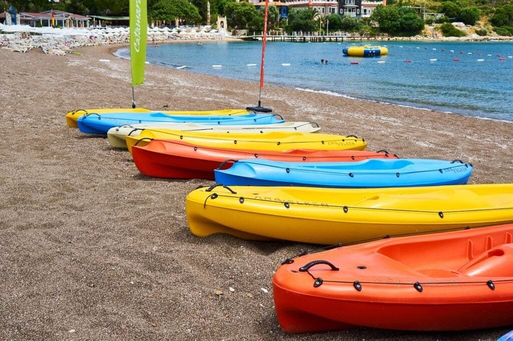

If you've ever been intrigued by the raw power and beauty of volcanoes, you'll be thrilled to discover how volcano tourism can offer not only a breathtaking experience but also incredible educational gains. Volcanoes, with their impressive eruptions and geological significance, provide a unique opportunity for travelers to delve into the fascinating world of earth sciences. From understanding different volcano types to predicting eruption patterns and mitigating risks, exploring these natural wonders can be both awe-inspiring and informative. So get ready to embark on an adventure that maximizes your educational growth while marveling at the remarkable phenomenon of volcanoes.

<iframe width="560" height="315" src="https://www.youtube.com/embed/pxawNxn3ASY" frameborder="0" allow="accelerometer; autoplay; encrypted-media; gyroscope; picture-in-picture" allowfullscreen></iframe>

  

## Understanding Volcanoes: The Basics

Volcanoes are fascinating geological features that have intrigued scientists and adventurers alike for centuries. To fully appreciate and understand these awe-inspiring natural wonders, it is essential to delve into the basics of volcanoes. This section will explore the different types of volcanoes and their geographic distribution, as well as the reasons behind volcanic eruptions.

### Types of volcanoes

Volcanoes come in various shapes and sizes, each with its own characteristics and eruption patterns. The three primary [types of volcanoes are shield](https://magmamatters.com/understanding-volcanic-formation-a-comprehensive-guide/ "Understanding Volcanic Formation: A Comprehensive Guide") volcanoes, composite volcanoes (also known as stratovolcanoes), and cinder cone volcanoes.

Shield volcanoes, such as those found in Hawaii, are broad and gently sloping. They form over hotspots, where a localized column of hot magma rises to the surface. Shield volcanoes usually have relatively non-explosive eruptions, characterized by the outpouring of fluid lava.

Composite volcanoes, on the other hand, are more cone-shaped and structurally complex. These volcanoes, like Mount St. Helens in Washington State, are formed by alternating layers of solidified lava, volcanic ash, and other volcanic materials. Composite volcanoes often have explosive eruptions, as the thick and sticky lava traps gas bubbles, leading to build-up and violent releases.

Lastly, cinder cone volcanoes are small, steep-sided volcanoes that form from the accumulation of pyroclastic material, such as volcanic ash and tephra. These volcanoes are typically the result of a single eruption event and are characterized by their cone-shaped appearance, often resembling a pile of loose rocks.

### Geographic distribution of volcanoes

Volcanoes are not evenly distributed around the world but are instead concentrated in specific regions. The majority of active volcanoes are found along tectonic plate boundaries, where the movement and collision of these massive plates create ideal conditions for volcanic activity.

One of the most well-known volcanic regions is the "Ring of Fire" encircling the Pacific Ocean. This area is notorious for its high concentration of active volcanoes and frequent volcanic activity. The Pacific Ring of Fire stretches roughly from the western coasts of North and South America to the eastern coasts of Asia and Oceania.

Volcanic hotspots, like those in Hawaii and Yellowstone National Park, are another prominent location for volcanoes. These hotspots are believed to be areas of exceptionally hot mantle rock rising to the surface, creating a localized concentration of volcanic activity.

In addition to plate boundaries and hotspots, volcanoes can also form along rift zones, where tectonic plates are moving apart, creating a space for magma to rise and form new volcanic structures.

### Reasons behind volcanic eruptions

Volcanic eruptions are the result of the release of molten rock, gases, and debris from the Earth's interior to its surface. Several factors contribute to the occurrence of volcanic eruptions, including the viscosity of the magma, the gas content, and the pressure within the magma chamber.

Viscosity refers to the resistance of a substance to flow. Magma with low viscosity, such as basaltic magma, flows more easily and tends to have less explosive eruptions. In contrast, magma with high viscosity, such as andesitic or rhyolitic magma, is more sticky and traps gas bubbles. This can lead to explosive eruptions, as the pressure builds up and is released forcefully.

The gas content of magma also plays a crucial role in determining the eruptive style. Volcanic gases, primarily composed of water vapor and carbon dioxide, contribute to the explosive potential of eruptions. The higher the gas content, the more explosive the eruption is likely to be.

Furthermore, the pressure within the magma chamber can build up over time due to the accumulation of magma. When the pressure surpasses the strength of the overlying rock, a volcanic eruption occurs as the magma forcefully makes its way to the surface.

By understanding these factors and monitoring volcanic activity, scientists can better predict eruptions and implement measures to minimize the impact on surrounding communities. Volcanoes, despite their destructive potential, provide invaluable insight into Earth's geological processes and the forces that shape our planet.

## Role of Volcanoes in Nature

Volcanoes have both hazards and benefits associated with their eruptions. While volcanic activity can pose significant risks to nearby communities, it also contributes to the creation of new landforms and provides essential elements for life. This section will explore the hazards associated with volcanic eruptions as well as the benefits that arise from volcanic activity.

### Hazards associated with volcanic eruptions

Volcanic eruptions pose various risks to both human settlements and the environment. One of the most immediate and dangerous hazards is pyroclastic flows, which are fast-moving currents of hot gas, ash, and volcanic debris. These flows can reach speeds of up to 700 kilometers per hour and can incinerate anything in their path.

Ashfall is another significant hazard associated with volcanic eruptions. Volcanic ash, composed of fine fragments of volcanic glass and minerals, can be carried hundreds of kilometers by winds, creating a thick layer of ash on the ground. Ashfall can cause respiratory problems, damage infrastructure, and disrupt transportation systems.

Lahars, or volcanic mudflows, are another significant threat. Lahars occur when volcanic ash and debris mix with water, either from heavy rainfall or the rapid melting of snow and ice. These destructive mudflows can travel at high speeds, burying everything in their path and causing catastrophic damage to surrounding areas.

Volcanic gases, such as [sulfur dioxide and carbon](https://magmamatters.com/the-art-and-science-of-volcano-monitoring/ "The Art and Science of Volcano Monitoring") dioxide, are released during eruptions and can pose health risks to humans and animals. These gases can cause respiratory problems, as well as contribute to the formation of acid rain, which can harm vegetation and aquatic ecosystems.

Additionally, volcanic eruptions can have long-term effects on climate patterns. Volcanic aerosols, made up of tiny particles and gases ejected into the atmosphere during eruptions, can reflect and absorb sunlight, leading to cooler temperatures globally. This phenomenon has been observed in historical events, such as the eruption of Mount Tambora in 1815, which caused a significant drop in global temperatures.

### Benefits of volcanic activity

While the hazards of volcanic eruptions are undeniable, volcanic activity also plays a crucial role in shaping the Earth's surface and providing essential resources. Volcanic eruptions contribute to the creation of new landforms, such as islands and mountain ranges. In regions like Hawaii, where shield volcanoes have built up over millions of years, volcanic activity has shaped the entire landscape.

Volcanic soils, known as volcanic ash soils or Andisols, are highly fertile and rich in essential nutrients. These soils provide ideal conditions for agriculture, supporting the growth of crops and vegetation. The high mineral content and porous nature of volcanic soils allow for excellent water retention and drainage, enhancing agricultural productivity.

Furthermore, geothermal energy, which harnesses heat from within the Earth, can be tapped in volcanic regions. Geothermal power plants use this sustainable energy source to generate electricity and heat to power homes, businesses, and industries. Iceland is a prime example of a country that heavily relies on geothermal energy for its power supply.

Volcanic activity also plays a crucial role in the global carbon cycle. Volcanic eruptions release large amounts of carbon dioxide into the atmosphere, contributing to the greenhouse effect. However, volcanoes also absorb carbon dioxide through the weathering of volcanic rocks, creating a natural mechanism for carbon sequestration.

Understanding the hazards and benefits associated with volcanic eruptions is essential for mitigating risks and utilizing the advantages provided by these natural phenomena. By studying volcanoes and their impacts, scientists and communities can better prepare for and adapt to the ever-changing volcanic landscape.

This image is property of pixabay.com.

## Education Through Volcano Tourism

The immersive experience of visiting volcanic sites has immense educational value, making volcano tourism an excellent teaching tool. By incorporating volcano tourism into school curriculums, educators can provide students with hands-on learning experiences that foster a deeper understanding of earth sciences and environmental awareness. This section will discuss the use of volcano tourism as a teaching tool and the benefits of incorporating it into school curriculums.

### Use of volcano tourism as a teaching tool

Volcano tourism offers a unique opportunity for students to witness the raw power and beauty of volcanic landscapes firsthand. Visiting volcanic sites allows students to engage with geological formations, observe volcanic activity, and learn directly from experts in the field. This immersive experience goes beyond what can be taught in a traditional classroom setting, allowing students to develop a deeper connection with the subject matter.

By exploring volcanic sites, students can witness the various types of volcanoes, such as shield volcanoes, composite volcanoes, and cinder cone volcanoes. They can see the different layers of volcanic rock, study the textures and colors of lava flows, and understand the geological processes that shape these extraordinary features.

Furthermore, volcano tourism provides an opportunity for students to learn about the hazards associated with volcanic eruptions. They can see firsthand the devastating effects of pyroclastic flows, the damage caused by volcanic ashfall, and the remnants of past volcanic events. This direct observation allows for a more comprehensive understanding of the risks posed by volcanic activity and the importance of disaster preparedness.

### Incorporating volcano tourism in school curriculums

Integrating volcano tourism into school curriculums can enhance students' educational experiences and foster a lifelong appreciation for the natural world. By making volcanoes a central theme in science and geography classes, educators can provide students with a multidisciplinary approach to learning.

In science classes, students can explore the geological processes that lead to volcanic eruptions, the different types of magma and their properties, and the impact of volcanic activity on climate change. They can conduct experiments and engage in hands-on activities that simulate volcanic processes, further reinforcing their understanding.

In geography classes, students can study the geographic distribution of volcanoes, analyze the social, economic, and environmental impacts of volcanic eruptions on local communities, and examine strategies for mitigating risks associated with volcanic hazards. They can also explore the cultural significance of volcanoes in different societies and how they shape landscapes and traditions.

Field trips to volcanic sites can be organized as part of the curriculum, where students can engage in guided tours, participate in interactive workshops, and have the opportunity to interact with scientists and researchers. These experiences allow students to connect theoretical knowledge with real-world applications, fostering critical thinking and problem-solving skills.

By integrating volcano tourism into school curriculums, educators can inspire students to pursue further studies in earth sciences and promote a deeper understanding of the interconnectedness between humans and the environment.

## Site Selection for Volcano Tourism

When organizing volcano-based field trips, careful site selection is crucial to ensure both safety and accessibility. It is essential to identify volcano sites that provide informative and engaging learning experiences while minimizing potential risks to students and educators. This section will discuss the process of identifying safe and accessible volcano sites and understanding local tourism guidelines.

### Identifying safe and accessible volcano sites

When selecting volcano sites for educational field trips, safety should be a top priority. It is important to choose sites that do not pose immediate risks from ongoing volcanic activity. Volcanoes that have been dormant for an extended period or are closely monitored by local authorities are generally considered safer options.

Accessibility is another crucial factor to consider when choosing volcano sites. The site should be easily reachable by students and educators, either by road or air transportation. It is also beneficial to select sites that have well-maintained infrastructure, such as visitor centers, walking paths, and lookout points, to ensure a smooth and enjoyable experience.

Moreover, selecting volcano sites with diverse geological features can enhance the educational value of field trips. Sites that offer a range of volcanic structures, such as shield volcanoes, stratovolcanoes, and cinder cone volcanoes, allow students to observe and compare different types of volcanoes firsthand.

Local geological surveys, national park authorities, and experienced tour operators can provide valuable information and guidance in identifying safe and accessible volcano sites for educational purposes. It is essential to consult with these experts to ensure that the chosen sites align with educational objectives and prioritize student safety.

### Understanding local tourism guidelines

While volcano tourism provides unique educational opportunities, it is essential to respect and abide by local tourism guidelines. Different volcanic sites may have specific rules and regulations in place to protect both visitors and the natural environment. Familiarizing oneself with these guidelines is crucial to ensure a responsible and sustainable educational experience.

Local tourism guidelines may include restrictions on certain areas of a volcano site, guidelines for interacting with volcanic features, and rules regarding waste disposal and environmental preservation. It is important to communicate these guidelines to students and educators before embarking on a field trip to ensure everyone's safety and to foster responsible tourism practices.

Leveraging the knowledge and expertise of local tour operators who specialize in volcano tourism can facilitate adherence to local guidelines. These operators can provide valuable insights into the specific regulations for each site, enabling a well-coordinated and compliant field trip.

By carefully selecting safe and accessible volcano sites and understanding and adhering to local tourism guidelines, educators can provide students with enriching and educational experiences while prioritizing their safety and the protection of the natural environment.

This image is property of pixabay.com.

## Organizing Volcano-based Field Trips

Organizing field trips to volcanic sites requires thoughtful planning and preparation to maximize the learning opportunities for students. By allocating appropriate resources and structuring the itinerary strategically, educators can create a comprehensive and engaging experience. This section will discuss the planning resources for a field trip and structuring the itinerary to maximize learning.

### Planning resources for a field trip

Before embarking on a volcano-based field trip, it is essential to allocate the necessary resources to ensure a successful and enriching experience for students. These resources may include arranging transportation, obtaining necessary permits and permissions, securing accommodation, and providing appropriate safety gear.

Transportation should be organized to ensure students and educators can reach the chosen volcano site efficiently and comfortably. Depending on the location and distance, options may include chartered buses, vans, or domestic flights. It is important to consider the group size and any specific accessibility requirements when selecting the transportation mode.

Obtaining the necessary permits and permissions is crucial to ensure legal compliance and access to designated areas within the volcano site. National park authorities or relevant government agencies should be contacted well in advance to obtain the required permits and to understand any additional conditions or restrictions.

Accommodation arrangements should be made, especially for field trips that span multiple days. Depending on the location, options may range from nearby hotels to campgrounds within the vicinity of the volcano site. It is important to choose accommodation that provides suitable amenities and ensures the safety and comfort of students and educators.

Providing appropriate safety gear is essential to ensure the well-being of all participants. Depending on the terrain and volcanic activity, safety gear may include sturdy footwear, protective eyewear, hard hats, gloves, and face masks. It is crucial to assess potential risks and consult with local authorities or tour operators to determine the necessary safety equipment.

### Structuring the itinerary to maximize learning

The itinerary for a volcano-based field trip should be carefully structured to optimize learning opportunities and engage students in meaningful activities. By incorporating a variety of educational experiences and ensuring a balance between instruction and exploration, educators can create a comprehensive and memorable learning journey.

Introducing students to the basics of volcanoes through interactive presentations and discussions before the field trip can provide essential background knowledge. This preparation allows students to develop a foundation of understanding, enabling them to make meaningful observations and connections during the field trip.

On-site guided tours, led by knowledgeable experts in geology and volcanology, provide valuable insights and explanations of the geological formations and processes. These tours can be tailored to the educational objectives, focusing on specific aspects of volcanoes, such as lava flows, crater formations, or volcanic gas emissions.

Hands-on activities, such as collecting rock samples, conducting experiments, or participating in geological mapping exercises, allow students to actively engage with the volcanic environment. These activities encourage critical thinking, problem-solving, and teamwork, fostering a deeper understanding of the concepts learned in the classroom.

Time for independent exploration and reflection should also be incorporated into the itinerary. Allowing students to explore the volcano site at their own pace, observe natural phenomena, and make personal connections with the environment enhances their learning experience and encourages independent thinking.

Field journals or documentation projects can be assigned to students, inviting them to record their observations, reflections, and findings during the field trip. These journals or projects serve as valuable artifacts that students can refer to in the future, reinforcing their learning and facilitating further analysis and discussion.

By carefully planning the necessary resources and structuring the itinerary to maximize learning, educators can create a field trip that provides a comprehensive and transformative educational experience for students.

## Learning Experiences at Volcanic Sites

Visiting volcanic sites as part of [volcano tourism offers students unique opportunities to gain geological](https://magmamatters.com/geothermal-energy-and-its-volcanic-origins/ "Geothermal Energy and Its Volcanic Origins") knowledge and cultivate environmental awareness. By actively engaging with the volcanic environment, students can deepen their understanding of earth science concepts and develop a sense of responsibility towards nature. This section will explore the learning experiences students can gain at volcanic sites and the environmental awareness nurtured through volcano tourism.

### Geological knowledge gained at volcanic sites

Visiting volcanic sites allows students to witness geological processes in action, helping them develop a comprehensive understanding of concepts taught in the classroom. By observing volcanic features, such as lava flows, volcanic craters, and geothermal vents, students can see firsthand the dynamic nature of our planet.

Interacting with volcanic rocks provides an opportunity for students to apply their knowledge of rock types, mineral composition, and formation processes. By collecting and examining rock samples, students can learn to identify different types of volcanic rocks, such as basalt, andesite, and rhyolite, and understand how these rocks are linked to specific volcanic activities.

Geological mapping exercises at volcanic sites allow students to interpret the landscape and visualize the geological processes at work. By observing the features and patterns of the volcanic environment, students can develop skills in mapping volcanic structures and analyzing the relationships between different rock formations.

Additionally, visiting volcanic sites provides students with a platform to engage with experts in the field, such as volcanologists and geologists. These interactions allow students to deepen their knowledge through discussions, Q&A sessions, and firsthand accounts of scientific research and discoveries.

### Environmental awareness nurtured through volcano tourism

[Volcano tourism goes beyond the scientific understanding of geology](https://magmamatters.com/the-environmental-impact-of-volcanic-eruptions-2/ "The Environmental Impact of Volcanic Eruptions") and offers students an opportunity to develop a deeper appreciation for the natural environment and their role as responsible stewards of the Earth.

By standing at the edge of a volcanic crater or gazing at a lava flow, students are confronted with the power of nature and its ability to shape landscapes. This firsthand experience fosters a sense of humility and awe, nurturing a connection with the natural world.

Observing the impact of past volcanic eruptions on the surrounding environment, such as altered vegetation patterns or the formation of new landforms, highlights the interconnectedness between geological processes, ecosystems, and human communities. Students begin to understand the fragile balance between humans and nature and the importance of sustainable practices.

Volcano tourism can also expose students to the cultural significance of volcanoes in different societies. Many cultures have unique beliefs, traditions, and stories associated with volcanoes, reflecting the vital role these geological features play in shaping landscapes and influencing human communities. Exploring these cultural aspects fosters cross-cultural understanding and an appreciation for the diversity of human perspectives.

Furthermore, witnessing the long-term effects of volcanic activity, such as land recovery and the regrowth of vegetation, instills hope and resilience. Students observe how nature has the ability to regenerate and adapt, teaching them valuable lessons about the capacity for renewal and the importance of addressing environmental challenges.

By engaging with the volcanic environment and experiencing its profound beauty and power, students develop an environmental consciousness that extends beyond the boundaries of the field trip. Volcano tourism nurtures a sense of responsibility towards nature and the environment, empowering students to become agents of positive change.

This image is property of pixabay.com.

## Risk Management in Volcano Tourism

Ensuring safety during volcano tourism is of paramount importance, particularly when organizing field trips for students. By implementing rigorous risk management measures, educators can provide a secure and enjoyable learning experience. This section will discuss the safety considerations while visiting volcanic sites and the importance of educating students on disaster preparedness.

### Safety considerations while visiting volcanic sites

Visiting volcanic sites involves inherent risks, and it is crucial to prioritize the safety of students and educators. Implementing safety considerations and following best practices contribute to a well-managed and secure field trip.

First and foremost, it is essential to stay updated on the status of the volcano site before the visit. Volcanic activity can change rapidly, and regularly monitoring volcanic monitoring networks and local news sources provides critical information on any signs of increased activity or potential hazards.

Maintaining a safe distance from hazardous areas, such as the crater edge or steep slopes, is crucial. Students should be instructed to remain within designated safe zones and never venture into restricted areas without proper authorization and guidance from knowledgeable professionals.

Educating students on the potential risks associated with volcanic eruptions, such as pyroclastic flows, ashfall, and volcanic gases, is vital. Students should be taught how to recognize the signs of impending danger and the appropriate actions to take in response to an emergency, such as following evacuation routes and seeking shelter.

Providing students with suitable safety gear, such as hard hats, gloves, and face masks, is essential to minimize potential injuries and exposure to harmful substances. Educators should ensure that the safety gear is properly fitted and used correctly by all participants.

Additionally, it is essential to have trained personnel or experts accompany the group during the field trip. These individuals should have experience in volcanic environments, be familiar with emergency protocols, and possess the necessary skills to ensure the safety and well-being of all participants.

Regular communication with local authorities, park rangers, and tour operators helps to stay informed about any updates or changes in volcanic conditions. These local partners can provide guidance on best practices, emergency protocols, and potential evacuation routes.

### Educating students on disaster preparedness

In addition to prioritizing immediate safety, educating students on disaster preparedness fosters resilience and a proactive attitude towards potential hazards. Students should be taught essential skills and knowledge to respond effectively in the face of a volcanic eruption or related natural disasters.

Understanding the signs of impending volcanic activity, such as increased seismic activity or ground deformation, enables students to recognize warning signals and take appropriate action. Educators can provide instruction on interpreting monitoring data and teach students how to access real-time information from reliable sources.

Emergency response drills and simulations can equip students with practical skills, such as evacuation routes, first aid techniques, and communication protocols. Conducting practice scenarios allows students to apply their knowledge and develop confidence in their ability to react swiftly and effectively during a crisis.

Fundamental knowledge of basic survival skills, such as building temporary shelters, purifying water, and identifying edible plants in the wild, enhances students' preparedness for potential disruptions caused by volcanic activities. These skills empower students to adapt and respond to changing circumstances in a responsible and self-reliant manner.

Integration of disaster preparedness education into the school curriculum ensures that students receive comprehensive instruction on potential hazards, risk management strategies, and community resilience. This proactive approach equips students with the necessary tools to navigate and contribute to safer and more resilient communities.

By prioritizing safety considerations and educating students on disaster preparedness, educators can provide students with an enjoyable and immersive learning experience while ensuring their well-being.

## Potential Classroom Activities Post Volcano Visit

After visiting volcanic sites, educators can engage students in various classroom activities that leverage their experience and deepen their understanding of volcanoes and related concepts. By developing projects and facilitating interactive discussions, educators can encourage critical thinking, creativity, and knowledge retention. This section will explore potential classroom activities based on volcano tourism and creating interactive classroom discussions about volcanoes.

### Developing projects based on volcano tourism

Projects that build upon the field trip experience allow students to apply their knowledge and demonstrate their understanding in creative and innovative ways. These projects can be tailored to various subject areas and learning objectives, inspiring students to explore volcanoes from different perspectives and disciplines.

In science classes, students can collaborate on research projects that delve deeper into specific aspects of volcanoes, such as the chemical composition of volcanic gases, the effects of volcanic activity on climate change, or the impact of volcanic ash on local ecosystems. Students can analyze data collected during the field trip and present their findings using visual aids or multimedia presentations.

In geography or social studies classes, students can create interactive maps that highlight the distribution of volcanoes worldwide, identify regions prone to volcanic activity, and examine the social and economic impacts of volcanic eruptions on local communities. These map projects can incorporate multimedia elements, such as videos or photographs, to provide a comprehensive understanding of volcanic landscapes.

Art projects that focus on capturing the beauty and power of volcanoes allow students to express their creativity and emotional connection with the subject matter. Students can create visual artworks, such as paintings, collages, or sculptures, that represent their interpretation of volcanic landscapes or explore the symbolic significance of volcanoes in different cultures.

### Creating interactive classroom discussions about volcanoes

Facilitating interactive classroom discussions allows students to delve deeper into volcanic concepts, exchange ideas, and develop critical thinking skills. These discussions can be guided by thought-provoking questions and incorporate multimedia resources to stimulate inquiry and debate.

Students can explore the impact of volcanic eruptions on human communities and discuss the social, economic, and environmental implications. By examining case studies of past volcanic disasters, students can evaluate response strategies, analyze the role of government agencies and non-governmental organizations, and propose innovative solutions to mitigate the impact of future volcanic events.

Ethical discussions about volcano tourism can encourage students to critically evaluate the benefits and drawbacks of this industry. Students can explore questions such as the responsibility of tourists and tour operators in preserving and respecting the environment, the impact of tourism on local communities, and the potential conflicts between conservation and economic development.

Moreover, students can engage in debates on controversial topics related to volcanology, such as scientific controversies surrounding volcanic monitoring techniques, the feasibility and implications of geoengineering schemes to control volcanic gases, or the ethical considerations of predicting and managing volcanic hazards. These debates foster critical thinking, research skills, and the ability to construct and defend evidence-based arguments.

Creating a collaborative and inclusive classroom environment allows students to share their observations, insights, and personal experiences from the field trip. Students can reflect on their learning journey, discuss their most memorable moments, and articulate how the experience has influenced their perception of the natural world.

By encouraging students to develop projects based on their volcano tourism experience and facilitating interactive classroom discussions about volcanoes, educators can deepen students' knowledge, critical thinking, and creative abilities beyond the field trip itself.

## Using Technology in Volcano Education

Technology can enhance volcano education by providing immersive and interactive experiences that complement traditional teaching methods. Leveraging virtual reality for simulated volcano experiences and utilizing interactive mobile applications helps engage students, foster curiosity, and facilitate exploration. This section will discuss the use of virtual reality and interactive mobile applications in volcano education.

### Leveraging virtual reality for simulated volcano experiences

Virtual reality (VR) offers students the opportunity to explore volcanic environments and witness volcanic activity through immersive and realistic simulations. By utilizing VR headsets and specialized software, students can experience the sights and sounds of volcanic eruptions from the safety and comfort of the classroom.

Simulated volcano experiences in virtual reality can transport students to volcanic sites worldwide, showcasing a diverse range of volcanic landscapes and eruptive styles. Students can observe the formation of different types of volcanoes, interact with volcanic features, and even simulate geological processes, such as magma chamber dynamics or lava flow simulations.

VR also allows for the visualization of abstract concepts related to volcanoes, such as plate tectonics and volcanic material composition. Students can explore interactive visualizations that illustrate the movement of tectonic plates and their impact on volcanic activity, or examine three-dimensional models of minerals and rocks found in volcanic environments.

Additionally, virtual reality enables students to access remote or inaccessible volcanic sites that would otherwise be logistically challenging or dangerous to visit. It expands the learning potential by providing an extensive catalog of volcanic environments and eruptions from different regions of the world, offering a broader perspective on the subject.

### Using interactive mobile applications for volcano education

Interactive mobile applications provide a portable and engaging platform for students to acquire volcano knowledge and develop related skills. These applications offer a wide range of features, such as 3D models, interactive games, informative videos, and quizzes, to cater to diverse learning styles.

Mobile applications can provide hands-on experiences with volcanic processes through interactive simulations. Students can experiment with different eruption scenarios, adjust variables like magma viscosity and gas content, and observe the resulting volcanic activity. These simulations encourage critical thinking and problem-solving skills while deepening students' understanding of volcanic processes.

Furthermore, mobile applications can serve as field guides during actual volcano visits. They can provide information about geological features, allow users to mark and annotate observations, and offer supplementary multimedia content, such as audio guides or augmented reality overlays. These features enhance the educational value of the field trip by providing real-time context and relevant information.

Quizzes and games within mobile applications create a fun and interactive learning experience. Students can test their knowledge of volcanoes through trivia quizzes, engage in virtual competitions to simulate volcanic monitoring, or solve puzzles that require critical thinking to understand geological concepts. These gamified elements promote active learning and make the educational experience more enjoyable and engaging.

Mobile applications also provide a platform for students to showcase their knowledge and creativity. Students can use these applications to create virtual exhibits, interactive presentations, or multimedia projects that demonstrate their understanding of volcanoes and related topics. These virtual exhibitions can be shared with peers and educators, fostering collaborative learning and promoting further discussion.

By leveraging virtual reality for simulated volcano experiences and utilizing interactive mobile applications, educators can enhance volcano education by providing immersive and engaging opportunities for students to explore and interact with volcanic environments.

## Long-term Educational Benefits of Volcano Tourism

Beyond the immediate learning experiences, volcano tourism offers long-term educational benefits that extend beyond the field trip itself. By sparking students' interest in geosciences, cultivating responsible attitudes towards nature and the environment, and building critical-thinking and problem-solving skills, volcano tourism lays the foundation for lifelong learning. This section will explore the long-term educational benefits of volcano tourism.

### Enhancing students' interest in geosciences

Volcano tourism has the potential to inspire a lifelong passion for geosciences and related fields. By immersing students in the dynamic and captivating world of volcanoes, volcano tourism ignites curiosity and fosters a genuine interest in earth sciences.

The hands-on experiences and direct interactions with volcanic formations and experts in the field provide students with memorable and meaningful learning experiences. They can witness the power and beauty of volcanoes firsthand, further fueling their fascination and desire to explore geosciences in-depth.

The multidisciplinary nature of volcano tourism, bridging concepts from science, geography, history, and culture, exposes students to the diverse facets of earth sciences. This interdisciplinary approach stimulates cross-curricular connections and piques students' curiosity in various subjects, leading to a more holistic understanding of the world.

Moreover, volcano tourism offers opportunities for students to engage in scientific research and contribute to the body of knowledge in geosciences. By participating in data collection, laboratory analysis, or citizen science initiatives, students can actively contribute to ongoing research efforts, fostering a sense of ownership in their learning and a desire to pursue further studies.

### Cultivating responsible attitudes towards nature and the environment

Volcano tourism nurtures responsible attitudes towards nature and the environment by fostering a deep connection with the natural world and an understanding of the importance of conservation. By witnessing the power and fragility of volcanic landscapes, students develop a profound appreciation for the value of natural resources and the need for sustainable practices.

Understanding the environmental impact of human activities on volcanic sites encourages students to become conscientious stewards of the Earth. They recognize the importance of minimizing their ecological footprint, conserving natural resources, and advocating for responsible tourism practices.

Volcano tourism also promotes cultural awareness and respect for the traditions, beliefs, and indigenous knowledge associated with volcanoes. By immersing students in the local culture and fostering cross-cultural understanding, volcano tourism encourages empathy, promotes cultural diversity, and cultivates a sense of global citizenship.

By instilling responsible attitudes towards nature and the environment, volcano tourism equips students with the mindset and skills needed to address pressing environmental challenges and become advocates for sustainable practices.

### Building critical-thinking and problem-solving skills

Volcano tourism fosters critical-thinking and problem-solving skills by immersing students in real-world situations that require active engagement and analytical thinking. By analyzing geological formations, interpreting data, and making connections between different aspects of volcanoes, students develop essential cognitive skills.

Field trips to volcanic sites require students to navigate unfamiliar terrain, adapt to changing circumstances, and make decisions based on observation and analysis. These experiences encourage independent thinking, problem-solving, and effective decision-making, skills that are transferable to various aspects of life.

By actively engaging with volcanic environments and participating in hands-on activities, students develop the ability to observe, analyze, and draw conclusions from data. They learn to evaluate evidence, consider multiple perspectives, and make informed judgments, enhancing their critical-thinking skills and fostering a scientific mindset.

The dynamic nature of volcanoes and their complex interactions with the environment necessitate creative problem-solving. Students are encouraged to think outside the box, propose innovative solutions, and apply their knowledge to address real-world challenges. They develop resilience, adaptability, and the ability to approach problems from different angles.

By building critical-thinking and problem-solving skills, volcano tourism empowers students to become lifelong learners and independent thinkers, equipping them with the tools they need to succeed in a rapidly evolving world.

In conclusion, volcano tourism provides a wealth of educational opportunities for students to explore and understand the fascinating world of volcanoes. By delving into the basics of volcanoes, exploring their role in nature, incorporating volcano tourism into school curriculums, and utilizing technology, educators can maximize the educational gains for students. Through volcano tourism, students can cultivate a deeper appreciation for the natural world, develop critical-thinking and problem-solving skills, and become responsible stewards of the Earth.

