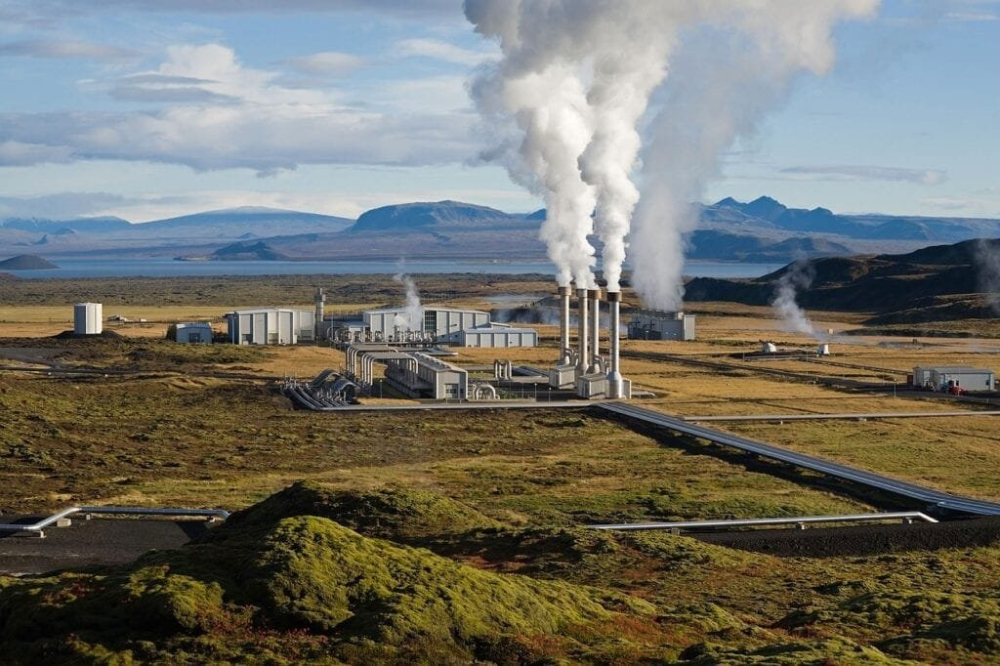
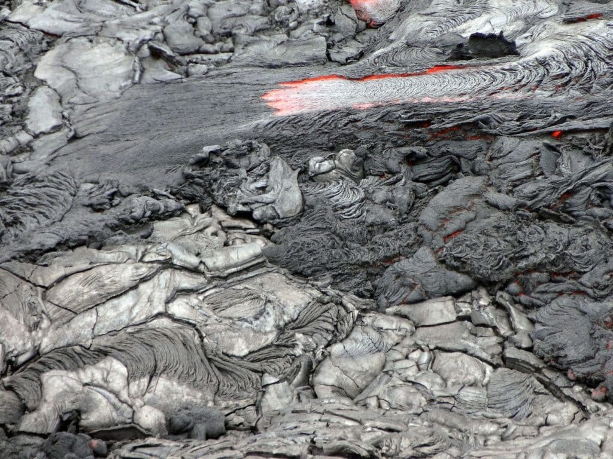
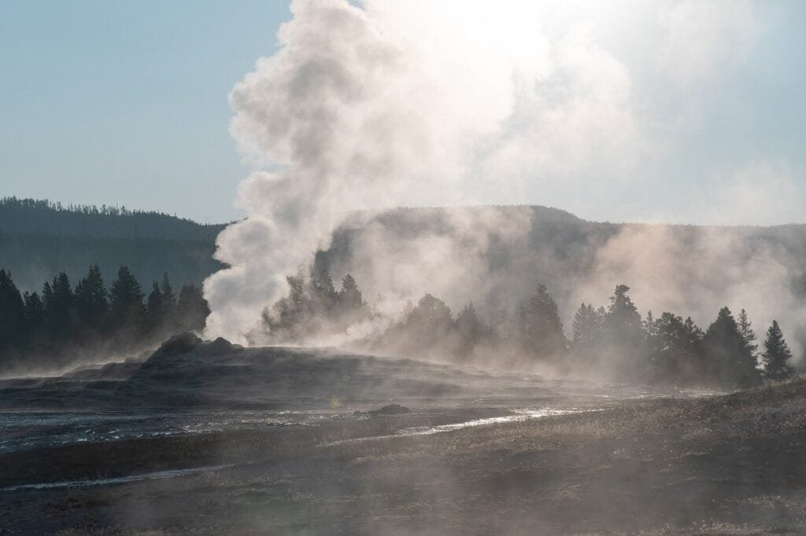

If you're fascinated by the power and potential of volcanoes, you'll be thrilled to explore the methods for harnessing geothermal energy from these incredible natural wonders. Volcanoes, with their eruptions of molten rock and gases, hold a vast amount of untapped energy. Whether it's the explosive volcanoes dotting the "Ring of Fire" or the more gradual eruptions of shield volcanoes in Hawaii, there are five effective methods for extracting geothermal energy from these majestic formations. These methods not only provide a sustainable source of power but also have the potential to revolutionize the way we think about renewable energy. In this article, we will delve into these five methods, each one more fascinating than the last, opening your eyes to the incredible possibilities that lie beneath the surface of the Earth's volcanoes. Get ready to be amazed!

This image is property of pixabay.com.

## Understanding Volcanoes and Geothermal Energy

[Volcanoes are fascinating natural phenomena](https://magmamatters.com/the-art-and-science-of-volcano-monitoring/ "The Art and Science of Volcano Monitoring") that have a profound impact on the environment. They are formed when molten rock, gases, and debris escape to the earth's surface, resulting in eruptions of lava and ash. Volcanoes can be found at sites along plate boundaries, hotspots under the earth's crust, or rift zones where the earth's tectonic plates are moving apart.

There are different types of volcanoes, each with its own unique characteristics. For example, the volcanoes in the "Ring of Fire" encircling the Pacific Ocean are located atop spots where tectonic plates meet, making them prone to eruptions. On the other hand, shield volcanoes, like those found in Hawaii, gradually form over hot spots deep underground and erupt less explosively.

The eruption patterns of volcanoes vary depending on factors such as lava viscosity and gas content. Some eruptions can be highly explosive, while others may involve slow-moving lava flows. Volcanic eruptions provide essential nutrients to the surrounding soil, making them beneficial for agriculture. However, they can also pose significant risks and hazards to nearby communities.

To better [understand volcanoes and predict future volcanic](https://magmamatters.com/understanding-volcanic-formation-a-comprehensive-guide/ "Understanding Volcanic Formation: A Comprehensive Guide") activity, scientists study their formation, types, eruption causes, and associated hazards. This knowledge is crucial for minimizing the impact of volcanic eruptions and ensuring the safety of affected populations.

Geothermal energy, on the other hand, refers to the heat energy that is absorbed and stored beneath the Earth's surface. It can be harnessed and utilized as a sustainable source of power. Geothermal energy is abundant in regions with volcanic activity, as it is closely linked to the heat generated by magma and volcanic processes.

## Geological Considerations for Harnessing Volcanic Geothermal Energy

Harnessing geothermal energy from volcanoes requires a thorough understanding of the geological factors involved. Several key considerations come into play:

### Seismic Activity

Volcanic regions are often characterized by high levels of seismic activity. Earthquakes and volcanic tremors are common occurrences in these areas. When developing geothermal energy projects, it is essential to assess the stability of the site and its susceptibility to seismic events. Careful monitoring and geological surveys can help identify potential risks and ensure the safety of infrastructure and personnel.

### Temperature and Pressure Variables

Temperature and pressure are critical factors in determining the viability of geothermal energy extraction. Volcanic systems produce high temperatures and pressures due to the heat generated by magma. These conditions create ideal circumstances for harnessing geothermal energy. Geologists and engineers must accurately measure and analyze temperature and pressure variables to optimize the efficiency of geothermal power plants.

### Location and Proximity to Tectonic Plate Boundaries

The location and proximity of volcanoes to tectonic plate boundaries are essential considerations for geothermal energy development. Regions with active plate tectonics often have abundant geothermal resources. Close proximity to tectonic plate boundaries allows for accessible heat sources and easier extraction of geothermal energy. Understanding the geological setting and the characteristics of the surrounding area is crucial for successful geothermal energy projects.

<iframe width="560" height="315" src="https://www.youtube.com/embed/j7q653ffQO4" frameborder="0" allow="accelerometer; autoplay; encrypted-media; gyroscope; picture-in-picture" allowfullscreen></iframe>

  

## Technologies for Harnessing Geothermal Energy from Volcanoes

Technological advancements have made it possible to harness geothermal energy from volcanoes efficiently. The following technologies are commonly used for this purpose:

### Geothermal Power Plants

Geothermal power plants are the most traditional and widely used method for harnessing geothermal energy. These plants use steam from underground reservoirs to drive turbines and generate electricity. Volcanic areas typically have abundant underground reservoirs of hot water or steam that can be tapped into for power generation.

### Binary Cycle Power Plants

Binary cycle power plants are an innovative technology that allows for the efficient extraction of geothermal energy from lower temperature reservoirs. In these systems, a secondary fluid with a lower boiling point than water is used to vaporize and drive the turbines. This technology enables the utilization of lower temperature resources, expanding the potential for geothermal energy extraction.

### Hydrothermal Power Systems

Hydrothermal power systems utilize the heat energy from hot water reservoirs to generate electricity. These systems typically involve the extraction of hot water from underground reservoirs through wells. The high-temperature water is then used to produce steam, which drives the turbines. Hydrothermal power systems are commonly used in volcanic regions due to the availability of hot water reservoirs.

## Volcanic Hydrothermal Reservoirs: An Untapped Resource

Volcanic hydrothermal reservoirs hold a significant untapped potential for geothermal energy production. These reservoirs are formed when water infiltrates deep into the ground and comes into contact with the hot rocks and magma present in volcanic systems. The water is heated to high temperatures, forming steam and hot water which can be utilized for power generation.

### Identification and Assessment of Reservoirs

Identifying and assessing volcanic hydrothermal reservoirs is a crucial step in harnessing geothermal energy. Geologists and geothermal energy experts use various techniques, such as geological mapping and geophysical surveys, to locate potential reservoirs. They also analyze the composition and characteristics of the reservoirs to determine their suitability for geothermal energy extraction.

### Drilling Techniques for Volcanic Reservoirs

Drilling is a fundamental process in accessing volcanic hydrothermal reservoirs. Specialized drilling techniques are required to penetrate the hard volcanic rocks and reach the reservoirs at great depths. Advanced drilling technologies, such as directional drilling and slim-hole drilling, have been developed to improve the efficiency and success rate of geothermal drilling operations.

### Conversion of Steam and Hot Water into Electricity

Once the volcanic hydrothermal reservoirs have been accessed, the next step is to convert the steam and hot water into electricity. This is typically done using steam turbines connected to generators. The steam from the reservoir is directed to the turbines, where it expands and drives the generator to produce electricity. The hot water can also be utilized for other direct-use applications, such as heating systems or industrial processes.

This image is property of pixabay.com.

## Direct Use Geothermal Applications

Geothermal energy from volcanoes can be utilized in various direct-use applications, providing sustainable and clean energy alternatives. These applications include:

### Space and District Heating Systems

Geothermal energy can be used to provide space and district heating in residential, commercial, and industrial settings. Heat pumps extract heat from the ground and distribute it through a network of pipes to warm buildings. This eliminates the need for traditional fossil fuel-based heating systems, reducing greenhouse gas emissions and dependence on non-renewable energy sources.

### Geothermal Heat Pump (GHP) Systems

Geothermal heat pump systems, also known as ground source heat pumps, utilize the constant temperature of the ground to heat and cool buildings. These systems circulate a fluid through a network of underground pipes, transferring heat between the ground and the building. Geothermal heat pump systems are highly efficient and can significantly reduce energy consumption for heating and cooling.

### Industrial Process Heat Applications

Geothermal energy can be used in various industrial processes that require heat, such as food processing, drying, and desalination. The high-temperature water or steam from volcanic hydrothermal reservoirs can be utilized directly or through heat exchangers to provide the necessary heat energy. This reduces reliance on fossil fuels and contributes to a greener and more sustainable industrial sector.

### Agricultural and Aquaculture Applications

Geothermal energy has promising applications in the agricultural and aquaculture sectors. Greenhouses can be heated using geothermal energy, creating optimal growing conditions for crops. Fish farms can also benefit from geothermal heating, ensuring a constant and regulated water temperature. These applications contribute to increased food production and reduced reliance on fossil fuel-based heating systems.

## Environmental and Socioeconomic Benefits of Geothermal Energy

Harnessing geothermal energy from volcanoes offers numerous environmental and socioeconomic benefits. These include:

### Greenhouse Gas Emissions Reduction

Geothermal energy produces minimal greenhouse gas emissions compared to traditional fossil fuel-based power generation. The utilization of geothermal energy helps reduce [carbon dioxide](https://magmamatters.com/geothermal-energy-and-its-volcanic-origins/ "Geothermal Energy and Its Volcanic Origins") and other harmful pollutants that contribute to climate change. By replacing fossil fuel-based energy sources with geothermal power, we can mitigate the environmental impact of energy production.

### Energy Independence and Security

Geothermal energy provides a reliable and indigenous source of power, reducing dependence on imported fuels. Countries with significant geothermal resources can achieve energy independence and enhance their energy security. Geothermal power plants can meet a substantial portion of the local energy demand, reducing vulnerability to fluctuations in global fuel prices or supply disruptions.

### Creation of Local Jobs and Economic Development

Geothermal energy projects create employment opportunities and contribute to local economic development. The construction, operation, and maintenance of geothermal power plants require a skilled workforce, providing job opportunities for the local community. Additionally, geothermal energy projects can stimulate economic growth through increased investment and revenue generation.

This image is property of pixabay.com.

## Challenges and Risks in Harnessing Energy from Volcanoes

Harnessing geothermal energy from volcanoes is not without its challenges and risks. These include:

### Technical and Financial Challenges

Developing geothermal energy projects requires significant upfront investments and technical expertise. Drilling deep into volcanic reservoirs is a complex and costly process. Additionally, the presence of corrosive fluids and the potential for scaling within the geothermal infrastructure pose technical challenges. Adequate funding and technological advancements are necessary to overcome these obstacles.

### Environmental Impacts and Seismic Risks

Geothermal energy extraction can have environmental impacts, particularly when it comes to the release of geothermal fluids and gases. The proper management of these fluids is essential to prevent contamination of groundwater and surface water sources. There is also a risk of inducing seismic activity through the extraction of fluids from the reservoirs. Careful monitoring and mitigation measures are needed to minimize environmental and seismic risks.

### Regulatory and Policy Issues

The development of geothermal energy projects often faces regulatory and policy challenges. Obtaining permits and approvals can be a lengthy and complex process, leading to project delays and increased costs. Governments need to establish clear and supportive policies that encourage the growth of geothermal energy and streamline the regulatory framework for project developers.

## Case Studies of Volcano Geothermal Energy Utilization

Several case studies demonstrate the successful utilization of geothermal energy from volcanoes. These include:

### The Geysers Geothermal Field, California

The Geysers geothermal field in California is one of the largest and oldest geothermal power plants in the world. It is located in a volcanic region and utilizes the high-temperature steam from underground reservoirs to generate electricity. The Geysers geothermal field has been operational since the 1960s and continues to provide a significant share of the state's renewable energy.

### Iceland’s Volcanic Geothermal Energy

Iceland is known for its abundant geothermal resources, which are closely tied to its volcanic activity. The country derives a significant portion of its energy from geothermal sources, including power generation, space heating, and hot water supply. Iceland's utilization of volcanic geothermal energy has allowed it to achieve a high level of energy independence and make substantial progress towards its renewable energy goals.

### Philippines' Laguna Volcano Geothermal Production Field

The Laguna Volcano geothermal production field in the Philippines is another successful example of geothermal energy utilization. The field is located within the Taal Volcano caldera and has substantial geothermal resources. Multiple power plants within the field harness the steam and hot water from the volcanic reservoirs to generate electricity. The Laguna Volcano geothermal production field plays a crucial role in the country's renewable energy portfolio.

## Future Opportunities in Volcano Geothermal Energy

The future of volcano geothermal energy holds exciting possibilities. Advancements in technology and continuous exploration of untapped volcanoes offer opportunities for further development and growth in this field. Some key areas of future focus include:

### Technological Advancements and Innovations

Ongoing research and development efforts aim to enhance the efficiency and effectiveness of geothermal energy extraction from volcanoes. Advancements in drilling techniques, materials, and monitoring systems can significantly improve the success rate of geothermal projects. Additionally, innovations in power plant design and operation can lead to increased energy production and lower costs.

### Geothermal Energy Potential of Untapped Volcanoes

There are numerous volcanoes around the world that have not yet been fully explored for their geothermal energy potential. These untapped resources represent an opportunity for future development. Comprehensive geological surveys and exploration programs can help identify and assess the geothermal energy potential of these volcanoes. Expanding the utilization of volcano geothermal energy can contribute to a more sustainable and diversified energy mix.

### Government Policymaking for Renewable Energy Promotion

Government support and favorable policies play a crucial role in promoting the development of volcano geothermal energy. Policymakers can incentivize investment in geothermal energy projects through renewable energy targets, tax credits, and regulatory frameworks that streamline the approval process. By fostering a conducive environment for geothermal energy development, governments can accelerate the transition to a cleaner and more sustainable energy future.

## Conclusion: The Future of Volcano Geothermal Energy

Volcano geothermal energy holds immense potential as a sustainable and renewable energy source. The comprehensive understanding of volcanoes and the technological advancements in harnessing geothermal energy have paved the way for its utilization. The current progress in volcano geothermal energy projects, along with the future opportunities outlined, paint a promising picture for the growth of this sector.

To realize the full potential of volcano geothermal energy, key actions are needed. Governments and organizations should prioritize research and development efforts to drive technological advancements and innovations in geothermal energy extraction. Collaboration among scientists, engineers, and policymakers is crucial for sharing knowledge and best practices. Furthermore, public awareness and education initiatives can highlight the environmental and socioeconomic benefits of volcano geothermal energy, fostering widespread support for its development.

With a comprehensive understanding of volcanoes and a strategic approach to harnessing geothermal energy, we can pave the way for a sustainable and greener future. Volcano geothermal energy has the power to reduce greenhouse gas emissions, enhance energy independence, and create new opportunities for economic growth. By embracing this clean energy source, we can ensure a brighter and more sustainable future for generations to come.

