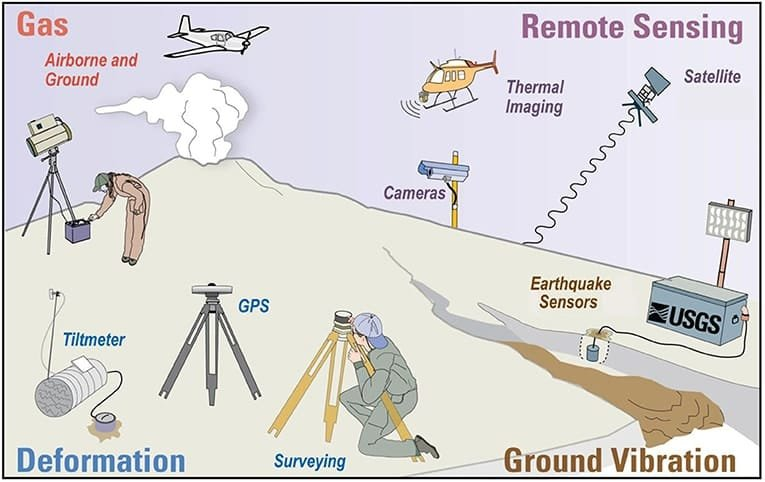

Volcanic eruptions can be both awe-inspiring and dangerous, which is why monitoring volcanic seismic activity is crucial. By understanding the methods used to gauge this activity, scientists and researchers are able to predict eruptions and mitigate risks to surrounding communities. Whether it's studying the types of volcanoes, analyzing their eruption causes, or assessing the hazards and benefits they bring, these key methods provide valuable insights into the complex nature of volcanoes. Stay tuned as we explore the various methods that help us monitor volcanic seismic activity and gain a deeper understanding of these powerful natural phenomena.

This image is property of d9-wret.s3.us-west-2.amazonaws.com.

## Understanding Volcanic Seismicity

### Nature of seismic vibrations in a volcanic environment

When volcanoes are active, they generate various types of seismic vibrations. These vibrations can be classified into three main categories: volcanic tremors, explosion quakes, and tectonic earthquakes.

Volcanic tremors are continuous, low-frequency seismic signals often associated with the movement of magma beneath the Earth's surface. They can last for hours, or even days, and are characterized by a rhythmic, oscillating pattern. Volcanic tremors are usually an indication of increased volcanic activity and can sometimes precede eruptions.

Explosion quakes, as the name suggests, occur during volcanic explosions. They are short-duration seismic events characterized by a sudden release of energy. Explosion quakes are typically high-frequency signals and can produce significant ground shaking, especially in the vicinity of the volcanic vent.

Tectonic earthquakes, on the other hand, are not directly related to volcanic activity but occur due to the movement of tectonic plates. These earthquakes can also contribute to the overall seismicity of a volcanic region and might complicate the interpretation of volcanic seismic data.

### Links between seismic activity and volcanic eruptions

Understanding the links between [seismic activity and volcanic eruptions is crucial for monitoring](https://magmamatters.com/the-art-and-science-of-volcano-monitoring/ "The Art and Science of Volcano Monitoring") and predicting volcanic behavior. While there is no direct way to predict volcanic eruptions with absolute certainty, seismic monitoring plays a vital role in providing valuable information about the state of a volcano.

Changes in seismic activity patterns, such as an increase in volcanic tremors, can indicate the movement of magma and the potential for an imminent eruption. Monitoring the seismicity of a volcano allows scientists to track the migration of magma and identify areas of increased pressure and potential eruption sites.

The magnitude and locations of earthquakes within the vicinity of a volcano can also provide valuable insights into the behavior of the volcanic system. By analyzing seismic data, scientists can determine the general area where magma is accumulating, estimate the depth and origin of seismic events, and assess the potential risks associated with volcanic activity.

### Volcanic tremors, explosion quakes, and tectonic earthquakes

Volcanic tremors, explosion quakes, and tectonic earthquakes are distinct types of seismic events, each with its own characteristics and implications for volcanic monitoring.

Volcanic tremors, as mentioned earlier, are continuous, low-frequency signals associated with the movement of magma. These tremors can be detected using seismometers and are typically indicative of increased volcanic activity. Monitoring volcanic tremors can help scientists identify changes in magma movement and assess the potential for volcanic eruptions.

Explosion quakes occur during volcanic explosions and are characterized by a sudden release of energy. These quakes produce high-frequency seismic signals and can cause significant ground shaking in the vicinity of the eruption. Monitoring explosion quakes can provide valuable information about the intensity and size of volcanic explosions, aiding in the assessment of eruption hazards.

Tectonic earthquakes are a result of the movement of tectonic plates and can occur in volcanic regions due to the proximity of plate boundaries. These earthquakes are not directly related to volcanic activity but can still contribute to the overall seismicity of a volcano. Differentiating tectonic earthquakes from volcanic earthquakes is essential for accurate monitoring and interpretation of seismic data.

## Seismic Monitoring Stations

### Location and set up of monitoring stations

Seismic monitoring stations are strategically located around active volcanic regions to detect and record seismic vibrations. The placement of these stations is crucial for obtaining accurate and reliable data for volcanic monitoring.

Monitoring stations are typically positioned near or on a volcano to ensure proximity to the seismic events of interest. They are set up on stable ground to minimize the interference caused by external factors such as human activity or environmental vibrations. The stations are equipped with seismometers, which are sensitive instruments capable of detecting ground motion caused by seismic waves.

In addition to volcanic monitoring stations, seismic networks also include remote or unmanned stations. These stations are placed in areas that are not easily accessible or in remote regions with active volcanoes. Remote stations are designed to withstand harsh environmental conditions and are equipped with autonomous power systems to ensure continuous operation and data collection.

### Roles of seismic networks in collecting real-time data

Seismic networks play a crucial role in collecting and analyzing real-time data for volcanic monitoring. These networks consist of multiple seismic monitoring stations, each equipped with seismometers and data recording systems.

The primary role of seismic networks is to continuously record seismic signals and transmit the data to centralized data collection centers. The recorded data is then analyzed by trained scientists and researchers to identify patterns, changes, and anomalies in the seismic activity.

By collecting data from multiple stations, seismic networks enable the detection and tracking of seismic events over a wide area. This provides a comprehensive understanding of the seismicity within a volcanic region and helps in the monitoring and prediction of volcanic activity.

### Use of remote or unmanned stations

Remote or unmanned seismic stations are essential components of seismic networks, especially in inaccessible or remote volcanic regions. These stations are designed to operate autonomously and provide valuable data for volcanic monitoring.

Remote stations are often placed in areas where continuous human presence is not feasible due to safety concerns or logistical challenges. They are equipped with robust seismometers and data recorders capable of withstanding harsh environmental conditions.

These stations often rely on renewable energy sources, such as solar or wind power, to ensure continuous operation. They are also equipped with data transmission systems that allow for the remote retrieval of seismic data, eliminating the need for regular physical maintenance and data collection.

The use of remote or unmanned stations enhances the coverage and effectiveness of seismic monitoring networks, enabling scientists to gather valuable data from previously inaccessible areas.

This image is property of www.iris.edu.

## Seismometers and Seismographs

### Role of seismometers in detecting ground motion

Seismometers are the primary instruments used in detecting and measuring ground motion caused by seismic waves. These instruments are designed to be highly sensitive and capable of detecting even the smallest vibrations.

Seismometers work based on the principle of inertia. They consist of a mass suspended by springs or other flexible elements. When seismic waves pass through the ground, they cause the mass to move relative to the surrounding frame. This relative motion is then measured and converted into electrical signals that can be recorded and analyzed.

Seismometers are strategically placed within seismic monitoring stations to capture ground motion accurately. They are capable of detecting various types of seismic waves, including primary waves (P-waves) and secondary waves (S-waves), allowing scientists to gain insights into the nature and characteristics of the seismic events.

### Working of seismographs in recording seismic waves

Seismographs are instruments used to record the ground motion detected by seismometers. They consist of a seismometer and a recording device, which can be either analog or digital.

When a seismometer detects ground motion, it generates electrical signals proportional to the motion. In analog seismographs, these signals are amplified and recorded on a rotating drum covered with a sheet of paper. The movement of the drum and a stylus attached to the seismometer create a graphical representation of the seismic waves, known as a seismogram.

Digital seismographs, on the other hand, convert the electrical signals into digital data, which is then stored electronically. These digital records can be easily transferred, analyzed, and archived for future reference.

Seismographs provide a visual representation of seismic events, allowing scientists to study the recorded data and analyze the characteristics of the seismic waves. The data obtained from seismographs is essential for understanding the behavior of volcanic systems and assessing the potential risks associated with volcanic activity.

### Types of seismographs and their specific applications

There are several types of seismographs available, each with its own specific applications and advantages.

The most common type of seismograph is the traditional analog seismograph, which uses a rotating drum to record seismic waves. Analog seismographs are reliable and easy to interpret, making them suitable for long-term monitoring and historical analysis of seismic data.

Digital seismographs, on the other hand, offer several advantages over analog seismographs. They provide higher resolution and accuracy and can record a wider range of seismic frequencies. Digital seismographs also allow for real-time data transmission and remote monitoring, facilitating rapid response and analysis during volcanic crises.

Another type of seismograph is the broadband seismograph, which is designed to capture a wide frequency range of seismic waves. Broadband seismographs are particularly useful for studying the characteristics of volcanic tremors, as they can detect low-frequency signals associated with the movement of magma.

For monitoring high-frequency events such as explosion quakes, short-period seismographs are commonly used. These seismographs are designed to capture short-duration, high-frequency seismic signals and are ideal for monitoring explosive volcanic activity.

The choice of seismograph depends on the specific objectives of the monitoring campaign and the characteristics of the seismic events being studied. By using a combination of different seismographs, scientists can obtain a comprehensive understanding of the seismicity within a volcanic region.

## Volcano Seismic Data Analysis

### Pattern recognition in seismic records

Seismic data analysis involves the identification and interpretation of patterns and trends within seismic records. By analyzing the characteristics of seismic signals, scientists can gain insights into the behavior of volcanic systems and assess the potential risks associated with volcanic activity.

One of the key aspects of seismic data analysis is pattern recognition. Scientists look for recurring patterns or rhythmic signals within the recorded seismic data, such as volcanic tremors or recurring earthquake clusters. These patterns can provide valuable information about the movement of magma and the potential for volcanic eruptions.

Pattern recognition techniques may involve visual analysis of seismograms or the use of advanced algorithms and software to automatically detect and classify seismic events. By studying the patterns of seismic signals over time, scientists can identify changes or anomalies that may indicate an increase in volcanic activity.

### Determination of earthquake magnitudes and epicenters

Seismic data analysis also involves the determination of earthquake magnitudes and epicenters. This information is crucial for understanding the size and location of seismic events and assessing their potential impact on volcanic systems.

Earthquake magnitudes are measures of the energy released by an earthquake and are determined based on the amplitude of the seismic waves recorded by seismometers. The most commonly used magnitude scale is the moment magnitude scale (Mw), which provides a more accurate measure of earthquake size compared to other scales such as the Richter scale.

To determine earthquake magnitudes, scientists analyze multiple seismic records to estimate the amplitude of the seismic waves. These amplitude measurements are then used to calculate the earthquake magnitude using established formulas and relationships.

The epicenter of an earthquake is the point on the Earth's surface directly above the location where the earthquake originated. Determining the epicenter involves analyzing the arrival times of seismic waves at multiple seismic stations. By triangulating the arrival times, scientists can pinpoint the location of the earthquake.

Knowing the magnitudes and epicenters of earthquakes within a volcanic region allows scientists to assess the potential risks and impacts of volcanic activity. It also helps in understanding the underlying processes and dynamics of the volcanic system.

### Estimation of depth and origin of seismic events

In addition to determining earthquake magnitudes and epicenters, seismic data analysis can also provide valuable information about the depth and origin of seismic events. This information is essential for understanding the source of [seismic activity](https://magmamatters.com/understanding-volcanic-formation-a-comprehensive-guide/ "Understanding Volcanic Formation: A Comprehensive Guide") and its relation to volcanic processes.

The depth of a seismic event is determined by analyzing the arrival times of seismic waves at different depths within the Earth's crust. As seismic waves travel through the Earth, they undergo changes in velocity, which can be used to estimate the depth of the seismic source.

The origin of a seismic event refers to its source within the Earth, which can be due to various processes such as volcanic activity or tectonic movements. By analyzing the characteristics of seismic signals, scientists can differentiate between volcanic earthquakes and tectonic earthquakes. For example, volcanic earthquakes are often characterized by low-frequency signals associated with magma movement, while tectonic earthquakes typically exhibit high-frequency signals.

Estimating the depth and origin of seismic events provides valuable insights into the underlying processes within a volcanic system. It helps in understanding the nature of volcanic activity and can aid in the prediction and forecasting of volcanic eruptions.

This image is property of www.iris.edu.

## Spectral Analysis of Volcanic Seismicity

### Understanding frequency and amplitude spectra

Spectral analysis is a technique used to analyze the frequency and amplitude content of seismic signals. By examining the spectra of seismic data, scientists can gain insights into the characteristics and behavior of volcanic seismicity.

Frequency spectra provide information about the distribution of energy across different frequencies within a seismic signal. Seismic signals can contain a wide range of frequencies, ranging from low-frequency signals associated with volcanic tremors to high-frequency signals associated with explosion quakes.

Amplitude spectra, on the other hand, provide information about the strength or intensity of different frequencies within a seismic signal. By analyzing the amplitude spectra, scientists can identify dominant frequency components within the seismic data and assess their significance in relation to volcanic activity.

Both frequency and amplitude spectra are important tools for understanding volcanic seismicity. They help in identifying characteristic frequency patterns associated with specific types of seismic events, such as volcanic tremors or explosion quakes. Spectral analysis also allows scientists to monitor changes in the frequency content of seismic signals over time, which may indicate variations in volcanic activity levels.

### Significance of spectral analysis in predicting eruptions

Spectral analysis plays a significant role in predicting volcanic eruptions by providing valuable insights into the behavior of volcanic seismicity. By monitoring changes in the frequency content of seismic signals, scientists can identify patterns or anomalies associated with increased volcanic activity.

For example, an increase in low-frequency energy within the frequency spectra may indicate the movement of magma beneath the Earth's surface, potentially leading to an eruption. Similarly, changes in the amplitude spectra, such as a sudden increase in high-frequency energy, may suggest the occurrence of explosive volcanic activity.

Spectral analysis also helps in studying the dynamics of volcanic systems by identifying characteristic frequency patterns associated with specific volcanic processes. By comparing the spectra of seismic data from different volcanic events, scientists can gain insights into the underlying mechanisms and processes driving volcanic activity.

While spectral analysis alone cannot provide definitive predictions of volcanic eruptions, it serves as an important tool in conjunction with other monitoring techniques. By combining spectral analysis with other seismic data analysis methods, scientists can obtain a more comprehensive understanding of volcanic behavior and improve the accuracy of eruption forecasts.

### Case studies of spectral analysis in recent volcanic activities

Several case studies have demonstrated the effectiveness of spectral analysis in predicting and understanding volcanic activity. For example, in the case of the 2018 eruption of Kilauea in Hawaii, spectral analysis of seismic data revealed changes in the frequency content of the seismic signals before and during the eruption.

Prior to the eruption, an increase in low-frequency energy within the frequency spectra was observed, indicating the movement of magma beneath the volcano. As the eruption progressed, there was a shift in the frequency content towards higher frequencies, indicating the occurrence of explosive volcanic activity.

Similar studies have been conducted for other volcanic eruptions worldwide, providing valuable insights into the behavior of volcanic seismicity. By analyzing the spectra of seismic data from different volcanic events, scientists can identify common frequency patterns associated with specific types of volcanic activity, improving our understanding of volcanic processes and aiding in the prediction of future eruptions.

## Seismic Tomography of Volcanoes

### Concept and working of seismic tomography

Seismic tomography is a technique used to create a three-dimensional image of the Earth's interior based on the analysis of seismic waves. By studying the properties of seismic waves as they propagate through the Earth, scientists can gain insights into the internal structure of volcanic systems.

The basic concept of seismic tomography involves the measurement of seismic wave arrival times and their travel paths. During an earthquake or volcanic event, seismic waves radiate from the seismic source and travel through the Earth. By recording the arrival times of seismic waves at multiple seismic stations, scientists can triangulate the paths of the waves and infer the structure of the Earth's interior.

Seismic tomography techniques use sophisticated mathematical algorithms and inversion methods to analyze the seismic data and reconstruct the 3D structure of volcanoes. By comparing the observed travel times with the predicted travel times based on theoretical models, scientists can determine the seismic velocity distribution within the volcano.

The resulting tomographic images provide valuable information about the distribution of rocks, magma chambers, and other structures within a volcanic system. This information helps in understanding the dynamics of volcanic processes and can aid in the prediction of volcanic eruptions.

### Role of tomography in creating 3D structure of volcanoes

Seismic tomography plays a crucial role in creating a detailed three-dimensional structure of volcanoes. By analyzing the seismic wave arrival times and travel paths, scientists can infer the distribution of different materials and structures within a volcanic system.

One of the main applications of tomography is the mapping of magma chambers and other subsurface structures. Magma chambers are reservoirs of molten rock beneath volcanoes, and their size and geometry can vary significantly between different volcanic systems. By analyzing the seismic data, tomography can provide insights into the size, shape, and location of magma chambers within a volcano.

Tomography also helps in identifying other subsurface features, such as faults, fractures, and conduits, which may play a role in the movement and eruption of magma. By mapping these structures, scientists can better understand the pathways through which magma travels and accumulates, improving our ability to predict volcanic eruptions.

Furthermore, tomography can aid in the identification of areas of increased seismicity or magma movement. By analyzing the seismic velocity distribution within a volcanic system, scientists can identify zones of increased fluid flow or regions of high stress accumulation, indicating areas of potential volcanic activity.

Overall, seismic tomography provides a valuable tool for creating detailed 3D models of volcanoes, helping scientists gain a better understanding of the internal structure and processes driving volcanic activity.

### Data interpretation and applications of seismic tomography

Interpreting seismic tomography data requires a combination of expertise in geophysics, seismology, and volcano monitoring. Analyzing the tomographic images and relating them to the underlying geology and volcanic processes is crucial for extracting meaningful information.

The interpretation of seismic tomography data involves correlating variations in seismic velocity with specific geological features and structures. For example, areas of lower seismic velocity may indicate the presence of magma or other fluid-filled regions, while areas of higher velocity may correspond to denser rock formations.

Seismic tomography data can be used in various applications related to volcanic monitoring and hazard assessment. By mapping the distribution of magma chambers and other subsurface structures, tomography can aid in the assessment of eruption potential and the identification of areas of increased seismic and volcanic activity.

Furthermore, tomography data can help in the estimation of magma properties, such as volume, depth, and composition. This information is crucial for understanding the dynamics of volcanic systems and the behavior of magma reservoirs.

Seismic tomography can also contribute to the assessment of volcanic hazards, such as the potential for volcanic landslides or the formation of volcanic gas clouds. By identifying subsurface structures and areas of increased fluid flow, tomography can provide insights into the mechanisms that may trigger these hazards, helping in the development of hazard maps and mitigation strategies.

In summary, seismic tomography is a powerful tool for understanding the internal structure and dynamics of volcanic systems. It provides valuable information about the distribution of magma and other subsurface structures, aiding in the assessment of eruption potential and the prediction of volcanic activity.

This image is property of d9-wret.s3.us-west-2.amazonaws.com.

## Infrasound Monitoring

### Introduction to low-frequency sound waves or infrasound

Infrasound refers to low-frequency sound waves with frequencies below the lower limit of human hearing, typically below 20 hertz (Hz). These sound waves can be generated by various natural and man-made sources, including volcanic eruptions.

In the context of volcanic monitoring, infrasound waves are generated during explosive volcanic activity. When a volcano erupts, the rapid expansion and contraction of gases within the volcanic vent produce intense sound waves that propagate through the atmosphere as infrasound.

Infrasound waves have long wavelengths and can travel long distances without significant attenuation. They can be detected by specialized sensors called infrasound sensors, which are designed to capture and record the low-frequency sound waves.

Infrasound monitoring provides valuable information about the magnitude and intensity of volcanic explosions. By analyzing the characteristics of infrasound waves, scientists can estimate the energy released during an eruption, track the propagation of shockwaves, and assess the potential risks associated with volcanic activity.

### Infrasound sensors and monitoring shallow volcanic activities

Infrasound sensors, also known as microbarometers, are highly sensitive instruments used to detect and monitor infrasound waves. These sensors are designed to measure small changes in atmospheric pressure caused by the passage of sound waves.

Infrasound sensors consist of a microphone-like element housed in a protective casing. The element detects changes in air pressure caused by infrasound waves and converts them into electrical signals that can be recorded and analyzed. The recorded infrasound data provides valuable information about the characteristics and intensity of volcanic explosions.

Infrasound monitoring is particularly useful for monitoring shallow volcanic activities, where explosive eruptions are more common. By placing infrasound sensors in close proximity to active volcanic vents, scientists can capture detailed information about the dynamics and behavior of volcanic explosions.

Infrasound sensors can also be deployed in arrays to provide spatial coverage and allow for the triangulation of infrasound sources. By analyzing the arrival times and amplitudes of infrasound waves at multiple sensor locations, scientists can determine the origin and intensity of volcanic explosions, aiding in the assessment of eruption hazards.

### Infrasound data in supplementing seismic information

Infrasound data plays a crucial role in supplementing seismic information for volcanic monitoring. While seismic monitoring provides valuable insights into the movement of magma and the behavior of volcanic systems, infrasound monitoring provides additional information about the intensity and magnitude of volcanic explosions.

By analyzing the characteristics of infrasound waves, scientists can estimate the energy released during an eruption, which is directly related to the size and intensity of the volcanic explosion. This information is particularly useful for assessing the potential risks and impacts of volcanic activity on nearby communities and infrastructure.

Infrasound data can also help in the detection and tracking of volcanic ash clouds. Volcanic explosions often produce large amounts of ash, which can be carried by wind over long distances. Infrasound sensors can detect the acoustic signature of ash-laden eruption clouds and provide valuable information about the direction and speed of ash transport.

The combination of seismic and infrasound data allows for a more comprehensive understanding of volcanic activity. By integrating these two monitoring techniques, scientists can improve the accuracy of eruption forecasts, enhance warning systems, and mitigate the risks associated with volcanic eruptions.

## Ground Deformation and GPS Monitoring

### Detection of ground movement with GPS technology

GPS (Global Positioning System) technology plays a crucial role in monitoring and detecting ground deformation associated with volcanic activity. By measuring the precise positions of GPS receivers over time, scientists can track and analyze the movement of the Earth's surface.

GPS monitoring involves the installation of multiple GPS receivers around volcanic regions. These receivers are equipped with antennas that receive signals from a network of satellites orbiting the Earth. By calculating the time it takes for signals to travel from the satellites to the receivers, GPS receivers can determine their precise positions.

Over time, GPS receivers record the positions of the Earth's surface relative to a fixed reference point. By analyzing the recorded positions, scientists can detect and measure any changes in the location of the GPS receivers, indicating ground deformation.

Ground deformation associated with volcanic activity can manifest as uplift or subsidence of the Earth's surface. By tracking these changes, scientists can gain insights into the movement and accumulation of magma beneath the volcano, aiding in the prediction and forecasting of volcanic eruptions.

### Role of ground deformation in forecasting eruptions

Ground deformation is a critical parameter for forecasting volcanic eruptions. By monitoring and analyzing changes in the shape and elevation of the Earth's surface, scientists can gain valuable insights into the processes occurring beneath a volcano.

Volcanic eruptions are often preceded by the accumulation of magma beneath the Earth's surface. As magma rises and accumulates, it causes the overlying rocks to deform, resulting in detectable changes in the shape and elevation of the Earth's surface.

By tracking and analyzing ground deformation, scientists can estimate the volume and depth of magma accumulation, allowing for better predictions of volcanic eruptions. Rapid or significant changes in ground deformation may indicate the movement and migration of magma, potentially leading to an imminent eruption.

Ground deformation data is often combined with other monitoring techniques, such as seismic and gas monitoring, to obtain a comprehensive view of volcanic activity. By integrating multiple data sources, scientists can improve the accuracy and reliability of eruption forecasts and provide timely warnings to at-risk communities.

### Integration of GPS data with seismic records

Integrating GPS data with seismic records is crucial for obtaining a comprehensive understanding of volcanic activity. While seismic monitoring provides insights into the movement and behavior of magma, GPS data provides crucial information about ground deformation associated with volcanic processes.

By combining GPS data with seismic records, scientists can correlate changes in ground deformation with specific seismic events. For example, the detection of ground uplift or subsidence can be linked to the occurrence of volcanic tremors or earthquake swarms, indicating the movement and accumulation of magma.

Integrating GPS data with seismic records also allows for the identification of precursory signals that may precede volcanic eruptions. By analyzing the temporal and spatial relationship between ground deformation and seismic activity, scientists can derive valuable insights into the dynamics of volcanic systems and improve the accuracy of eruption forecasts.

Furthermore, integrating GPS data with other monitoring techniques, such as gas monitoring and infrasound monitoring, can provide a more comprehensive view of volcanic processes. By combining multiple data sources, scientists can enhance their understanding of volcanic behavior and improve the effectiveness of eruption prediction and hazard assessment.

This image is property of www.frontiersin.org.

## Satellite Remote Sensing

### Use of satellite imagery in monitoring volcanoes

Satellite remote sensing is a powerful tool for monitoring and studying volcanoes from space. Satellites equipped with various sensors can provide valuable data about the surface characteristics and behavior of volcanic systems.

Satellite imagery allows scientists to obtain high-resolution images of volcanic regions, providing detailed information about the topography, vegetation cover, and geological features of volcanoes. These images can be used to map the extent of volcanic activity, identify new vents or fissures, and monitor changes in the volcanic landscape over time.

Satellite imagery is particularly useful for monitoring volcanic ash clouds. Volcanic eruptions often produce large amounts of ash, which can be carried by wind over long distances. Satellites equipped with thermal or optical sensors can detect and track ash clouds, providing valuable information about their location, composition, and dispersion.

In addition to visual imagery, satellites can also collect data using other remote sensing techniques, such as thermal sensing and radar sensing. These techniques allow scientists to measure temperature variations, detect changes in surface deformation, and estimate the volume and flow rate of lava during volcanic eruptions.

Satellite remote sensing provides a global perspective on volcanic activity, allowing scientists to monitor and study volcanoes in remote or inaccessible regions. The data obtained from satellite imagery can complement ground-based monitoring techniques and improve our understanding of volcanic processes.

### Thermal, optical, and radar remote sensing

Satellite remote sensing employs various sensing techniques, including thermal sensing, optical sensing, and radar sensing, to collect data about volcanic activity.

Thermal sensing involves measuring the energy emitted by the Earth's surface in the form of heat. In the context of volcanic monitoring, thermal sensing can provide insights into the temperature variations associated with volcanic activity. By analyzing thermal images, scientists can detect areas of increased heat flow, identify active vents or lava flows, and estimate the volume and flow rate of volcanic material.

Optical sensing uses sensors that capture visible and near-infrared light reflected or emitted by the Earth's surface. Optical sensors can provide high-resolution images of volcanic regions, allowing scientists to study surface features, vegetation cover, and changes in the volcanic landscape. Optical data can also be used to detect and monitor volcanic ash clouds, which can pose significant hazards to aviation and human health.

Radar sensing relies on the emission and reception of microwave signals to measure surface deformation and detect changes in the Earth's topography. Radar sensors can penetrate clouds and provide data regardless of weather conditions, making them particularly useful for monitoring volcanoes in areas with frequent cloud cover. Radar data can be used to measure ground deformation, estimate lava flow rates, and detect changes in volcanic morphology.

By combining data from these different remote sensing techniques, scientists can obtain a comprehensive view of volcanic activity. Each sensing technique provides unique information about the surface characteristics and behavior of volcanoes, enhancing our understanding of volcanic processes and improving the effectiveness of eruption monitoring and hazard assessment.

### Satellite data for evaluating the extent of eruption aftermath

Satellite data is invaluable for evaluating the extent of the aftermath of volcanic eruptions. After an eruption, the landscape is often significantly altered, and satellite imagery can provide a detailed assessment of the impact and extent of the volcanic activity.

Satellite imagery can be used to map the distribution of volcanic ash, which can cover large areas and disrupt air traffic, agriculture, and human settlements. By analyzing high-resolution satellite images, scientists can estimate the volume and thickness of ash deposits, identify areas of high concentration, and track the dispersion of ash over time.

In addition to ash mapping, satellite data can also help detect and monitor lahars, which are destructive mudflows that occur when volcanic material mixes with water. By analyzing satellite images, scientists can detect changes in river systems, identify areas prone to lahars, and monitor the movement and deposition of volcanic sediments.

Satellite data also plays a crucial role in monitoring the recovery and regeneration of vegetation in volcanic affected areas. By comparing pre- and post-eruption satellite images, scientists can assess changes in vegetation cover, identify areas of regrowth, and monitor the long-term impact of volcanic activity on ecosystems.

Overall, satellite remote sensing provides a valuable tool for evaluating the extent of volcanic eruption aftermath. The data obtained from satellite imagery enhances our understanding of the impact and risks associated with volcanic activity, aiding in the development of mitigation strategies and the protection of affected communities.

## Public Education and Communication of Seismic Risk

### Importance of public awareness initiatives

Public awareness initiatives play a crucial role in educating and informing communities about the risks and hazards associated with volcanic activity. By raising awareness and disseminating accurate information, these initiatives help communities to understand and prepare for potential seismic events.

It is essential for people living in volcanic regions to be aware of the potential risks and hazards they face. Public awareness initiatives can provide information about the types of volcanic activity, the warning signs of an impending eruption, and the appropriate safety measures to take.

By educating the public about the [science of volcanoes and the behavior of volcanic](https://magmamatters.com/geothermal-energy-and-its-volcanic-origins/ "Geothermal Energy and Its Volcanic Origins") systems, these initiatives can help dispel myths and misconceptions, reducing anxiety and fear. They can also promote a proactive approach to disaster preparedness, encouraging individuals and communities to take preventive measures and develop emergency plans.

Public awareness initiatives can be conducted through various channels, such as community workshops, educational programs, and media campaigns. They should be accessible, engaging, and tailored to the specific needs and cultural context of the communities they target.

### Role of media in disseminating volcanic warnings

The media plays a crucial role in disseminating volcanic warnings and facilitating communication between scientists, authorities, and the public. By providing accurate and timely information, the media can help raise awareness, promote preparedness, and facilitate emergency response during volcanic crises.

During volcanic events, the media can provide updates on the evolving situation, including information about the current volcanic activity, the potential risks to affected communities, and the actions being taken by authorities. By presenting this information in an accessible and understandable manner, the media can help individuals and communities make informed decisions and take appropriate precautions.

The media can also play a role in translating scientific information into layperson's terms, making it accessible to the general public. By collaborating with scientists and experts, the media can ensure that accurate and reliable information reaches the public, reducing the spread of misinformation and rumors.

In addition to disseminating warnings and information, the media can also raise awareness about the long-term impacts of volcanic activity and promote efforts for disaster preparedness and mitigation. By highlighting the experiences of affected communities and sharing success stories, the media can inspire action and foster resilience.

### Emergency response planning and evacuation strategies

Emergency response planning and evacuation strategies are crucial components of managing volcanic risks and ensuring the safety of affected communities. By developing comprehensive preparedness plans and evacuation strategies, authorities can minimize the potential impacts of volcanic eruptions.

Emergency response planning involves the identification of potential hazards, the establishment of communication networks, and the development of protocols and procedures for different stages of volcanic crises. It also includes the coordination of resources, such as personnel, equipment, and emergency shelters, to ensure an effective and organized response.

Evacuation strategies are an essential part of emergency planning and involve the orderly and timely relocation of individuals and communities out of the danger zone. By identifying evacuation routes, providing clear instructions, and allocating resources for transportation and accommodation, authorities can facilitate the safe evacuation of at-risk populations.

The success of emergency response planning and evacuation strategies depends on effective communication and collaboration between authorities, scientists, emergency responders, and the public. By involving all stakeholders in the planning process and conducting regular drills and exercises, authorities can ensure a coordinated and efficient response during volcanic crises.

Furthermore, it is crucial for individuals and communities to be proactive in their preparedness efforts. By familiarizing themselves with emergency plans, gathering essential supplies, and staying informed about the latest developments, individuals can contribute to their own safety and the resilience of their communities.

In conclusion, understanding volcanic seismicity and implementing effective monitoring techniques are crucial for mitigating the risks associated with volcanic activity. By continuously monitoring seismic activity, analyzing seismic data, and integrating various monitoring methods, scientists can gain valuable insights into volcanic behavior and provide timely warnings to at-risk communities. Additionally, public education initiatives, accurate media reporting, and robust emergency response planning are essential for ensuring the safety and resilience of communities living in volcanic regions.

