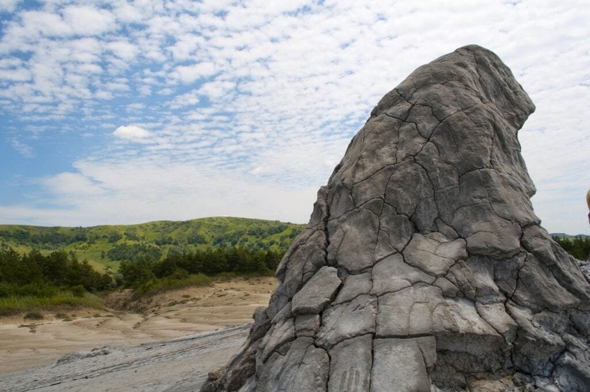

In the Philippines, a country known for its beautiful beaches and tropical landscapes, there is a hidden danger that lurks beneath its surface - volcanoes. The archipelago is located in the Pacific Ring of Fire, a region prone to earthquakes and volcanic eruptions due to the movement of tectonic plates. This article aims to shed light on the notable volcano eruption cases that have occurred in the Philippines, providing important insights into the patterns and impacts of these natural disasters. By delving into the causes, hazards, and benefits of volcanic eruptions, we can gain a better understanding of these fascinating and destructive phenomena. So, let's embark on a journey to explore the world of Philippine volcano eruption cases.

## Mayon Volcano

This image is property of pixabay.com.

### Historical eruptions and impacts

Mayon Volcano, located in the province of Albay in the Philippines, is one of the most active volcanoes in the country. It has erupted over 50 times since the 17th century, leaving a significant impact on its surrounding environment and communities. The volcano's historical eruptions have varied in scale and intensity, with some being relatively minor and others causing widespread destruction.

The most notable eruption of Mayon Volcano occurred in 1814, when it erupted with such force that it completely destroyed the nearby town of Cagsawa. This eruption claimed the lives of thousands of people and buried the town under a thick layer of volcanic ash and debris. Today, the remnants of the Cagsawa ruins serve as a grim reminder of the destructive power of Mayon Volcano.

### The 2018 eruption case: causes and effects

In recent years, Mayon Volcano has continued to exhibit signs of activity. One of the most significant eruptions in recent memory took place in January 2018. The eruption was characterized by a series of ash explosions and lava flows, which led to the evacuation of thousands of residents in the surrounding areas.

The eruption was triggered by the movement of magma beneath the volcano, which caused an increase in volcanic gas emissions and the formation of a lava dome at the summit. This dome eventually collapsed, resulting in pyroclastic flows and ash plumes that reached several kilometers into the atmosphere.

The effects of the 2018 eruption were far-reaching. The volcanic ash blanketed nearby towns, affecting agriculture and causing significant damage to crops and livestock. The ashfall also posed health hazards to the local population, with respiratory problems and eye irritations being common among those exposed to the ash.

This image is property of pixabay.com.

### Community response and preparedness

The local communities surrounding Mayon Volcano have developed a high level of resilience and preparedness in response to its frequent eruptions. The Philippine Institute of Volcanology and Seismology (PHIVOLCS) closely monitors the volcano's activity and provides timely updates and warnings to the affected communities.

When signs of an impending eruption are detected, local authorities quickly initiate evacuation procedures to ensure the safety of residents. Evacuation centers are established, and relief operations are organized to provide affected families with basic necessities and support. The cooperation between the government and the affected communities in times of crisis has been crucial in mitigating the impacts of Mayon Volcano's eruptions.

### Impact on ecological balance

The eruptions of Mayon Volcano have both short-term and long-term effects on the surrounding ecological balance. In the immediate aftermath of an eruption, the volcanic ash and debris cover the landscape, smothering vegetation and disrupting ecosystems. This can lead to a significant loss of biodiversity and damage to habitats.

However, over time, the volcanic ash acts as a [natural](https://magmamatters.com/the-art-and-science-of-volcano-monitoring/ "The Art and Science of Volcano Monitoring") fertilizer, enriching the soil and promoting the growth of new vegetation. In fact, the fertile volcanic soils around Mayon Volcano are highly sought after for agriculture, as they support the growth of various crops including rice, corn, and abaca.

The eruptions of Mayon Volcano also contribute to the formation of new landforms, such as lava domes and volcanic cones, which add to the geological diversity of the area. Despite the challenges posed by the volcano's eruptions, the ecological balance in the region is continuously adapting and evolving in response to these natural disturbances.

