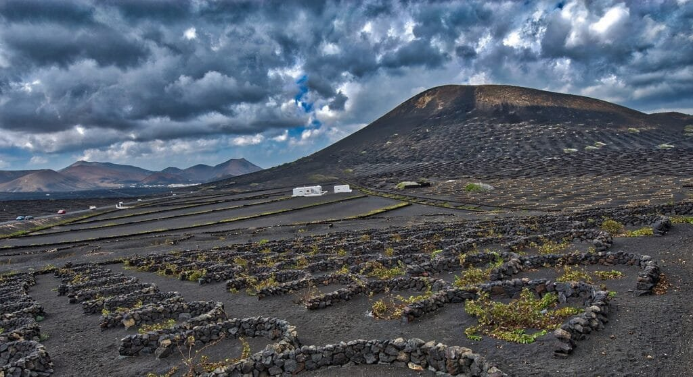
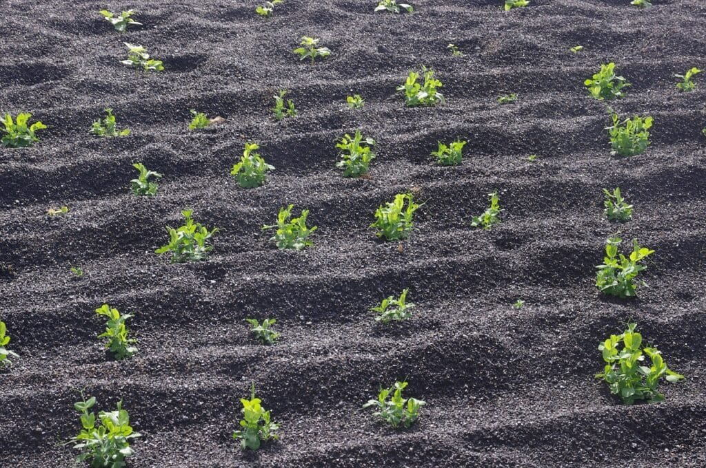

If you're curious about the advantages of organic farming in volcanic soil regions, you've come to the right place. Volcanoes, with their eruptions of lava and ash, play a significant role in shaping the earth's landscape. They provide essential nutrients to the soil, making it incredibly fertile for agriculture. But the benefits go beyond that. By understanding the different types of volcanoes, their eruption patterns, and the risks they pose, we can harness their potential for organic farming and mitigate any hazards they may present. So let's dig in and explore how organic farming thrives in these unique regions.

This image is property of pixabay.com.

## Understanding Volcanic Soil

### What is volcanic soil?

Volcanic soil, also known as volcanic ash soil or volcanic ash-derived soil, is soil that is formed from the weathering and decomposition of volcanic materials such as lava, ash, and rock fragments. Volcanic soil is rich in minerals, making it highly fertile and ideal for agricultural purposes.

### Formation of volcanic soil

Volcanic soil is formed through a process called weathering. When a volcano erupts, it releases molten lava and ash, which eventually cool and settle on the surrounding land. Over time, these volcanic materials break down and mix with other organic matter, creating a layer of nutrient-rich soil.

### Key elements of volcanic soil

Volcanic soil is characterized by its high mineral content, including nutrients such as potassium, phosphorus, and magnesium. It also has a porous texture, allowing for good drainage and aeration. The presence of volcanic glass particles in the soil contributes to its dark color, which helps absorb and retain heat.

## Types of Volcanic Soil

### Andisol

Andisol is a type of volcanic soil that is formed from young volcanic ash and lava. It is known for its high fertility and ability to retain moisture, making it suitable for growing a wide range of crops. Andisol is commonly found in regions with recent volcanic activity.

### Tephra

Tephra is another type of volcanic soil that is formed from the accumulation of volcanic ash and rock fragments. It has a coarse texture and is often mixed with other materials such as sand and clay. Tephra soil is well-drained and has good water-holding capacity, making it suitable for agriculture.

### Black earths

Black earths, also known as Chernozem, are volcanic soils that have a high organic matter content. They are extremely fertile and have a dark color due to the presence of humus, a decomposed organic material. Black earths are typically found in volcanic regions with a moderate climate.

### Spodosol

Spodosol is a type of volcanic soil that is common in regions with high rainfall and acidic conditions. It is characterized by its sandy texture and the presence of a distinct layer of iron and aluminum oxides. Spodosol soils are typically found in volcanic regions with temperate climates.

<iframe width="560" height="315" src="https://www.youtube.com/embed/gUtZmD9e-cg" frameborder="0" allow="accelerometer; autoplay; encrypted-media; gyroscope; picture-in-picture" allowfullscreen></iframe>

  

## Geographic Distribution of Volcanic Soil

### Countries with significant volcanic soil

Countries with significant volcanic soil include Indonesia, Japan, Mexico, Italy, and Ecuador. These countries have a high concentration of active [volcanoes and are known for their fertile volcanic](https://magmamatters.com/geothermal-energy-and-its-volcanic-origins/ "Geothermal Energy and Its Volcanic Origins") soils.

### Specific regions known for volcanic soil richness

Specific regions known for their volcanic soil richness include the Pacific Northwest in the United States, the Mediterranean region, the Andean highlands in South America, and the islands of Hawaii and Iceland. These regions have a combination of volcanic activity, favorable climates, and geological conditions that contribute to the fertility of the soil.

## Why Organic Farming?

### Definition of organic farming

Organic farming is an agricultural practice that emphasizes the use of [natural](https://magmamatters.com/the-art-and-science-of-volcano-monitoring/ "The Art and Science of Volcano Monitoring") processes and materials to promote sustainable and environmentally-friendly farming methods. It involves avoiding the use of synthetic chemicals, genetic engineering, and irradiation in the production of crops and livestock.

### Difference between organic and conventional farming

The main difference between organic and conventional farming lies in the methods used for pest control and fertilization. While conventional farming relies on synthetic pesticides and chemical fertilizers, organic farming promotes the use of biological pest control, crop rotation, and organic fertilizers derived from compost, manure, and other natural sources.

### Major principles of organic farming

The major principles of organic farming include promoting soil health and fertility, protecting natural resources, and maintaining biodiversity. Organic farmers prioritize the use of sustainable practices such as crop rotation, composting, and cover cropping to improve soil quality and minimize environmental impact.

This image is property of pixabay.com.

## Organic Farming Practices on Volcanic Soil

### Soil management techniques

Organic farming on volcanic soil requires careful soil management techniques to ensure optimal fertility and nutrient availability. This can include the use of cover crops to prevent erosion, regular application of organic matter such as compost or green manure, and proper irrigation techniques to maintain moisture levels.

### Plant diversity

Organic farmers on volcanic soil often emphasize plant diversity to enhance the overall health of the ecosystem. By growing a variety of crops and incorporating native plants, farmers can improve soil structure, reduce pest pressure, and promote beneficial insects.

### Natural pest control

Organic farmers rely on natural pest control methods to manage pests and minimize the use of synthetic pesticides. This can include the introduction of beneficial insects, crop rotation to disrupt pest life cycles, and the use of physical barriers or traps.

### Use of organic fertilizers

To maintain soil fertility, organic farmers on volcanic soil use organic fertilizers such as compost, manure, and bone meal. These natural fertilizers provide essential nutrients to plants and improve soil quality without the negative environmental impacts associated with synthetic fertilizers.

## Benefits of Organic Farming in Volcanic Soil Regions

### Enhanced soil fertility

Organic farming practices, such as the use of organic fertilizers and soil management techniques, can enhance the fertility of volcanic soil. By promoting the natural nutrient cycle and microbial activity in the soil, organic farmers can improve the availability of key nutrients for plant growth.

### Increased biodiversity

Organic farming encourages the presence of diverse plant species, which in turn supports a wide range of beneficial insects, birds, and other wildlife. This increased biodiversity helps to create a balanced ecosystem and reduce the reliance on chemical pesticides for pest control.

### Reduced soil erosion

Volcanic soils can be prone to erosion due to their porous texture and susceptibility to heavy rainfall. Organic farming practices, such as the use of cover crops and contour plowing, can help to prevent soil erosion and maintain the integrity of the soil structure.

### Improved water holding capacity

The porous nature of volcanic soil allows for good drainage, but it can also lead to water loss during dry periods. Organic farming practices, such as the addition of organic matter and the use of cover crops, can improve the water holding capacity of the soil, reducing the need for irrigation and conserving water resources.

This image is property of pixabay.com.

## Challenges of Organic Farming in Volcanic Soil Regions

### Pest management

Organic farmers in volcanic soil regions face challenges in managing pests without the use of synthetic pesticides. They must rely on alternative methods such as biological control, crop rotation, and physical barriers to protect their crops from pests and diseases.

### Weed control

Volcanic soil can be fertile ground for weeds, which compete with crops for nutrients and resources. Organic farmers use various weed control methods, including manual removal, mulching, and use of cover crops to suppress weed growth and maintain a weed-free environment.

### Maintaining soil fertility

While volcanic soil is naturally rich in minerals and nutrients, it still requires proper management to maintain its fertility over the long term. Organic farmers must regularly replenish organic matter through the use of compost, cover crops, and other sustainable practices to ensure ongoing soil fertility.

### Understanding changes in soil chemistry

Volcanic soil can undergo changes in chemistry over time, which can affect its fertility and nutrient availability. Organic farmers need to closely monitor and understand these changes to adjust their farming practices accordingly and ensure optimal plant growth.

## Examples of Organic Crops Grown in Volcanic Soil

### Coffee

Volcanic soil regions, such as those found in countries like Costa Rica, Ethiopia, and Guatemala, are renowned for producing high-quality organic coffee. The fertile volcanic soil provides the ideal conditions for coffee plants to thrive, resulting in rich and flavorful beans.

### Wine grapes

Volcanic soil regions, such as those in Italy's Mount Etna or Oregon's Willamette Valley, are favored for growing organic wine grapes. The volcanic ash in the soil contributes to unique mineral profiles, which can enhance the flavors and aromas of the grapes and ultimately the wine.

### Cocoa

Cocoa trees, which are used to produce chocolate, are often grown in volcanic soil regions such as those found in the Caribbean islands and parts of Central America. The volcanic soil provides the necessary nutrients and moisture retention for cocoa trees to flourish and produce high-quality beans.

### Various fruits and vegetables

Volcanic soil regions are also suitable for growing a wide variety of organic fruits and vegetables. Examples include tomatoes, peppers, pineapples, avocados, and bananas. The fertile soil provides the necessary nutrients for these crops to grow and thrive.

## Transformation of Volcanic Soil Regions Through Organic Farming

### Economic growth

Organic farming in volcanic soil regions can lead to economic growth and development. By promoting sustainable farming practices and producing high-quality organic products, farmers in these regions can attract consumers willing to pay a premium for organic produce. This can help stimulate local economies and create job opportunities.

### Environmental sustainability

Organic farming on volcanic soil promotes environmental sustainability by minimizing the use of synthetic chemicals and preserving natural resources. By utilizing organic practices, farmers can reduce soil erosion, protect water quality, and promote biodiversity, contributing to a healthier and more sustainable ecosystem.

### Community development

The adoption of organic farming practices in volcanic soil regions can lead to community development and empowerment. Organic farming often involves community-based initiatives, knowledge sharing, and the preservation of traditional farming practices, which can strengthen local communities and promote cultural heritage.

## Future of Organic Farming in Volcanic Soil Regions

### Increased demand for organic produce

As consumers become more conscious about their [health and the environment](https://magmamatters.com/the-environmental-impact-of-volcanic-eruptions-2/ "The Environmental Impact of Volcanic Eruptions"), there is a growing demand for organic produce. This trend is expected to continue in volcanic soil regions, where the unique characteristics of the soil contribute to the production of high-quality organic crops.

### Challenges and opportunities

The future of organic farming in volcanic soil regions will be influenced by various challenges and opportunities. Farmers will need to adapt to changing climate conditions, manage pests and diseases effectively, and continuously improve their farming practices. However, the unique characteristics of volcanic soil present opportunities for innovation and sustainable development in organic agriculture.

### Technological advances in organic farming

Technological advancements in organic farming, such as the development of organic pest control methods and precision agriculture techniques, can further enhance the productivity and sustainability of organic farming in volcanic soil regions. Innovation in soil testing and monitoring can help farmers better understand and manage the unique properties of volcanic soil.

In conclusion, volcanic soil regions offer unique opportunities for organic farming due to their high fertility and mineral content. Organic farming not only enhances soil fertility and biodiversity but also promotes environmental sustainability and community development. While organic farmers in volcanic soil regions face challenges such as pest management and maintaining soil fertility, the future of organic farming in these regions holds great promise with increased demand for organic produce and advancements in farming technology. By harnessing the potential of volcanic soil through organic farming practices, we can achieve a balance between productivity, environmental stewardship, and community well-being in these regions.

