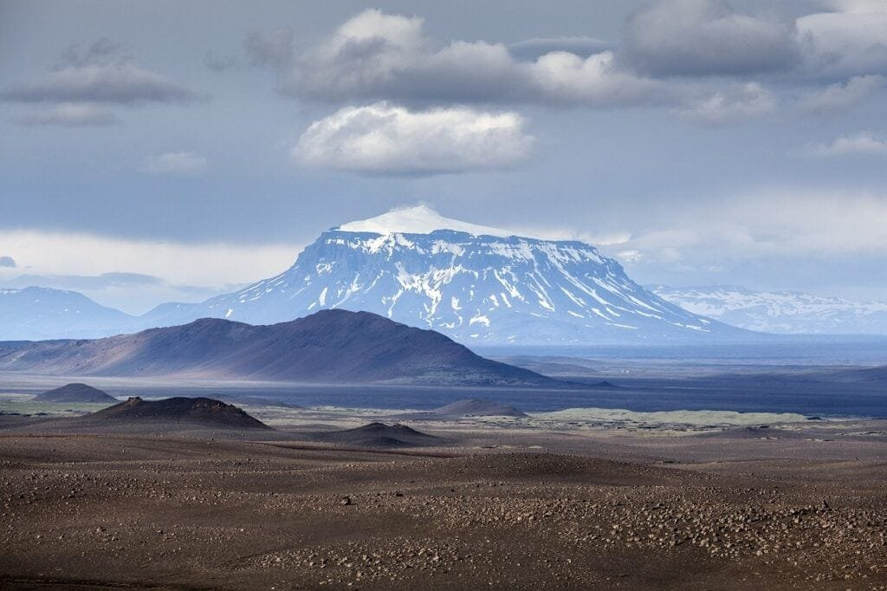
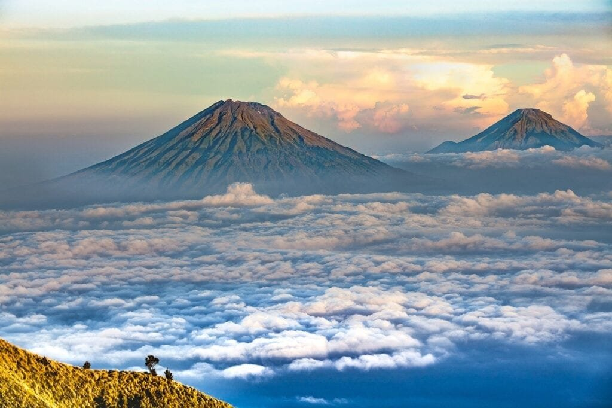

Volcanoes have always fascinated humans with their unpredictable and awe-inspiring eruptions. But understanding these natural marvels goes beyond mere curiosity; it is crucial for the safety and well-being of communities living in their vicinity. In this article, we will explore the fascinating world of volcanic eruptions and how predictive models are helping scientists anticipate future volcanic activity. From the diverse types of volcanoes and their geographic distribution to the causes of eruptions and the hazards they pose, we'll delve into the essential knowledge needed to comprehend the predictive models used in the field. So, get ready to embark on a journey through the fiery depths of volcanoes and discover how science is harnessing the power of data to predict and mitigate their potential devastation. Volcanic eruptions are natural phenomena that can have significant impacts on the surrounding areas. Predicting when and where these eruptions will occur is crucial for mitigating the potential risks and ensuring the safety of nearby communities. This article will provide an overview of the different predictive models used to understand volcanic activity and their accuracy, limitations, and challenges.

This image is property of pixabay.com.

## Understanding Volcanic Activity

Volcanic activity refers to the processes and events that occur within a volcano, including eruptions, gas emissions, and ground deformations. By studying these phenomena, scientists can gain insights into the behavior and characteristics of volcanoes, which is vital for predicting future volcanic activity.

### Measuring Volcanic Activity

To measure volcanic activity, scientists use various tools and techniques. One common method is monitoring seismic activities, which involves recording volcanic earthquakes and ground vibrations. Seismographs are installed around volcanoes to detect and analyze these seismic signals, providing valuable information about the movement of magma and potential eruptions.

Additionally, scientists track ground inflation and deformation, which can indicate the accumulation of magma beneath the surface. Through the use of GPS and satellite imagery, they can measure subtle changes in the volcano's shape and size, helping to identify periods of increased volcanic activity.

### Factors Influencing Volcanic Eruptions

Several factors influence volcanic eruptions, including the composition of magma, its viscosity, and the presence of gas. The composition of magma determines its behavior, with silica-rich magma being more explosive and silica-poor magma being less explosive. Viscosity, on the other hand, affects the flow of magma, with higher viscosity leading to more explosive eruptions.

Gas content is another critical factor. When magma contains high amounts of gas, such as water vapor, carbon dioxide, and sulfur dioxide, pressure builds up within the volcano, leading to potentially violent eruptions. Understanding these factors is essential for predicting the behavior and intensity of volcanic eruptions.

### Geographic Distribution of Volcanoes

Volcanoes are not evenly distributed across the Earth's surface but are concentrated in specific regions. The most well-known volcanic region is the "Ring of Fire," which encircles the Pacific Ocean. This area is highly active due to the convergence of several tectonic plates, resulting in frequent volcanic eruptions.

However, volcanoes can also be found in hotspots and rift zones. Hotspots are areas deep within the Earth where magma rises to the surface, often resulting in the formation of shield volcanoes like those in Hawaii. Rift zones, on the other hand, occur where tectonic plates are moving apart, allowing magma to reach the surface. Understanding the geographic distribution of volcanoes helps in assessing the potential risks and impacts of volcanic activity in different regions.

## Types of Volcanoes and Their Eruption Patterns

Volcanoes come in various forms, each with its own unique characteristics and eruption patterns. By studying these different types, scientists can develop a better understanding of how to predict their behavior.

### Shield Volcanoes

Shield volcanoes are formed by repeated eruptions of fluid lava, which flows down the sides of the volcano, gradually building up a broad, shield-like shape. These volcanoes have relatively gentle slopes and typically erupt non-explosively, with the lava flowing for long distances. Examples of shield volcanoes include Mauna Loa in Hawaii and Fernandina Island in the Galapagos.

### Composite Volcanoes

Composite volcanoes, also known as stratovolcanoes, are characterized by their steep slopes and symmetrical cone shape. They are formed by alternating layers of lava flows, pyroclastic deposits, and volcanic ash. Composite volcanoes are known for their explosive eruptions, which can produce dangerous volcanic ash clouds, pyroclastic flows, and lahars. Mount Fuji in Japan and Mount St. Helens in the United States are examples of composite volcanoes.

### Volcanic Domes

Volcanic domes, or lava domes, are formed by viscous lava that accumulates around the vent, creating a dome-shaped structure. These volcanoes are known for their slow, effusive eruptions, with the lava often oozing out of the vent and piling up around it. Volcanic domes can be found in various locations, including Mount Pelée in Martinique and Lassen Peak in California.

### Calderas

Calderas are large, basin-shaped depressions that are formed when a volcano collapses or experiences a catastrophic eruption. They can be several kilometers in diameter and are often associated with highly explosive eruptions. Examples of calderas include Yellowstone Caldera in the United States and Taal Caldera in the Philippines.

<iframe width="560" height="315" src="https://www.youtube.com/embed/jm8-FxCqyKQ" frameborder="0" allow="accelerometer; autoplay; encrypted-media; gyroscope; picture-in-picture" allowfullscreen></iframe>

  

## Potential Hazards and Benefits of Volcanic Eruptions

Volcanic eruptions can have both harmful and beneficial effects on the surrounding environment and communities. Understanding these hazards and benefits is crucial for protecting communities and minimizing the negative impacts.

### Risks of Volcanic Eruptions

Volcanic eruptions pose numerous risks to nearby communities, including the release of toxic gases, pyroclastic flows, lahars, and volcanic ash. Toxic gases, such as sulfur dioxide, can cause respiratory problems and have a detrimental impact on air quality. Pyroclastic flows, which are fast-moving clouds of hot gas and volcanic material, can destroy everything in their path, posing a significant threat to human life.

Lahars, or volcanic mudflows, are another hazardous consequence of volcanic eruptions. These viscous flows of water and volcanic debris can be triggered by heavy rainfall or the melting of ice and snow on the volcano's slopes. Lahars can destroy infrastructure, bury communities, and contaminate water sources.

Volcanic ash, consisting of fine particles of rock and glass, can be carried by winds over long distances. Ashfall can cause buildings to collapse, contaminate water supplies, and disrupt air travel. The ash can also have long-term effects on agriculture, damaging crops and reducing soil fertility.

### Positive Impact of Volcanic Eruptions on the Environment

While volcanic eruptions can be devastating, they also bring certain benefits to the environment. Volcanic ash is rich in nutrients and minerals, making it highly fertile. When deposited on the ground, ash can enhance soil fertility and promote the growth of vegetation. This is particularly beneficial in areas with nutrient-poor soils.

Volcanoes also release gases, such as carbon dioxide and water vapor, which can have positive effects on the atmosphere and climate. [Carbon dioxide released during volcanic](https://magmamatters.com/geothermal-energy-and-its-volcanic-origins/ "Geothermal Energy and Its Volcanic Origins") eruptions can be absorbed by plants through photosynthesis, helping to mitigate climate change. Additionally, volcanic aerosols can reflect sunlight back into space, leading to temporary cooling of the Earth's surface.

Understanding both the risks and benefits of volcanic eruptions is essential for developing strategies to minimize the negative impacts and harness the positive aspects of these natural phenomena.

## Predictive Models for Volcanic Activity: An Overview

Predictive models play a crucial role in understanding and predicting volcanic activity. These models utilize various techniques and data sources to forecast when and where volcanic eruptions are likely to occur. Developing accurate predictive models is essential for effective risk mitigation and disaster preparedness.

### Types of Predictive Models

There are several types of predictive models used in volcano prediction:

1. **Physics-based models**: These models use the laws of physics to simulate volcanic processes, such as magma ascent and eruption dynamics. Physics-based models require detailed knowledge of the volcano's characteristics and are often used to understand the underlying mechanisms of volcanic eruptions.
    
2. **Statistical models**: Statistical models analyze historical data to identify patterns and relationships between different variables and volcanic eruptions. These models can help predict the likelihood of future eruptions based on past volcanic activity.
    
3. **Machine learning models**: Machine learning algorithms analyze large volumes of data to identify patterns and make predictions. These models can be used to forecast volcanic activity based on a wide range of data sources, including seismic data, gas emissions, and ground deformation.
    

### Accuracy of Predictive Models

The accuracy of predictive models can vary depending on the type and availability of data, as well as the complexity of volcanic processes. Physics-based models, when calibrated with accurate data, can provide valuable insights into the behavior of specific volcanoes but may struggle to capture all the intricacies of volcanic activity.

Statistical models, on the other hand, rely on historical data and statistical analysis to make predictions. The accuracy of these models depends on the quality and completeness of the data used for analysis. Machine learning models can analyze vast amounts of data and identify subtle patterns that may not be apparent through traditional statistical methods.

While predictive models have improved over the years, accurately forecasting specific eruption dates and magnitudes remains a significant challenge due to the complex nature of volcanic processes.

### Limitations and Challenges of Predictive Models

Predicting volcanic eruptions is a difficult task due to the inherent uncertainties associated with volcanic processes. Factors such as the availability and quality of data, the complexity of volcanic systems, and the limitations of existing models pose significant challenges to accurate prediction.

One of the major limitations is the lack of comprehensive data on volcanic activity. Monitoring volcanoes often involves remote and hazardous locations, making it challenging to collect continuous and reliable data. Incomplete or outdated data can compromise the accuracy of predictive models and hinder the ability to make timely forecasts.

Additionally, the dynamic nature of volcanic systems and the involvement of various physical processes pose challenges for modeling and prediction. Volcanoes exhibit complex behaviors that can change rapidly, making it challenging to capture all the factors that contribute to volcanic eruptions accurately.

Another challenge is the need for interdisciplinary collaboration. Predicting volcanic eruptions requires expertise in various fields, including geology, seismology, geochemistry, and data analysis. Collaboration between scientists from different disciplines is crucial for developing comprehensive predictive models and improving their accuracy.

Despite these challenges, continuous advancements in data collection methods, modeling techniques, and computing power provide opportunities for improving the accuracy and reliability of volcanic prediction models.

This image is property of pixabay.com.

## Data Collection and Processing

Accurate and reliable data are essential for predicting volcanic activity. Scientists employ various methods and technologies to collect and process data, enabling them to monitor volcanoes and detect signs of potential eruptions.

### Collection of Geological Data

Geological data provides crucial information about a volcano's history, eruptive behavior, and underlying characteristics. Geologists conduct field surveys and collect rock samples and fossils to determine the composition and age of volcanic rocks. This data helps in understanding the volcanic processes and identifying potential hazards.

Geological mapping involves the creation of detailed maps that illustrate the distribution of volcanic deposits, lava flows, and other volcanic features. These maps are essential for assessing the extent of past eruptions and identifying areas prone to future volcanic activity.

### Recording Seismic Activities

Monitoring seismic activities is a key method for detecting volcanic unrest and potential eruptions. Seismic data is collected using seismographs, which record ground vibrations and volcanic earthquakes. These instruments can detect different types of seismic signals, including volcano-tectonic earthquakes, long-period earthquakes, and volcanic tremors.

Seismic data provides valuable insights into the movement of magma within a volcano. By analyzing the characteristics of volcanic earthquakes, scientists can determine the depth and location of magma reservoirs and monitor changes in volcanic activity over time.

### Tracking Ground Inflation and Deformation

Monitoring ground inflation and deformation helps scientists track the movement and accumulation of magma beneath the surface. This can be done using various techniques, including GPS (Global Positioning System) and satellite-based remote sensing.

By measuring the subtle changes in a volcano's shape and size, scientists can infer the movement and volume of magma. This data is essential for assessing the potential for future eruptions and understanding the dynamics of volcanic systems.

### Monitoring Gas Emissions

Volcanoes emit various gases, including water vapor, carbon dioxide, sulfur dioxide, and hydrogen sulfide. Monitoring gas emissions provides valuable information about the activity and behavior of a volcano.

Gas monitoring techniques include remote sensing using satellites, ground-based gas analyzers, and direct sampling of volcanic gases. By measuring the composition and flux of gases, scientists can assess the state of a volcano and predict potential eruptions. Changes in gas emissions, such as an increase in sulfur dioxide levels, can indicate an impending eruption.

## Statistical Techniques in Predicting Volcanic Activity

Statistical techniques play a crucial role in predicting volcanic eruptions. These techniques analyze historical data, identify patterns and trends, and make predictions based on statistical analysis. By understanding the relationships between different variables and volcanic eruptions, scientists can develop predictive models to forecast future volcanic activity.

### Multivariate Statistical Techniques

Multivariate statistical techniques analyze multiple variables simultaneously to identify correlations and patterns. These techniques help scientists understand the complex relationships between different factors and volcanic eruptions. By combining data from various sources, including seismic data, gas emissions, and ground deformation, multivariate statistical models can predict the likelihood of future eruptions.

Principal Component Analysis (PCA) is a commonly used multivariate statistical technique in volcano prediction. PCA reduces the dimensionality of a dataset by identifying the most important variables and their contribution to volcanic activity. This technique helps in identifying key factors that lead to volcanic eruptions and improving the accuracy of predictive models.

### Time-Series Analysis

Time-series analysis involves analyzing data collected over time to identify patterns and trends. This technique is particularly useful for studying volcanic activity, as volcanic processes often exhibit temporal variations. By analyzing historical data, scientists can identify regular patterns and fluctuations in volcanic activity and make predictions about future eruptions.

Time-series analysis techniques, such as autoregressive integrated moving average (ARIMA) models and exponential smoothing, are commonly used in volcano prediction. These models analyze the past behavior of volcanic activity and forecast future eruptions based on established patterns.

### Pattern Recognition

Pattern recognition techniques analyze complex datasets and identify patterns and relationships between different variables. These techniques can be used to detect anomalies and predict volcanic eruptions based on deviations from established patterns.

Machine learning algorithms, such as support vector machines (SVM) and artificial neural networks (ANN), are often employed for pattern recognition in volcano prediction. These algorithms can analyze large and diverse datasets, including seismic data, gas emissions, and ground deformation, and identify patterns that may not be apparent through traditional statistical methods.

Pattern recognition techniques can uncover subtle signals and patterns in volcanic activity, helping scientists make accurate predictions and improve the understanding of volcanic processes.

This image is property of pixabay.com.

## Machine Learning and Artificial Intelligence in Volcano Prediction

Machine learning and artificial intelligence (AI) techniques are revolutionizing volcano prediction by analyzing vast amounts of data and identifying complex patterns and relationships. These techniques can process diverse datasets and make accurate predictions, assisting scientists in forecasting volcanic eruptions.

### Machine Learning Algorithms for Volcano Prediction

Machine learning algorithms can analyze multiples sources of data, including seismic data, gas emissions, ground deformation, and historical eruption records. By identifying patterns and relationships between these variables, machine learning models can make predictions about future volcanic activity.

Some commonly used machine learning algorithms in volcano prediction include random forests, support vector machines, and artificial neural networks. These algorithms analyze large datasets and identify complex patterns that may not be apparent through traditional statistical methods.

### Role of Artificial Intelligence in Predicting Volcanic Eruptions

Artificial intelligence (AI) techniques, such as deep learning and neural networks, enable computers to learn from large datasets and make predictions based on the acquired knowledge. These techniques can analyze diverse and complex data, such as satellite images, seismic data, and gas emissions, to forecast volcanic eruptions.

AI-based models can process vast amounts of data in real-time and identify subtle patterns and trends. This capability allows scientists to make more accurate and timely predictions, improving the understanding of volcanic processes and enhancing the effectiveness of risk mitigation measures.

### Applications of Neural Networks in Volcano Analysis

Neural networks are a type of artificial intelligence technique inspired by the structure and function of the human brain. These networks consist of interconnected nodes, or neurons, that process and transmit information.

In volcano analysis, neural networks can be used to analyze seismic data and identify earthquake patterns associated with volcanic activity. By training neural networks with large datasets, scientists can develop models that accurately identify the signals and characteristics of volcanic earthquakes.

Neural networks can also analyze satellite images to detect changes in volcanic activity, such as ground deformation or gas emissions. These models can process large volumes of imagery data and identify subtle changes associated with volcanic unrest or imminent eruptions.

The application of machine learning and artificial intelligence techniques in volcano prediction holds great promise for improving the accuracy and effectiveness of eruption forecasts, ultimately leading to enhanced safety for communities living near active volcanoes.

## Case Studies of Successful Predictions

Several successful predictions of volcanic eruptions have demonstrated the potential of predictive models in mitigating the risks associated with volcanic activity. These case studies showcase the effectiveness of various techniques and methodologies in forecasting volcanic eruptions.

### Predicting the 1991 Pinatubo Eruption, Philippines

One notable success story in volcano prediction is the forecast of the 1991 eruption of Mount Pinatubo in the Philippines. Scientists from the Philippine Institute of Volcanology and Seismology (PHIVOLCS) noticed increasing unrest at the volcano during early 1991. They monitored seismic activities, ground deformation, and gas emissions, which indicated the movement and ascent of magma beneath the surface.

Based on their observations and analysis, the scientists accurately predicted that a major eruption would occur in the following months. This prediction led to the timely evacuation of thousands of people living near the volcano and saved countless lives. The eruption of Mount Pinatubo in June 1991 was one of the largest volcanic eruptions of the 20th century but resulted in minimal casualties due to the successful prediction and subsequent evacuation efforts.

### Successful Prediction of the 1985 Nevado del Ruiz Eruption, Colombia

Another notable case of successful volcano prediction is the eruption of Nevado del Ruiz in Colombia in 1985. Prior to the eruption, scientists from the Colombian Geological Survey (INGEOMINAS) noticed [increasing seismic activity and ground deformation at the volcano](https://magmamatters.com/the-art-and-science-of-volcano-monitoring/ "The Art and Science of Volcano Monitoring"). They also observed the formation of a volcanic dome, indicating the ascent of magma beneath the surface.

INGEOMINAS issued warnings and initiated evacuation measures, which led to the evacuation of approximately 25,000 people from the surrounding areas. Despite the eruption being highly explosive and producing deadly lahars, the timely evacuation efforts resulted in a significant reduction in casualties.

These case studies highlight the importance of accurate volcano prediction and the potential of predictive models in saving lives and minimizing the impacts of volcanic eruptions. By monitoring and analyzing various volcanic indicators, scientists can make informed predictions and implement necessary measures to mitigate risks.

## Implications of Successful Volcanic Predictive Models

Successful volcanic predictive models have significant implications for risk mitigation, emergency planning, and public awareness. These models provide valuable insights into the behavior of volcanoes and help in formulating effective policies and strategies to protect communities.

### Risk Mitigation

Accurate volcano prediction models enable authorities and emergency responders to implement timely measures to mitigate risks. By forecasting eruptions and identifying potential hazards, such as pyroclastic flows, lahars, or volcanic ash clouds, authorities can issue evacuation orders, establish exclusion zones, and develop emergency response plans.

The successful evacuation efforts in the cases of Mount Pinatubo and Nevado del Ruiz demonstrate how accurate predictions can save lives and reduce casualties. By utilizing predictive models, agencies and organizations can minimize the risks associated with volcanic eruptions and ensure the safety of affected communities.

### Emergency Evacuation and Planning

Volcano prediction models play a crucial role in emergency evacuation and planning. By accurately forecasting volcanic eruptions, authorities can initiate evacuation measures in a timely manner, ensuring the safety of residents living near active volcanoes.

Furthermore, predictive models help in developing comprehensive emergency response plans. These plans outline the necessary steps and procedures to be followed during a volcanic eruption, including the establishment of evacuation routes, the provision of emergency supplies, and the coordination of rescue and relief operations.

By incorporating predictive models into emergency planning, authorities can effectively respond to volcanic disasters and minimize the impact on affected communities.

### Policy Formulation and Public Awareness

Predictive models for volcanic activity provide vital information for policy formulation and public awareness campaigns. By understanding the behavior of volcanoes, policymakers can develop regulations and guidelines to minimize the risks associated with volcanic eruptions.

Public awareness campaigns play a crucial role in educating communities living near active volcanoes about the potential hazards and necessary precautions. Predictive models provide the scientific foundation for these campaigns, helping to inform the public about the signs of volcanic unrest, the importance of evacuation orders, and the necessary safety measures.

Incorporating predictive models into policymaking and public awareness initiatives enables communities to be better prepared for volcanic eruptions and reduces the potential impacts on lives and infrastructure.

## Future Directions in Volcanic Prediction Models

While predictive models for volcanic activity have made significant advancements, there are still several areas for improvement. Ongoing research and development efforts aim to enhance the accuracy and precision of these models, enabling better predictions and risk mitigation strategies.

### Inclusion of More Real-Time Data

The inclusion of real-time data in predictive models is crucial for improving their accuracy and responsiveness. Real-time data, such as continuous seismic recordings, GPS measurements, and gas emission monitoring, provides up-to-date information about volcanic unrest and potential eruptions.

Advancements in technology, such as remote sensing satellites and real-time monitoring networks, enable scientists to collect and analyze large volumes of data in near real-time. Incorporating this data into predictive models allows for more accurate and timely eruption forecasts, improving the ability to respond to volcanic activity swiftly.

### Integrated Multi-Method Predictive Models

Future volcanic prediction models are likely to include an integrated approach that combines multiple methods and techniques. By incorporating various data sources, such as seismic data, gas emissions, ground deformation, and satellite imagery, scientists can develop comprehensive models that capture the complex processes and interactions within volcanic systems.

An integrated multi-method approach allows for a more holistic understanding of volcanic activity, improving the accuracy and reliability of eruption forecasts. By combining the strengths of different techniques, scientists can overcome limitations and uncertainties associated with individual methods, leading to more robust predictive models.

### Improved Accuracy and Precision in Models

Enhancing the accuracy and precision of predictive models is an ongoing goal in volcano prediction research. This involves refining the algorithms and methodologies used in these models, as well as improving the quality and quantity of the data used for analysis.

Advancements in machine learning and artificial intelligence techniques offer opportunities for improving the accuracy of predictive models. These techniques can analyze complex and diverse datasets and identify subtle patterns and trends, leading to more accurate eruption forecasts.

Furthermore, the development of advanced remote sensing technologies and the integration of data from multiple sources can enhance the precision of volcano prediction models. High-resolution satellite imagery, ground-based sensors, and advanced analytical techniques provide detailed and accurate data about volcanic processes, helping scientists make more precise predictions.

By continuously improving the accuracy and precision of volcano prediction models, scientists can contribute to the safety and well-being of communities living near active volcanoes.

In conclusion, understanding volcanic activity and predicting volcanic eruptions is essential for mitigating the risks and ensuring the safety of nearby communities. Predictive models, including physics-based models, statistical models, machine learning models, and artificial intelligence, play a crucial role in this process. These models utilize various data sources and techniques to forecast volcanic activity and assist in developing effective risk mitigation strategies. Ongoing advancements in data collection methods, modeling techniques, and computing power offer opportunities for improving the accuracy and reliability of volcano prediction models. By studying the different [types of volcanoes](https://magmamatters.com/understanding-volcanic-formation-a-comprehensive-guide/ "Understanding Volcanic Formation: A Comprehensive Guide"), their eruption patterns, and the factors influencing volcanic activity, scientists can continue to enhance our understanding of these natural phenomena and protect communities from the potential hazards they pose.

