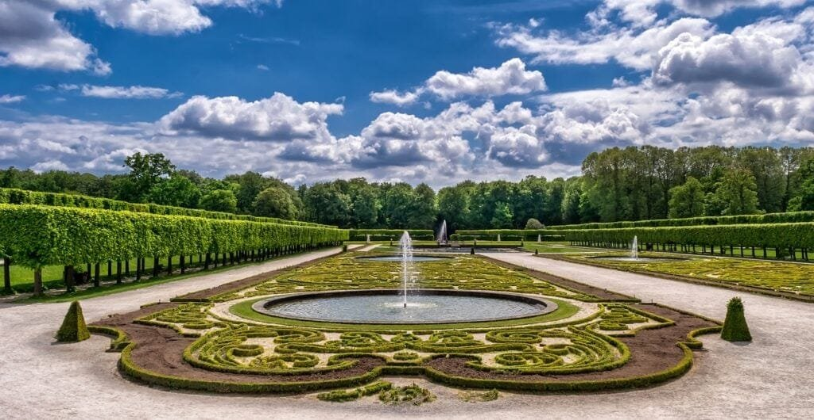
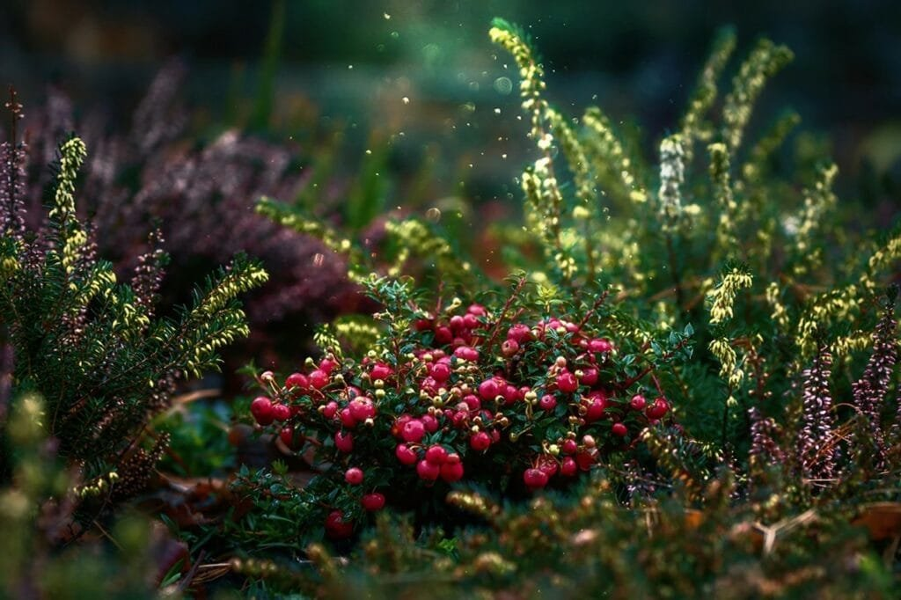

If you're looking to transform your garden into a stunning and unique space, incorporating volcanic rock landscaping may be just the thing for you. Volcanic rock, formed from eruptions of lava and ash, brings a touch of nature's raw beauty to your outdoor oasis. Not only does it add visual appeal with its rugged textures and rich colors, but it also provides numerous benefits to your plants and soil. By revamping your garden with volcanic rock landscaping, you can create a captivating and sustainable environment that will surely impress your friends and neighbors.

This image is property of pixabay.com.

## Understanding volcanic rock

### Definition and formation of volcanic rock

Volcanic rock, also known as igneous rock, is formed from molten lava that has cooled and solidified on or beneath the Earth's surface. When a volcano erupts, the fiery lava flows out and eventually cools down, turning into volcanic rock. This process can take thousands of years, as the lava slowly hardens and crystallizes.

### Types of volcanic rock: basalt, pumice, and more

There are various types of volcanic rock, each with its own unique characteristics and uses in landscaping. Basalt is one of the most common types, known for its dark color and dense composition. Pumice, on the other hand, is a light and porous volcanic rock that is often used as a soil amendment. Other types include obsidian, andesite, and rhyolite, each with its own distinct appearance and properties.

### Geographical distribution of volcanic rock

Volcanic rock can be found in areas with a history of volcanic activity. Some regions known for their abundance of volcanic rock include the Pacific Northwest in the United States, the Canary Islands in Spain, and the Kamchatka Peninsula in Russia. These areas are home to numerous [volcanoes and have a rich geological history of volcanic](https://magmamatters.com/geothermal-energy-and-its-volcanic-origins/ "Geothermal Energy and Its Volcanic Origins") activity.

### Unique features of volcanic rock

One of the unique features of volcanic rock is its texture and appearance. Depending on the specific type of volcanic rock, it can range from smooth and glassy to rough and jagged. This variety in texture allows for creative and aesthetically pleasing landscaping designs. Additionally, volcanic rock is known for its durability and resistance to weathering, making it a long-lasting choice for outdoor projects.

## Benefits of volcanic rock in landscaping

### Improved soil fertility

Volcanic rock contains minerals and trace elements that are beneficial for soil fertility. When volcanic rock weathers and breaks down over time, it releases these nutrients into the soil, enriching it and making it more fertile. This is especially beneficial for gardens and agricultural areas, as it provides a [natural](https://magmamatters.com/the-art-and-science-of-volcano-monitoring/ "The Art and Science of Volcano Monitoring") source of plant nutrients.

### Boost to plant health

The minerals present in volcanic rock can have a positive impact on plant health. They help to improve nutrient uptake, strengthen root systems, and promote overall plant growth. Additionally, volcanic rock can help to regulate soil pH levels, creating a more favorable environment for plants to thrive.

### Enhanced water conservation

Volcanic rock, particularly pumice, has excellent water retention properties. It can absorb and retain moisture, reducing the need for frequent watering. This is especially advantageous in dry or arid climates, where water conservation is crucial. The porous nature of volcanic rock also allows for better drainage, preventing waterlogged soil and reducing the risk of root rot.

### Natural mulching benefits

Using volcanic rock as mulch in landscaping offers several benefits. It helps to suppress weeds, reduce soil erosion, and regulate soil temperature. The presence of volcanic rock mulch also helps to retain soil moisture, reducing the frequency of watering. Additionally, volcanic rock mulch can add visual interest and texture to garden beds, enhancing the overall aesthetic appeal of the landscape.

<iframe width="560" height="315" src="https://www.youtube.com/embed/qgPtWXfRsII" frameborder="0" allow="accelerometer; autoplay; encrypted-media; gyroscope; picture-in-picture" allowfullscreen></iframe>

  

## Buying volcanic rock for landscaping

### Where to buy volcanic rock

Volcanic rock can be purchased from a variety of sources, including local nurseries, garden centers, and landscaping supply stores. Online retailers also offer a wide selection of volcanic rock products, making it convenient to order from the comfort of your own home. It is important to research and compare different suppliers to ensure you are getting high-quality volcanic rock at a reasonable price.

### Understanding different grades and sizes of volcanic rock

Volcanic rock is available in different grades and sizes to suit various landscaping needs. The grade refers to the quality and consistency of the rock, with higher-grade volcanic rock often being more durable and aesthetically pleasing. In terms of size, volcanic rock can range from small pebbles to larger boulders. The choice of grade and size will depend on the specific application and desired aesthetic outcome.

### Cost of volcanic rock

The cost of volcanic rock can vary depending on factors such as the type, grade, and quantity needed. Generally, volcanic rock is an affordable landscaping material compared to other options. The price may also vary depending on your location and the availability of volcanic rock in your area. It is recommended to obtain quotes from different suppliers and consider factors such as shipping costs when budgeting for volcanic rock.

## Steps to incorporating volcanic rock into your garden

### Site preparation and soil testing

Before incorporating volcanic rock into your garden, it is important to properly prepare the site and assess the soil conditions. Clear the area of any existing plants, debris, or weeds. Conduct a soil test to determine the pH level and nutrient content of the soil. This will help you assess whether any amendments are needed to create an optimal growing environment for your plants.

### Choosing the right volcanic rock for your needs

Consider the specific requirements of your landscaping project when choosing volcanic rock. Determine the desired size, shape, and color of the rocks based on your aesthetic preferences. If you are using volcanic rock for specific purposes such as water features or mulching, select the appropriate type of volcanic rock with the desired characteristics for that application.

### Placement and design strategies with volcanic rocks

When incorporating volcanic rock into your garden, consider how it will be placed and arranged to achieve the desired aesthetic and functional outcome. Use volcanic rock strategically to create focal points, border edges, or pathways. Take into account the color and texture of the rocks to create visual interest and contrast with surrounding plants or elements. Experiment with different placement and design strategies to find what works best for your unique garden.

This image is property of pixabay.com.

## Creating a volcanic rock garden

### Benefits of a volcanic rock garden

A volcanic rock garden offers a range of benefits for both the gardener and the garden itself. The use of volcanic rock can add visual interest and texture to the landscape, creating a unique and naturalistic feel. Additionally, volcanic rock helps to retain soil moisture, reduce weed growth, and regulate soil temperature. This can result in less maintenance and healthier, more vibrant plants.

### Designing your volcanic rock garden

When designing a volcanic rock garden, take into consideration factors such as the size and shape of the area, the desired aesthetic, and the plants that will be incorporated. Use different sizes and shapes of volcanic rock to create texture and contrast. Consider the overall theme or style of the garden and select plants that complement the volcanic rock landscape.

### Choosing plants for a volcanic rock garden

When selecting plants for a volcanic rock garden, it is important to choose species that are well-suited to the conditions and soil composition. Many plants thrive in well-drained soil, making them a good choice for volcanic rock landscapes. Drought-tolerant plants that can withstand periods of dryness are also suitable. Research different plant options and consider factors such as sunlight requirements, water needs, and overall growth habits.

### Maintaining a volcanic rock garden

Maintaining a volcanic rock garden is relatively low-maintenance compared to traditional gardens. Regularly inspect the landscape for any weeds that may have emerged and remove them promptly to prevent competition with desired plants. Monitor soil moisture levels and water as necessary, taking into account the water retention properties of the volcanic rock. Prune plants as needed and fertilize according to individual plant requirements.

## Volcanic rock as a mulch alternative

### Benefits of volcanic rock as mulch

Using volcanic rock as mulch offers several advantages over traditional organic mulch materials. Volcanic rock does not break down or decompose over time, eliminating the need for frequent mulch replacement. It also helps to suppress weed growth by acting as a physical barrier, reducing the need for herbicides. Additionally, volcanic rock mulch does not attract pests or harbor fungal diseases, promoting a healthier and cleaner garden environment.

### How to use volcanic rock as mulch

To use volcanic rock as mulch, first prepare the area by removing any existing weeds or debris. Apply a layer of weed barrier fabric or landscape fabric to prevent weed growth. Spread a layer of volcanic rock mulch evenly over the desired area, ensuring a thickness of at least 2 to 3 inches. Avoid piling the mulch directly against plant stems or trunks, as this can lead to moisture retention and potential rot.

### Tips for maintaining volcanic rock mulch

Maintaining volcanic rock mulch is relatively simple. Periodically inspect the mulch for any signs of weed growth and remove any weeds as soon as they appear. Rake the mulch occasionally to ensure even coverage and to prevent compaction. If necessary, top up the mulch layer to maintain the desired thickness. Avoid using leaf blowers or high-pressure sprayers as they can dislodge the volcanic rock and create a messy appearance.

This image is property of pixabay.com.

## Volcanic rock in water features

### Adding a new dimension to ponds and waterfalls

Volcanic rock can add a unique and naturalistic touch to water features such as ponds and waterfalls. The rugged texture and porous nature of volcanic rock create a visually striking contrast with the flowing water. Use volcanic rock strategically to create interesting shapes, textures, and levels within the water feature. This can enhance the overall aesthetic appeal and create a more captivating and dynamic focal point in your garden.

### Enhancing aquatic plant health

Aquatic plants in ponds or water features can benefit from the presence of volcanic rock. The porous nature of volcanic rock allows for better oxygen exchange between the water and the plant roots, promoting healthy growth. Additionally, the minerals and trace elements present in volcanic rock can provide essential nutrients for aquatic plants. Consider incorporating volcanic rock into the substrate or planting areas of your water feature for improved plant health.

### Maintaining water clarity

Volcanic rock can also play a role in maintaining water clarity in ponds and water features. The porous structure of volcanic rock helps to trap and filter debris and sediment, preventing it from clouding the water. This can result in clearer water and a more visually appealing water feature. Regularly inspect the volcanic rock for any buildup of debris or algae and clean as necessary to maintain optimal water clarity.

## Using volcanic rock in potted plants

### Benefits for potted plant health

Using volcanic rock in potted plants can provide several benefits for their overall health and well-being. The porous nature of volcanic rock helps to improve drainage, preventing waterlogged soil and reducing the risk of root rot. The presence of volcanic rock in the potting mix also promotes aeration, allowing roots to breathe and thrive. Additionally, volcanic rock can help to regulate soil pH levels, creating a more suitable growing environment for potted plants.

### Choosing the correct volcanic rock for potted plants

When selecting volcanic rock for potted plants, choose a size that is suitable for the container and the plant's root system. Smaller volcanic rock particles are ideal for smaller pots, while larger rocks can be used in larger containers. Consider the water requirements of the specific plant and the watering habits of the gardener when choosing the appropriate volcanic rock.

### Caring for volcanic rock in potted plants

To care for volcanic rock in potted plants, ensure that the rocks are evenly distributed throughout the potting mix, allowing for good drainage. Check the moisture levels regularly to prevent overwatering or underwatering, as the porous nature of volcanic rock can affect watering needs. Monitor the plant for any signs of stress or nutrient deficiencies and adjust the care regimen as necessary.

## Safety considerations when using volcanic rock

### Dealing with sharp edges

Some types of volcanic rock can have sharp edges, which can pose a potential safety risk. When handling or placing volcanic rock, it is important to exercise caution to prevent cuts or injuries. Wear protective gloves and eyewear when working with volcanic rock, and be mindful of any sharp edges. If necessary, use a file or grinder to smooth any particularly sharp edges before incorporating the rock into your landscaping.

### Preventing slipping and falling

The rough and uneven texture of volcanic rock can create a potential slipping hazard, particularly when wet. To prevent accidents, ensure that areas with volcanic rock are properly designed and maintained. Create clear pathways and steps, using non-slip materials such as gravel or sand in high-traffic areas. Regularly inspect the volcanic rock for any loose or unstable pieces and secure them as needed.

### Mitigating dust and respiratory concerns

Volcanic rock can generate dust particles, which may cause respiratory irritation when inhaled. When working with or around volcanic rock, it is recommended to wear a dust mask or respirator to protect your lungs. If you have underlying respiratory conditions, it is advisable to limit your exposure to volcanic rock dust. Minimize dust by wetting down the volcanic rock before handling or moving it, and avoid creating unnecessary dust clouds.

## Caring for your volcanic rock landscape

### Cleaning and maintaining volcanic rock

To keep your volcanic rock landscape looking its best, regular cleaning and maintenance are essential. Remove any debris or organic matter that may accumulate on the rocks, as this can detract from the overall appearance. Use a broom or leaf blower to sweep away leaves, dirt, or other loose materials. Occasionally rinse the rocks with water to remove any stubborn dirt or stains.

### Addressing shifts and settling over time

Over time, volcanic rock may shift or settle due to natural forces such as erosion or expansion and contraction of the soil. Periodically inspect your volcanic rock landscape for any signs of movement or displacement. If necessary, reposition or replace rocks to maintain the desired aesthetic and functional outcome. Consider using edging materials or retaining walls to help stabilize the volcanic rock and prevent shifting.

### Keeping your landscape vibrant and healthy

Regular maintenance of your volcanic rock landscape is key to keeping it vibrant and healthy. Monitor the health of plants growing near or around the volcanic rock and address any issues promptly. Prune plants as needed to maintain their shape and prevent overgrowth. Keep the area free from weeds, as they can compete with plants for nutrients and water. With proper care and attention, your volcanic rock landscape will continue to thrive and provide years of enjoyment.

