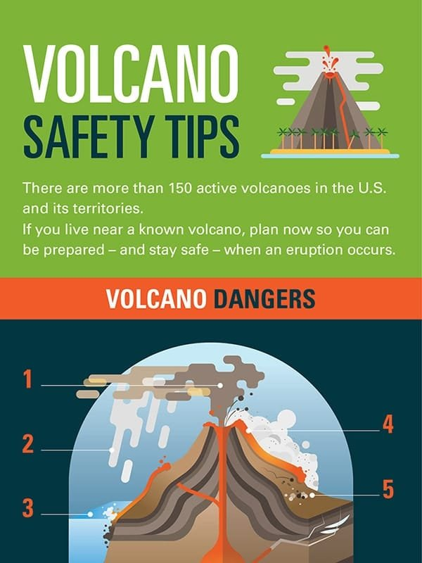
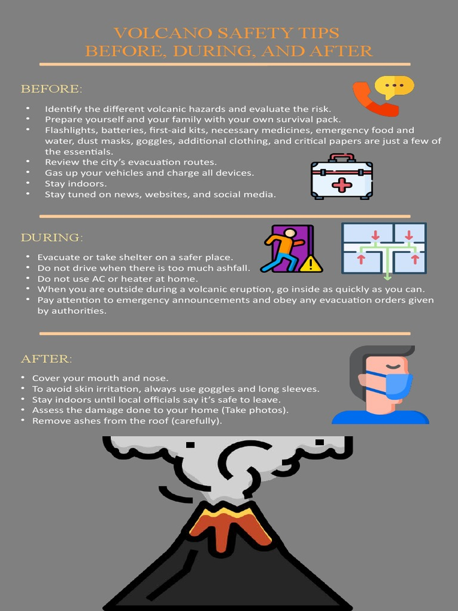
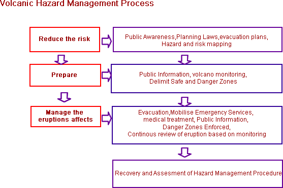
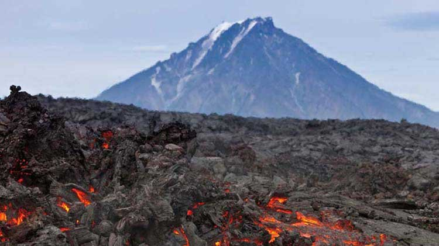

Imagine standing at the edge of a magnificent volcano, its towering presence commanding your attention. As beautiful and awe-inspiring as it may be, there's no denying the inherent risks that come with such a powerful marvel of nature. From the relentless flow of lava to the toxic gases that fill the air, managing volcanic risks is crucial for the safety and well-being of nearby communities. In this article, we will explore seven essential tips that can help mitigate these risks and prepare for any potential volcanic activity. So, let's dive in and uncover the key strategies you need to know to protect yourself and others in the face of an eruption.

  

## Understanding The Different Types of Volcanoes

### Identification of common types of volcanoes

Volcanoes come in various shapes and sizes, but they can be broadly categorized into four main types: shield volcanoes, stratovolcanoes, cinder cones, and composite volcanoes. Shield volcanoes are characterized by their broad, gently sloping sides and are formed by the eruption of low-viscosity lava. Stratovolcanoes, on the other hand, are tall and conical, with steep sides, and are built by layers of ash, lava, and volcanic debris. Cinder cones are smaller and simpler in structure, with steep sides and a bowl-shaped crater, typically formed by the explosive eruption of gas-rich magma. Composite volcanoes, also known as composite cones or stratovolcanoes, are the most picturesque and are a combination of the other types, with alternating layers of lava and pyroclastic material.

### Unique features and risks associated with each type

Each type of volcano has its own distinct features and associated risks. Shield volcanoes, due to their low-viscosity lava, have eruptions that are relatively non-explosive and result in the slow, steady flow of lava. However, they can still pose risks to nearby communities, as the lava can cover large areas and destroy infrastructure. Stratovolcanoes, on the other hand, are known for their explosive eruptions, characterized by the ejection of pyroclastic material, ash, and gases. These eruptions can lead to lahars, volcanic avalanches, and pyroclastic flows, which pose a significant threat to both human life and property. Cinder cones, while generally smaller in size, can still be hazardous, as their [eruptions can produce ash clouds and pyroclastic flows](https://magmamatters.com/the-environmental-impact-of-volcanic-eruptions-2/ "The Environmental Impact of Volcanic Eruptions"). Composite volcanoes, being a combination of the other types, can exhibit a range of hazards, from explosive eruptions to lava flows, posing risks to both the immediate vicinity and areas further away.

### Geographical distribution of the various types of volcanoes

Volcanoes can be found all over the world, but their distribution is not uniform. Certain regions, such as the Pacific Ring of Fire, have a higher concentration of volcanoes due to their location along major tectonic plate boundaries. The Pacific Ring of Fire is notorious for its numerous active volcanoes and frequent volcanic eruptions. Other regions with a significant number of volcanoes include the Mediterranean, Central and South America, and parts of East Africa. Shield volcanoes, like those in Hawaii, are often found in hot spot regions where molten material rises from deep within the Earth's mantle. Stratovolcanoes can be found in various tectonic settings, including subduction zones, where one tectonic plate is forced beneath another. Cinder cones can be found in diverse volcanic environments, while composite [volcanoes tend to occur in areas with complex geological](https://magmamatters.com/geothermal-energy-and-its-volcanic-origins/ "Geothermal Energy and Its Volcanic Origins") histories.

## Educating Yourself and Others About Volcanic Activities And Risks

### The importance of regular education and training

Education and training play a crucial role in understanding volcanic activities and associated risks. By educating yourself and others, you can become familiar with the signs of potential eruptions, learn about the various hazards, and develop the necessary skills to respond effectively during volcanic crises. Regular education and training programs ensure that communities are well-prepared and equipped to mitigate the risks posed by volcanoes. This includes providing information on evacuation procedures, emergency communication protocols, and the importance of being aware of local volcano observatories and their monitoring systems.

### Learning signs of potential eruptions

Recognizing the signs of potential volcanic eruptions is essential for early detection and warning systems. These signs may include [increased seismic activity](https://magmamatters.com/the-art-and-science-of-volcano-monitoring/ "The Art and Science of Volcano Monitoring"), ground deformation, changes in gas emissions, and anomalous behavior of volcanic lakes. By learning to identify these signs, you can take proactive measures to enhance the safety and preparedness of your community. It is crucial to stay informed through reliable sources, such as local volcano observatories or official government agencies, that provide updates on volcanic activities and their potential impacts.

### Understanding the effects of ash and gas emissions

Volcanic eruptions can release significant amounts of ash and gases into the atmosphere. Ash clouds can travel long distances and pose a considerable risk to aviation, as they can damage aircraft engines and reduce visibility. Inhaling volcanic ash can also be detrimental to human health, causing respiratory problems and eye irritation. It is important to understand the effects of ash and gas emissions in order to implement appropriate mitigation measures. This includes wearing protective masks in areas affected by ashfall, following public health advisories, and seeking shelter in designated safe zones during eruptions.

This image is property of quickresource.quickseries.com.

## Regular Monitoring of Active Volcanoes

### The role of volcano observatories

Volcano observatories play a crucial role in monitoring active volcanoes and providing timely information about volcanic activities. These institutions use a combination of tools and techniques, such as seismometers, gas sensors, and satellite imagery, to detect changes in volcanic behavior. By actively monitoring volcanoes, observatories can issue warnings and alerts, allowing communities to prepare for potential eruptions and take appropriate action. It is important to stay informed through the official communications channels of volcano observatories to ensure you receive accurate and up-to-date information.

### What triggers eruptions

Volcanic eruptions can be triggered by various factors, and understanding these triggers is essential for predicting volcanic activity. The most common trigger is the movement of tectonic plates, which can result in the release of magma from the Earth's mantle. Other triggers may include changes in pressure within the magma chamber, the influx of water into the volcano's system, or the interaction between molten rock and gas. By studying these triggers, scientists can better forecast when volcanic eruptions are likely to occur and provide early warnings to at-risk communities.

### The use of technology in volcano monitoring

Advances in technology have greatly enhanced volcano monitoring capabilities. Remote sensing techniques, such as satellite imagery and infrared cameras, allow scientists to detect changes in temperature, gas emissions, and volcanic plumes from a safe distance. Ground-based monitoring equipment, such as seismometers and GPS receivers, provides real-time data on seismic activity and ground deformation. These technological advancements enable scientists to continuously monitor volcanoes and make more accurate predictions about future eruptions, helping communities prepare and respond effectively to volcanic hazards.

## Having a Risk Management Plan

### Designing disaster preparedness measures

Having a comprehensive risk management plan is crucial for minimizing the impact of volcanic eruptions on communities. Such a plan should include measures for disaster preparedness, such as establishing early warning systems, conducting evacuation drills, and providing training in emergency response procedures. It is important to involve community members, local authorities, and relevant stakeholders in the development and implementation of the plan to ensure its effectiveness. Regular updates and revisions to the plan based on lessons learned from past volcanic events are also essential to keep it up to date and relevant.

### Regular testing of the plan

A risk management plan is only effective if it is regularly tested and evaluated. Conducting drills and simulations allows communities to practice their response to volcanic emergencies and identify any gaps or areas for improvement. By testing the plan in a controlled environment, emergency responders can assess their readiness and ensure that communication, coordination, and evacuation procedures are functioning smoothly. Regular testing also helps to familiarize community members with the plan and increases their confidence in their ability to respond effectively during a volcanic crisis.

### Evacuation routes and procedures

Establishing clear evacuation routes and procedures is vital for ensuring the safe and efficient movement of people during a volcanic eruption. These routes should be well-marked and easily accessible, taking into account the topography and potential hazards of the area. Additionally, evacuation plans should consider the needs of vulnerable populations, such as the elderly, children, and individuals with disabilities. Regular drills and communication campaigns can help to educate community members about evacuation procedures and ensure that they are prepared to evacuate if necessary.

This image is property of imgv2-1-f.scribdassets.com.

## Implementing Land Use Policies

### Establishing restricted zones around active volcanoes

Establishing restricted zones around active volcanoes is an important land use policy to protect the safety of communities. These zones, also known as exclusion or danger zones, are areas where the risk of volcanic hazards is high and access is restricted. The size of these zones depends on the potential hazards associated with each volcano and can vary from a few kilometers to tens of kilometers. By restricting access to these areas, the likelihood of human casualties and property damage during eruptions can be significantly reduced.

### Land planning and infrastructure placement in volcano-prone areas

Careful land planning and infrastructure placement are crucial in volcano-prone areas to minimize the risks associated with volcanic eruptions. This involves assessing the potential hazards, such as pyroclastic flows, lahars, and volcanic ashfall, and incorporating this information into land-use decisions. Critical infrastructure, such as hospitals, schools, and emergency shelters, should be located in safe zones outside of the high-risk areas. Additionally, building codes should be enforced to ensure that structures are designed and constructed to withstand volcanic hazards, such as ash deposition, ground shaking, and volcanic gases.

### The role of government agencies in regulating land use

Government agencies play a vital role in regulating land use in volcano-prone areas to ensure the safety and well-being of communities. These agencies are responsible for developing and enforcing land-use policies that take into account the risks associated with volcanic eruptions. They collaborate with scientists, local authorities, and community stakeholders to identify high-risk areas, establish restricted zones, and promote safe land planning practices. By implementing and enforcing these regulations, government agencies can reduce the potential impact of volcanic hazards and protect lives and infrastructure.

## Building Volcano-Resistant Structures

### The importance of adhering to building codes in volcanic regions

Adhering to building codes specifically designed for volcanic regions is essential for constructing structures that can withstand the hazards associated with volcanic eruptions. These building codes consider factors such as volcanic ashfall, ground shaking, and volcanic gas emissions. They provide guidelines for the design and construction of buildings, infrastructure, and critical facilities to ensure their resilience against volcanic hazards. By following these codes, architects, engineers, and builders can contribute to the creation of volcano-resistant structures that are more likely to withstand volcanic events and protect human lives.

### Innovation in constructing lava and ash resistant structures

Innovations in construction materials and techniques have led to the development of structures that are more resistant to lava and ash. For example, the use of reinforced concrete and steel reinforcements can improve the structural integrity of buildings in volcanic regions. Additionally, incorporating volcanic ash-resistant coatings on surfaces can prevent the accumulation of ash and facilitate easier cleaning after an eruption. These innovations, coupled with the proper implementation of building codes, can significantly enhance the resilience of structures to volcanic hazards.

### Investment in volcano-resistant infrastructure

Investing in volcano-resistant infrastructure is essential for reducing the risks associated with volcanic eruptions. This includes the construction and maintenance of roads, bridges, utility systems, and other critical infrastructure that are designed to withstand volcanic hazards. Governments and communities should allocate the necessary resources to upgrade existing infrastructure and build new infrastructure that is resilient to volcanic events. By investing in volcano-resistant infrastructure, the potential for damage and disruption caused by volcanic eruptions can be minimized, improving the overall resilience of communities.

This image is property of www.explorevolcanoes.com.

## Ensuring Community Resilience

### Engaging community members in risk reduction programs

Engaging community members in risk reduction programs is crucial for building resilience to volcanic hazards. It is important to foster a sense of community, where individuals are aware of the risks they face and actively contribute to reducing these risks. This can be achieved through community education programs, awareness campaigns, and the involvement of local leaders and organizations. By empowering community members to actively participate in risk reduction efforts, communities can become more resilient and better prepared to handle volcanic emergencies.

### Strengthening community-based organizations in disaster management

Community-based organizations play a key role in disaster management, including volcanic emergencies. These organizations have a deep understanding of the local context and can effectively mobilize resources and coordinate response efforts. Strengthening community-based organizations through training, capacity-building initiatives, and collaboration with government agencies can enhance their ability to respond to volcanic hazards. By working together, these organizations can ensure a more coordinated and efficient response, leading to improved community resilience.

### Promoting mental health and psychosocial support after eruptions

Volcanic eruptions can have a significant impact on the mental health and well-being of affected individuals and communities. Displacement, loss of property, and the trauma associated with witnessing the destruction caused by eruptions can lead to emotional distress and psychological challenges. It is important to provide psychosocial support to those affected by volcanic emergencies, including counseling services, community support groups, and mental health interventions. Promoting mental health and providing psychosocial support can aid in the recovery process and contribute to the overall resilience of communities.

## Making Use of Early Warning Systems

### Importance of early detection and warning of volcanic activity

Early detection and warning of volcanic activity are critical for mitigating the risks associated with eruptions. Early warning systems can provide valuable information about changes in volcanic behavior, allowing communities to take necessary precautions and evacuate if needed. Timely warnings can save lives, reduce the impact on infrastructure, and facilitate the effective coordination of response efforts. It is essential to have robust early warning systems in place, supported by reliable monitoring networks and effective communication channels, to ensure that communities have sufficient time to prepare and respond to volcanic emergencies.

### How to respond to early warning signals

When early warning signals indicate an imminent volcanic eruption, it is important to respond promptly and follow the instructions provided by local authorities and volcano observatories. This may involve evacuating to designated safe areas, securing valuable possessions, and ensuring the safety of vulnerable individuals, such as children, the elderly, and individuals with disabilities. It is crucial to have a pre-determined emergency plan in place and to familiarize yourself and your family with the response procedures. By responding appropriately to early warning signals, you can minimize the risks posed by volcanic eruptions and protect the well-being of yourself and your community.

### Types of early warning systems and their efficacy

Several types of early warning systems can be used to detect and monitor volcanic activity. These may include seismic monitoring networks, gas monitoring stations, observation of ground deformation, thermal imaging, and satellite-based monitoring. Each system has its own advantages and limitations, and a combination of these technologies is usually employed for a more comprehensive monitoring approach. The effectiveness of early warning systems depends on the reliability of the monitoring equipment, the accuracy of data interpretation, and the efficiency of communication mechanisms. Continuous improvement and investment in early warning systems are necessary to enhance their efficacy and ensure timely and accurate warnings.

This image is property of www.statefarm.com.

## Managing Volcanic Ash Emissions

### Protecting infrastructure from ash fall

Volcanic ash can pose a significant risk to infrastructure, particularly buildings, transportation systems, and power supply networks. The abrasive nature of ash particles can cause damage to surfaces, clog ventilation systems, and interfere with the functioning of mechanical equipment. Protecting infrastructure from ash fall involves implementing preventive measures, such as covering equipment and sealing buildings, to minimize the ingress of ash into sensitive areas. Regular maintenance and cleaning of infrastructure are also crucial to prevent the build-up of ash and maintain their functionality.

### Coping mechanisms for airborne volcanic ash

When volcanic eruptions produce airborne ash, it is important to have coping mechanisms in place to protect human health and well-being. This may involve wearing appropriate respiratory protection, such as masks or respirators, to prevent inhalation of ash particles. It is also important to stay indoors during ashfall episodes and ensure that buildings have proper filtration systems to minimize the entry of ash. Additionally, practicing good hygiene, such as frequent handwashing, can help reduce the risk of skin and eye irritation from contact with ash particles.

### Public health advisories concerning ash inhalation

Public health advisories play a crucial role in disseminating information about the potential health risks associated with volcanic ash inhalation. These advisories provide guidance on how to protect oneself from ash exposure, including the use of respiratory protection, avoidance of outdoor activities during ashfall, and seeking medical attention in case of symptoms such as coughing, difficulty breathing, or eye irritation. It is important to stay informed about public health advisories issued by local authorities and follow their recommendations to minimize the health impact of volcanic ash emissions.

## Investing in Technology And Research

### Importance of investing in volcano research and studies

Investing in volcano research and studies is key to advancing our understanding of volcanic processes and improving risk management strategies. Research helps scientists and experts gain insights into the behavior of volcanoes, enabling more accurate predictions of eruptions and better identification of potential hazards. By investing in research, governments, institutions, and organizations contribute to the development of innovative technologies, data collection methods, and modeling techniques that support effective volcanic risk management. Continued investment in volcano research is essential for ensuring the safety and well-being of communities living in volcanic regions.

### Technological advancements in volcanic activities prediction

Technological advancements have significantly improved the prediction of volcanic activities. The development of sophisticated monitoring techniques, such as satellite-based remote sensing and advanced seismic networks, has enabled scientists to detect subtle changes in volcanic behavior. High-resolution imagery, data analysis algorithms, and machine learning techniques are also being employed to improve the accuracy of eruption forecasts. With the ongoing advancements in technology, scientists are better equipped to monitor and interpret volcanic signals, resulting in more reliable predictions of volcanic activities and enhanced risk management strategies.

### Contribution of scientific discoveries to risk management strategies

Scientific discoveries play a vital role in shaping risk management strategies for volcanic hazards. Through research and studies, scientists have identified new eruption triggers, refined eruption forecasting models, and discovered previously unknown volcanic hazards. These scientific insights provide the foundation for risk assessment and the development of mitigation measures. Scientists work closely with government agencies, volcano observatories, and communities to translate their findings into practical risk management strategies. By incorporating scientific discoveries into risk management, communities can be better prepared and equipped to face the challenges posed by volcanic eruptions.

In conclusion, [understanding the different types of volcanoes](https://magmamatters.com/understanding-volcanic-formation-a-comprehensive-guide/ "Understanding Volcanic Formation: A Comprehensive Guide"), educating yourself and others about volcanic activities and risks, regular monitoring, having a risk management plan, implementing land use policies, constructing volcano-resistant structures, ensuring community resilience, making use of early warning systems, managing volcanic ash emissions, and investing in technology and research are essential for mitigating the risks associated with volcanic eruptions. By adopting a comprehensive and proactive approach, communities can enhance their resilience and minimize the impact of volcanic hazards, safeguarding both lives and infrastructure.

Related Posts: [Mitigating Risks: Forecasting Volcanic Activity in Prone Areas](https://magmamatters.com/mitigating-risks-forecasting-volcanic-activity-in-prone-areas/), [The Formation and Eruption Patterns of Volcanoes](https://magmamatters.com/the-formation-and-eruption-patterns-of-volcanoes-4/), [The Pyroclastic Phenomena of Pompeii: 7 Insights to Explore](https://magmamatters.com/the-pyroclastic-phenomena-of-pompeii-7-insights-to-explore/), [Tips for Capturing Volcano Pyroclastic Flow Photos](https://magmamatters.com/tips-for-capturing-volcano-pyroclastic-flow-photos/), [Understanding Volcanoes and Their Eruption Patterns](https://magmamatters.com/understanding-volcanoes-and-their-eruption-patterns/)
