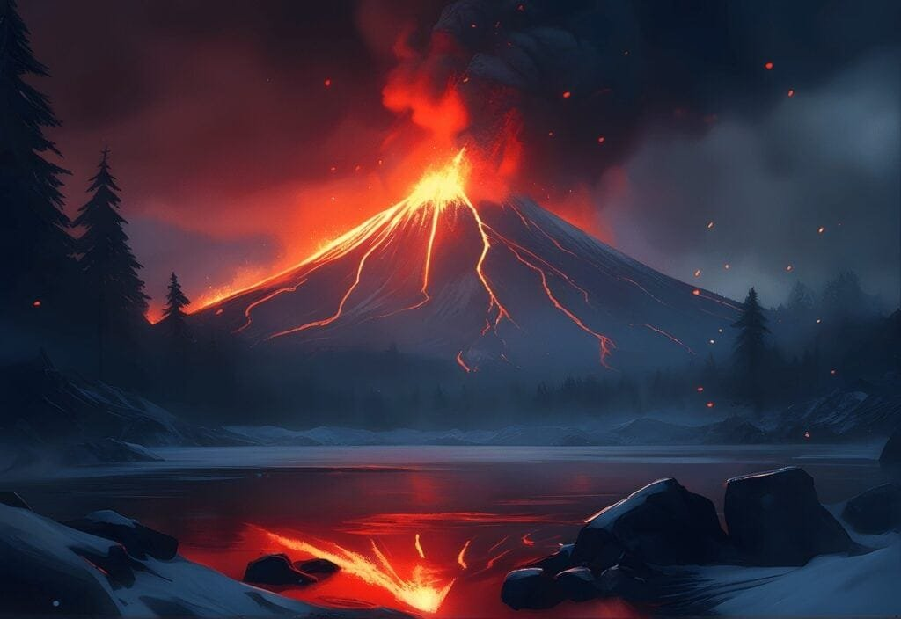

Volcanoes, with their explosive eruptions and unpredictable behavior, have always fascinated scientists and the general public alike. Whether it's the majestic ash clouds billowing from Mount Vesuvius or the rivers of molten lava flowing down the slopes of Kilauea, the impact of volcanic activity can be both awe-inspiring and devastating. In order to better understand the nature of volcanoes and mitigate the risks they pose, researchers have developed techniques for volcano activity forecasting. These proven methods allow scientists to make more precise predictions about when and how volcanic eruptions may occur, helping to protect communities and save lives.

<iframe width="560" height="315" src="https://www.youtube.com/embed/wnKvO4lzJzk" frameborder="0" allow="accelerometer; autoplay; encrypted-media; gyroscope; picture-in-picture" allowfullscreen></iframe>

  

## Understanding Volcanic Behavior

Volcanic behavior is a complex phenomenon that requires a comprehensive understanding in order to accurately forecast volcanic activity. By categorizing the types of volcanoes and recognizing eruption patterns, scientists can gain valuable insights into how these geological formations behave.

### Categorizing types of volcanoes

Volcanoes come in different forms and exhibit various eruption styles, which can be categorized based on their shape and eruptive characteristics. Some of the common [types of volcanoes include stratovolcanoes](https://magmamatters.com/understanding-volcanic-formation-a-comprehensive-guide/ "Understanding Volcanic Formation: A Comprehensive Guide"), shield volcanoes, cinder cones, and calderas.

Stratovolcanoes, also known as composite volcanoes, are characterized by their steep-sided conical shape and explosive eruptions. These volcanoes are composed of layers of hardened lava, volcanic ash, and other volcanic debris.

On the other hand, shield volcanoes have a broad and gentle slope. They are formed by the accumulation of lava flows that spread out over a large area, resulting in their characteristic shield-like shape. Shield volcanoes usually have more effusive eruptions with less explosive activity compared to stratovolcanoes.

Cinder cones are smaller, cone-shaped volcanoes that form from explosive eruptions of gas-charged lava fragments. They are usually produced by short-lived eruptions and are often found near larger volcanoes.

Calderas, on the other hand, are huge, basin-shaped volcanic craters that are formed when a large magma chamber empties and collapses. These volcanic features are often associated with extremely powerful eruptions and can be hundreds of kilometers in diameter.

By understanding the characteristics and formation mechanisms of each type of volcano, scientists can gain insights into their behavior and make more accurate forecasts.

### Recognizing eruption patterns

Eruption patterns vary from volcano to volcano and can provide important clues about the behavior of a specific volcano. By studying past eruptions and their associated patterns, scientists can gain valuable insights into how the volcano is likely to behave in the future.

Some volcanoes have regular eruption cycles, with relatively predictable patterns. For example, some stratovolcanoes exhibit periods of quiescence followed by eruptions at regular intervals. By studying the timing and magnitude of past eruptions, scientists can develop models to forecast future activity.

Other volcanoes may exhibit more irregular eruption patterns, with no clear periodicity. These volcanoes can pose greater challenges for forecasting, as their behavior may be more unpredictable. However, by [monitoring various parameters such as seismic activity](https://magmamatters.com/the-art-and-science-of-volcano-monitoring/ "The Art and Science of Volcano Monitoring"), gas emissions, and ground deformation, scientists can still detect subtle changes that may indicate an impending eruption.

Studying eruption patterns is a vital aspect of volcano forecasting, as it provides valuable information about the behavior and potential hazards of a specific volcano.

### Studying volcano geographic distribution and formation mechanisms

The geographic distribution of volcanoes provides insights into the underlying tectonic processes and the formation mechanisms of these fiery mountains. Understanding why and where volcanoes form can help predict future volcanic activity and assess the risks associated with them.

Volcanoes are commonly found at plate boundaries, where tectonic plates interact. This includes areas where plates are colliding, such as the "Ring of Fire" encircling the Pacific Ocean, as well as areas where plates are moving apart, such as mid-ocean ridges.

Hotspots, which are areas of intense volcanic activity, can also give rise to volcanoes. These are thought to be caused by plumes of hot mantle material rising to the surface. Examples of hotspots include the Hawaiian Islands and the Yellowstone Caldera.

By studying the distribution of volcanoes and the geological processes occurring at these locations, scientists can better understand the factors that contribute to volcanic activity. This knowledge can then be used to improve volcano forecasting and mitigation strategies.

## Seismic Monitoring

Seismic monitoring plays a crucial role in understanding and predicting volcanic activity. By studying seismic waves and interpreting the data recorded by seismographs, scientists can gain valuable insights into the behavior of a volcano.

### Understanding seismic waves

Seismic waves are vibrations that travel through the Earth's layers in response to various geological processes, including volcanic activity. There are two main types of seismic waves: body waves and surface waves.

Body waves consist of primary (P) waves and secondary (S) waves. P waves are compressional waves that travel faster and can move through both solids and liquids. S waves, on the other hand, are shear waves that travel slower and can only move through solids.

Surface waves are slower than body waves and travel along the Earth's surface. They cause the most destructive shaking during an earthquake or volcanic eruption.

By analyzing the characteristics of seismic waves, such as their arrival times and amplitudes, scientists can gain insights into the location, depth, and magnitude of seismic events associated with volcanic activity.

### Usage of seismographs

Seismographs are devices used to record and measure seismic waves. They consist of a seismometer, which detects ground motion, and a data logger, which records and stores the data.

Modern seismographs are equipped with highly sensitive sensors that can detect even the smallest seismic events. These instruments are often deployed in networks around active volcanoes to provide continuous monitoring.

Seismographs record the ground motion caused by volcanic activity, such as volcanic tremors, volcano-tectonic earthquakes, and harmonic tremors. By analyzing the data recorded by seismographs, scientists can detect changes in volcanic activity and assess the potential for an impending eruption.

### Interpretation of seismic activity data in relation to volcano activity

Interpreting seismic activity data is a crucial step in predicting volcanic eruptions. By analyzing the patterns and characteristics of seismic events, scientists can gain insights into the behavior of a volcano and make forecasts about its future activity.

For example, an increase in the number and intensity of volcano-tectonic earthquakes may indicate the movement of magma beneath the surface, suggesting an increased likelihood of an eruption. Similarly, volcanic tremors, which are continuous low-frequency vibrations, can be a sign of increased volcanic activity.

By combining seismic data with other monitoring techniques, such as gas emissions and ground deformation measurements, scientists can paint a more comprehensive picture of a volcano's behavior and make more accurate predictions about its future activity.

Seismic monitoring is a powerful tool in volcano forecasting, as it provides real-time information about the movement of magma and the potential for an eruption. It plays a crucial role in early warning systems and helps mitigate the risks associated with volcanic activity.

This image is property of pixabay.com.

## Volcano Deformation Monitoring

Monitoring changes in the shape and deformation of a volcano can provide valuable insights into its behavior and the potential for future eruptions. By utilizing techniques such as GPS monitoring and InSAR satellite data analysis, scientists can detect even subtle changes in volcano shape and ground deformation patterns.

### GPS monitoring

GPS (Global Positioning System) monitoring involves the use of satellite-based navigation systems to track the movement of ground stations located near a volcano. By continuously measuring the precise position of these stations, scientists can detect even the smallest changes in the volcano's deformation over time.

As magma accumulates beneath a volcano, it can cause the ground to uplift or subside. By analyzing the GPS data, scientists can determine the rate and direction of this movement, providing valuable insights into the underground processes occurring at the volcano.

GPS monitoring is particularly useful for detecting long-term trends in ground deformation, as well as sudden changes that may indicate an imminent eruption.

### InSAR satellite data analysis

InSAR (Interferometric Synthetic Aperture Radar) is a remote sensing technique that uses satellite-based radar to measure changes in the Earth's surface. It can be particularly useful for monitoring ground deformation at volcanoes.

By comparing radar images acquired over time, scientists can detect even subtle changes in the surface elevation caused by magma movement. This technique provides a detailed and accurate picture of the deformation patterns occurring at a volcano.

InSAR data analysis can help identify areas of significant ground deformation, such as uplift or subsidence, and track their evolution over time. When combined with other monitoring techniques, it can contribute to improved volcano forecasting and hazard assessment.

### Detection of changes in volcano shape and ground deformation patterns

The detection of changes in volcano shape and ground deformation patterns is critical for understanding the behavior of a volcano and predicting its future activity.

By continuously monitoring the shape and deformation of a volcano, scientists can detect signs of magma movement and changes in the internal pressure of the volcanic system. These changes can provide important insights into the likelihood and timing of an eruption.

Changes in volcano shape, such as the formation of new vents or the widening of existing ones, can indicate the migration of magma towards the surface. Ground deformation, on the other hand, can be a sign of magma accumulation or the release of volcanic gases.

By combining data from GPS monitoring, InSAR satellite analysis, and other techniques, scientists can develop a more comprehensive understanding of a volcano's behavior and enhance their ability to forecast eruptions.

Volcano deformation monitoring is a crucial component of volcano forecasting, as it provides real-time information about the underground processes occurring at a volcano. By detecting even subtle changes in volcano shape and ground deformation patterns, scientists can enhance the accuracy of eruption predictions and help protect communities at risk.

## Gas Emissions Detection

Gas emissions from volcanoes can provide valuable insights into the behavior of a volcano and the potential for an eruption. By analyzing the composition of gas emissions and utilizing gas sensors and spectrometers, scientists can correlate changes in gas emissions to upcoming volcanic events.

### Gas composition analysis

Gas emissions from volcanoes consist of a mixture of gases, including water vapor, carbon dioxide, sulfur dioxide, hydrogen sulfide, and various others. The composition of these gases can vary depending on the type of volcano and the depth and temperature of the magma.

By analyzing the composition of volcanic gases, scientists can gain insights into the underlying processes occurring at a volcano. For example, an increase in sulfur dioxide emissions may indicate the presence of new magma below the surface, suggesting an increased likelihood of an eruption.

The analysis of gas composition often involves collecting gas samples directly from the volcanic vent or using remote sensing techniques, such as gas spectrometry. These techniques provide valuable data that can be correlated with other monitoring parameters to enhance eruption forecasting.

### Usage of gas sensors and spectrometers

Gas sensors and spectrometers are valuable tools for detecting and measuring volcanic gas emissions. These instruments can be deployed in the vicinity of a volcano to continuously monitor changes in gas composition in real-time.

Gas sensors, such as SO2 sensors, can detect and quantify specific gases released by a volcano. These sensors provide data on the concentration of gases in the atmosphere, allowing scientists to track changes over time.

Gas spectrometers, on the other hand, analyze the spectral signature of the gases to determine their composition. This technique can provide a more detailed understanding of the gas emissions and help identify subtle changes that may be associated with an impending eruption.

By combining data from multiple gas sensors and spectrometers, scientists can build a comprehensive picture of the gas emissions from a volcano and track their evolution over time.

### Correlation of gas emission changes to upcoming volcanic events

Correlating changes in gas emissions to upcoming volcanic events is a crucial aspect of eruption forecasting. By analyzing the data collected from gas sensors and spectrometers, scientists can detect changes in gas composition that may be associated with an impending eruption.

For example, an increase in the concentration of sulfur dioxide or the presence of new gas species may indicate an increased likelihood of an eruption. Changes in gas emission rates and patterns can also provide valuable insights into the behavior and movement of magma within the volcanic system.

By combining gas emission data with other monitoring techniques, such as seismic monitoring and ground deformation measurements, scientists can enhance the accuracy of eruption forecasts and provide valuable information for risk assessment and mitigation.

Gas emissions detection is an essential component of volcano monitoring and forecasting. By analyzing the composition of volcanic gases and monitoring changes in gas emissions, scientists can gain insights into the underlying processes occurring at a volcano and enhance their ability to predict future eruptions.

This image is property of pixabay.com.

## Thermal Imaging

Thermal imaging is a powerful tool for understanding the heat patterns of volcanoes and forecasting volcanic eruptions. By utilizing thermal cameras and satellite data, scientists can analyze the thermal characteristics of a volcano and make predictions about its future activity.

### Understanding heat patterns of volcanoes

Volcanoes generate intense heat due to the movement of magma beneath the Earth's surface. This heat is often reflected in the thermal patterns observed on the surface of a volcano.

By understanding the heat patterns of volcanoes, scientists can gain insights into the internal processes occurring within the volcanic system. For example, areas of increased heat may indicate the presence of new magma or the movement of magma towards the surface, suggesting an increased likelihood of an eruption.

Thermal imaging enables scientists to visualize and analyze these heat patterns, providing valuable information for eruption forecasting and hazard assessment.

### Usage of thermal cameras and satellite data

Thermal cameras are instrumental in capturing thermal images of volcanoes. These specialized cameras can detect the infrared radiation emitted by the volcano's surface, allowing scientists to measure its temperature distribution.

Thermal cameras can be deployed on the ground or mounted on aircraft and drones to capture high-resolution thermal images of the volcano. These images provide valuable insights into the heat distribution and thermal anomalies associated with volcanic activity.

In addition to ground-based thermal cameras, satellite data can also be used to monitor the thermal characteristics of a volcano. Satellites equipped with thermal sensors can capture large-scale thermal images of the volcano and track changes over time.

By combining data from thermal cameras and satellite sensors, scientists can develop a comprehensive understanding of the volcano's thermal behavior and make more accurate predictions about its future activity.

### Analysis of thermal data in relation to eruption forecasting

The analysis of thermal data plays a crucial role in eruption forecasting. By analyzing the temperature distribution and thermal anomalies observed on a volcano, scientists can gain valuable insights into its behavior and make predictions about its future activity.

For example, an increase in surface temperature or the presence of new thermal anomalies may indicate the movement of magma towards the surface, suggesting an increased likelihood of an eruption. Similarly, changes in the spatial distribution and intensity of thermal anomalies can provide insights into the behavior and evolution of the volcanic system.

By integrating thermal data with other monitoring techniques, such as seismic monitoring and gas emissions detection, scientists can enhance their ability to forecast volcanic eruptions and mitigate the risks associated with them.

Thermal imaging is a valuable tool for understanding the heat patterns of volcanoes and predicting their future activity. By analyzing the temperature distribution and thermal anomalies observed on a volcano, scientists can gain insights into the behavior of the volcanic system and enhance their ability to forecast eruptions.

## Volcanic Geology Studies

Volcanic geology studies are essential for understanding the physical properties of volcanic rocks and the composition of magma. By investigating these aspects, scientists can gain insights into the behavior of a volcano and make predictions about its future eruptions.

### Investigating the physical properties of volcanic rocks

Volcanic rocks are formed during volcanic eruptions and provide valuable information about the processes occurring within a volcano. By investigating the physical properties of these rocks, scientists can gain insights into the magma composition, eruption style, and volcanic history of a volcano.

Physical properties such as density, porosity, and strength can be measured in the laboratory using samples collected from a volcano. These measurements can provide valuable insights into the behavior of magma and the processes occurring within the volcanic system.

By studying the physical properties of volcanic rocks, scientists can better understand how magma behaves during an eruption and make predictions about the potential hazards associated with a volcano.

### Determining magma composition and viscosity

The composition and viscosity of magma are crucial factors that influence the behavior of a volcano and the style of its eruptions. By determining these properties, scientists can gain insights into the processes occurring within the volcanic system and make predictions about its future behavior.

Magma composition refers to the types and relative proportions of different chemical elements and minerals present in the magma. Different magma compositions can result in different eruption styles and can influence the explosiveness and duration of volcanic eruptions.

Viscosity, on the other hand, refers to the resistance of magma to flow. Viscous magma tends to trap gases, resulting in explosive eruptions, while less viscous magma allows gases to escape more easily, leading to effusive eruptions.

By analyzing samples of volcanic rocks, scientists can determine the composition and viscosity of magma, providing valuable insights into the behavior of a volcano and its potential for future eruptions.

### Historical eruption timeline analysis

Analyzing the historical eruption timeline of a [volcano is an important aspect of volcanic geology](https://magmamatters.com/geothermal-energy-and-its-volcanic-origins/ "Geothermal Energy and Its Volcanic Origins") studies. By studying the past eruptions of a volcano, scientists can gain insights into its behavior, eruption frequency, and potential hazards.

Historical eruption records can provide valuable information about the patterns and characteristics of past eruptions. By analyzing these records, scientists can identify recurring eruption patterns and make predictions about the future behavior of a volcano.

In addition to historical records, geological studies can also involve the analysis of volcanic deposits, such as ash layers and lava flows. These deposits can provide valuable insights into the timing, duration, and intensity of past eruptions.

By combining the findings from historical eruption timeline analysis with other monitoring techniques, scientists can develop a more comprehensive understanding of a volcano's behavior and enhance their ability to predict future eruptions.

Volcanic geology studies are essential for understanding the behavior of a volcano and making predictions about its future eruptions. By investigating the physical properties of volcanic rocks, determining magma composition and viscosity, and analyzing the historical eruption timeline, scientists can gain valuable insights into the complex processes occurring within a volcano and enhance their ability to forecast volcanic activity.

## Geodesy and Ground-Based Gravity Measurement

Geodesy and ground-based gravity measurement are important techniques for understanding the behavior of a volcano and predicting its future activity. By monitoring gravity fluctuations related to magma movements and interpreting gravity data, scientists can gain valuable insights into a volcano's behavior.

### Gravity fluctuations related to magma movements

Magma movements beneath a volcano can cause fluctuations in the Earth's gravity field. As magma accumulates or moves within the volcanic system, it can create changes in mass distribution, resulting in detectable variations in gravity.

By monitoring these gravity fluctuations, scientists can gain insights into the behavior of magma and the potential for an impending eruption. Changes in the gravity field can indicate the movement of magma towards the surface, suggesting an increased likelihood of an eruption.

Monitoring gravity fluctuations is particularly useful for detecting long-term trends in magma movement, as well as sudden changes that may be associated with an imminent eruption.

### Usage of gravimeters

Gravimeters are instruments used to measure the Earth's gravitational field. These devices can detect even subtle variations in gravity and provide valuable data for volcano monitoring and forecasting.

Modern gravimeters are highly sensitive and can detect slight changes in the gravity field caused by magma movements. They can be deployed near a volcano to provide continuous monitoring of gravity fluctuations.

Gravimeters can be used to measure absolute changes in gravity or to detect relative changes by comparing gravity measurements at multiple locations. Both methods provide valuable information for understanding the behavior of a volcano and making predictions about its future activity.

### Interpreting gravity data for eruption forecasting

Interpreting gravity data is a crucial step in eruption forecasting. By analyzing the measurements recorded by gravimeters, scientists can gain insights into the behavior of a volcano and make predictions about its future activity.

Gravity data can provide valuable information about magma movements, such as the depth and rate of magma ascent. Changes in the gravity field can indicate the accumulation or migration of magma within the volcanic system, suggesting an increased likelihood of an eruption.

By combining gravity data with other monitoring techniques, such as seismic monitoring and gas emissions detection, scientists can enhance their ability to forecast volcanic eruptions and mitigate the risks associated with them.

Geodesy and ground-based gravity measurement are valuable tools for understanding the behavior of a volcano. By monitoring gravity fluctuations related to magma movements and interpreting gravity data, scientists can gain valuable insights into the internal processes occurring at a volcano and enhance their ability to predict future eruptions.

## Volcanic Hydrology

Analyzing changes in local water systems can provide valuable insights into the behavior of a volcano and the potential for future eruptions. By investigating thermal springs and geysers connected to volcanoes and applying hydrological data, scientists can contribute to eruption prediction and risk assessment.

### Analyzing changes in local water systems

Volcanoes can have a significant impact on the local water systems, leading to changes in the hydrological features of the surrounding area. By analyzing these changes, scientists can gain insights into the behavior of a volcano and make predictions about its future eruptions.

One example of a hydrological feature connected to volcanoes is thermal springs. These are natural hot springs that are heated by the heat generated by volcanic activity. By monitoring the temperature and flow rate of thermal springs, scientists can detect changes that may be associated with an impending eruption.

Changes in the chemical composition of water, such as an increase in the concentration of certain elements or gases, can also provide valuable insights into the behavior of a volcano. By analyzing water samples collected from rivers and streams, scientists can track changes in water chemistry and make predictions about future volcanic activity.

### Investigating thermal springs and geysers connected to volcanoes

Thermal springs and geysers are hydrothermal features that are often associated with volcanic activity. By investigating these features, scientists can gain insights into the underlying processes occurring within the volcanic system.

Thermal springs are natural hot springs that are heated by the heat generated by volcanic activity. The temperature and flow rate of these springs can provide valuable information about the behavior of a volcano. Changes in temperature or flow patterns can indicate the movement of magma or changes in the volcanic system, suggesting an increased likelihood of an eruption.

Geysers, on the other hand, are hydrothermal features that periodically erupt with steam and hot water. By studying the eruption patterns and associated changes in temperature and pressure, scientists can gain insights into the behavior of a volcano and make predictions about its future activity.

### Applying hydrological data for eruption prediction

Hydrological data, including information from thermal springs, geysers, and water chemistry analysis, can be used to enhance eruption prediction and risk assessment.

By monitoring the temperature and flow rate of thermal springs, scientists can detect changes that may be associated with an impending eruption. Similarly, changes in water chemistry can provide valuable insights into the behavior of a volcano and the potential for future eruptions.

By combining hydrological data with other monitoring techniques, such as seismic monitoring and gas emissions detection, scientists can develop a more comprehensive understanding of a volcano's behavior and make more accurate predictions about its future activity.

Volcanic hydrology plays a crucial role in eruption prediction and risk assessment. By analyzing changes in local water systems, investigating thermal springs and geysers, and applying hydrological data, scientists can gain valuable insights into the behavior of a volcano and enhance their ability to forecast volcanic activity.

## Machine Learning and Artificial Intelligence

Machine learning and artificial intelligence techniques have emerged as powerful tools in volcano activity forecasting. By feeding collected data into predictive models and using machine learning for pattern recognition, scientists can enhance the accuracy of eruption predictions and improve risk mitigation strategies.

### Feeding collected data into predictive models

Predictive models are algorithms that can be trained to analyze data and make predictions about future events. By feeding collected data into these models, scientists can develop algorithms that can accurately forecast volcanic activity.

Data collected from various monitoring techniques, such as seismic monitoring, gas emissions detection, and ground deformation measurements, can be used to train predictive models. These models can then analyze the data in real-time and make predictions about the likelihood and timing of an eruption.

By continuously updating and refining the predictive models with new data, scientists can improve their accuracy and make more reliable forecasts about volcanic eruptions.

### Using machine learning for pattern recognition

Machine learning involves the development of algorithms that can learn from and make predictions or decisions based on data. By utilizing machine learning techniques, scientists can analyze large datasets and identify patterns that may be associated with volcanic activity.

Machine learning algorithms can be trained to recognize patterns in various types of data, such as seismic waveforms, gas emission patterns, and thermal imaging data. By identifying patterns that are indicative of an impending eruption, these algorithms can enhance the accuracy of eruption forecasts.

By continuously training and improving the machine learning algorithms, scientists can adapt to new data and improve their ability to make accurate predictions about volcanic activity.

### Enhancing prediction accuracy with artificial intelligence techniques

Artificial intelligence (AI) techniques, such as neural networks and deep learning, have the potential to further enhance the accuracy of eruption predictions. These techniques involve the development of algorithms that can simulate human-like intelligence and learn from complex and unstructured data.

By utilizing AI techniques, scientists can analyze and interpret data from various monitoring techniques in a more sophisticated manner. These algorithms can identify subtle relationships and correlations between different parameters and make predictions about future volcanic activity.

By integrating machine learning and AI techniques into volcano forecasting, scientists can enhance the accuracy of eruption predictions and improve risk mitigation strategies. These techniques enable the analysis of large and complex datasets and provide valuable insights into the behavior of a volcano.

## Importance of Multi-disciplinary Approaches

Volcano forecasting is a complex task that requires the integration of various monitoring techniques and expertise from different disciplines. By employing multi-disciplinary approaches and fostering collaboration between volcanologists, seismologists, and other specialists, scientists can develop comprehensive strategies for risk mitigation.

### Integrating different forecasting techniques

Each monitoring technique provides valuable insights into the behavior of a volcano. By integrating data from multiple techniques, scientists can develop a more comprehensive understanding of a volcano's behavior and enhance their ability to predict eruptions.

For example, combining seismic monitoring with gas emissions detection and ground deformation measurements can provide a more complete picture of the processes occurring within a volcano. By analyzing the data from these different techniques, scientists can identify patterns and correlations that may be associated with an impending eruption.

By integrating data from multiple monitoring techniques, scientists can enhance the accuracy of eruption forecasts and provide valuable information for risk assessment and mitigation.

### Collaboration between volcanologists, seismologists, and other specialists

Volcano forecasting requires expertise from various disciplines, including volcanology, seismology, geodesy, hydrology, and geology. By fostering collaboration between specialists in these fields, scientists can pool their knowledge and resources to develop more accurate and reliable eruption forecasts.

For example, seismologists can provide valuable insights into the movement of magma and the potential for volcanic earthquakes. Volcanologists can contribute their expertise in volcano behavior and eruption mechanisms. Geodesists can monitor ground deformation, while hydrologists can investigate changes in local water systems.

By working together, specialists from different disciplines can combine their expertise and develop comprehensive strategies for volcano monitoring and risk mitigation.

### Devising comprehensive strategies for risk mitigation

By integrating different monitoring techniques and collaborating between different disciplines, scientists can develop comprehensive strategies for risk mitigation. These strategies involve the systematic monitoring of volcanoes, the analysis of various data parameters, and the development of early warning systems.

By continuously monitoring volcanoes and analyzing data in real-time, scientists can detect changes in activity and provide timely warnings to authorities and communities at risk. This allows for the implementation of evacuation plans and other measures to mitigate the risks associated with a volcanic eruption.

Comprehensive risk mitigation strategies also involve educating and raising awareness among the public about volcanic hazards and preparedness. By providing accurate and reliable information, scientists can ensure that communities are well-informed and prepared in the event of an eruption.

Multi-disciplinary approaches and collaboration between specialists are crucial for volcano forecasting and risk mitigation. By integrating different techniques, knowledge, and expertise, scientists can develop comprehensive strategies that enhance the accuracy of eruption predictions and contribute to the safety and well-being of communities living near volcanoes.

In conclusion, understanding volcanic behavior and accurately forecasting volcanic activity are essential for mitigating the risks associated with volcanoes. By employing techniques such as seismic monitoring, volcano deformation monitoring, gas emissions detection, thermal imaging, volcanic geology studies, geodesy and ground-based gravity measurement, volcanic hydrology, machine learning, and artificial intelligence, scientists can gather valuable data and insights into a volcano's behavior. By integrating different techniques, collaborating between disciplines, and devising comprehensive strategies for risk mitigation, scientists can enhance eruption predictions and protect communities living near volcanoes. With continuous advancements in monitoring techniques and interdisciplinary research, the field of volcano activity forecasting continues to evolve and improve, bringing about a safer future for volcanic regions worldwide.

