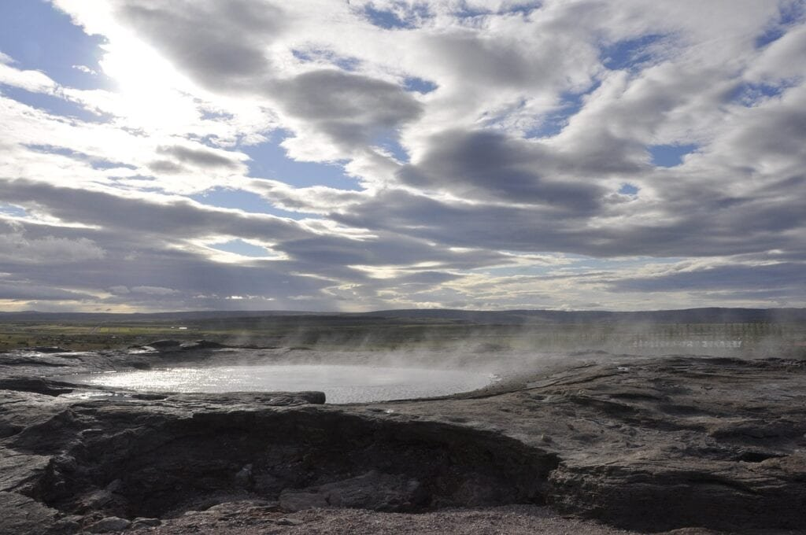
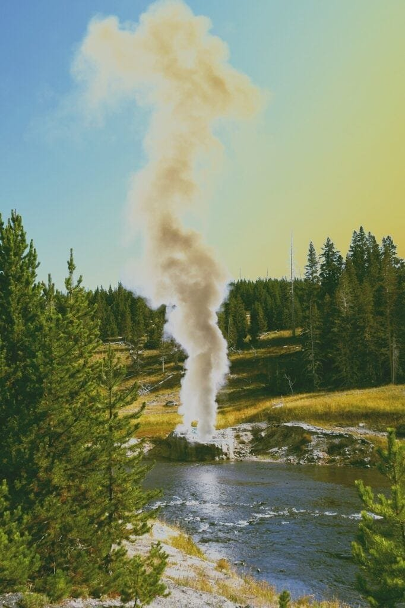

Imagine harnessing the incredible power of volcanoes to generate clean and sustainable energy. Volcanic geothermal energy, derived from the heat deep within the Earth's molten core, is a promising investment opportunity with numerous benefits. As magma rises to the surface, it heats underground water reservoirs, creating vast amounts of steam and hot water. This abundant geothermal resource can be tapped into to produce electricity and heat, providing a renewable energy solution that has minimal impact on the environment. Investing in volcanic geothermal energy not only offers a lucrative financial return, but also contributes to the global transition towards cleaner and more sustainable energy sources.

This image is property of pixabay.com.

## Understanding Volcanic Geothermal Energy

### Definition of volcanic geothermal energy

Volcanic geothermal energy refers to the heat energy harnessed from the Earth's volcanic activity. It is a renewable and sustainable source of energy that utilizes the heat stored in the Earth's crust near volcanoes. This energy is generated by tapping into the natural steam and hot water reservoirs that are heated by the magma beneath the Earth's surface.

### How volcanic geothermal energy works

Volcanic geothermal energy works by utilizing the heat generated from volcanic activity to produce electricity. Geothermal power plants are built near active or dormant volcanoes, where there is a steady supply of naturally heated fluids and steam available. The hot fluids are pumped to the surface and used to power turbines that generate electricity. Afterward, the fluids are reinjected back into the geothermal reservoir to maintain the sustainability of the resource.

## Geographical Distribution of Volcanoes and their Influence on Geothermal Energy

### Global distribution of volcanoes

Volcanoes are distributed around the world, with some areas having a higher concentration than others. The "Ring of Fire," which encircles the Pacific Ocean, is one of the most active volcanic regions, home to numerous volcanoes. Other regions with significant volcanic activity include Africa's Great Rift Valley, Iceland, and Italy's Mount Etna. Understanding the global distribution of volcanoes is crucial in identifying potential sites for harnessing volcanic geothermal energy.

### Nature of geothermal energy reserves around volcanoes

Volcanoes are often associated with high geothermal energy potential due to their proximity to the Earth's internal heat sources. The heat generated from magma and the tectonic activity around volcanoes leads to the formation of geothermal reservoirs. These reservoirs contain hot water or steam that can be tapped for energy production. The proximity to volcanoes ensures a constant heat source, making these areas ideal for harnessing geothermal energy.

<iframe width="560" height="315" src="https://www.youtube.com/embed/c7dy0hUZ9xI" frameborder="0" allow="accelerometer; autoplay; encrypted-media; gyroscope; picture-in-picture" allowfullscreen></iframe>

  

## Efficiency of Volcanic Geothermal Energy

### Energy conversion rate

Volcanic geothermal energy has a high energy conversion rate, making it a highly efficient form of renewable energy. Geothermal power plants can convert a large percentage of the Earth's heat into electricity, typically achieving conversion rates of 10-20% higher than traditional fossil fuel power plants. This high conversion rate reflects the significant potential of volcanic geothermal energy in meeting the growing global demand for electricity.

### Comparison with other renewable energy sources

When compared to other renewable energy sources like solar and wind power, volcanic geothermal energy stands out due to its consistent and reliable nature. Unlike solar and wind, which are intermittent energy sources, geothermal energy is available 24/7, regardless of weather conditions. This reliability makes it an attractive option for providing baseload power and ensuring a stable energy supply.

## Economic Benefits of Investing in Volcanic Geothermal Energy

### Job creation

Investing in volcanic geothermal energy can have significant economic benefits, including job creation. The development and operation of geothermal power plants require a skilled workforce, creating employment opportunities in construction, engineering, maintenance, and operation. Additionally, the growth of the geothermal industry stimulates job growth in related sectors such as manufacturing, support services, and tourism.

### Affordable energy production

Volcanic geothermal energy offers a cost-effective solution for energy production. Once the initial investment is made in constructing the geothermal power plant, the operational costs are relatively low. The fuel source, heat from the Earth's crust, is essentially free, resulting in stable energy prices. This affordability makes volcanic geothermal energy an attractive option for both industrial and residential consumers, contributing to the overall economic development of the region.

### Revenue generation

Investing in volcanic geothermal energy can generate substantial revenue for governments, private companies, and local communities. Geothermal power plants generate electricity that can be sold to the grid, providing a steady income stream. Additionally, countries with significant geothermal resources can export surplus electricity, further boosting their revenue. Revenue generated from geothermal energy investments can be reinvested in infrastructure development, education, healthcare, and other essential services, thereby improving the overall quality of life for communities.

This image is property of pixabay.com.

## Environmental Impact of Volcanic Geothermal Energy

### Carbon emission reduction

Volcanic geothermal energy is a clean and environmentally friendly source of power. Geothermal power plants produce minimal greenhouse gas emissions, contributing to the reduction of [carbon dioxide](https://magmamatters.com/geothermal-energy-and-its-volcanic-origins/ "Geothermal Energy and Its Volcanic Origins") and other harmful pollutants in the atmosphere. By transitioning from fossil fuel-based energy sources to geothermal energy, countries can significantly reduce their carbon footprint and combat climate change.

### Low physical footprint

Geothermal power plants have a relatively small physical footprint compared to other energy generation facilities. Once the drilling and construction are complete, the surface infrastructure is minimal, requiring less land space compared to traditional power plants. This low physical footprint minimizes the disturbance to ecosystems and allows for coexistence with other land uses, such as agriculture and conservation efforts.

### Water consumption in geothermal power plants

While geothermal power plants require a constant supply of water for operation, the consumption is relatively low compared to other forms of energy production. Geothermal plants recycle and reuse the water used in the processes, minimizing the overall water usage. Additionally, geothermal energy does not contribute to water pollution, as there is no combustion involved in the energy conversion process.

## Challenges in Investing in Volcanic Geothermal Energy

### Seismic activities and operational hazard

Investing in volcanic geothermal energy poses certain challenges due to the inherent geological risks associated with volcanic regions. [Volcanic areas are prone to seismic activities](https://magmamatters.com/understanding-volcanic-formation-a-comprehensive-guide/ "Understanding Volcanic Formation: A Comprehensive Guide"), which can pose a threat to the infrastructure and operations of geothermal power plants. However, with proper site selection, advanced monitoring systems, and adherence to strict safety protocols, these risks can be effectively mitigated.

### Capital-intensive initial investment

The initial investment required for developing geothermal power plants can be substantial. The drilling and construction of the necessary infrastructure, such as the wellfield and power plant, require significant capital expenditure. However, it is essential to note that while the upfront costs may be high, the long-term operational costs of geothermal energy are relatively low, resulting in a favorable return on investment over time.

### Technological requirements

Investing in volcanic geothermal energy requires specialized technological expertise and equipment. The drilling and operation of geothermal wells involve complex engineering techniques and knowledge. Additionally, the maintenance and management of geothermal power plants require skilled professionals with a deep understanding of geothermal systems. Ensuring a well-trained workforce and access to advanced technologies are critical for successful geothermal energy investments.

This image is property of pixabay.com.

## Risk Mitigation and Management

### Earthquake-resistant infrastructure

To mitigate the risks associated with seismic activities, geothermal power plants need to be built with earthquake-resistant infrastructure. Incorporating robust engineering designs and materials ensures that the power plants can withstand potential earthquakes. Regular inspections and maintenance are also vital to ensure the continued stability and safe operation of geothermal facilities.

### Insurance coverage

Investing in volcanic geothermal energy involves certain risks, and having comprehensive insurance coverage is crucial. Insurance policies can provide financial protection in case of operational disruptions, property damage, or any unforeseen circumstances. Adequate insurance coverage gives investors and project developers peace of mind and protects their investments against potential losses.

### Scientific monitoring and prediction

Scientific monitoring and prediction play a significant role in managing the risks associated with volcanic geothermal energy investments. Continuous [monitoring of seismic activity](https://magmamatters.com/the-art-and-science-of-volcano-monitoring/ "The Art and Science of Volcano Monitoring"), volcanic gas emissions, and geothermal reservoir conditions allows for early detection of any changes or potential hazards. Advanced analytical models and monitoring systems enable scientists to predict volcanic eruptions and seismic events, providing valuable information for risk management strategies.

## Positive Societal Impact

### Energy security

Investing in volcanic geothermal energy enhances energy security by diversifying the energy mix of a country. Volcanic geothermal energy provides a reliable and indigenous source of power, reducing dependence on fossil fuel imports. This diversification improves a country's energy self-sufficiency, ensuring a stable supply of electricity even during external energy supply disruptions.

### Energy access in remote locations

Volcanic geothermal energy can bring electricity to remote and isolated communities that are not connected to the grid. These communities often rely on expensive and unreliable diesel generators for their energy needs. By harnessing geothermal energy, these communities can have access to a clean, affordable, and sustainable source of electricity, improving their quality of life and enabling economic development.

### Contribution to the local economy

Investments in volcanic geothermal energy contribute to the local economy in multiple ways. The development and operation of geothermal power plants create jobs, stimulating economic growth and providing income opportunities for local communities. Additionally, the revenue generated from geothermal energy can be reinvested in local infrastructure, healthcare, education, and other social programs, supporting the overall development and well-being of the region.

## Global Best Practices and Policies in Geothermal Energy Investments

### Government incentives

To encourage investments in geothermal energy, governments can provide various incentives and support mechanisms. These can include tax incentives, grants, loan guarantees, and favorable regulatory frameworks that facilitate the development of geothermal projects. By offering these incentives, governments can attract private investors and accelerate the growth of the geothermal sector.

### International partnerships

International partnerships and collaborations play a crucial role in promoting geothermal energy investments worldwide. Sharing knowledge, technology, and financial resources can support countries in developing their geothermal resources. International institutions, multilateral organizations, and bilateral agreements can facilitate these partnerships and provide the necessary financial and technical assistance.

### Policy frameworks

Establishing clear and favorable policy frameworks is essential for attracting investment in volcanic geothermal energy. Governments should develop comprehensive energy policies that recognize the potential of geothermal energy and outline the strategies for its development. These policies should address areas such as permitting processes, grid integration, tariff structures, and long-term energy planning, providing stability and clarity to investors.

## Future Scope of Investing in Volcanic Geothermal Energy

### Advanced drilling technology

The future of volcanic geothermal energy investments lies in the advancements of drilling technology. Improved drilling techniques can enable access to deeper and hotter geothermal reservoirs, expanding the potential for energy extraction. Innovative drilling technologies, such as directional drilling and slim-hole drilling, can significantly reduce costs and minimize environmental impacts.

### Smart grid integration

Integrating geothermal energy into smart grid systems can enhance the efficiency and reliability of power supply. Smart grid technologies allow for real-time monitoring, load balancing, and demand response capabilities. This integration ensures optimal utilization of geothermal energy and enables seamless integration with other renewable energy sources, further enhancing the sustainability of the power grid.

### Adoption trends in developing countries

Developing countries with significant geothermal resources have great potential for expanding their investments in volcanic geothermal energy. These countries often face challenges in accessing affordable and reliable electricity. By leveraging their geothermal resources, they can address these challenges and achieve their sustainable development goals. International support, technology transfer, and capacity-building initiatives can facilitate the adoption of geothermal energy in these regions.

### Potential for hydrogen production

Volcanic geothermal energy can play a vital role in the production of hydrogen, a clean and renewable fuel source. By utilizing the excess heat from geothermal power plants, hydrogen production through electrolysis can be achieved. Hydrogen can be used as a versatile energy carrier, powering various sectors such as transportation, industry, and heating. The integration of geothermal energy with hydrogen production offers an exciting avenue for sustainable energy solutions.

In conclusion, investing in volcanic geothermal energy offers numerous benefits ranging from economic growth to environmental sustainability. Understanding the nature of volcanic geothermal energy, its efficiency, and the challenges involved is crucial for making informed investment decisions. With proper risk management strategies, supportive policies, and technological advancements, volcanic geothermal energy has a bright future as a key component of the global renewable energy landscape.

