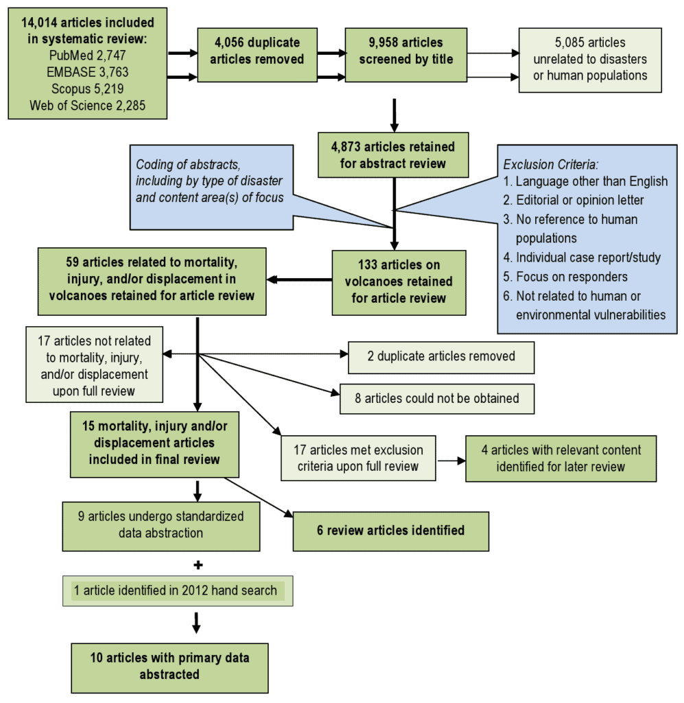

In "The Causes and Consequences of Volcanic Disasters: A Case Study Analysis," we explore the fascinating world of volcanoes and the devastating effects they can have on communities. Volcanoes, formed by the escape of molten rock, gases, and debris, occur at various locations along the earth's tectonic plates. From the explosive eruptions of the Ring of Fire to the gradual eruptions of shield volcanoes in Hawaii, each volcano displays unique characteristics and eruption patterns. By understanding the causes of volcanic disasters, we can gain insight into predicting future activity and mitigating risks. Through engaging case studies, we delve into the intriguing world of volcanoes and uncover the reasons behind these catastrophic events.

This image is property of climateadaptationplatform.com.

## Understanding Volcanoes and Their Formation

A [volcano is a natural geological](https://magmamatters.com/geothermal-energy-and-its-volcanic-origins/ "Geothermal Energy and Its Volcanic Origins") feature that occurs when molten rock, gases, and debris escape to the earth's surface, resulting in eruptions of lava and ash. These eruptions can occur at various locations, including plate boundaries, hotspots under the earth's crust, or rift zones where the earth's tectonic plates are moving apart.

### Description of a volcano

A volcano is essentially a vent in the Earth's crust where molten rock, known as magma, rises to the surface. It is formed by layers of solidified lava, volcanic ash, and other volcanic materials that accumulate over time. The shape and structure of a volcano can vary depending on various factors such as the type of eruption and the composition of the lava.

### Process of volcano formation

Volcanoes are formed through a complex process that involves the movement of tectonic plates and the melting of rocks deep within the Earth's mantle. The process begins with the movement of tectonic plates, which can create weak spots in the Earth's crust. When pressure builds up beneath these weak points, magma is forced to rise towards the surface, leading to volcanic eruptions.

### Various types of volcanoes

There are several different types of volcanoes that can be found around the world. One common type is the stratovolcano, which is characterized by its steep, conical shape and explosive eruptions. Other [types of volcanoes include shield](https://magmamatters.com/understanding-volcanic-formation-a-comprehensive-guide/ "Understanding Volcanic Formation: A Comprehensive Guide") volcanoes, which have gentle slopes and eruptions characterized by the flow of basaltic lava, and cinder cone volcanoes, which are small and steep with explosive eruptions.

## Geographic Distribution of Volcanoes

Volcanoes are not evenly distributed across the globe. They are found in specific regions, with some areas having a higher concentration of volcanoes than others.

### Location of volcanoes worldwide

Volcanoes can be found on every continent, although they are most commonly found near plate boundaries. The Pacific Ocean region, known as the "Ring of Fire," is particularly prone to volcanic activity, with many active volcanoes located along the boundaries of the Pacific tectonic plate. Other regions with significant volcanic activity include the Mediterranean, Iceland, and parts of East Africa.

### Explanation of 'Ring of Fire'

The "Ring of Fire" refers to a major area in the basin of the Pacific Ocean where a large number of earthquakes and volcanic eruptions occur. This region is characterized by intense volcanic activity and is home to the majority of the world's active volcanoes. The high concentration of volcanoes in this area is due to the presence of several tectonic plates that are constantly moving and interacting, leading to the formation of volcanic arcs and chains.

### The role of tectonic plate movement in volcano formation

Tectonic plate movement plays a crucial role in the formation of volcanoes. When tectonic plates collide or move apart, they can create weak spots in the Earth's crust. These weak spots allow magma from the Earth's mantle to rise towards the surface, resulting in volcanic eruptions. The movement of tectonic plates is driven by the convection currents in the Earth's mantle, which causes the plates to slowly drift over time.

  

## Causes of Volcanic Eruptions

Volcanic eruptions are the result of various factors, including the movement of underground magma and the buildup of gas pressure. Understanding these causes is essential in predicting and mitigating volcanic risks.

### The role of underground magma and gas pressure

Volcanic eruptions occur when magma, which is molten rock beneath the Earth's surface, rises to the surface. The movement of magma is influenced by the pressure exerted on it by gases dissolved in the magma. As magma rises towards the surface, the decrease in pressure allows the dissolved gases to expand rapidly, leading to explosive eruptions.

### Impact of tectonic plate movements

Tectonic plate movements can also trigger volcanic eruptions. When two plates collide or move apart, it creates stress and pressure in the Earth's crust. This stress can cause the crust to fracture, allowing magma to escape to the surface and result in an eruption.

### Types of volcanic eruptions

Volcanic eruptions can vary in their intensity and characteristics. Some eruptions are explosive, characterized by the ejection of ash, lava, and gases into the atmosphere. Other eruptions are more effusive, with relatively slow lava flows and less violent explosions. The type of eruption depends on various factors, including the viscosity of the magma and the amount of gas present.

## Hazards Associated with Volcanic Eruptions

Volcanic eruptions can pose significant hazards to both human and natural environments. Understanding these hazards is crucial for disaster preparedness and response.

### Physical dangers posed by volcanic eruptions

Volcanic eruptions can pose numerous physical dangers to individuals and communities living in proximity to active volcanoes. These hazards include pyroclastic flows, which are fast-moving clouds of hot gas, ash, and rock fragments, as well as lava flows and volcanic bombs. Volcanic ash can also pose dangers to human health, particularly in terms of respiratory problems and damage to infrastructure.

### Environmental impacts of volcanic eruptions

Volcanic eruptions can have severe environmental impacts. The release of ash and gases into the atmosphere can affect air quality and climate patterns. Ashfall can smother vegetation and contaminate water sources, leading to the destruction of ecosystems and agricultural lands. The deposition of volcanic ash can also cause significant damage to buildings, roads, and other infrastructure.

### Potential long term hazards

In addition to the immediate hazards associated with volcanic eruptions, there can be long-term hazards that persist even after the eruption has ended. These hazards include lahars, which are fast-moving mudflows composed of volcanic debris and water, and [volcanic gases](https://magmamatters.com/the-art-and-science-of-volcano-monitoring/ "The Art and Science of Volcano Monitoring") that can continue to be released from the volcano even during periods of quiescence. Monitoring and managing these long-term hazards is vital for the safety and well-being of the affected communities.

This image is property of currents.plos.org.

## Benefits of Volcanic Eruptions

While volcanic eruptions can be highly destructive, they also play a crucial role in the Earth's geological processes and can have some positive impacts.

### Soil fertilization through volcanic ash

One of the benefits of volcanic eruptions is the fertilization of soil through the deposition of volcanic ash. Volcanic ash is rich in minerals and organic matter, which can enhance soil fertility and promote the growth of vegetation. This makes volcanic soils highly productive for agricultural activities, and areas affected by volcanic eruptions often have fertile land that supports thriving ecosystems.

### Creation of new lands

Volcanic eruptions can also lead to the creation of new lands. When lava flows into the sea or other bodies of water, it cools and solidifies, forming new landmasses known as volcanic islands or submarine volcanoes. Over time, these new lands can provide habitats for a variety of plant and animal species, contributing to biodiversity.

### Geothermal energy resources

Volcanic activity can also be harnessed as a valuable source of geothermal energy. Geothermal power plants utilize the heat generated by volcanic activity to generate electricity. This renewable energy source provides a sustainable and clean alternative to fossil fuels, reducing greenhouse gas emissions and promoting a more sustainable energy future.

## Prediction and Mitigation of Volcanic Risks

Predicting volcanic eruptions and implementing effective strategies to mitigate risks can help reduce the impacts of volcanic disasters on communities.

### Current scientific techniques for predicting eruptions

Scientists use various techniques to monitor and predict volcanic eruptions, including the measurement of volcanic gases, ground deformation, and seismic activity. By analyzing these data, scientists can identify patterns and indicators of volcanic unrest, providing valuable information for early warning systems and evacuation plans.

### Strategies for reducing risks to communities

There are several strategies that can be employed to reduce the risks posed by volcanic eruptions to communities. These include the establishment of exclusion zones around active volcanoes, the development of effective evacuation plans, and the construction of resilient infrastructure that can withstand volcanic hazards such as ashfall and lahars. In addition, public education and awareness campaigns play a crucial role in informing communities about volcanic risks and promoting preparedness.

### Role of government and institutions in disaster management

Governments and institutions have a critical role to play in disaster management related to volcanic eruptions. This includes the development of policies and regulations that address volcanic risks, the allocation of resources for monitoring and research, and the coordination of emergency response efforts. Collaboration between government agencies, scientific institutions, and local communities is essential for effective volcanic disaster management.

This image is property of i1.rgstatic.net.

## Case Study Analysis: Why Did These Volcanic Disasters Occur?

Studying specific case studies of volcanic disasters can provide valuable insights into the causes and consequences of these events.

### Selection of specific case studies

For a comprehensive analysis, it is essential to select specific case studies that represent different types of volcanic disasters and geographical locations. Examples of well-known volcanic disasters include the 1980 eruption of Mount St. Helens in the United States, the 1991 eruption of Mount Pinatubo in the Philippines, and the ongoing eruption of Kilauea in Hawaii.

### Investigation of causes of selected volcanic disasters

In-depth investigations are necessary to understand the causes of these selected volcanic disasters. This involves examining geological and geophysical data, analyzing historical records, and considering the influence of human factors. Understanding the specific causes of each volcanic disaster can provide insights into the broader patterns and factors that contribute to volcanic eruptions.

### Examination of the role of human factors

In addition to natural causes, human factors can also play a significant role in volcanic disasters. Human activities such as deforestation, urbanization, and industrialization can alter the natural [environment and increase the vulnerability of communities to volcanic hazards](https://magmamatters.com/the-environmental-impact-of-volcanic-eruptions-2/ "The Environmental Impact of Volcanic Eruptions"). Studying the role of human factors in volcanic disasters is important for developing effective mitigation strategies and promoting sustainable development practices.

## Consequences of Studied Volcanic Disasters

The consequences of volcanic disasters can be wide-ranging, affecting both the immediate environment and long-term socio-economic factors.

### Immediate consequences of the eruptions

The immediate consequences of volcanic eruptions can include loss of life, injuries, and displacement of communities. Infrastructure, including buildings, roads, and utilities, can be severely damaged or destroyed. The release of volcanic ash can disrupt air travel and cause respiratory problems in nearby populations. Economic activities, such as agriculture and tourism, can also be severely impacted.

### Long-term consequences on the environment and communities

Volcanic disasters can have long-lasting effects on the environment and communities in the affected areas. The deposition of volcanic ash can alter the landscape, smother vegetation, and contaminate water sources, leading to long-term ecological impacts. Displaced communities may face challenges in rebuilding their lives and recovering their livelihoods. The long-term psychological and social impacts of volcanic disasters should also be considered.

### Socioeconomic effects of the disasters

The socioeconomic effects of volcanic disasters can be significant and far-reaching. In addition to the immediate economic losses caused by the destruction of infrastructure and disruption of economic activities, there can be long-term impacts on industries such as agriculture, tourism, and fishing. The recovery and reconstruction process can be costly and can take years or even decades.

This image is property of image.slidesharecdn.com.

## Lessons Learnt from Previous Volcanic Disasters

Analyzing past volcanic disasters can provide valuable lessons for improving disaster management strategies in the future.

### Review of disaster management strategies

Reviewing the effectiveness of disaster management strategies implemented during previous volcanic disasters is crucial for identifying areas for improvement. This includes evaluating the coordination between government agencies, the effectiveness of evacuation plans, and the availability of early warning systems. Lessons learned from past disasters can inform the development of more robust and comprehensive disaster management strategies.

### Effectiveness of warnings and evacuations

The effectiveness of warnings and evacuations in minimizing the impacts of volcanic disasters should also be assessed. This includes evaluating the timeliness and accuracy of warnings, the availability of evacuation routes and shelters, and the level of public awareness and preparedness. Understanding the strengths and weaknesses of warning and evacuation systems can help enhance their effectiveness in future volcanic disasters.

### Future strategies for disaster mitigation

Building on the lessons learned from previous volcanic disasters, future strategies for disaster mitigation should focus on proactive measures to reduce vulnerability and enhance resilience. This includes investing in scientific research and monitoring systems to improve eruption forecasting, implementing land-use planning measures to minimize exposure to volcanic hazards, and strengthening community preparedness and response capabilities. By adopting a holistic and proactive approach, the impacts of future volcanic disasters can be minimized.

## Future of Volcanic Disaster Management

Advancements in technology and policy recommendations can significantly improve volcanic disaster management in the future.

### Advancements in volcano prediction technology

Advances in technology, such as improved monitoring systems, remote sensing techniques, and data analysis tools, can enhance the accuracy and timeliness of volcano prediction. By continuously monitoring volcanic activity and analyzing data in real-time, scientists can provide more precise and reliable forecasts, facilitating better decision-making and more effective disaster response.

### Policy recommendations for improved disaster response

Developing and implementing robust policies and regulations is essential for improving disaster response capabilities. This includes establishing clear lines of responsibility and coordination among relevant government agencies, ensuring the availability of adequate resources for monitoring and research, and integrating volcanic risk considerations into land-use planning and development policies. Policy recommendations should be based on scientific evidence and take into account the specific characteristics and vulnerabilities of each volcanic region.

### The role of community engagement in disaster management

Community engagement is a vital component of effective volcanic disaster management. Engaging with local communities and fostering a culture of preparedness and resilience can significantly improve disaster response capabilities. This includes providing education and training on volcanic hazards and evacuation procedures, facilitating community-led initiatives for risk reduction, and involving local communities in decision-making processes related to volcanic activities. By working together, governments, scientific institutions, and local communities can build a more resilient and safer future.

In conclusion, understanding volcanoes and their formation is crucial for predicting and mitigating volcanic risks. Volcanic eruptions can have significant impacts on both the natural environment and communities, but they can also provide benefits such as fertile soil and geothermal energy resources. By studying past volcanic disasters and learning from them, we can improve disaster management strategies and build a more resilient future. Advancements in technology and policy recommendations can further enhance volcanic disaster management, while community engagement plays a crucial role in promoting preparedness and resilience. With comprehensive knowledge and effective strategies, we can minimize the impacts of volcanic disasters and protect the well-being of communities worldwide.

Related Posts: [Mitigating Risks: Forecasting Volcanic Activity in Prone Areas](https://magmamatters.com/mitigating-risks-forecasting-volcanic-activity-in-prone-areas/), [The Formation and Eruption Patterns of Volcanoes](https://magmamatters.com/the-formation-and-eruption-patterns-of-volcanoes-4/), [The Pyroclastic Phenomena of Pompeii: 7 Insights to Explore](https://magmamatters.com/the-pyroclastic-phenomena-of-pompeii-7-insights-to-explore/), [Tips for Capturing Volcano Pyroclastic Flow Photos](https://magmamatters.com/tips-for-capturing-volcano-pyroclastic-flow-photos/), [Understanding Volcanoes and Their Eruption Patterns](https://magmamatters.com/understanding-volcanoes-and-their-eruption-patterns/)
