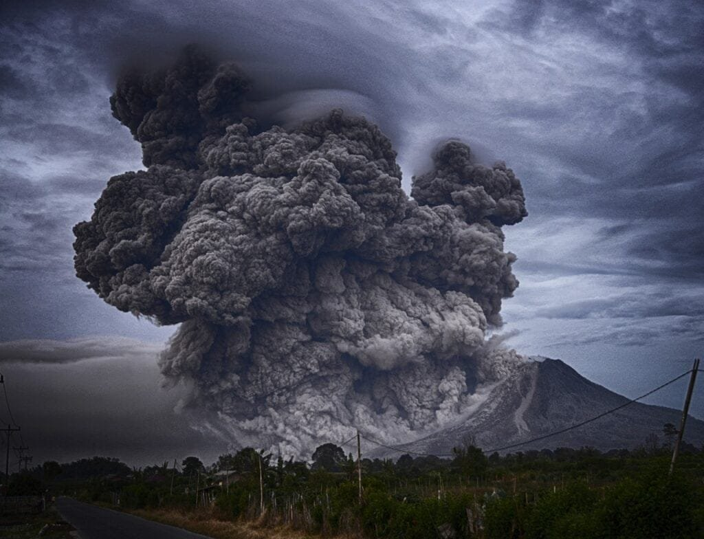

Imagine standing on the edge of a volcano, feeling the heat of the molten lava and witnessing the powerful eruption as it unleashes clouds of ash into the sky. While the immediate impact of a volcano is awe-inspiring, its effects extend far beyond the earth's surface. Volcanic aerosols, tiny particles and gases released during an eruption, have a significant role to play in climate change. These aerosols can affect the earth's temperature, weather patterns, and even contribute to global cooling. In this article, we will explore the fascinating relationship between volcanic aerosols and climate change, delving into the intricacies of this natural phenomenon and its potential implications for our planet.

This image is property of pixabay.com.

## Fundamental Understanding of Volcanic Aerosols

### Definition of volcanic aerosols

Volcanic aerosols refer to microscopic particles and gases that are emitted during volcanic eruptions and are suspended in the atmosphere. These aerosols are composed of a mixture of solid and liquid particles, as well as gases such as sulfur dioxide, water vapor, carbon dioxide, and various trace gases. These particles can range in size from submicron to several microns in diameter.

### Formation process of volcanic aerosols

Volcanic aerosols are formed through complex processes that occur during volcanic eruptions. When magma reaches the Earth's surface, it is exposed to atmospheric pressure, causing dissolved gases to rapidly expand and form bubbles. These bubbles can burst, ejecting tiny droplets of molten rock, known as magma aerosols, into the air. These magma aerosols solidify and cool rapidly, forming volcanic ash particles. Additionally, [volcanic](https://magmamatters.com/the-art-and-science-of-volcano-monitoring/ "The Art and Science of Volcano Monitoring") gases such as sulfur dioxide react with water vapor in the atmosphere, forming sulfuric acid droplets that contribute to the composition of volcanic aerosols.

### Main compounds found in volcanic aerosols

Volcanic aerosols consist of various compounds, including silicates, sulfuric acid, water vapor, carbon dioxide, and trace gases such as hydrogen sulfide and carbon monoxide. Silicates are the primary component of volcanic ash particles and contribute to their abrasive and abrasive properties. Sulfuric acid droplets, formed through the interaction of volcanic gases with water vapor, play a significant role in the impact of volcanic aerosols on the atmosphere and climate. These compounds can have both short-term and long-term effects on the Earth's climate system.

## Volcanic Eruptions and Aerosol Production

### Correlation between volcanic eruptions and the amount of aerosols produced

The amount of aerosols produced during a volcanic eruption is directly related to the magnitude and intensity of the eruption. Explosive eruptions, characterized by the ejection of large volumes of ash and gases into the atmosphere, tend to produce significant amounts of aerosols. In contrast, effusive eruptions, which involve the relatively slow extrusion of lava, may produce fewer aerosols. The explosiveness of an eruption is influenced by factors such as the composition and viscosity of the magma, the presence of volatile gases, and the vent geometry.

### Variations in aerosol production based on the type and intensity of eruption

The type and intensity of a volcanic eruption play a crucial role in determining the characteristics and composition of the aerosols produced. In explosive eruptions, magma is fragmented into fine ash particles and ejected into the atmosphere with considerable force. These eruptions produce significant amounts of fine volcanic ash and gases, such as sulfur dioxide, which can contribute to the formation of sulfuric acid droplets. In contrast, effusive eruptions produce less ash but can release large amounts of volcanic gases, including water vapor and carbon dioxide. The composition and size distribution of the aerosols generated vary depending on the specific volcanic processes involved.

### Aerosols' vertical dispersion in the atmosphere after volcanic activities

After volcanic aerosols are emitted into the atmosphere, their dispersion and transport depend on a variety of factors, such as wind patterns, atmospheric stability, and the physical properties of the aerosols themselves. Larger ash particles tend to fall out of the atmosphere relatively quickly due to gravity, resulting in localized deposition near the eruption source. Smaller particles, especially those in the submicron range, can remain suspended in the atmosphere for longer periods and be transported over large distances. The vertical dispersion of aerosols is influenced by atmospheric conditions and can vary from near-surface levels to the upper troposphere and even into the stratosphere. Once injected into the stratosphere, aerosols can have a longer residence time and potentially affect global climate patterns.

This image is property of pixabay.com.

## Impact of Volcanic Aerosols on Solar Radiation

### Reflective properties of volcanic aerosols and their effect on incoming solar radiation

Volcanic aerosols have the ability to scatter and absorb solar radiation, influencing the amount of sunlight reaching the Earth's surface. The composition and size distribution of aerosols determine their optical properties, such as their ability to reflect or absorb different wavelengths of light. Fine aerosol particles, particularly those containing sulfate compounds, tend to scatter incoming solar radiation back into space, resulting in a cooling effect on the Earth's surface. This phenomenon is known as the "aerosol direct effect" and can lead to a reduction in the amount of solar radiation reaching the surface.

### The cooling effect: Reduction in global temperature due to volcanic activities

Volcanic eruptions can have a significant cooling effect on the Earth's climate system. When aerosols are injected into the atmosphere during volcanic eruptions, they can block incoming solar radiation, leading to a decrease in global temperatures. This cooling effect can persist for several months to years, depending on the size and magnitude of the eruption. Large volcanic eruptions, such as the 1991 eruption of Mount Pinatubo in the Philippines, have been shown to cause a measurable decrease in global temperatures. The cooling effect of volcanic aerosols can have regional and global implications for weather patterns, climate variability, and ecosystems.

### Comparison of the magnitude of cooling effects from different eruptions

The magnitude of cooling effects resulting from volcanic eruptions can vary depending on several factors, including the intensity of the eruption, the altitude at which aerosols are injected into the atmosphere, and the composition of the aerosols themselves. Explosive eruptions that inject large amounts of fine ash and sulfur-rich gases into the stratosphere tend to have the most significant cooling effects on global temperatures. For example, the 1815 eruption of Mount Tambora in Indonesia, one of the largest volcanic eruptions in recorded history, caused a notable drop in temperatures worldwide, leading to the "Year Without a Summer" in 1816. The cooling effects of volcanic aerosols can vary in duration and intensity, with some eruptions having more pronounced impacts than others.

## Volcanic Aerosols and Ozone Layer Depletion

### Influence of sulfuric acid droplets from volcanic aerosols on the ozone layer

Volcanic aerosols, particularly those containing sulfuric acid droplets, can contribute to the depletion of the ozone layer in the stratosphere. Sulfuric acid droplets act as a catalyst for chemical reactions that lead to the destruction of ozone molecules. When volcanic eruptions inject sulfur dioxide gas into the stratosphere, it can react with ozone, forming an intermediate compound known as sulfuric acid. This reaction cycle can deplete the ozone layer, reducing its ability to protect the Earth's surface from harmful ultraviolet (UV) radiation.

### Case studies: Specific volcanic eruptions leading to significant ozone layer depletion

Several volcanic eruptions in recent history have been associated with significant ozone layer depletion. For example, the 1991 eruption of Mount Pinatubo released large amounts of sulfur dioxide into the stratosphere, leading to the formation of sulfuric acid droplets. This eruption resulted in measurable ozone layer depletion, particularly in polar regions, where ozone holes were observed. Similarly, the 1982 eruption of El Chichón in Mexico and the 2008 eruption of Kasatochi in Alaska also caused temporary ozone layer depletion. These case studies highlight the potential impact of volcanic aerosols on stratospheric ozone levels.

### Long-term implications for ozone layer recovery

While volcanic aerosols can contribute to temporary ozone layer depletion, the ozone layer has the ability to recover over time through natural processes. The destruction of ozone molecules by volcanic aerosols is relatively short-lived compared to human-caused ozone-depleting substances, such as chlorofluorocarbons (CFCs). The recovery of the ozone layer depends on several factors, including the rate at which ozone-depleting substances are phased out and the natural production of ozone in the stratosphere. Efforts to reduce emissions of ozone-depleting substances and comply with international agreements such as the Montreal Protocol have been crucial in promoting ozone layer recovery.

This image is property of pixabay.com.

## Interactions Between Volcanic Aerosols and Greenhouse Gases

### How volcanic aerosols enhance or suppress the warming effects of greenhouse gases

Volcanic aerosols can interact with greenhouse gases and either enhance or suppress their warming effects on the Earth's climate. The scattering and absorption of solar radiation by volcanic aerosols can reduce the amount of sunlight reaching the Earth's surface, resulting in a cooling effect. This cooling effect can counteract the warming effect of greenhouse gases, such as carbon dioxide and methane, by reducing the net amount of energy absorbed by the Earth's surface. On the other hand, volcanic aerosols can also interact with greenhouse gases in the atmosphere, leading to complex feedback mechanisms that can amplify or dampen the overall warming trend.

### Role of water vapor from volcanic emissions in global warming

Water vapor is a significant greenhouse gas that can contribute to global warming. Volcanic eruptions release large amounts of water vapor into the atmosphere, which can enhance the greenhouse effect. Water vapor has a much stronger warming effect than carbon dioxide but has a shorter atmospheric residence time. While volcanic emissions can introduce additional water vapor into the atmosphere, the overall impact on global warming depends on the balance between short-term warming effects and long-term feedback mechanisms involving water vapor and cloud formation.

### Potential for feedback loops between aerosols and gases

The interactions between volcanic aerosols and greenhouse gases can lead to feedback loops that can either amplify or mitigate the warming [effects of climate change](https://magmamatters.com/geothermal-energy-and-its-volcanic-origins/ "Geothermal Energy and Its Volcanic Origins"). For example, the cooling effect of volcanic aerosols can reduce the surface temperature of the Earth, leading to changes in atmospheric circulation patterns. These changes, in turn, can influence cloud formation and the distribution of water vapor, affecting the greenhouse effect. Feedback loops involving aerosols and greenhouse gases are complex and still not fully understood. Incorporating these interactions into climate models is crucial for accurate predictions of future climate change.

## Volcanic Aerosols and Atmospheric Albedo

### Explanation of Albedo and its role in the Earth's energy balance

Albedo refers to the reflective properties of a surface or substance and its ability to reflect solar radiation back into space. The Earth's albedo plays a crucial role in the planet's energy balance. Surfaces with high albedo, such as snow and ice, reflect a significant portion of incoming solar radiation, contributing to a cooling effect. In contrast, surfaces with low albedo, such as dark forests or oceans, absorb more solar radiation, leading to a warming effect. The concept of albedo is essential in understanding the impact of volcanic aerosols on the Earth's energy balance and climate system.

### Impact of aerosols on the Earth's albedo

Volcanic aerosols can have a significant impact on the Earth's albedo due to their scattering and absorption of solar radiation. When volcanic aerosols are injected into the atmosphere during eruptions, they can reflect incoming sunlight back into space, effectively increasing the planet's albedo. Fine ash particles and sulfuric acid droplets possess excellent scattering properties, allowing them to contribute to the overall reflectivity of the atmosphere. This increased albedo can lead to a cooling effect on the Earth's surface by reducing the amount of solar radiation absorbed.

### Implications for global warming and cooling

The impact of volcanic aerosols on the Earth's albedo has implications for global warming and cooling. The reflective properties of volcanic aerosols can offset some of the warming effects caused by greenhouse gases, contributing to a cooling effect. However, it is important to note that the cooling effect resulting from increased albedo is temporary and can be masked by the long-term warming trend driven by greenhouse gas emissions. Additionally, changes in albedo due to volcanic aerosols can have regional and localized effects, influencing weather patterns and climate variability on a smaller scale.

## Regional Climatic Impacts of Volcanic Aerosols

### Influence of volcanic aerosols on local weather patterns and climate

Volcanic aerosols have the potential to influence local weather patterns and climate on regional scales. The injection of aerosols into the atmosphere during volcanic eruptions can alter the energy balance and atmospheric conditions, leading to changes in temperature, wind patterns, and precipitation. The scattering and absorption of solar radiation by aerosols can affect the distribution of heat in the atmosphere, potentially leading to changes in atmospheric stability and the formation of clouds. These changes can impact local weather systems, including the frequency and intensity of rainfall, as well as the movement of air masses.

### Case studies of significant regional climate shifts post-eruption

Various case studies have documented significant regional climate shifts following volcanic eruptions. For example, the eruption of Mount Pinatubo in 1991 led to widespread cooling of the Earth's surface, particularly in the Northern Hemisphere, resulting in changes in precipitation patterns. The cooling effect caused by volcanic aerosols disrupted regional weather patterns, leading to droughts in some areas and increased rainfall in others. Similarly, the 1815 eruption of Mount Tambora in Indonesia resulted in the disturbance of regional climate patterns, leading to crop failures and famine in many parts of the world. These case studies highlight the potential for volcanic aerosols to have far-reaching impacts on regional climate and weather systems.

### Volcanic winter: A brief overview and examples

Volcanic eruptions can sometimes trigger a phenomenon known as a "volcanic winter." A volcanic winter occurs when large amounts of volcanic aerosols are injected into the atmosphere, resulting in a significant reduction in solar radiation reaching the Earth's surface. This reduction in sunlight can lead to a cooling effect on a global scale, causing a decrease in temperatures and changes in weather patterns. Historical examples of volcanic winters include the Tambora eruption of 1815, which resulted in severe cooling and crop failures, and the Toba eruption of around 74,000 years ago, which is thought to have caused a prolonged period of global cooling and potentially led to a bottleneck in human populations. Volcanic winters have far-reaching implications for regional and global climate dynamics.

## Large-scale Long-term Effects of Volcanic Aerosols on Climate

### Impact on global climate patterns

Volcanic aerosols can have significant impacts on global climate patterns, both in the short term and over longer timescales. Large volcanic eruptions that inject large amounts of aerosols into the stratosphere can cause a temporary decrease in global temperatures, disrupting atmospheric circulation patterns and leading to changes in precipitation and weather systems. These effects can persist for several months to years, influencing climate variability on a global scale.

### Role in triggering ice ages or global warming

Volcanic aerosols have been implicated in triggering periods of both cooling and warming on a global scale. In some cases, volcanic eruptions that release large amounts of sulfate aerosols into the atmosphere can contribute to the onset of ice ages by reducing the amount of solar radiation reaching the Earth's surface. On the other hand, volcanic emissions of greenhouse gases, such as carbon dioxide, can lead to long-term warming effects by enhancing the greenhouse effect. Understanding the role of volcanic aerosols in past climate changes can provide insights into their potential contributions to future climate scenarios.

### Potential consequences of a 'super eruption' on Earth's climate

A 'super eruption' refers to an extremely large volcanic eruption, capable of injecting vast amounts of aerosols into the atmosphere, resulting in significant global climate impacts. While such eruptions are rare, they have the potential to cause widespread and long-lasting effects on the Earth's climate. A super eruption could lead to a prolonged period of cooling, potentially triggered by a volcanic winter, affecting global temperatures, weather patterns, and ecosystems. The consequences of a super eruption would extend far beyond the immediate vicinity of the eruption and could have severe implications for global agriculture, human populations, and natural ecosystems.

## Climate Modeling and Predictions Involving Volcanic Aerosols

### Incorporation of volcanic aerosol dynamics into climate models

Climate models play a crucial role in understanding and predicting the impacts of volcanic aerosols on the Earth's climate. These models incorporate the dynamics of aerosol formation, transport, and interaction with sunlight and greenhouse gases. By simulating the behavior of volcanic aerosols in the atmosphere, scientists can assess their potential effects on temperature, precipitation, and other climate variables. These models can also help identify the key processes and parameters that control the behavior of volcanic aerosols and refine our understanding of their impacts on climate change.

### Challenges in predicting climate implications of future eruptions

Predicting the climate implications of future volcanic eruptions remains a challenge due to various factors. The behavior of volcanic aerosols depends on several uncertain variables, such as the composition and size distribution of the aerosols, the intensity and duration of the eruption, and the atmospheric conditions during and after the eruption. Additionally, the interactions between volcanic aerosols and other climate drivers, such as greenhouse gases and cloud formation, are complex and not yet fully understood. The accurate prediction of future climate impacts requires ongoing research, improved observational data, and advancements in climate modeling techniques.

### Impact of climate change on volcanic activity and subsequent aerosol production

Climate change can potentially influence volcanic activity and the production of volcanic aerosols. Changes in climatic conditions, such as increased temperatures or altered precipitation patterns, could affect the stability of volcanic systems and increase the likelihood of eruptions. Additionally, the melting of glaciers and ice caps due to [climate change](https://magmamatters.com/the-environmental-impact-of-volcanic-eruptions-2/ "The Environmental Impact of Volcanic Eruptions") can lead to the release of trapped volcanic gases, which may contribute to increased volcanic activity. Understanding the feedback mechanisms between climate change and volcanic eruptions is essential for accurate predictions of future volcanic aerosol production and their climate implications.

## Mitigating the Climate Effects of Volcanic Aerosols

### Existing strategies for minimizing the climate impacts of aerosols

Minimizing the climate impacts of volcanic aerosols poses significant challenges. Since volcanic eruptions are natural events beyond human control, direct mitigation of their emissions is not feasible. However, efforts can be focused on improving monitoring and early warning systems to provide timely information to communities at risk. This allows for effective evacuation planning and preparation to minimize the impact of volcanic events on human populations. Additionally, research into the development of aerosol-based geoengineering techniques aims to simulate the cooling effects of volcanic aerosols as a means of combating climate change. However, the potential risks and unintended consequences of such interventions require careful consideration before implementation.

### Potential future advancements in mitigation technology

Advancements in technology and scientific research may offer additional opportunities for mitigating the climate effects of volcanic aerosols. Improved atmospheric models and remote sensing technologies can enhance our ability to monitor and predict volcanic activity, providing more accurate information for hazard assessment and decision-making. Additionally, research into the development of carbon capture and storage technologies could help offset the greenhouse gas emissions associated with volcanic eruptions. Such advancements would require substantial resources, international collaboration, and a [comprehensive understanding of the complex interactions between volcanic](https://magmamatters.com/understanding-volcanic-formation-a-comprehensive-guide/ "Understanding Volcanic Formation: A Comprehensive Guide") processes and the global climate system.

### Role of international cooperation in addressing the issue

Addressing the climate effects of volcanic aerosols requires international cooperation and coordinated efforts. Volcanic eruptions and their impacts are not confined to national borders, and the global community must work together to develop effective strategies for monitoring, prediction, and mitigation. Sharing data, resources, and expertise among scientists, policymakers, and local communities is crucial for comprehensive hazard assessment, emergency response planning, and long-term climate resilience. International agreements and frameworks, such as the United Nations Framework Convention on Climate Change, provide platforms for collaboration and knowledge exchange, facilitating a collective response to the challenges posed by volcanic aerosols and climate change.

