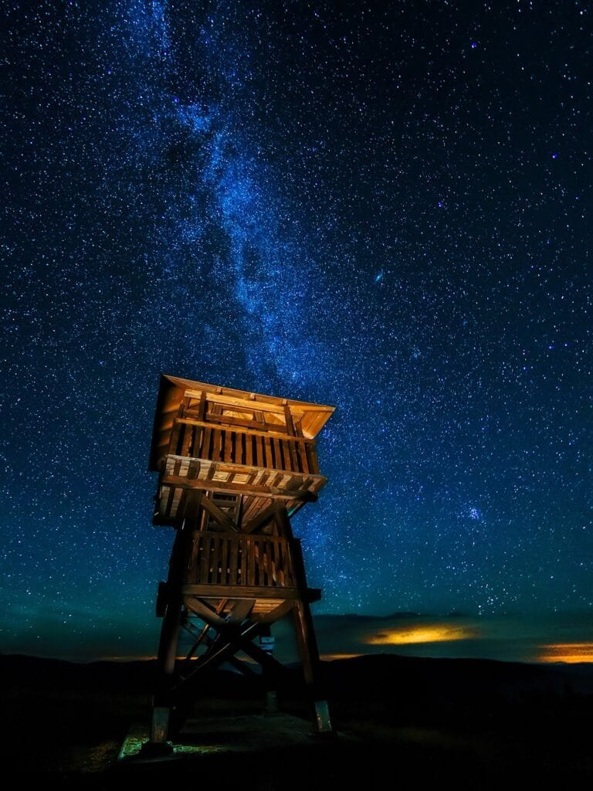

Have you ever wondered about the effects of volcanic eruptions on celestial bodies? Well, in this article, we will be taking a closer look at the fascinating topic of the effects of volcanic eruptions on Uranus's moons. Volcanoes, as we know, are formed by the release of molten rock, gases, and debris, causing eruptions of lava and ash. However, in the case of Uranus's moons, the volcanoes present a unique set of characteristics and phenomena. From the types of volcanoes found on these moons to the potential hazards and benefits associated with their eruptions, we will explore the intriguing world of volcanic activity in the outer regions of our solar system. So, buckle up and get ready to embark on an intergalactic volcanic adventure!

This image is property of pixabay.com.

## Why Do Uranus's Moons Experience Volcanic Eruptions?

Uranus's moons, while often overlooked in discussions about volcanic activity, actually experience frequent volcanic eruptions. This phenomenon is intriguing considering the distance of these moons from the Sun and the lack of significant geological activity observed on other bodies in the solar system. Understanding why these moons exhibit volcanic eruptions requires exploring their nature, the existence of potential volcanic activity, the source of heat triggering the eruptions, and the role of Uranus's gravity.

### The Nature of Uranus's Moons

Uranus has a total of 27 known moons, each with its own unique characteristics. These moons are categorized into two groups based on their properties: small, irregular moons and larger, spherical moons. The irregular moons are believed to be captured asteroids or Kuiper Belt objects, while the spherical moons are thought to have formed in orbit around Uranus during the early stages of the solar system. Despite their differing origins, both groups of moons demonstrate the potential for volcanic activity.

### The Existence of Potential Volcanic Activity

Although the moons of Uranus are composed primarily of ice and rock, evidence suggests that they possess sufficient geological activity to generate volcanic eruptions. This capability is likely due to the tidal heating caused by the gravitational interactions between the moons and Uranus itself. Tidal heating occurs when the gravitational forces exerted by a massive planet, such as Uranus, cause the moons to flex and stretch. This constant flexing generates heat within the moon's interior, leading to volcanic activity.

### The Source of Heat Triggering the Eruptions

The heat responsible for triggering volcanic eruptions on Uranus's moons can be attributed to two primary sources. The first source is the residual heat left over from the formation of these moons billions of years ago. Although the internal heat of these moons has decreased significantly since their formation, it is still sufficient to produce volcanic activity. The second source of heat is the tidal interactions with Uranus, as mentioned earlier. This heating effect is particularly significant for moons that are tidally locked, meaning they always present the same face to Uranus due to their orbital characteristics.

### The Role of Uranus's Gravity

The gravitational influence of Uranus plays a crucial role in the volcanic eruptions experienced by its moons. Uranus's gravitational pull causes the moons to be tidally stretched and squeezed, generating the necessary heat and energy for volcanic activity. The intensity of this tidal heating varies depending on the moon's distance from Uranus. Closer moons experience stronger tidal forces, resulting in more frequent and larger volcanic eruptions. Additionally, Uranus's gravity affects the distribution of the volcanic features on the moons' surfaces, shaping their topography and geological characteristics.

## Tectonic Activity on Uranus's Moons

The tectonic activity on Uranus's moons, fueled by tidal heating and other factors, contributes to the occurrence of volcanic eruptions. Tectonic activity refers to the movement and deformation of the moon's surface, driven by internal forces. The role of tidal heating and the presence of fault lines and cracks are essential in understanding the tectonic activity on these moons.

### The Role of Tidal Heating

As previously mentioned, tidal heating is a significant factor in the tectonic activity observed on Uranus's moons. The gravitational forces exerted by Uranus cause these moons to experience deformation, resulting in the formation of faults and cracks on their surfaces. This constant flexing and stretching create additional stress within the moon's interior, leading to a higher likelihood of volcanic eruptions.

### The Presence of Fault Lines and Cracks

The presence of fault lines and cracks on Uranus's moons is another key indicator of their geological activity. These features form as a result of the tectonic forces at play, caused by tidal heating and the internal heat of the moons. Fault lines act as pathways for magma to reach the moon's surface during volcanic eruptions. The interplay of fault lines, cracks, and tectonic forces contributes to the overall dynamic [nature and geological](https://magmamatters.com/the-environmental-impact-of-volcanic-eruptions-2/ "The Environmental Impact of Volcanic Eruptions") evolution of these moons.

This image is property of pixabay.com.

## Evidence of Volcanic Eruptions on Uranus's Moons

The existence of volcanic eruptions on Uranus's moons is supported by various forms of evidence. From observational data to the impact of volcanic features on moon topography, these pieces of evidence shed light on the ongoing geological processes taking place on these distant celestial bodies.

### Observational Evidence

Observations made by telescopes and space probes reveal the presence of plumes of gases and particles emanating from the surfaces of Uranus's moons. These plumes are typically associated with volcanic eruptions and provide direct visual evidence of ongoing geological activity. Additionally, high-resolution images captured by spacecraft like Voyager 2 and the Hubble Space Telescope have revealed volcanic structures, such as calderas and lava flows, further confirming the existence of volcanic eruptions.

### The Impact of Volcanic Features on Moon Topography

The presence of volcanic features, including mountains, valleys, and plains, is a clear indication of past and ongoing volcanic activity on Uranus's moons. These features alter the moon's topography and provide insights into the intensity and frequency of volcanic eruptions. The distinctive shapes and structures created by volcanic activity help scientists understand the dynamic geological processes occurring on these moons.

### Chemical Evidence of Volcanic Activity

Analyzing the composition of gases released during volcanic eruptions provides valuable chemical evidence of volcanic activity on Uranus's moons. Spectroscopic studies of the gas plumes surrounding these moons reveal the presence of sulfur compounds and other volatile materials commonly associated with volcanic eruptions. These chemical signatures, combined with other evidence, contribute to a [comprehensive understanding of the volcanic](https://magmamatters.com/understanding-volcanic-formation-a-comprehensive-guide/ "Understanding Volcanic Formation: A Comprehensive Guide") processes at play.

## Types of Volcanic Eruptions on Uranus's Moons

Similar to volcanic activity on Earth, the eruptions on Uranus's moons can be classified into different types. These classifications depend on the characteristics of the eruptions, such as explosiveness and the flow of lava. Understanding the types of volcanic eruptions provides valuable insights into the mechanisms and dynamics of these extraterrestrial volcanic processes.

### Explosive Eruptions

Explosive volcanic eruptions on Uranus's moons occur when highly pressurized gases and magma are violently expelled from the moon's interior to its surface. These eruptions are characterized by the rapid release of energy, resulting in explosive bursts of lava, gases, and volcanic ash. These explosive events can create large-scale plumes and ejecta that can travel significant distances from the eruption site.

### Effusive Eruptions

Effusive volcanic eruptions, on the other hand, are less explosive and involve the relatively slow and steady flow of lava onto the moon's surface. In these eruptions, magma with low gas content rises to the surface and gently effuses, creating lava flows that spread over the surrounding terrain. These eruptions contribute to the gradual formation of extensive volcanic plains and shield-like structures on Uranus's moons.

### Comparison with Earth's Volcanic Eruptions

While the basic principles of volcanic eruptions apply to Uranus's moons, the specific characteristics and outcomes of these eruptions differ from those on Earth. The lack of a substantial atmosphere and the lower gravity on Uranus's moons can significantly influence the behavior and appearance of volcanic eruptions. Gravity plays a significant role in controlling the flow and distribution of volcanic materials, resulting in unique landscapes and landforms compared to Earth's volcanic regions.

This image is property of pixabay.com.

## Lava Composition and Viscosity on Uranus's Moons

The composition and viscosity of the lava involved in volcanic eruptions on Uranus's moons differ from the lava found on Earth. These differences have significant implications for the eruption patterns and volcanic landforms observed on these celestial bodies.

### Difference in Lava Composition from Earth's Volcanic Lava

The lava composition on Uranus's moons is primarily composed of molten rock, but with a higher proportion of ice compared to the lava found on Earth. This high ice content reflects the abundant presence of water ice within the moon's interior. The molten rock and ice mixture produces a unique type of lava, which can influence the behavior, temperature, and flow dynamics of the eruptions. The composition of this lava also contributes to the distinct colors observed on the moons' surfaces.

### Implications of Lava Viscosity on Eruption Patterns

Lava viscosity, a measure of how easily a substance flows, is another critical factor in understanding the eruption patterns on Uranus's moons. The lava on these moons tends to have higher viscosity due to the presence of ice. This higher viscosity can result in more explosive eruptions compared to those on Earth, as the pressure builds up within the molten rock and ice mixture. Additionally, the slower flow of lava with higher viscosity contributes to the formation of distinctive volcanic landforms and structures.

## Impact of Volcanic Eruptions on Moons' Atmospheres

Volcanic eruptions on Uranus's moons can have significant impacts on their thin atmospheres, leading to changes in composition, temperature, and even weather patterns. These volcanic influences provide valuable insights into the overall dynamics and evolution of both the moons themselves and other celestial bodies in the solar system.

### Changes in Atmospheric Composition

The release of [volcanic gases](https://magmamatters.com/the-art-and-science-of-volcano-monitoring/ "The Art and Science of Volcano Monitoring") during eruptions can alter the composition of the moons' atmospheres. These gases may include sulfur compounds, [carbon dioxide](https://magmamatters.com/geothermal-energy-and-its-volcanic-origins/ "Geothermal Energy and Its Volcanic Origins"), and water vapor, among others. Volcanic eruptions on Enceladus, one of Uranus's moons, have been observed to contribute to the moon's thin atmosphere, enriching it with water vapor. Understanding these changes in atmospheric composition helps scientists better comprehend the geological and chemical processes occurring on these moons.

### Effects on Temperature and Weather Patterns

The release of heat and gases during volcanic eruptions can influence the temperature and weather patterns on Uranus's moons. The heat generated by the eruptions can cause localized warming, affecting the immediate vicinity of the eruption site. This localized temperature increase can lead to temporary weather patterns, such as the formation of clouds and transient temperature variations. These volcanic influences on the moons' climates provide valuable insights into the complex interactions between geological activity and atmospheric conditions.

## Impact of Volcanic Eruptions on Moons' Surfaces

Volcanic eruptions on Uranus's moons have a profound impact on the physical and geological features of their surfaces. The formation of new landforms, changes to existing geographical features, and variations in colors and albedo are all consequences of these volcanic processes.

### Formation of New Landforms

Volcanic eruptions result in the formation of various landforms on the surfaces of Uranus's moons. These landforms include volcanic domes, calderas, lava channels, and even cryovolcanoes, which erupt ice instead of molten rock. These distinct volcanic features reshape the moons' surfaces and contribute to their overall geological evolution.

### Changes to Existing Geographical Features

Volcanic eruptions can also modify previously existing geographical features on Uranus's moons. The deposition of fresh lava and volcanic materials can bury or erode existing terrain, altering the moon's surface morphology. Furthermore, volcanic activities can lead to the formation of fractures, fault lines, and grabens, often associated with the movement of tectonic plates. These changes to existing features provide valuable insights into the dynamic nature of the moons' geology.

### Impact on Moons' Colors and Albedo

The volcanic activity on Uranus's moons can have an impact on their colors and albedo, which refers to the reflectivity of the moon's surface. The release of gases and the deposition of volcanic materials can change the surface reflectance properties, resulting in variations in color and overall brightness. These alterations in color and albedo help scientists understand the composition and mineralogy of the moon's surface and can provide further clues about its geological history.

## Potential for Life on Uranus's Volcanic Moons

While the prospect of life existing on Uranus's moons is speculative, the volcanic activity observed on these celestial bodies raises intriguing possibilities. The heat and energy sources provided by volcanic eruptions, along with the presence of potential living conditions, create an environment that could support the emergence and sustenance of life.

### Heat and Energy Sources

Volcanic eruptions release substantial amounts of heat and energy into the surrounding environment. This release of energy can provide a viable source of warmth and nourishment for potential life forms on Uranus's moons. The combination of heat and chemical energy derived from volcanic processes represents an energy-rich environment, which is a prerequisite for the survival and growth of living organisms.

### Presence of Potential Living Conditions

The volcanic activity on Uranus's moons, particularly the release of gases and the presence of liquid water beneath the moon's icy surface, creates conditions that could support life as we know it. The existence of liquid water, an essential ingredient for life, increases the possibility of habitable environments within these celestial bodies. Furthermore, the chemical reactions resulting from volcanic emissions may provide the necessary building blocks for the formation of organic compounds, further enhancing the potential for life.

### Possibility of Habitual Zones

The combination of heat, energy sources, and favorable environmental conditions associated with volcanic activity can lead to the establishment of habitual zones on Uranus's moons. Habitual zones refer to regions within a celestial body where conditions are deemed suitable for life to thrive. The presence of volcanic activity increases the likelihood of these zones existing, providing scientists with potential targets for further exploration and investigations into the possibility of life beyond Earth.

## Long-term Effects of Volcanic Eruptions on Uranus's Moons

Besides the immediate impacts of volcanic eruptions, these events can have profound long-term effects on the moons' orbits, rotation, and overall geological evolution. Understanding these long-term effects is crucial for predicting the future of these moons and assessing their potential for colonization and exploration.

### Changes to Orbit and Rotation

Volcanic eruptions can cause subtle changes in the mass distribution within a moon, leading to alterations in its orbit and rotation. The release of volcanic materials and gases can redistribute mass, causing shifts in the center of mass of the moon. These changes influence the moon's orbit, resulting in variations in its distance from Uranus and the eccentricity of its orbit. Additionally, the redistribution of mass can affect the moon's rotation rate, potentially leading to changes in its axial tilt and periodic variations in its day-night cycle.

### Implications for Potential Colonization in the Future

The long-term effects of volcanic eruptions on Uranus's moons have practical implications for potential colonization efforts in the future. The redistribution of mass caused by volcanic activity can influence the stability of infrastructure and alter the resource availability on these moons. Understanding these long-term effects is crucial for planning sustainable colonization missions and ensuring the success of future human exploration.

## How Scientists Study Volcanic Eruptions on Uranus's Moons

Studying volcanic eruptions on Uranus's moons presents unique challenges due to their considerable distance from Earth and the limitations of current space exploration capabilities. Nevertheless, scientists employ various methods and tools to investigate these extraterrestrial volcanic processes and gain deeper insights into the moons' geology.

### Use of Telescopes and Satellites

Observational data is crucial for studying volcanic eruptions on Uranus's moons. Scientists utilize ground-based telescopes and space-based satellites equipped with powerful imaging instruments to capture high-resolution images and spectroscopic data. These observations provide valuable information about the frequency, intensity, and composition of volcanic eruptions, helping researchers piece together the volcanic history of these moons.

### Empirical Models and Simulations

To better understand the complexities of volcanic eruptions on Uranus's moons, scientists develop empirical models and simulations based on data collected from observations and laboratory experiments. These models simulate the behavior of volcanic processes and help researchers predict and analyze the characteristics and outcomes of eruptions. By refining these models, scientists can gain insights into the underlying mechanisms driving volcanic activity on these moons.

### Comparative Planetology

Comparative planetology involves studying the similarities and differences between Earth and other celestial bodies to deepen our understanding of planetary processes. By comparing volcanic activity on Uranus's moons with that of Earth and other volcanic bodies in the solar system, scientists can identify unique features, potential drivers, and the underlying physics governing these eruptions. This comparative approach enhances our knowledge of volcanic processes as a whole and provides valuable insights into the peculiarities of volcanic activity on Uranus's moons.

### Future Missions and Exploration Plans

To further study the volcanic eruptions on Uranus's moons, future missions and exploration plans are in the works. These missions aim to send spacecraft with advanced imaging equipment and scientific instruments to provide a more detailed and comprehensive understanding of the geology and volcanic activity on these distant celestial bodies. These missions will help scientists gather new data and expand our knowledge of the volcanic processes occurring on Uranus's moons.

In conclusion, the volcanic eruptions experienced by Uranus's moons offer a fascinating area of study. Through investigating the nature of these moons, the existence of potential volcanic activity, the heat sources triggering the eruptions, and the role of Uranus's gravity, scientists can gain valuable insights into the dynamics of these extraterrestrial volcanic processes. Furthermore, understanding the tectonic activity, evidence of eruptions, types of eruptions, lava composition and viscosity, and the impact on atmospheres and surfaces provides key information about the geological evolution of these moons. The potential for life and the long-term effects of volcanic eruptions further expand the scientific interest in these phenomena. By utilizing telescopes, satellites, empirical models, simulations, and a comparative approach, scientists can continue to explore and unlock the mysteries of Uranus's volcanic moons. With future missions and exploration plans, our knowledge of these distant celestial bodies will continue to expand, contributing to our understanding of the solar system's formation and the potential for life beyond our planet.

