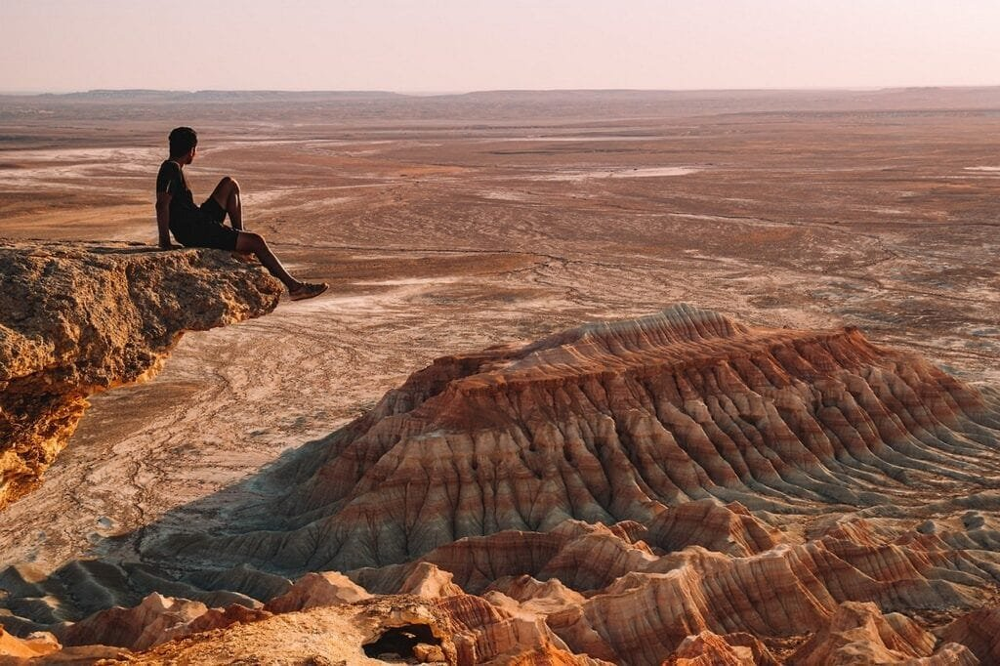
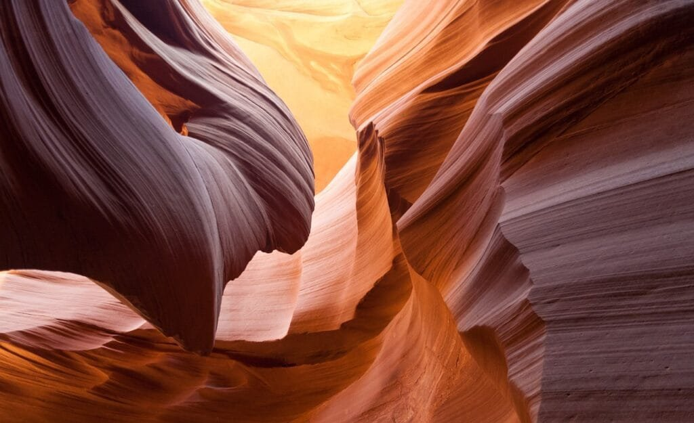

Are you ready to explore the captivating world of volcanic landforms? From the explosive eruptions along the Ring of Fire to the gradual formations of shield volcanoes in Hawaii, the fascinating process of how volcanoes are created and the impact they have on our planet is truly awe-inspiring. By understanding the different types of volcanoes, their geographic distribution, and the causes and hazards of eruptions, you'll gain insight into not only their beauty and power, but also how to predict future activity and protect communities at risk. So, whether you're a curious beginner or an aspiring volcanologist, get ready to embark on an extraordinary journey into the mesmerizing realm of volcanic landforms.

This image is property of pixabay.com.

## Why Are Volcanic Landforms Fascinating for Beginners

Volcanoes have long captured the fascination of people around the world. The sheer power and unpredictable nature of these natural formations make them a topic of great interest for beginners in the field of geology. Exploring volcanoes allows us to delve into the incredible geological processes that shape our planet, and understand the impact they have on geography, climate, and human life. Additionally, the field of volcanology is constantly evolving, with new research and theories being developed, making it an exciting area for beginners to explore and contribute to.

## Formation of Volcanoes

To truly appreciate the fascinating nature of volcanoes, it's important to [understand the geological processes that lead to their formation](https://magmamatters.com/understanding-volcanic-formation-a-comprehensive-guide/ "Understanding Volcanic Formation: A Comprehensive Guide"). Volcanoes are created when molten rock, known as magma, rises to the Earth's surface. This magma is formed through the melting of rock deep below the surface, often due to the movement of tectonic plates. As the magma rises, it can create explosive eruptions or gentle flows, depending on various factors.

The movement of tectonic plates plays a significant role in volcano formation. Most volcanoes are found at plate boundaries, where the Earth's crust is either colliding or spreading apart. At convergent plate boundaries, where plates are moving towards each other, one plate is often forced beneath the other, causing magma to rise and form volcanoes. At divergent plate boundaries, where plates are moving apart, magma can rise to fill the gap, leading to the formation of underwater volcanoes and mid-oceanic ridges.

Eruptions are a crucial aspect of volcanoes, and understanding their mechanisms is key to comprehending their formation. Eruptions occur when pressure builds up within a volcano's magma chamber, causing the magma to rise to the surface. The type of eruption depends on various factors, including the composition of the magma and the presence of gases. Some eruptions are characterized by explosive releases of ash and pyroclastic material, while others involve gentle flows of lava.

<iframe width="560" height="315" src="https://www.youtube.com/embed/Nboq5zsLxFE" frameborder="0" allow="accelerometer; autoplay; encrypted-media; gyroscope; picture-in-picture" allowfullscreen></iframe>

  

## Types of Volcanoes

There are several types of volcanoes, each with its own unique features and formation processes. Shield volcanoes, for example, are known for their broad, gently sloping sides and are formed by the accumulation of fluid basaltic lava flows. These volcanoes often form over hotspots, which are areas of intense volcanic activity beneath the Earth's surface.

Stratovolcanoes, on the other hand, are characterized by their steep sides and conical shape. These volcanoes are formed by alternating layers of lava, ash, and pyroclastic material. Stratovolcanoes are often found at convergent plate boundaries, where the collision of tectonic plates creates the ideal conditions for their formation.

Cinder cone volcanoes are the simplest form of volcanoes and are formed by the eruption of pyroclastic material such as ash and cinders. These volcanoes are typically small in size and have steep sides. They can form as standalone cones or can be found on the flanks of larger volcanoes.

## Physical Characteristics of Volcanoes

The physical characteristics of volcanoes are varied and depend on several factors, including the type of eruption and the composition of the magma. One key aspect is the presence of a crater, which is a depression at the top of the volcano. The crater is the result of the explosive release of gases and volcanic material during eruptions.

Beneath the crater lies the vent, which is the opening through which magma and gases are released during eruptions. The vent can be located at the summit of the volcano or along its flanks. It plays a crucial role in allowing the volcano to release pressure and prevent a catastrophic buildup.

Within the volcano, there is a magma chamber, which is the reservoir for the molten rock. The size and shape of the magma chamber can vary greatly and have an impact on the eruption style and magnitude. Understanding the characteristics of the magma chamber is vital for predicting volcanic activity.

Volcanoes also come in various sizes and shapes, ranging from small cinder cones to massive shield volcanoes. The size and shape of a volcano are influenced by factors such as the volume and viscosity of the magma, as well as the duration and frequency of eruptions. These variations contribute to the unique and fascinating aspects of each volcano.

This image is property of pixabay.com.

## Geographic Distribution of Volcanoes

Volcanoes are not distributed randomly across the Earth's surface. Instead, they tend to concentrate in certain areas, providing valuable insight into plate tectonics and the movement of our planet's crust. One prominent region known for its high volcanic activity is the "Ring of Fire", which encircles the Pacific Ocean. This ring is a result of the collision and subduction of tectonic plates, which leads to the formation of numerous volcanic arcs.

Another significant location for volcanoes is along the mid-oceanic ridges, where tectonic plates are moving apart. This movement creates gaps that allow magma to rise, resulting in underwater volcanoes and the formation of new oceanic crust. These volcanoes play a crucial role in shaping the Earth's seafloor and have a significant impact on marine ecosystems.

Isolated hotspot volcanoes, such as those found in Hawaii, are another intriguing aspect of volcanic geography. These volcanoes are not associated with plate boundaries but are instead formed by mantle plumes, which are upwellings of hot and buoyant material from deep within the Earth. As the tectonic plate moves over the stationary hotspot, a series of volcanic islands or seamounts can form.

Understanding the geographic distribution of volcanoes allows us to gain a deeper appreciation for the dynamic nature of our planet and the powerful forces at work beneath its surface.

## The Role of Lava Viscosity and Gas Content in Volcano Formation

Lava viscosity and gas content are crucial factors that influence both the type of eruption and the landforms created by volcanoes. Viscosity refers to the resistance of a fluid to flow, and in the case of lava, it determines how easily it can travel and the style of eruption it produces.

Lava with low viscosity, such as basaltic lava, is more fluid and can flow rapidly across the landscape. This type of lava often leads to effusive eruptions, where lava flows freely from the volcano without significant explosive activity. Basaltic lava is commonly associated with shield volcanoes and tends to create gentle slopes.

On the other hand, lava with high viscosity, such as rhyolitic lava, is more sticky and does not flow as easily. This type of lava produces explosive eruptions, characterized by the fragmentation of the lava into pyroclastic material. Rhyolitic eruptions often result in the formation of stratovolcanoes, with steep sides due to the accumulation of ash and pyroclastic material.

The gas content within the magma also plays a significant role in eruption style. As magma rises to the surface, the decrease in pressure causes dissolved gases to exsolve and form bubbles within the magma. The presence of gas bubbles can lead to explosive eruptions, as the rapid expansion of gases propels volcanic material into the air. Higher gas content can result in more violent eruptions and the creation of volcanic features such as ash clouds and pyroclastic flows.

Different combinations of lava viscosity and gas content contribute to the wide range of eruption styles seen in volcanoes worldwide. Understanding these factors is essential for predicting volcanic hazards and protecting communities in volcanic regions.

This image is property of pixabay.com.

## The Hazards of Volcanic Eruptions

While volcanoes are undeniably fascinating, they also pose significant hazards to human life and the environment. Volcanic eruptions can unleash a variety of destructive forces, including lava flows, ash clouds, pyroclastic flows, and [volcanic gases](https://magmamatters.com/the-art-and-science-of-volcano-monitoring/ "The Art and Science of Volcano Monitoring").

Lava flows are streams of molten rock that can engulf everything in their path, destroying buildings, roads, and vegetation. These flows can be slow-moving or fast-paced, depending on the viscosity of the lava. While they may provide stunning visual displays, lava flows can have devastating consequences for nearby communities.

Ash clouds, composed of fine particles of fragmented rock, can be carried by winds for hundreds of kilometers, blanketing entire regions. Ashfall can cause respiratory problems, damage crops and infrastructure, and disrupt air travel. Accumulations of ash can also lead to the collapse of roofs under the weight, further adding to the dangers.

Pyroclastic flows are dense, fast-moving currents of hot gas, rock fragments, and volcanic ash that race down the slopes of a volcano. These flows can reach extremely high temperatures and speeds, obliterating anything in their path. Pyroclastic flows are among the deadliest volcanic hazards and have been responsible for numerous catastrophes throughout history.

Volcanic gases, released during eruptions, can pose both immediate and long-term threats to human health. Gases such as sulfur dioxide and hydrogen sulfide can cause respiratory problems and have toxic effects. Additionally, volcanic gases can have long-term impacts on climate and the environment, contributing to the formation of aerosols and acid rain.

Given the potential hazards associated with volcanic eruptions, it is crucial to develop strategies for disaster mitigation and preparedness. Communities at risk from volcanic activity should have early warning systems in place, evacuation plans, and education programs to ensure the safety of their residents. Monitoring volcanic activity and advances in technology play a crucial role in providing the necessary information for effective disaster response.

## Economic and Environmental Benefits of Volcanoes

Despite the hazards they pose, volcanoes also bring significant benefits to the environment and human societies. One of the key benefits is the creation of fertile soils. Volcanic eruptions deposit minerals and nutrients onto the land, enriching the soil and making it highly productive for agriculture. Regions with volcanic soil, such as the volcanic islands of Hawaii or the fertile slopes of Mount Vesuvius in Italy, have long been renowned for their agricultural productivity.

Volcanic activity also plays a crucial role in the formation of mineral deposits. Volcanic systems can transport and concentrate valuable minerals, such as gold, silver, and copper, in their lava flows. Over time, these deposits can be exposed through erosion or volcanic activity, leading to the discovery and extraction of valuable resources.

Additionally, volcanoes have a significant impact on climate and the atmosphere. During eruptions, large quantities of volcanic gases and particles are released into the air. These particles can reflect sunlight back into space, leading to a temporary cooling of the climate. The sulfur dioxide emitted during eruptions can react with water vapor to form sulfuric acid aerosols, which can contribute to the formation of stratospheric aerosol layers that have a cooling effect on the Earth's surface.

Understanding the economic and [environmental benefits of volcanoes](https://magmamatters.com/geothermal-energy-and-its-volcanic-origins/ "Geothermal Energy and Its Volcanic Origins") helps us appreciate the complex relationship between geological processes and their impact on human societies and the planet as a whole. However, it is important to balance these benefits with the potential hazards and develop sustainable approaches to coexist with volcanic activity.

## Predicting Volcanic Activity

Predicting volcanic activity is a challenging task that relies on careful monitoring and analysis of various indicators. Volcanologists use a combination of ground-based measurements, remote sensing techniques, and seismic monitoring to gather data on a volcano's activity.

Ground-based measurements involve monitoring changes in gas emissions, temperature, and ground deformation. These measurements can help identify patterns and anomalies that may indicate an impending eruption. Remote sensing techniques, such as satellite imagery and thermal cameras, provide valuable information on volcanic plumes, lava flows, and changes in surface temperature.

Seismic monitoring plays a crucial role in predicting volcanic activity by detecting the movement of magma and the occurrence of earthquakes. Volcanic earthquakes can indicate the movement of magma beneath the surface and the potential for an eruption. Monitoring the frequency, depth, and magnitude of these earthquakes can help scientists assess the level of volcanic unrest.

While extensive monitoring provides valuable data, predicting the exact timing and magnitude of volcanic eruptions remains a significant challenge. Volcanic systems are complex and influenced by many factors, making it difficult to pinpoint with certainty when an eruption will occur. However, advances in technology, such as improved monitoring networks and data analysis techniques, are enhancing our ability to make more accurate predictions and provide early warnings to at-risk communities.

## Future of Volcanology

Volcanology is a dynamic field that continues to evolve with new research, theories, and technological advancements. Current trends in volcanology encompass a wide range of topics, from studying the behavior of lava flows to exploring the geochemical processes within magma chambers. The use of advanced imaging techniques, such as lidar and drones, allows scientists to obtain detailed images of volcanic features and collect data that was previously difficult to obtain.

The impact of climate change on volcanic activity is also an area of increasing interest. Rising temperatures and changing atmospheric conditions can have complex effects on volcanic systems, potentially altering their behavior and eruption patterns. Studying the relationship between [climate change and volcanic](https://magmamatters.com/the-environmental-impact-of-volcanic-eruptions-2/ "The Environmental Impact of Volcanic Eruptions") activity is crucial for understanding the future impact of these natural phenomena.

Emerging technologies, such as machine learning and artificial intelligence, are revolutionizing the field of volcanology. These technologies can analyze large datasets more efficiently and help identify patterns and precursor signals of volcanic eruptions. Integrating these technologies into volcanic monitoring networks can enhance our ability to predict eruptions and mitigate the risks they pose to surrounding communities.

As our understanding of volcanic landforms and processes continues to expand, so does our appreciation for the intricate interplay between the Earth's forces and the impacts they have on our lives. The future of volcanology holds the promise of further advancements, revealing even more about the fascinating world of volcanoes and their role in shaping our planet.

