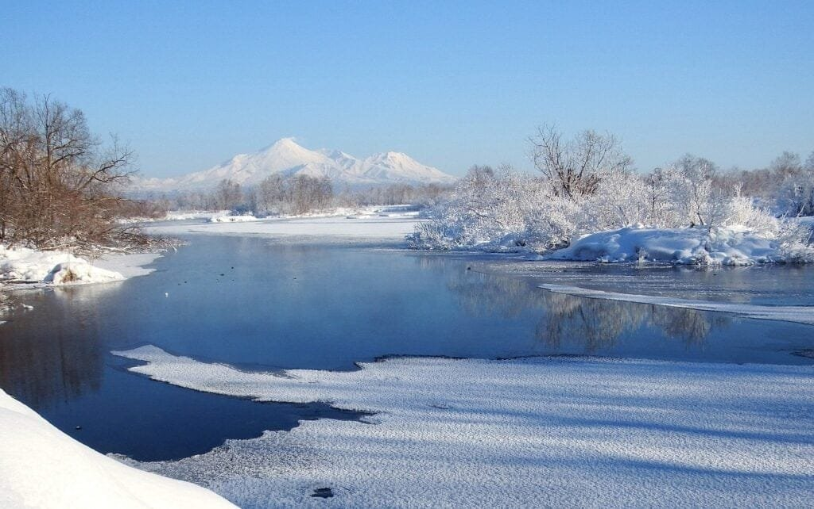

Volcanoes play a crucial role in the formation and function of Earth's crust. When molten rock, gases, and debris escape to the surface, volcanic eruptions occur, spewing out lava and ash. These awe-inspiring natural phenomena are typically found at plate boundaries, hotspots beneath the Earth's crust, or rift zones where tectonic plates are moving apart. The "Ring of Fire" around the Pacific Ocean is a prime example of this, as it is situated in areas where tectonic plates meet, making it highly prone to volcanic activity. On the other hand, shield volcanoes in places like Hawaii form gradually over hot spots deep underground and have less explosive eruptions. Understanding the various types of [volcanoes](https://magmamatters.com/the-art-and-science-of-volcano-monitoring/ "The Art and Science of Volcano Monitoring"), their geographic distribution, eruption patterns, and the hazards they pose is crucial for predicting future activity and mitigating risks to surrounding communities. Moreover, volcanic eruptions also have their benefits, such as providing valuable nutrients to the soil. By delving into the fascinating world of volcanoes, we can gain a deeper understanding of their vital role in Earth's crust formation.

## Formation of Volcanoes

This image is property of pixabay.com.

### Process of Volcanic Activity

Volcanic activity is a result of the movement of molten rock, gases, and debris from the earth's interior to the surface. It begins with the melting of rock deep within the earth, forming a hot, liquid substance called magma. As magma rises due to buoyancy, it collects in magma chambers beneath the surface. When the pressure from the accumulating magma becomes too great, it forces its way to the surface through vents and fissures, resulting in an eruption.

During an eruption, magma may be expelled as lava, along with gases and solid particles such as ash and pyroclastic material. The exact type and intensity of eruption depend on the composition and viscosity of the magma. Lava flows can slowly move down the volcano's slopes, while explosive eruptions can release a significant amount of ash and debris into the atmosphere.

### Role of Tectonic Plates

Tectonic plates, which make up the Earth's crust, play a crucial role in the formation of volcanoes. Most volcanic activity is concentrated along plate boundaries, where plates interact with each other. The two main types of plate boundaries associated with volcanism are convergent and divergent boundaries.

At convergent plate boundaries, where two plates collide, one plate may be forced beneath the other in a process called subduction. As the subducting plate sinks into the hotter regions of the mantle, the heat causes the release of fluids and melting of the rock, resulting in the formation of magma. This magma then rises to the surface, leading to the formation of volcanic arcs, such as the Cascade Range in North America.

Divergent plate boundaries, on the other hand, occur where plates move apart. As the plates separate, magma from the mantle can rise to fill the gap, forming new crust and creating volcanic activity along the rift zone. One well-known example of a divergent plate boundary is the Mid-Atlantic Ridge, where volcanic activity contributes to the formation of new oceanic crust.

This image is property of pixabay.com.

### Impact of Magma on Volcano Formation

Magma plays a crucial role in the formation and structure of volcanoes. The composition of the magma, which is determined by the types of rocks it originates from, affects the volcano's eruptive behavior and the types of eruptions it produces.

Magma that is rich in silica has a higher viscosity, meaning it is thick and flows less easily. This type of magma tends to trap gases within it, leading to more explosive eruptions. [Volcanoes formed from silica-rich magmas are typically stratovolcanoes](https://magmamatters.com/understanding-volcanic-formation-a-comprehensive-guide/ "Understanding Volcanic Formation: A Comprehensive Guide"), characterized by steep slopes and alternating layers of lava and ash.

On the other hand, magma with lower silica content has lower viscosity and can flow more easily. This type of magma is associated with shield volcanoes, which have broad, gentle slopes. Eruptions of shield volcanoes are often less explosive and characterized by the effusion of lava flows.

### Hotspots and Rift Zones in Volcano Formation

Hotspots and rift zones are additional factors contributing to volcano formation. Hotspots are areas of intense volcanic activity that are not directly associated with plate boundaries. They occur due to mantle plumes, which are columns of hot rock rising from the deep mantle. As the tectonic plate moves over the hotspot, a chain of volcanoes is formed. The Hawaiian Islands, with their shield volcanoes, are a prime example of hotspot activity.

Rift zones, on the other hand, are locations where the Earth's tectonic plates are moving apart. As the plates separate, magma rises to fill the gap, creating a chain of volcanoes along the rift. The East African Rift Valley is a well-known example of a rift zone, where volcanoes such as Mount Kilimanjaro and Mount Nyiragongo are formed.

Understanding these processes and their effects on volcano formation is crucial in comprehending the diversity and distribution of volcanoes worldwide. By studying the interaction between tectonic plates, magma composition, and geological features like hotspots and rift zones, scientists can gain insight into the complex mechanisms that shape our planet's surface.

