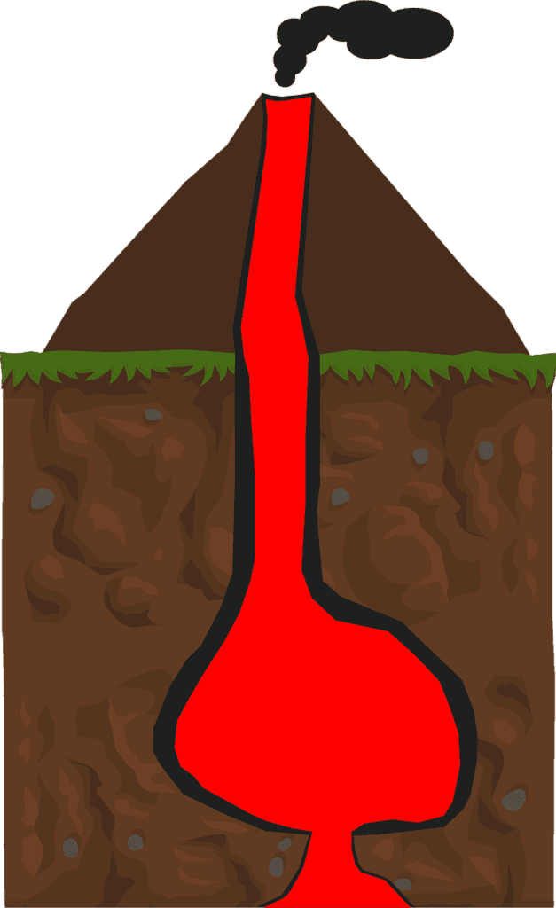

Imagine standing on a vast landscape, with towering mountains and a breathtaking view stretching out before you. Now, imagine if all of this was formed by the powerful forces of volcanic eruptions. Volcanoes, with their fiery displays of molten rock and ash, have been shaping our world for millions of years. From the creation of majestic mountains to the destruction of entire cities, volcanic eruptions have left an indelible mark on our landscape. In this article, we will explore the formation and impact of volcanic eruptions, delving into the different types of volcanoes, their geographic distribution, eruption causes, and the hazards and benefits they bring. So, get ready to embark on an exciting journey as we uncover the fascinating world of [volcanoes and discover why they play such a crucial role](https://magmamatters.com/the-role-of-volcanoes-in-earths-carbon-cycle-5/ "The Role Of Volcanoes In Earth’s Carbon Cycle") in shaping our surroundings.

  

## The Formation of Volcanoes

Volcanoes are fascinating natural formations that have captivated humans for centuries. Understanding the formation process of volcanoes is essential for comprehending their behavior and predicting potential eruptions. Volcanoes are formed when molten rock, known as magma, rises to the Earth's surface. This molten rock can consist of various elements, including gases and debris. When the magma reaches the surface, it erupts in explosions of lava and ash, shaping the landscape around it.

There are three distinct classifications of volcanoes based on their activity: active, dormant, and extinct. Active volcanoes regularly erupt and pose an ongoing threat to the surrounding areas. Dormant volcanoes are currently inactive but have the potential to erupt in the future. Extinct volcanoes, on the other hand, are no longer active and have ceased to erupt.

Volcanoes can be found in different parts of the world, with varying geographic distribution. Many volcanoes occur at plate boundaries, where tectonic plates meet and interact. The movement and collision of these plates create intense pressure and heat that can lead to volcanic activity. Additionally, hotspots under the Earth's crust and rift zones where tectonic plates are moving apart are also common locations for volcano formation.

The role of tectonic plates in volcano formation and activity cannot be understated. Tectonic plates are massive slabs of the Earth's lithosphere that are constantly moving. When these plates collide or separate, they can cause the release of magma, resulting in volcanic eruptions. The interaction between these plates and the release of pressure and heat contribute to the creation and maintenance of volcanoes.

The process of volcano formation can lead to the creation of different types of volcanoes. Shield volcanoes, composite volcanoes, and cinder cone volcanoes are among the most well-known and studied types. Shield volcanoes, such as those found in Hawaii, form gradually over hotspots deep underground. These volcanoes have broad, gently sloping sides due to the flow of low-viscosity lava. Composite volcanoes, also known as stratovolcanoes, are built up of layers of lava and ash. They typically have steep sides and can be found in areas like the "Ring of Fire" encircling the Pacific Ocean. Cinder cone volcanoes are smaller in size and are typically formed by the accumulation of ash and cinders around a vent.

## Factors Influencing Volcanic Eruptions

Understanding the factors that influence volcanic eruptions is crucial for assessing their potential impact and developing strategies for risk management. Two primary factors that contribute to volcanic eruptions are magma and gas pressures.

Magma, the molten rock beneath the Earth's surface, plays a significant role in volcanic eruptions. The composition and viscosity of magma determine how it behaves during an eruption. Magma with high viscosity tends to be thick, sticky, and slow-moving, making it more likely to cause explosive eruptions. On the other hand, magma with low viscosity flows more easily, resulting in less explosive eruptions. The composition of the magma also affects its eruptive characteristics, with different elements and minerals contributing to varying eruption styles.

Gas pressures within the magma chamber also influence volcanic eruptions. Volcanic gases, such as water vapor, carbon dioxide, and sulfur dioxide, are dissolved in the magma. As the magma rises to the surface, the decrease in pressure causes the gases to expand and form bubbles. These gas bubbles create additional pressure within the magma chamber, increasing the likelihood of a volcanic eruption. The explosiveness of an eruption is often linked to the gas content and the ability of these gases to escape from the magma before reaching the surface.

Another significant factor in volcanic eruptions is the release of ash into the atmosphere. Ash emissions occur when solidified volcanic materials, such as small rock fragments and glass shards, are expelled during an eruption. These particles can be carried by wind for hundreds of miles and have various effects on both the environment and human health. Ash emissions can disrupt air travel, contaminate water sources, and cause respiratory issues for individuals living in proximity to the eruption.

## Patterns of Volcanic Eruptions

Volcanic eruptions display distinct patterns, which can help scientists categorize and understand their behavior. Two common eruption types are explosive eruptions and effusive eruptions.

Explosive eruptions are characterized by the violent expulsion of gases, ash, and lava fragments from a volcano. These eruptions are typically associated with viscous magma and high gas pressures. The eruption plumes can reach high altitudes, and volcanic ash can spread across vast areas, impacting both the immediate surroundings and the global climate. Explosive eruptions are often unpredictable and can result in significant damage to infrastructure and human lives.

In contrast, effusive eruptions are characterized by the slow and steady flow of magma onto the Earth's surface. These eruptions are typically associated with low-viscosity magma and lower gas pressures. The lava flows from the volcano's vent and can create new landforms as it cools and solidifies. Effusive eruptions are generally less explosive and pose less immediate danger to nearby communities, but they can still cause damage and disruption to the surrounding areas.

Understanding the magnitude and frequency of volcanic eruptions is essential for assessing their potential impact and managing risks. Magnitude refers to the size and intensity of an eruption, while frequency refers to how often eruptions occur. Some volcanoes may have infrequent but highly explosive eruptions, while others may have more frequent but less severe eruptions. By studying past volcanic activity and monitoring current volcanic behavior, scientists can estimate the risk level and potential impact of future eruptions.

This image is property of pixabay.com.

## Volcanoes and the 'Ring of Fire'

The "Ring of Fire" is a phrase used to describe a region encircling the Pacific Ocean that is known for its high volcanic and seismic activity. This area, also referred to as the Circum-Pacific Belt, is home to a significant portion of the world's active volcanoes. Understanding the geologic context and common characteristics of volcanoes in the "Ring of Fire" can provide valuable insights into their behavior and potential impacts.

The "Ring of Fire" is a direct result of the intense tectonic activity along the Pacific Plate boundaries. The Pacific Plate is one of the largest tectonic plates, and its borders with neighboring plates create areas of high volcanic activity. The subduction zones, where one tectonic plate is forced beneath another, are particularly prone to volcanic eruptions in the "Ring of Fire." The intense heat, pressure, and interactions between the plates lead to the formation of explosive composite volcanoes.

Volcanoes in the "Ring of Fire" often exhibit common characteristics due to their shared geologic context. These volcanoes are typically associated with explosive eruptions, as the magma composition in the region tends to be more viscous. The presence of subduction zones also contributes to the high gas content in the magma, further increasing the explosiveness of the eruptions. Additionally, the volcanic activity in this area is often accompanied by tectonic earthquakes, further highlighting the dynamic nature of the region.

The impact of volcanoes in the "Ring of Fire" extends beyond the local areas where they are located. The frequent volcanic eruptions and associated earthquakes in the region contribute to global seismic activity. Volcanic ash and gases released during eruptions can reach the upper atmosphere and have implications for climate change. Volcanic activity in the "Ring of Fire" has been linked to significant shifts in weather patterns and the Earth's temperature due to the release of greenhouse gases.

## Hotspot Volcanoes

Hotspot volcanoes are distinct from those found at plate boundaries and are formed by a different mechanism. These volcanoes are associated with localized areas of intense volcanic activity, known as hotspots, beneath the Earth's surface. Understanding the formation and characteristics of hotspot volcanoes, such as those found in Hawaii, provides valuable insights into the geologic processes at work.

Hotspot volcanoes are believed to result from a relatively stationary source of magma deep within the Earth's mantle. As a tectonic plate moves over this hotspot, a volcano is formed on the Earth's surface. The movement of the plate carries the volcano away from the hotspot, eventually resulting in its extinction. However, new volcanoes continue to form as the plate moves over the hotspot, creating a chain of volcanic islands or seamounts.

The characteristics of hotspot volcanoes can differ from those found at plate boundaries. [Shield volcanoes are a common type of](https://magmamatters.com/understanding-volcanic-formation-a-comprehensive-guide/ "Understanding Volcanic Formation: A Comprehensive Guide") volcano formed by hotspots. These volcanoes have broad and gently sloping sides due to the low-viscosity lava that flows out of them. The Hawaiian Islands are a prime example of hotspot volcanoes, with Mauna Loa being one of the largest shield volcanoes in the world. The volcanic activity in Hawaii is relatively steady, with eruptions occurring regularly but typically not with the same explosiveness seen in composite volcanoes.

## The Impact of Volcanic Eruptions on Landscape Formation

Volcanic eruptions have a profound impact on the formation of landscapes. The materials expelled during eruptions, known as eruption products, contribute to the creation of various landforms. Understanding these landforms provides insights into the geologic history of an area and allows for a deeper understanding of volcanic processes.

Craters are common landforms resulting from volcanic eruptions. These bowl-shaped depressions form as the erupted material is removed from the volcano's vent. They can vary in size, with larger craters resulting from more explosive eruptions. Craters often contain lava lakes or small secondary vents.

Calderas are large, bowl-shaped depressions that form when a volcano collapses into itself during a massive eruption. These collapsed volcanic structures can be several kilometers in diameter and often contain lakes or other bodies of water. Calderas are the result of highly explosive eruptions and are typically associated with composite volcanoes.

Volcanic cones are another type of landform formed by volcanic eruptions. They are created when erupted material, such as ash and cinders, accumulates around the volcanic vent. These conical-shaped landforms can vary in size and are often associated with cinder cone volcanoes. Volcanic cones can be found in various environments, including subglacial areas and underwater.

The eruption products expelled during volcanic eruptions also contribute to the composition and characteristics of the surrounding landscape. Lava flows, which consist of molten rock that has cooled and solidified, create new landforms as they spread and solidify. These landforms can range from vast stretches of hardened lava, known as lava fields, to intricate lava tube systems.

## Effects of Volcanic Eruptions on Soil and Agriculture

While volcanic eruptions can be destructive, they also have a profound impact on soil fertility and agricultural productivity in the long run. Volcanic ash, one of the main eruption products, benefits soil in several ways.

Volcanic ash is rich in essential nutrients, such as nitrogen, phosphorus, and potassium. When ash settles on the ground, it gradually decomposes, releasing these nutrients into the soil. This process can significantly enhance soil fertility and provide crops with the necessary elements for growth. Volcanic ash also has excellent moisture-retention properties, helping to maintain proper soil hydration levels and reducing the need for irrigation.

However, farming near volcanoes does present unique challenges. Volcanic eruptions can result in the destruction of crops, livestock, and infrastructure. The rapid deposition of volcanic ash can bury and smother vegetation, rendering agricultural land temporarily unusable. Additionally, the release of volcanic gases, such as sulfur dioxide, during eruptions can have detrimental effects on plants and animals. These impacts require farmers to implement mitigation strategies, such as using protective covers for crops and adapting planting schedules, to minimize agricultural losses.

Despite the challenges, farming near volcanoes can provide long-term benefits. Volcanic soils are renowned for their exceptional fertility and can support a wide range of agricultural activities. The rich mineral content and superior water retention capabilities of volcanic soils contribute to increased crop yields and the cultivation of various crops, including coffee, fruits, and vegetables.

## Environmental Impact of Volcanic Eruptions

Volcanic eruptions have a significant impact on the environment, affecting air and water quality, as well as local wildlife and ecosystems. Understanding these environmental effects is crucial for assessing the long-term consequences of volcanic activity.

Volcanic gases, such as [sulfur dioxide and carbon](https://magmamatters.com/the-art-and-science-of-volcano-monitoring/ "The Art and Science of Volcano Monitoring") dioxide, released during eruptions can have significant effects on climate and air quality. Sulfur dioxide can react with water vapor in the atmosphere to form sulfuric acid, contributing to the formation of acid rain. This acid rain can have detrimental effects on vegetation, water bodies, and infrastructure. Carbon dioxide, a greenhouse gas, can contribute to global warming and climate change.

The release of volcanic ash during eruptions can lead to the deterioration of air quality. Fine ash particles, when inhaled, can cause respiratory issues and pose a health risk to humans and animals. Volcanic ash can also have a significant impact on aviation, disrupting air travel by damaging aircraft engines and interfering with visibility. The transportation of volcanic ash over long distances by wind can result in the contamination of water sources, impacting aquatic ecosystems and the availability of clean water for human consumption.

Volcanoes and their eruptions also have a profound impact on local wildlife and ecosystems. The immediate aftermath of an eruption can result in the destruction of habitats, forcing wildlife to relocate or adapt to new conditions. However, volcanic landscapes can also provide unique opportunities for the colonization of new species and the development of unique ecosystems. Over time, these ecosystems can become biodiverse and contribute to the overall health of the surrounding environment.

## Risks Associated with Volcanic Eruptions

Volcanic eruptions pose various risks to both natural and human environments. The potential for natural disasters, such as lava flows, lahars, and pyroclastic flows, must be taken into account when assessing volcanic hazards. Additionally, long-term societal impacts, including the need for relocation and economic effects, should be considered to mitigate risks appropriately.

Lava flows occur when molten rock, known as lava, is expelled from a volcano and flows down its sides. Lava flows can travel at varying speeds and distances, depending on factors such as lava viscosity and slope steepness. Although lava flows typically move at a slow pace, they can be destructive, causing property damage and potentially threatening human lives.

Lahars are fast-moving and highly destructive mudflows that occur when water mixes with volcanic ash or other loose sediments. These flows can travel great distances, following existing river valleys and causing significant damage to infrastructure, vegetation, and communities in their path. Lahars are particularly dangerous as they can occur even in relatively calm periods between volcanic eruptions.

[Pyroclastic flows are among the most dangerous volcanic hazards](https://magmamatters.com/the-environmental-impact-of-volcanic-eruptions-2/ "The Environmental Impact of Volcanic Eruptions"). They consist of a mixture of hot gases, ash, and other volcanic debris that rapidly moves down the slope of a volcano. Pyroclastic flows can reach speeds of hundreds of kilometers per hour and can incinerate everything in their path. These flows are highly destructive and can cause massive loss of life and property.

Volcanic eruptions can also have long-term societal impacts. In some cases, eruptions may force the evacuation and relocation of nearby communities. The destruction of homes and infrastructure can lead to the displacement of residents and significant economic losses. Volcanic eruptions can disrupt tourism, agriculture, and other industries, impacting local economies for an extended period.

## Predicting and Mitigating Volcanic Activity

Predicting volcanic activity and mitigating its potential impacts is crucial for protecting human lives and minimizing damage to infrastructure and the environment. Various methods and technologies are used for monitoring volcanic activity and forecasting eruptions.

Monitoring seismic activity is one of the primary methods for detecting volcanic unrest. By analyzing patterns of earthquake activity, scientists can gain insights into the movement and behavior of magma beneath the Earth's surface. Changes in the frequency and intensity of earthquakes can indicate increased volcanic activity and the potential for an eruption.

Measuring ground deformation is another valuable tool for monitoring volcanoes. Volcanic activity often causes the swelling or deflation of the Earth's surface due to the movement of magma. Ground-based instruments, such as GPS and tiltmeters, can detect and measure these changes, providing valuable data for eruption forecasting.

Gas emissions from volcanoes are also monitored to assess volcanic activity. The composition and quantity of gases emitted during eruptions can provide insights into the behavior of magma beneath the Earth's surface. Measuring and analyzing these gases can help identify changes in volcanic activity and anticipate potential eruptions.

Once volcanic activity is detected, appropriate risk management strategies can be implemented to protect surrounding communities. These strategies may include creating evacuation plans, establishing exclusion zones, and developing infrastructure that can withstand volcanic hazards. Education and public awareness campaigns also play a vital role in ensuring that individuals living near active volcanoes are aware of the risks and are prepared to respond to volcanic emergencies.

In conclusion, understanding the formation and impact of volcanic eruptions on our landscape is crucial for comprehending the inner workings of these unique natural phenomena. Volcanoes are formed when molten rock, gases, and debris escape to the Earth's surface, causing eruptions of lava and ash. The geographic distribution of volcanoes is influenced by plate boundaries, hotspots, and rift zones. Tectonic plates play a significant role in volcano formation, and the process gives rise to different types of volcanoes such as shield, composite, and cinder cone volcanoes.

Factors such as magma viscosity and gas pressures greatly influence volcanic eruptions. Explosive eruptions result from high-viscosity magma and high gas pressures, while effusive eruptions occur with low-viscosity magma and lower gas pressures. Volcanic eruptions also vary in magnitude and frequency, with different eruption types and characteristics contributing to the overall impact.

The "Ring of Fire" is a region known for its high volcanic and seismic activity due to intense tectonic movement along the Pacific Plate boundaries. Volcanoes in this area often exhibit common characteristics and have significant implications for global seismic activity and [climate change](https://magmamatters.com/geothermal-energy-and-its-volcanic-origins/ "Geothermal Energy and Its Volcanic Origins"). Hotspot volcanoes, like those in Hawaii, have different characteristics and are formed by stationary sources of magma beneath the Earth's surface.

The impact of volcanic eruptions extends beyond the immediate devastation caused by eruptions. Eruption products contribute to the formation of various landforms, such as craters, calderas, and volcanic cones. Volcanic ash also has significant effects on soil fertility and agriculture, providing both challenges and benefits for farming near volcanoes. Environmental impacts, including climate change, air and water quality, and impacts on wildlife and ecosystems, must be considered when assessing the consequences of volcanic eruptions.

Volcanic eruptions present various risks, including natural disasters such as lava flows, lahars, and pyroclastic flows. These eruptions can also have long-term societal impacts, such as the need for relocation and economic effects. By monitoring volcanic activity and employing risk management strategies, it is possible to predict and mitigate the impact of eruptions on surrounding communities.

In conclusion, the study of volcanoes is crucial for understanding the dynamic nature of our planet and the forces that shape our landscapes. By expanding our knowledge of volcanic phenomena, we can better prepare for and protect against their potential dangers while appreciating the remarkable natural wonders they present.

Related Posts: [Mitigating Risks: Forecasting Volcanic Activity in Prone Areas](https://magmamatters.com/mitigating-risks-forecasting-volcanic-activity-in-prone-areas/), [The Formation and Eruption Patterns of Volcanoes](https://magmamatters.com/the-formation-and-eruption-patterns-of-volcanoes-4/), [The Pyroclastic Phenomena of Pompeii: 7 Insights to Explore](https://magmamatters.com/the-pyroclastic-phenomena-of-pompeii-7-insights-to-explore/), [Tips for Capturing Volcano Pyroclastic Flow Photos](https://magmamatters.com/tips-for-capturing-volcano-pyroclastic-flow-photos/), [Understanding Volcanoes and Their Eruption Patterns](https://magmamatters.com/understanding-volcanoes-and-their-eruption-patterns/)
