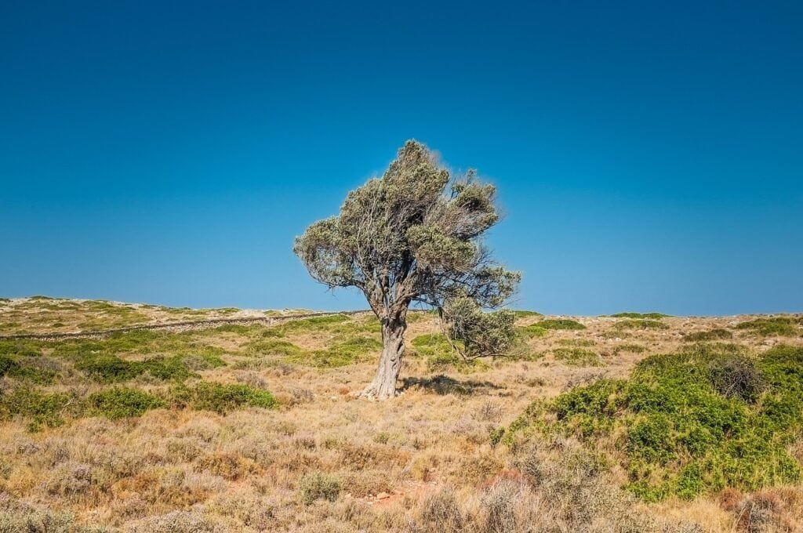
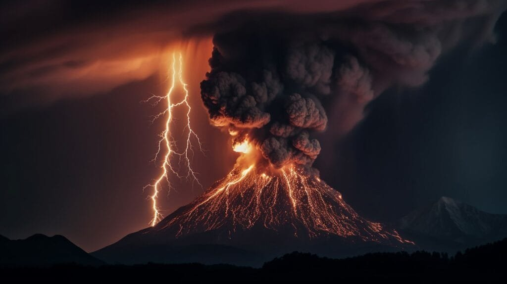
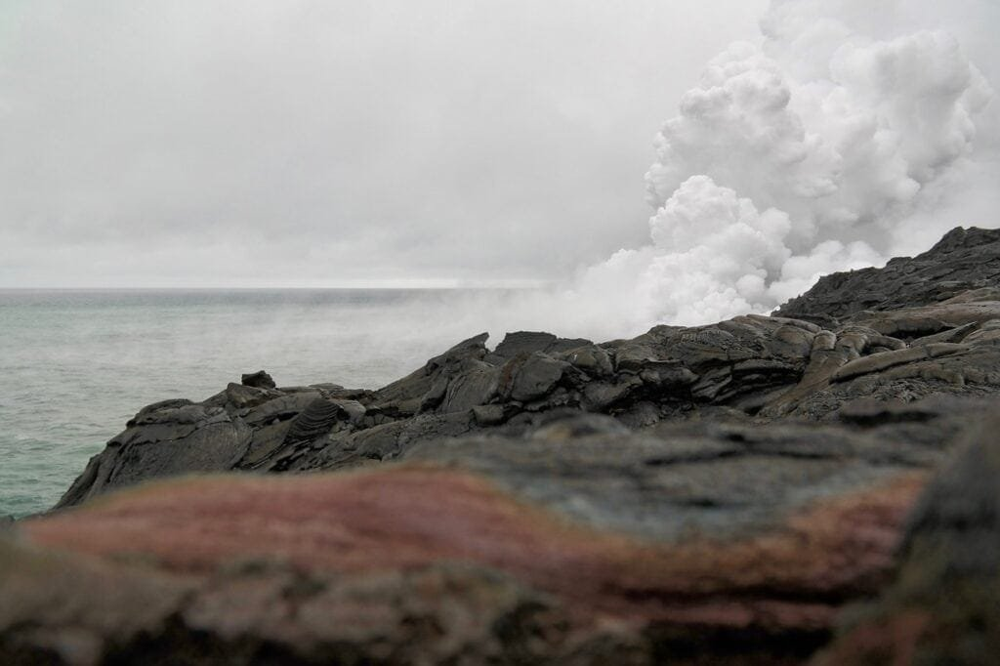

Volcanic islands are fascinating geological wonders that exhibit a range of activity, from explosive eruptions to gradual lava flow. These islands are formed by the eruption of volcanoes, which occur at specific locations along plate boundaries or hotspots beneath the Earth's crust. The "Ring of Fire" surrounding the Pacific Ocean is a prime example of volcanic activity, with its numerous volcanic islands. Understanding the geological activity of these islands is crucial for predicting and mitigating potential risks to nearby communities. In this article, we will explore the different types of volcanoes, their distribution, and the causes and impacts of their eruptions. By delving into this topic, you will gain a deeper understanding of why volcanic islands exhibit such intriguing geological activity.

This image is property of pixabay.com.

## Understanding Volcanoes

[Volcanoes are fascinating geological](https://magmamatters.com/geothermal-energy-and-its-volcanic-origins/ "Geothermal Energy and Its Volcanic Origins") formations that have intrigued humans for centuries. Defined as openings in the Earth's crust, volcanoes allow molten rock, gases, and debris to escape to the surface, resulting in eruptions of lava and ash. These eruptions can vary in intensity and can have significant impacts on the surrounding environment.

How volcanoes form and erupt is a complex process that involves several factors. They typically occur at sites along plate boundaries, where the Earth's tectonic plates meet. The movement and collision of these plates create areas of high pressure and intense heat, causing the mantle beneath the Earth's crust to melt and form magma. Over time, this magma rises through cracks and weak points in the crust, eventually reaching the surface as volcanic eruptions.

There are various types of volcanoes, each with its unique characteristics. Shield volcanoes, like those found in Hawaii, form gradually over hotspots deep underground. These volcanoes have broad, gently sloping sides and tend to erupt in a relatively non-explosive manner, with lava flowing steadily from fissures.

In contrast, stratovolcanoes, also known as composite volcanoes, are more explosive in nature. These volcanoes are typically cone-shaped and built up of alternating layers of lava, ash, and other volcanic materials. The eruption of stratovolcanoes is often characterized by violent explosions, pyroclastic flows, and the release of large amounts of ash into the atmosphere.

Understanding the different [types of volcanoes](https://magmamatters.com/understanding-volcanic-formation-a-comprehensive-guide/ "Understanding Volcanic Formation: A Comprehensive Guide") and their characteristics is essential for scientists and geologists to better predict and monitor volcanic activity.

## Origin of Volcanic Islands

Volcanic islands, as the name suggests, are islands that are formed as a result of volcanic activity. The formation process of these islands involves a combination of tectonic plate movements and the eruption of magma from beneath the Earth's surface.

Tectonic plates are large, rigid pieces of the Earth's lithosphere that are constantly moving. When two plates collide or move apart, intense geological activity occurs, creating areas of weakness in the Earth's crust. These areas of weakness allow magma to rise to the surface, forming volcanic islands.

The formation of volcanic islands can also be attributed to hotspots, which are areas of intense volcanic activity beneath the Earth's surface. These hotspots are believed to be caused by plumes of hot mantle material that rise from deep within the Earth. As tectonic plates move over these hotspots, the magma rises to the surface, forming volcanic islands.

Examples of volcanic islands around the world include the Hawaiian Islands, which formed over the Hawaiian hotspot, and the Galapagos Islands, which formed as a result of the Nazca Plate moving over the Galapagos hotspot. These islands showcase the dynamic nature of volcanic activity and provide valuable insight into the formation of landmasses.

This image is property of pixabay.com.

## Geography of Volcanic Activity

Volcanic activity is not limited to specific regions but is distributed globally. Across the Earth, volcanoes can be found along tectonic plate boundaries, where the movement and collision of these plates create conditions for volcanic eruptions.

The 'Ring of Fire' is a well-known region that encircles the Pacific Ocean and is renowned for its high volcanic activity. This area is characterized by a large number of active volcanoes and frequent earthquakes. The 'Ring of Fire' is formed due to the convergence of several tectonic plates, resulting in tremendous geological activity.

Volcanic activity is not limited to converging plate boundaries. Divergent plate boundaries, where tectonic plates move apart, can also give rise to volcanic eruptions. These eruptions occur along rift zones, which are areas where the Earth's crust is being pulled apart. The movement of the plates creates space for magma to rise, resulting in volcanic activity.

Understanding the global distribution of volcanic activity and the role of tectonic plate boundaries is crucial for monitoring and predicting volcanic eruptions. Volcanologists and geologists utilize this knowledge to assess potential hazards and risks associated with volcanic activity in different regions.

## Eruption Patterns

Volcanic eruptions can occur in different patterns, which are influenced by various factors. These factors include the viscosity of the lava, the gas content within the magma, and the structural characteristics of the volcano itself.

The viscosity of lava plays a significant role in determining the eruption pattern. Lava with low viscosity, such as basaltic lava, tends to flow more easily and can result in effusive eruptions. These eruptions are characterized by the steady outpouring of lava, which can create lava flows and lava lakes.

On the other hand, lava with high viscosity, such as andesitic or rhyolitic lava, is more resistant to flow. This type of lava can lead to explosive eruptions characterized by the violent ejection of volcanic ash, gases, and pyroclastic material. These explosive eruptions can produce ash clouds, pyroclastic flows, and volcanic bombs.

The gas content within magma is another crucial factor that influences eruption patterns. As magma rises to the surface, the decrease in pressure causes the dissolved gases within the magma to expand rapidly. This expansion can lead to explosive eruptions, as the sudden release of gas propels magma and volcanic material into the air.

Eruption patterns are also influenced by the structural characteristics of the volcano. Stratovolcanoes, with their steep slopes and layers of accumulated volcanic material, are more likely to experience explosive eruptions due to the buildup of pressure. In contrast, shield volcanoes, with their broad, gently sloping sides, tend to have less explosive eruptions characterized by the steady flow of lava.

Understanding eruption patterns and their features is vital for assessing volcanic hazards and predicting future volcanic activity. This knowledge allows scientists to develop strategies for managing and mitigating the risks associated with volcanic eruptions.

This image is property of pixabay.com.

## Lava Features and Landforms

Lava, the molten rock that erupts from volcanoes, has distinct characteristics that contribute to the formation of various landforms. The types of landforms created by lava are determined by the properties of the lava, such as its viscosity, temperature, and gas content.

There are two primary types of lava, basaltic andesitic, and rhyolitic, each with its specific properties. Basaltic lava is the most common type of lava and has low viscosity, meaning it flows relatively easily. This lava can form large, expansive flows that cover a wide area and create features like lava plateaus and volcanic plains.

Andesitic and rhyolitic lavas, on the other hand, have higher viscosities and do not flow as readily as basaltic lava. These lavas tend to form domes or small lava flows that pile up around the vent. The slow movement and cooling of andesitic and rhyolitic lavas can result in the formation of volcanic features such as lava domes and volcanic peaks.

The properties of lava also play a role in the formation of other landforms, such as volcanic cones and calderas. Volcanic cones are formed when lava and other volcanic materials are ejected from a central vent and accumulate around it, resulting in a cone-shaped structure. Calderas, on the other hand, are large, basin-like depressions that form when a volcanic cone collapses or when large volumes of magma are erupted, causing the ground to sink.

The influence of lava types on landform creation is an essential aspect of understanding volcanoes. By studying the characteristics of lava and the resulting landforms, scientists can gain insights into past volcanic activity and better predict future eruptions.

## Gaseous Emissions from Volcanoes

During volcanic eruptions, a variety of gases are released into the atmosphere. These gases can have significant impacts on the environment, climate, and air quality in the vicinity of the volcano.

Some of the most common gases released during volcanic eruptions include water vapor (H2O), carbon dioxide (CO2), sulfur dioxide (SO2), hydrogen sulfide (H2S), and hydrochloric acid (HCl). These gases are primarily derived from the magma beneath the Earth's surface and can be carried to the surface during eruptions.

The release of these gases can have both immediate and long-term effects on the environment and climate. Immediately after an eruption, the gases can create a toxic and hazardous environment, posing risks to human health and wildlife. Sulfur dioxide, for example, can cause respiratory issues and contribute to the formation of acid rain.

In the long term, volcanic gases can have significant effects on the climate. Carbon dioxide, a potent greenhouse gas, contributes to the warming of the Earth's atmosphere. Sulfur dioxide, on the other hand, can reflect sunlight and cause a cooling effect on the climate.

The release of [volcanic gases is closely linked to geological](https://magmamatters.com/the-environmental-impact-of-volcanic-eruptions-2/ "The Environmental Impact of Volcanic Eruptions") activity. As magma rises to the surface, it brings with it the gases trapped within. Monitoring these gas emissions can provide valuable insight into the state of volcanic activity and help scientists predict future eruptions.

## Seismic Activity and Volcanoes

Seismic activity, or earthquakes, plays an essential role in predicting volcanic eruptions. Earthquakes are caused by the movement and shifting of tectonic plates, which can also trigger volcanic activity.

As tectonic plates collide or move apart, intense pressure and stress build up along the boundaries. This pressure release can lead to earthquakes, which serve as indicators of underlying volcanic activity. The occurrence of small, shallow earthquakes beneath a volcano can suggest that magma is rising and the volcano may erupt soon.

Monitoring seismic patterns around volcanic islands is of utmost importance in predicting and understanding volcanic activity. The detection of subtle changes in the frequency and intensity of earthquakes can provide valuable information about the movement of magma and potential volcanic eruptions.

Seismic activity also plays a role in the formation of volcanic islands. As tectonic plates collide and create areas of intense geological activity, volcanic activity can result, leading to the formation of new landmasses. The relationship between tectonic movements and volcanic eruptions is crucial for understanding the formation and dynamics of volcanic islands.

## Hazards of Volcanic Activity

Volcanic eruptions pose immediate and long-term threats to surrounding communities and the environment. The hazards associated with volcanic activity can be devastating and can have severe impacts on human lives and infrastructure.

Immediately after an eruption, the release of volcanic ash, pyroclastic flows, and lava flows can pose significant risks. Volcanic ash can cause respiratory issues and make breathing difficult. It can also damage infrastructure, disrupt transportation, and contaminate water sources. Pyroclastic flows, which are fast-moving currents of hot gas and volcanic material, can cause severe burns and destruction in their path. Lava flows, although slower-moving, can destroy everything in their way and change the landscape permanently.

Volcanic eruptions can also have long-term effects on the environment. Ash can blanket large areas, smothering vegetation and disrupting ecosystems. The release of gases, such as sulfur dioxide, can contribute to air pollution and acid rain, posing risks to both human and environmental health. Volcanic landslides, known as lahars, can occur when volcanic material combines with water, posing a threat to communities downstream.

Throughout history, there have been numerous volcanic disasters that have had devastating consequences. The eruption of Mount Vesuvius in 79 A.D. buried the city of Pompeii, preserving it for centuries and providing valuable insights into past civilizations. More recent disasters include the eruption of Mount St. Helens in 1980, which caused widespread destruction and claimed several lives.

Volcanic islands face additional risks due to their location and topography. The combination of volcanic activity, seismic activity, and the presence of large bodies of water can increase the likelihood of slope instability, landslides, and tsunamis. These unique hazards require special considerations for the communities residing on volcanic islands, emphasizing the importance of preparedness and mitigation strategies.

## Benefits of Volcanic Activity

Despite the hazards they pose, volcanic activity also brings several benefits to the environment and human societies. One of the primary benefits is the fertile soil that volcanic eruptions create. The minerals and nutrients released during volcanic eruptions enrich the soil, making it highly suitable for agriculture. Many volcanic regions, such as the slopes of Mount Etna in Sicily, Italy, and the island of Java in Indonesia, are known for their productive agricultural lands.

Volcanic activity also plays a crucial role in landscape formation and the creation of diverse ecosystems. The eruptions of volcanoes continuously shape and mold the Earth's surface, creating new landforms and habitats for various organisms. Volcanic islands, in particular, are renowned for their unique and often endemic flora and fauna, which have evolved in isolation.

Another significant benefit of volcanic activity is the exploitation of geothermal energy. Geothermal energy utilizes the heat produced by the Earth's interior to generate electricity and provide heating and cooling systems. Areas with high volcanic activity, such as Iceland and New Zealand, have harnessed this renewable energy source to reduce their dependence on fossil fuels.

Understanding the benefits of volcanic activity helps to highlight the intricate relationship between volcanoes and the natural world. By studying the positive aspects of volcanic eruptions, we can appreciate the dynamic and ever-changing nature of our planet.

## Predicting and Mitigating Volcanic Activity

Predicting and mitigating the risks associated with volcanic activity is crucial for the safety and well-being of communities living in volcanic regions. Advancements in technology and monitoring systems have significantly improved our ability to predict volcanic eruptions and manage these risks.

Current methods of prediction involve a combination of seismic monitoring, gas monitoring, ground deformation measurements, and thermal imaging. These monitoring techniques allow scientists to detect subtle changes in volcanic activity, such as the movement of magma, and provide early warning systems for potential eruptions. This information can then be communicated to authorities and local communities to facilitate evacuation plans and other safety measures.

Technology plays a vital role in monitoring volcanic activity, with satellite imagery, remote sensing, and drone technology used to gather data and assess the state of volcanic activity. These tools help scientists monitor changes in volcanic gas emissions, ground deformation, and volcanic vent openings, providing valuable information for risk assessment.

Community preparedness is also crucial in mitigating the risks associated with volcanic activity. Education and awareness programs help residents understand the hazards, evacuation procedures, and safety measures to take in the event of an eruption. Building infrastructure resilient to volcanic hazards, such as reinforced buildings and robust transportation networks, can also mitigate the impacts of volcanic disasters.

In conclusion, understanding volcanoes and their various aspects is essential for predicting and mitigating the risks associated with volcanic activity. From the formation and eruption of [volcanoes to the impacts of gas emissions and seismic activity](https://magmamatters.com/the-art-and-science-of-volcano-monitoring/ "The Art and Science of Volcano Monitoring"), each element contributes to our knowledge of these awe-inspiring natural phenomena. By studying volcanoes, we can better protect communities, appreciate the benefits they bring, and admire the ever-changing beauty of our planet.

