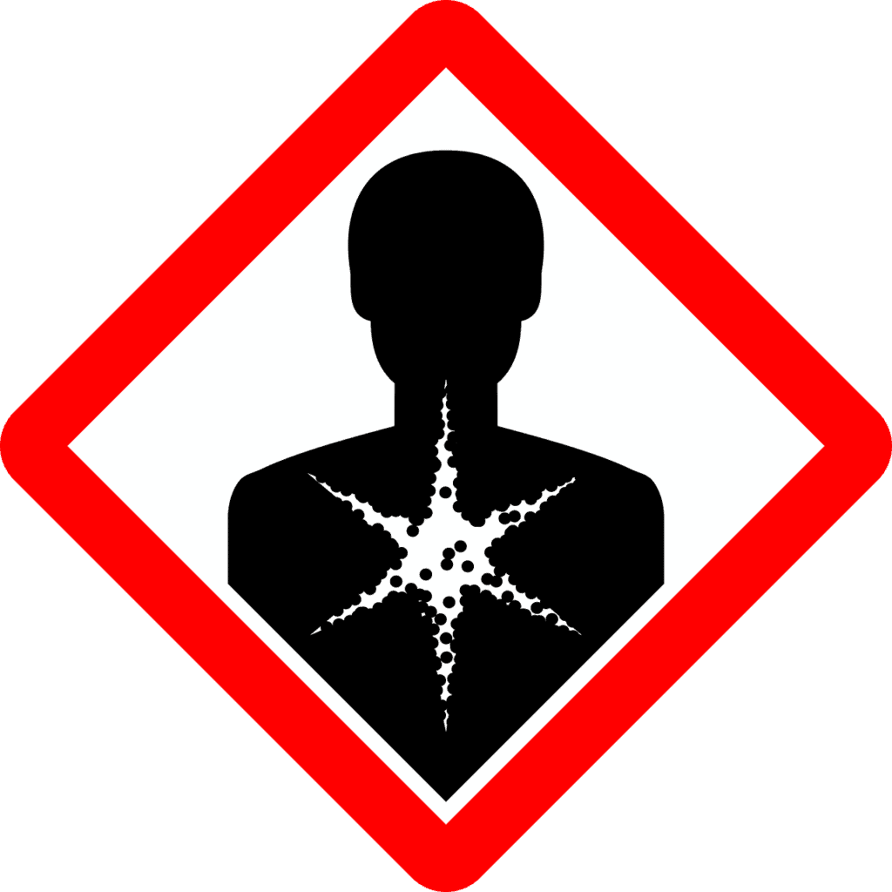

Volcanic eruptions may be awe-inspiring and fascinating to watch from a distance, but they also come with a range of health risks that cannot be ignored. From the release of toxic gases and ash particles into the air to the formation of dangerous volcanic clouds, these hazards can have serious implications for both human health and the environment. In this article, we will explore the various health risks associated with volcanic eruptions, shedding light on the potential dangers that individuals living in volcanic regions may face. By understanding these risks, we can take steps to protect ourselves and our communities, ensuring that we are well-prepared for any future volcanic activity.

  

## Understanding Volcanic Hazards

Volcanic hazards refer to the various risks and dangers associated with volcanic eruptions. These hazards can cause significant damage to both human life and the environment. It is crucial to have a clear understanding of volcanic hazards in order to effectively manage and mitigate the risks they pose.

### Definition of Volcanic Hazards

Volcanic hazards encompass a range of [natural phenomena](https://magmamatters.com/the-art-and-science-of-volcano-monitoring/ "The Art and Science of Volcano Monitoring") and events that occur during and after volcanic eruptions. These hazards include volcanic ash, volcanic gases, lava flows, pyroclastic flows, lahars, and the emission of volcanic aerosols. Each of these hazards can have different impacts on human health and the surrounding environment.

### Types of Volcanic Eruptions

Volcanic eruptions can vary in their intensity and eruption style depending on the characteristics of the volcano. The three main types of volcanic eruptions are effusive eruptions, explosive eruptions, and phreatomagmatic eruptions.

Effusive eruptions occur when magma, which is molten rock beneath the Earth's surface, rises to the surface and flows out of the volcano. This type of eruption is characterized by the relatively slow and steady flow of lava, which can spread over large distances.

Explosive eruptions, on the other hand, involve the ejection of volcanic material, such as ash, gases, and pyroclastic flows, with significant force. These eruptions can create high-pressure explosions that propel debris and gases into the atmosphere, causing widespread damage and hazards.

Phreatomagmatic eruptions occur when magma interacts with water, either from a lake or groundwater, resulting in violent explosions. The interaction between water and magma produces steam, ash, and fragmented volcanic material, which can pose serious risks to human health and safety.

### Geographic Locations of Main Active Volcanoes

Volcanoes are found in various geographic locations around the world. Some of the most active volcanic regions include the Pacific Ring of Fire, which stretches from the west coast of North and South America to Japan and New Zealand. This region is known for its frequent volcanic eruptions and seismic activity.

Other active volcanic areas include the Mediterranean region, including Italy and Greece, as well as Indonesia, the Philippines, and other parts of Southeast Asia. Volcanic activity can also occur in isolated locations, such as Iceland and Hawaii.

Understanding the geographical locations of active volcanoes is crucial for monitoring and predicting volcanic hazards. It helps authorities and communities in these areas to be prepared and take necessary precautions to minimize the risks posed by volcanic eruptions.

## Health Risks from Volcanic Ash

Volcanic ash is a significant hazard associated with volcanic eruptions. It is composed of fine particles of fragmented volcanic rock, glass, and minerals. When a volcano erupts, it can release ash into the atmosphere, which can then settle on the ground and be inhaled or come into contact with the skin and eyes.

### Composition of Volcanic Ash and its Effects on Human Health

Volcanic ash contains various harmful substances, including silica, sulfur dioxide, and heavy metals. Inhalation of volcanic ash can cause respiratory problems, eye irritations, and skin issues. The size of the ash particles determines its potential health effects, with smaller particles more likely to reach the lower respiratory system and cause more severe damage.

Silica, a common component of volcanic ash, can cause silicosis, a serious lung disease, if inhaled in high concentrations. Silica particles can penetrate deep into the lungs and cause scarring, leading to long-term respiratory complications. The release of sulfur dioxide during volcanic eruptions can also contribute to respiratory issues and exacerbate existing respiratory conditions.

### Respiratory Problems Related to Ash Inhalation

Inhaling volcanic ash can result in a range of respiratory problems, including coughing, wheezing, shortness of breath, and chest tightness. These symptoms can be particularly severe in individuals with pre-existing respiratory conditions, such as asthma or chronic obstructive pulmonary disease (COPD). Prolonged exposure to volcanic ash can lead to chronic respiratory conditions and increase the risk of developing respiratory infections.

### Eye Irritations and Skin Problems Due to Ash Exposure

Contact with volcanic ash can cause eye irritation, redness, and discomfort. The abrasive nature of the ash particles can also lead to skin problems, such as irritation, itching, and dermatitis. It is important to protect the eyes and skin during and after volcanic eruptions by wearing goggles, masks, and appropriate clothing to minimize exposure to volcanic ash.

This image is property of pixabay.com.

## Exposure to Volcanic Gases

In addition to volcanic ash, volcanic eruptions also release various gases into the atmosphere. These gases can pose significant health hazards to both humans and the environment.

### Common Types of Volcanic Gases

The main types of gases emitted during volcanic eruptions include sulfur dioxide (SO2), carbon dioxide (CO2), hydrogen sulfide (H2S), and carbon monoxide (CO). These gases are produced by the degassing of magma as it rises to the surface and during the eruption process. The composition and concentration of these gases can vary depending on the type of volcano and the underlying magma composition.

### Hazards Associated with Inhaling Volcanic Gases

Inhalation of volcanic gases can have immediate and long-term health effects. Exposure to high concentrations of sulfur dioxide can cause respiratory issues, including coughing, difficulty breathing, and airway inflammation. Hydrogen sulfide can also cause respiratory problems and is highly toxic in high concentrations. Prolonged exposure to volcanic gases can lead to chronic respiratory conditions and increase the risk of cardiovascular diseases.

### Environmental Effects of Volcanic Gases and their Impact on Human Health

In addition to the direct impact on human health, volcanic gases can also have indirect effects on the environment, which can, in turn, affect human health. For example, sulfur dioxide released during volcanic eruptions can react with water vapor in the atmosphere to form sulfuric acid, which can contribute to acid rain. Acid rain can damage crops, forests, and aquatic ecosystems, leading to decreased food production and water contamination.

Understanding the composition and effects of volcanic gases is crucial for assessing the potential health risks associated with volcanic eruptions. Monitoring and measuring the concentrations of these gases can help authorities issue appropriate warnings and evacuation orders to protect vulnerable populations.

## Lava Flows and their Impact on Local Communities

Lava flows are another significant hazard associated with volcanic eruptions. Lava is molten rock that flows from a volcano during an eruption and can travel at high speeds, posing a direct threat to nearby communities.

### Composition and Behavior of Lava Flows

Lava flows are composed of molten rock, which can vary in composition depending on the type of volcano and the underlying magma. The viscosity of the lava determines its flow behavior, with more viscous lava flowing slower and forming thicker, blocky flows, while less viscous lava can flow more quickly and form thinner, runny flows.

The behavior of lava flows can also be influenced by the topography of the area, terrain obstacles, and the presence of water. Lava flows can destroy roads, buildings, and vegetation, and can even pose a direct threat to lives and property.

### Health Effects Associated with Lava Flows

The direct contact with lava can cause severe burns and result in long-lasting scars. The high temperatures of lava can exceed 1,000 degrees Celsius, causing extreme thermal injuries upon contact. In addition to burns, the heat emitted by lava can also cause heat exhaustion and heatstroke in individuals who are exposed to it for prolonged periods.

The destruction caused by lava flows can also result in displacement and the loss of homes and infrastructure, leading to mental health issues and other indirect health risks. The disruption of communities and the loss of livelihoods can have long-term impacts on the well-being of affected individuals.

### Long-term Impact of Lava Flows on Land and Community

While lava flows can cause immediate destruction, they also have long-term effects on the landscape and the communities affected. The solidified lava can alter the topography of the area, creating new land formations and changing the course of rivers and streams. This can lead to changes in water availability and quality, affecting agriculture, drinking water sources, and ecosystems in the region.

The long-term impact on communities includes the need for rebuilding and the potential for ongoing challenges in accessing basic services and resources. The physical and psychological recovery process can be lengthy and require support from both local and national authorities.

This image is property of pixabay.com.

## Pyroclastic Flows and Health Implications

[Pyroclastic flows are one of the most dangerous volcanic hazards](https://magmamatters.com/the-environmental-impact-of-volcanic-eruptions-2/ "The Environmental Impact of Volcanic Eruptions"), with devastating consequences for any individuals or communities in their path.

### Definition and Formation of Pyroclastic Flows

Pyroclastic flows are fast-moving currents of hot gas, rock fragments, and volcanic ash that flow down the slopes of a volcano during an explosive eruption. They can reach speeds of up to 700 kilometers per hour and can travel for several kilometers from the source.

These flows are formed when a volcanic explosion generates a dense mixture of volcanic material and gas, which then cascades down the slopes of the volcano due to gravity. Pyroclastic flows can be triggered by various volcanic eruptions, including explosive eruptions and collapse of eruption columns.

### Health Risks Associated with Pyroclastic Flows

Pyroclastic flows pose a significant threat to human life due to their high temperatures, speed, and density. The extreme heat of the flows can cause severe burns and result in immediate fatalities. The high speed of the flows leaves little time for escape, making it challenging for individuals in their path to evacuate in time.

Inhalation of the hot gases and ash particles in pyroclastic flows can cause serious respiratory issues, leading to asphyxiation and suffocation. The density of these flows can also exert significant force on structures, resulting in the destruction of buildings, infrastructure, and landscapes.

### Measures to Protect from Pyroclastic Flows

Given the fast and unpredictable nature of pyroclastic flows, it is crucial to have effective early warning systems in place to alert communities at risk. These warning systems can include sirens, alarms, and communication channels to notify residents to evacuate immediately.

Designated evacuation routes and shelters should be established in areas prone to pyroclastic flows. Community education and awareness programs can help residents understand the risks associated with these flows and ensure they know how to respond in the event of an eruption.

## Lahars and Their Potential Health Risks

Lahars pose significant risks to communities near volcanoes, particularly those located in mountainous regions or areas with abundant rainfall.

### Explanation of Lahars and their Formation

Lahars are destructive debris flows composed of a mixture of volcanic ash, rock fragments, and water. They can form during or after volcanic eruptions when volcanic material becomes saturated with water, either from heavy rainfall or the melting of glaciers and ice caps on the volcano.

The water acts as a lubricant, allowing the volcanic material to rapidly flow downslope, carrying debris and increasing the volume of the lahar. Lahars can travel long distances and can cause widespread destruction and loss of life.

### Health Issues Caused by Lahars

Lahars can cause severe physical injuries and fatalities due to their destructive force. The speed and volume of the flows can overwhelm structures, burying homes, buildings, and infrastructure under layers of debris.

In addition to the immediate physical risks, lahars can also contaminate water sources, causing waterborne diseases and illnesses. The volcanic material in the lahars can contain harmful substances, such as heavy metals and toxic chemicals, which can pose long-term health risks if they enter the water supply.

### Impact on Water Sources and Possible Health Risks

Lahars can have a significant impact on water sources, affecting both the quantity and quality of water available to surrounding communities. The debris carried by lahars can clog rivers and streams, leading to flooding, and changes in water flow patterns.

The contaminated water resulting from lahars can pose health risks, as it may contain harmful substances and pathogens. This can lead to the spread of waterborne diseases, such as cholera, dysentery, and typhoid fever, which can have severe health implications, particularly in vulnerable populations.

This image is property of pixabay.com.

## Mental Health Impact of Volcanic Eruptions

Volcanic eruptions can have profound impacts on the mental health and well-being of individuals and communities affected by the disasters. The traumatic nature of these events can lead to various psychological issues.

### Psychological Trauma from Volcanic Disasters

Volcanic eruptions are often sudden, unpredictable, and can cause extensive damage and loss of life. The experience of witnessing the destruction and the potential loss of loved ones can result in acute psychological trauma. Individuals may experience intense fear, helplessness, and a sense of loss.

The disruption of daily life, displacement, and uncertainty about the future can further exacerbate feelings of anxiety, depression, and post-traumatic stress disorder (PTSD).

### Post-Traumatic Stress Disorder (PTSD) and its Prevalence in Volcanic Eruption Survivors

PTSD is a mental health condition that can develop in individuals who have experienced or witnessed a traumatic event. It is characterized by symptoms such as flashbacks, nightmares, intrusive thoughts, and emotional distress associated with the traumatic event.

Volcanic eruptions can trigger the onset of PTSD in survivors, particularly those who have experienced significant loss, injury, or displacement. The prevalence of PTSD in volcanic eruption survivors can vary depending on factors such as the severity of the eruption, the level of exposure to the disaster, and the availability of support systems.

### Role of Community and Mental Health Professionals in Dealing with Trauma

Support from the community and mental health professionals is crucial in assisting individuals and communities in coping with the mental health impacts of volcanic eruptions. Community-based organizations, local authorities, and non-governmental organizations can provide immediate support and assistance in the aftermath of an eruption.

Access to mental health services, counseling, and support groups can help individuals process the trauma and develop effective coping mechanisms. Building resilience within the community can also contribute to long-term mental health recovery and preparedness for future volcanic events.

## Indirect Health Risks from Volcanic Hazards

In addition to the direct health risks associated with volcanic hazards, there are also indirect health risks that can arise in the aftermath of these events.

### Displacement and Overcrowding Due to Volcanic Disasters

Volcanic eruptions can lead to the displacement of individuals and communities from their homes and communities. The destruction of infrastructure and the loss of housing can result in overcrowding in temporary shelters, such as evacuation centers or makeshift camps.

Overcrowded conditions in these shelters can increase the risk of the spread of infectious diseases, such as respiratory infections, gastrointestinal illnesses, and vector-borne diseases. The close proximity of individuals in overcrowded shelters can make it challenging to maintain proper hygiene and sanitation, creating an environment conducive to the transmission of diseases.

### Spread of Diseases in Temporary Shelters

The disruption caused by volcanic disasters can compromise basic services and infrastructure, including healthcare facilities. This can result in limited access to medical care and heightened risks of disease outbreaks.

Contaminated water sources, poor sanitation, and inadequate waste management in temporary shelters can create conditions favorable for the spread of infectious diseases. The close quarters and high population density increase the risk of transmission, particularly in individuals with weakened immune systems, such as children and the elderly.

### Food Scarcity and Malnutrition Issues Post-Eruption

Volcanic eruptions can have significant impacts on agriculture and food production in the affected regions. The destruction of farmland, contamination of soil and water sources, and loss of livestock can lead to food shortages and increased vulnerability to malnutrition.

Disruption to transportation and supply chains can further exacerbate food scarcity, making it difficult for communities to access nutritious food. Malnutrition can have long-term health consequences, particularly in children, including stunted growth, weakened immune systems, and developmental issues.

## Emission of Volcanic Aerosols and Impact on Climate

In addition to the immediate health risks associated with volcanic hazards, volcanic eruptions can also have long-term impacts on climate patterns and subsequently on human health.

### Composition of Volcanic Aerosols

Volcanic aerosols are tiny particles and gases that are released into the atmosphere during volcanic eruptions. These aerosols can include sulfur dioxide, water vapor, ash particles, and trace amounts of other gases and chemicals.

The composition of [volcanic aerosols can vary depending on the type of volcano](https://magmamatters.com/understanding-volcanic-formation-a-comprehensive-guide/ "Understanding Volcanic Formation: A Comprehensive Guide"), the characteristics of the eruption, and the altitude at which the eruption occurs. The aerosols can remain in the atmosphere for extended periods and can be transported over long distances, affecting regional and even global climate patterns.

### Impact on Climate and Potential Health Consequences

Volcanic aerosols have the potential to impact climate by reflecting sunlight and reducing the amount of solar radiation that reaches the Earth's surface. This can lead to a temporary cooling effect on global temperatures, often referred to as volcanic winter.

The cooling effect of volcanic aerosols can have both positive and negative health implications. While a temporary reduction in temperatures can provide relief from extreme heat and reduce the risk of heat-related illnesses, it can also disrupt agricultural patterns, affecting food production and availability.

### Long-term Health Implications of Climate Change Due to Volcanic Aerosols

The long-term impact of [climate change resulting from volcanic](https://magmamatters.com/geothermal-energy-and-its-volcanic-origins/ "Geothermal Energy and Its Volcanic Origins") aerosols can have significant health consequences. Changes in temperature patterns can lead to the spread of infectious diseases, the disruption of ecosystems and biodiversity, and the intensification of extreme weather events, such as storms, heatwaves, and droughts.

The indirect health risks associated with climate change, such as food insecurity, water scarcity, and the displacement of populations, can have far-reaching effects on human health. Vulnerable populations, including children, the elderly, and those with pre-existing health conditions, are particularly at risk.

## Mitigation and Adaptation Strategies

To minimize the health risks associated with volcanic hazards, it is essential to implement effective mitigation and adaptation strategies.

### Existing Policies and Guidelines for Volcanic Disaster Management

Many countries and regions prone to volcanic activity have established policies and guidelines for managing volcanic disasters. These policies aim to ensure the safety and well-being of communities, minimize the risks associated with volcanic eruptions, and enhance preparedness and response capabilities.

These policies often involve collaboration between national and local authorities, scientific institutions, and community organizations to coordinate response efforts, evacuation plans, and early warning systems.

### Role of Early Warning Systems and Evacuation Plans

Early warning systems are crucial in alerting communities to the potential hazards associated with volcanic eruptions. These systems can include the monitoring of volcanic activity, such as seismic activity, gas emissions, and changes in ground deformation, to detect signs of an impending eruption.

Evacuation plans should be in place to ensure the safe and timely evacuation of individuals at risk. These plans should include designated evacuation routes, shelters, and communication channels to inform residents about evacuation orders and provide guidance on how to safely leave the area.

### Strategies for Rebuilding and Rehabilitation Post-Volcanic Disasters

Rebuilding and rehabilitation efforts are essential in the aftermath of volcanic disasters. These efforts should focus not only on rebuilding physical infrastructure but also on addressing the long-term health and well-being of affected communities.

Post-disaster recovery plans should include provisions for mental health support, access to healthcare services, and the restoration of water and sanitation infrastructure. Rebuilding communities in a sustainable and resilient manner can help mitigate future risks and enhance the overall health and well-being of affected populations.

In conclusion, understanding volcanic hazards is crucial for effectively managing and mitigating the risks they pose to human health. From volcanic ash and gases to lava flows, lahars, and pyroclastic flows, each hazard presents a unique set of health risks. The mental health impacts, indirect health risks, and long-term consequences on climate and health further highlight the need for comprehensive mitigation and adaptation strategies. By implementing early warning systems, evacuation plans, and post-disaster recovery efforts, we can work towards minimizing the negative health impacts of volcanic hazards and building resilient communities in volcanic regions.

Related Posts: [Mitigating Risks: Forecasting Volcanic Activity in Prone Areas](https://magmamatters.com/mitigating-risks-forecasting-volcanic-activity-in-prone-areas/), [The Formation and Eruption Patterns of Volcanoes](https://magmamatters.com/the-formation-and-eruption-patterns-of-volcanoes-4/), [The Pyroclastic Phenomena of Pompeii: 7 Insights to Explore](https://magmamatters.com/the-pyroclastic-phenomena-of-pompeii-7-insights-to-explore/), [Tips for Capturing Volcano Pyroclastic Flow Photos](https://magmamatters.com/tips-for-capturing-volcano-pyroclastic-flow-photos/), [Understanding Volcanoes and Their Eruption Patterns](https://magmamatters.com/understanding-volcanoes-and-their-eruption-patterns/)
