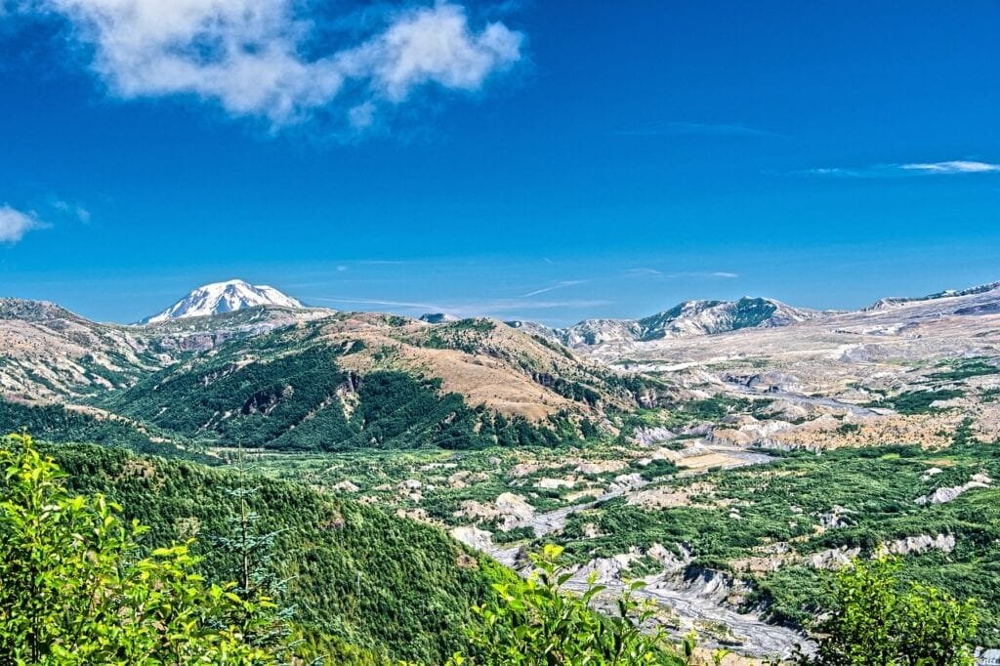
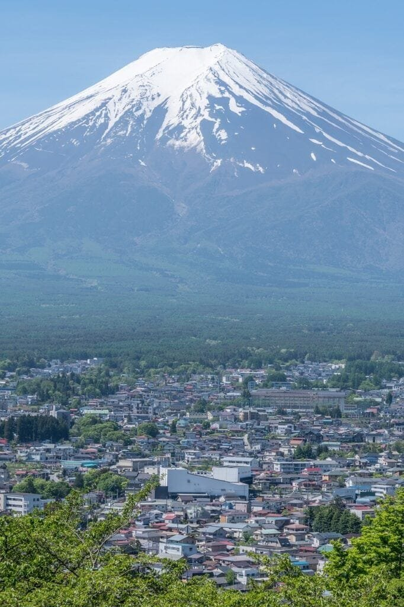
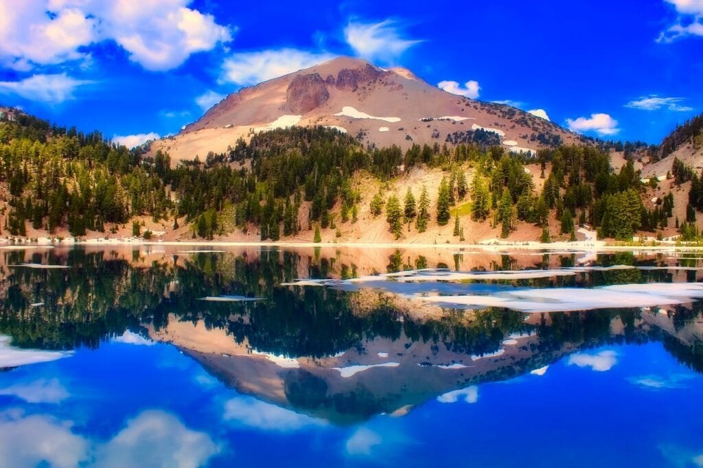

Did you know that historic volcanic eruptions have had a significant impact on volcano tourism? Volcanoes, with their awe-inspiring beauty and untamed power, have always attracted visitors from around the world. But it's the historical eruptions that have truly captured people's imagination and curiosity. These eruptions, like the notorious Mount Vesuvius eruption in 79 AD that preserved the city of Pompeii, have become iconic events that draw tourists seeking to witness the remnants of these cataclysmic moments in history. In this article, we will explore some of the historic eruptions that have boosted volcano tourism, showcasing how these natural disasters have left a lasting mark on both the landscape and the tourism industry.

This image is property of pixabay.com.

## Understanding Volcanoes

[Volcanoes are fascinating natural phenomena](https://magmamatters.com/the-art-and-science-of-volcano-monitoring/ "The Art and Science of Volcano Monitoring") that have captivated humans for centuries. Understanding how they form and the different [types of volcanoes](https://magmamatters.com/understanding-volcanic-formation-a-comprehensive-guide/ "Understanding Volcanic Formation: A Comprehensive Guide") is crucial for comprehending their behavior and the impact they can have on the surrounding environment.

### Formation and Types of Volcanoes

Volcanoes are formed when molten rock, gases, and debris, collectively known as magma, escape to the earth's surface. This process leads to the eruption of lava and ash, which can cause significant volcanic activity. Volcanoes occur at specific locations along plate boundaries, hotspots under the earth's crust, or rift zones where the earth's tectonic plates are moving apart.

There are various types of volcanoes, each with distinct characteristics. For example, the volcanoes found in the "Ring of Fire," which encircles the Pacific Ocean, are located atop spots where tectonic plates meet. These volcanoes are highly prone to eruptions due to the intense geologic activity caused by plate movement. On the other hand, shield volcanoes, such as those in Hawaii, form gradually over hotspots deep underground and typically erupt less explosively. The type of lava viscosity and gas content play a crucial role in determining the eruption patterns and behavior of different volcanoes.

### Geographic Distribution

Volcanoes are not evenly distributed across the globe but are concentrated in certain regions. The "Ring of Fire," as previously mentioned, is a prime example of an area with a high concentration of volcanoes. Other hotspots of volcanic activity include Iceland, Italy, and Indonesia. The geographic distribution of volcanoes is largely influenced by tectonic plate boundaries and the presence of hotspots. Understanding the patterns of volcanic distribution can help scientists and communities better prepare for potential eruptions and mitigate the associated risks.

### Causes of Eruptions

Volcanic eruptions occur due to a combination of factors, including the buildup of pressure within the volcano, the composition of the magma, and external triggers. The primary cause of eruptions is the movement and interaction of tectonic plates. When two plates collide, one may be forced beneath the other, creating a subduction zone. This process leads to the formation of magma, which eventually rises through cracks in the earth's crust, resulting in volcanic eruptions.

Additionally, the composition of magma plays a crucial role in determining the explosiveness of an eruption. Magma with high gas content tends to erupt more violently, while magma with lower gas content may lead to more effusive, less explosive eruptions. External triggers, such as earthquakes or volcanic activity in nearby areas, can also induce eruptions. Understanding these causes is essential for predicting volcanic activity and ensuring the safety of nearby communities.

### Hazards and Benefits of Volcanic Activity

Volcanic activity carries both hazards and benefits for the surrounding areas. On one hand, volcanic eruptions can cause widespread destruction and loss of lives. Lava flows, pyroclastic flows (clouds of hot gas, ash, and rocks), volcanic ash, and volcanic gases pose significant dangers to human settlements. These hazards can destroy infrastructure, disrupt transportation and communication networks, and pose health risks.

However, volcanic activity also has beneficial aspects. Volcanic eruptions release fertile soil enriched with minerals, making volcanic regions highly suitable for agriculture. The volcanic soil, known as volcanic ash or tephra, contains nutrients that promote plant growth. Additionally, volcanic landscapes often exhibit striking natural beauty, attracting tourists and fostering economic development in the surrounding regions.

## The Impact of Historic Volcanic Eruptions on Society

Throughout history, numerous volcanic eruptions have had a profound impact on society. These eruptions have caused physical damage, psychological trauma, economic consequences, and have shaped communities' resilience and preparedness for future volcanic events.

### Physical Damage

Historic volcanic eruptions have caused catastrophic physical damage to settlements and infrastructure. Lava flows, pyroclastic flows, and ashfall can engulf entire towns, burying them underneath layers of volcanic debris. Pompeii, a city in ancient Rome, is a poignant example of the destructive power of a volcanic eruption. The eruption of Mount Vesuvius in 79 AD buried the city under ash and pumice, preserving it in remarkable detail and providing valuable insights into the daily life of ancient Romans.

### Psychological Impact

The psychological impact of volcanic eruptions cannot be underestimated. Witnessing the sheer force of nature and experiencing the devastation caused by volcanic activity can leave lasting scars on the minds of survivors. Post-traumatic stress disorder (PTSD) and anxiety are common psychological consequences experienced by those who have lived through volcanic eruptions. Additionally, the fear and uncertainty associated with the possibility of future eruptions can create ongoing psychological distress within affected communities.

### Economic Consequences

Historic volcanic eruptions have had significant economic consequences on the affected regions. The destruction of infrastructure and landscapes can disrupt economic activities, leading to a decline in local industries and tourism. Agricultural areas may suffer long-term consequences due to soil damage caused by lava flows or ash deposits. Additionally, the cost of rehabilitation and reconstruction can put a burden on local economies, requiring substantial financial resources and external assistance.

### Impact on Resilience and Preparedness

Despite the destructive nature of volcanic eruptions, they also play a crucial role in shaping communities' resilience and preparedness. Historic eruptions have triggered the development of monitoring systems, early warning systems, and evacuation plans to minimize the loss of lives during future events. Volcanic eruptions have also motivated scientific research to better understand volcanic activity and improve forecasting capabilities. By learning from past experiences, communities are better equipped to respond effectively and mitigate the impact of future volcanic eruptions.

This image is property of pixabay.com.

## Historic Volcanic Eruptions that Boosted Volcano Tourism

While volcanic eruptions can be devastating, they have also birthed a new industry centered around volcano tourism. Several historic eruptions have yielded unique landscapes and attractions that draw tourists from all over the world. Let's explore some of these iconic volcanic sites that have become popular tourist destinations.

### Mount St. Helens, USA

The eruption of Mount St. Helens in Washington State, USA, in 1980 resulted in the dramatic reshaping of the mountain and its surroundings. The eruption, which caused significant devastation and loss of life, also triggered a surge in curiosity among tourists. Today, visitors can explore the volcanic blast zone and witness the remarkable regrowth and ecological recovery that has taken place since the eruption. The Mount St. Helens National Volcanic Monument offers hiking trails, interpretive centers, and guided tours, allowing visitors to learn about the eruption's impact and the ongoing scientific research in the area.

### Vesuvius, Italy

The eruption of Mount Vesuvius in 79 AD, which buried the cities of Pompeii and Herculaneum, is one of the most famous volcanic events in history. The preserved ruins of Pompeii have become an archaeological treasure, attracting millions of tourists each year. Exploring the ancient city provides a unique insight into Roman life and the catastrophic power of volcanic eruptions. Mount Vesuvius itself is also a popular destination, with tourists able to hike to the summit and peer into the volcanic crater.

### Krakatoa, Indonesia

The eruption of Krakatoa in 1883, located between the islands of Java and Sumatra in Indonesia, left a lasting impact on the region and the world. The explosion was one of the most powerful volcanic events recorded, resulting in tsunamis, ash clouds, and a global climate impact from the ejected particles. Today, visitors can take boat tours to the remnants of the volcanic island and witness the incredible recovery of plant and animal life in the surrounding waters. The scenic beauty and unique geological features make Krakatoa an enticing destination for volcano tourism.

### Eyjafjallajökull, Iceland

The eruption of Eyjafjallajökull in 2010 in Iceland captured global attention due to its disruption of air travel across Europe. While causing major inconveniences at the time, the eruption also sparked significant interest in volcano tourism in Iceland. Visitors flock to the region to witness the majestic landscape, including the glacier-covered volcano itself. [Volcano tours provide the opportunity to explore the volcanic](https://magmamatters.com/geothermal-energy-and-its-volcanic-origins/ "Geothermal Energy and Its Volcanic Origins") terrain and learn about the geological processes that shape Iceland's unique environment.

## Economic Boost and Job Creation through Volcano Tourism

Volcano tourism has emerged as a significant source of economic boost and job creation in areas affected by volcanic eruptions. The unique landscapes and geological features created by volcanic activity draw tourists from around the world, leading to increased revenue for local businesses and employment opportunities.

### Local Businesses

Volcano tourism brings with it a range of opportunities for local businesses. From souvenir shops and art galleries to restaurants and accommodations, the influx of tourists creates a demand for various goods and services. Local communities can capitalize on this demand by offering unique products and experiences that showcase the cultural heritage and natural beauty of the volcanic regions. This, in turn, stimulates economic growth and supports sustainable development.

### Tour Companies and Agencies

Volcano tourism opens up avenues for tour companies and agencies specializing in adventure tourism. These companies organize guided tours, hikes, and expeditions to volcanic sites, providing visitors with educational experiences and opportunities for exploration. By partnering with local communities and experts in geology and natural history, tour companies can offer in-depth knowledge and insight into the volcanic landscapes. This collaboration not only enriches the visitor experience but also supports the local economy.

### Hotel and Restaurant Industry

The rise in volcano tourism often leads to increased demand for accommodation and dining options in the surrounding areas. Hotels, resorts, and guesthouses can capitalize on this opportunity by providing unique experiences tailored to volcano tourists. Likewise, the restaurant industry can create menus that highlight local cuisine and use ingredients sourced from volcanic soil, showcasing the vibrant culinary scene of volcanic regions. These establishments play a vital role in enhancing the overall visitor experience and contribute to the economic growth of the community.

### Transportation Services

Volcano tourism necessitates reliable transportation services to facilitate the movement of visitors to and from volcanic sites. This includes not only conventional transportation modes such as buses and taxis but also specialized services such as helicopter tours or boat trips to volcanic islands. By developing and expanding transportation infrastructure, local communities can enhance their connectivity and accessibility, attracting more visitors and benefiting from increased tourism revenue.

This image is property of pixabay.com.

## Environmental Impact of Volcano Tourism

While volcano tourism can bring economic benefits to local communities, it also has the potential to impact the environment and natural resources of volcanic regions. It is essential to consider the potential damages and effects on wildlife to ensure the long-term sustainability of volcano tourism.

### Potential Damages to Natural Resources

Unregulated tourism activities, such as uncontrolled hiking or off-road vehicle use, can lead to significant damages to the natural resources in volcanic regions. Erosion of fragile volcanic soils, trampling of delicate vegetation, and disturbance of wildlife habitats are some of the potential consequences. To mitigate these impacts, responsible tourism practices, including designated trails, controlled access, and visitor education, must be implemented. This way, the natural resources can be preserved while still allowing visitors to appreciate the unique characteristics of volcanic landscapes.

### Effects on Wildlife

Volcanic regions often harbor unique biodiversity and rare species that have adapted to the challenging volcanic environment. The influx of tourists can disrupt the natural behavior and habitats of these species, potentially leading to their decline or displacement. It is crucial for volcano tourism to prioritize conservation efforts and establish guidelines to minimize disturbance to wildlife. This can be done through visitor education, the establishment of protected areas, and collaborations with conservation organizations to ensure the long-term preservation of the ecosystems.

### Efforts for Sustainable Volcano Tourism

To minimize the environmental impact of volcano tourism, sustainable practices must be embraced. This includes the implementation of waste management systems to minimize pollution, the use of renewable energy sources for accommodations and transportation, and the promotion of responsible visitor behavior through educational campaigns. Collaboration between tourism stakeholders, local communities, and environmental organizations is vital to strike a balance between economic development and environmental preservation. By adopting sustainable practices, volcano tourism can continue to thrive while safeguarding the unique natural resources of volcanic regions for future generations.

## Educational Aspect of Volcano Tourism

Volcano tourism offers a valuable educational experience, allowing visitors to gain knowledge about geology, volcanic activities, disaster preparedness, and environmental sustainability. These educational aspects enhance the overall tourism experience while promoting awareness and understanding of the natural forces at play.

### Awareness about Geology and Volcanic Activities

Through volcano tourism, visitors have the opportunity to learn about the geological processes that shape our planet. Guided tours, interpretive centers, and interactive exhibits provide insights into the formation of volcanoes, the components of volcanic activity, and the impact of eruptions on the surrounding landscapes. This awareness fosters a deeper understanding and appreciation of the Earth's dynamic nature.

### Understanding Disaster Preparedness

Volcanic regions are often susceptible to natural disasters caused by eruptions. Understanding the risks associated with volcano activity and the importance of disaster preparedness is crucial for both visitors and local communities. Educational programs and informative materials can help disseminate knowledge about evacuation procedures, emergency supplies, and communication channels during volcanic events. By equipping individuals with the necessary information, volcano tourism contributes to building resilient communities that can effectively respond to and recover from natural disasters.

### Engagement in Environmental Sustainability

Volcano tourism provides a platform for individuals to engage in environmental sustainability efforts. Visitors can learn about the ecological significance of volcanic regions, the importance of preserving biodiversity, and the impact of climate change on these delicate environments. By participating in eco-friendly practices such as responsible hiking, waste reduction, and supporting local conservation projects, tourists can actively contribute to the preservation of volcanic landscapes and the promotion of sustainable tourism.

## Safety Measures for Volcano Tourism

As with any adventurous activity, safety should be a top priority when engaging in volcano tourism. Volcanic areas can pose several risks, including potential eruptions, gas emissions, lava flows, and terrain hazards. By following established safety measures and guidelines, both visitors and tour operators can ensure a safe and enjoyable experience.

### Risk Assessment before Tours

Prior to embarking on volcano tours, it is essential to conduct a thorough risk assessment. This involves evaluating the current volcanic activity, monitoring seismic data, and keeping abreast of official warnings and recommendations. Tour operators should communicate clearly with visitors about any potential hazards and ensure that participants have the necessary physical fitness and equipment to safely navigate volcanic terrain. A comprehensive risk assessment helps mitigate potential dangers and ensures the well-being of tourists.

### Emergency Planning

Tour operators, in collaboration with local authorities, should have comprehensive emergency plans in place to handle unforeseen circumstances. This includes establishing evacuation routes, identifying safe zones, and training staff in emergency response procedures. Effective communication systems between tour guides, participants, and local authorities are crucial for timely evacuation or assistance in case of emergency. By proactively preparing for potential risks, tour operators can reduce the chances of accidents or injuries during volcano tours.

### Precautions during Volcanic Activities

When visiting active volcano sites, visitors must adhere to safety precautions to minimize risks. This includes staying within designated areas, following instructions from tour guides, and obeying warning signs or barriers. Venturing into restricted zones can expose individuals to hazardous gases, sudden eruptions, or unstable terrain. Additionally, wearing appropriate protective gear, such as helmets and masks, can provide an extra layer of safety. By respecting safety guidelines, visitors can enjoy volcano tours while minimizing potential hazards.

### Role of Tour Guides for Safety

Experienced and knowledgeable tour guides play a crucial role in ensuring the safety of volcano tourists. They provide valuable information about potential risks, emergency procedures, and safe behavior during volcanic activities. Tour guides should maintain regular communication with participants, readily address any concerns or questions, and monitor the volcanic conditions closely. Their expertise and vigilance contribute to a safe and informative experience for visitors, fostering trust and confidence in volcano tourism.

## Role of Media in Promoting Volcano Tourism

The media plays a significant role in promoting volcano tourism by showcasing the captivating beauty and unique characteristics of volcanic regions. Documentaries, news coverage, and social media platforms are key channels through which volcano tourism gains exposure and captures public interest.

### Documentaries and Films

Documentaries and films highlighting volcanic landscapes and eruptions have the power to captivate audiences and ignite curiosity about volcano tourism. These visual mediums allow viewers to witness the awe-inspiring forces of nature and inspire them to visit volcanic destinations. Documentaries such as "Into the Inferno" by Werner Herzog and "Volcanoes: Fire of Creation" by Michael Dalton-Smith provide insightful and breathtaking portrayals of volcanic activity, thus contributing to the promotion of volcano tourism.

### News Coverage of Volcanic Eruptions

News coverage of volcanic eruptions can significantly impact volcano tourism. While eruptions are unfortunate events causing destruction and sometimes loss of life, media attention can raise awareness about the volcanic sites and their unique attractions. As news reports convey information about the geological significance of volcanic regions and ongoing scientific research, prospective tourists become aware of the opportunities for educational and adventure tourism. Responsible reporting that accurately portrays the risks and benefits of volcano tourism can influence the public perception and shape the narrative surrounding these destinations.

### Social Media Influence

Social media platforms have revolutionized the way people access and share information, making them powerful tools for promoting volcano tourism. Travel influencers and adventure enthusiasts share their experiences across various platforms, showcasing the stunning landscapes, thrilling hikes, and unique encounters that volcanic regions offer. By leveraging the reach and impact of social media, volcano tourism can reach a broader audience and inspire individuals to venture into these captivating destinations. However, it is important for travelers and influencers to exercise responsibility and promote sustainable and respectful tourism practices through their online presence.

## Psychological Impact of Volcano Tourism

Volcano tourism evokes a range of emotions and experiences for visitors. The combination of fascination and fear, the interaction with natural disasters, and the therapeutic effects of witnessing volcanic landscapes all contribute to the psychological impact of volcano tourism.

### Fascination and Fear

The sheer power and magnificence of volcanoes often elicit a mix of fascination and fear in visitors. Witnessing the raw energy and unpredictability of volcanic activity can be both awe-inspiring and intimidating. The juxtaposition of natural beauty and potential danger creates a sense of wonder and respect for the forces at play. These emotions accompany visitors throughout their volcano tours, leaving a lasting impression and shaping their memories of the experience.

### Human Interaction with Natural Disasters

Engaging in [volcano tourism allows individuals to experience and interact with natural](https://magmamatters.com/the-environmental-impact-of-volcanic-eruptions-2/ "The Environmental Impact of Volcanic Eruptions") disasters in a controlled environment. While volcanic eruptions are undeniably destructive, being safely present during smaller-scale volcanic activity can provide a unique perspective on the dynamic nature of the Earth. This firsthand encounter with the raw power of nature can evoke a sense of humility and awe, compelling individuals to reflect on their place in the world and the importance of preserving our planet.

### Therapeutic Effects

Volcano tourism has been found to have therapeutic effects for some individuals. The serene and awe-inspiring landscapes created by volcanic activity offer a respite from the stresses and pressures of daily life. The experience of being surrounded by pristine nature can promote relaxation, mindfulness, and a sense of connectivity with the Earth. Research has also suggested that engaging with natural environments, such as volcanic regions, can have positive effects on mental health, reducing stress levels and improving overall well-being.

## Future Forecast for Volcano Tourism

As we look to the future, several factors will influence the trajectory of volcano tourism. Changes in climate patterns, economic trends, and the emergence of new volcanic destinations all play a role in shaping the future of this unique form of tourism.

### Impact of Climate Change on Volcanic Activities

Climate change is expected to have an impact on volcanic activities in the coming years. Rising global temperatures and changing weather patterns can potentially affect the behavior of volcanic systems. Increased melting of glaciers and ice caps in volcanic regions can trigger instability and lead to more frequent or intense eruptions. Monitoring and research efforts must continue to understand the complex relationship between climate change and volcanic activities, ensuring the safety of both local communities and volcano tourists.

### Economic Trends

Economic trends will also influence the future of volcano tourism. As travel patterns change and global events shape tourism behavior, volcano tourism may experience fluctuations in visitor numbers and revenue streams. Economic factors such as disposable income levels, exchange rates, and geopolitical stability will continue to impact the tourism industry as a whole, including volcano tourism. Local communities and tourism authorities must be proactive in adapting to these trends and implementing strategies to maintain a sustainable and economically viable volcano tourism sector.

### Emergence of New Destinations

While iconic volcanic destinations have long attracted tourists, the emergence of new destinations is a possibility in the future. Volcanoes that were previously unknown or inaccessible may become more accessible due to advancements in technology or changes in political landscapes. These new destinations offer the opportunity to explore uncharted volcanic terrain and create fresh experiences for volcano tourists. However, careful consideration must be taken to ensure the responsible development of these areas, prioritizing sustainability and conservation from the outset.

In conclusion, understanding volcanoes and their impact on society is essential for appreciating the significance of volcano tourism. From their formation and types to the economic boost and job creation they bring, volcanoes hold a unique place in our natural world. The historic eruptions that have shaped landscapes and boosted tourism in locations such as Mount St. Helens, Vesuvius, Krakatoa, and Eyjafjallajökull highlight the allure and fascination of volcano tourism. However, it is crucial to recognize the potential environmental impacts, prioritize safety measures, and promote responsible and sustainable practices. By embracing the educational, economic, and therapeutic aspects of volcano tourism while safeguarding the natural resources and ecosystems, we can ensure a bright and sustainable future for this captivating form of travel.

