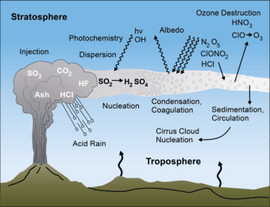

Did you know that volcanic activity has a significant impact on climate change? Volcanoes, formed when molten rock, gases, and debris escape to the Earth's surface, can cause eruptions of lava and ash. These eruptions can occur at various locations, such as plate boundaries, hotspots, or rift zones. The "Ring of Fire," encircling the Pacific Ocean, is particularly prone to volcanic activity. However, not all volcanoes erupt explosively; some, like the shield volcanoes in Hawaii, form gradually and erupt less violently. Understanding the different types of volcanoes and their eruption patterns can help predict future activity and mitigate risks to surrounding communities. In addition, volcanic eruptions, while destructive, can also provide essential nutrients to the soil. This article will delve into five key insights on how volcanic activity impacts climate change.

This image is property of d9-wret.s3.us-west-2.amazonaws.com.

## Understanding Volcanoes

### Understanding of what volcanoes are

Volcanoes are natural landforms that are formed when molten rock, known as magma, rises to the Earth's surface. This molten rock, along with gases and debris, erupts from a vent or opening in the Earth's crust, resulting in explosive eruptions of lava, ash, and other volcanic materials. Volcanoes can take various forms, ranging from towering stratovolcanoes to gentle shield volcanoes. They are an integral part of the Earth's geology and play a crucial role in shaping the planet's surface.

### Description of how volcanoes are formed

Volcanoes are formed through a complex process that involves the movement of tectonic plates, the Earth's rigid outer shell. Most volcanoes occur at plate boundaries, where two plates either collide, move apart, or slide past each other. When plates collide, one plate is forced beneath the other in a process called subduction. This subduction creates a zone where magma can ascend towards the Earth's surface, leading to the formation of explosive volcanoes.

In addition to plate boundaries, there are also hotspots beneath the Earth's crust that give rise to volcanic activity. Hotspots are areas where plumes of hot magma rise from deep within the mantle, creating a localized source of volcanic activity. As the tectonic plates move over these hotspots, volcanoes can form and persist over millions of years, resulting in chains of volcanic islands like Hawaii.

### Types of volcanoes and their characteristics

Volcanoes can be classified into several types based on their eruptive style and shape. One common type is the stratovolcano, also known as a composite volcano. These volcanoes are typically steep-sided and have a symmetrical cone shape. They are characterized by explosive eruptions that produce ash, pyroclastic flows, and sometimes lava flows.

Shield volcanoes, on the other hand, are characterized by gently sloping sides and a broad, shield-like shape. These volcanoes have less explosive eruptions and are primarily built up by effusive lava flows, resulting in the gradual expansion of the volcano over time.

Another type of volcano is the cinder cone volcano, which is characterized by steep sides and a small, cone-shaped summit crater. These volcanoes typically form from explosive eruptions of gas-rich magma, resulting in the ejection of volcanic cinders and ash.

### Geographic distribution of volcanoes globally

Volcanoes are found in various locations around the world, but they are not evenly distributed. The majority of volcanoes are located along the boundaries of tectonic plates, such as the Pacific Ring of Fire. This area encircles the Pacific Ocean and is known for its high volcanic activity and frequent earthquakes.

Other regions with significant volcanic activity include the Mediterranean region, where the African and Eurasian plates collide, and the Mid-Atlantic Ridge, which marks the boundary between the North American and Eurasian plates. Additionally, hotspots like Hawaii and Yellowstone National Park are unique regions where volcanic activity occurs away from tectonic plate boundaries.

### Determining factors of eruption patterns

Several factors influence the eruption patterns of volcanoes. One crucial factor is the viscosity of the magma. Magma with low viscosity, or fluidity, tends to flow more easily and results in lava flows rather than explosive eruptions. In contrast, magma with high viscosity is more likely to trap gas bubbles and build up pressure, leading to explosive eruptions characterized by ash, pyroclastic flows, and volcanic bombs.

The gas content of magma also plays a significant role in eruption patterns. Magma contains dissolved gases, primarily water vapor, carbon dioxide, and sulfur dioxide. As the magma rises towards the surface, the decreasing pressure allows these gases to escape, leading to eruptions. The gas content influences the explosivity of the eruption, with higher gas content generally resulting in more explosive eruptions.

Other factors, such as the shape of the volcanic vent and the presence of fractures in the Earth's crust, also influence eruption patterns. Understanding these factors and monitoring volcanic activity can help scientists predict eruptions and take necessary precautions to protect nearby communities.

## Volcanic Emissions and Their Composition

### Understanding the contents of volcanic emissions

Volcanic emissions consist of a mixture of gases, ash particles, and other volcanic materials that are released during an eruption. The composition of [volcanic emissions can vary depending on the type of volcano](https://magmamatters.com/understanding-volcanic-formation-a-comprehensive-guide/ "Understanding Volcanic Formation: A Comprehensive Guide") and its specific eruptive behavior. The primary components of volcanic emissions are gases, which are released into the atmosphere and can have profound effects on air quality, climate, and human health.

### Types of gases emitted during a volcanic eruption

During a volcanic eruption, several gases are released into the atmosphere. The most common gases emitted by volcanoes include water vapor, carbon dioxide (CO2), sulfur dioxide (SO2), hydrogen sulfide (H2S), and various amounts of other gases such as nitrogen, carbon monoxide, and hydrogen chloride.

Water vapor is the most abundant gas released during volcanic eruptions, often accounting for more than 90% of the total gas emissions. It is released as a result of the heating and vaporization of water-rich volcanic rocks and can contribute to the formation of clouds and precipitation in the vicinity of the volcano.

Carbon dioxide is another significant gas emitted by volcanoes. While human activities are the primary source of anthropogenic carbon dioxide emissions, volcanic eruptions can release large amounts of this greenhouse gas. However, the contribution of volcanic CO2 emissions to the overall increase in atmospheric carbon dioxide is relatively small compared to human-induced emissions.

Sulfur dioxide is a highly toxic gas that is released during volcanic eruptions. It can react with water vapor in the atmosphere to form sulfuric acid aerosols, which can have a cooling effect on the climate by reflecting sunlight back into space.

### Impact of ash particles in volcanic emissions

Volcanic emissions also contain ash particles, which are small fragments of volcanic rock and glass that are ejected into the air during an eruption. These ash particles can travel long distances depending on their size and the strength of the eruption. When large amounts of ash are released into the atmosphere, they can pose significant risks to human health, aviation, and the environment.

Ash particles can cause respiratory problems when inhaled, especially for individuals with pre-existing respiratory conditions. They can also damage vegetation, contaminate water sources, and disrupt ecosystems. In addition, volcanic ash can pose a threat to aviation by damaging aircraft engines and impairing visibility.

### Ratio of different gases in overall emissions

The ratio of gases in volcanic emissions can vary depending on the type of volcano and the specific conditions of the eruption. On average, water vapor typically accounts for the majority of volcanic gas emissions, followed by [carbon dioxide and sulfur](https://magmamatters.com/the-art-and-science-of-volcano-monitoring/ "The Art and Science of Volcano Monitoring") dioxide. However, the exact ratio can vary significantly between different volcanoes and individual eruptions.

The ratio of gases in volcanic emissions has important implications for their impact on climate and air quality. For example, volcanoes that release a significant amount of sulfur dioxide can have a cooling effect on the climate by creating sulfuric acid aerosols that reflect sunlight back into space. On the other hand, carbon dioxide emissions from volcanoes can contribute to the greenhouse effect and global warming, although their overall impact is relatively small compared to human-induced emissions.

This image is property of media.npr.org.

## Interaction of Volcanic Emissions with the Atmosphere

### Behaviour of volcanic emissions in the atmosphere

Once volcanic emissions are released into the atmosphere, they can undergo various physical and chemical reactions that have both immediate and long-term effects. The behavior of volcanic emissions depends on factors such as the altitude of the eruption, the composition of the gases, and the meteorological conditions.

Upon release, volcanic emissions can rise into the stratosphere, the layer of the atmosphere above the troposphere. In the stratosphere, gases such as sulfur dioxide can react with water vapor to form sulfuric acid aerosols. These aerosols can remain suspended in the atmosphere for an extended period, influencing climate patterns by reflecting sunlight back into space and causing a cooling effect.

Volcanic emissions can also interact with other atmospheric constituents such as ozone. For example, chlorine and bromine compounds released during volcanic eruptions can deplete ozone in the stratosphere, leading to the formation of the so-called ozone hole.

### How volcanic emissions interact with sunlight

Volcanic emissions can significantly influence the interaction of sunlight with the Earth's atmosphere. When large amounts of volcanic ash and aerosols are present in the atmosphere, they can scatter and absorb sunlight, leading to changes in radiation balance and temperature distribution.

As mentioned earlier, sulfuric acid aerosols formed from volcanic emissions can reflect sunlight back into space, which can have a cooling effect on the climate. This cooling effect can persist for a relatively long time, depending on the size and duration of the volcanic eruption. The most famous example of volcanic emissions influencing sunlight was the 1815 eruption of Mount Tambora in Indonesia, which led to the "Year Without a Summer" in 1816, characterized by unusually cold temperatures and crop failures worldwide.

In addition to scattering sunlight, volcanic emissions can also absorb certain wavelengths of solar radiation, particularly if they contain substances like volcanic ash or iron-rich minerals. This absorption can have localized effects on temperature and atmospheric circulation patterns in the vicinity of the volcano.

### Particles and compounds formed from these interactions

The interactions between volcanic emissions and the atmosphere can lead to the formation of various particles and compounds. For example, sulfur dioxide released during volcanic eruptions can react with other atmospheric constituents to form sulfuric acid aerosols, which can play a significant role in modifying the Earth's radiation balance.

Volcanic emissions can also lead to the formation of secondary organic aerosols, which are formed from the oxidation of organic compounds released during the eruption. These organic aerosols can influence air quality and climate by scattering and absorbing sunlight, as well as by serving as cloud condensation nuclei, affecting cloud formation and properties.

Furthermore, the chemical reactions between volcanic emissions and atmospheric components can result in the production of reactive gases such as nitrogen oxides, ozone, and halogen compounds. These reactive gases can have far-reaching effects on air quality and atmospheric chemistry, contributing to the formation of smog, the degradation of the ozone layer, and the alteration of greenhouse gas concentrations.

## Impact of Volcanic Emissions on Global Temperatures

### How volcanic emissions influence global temperatures

Volcanic emissions can have a significant impact on global temperatures, albeit temporarily. When large volcanic eruptions release large quantities of sulfur dioxide into the atmosphere, these emissions can form sulfuric acid aerosols that reflect sunlight back into space. This reflected sunlight results in a cooling effect on the Earth's surface, lowering global temperatures.

The duration and extent of this cooling effect depend on various factors, including the magnitude and frequency of volcanic eruptions, the altitude of the eruption plume, and the composition of the volcanic emissions. Large volcanic eruptions that inject sulfur dioxide into the stratosphere can have a global cooling effect for several years.

However, it is important to note that the cooling effect of volcanic emissions is temporary and short-lived compared to the long-term warming effect of greenhouse gases emitted due to human activities. While volcanic emissions can temporarily mask some of the warming caused by human-induced greenhouse gases, they do not alter the overall trend of global warming.

### The role of volcanic aerosols in cooling the planet

Sulfuric acid aerosols formed from volcanic emissions play a crucial role in cooling the planet. These aerosols reflect a significant amount of incoming sunlight back into space, preventing it from reaching the Earth's surface. This action reduces the amount of solar radiation absorbed by the Earth and leads to a cooling effect.

The cooling effect of volcanic aerosols can be substantial, depending on the magnitude of the volcanic eruption. A powerful eruption that injects a large amount of sulfur dioxide into the stratosphere can cause a noticeable decrease in global temperatures for several years. For example, the eruption of Mount Pinatubo in 1991 led to a measurable drop in global temperatures of about 0.5 degrees Celsius.

However, it is essential to recognize that the cooling effect of volcanic aerosols is temporary and typically subsides within a few years. Once the aerosols settle out of the atmosphere, their cooling effect diminishes, and the long-term warming trend driven by greenhouse gas emissions resumes.

### Duration and extent of this global cooling effect

The duration and extent of the global cooling effect resulting from volcanic emissions vary depending on several factors. These factors include the magnitude of the eruption, the altitude of the eruption plume, and the characteristics of the volcanic emissions, particularly the amount of sulfur dioxide released.

Large volcanic eruptions that inject significant quantities of sulfur dioxide into the stratosphere can have a measurable cooling effect on global temperatures for several years. However, the duration of this cooling effect gradually diminishes as the sulfuric acid aerosols settle out of the atmosphere over time.

The extent of the cooling effect also depends on the atmospheric circulation patterns and the distribution of the volcanic emissions. Volcanic aerosols can be transported globally by wind currents, which means that their cooling effect can be observed across large regions of the Earth, even far away from the eruption site.

It is important to note that while volcanic emissions can cause temporary cooling, they do not offset the long-term warming caused by human-induced greenhouse gas emissions. The overall impact of volcanic activity on global temperatures is relatively small compared to the ongoing warming trend driven by human activities.

This image is property of cdn.weatherworksinc.com.

## Comparison of Volcanic vs. Man-made Contributions to Atmospheric Aerosols

### Comparison of volumes of aerosols produced by volcanoes and human activities

When comparing the volumes of aerosols produced by volcanoes and human activities, it becomes clear that human activities are the dominant source of atmospheric aerosols. While volcanic eruptions can release significant amounts of ash and aerosols into the atmosphere, they are sporadic events that occur relatively infrequently. In contrast, human activities such as industrial processes, agriculture, and transportation release large quantities of aerosols on a continuous basis.

Anthropogenic sources of aerosols, including pollution from industrial and vehicular emissions, biomass burning, and the burning of fossil fuels, contribute significantly to atmospheric aerosol concentrations. These aerosols can have detrimental effects on air quality, human health, and climate.

Volcanic emissions, while capable of producing large amounts of ash and aerosols during eruptive phases, are episodic events and do not contribute as consistently or at the same scale as human activities. Although volcanic eruptions can have short-term effects on regional air quality and climate, their overall contribution to atmospheric aerosols is much smaller compared to anthropogenic sources.

### Comparison of impact of these aerosols on global temperatures

When comparing the impact of aerosols produced by volcanoes and human activities on global temperatures, it is clear that human activities play a more significant role. While volcanic emissions can temporarily cool the Earth's surface by scattering and reflecting sunlight, the long-term warming trend caused by human-induced greenhouse gas emissions is the primary driver of global warming.

Human-generated aerosols, such as black carbon and sulfate particles, can have both cooling and warming effects on the climate. These aerosols can directly scatter and absorb sunlight, leading to localized cooling. At the same time, they can also alter cloud properties and indirectly influence temperature patterns.

The net effect of human-induced aerosols on global temperatures is complex and varies depending on the specific type of aerosol, its distribution, and the region in which it is present. However, the overall warming effect of greenhouse gas emissions, primarily carbon dioxide, far outweighs any cooling effect that may result from aerosols, whether natural or anthropogenic.

While volcanic emissions can temporarily mask part of the warming caused by human activities, they do not alter the long-term trend of global warming. The reduction of human-induced greenhouse gas emissions remains the most effective strategy to mitigate the impact of climate change.

## Volcanic Activity and Weather Patterns

### Influence of volcanic activity on local weather

Volcanic activity can have significant influences on local weather patterns. The eruption of a volcano can introduce large amounts of ash, aerosols, and gases into the atmosphere, which can alter temperature, humidity, and precipitation patterns in the vicinity of the volcano.

The injection of volcanic ash into the atmosphere can reduce solar radiation reaching the Earth's surface, leading to a cooling effect on local temperatures. This cooling effect can be particularly noticeable during the day, with reduced daytime heating. The presence of volcanic ash can also affect rainfall patterns by acting as nuclei for cloud formation, potentially enhancing rainfall or altering the distribution of precipitation.

Furthermore, volcanic emissions can introduce large amounts of sulfur dioxide and other gases into the atmosphere, which can react with water vapor to form sulfuric acid aerosols. These aerosols can scatter and absorb sunlight, leading to changes in atmospheric heating and circulation patterns. These changes can, in turn, influence wind patterns, cloud formation, and other meteorological phenomena.

### Examples of changes in global weather patterns due to major eruptions

Major volcanic eruptions in the past have caused noticeable changes in global weather patterns. One noteworthy example is the 1815 eruption of Mount Tambora in Indonesia, which led to what is known as the "Year Without a Summer" in 1816. This eruption injected a massive amount of sulfur dioxide into the stratosphere, leading to the formation of sulfuric acid aerosols that reflected sunlight back into space.

The cooling effect of the Mount Tambora eruption resulted in unusual weather patterns across the globe. The year 1816 was characterized by abnormally cold temperatures, particularly during the summer months, and widespread crop failures. These weather anomalies were observed across Europe, North America, and other parts of the world, highlighting the global impact of major volcanic eruptions on weather patterns.

Other major eruptions, such as the 1991 eruption of Mount Pinatubo in the Philippines and the 1883 eruption of Krakatoa in Indonesia, also had noticeable effects on global weather patterns. These eruptions injected significant amounts of ash and aerosols into the atmosphere, leading to changes in temperature, rainfall, and atmospheric circulation patterns in various regions.

It is important to note, however, that the effects of volcanic eruptions on global weather patterns are temporary and typically last for a few years at most. The long-term trends in global climate and weather patterns are primarily driven by factors such as greenhouse gas emissions and natural climate variability.

This image is property of static.scientificamerican.com.

## Long-term Climate Effects of Volcanic Activity

### Extent and duration of volcanic-induced climate changes

Volcanic activity can have both short-term and long-term effects on the Earth's climate. The extent and duration of climate changes induced by volcanic eruptions depend on various factors, including the magnitude of the eruption, the composition of the volcanic emissions, and the background climate conditions.

Large volcanic eruptions that inject significant amounts of sulfur dioxide into the stratosphere can lead to a noticeable cooling effect on global temperatures. This cooling effect can persist for several years as sulfuric acid aerosols reflect sunlight back into space, reducing the amount of solar radiation reaching the Earth's surface.

The duration of the cooling effect depends on the atmospheric residence time of the sulfuric acid aerosols, as well as the rate at which new aerosols are formed and existing aerosols are removed from the atmosphere. Generally, the cooling effect gradually diminishes over time as the aerosols settle out of the atmosphere and are washed out by precipitation.

On a longer timescale, volcanic activity can also influence climate patterns through other mechanisms. Volcanic emissions of greenhouse gases, such as carbon dioxide, can contribute to the long-term warming trend of the Earth's climate. While the impact of volcanic emissions on greenhouse gases is relatively small compared to human activities, it can still play a role in shaping the Earth's climate over geological timescales.

### Potential effects of frequent volcanic eruptions on climate change

Frequent volcanic eruptions could potentially have significant effects on climate change. If volcanic activity were to increase, with eruptions occurring more frequently and on a larger scale, it could lead to a more pronounced cooling effect on global temperatures. This cooling effect could potentially offset some of the warming caused by human-induced greenhouse gas emissions.

However, it is important to note that the occurrence of frequent volcanic eruptions on such a scale is highly unlikely. Volcanic activity follows natural patterns and is influenced by various geological and tectonic processes. The occurrence of large volcanic eruptions is relatively rare on a global scale, and it is challenging to predict or project future volcanic activity accurately.

Furthermore, while volcanic emissions can temporarily mask the warming caused by greenhouse gases, they do not alter the overall trend of global warming. The long-term effects of climate change are primarily driven by human activities, such as the burning of fossil fuels, which release significant amounts of greenhouse gases into the atmosphere.

### Historical examples of volcanoes causing long-term climate change

Throughout the Earth's history, there have been several instances of volcanoes causing long-term climate change. One of the most well-known examples is the eruption of the Siberian Traps in what is now Siberia, Russia, approximately 252 million years ago. This eruption released massive amounts of lava and volcanic gases, including carbon dioxide and sulfur dioxide, over an extended period.

The emissions from the Siberian Traps volcanism contributed to a significant increase in greenhouse gases in the atmosphere, leading to a rapid and substantial warming of the climate. This warming, coupled with other factors such as ocean acidification, is believed to have played a role in the Permian-Triassic mass extinction event, which resulted in the loss of approximately 90% of all marine species and 70% of terrestrial vertebrate species at the time.

Similar long-term climate effects have been observed in other volcanic events throughout history, although the specific impacts can vary depending on the magnitude and duration of the eruptions, as well as the composition of the volcanic emissions. These historical examples highlight the potential for volcanoes to influence climate over geological timescales and serve as important reminders of the complex interactions between the Earth's geology and climate system.

## Comparison of Volcanoes and Other Natural Influences on Climate Change

### A comparison of the impact of volcanic activity versus other natural influences on climate

When compared to other natural influences on climate change, such as solar radiation and natural climate variability, the impact of volcanic activity is relatively small. While volcanic eruptions can inject large amounts of ash and aerosols into the atmosphere, which can temporarily cool the Earth's surface, their overall contribution to long-term climate change is limited.

Solar radiation, on the other hand, is the primary external source of energy that drives the Earth's climate system. Variations in solar radiation, such as changes in the sun's intensity or fluctuations in the Earth's orbit around the sun, can influence climate patterns on long timescales.

Natural climate variability, including phenomena such as El Niño and volcanic climate forcing, can also have significant effects on climate patterns. These natural variations can cause fluctuations in temperature, precipitation, and atmospheric circulation, leading to changes in regional and global climate conditions.

However, when compared to human-induced climate change driven by greenhouse gas emissions, the impact of natural influences, including volcanic activity, is relatively small. Human activities, particularly the burning of fossil fuels and deforestation, have resulted in the release of large amounts of greenhouse gases into the atmosphere, leading to a rapid and ongoing increase in global temperatures.

While volcanic activity can introduce short-term variability into climate patterns, its long-term impact is not comparable to the sustained and widespread changes caused by human activities. It is crucial to recognize the dominant role of human-induced climate change in shaping the Earth's climate and the need for mitigation and adaptation strategies to address this global challenge.

### How volcanoes stack up to other natural climate influences over time

When considering the long-term impact of different natural climate influences, it becomes clear that volcanoes play a relatively minor role compared to other factors. While volcanic eruptions can cause short-term cooling of global temperatures, their overall contribution to long-term climate change is limited.

On geological timescales, variations in solar radiation due to factors such as changes in the sun's intensity and the Earth's orbital parameters have had more pronounced and sustained effects on climate patterns. These variations, known as Milankovitch cycles, can influence the Earth's climate over timescales of tens of thousands to hundreds of thousands of years.

Natural climate variability, including phenomena such as El Niño-Southern Oscillation (ENSO) and the North Atlantic Oscillation (NAO), can also cause significant fluctuations in regional and global climate conditions. These natural variations result from interactions between the atmosphere, oceans, and land, and can lead to changes in temperature, precipitation, and atmospheric circulation patterns.

However, when compared to human-induced climate change driven by greenhouse gas emissions, both solar radiation variations and natural climate variability are overshadowed by the magnitude and rapidity of the changes caused by human activities. The increase in greenhouse gas concentrations due to human actions has already led to a measurable and sustained warming of the planet, disrupting climate patterns and leading to a wide range of impacts on ecosystems and human societies.

This image is property of www.cam.ac.uk.

## Volcanic Activity in Predicting Future Climate Changes

### Role of volcanic activity data in climate models

Volcanic activity data play a crucial role in climate models, which are used to simulate and project future climate changes. By incorporating information about past volcanic eruptions into these models, scientists can better understand the interactions between volcanic emissions, atmospheric dynamics, and climate patterns.

Volcanic activity data can provide insights into the frequency, magnitude, and characteristics of past eruptions, thereby improving the accuracy of climate model simulations. By considering historical records of volcanic eruptions and their associated impacts on climate, scientists can identify patterns and trends that can inform projections of future climate changes.

In climate models, volcanic emissions, particularly sulfur dioxide, are typically represented as forcing agents that can affect the Earth's radiation balance. These volcanic forcings can be included in climate simulations to assess their impact on temperature, precipitation, and atmospheric circulation patterns. By comparing model simulations with and without volcanic forcings, scientists can better understand the role of volcanoes in shaping past, present, and future climate conditions.

### Potential limitations of these models

While climate models that incorporate volcanic activity data are valuable tools for understanding climate changes, there are some potential limitations to consider. One limitation is the accuracy and completeness of historical records of volcanic eruptions. In some cases, especially in remote or poorly documented regions, important volcanic events may not be adequately captured in historical records, leading to uncertainties in the data used for model simulations.

Another limitation is the complexity of the interactions between volcanic emissions, the atmosphere, and the climate system. Volcanic eruptions can have cascading effects on climate patterns through various mechanisms, including the formation of aerosols, changes in atmospheric circulation, and alterations in cloud properties. Modeling these complex interactions accurately can be challenging, and uncertainties in the representation of these processes can affect the reliability of model projections.

Additionally, the inherently unpredictable nature of volcanic eruptions poses challenges for incorporating volcanic activity data into climate models. While scientists can estimate the likelihood of future eruptions based on historical patterns and geological monitoring, the specific timing and magnitude of volcanic events remain uncertain. This uncertainty introduces challenges when attempting to project the exact impact of future volcanic eruptions on climate conditions.

Despite these limitations, climate models that include volcanic activity data provide valuable insights into the role of [volcanoes in climate change](https://magmamatters.com/geothermal-energy-and-its-volcanic-origins/ "Geothermal Energy and Its Volcanic Origins") and offer a framework for assessing the potential impacts of future volcanic activity on the climate system.

## Conclusion - Balancing Volcano Hazards and Benefits in Light of Climate Change

Understanding volcanic activity is crucial for both mitigating the risks associated with volcanic hazards and harnessing the potential benefits volcanoes offer. Volcanoes, while posing significant threats to human life and infrastructure, also play a vital role in shaping the Earth's geology and influencing climate patterns.

By studying and monitoring volcanoes, scientists can better predict volcanic activity and issue timely warnings to at-risk communities. This knowledge can help save lives and minimize the impacts of volcanic eruptions. Additionally, understanding the impacts of volcanic emissions on climate change allows for improved climate models and more accurate predictions of future climate conditions.

It is essential to balance the hazards posed by volcanoes with the benefits they offer. Volcanic activity, while destructive, also has positive effects on the environment. Volcanic eruptions release nutrients into the soil, promoting fertile and productive land. Volcanic landscapes can also attract tourists, creating economic opportunities for local communities.

In the context of climate change, understanding the link between volcanic activity and climate patterns becomes increasingly important. Volcanic emissions, although temporary in their effects on temperature, can provide valuable insight into the complex interactions between the Earth's geology and climate system. This knowledge can help inform climate change mitigation strategies and guide efforts to adapt to a changing climate.

Ongoing research in the field of volcano-climate interactions is crucial for further advancing our understanding of these complex processes. By studying past volcanic events, monitoring current volcanic activity, and incorporating this knowledge into climate models, scientists can continue to improve our understanding of the connections between volcanic activity and climate change.

By recognizing the dual role of volcanoes as both benefactors and hazards, we can work towards a more comprehensive and sustainable approach to managing volcanic risks and leveraging the benefits they provide. By continuing to expand our knowledge and collaborate across disciplines, we can develop strategies that effectively balance the preservation of human life and infrastructure with the preservation of these fascinating and geologically significant natural phenomena.

