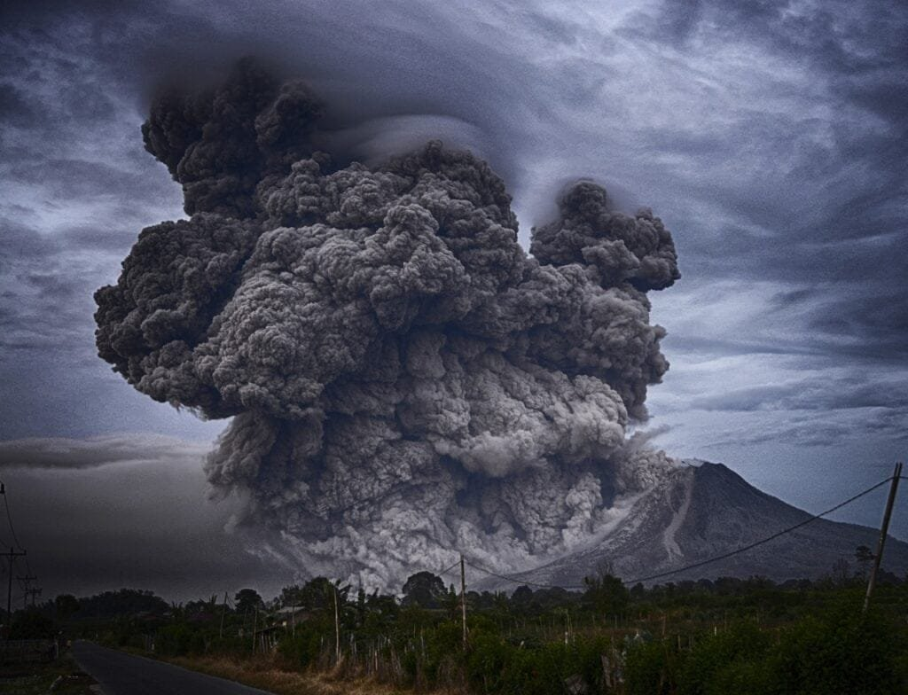

Did you know that volcanic activity has a significant impact on geology? Volcanoes, which are formed when molten rock, gases, and debris escape to the earth's surface, can cause eruptions of lava and ash. They can be found in various locations, such as plate boundaries, hotspots under the earth's crust, or rift zones where tectonic plates are moving apart. Some volcanoes, like those in the "Ring of Fire," are more prone to frequent eruptions due to their location atop plate boundaries. Understanding the different types of volcanoes, their eruption patterns, and the hazards and benefits they bring can help predict future activity and mitigate risks to surrounding communities. In this article, we will explore seven key insights into how volcanic activity impacts geology.

This image is property of pixabay.com.

## Formation of Volcanoes

Volcanoes are formed when molten rock, gases, and debris escape to the Earth's surface, causing eruptions of lava and ash. This process begins deep in the Earth's mantle, where intense heat and pressure cause rocks to melt and form magma. As the magma rises towards the surface, it collects in magma chambers. When the pressure becomes too great, the magma is expelled through cracks and fissures in the Earth's crust, resulting in a volcanic eruption.

The location of volcanoes is closely related to plate boundaries and hotspots. The majority of volcanoes are found along plate boundaries, where tectonic plates are either colliding, spreading apart, or sliding past each other. These plate boundaries are areas of high seismic activity and intense heat, making them ideal for the formation of volcanoes. Additionally, hotspots, such as the one in Hawaii, are areas where molten rock rises from deep within the Earth's mantle, creating a steady source of volcanic activity.

One [type of volcano](https://magmamatters.com/understanding-volcanic-formation-a-comprehensive-guide/ "Understanding Volcanic Formation: A Comprehensive Guide") that forms over hotspots is known as a shield volcano. Shield volcanoes have a broad, gently sloping shape and are formed by layers of basaltic lava flows. These eruptions are generally less explosive and more effusive, allowing the volcano to build up gradually over time. Shield volcanoes are typically found in areas where hotspots are present, such as Hawaii and Iceland.

## Types of Volcanoes

There are several different types of volcanoes, each with its own unique characteristics. The first type is a shield volcano, as mentioned earlier. These volcanoes have a low and broad shape, resembling a warrior's shield. They are formed by the eruption of low-viscosity lava, which flows easily and covers large areas. Shield volcanoes are known for their gentle eruptions and can reach enormous sizes, such as Mauna Loa in Hawaii.

Another type of volcano is a composite volcano, also known as a stratovolcano. These volcanoes are characterized by steep sides and a conical shape. They are composed of alternating layers of lava, ash, and volcanic debris. Composite volcanoes are associated with explosive eruptions and can be very dangerous. Examples of composite volcanoes include Mount Fuji in Japan and Mount St. Helens in the United States.

[Cinder cone](https://magmamatters.com/the-birth-of-new-land-understanding-cinder-cones/) volcanoes are the third type and are characterized by their small size and steep sides. These volcanoes are formed when particles of volcanic ash and cinders are ejected into the air and fall back to the ground, creating a cone-shaped hill. Cinder cone volcanoes are typically short-lived and have short, explosive eruptions. They can be found in volcanic fields, such as the Sunset Crater in Arizona.

The fourth type of volcano is a lava dome volcano. Lava dome volcanoes are formed by the slow extrusion of highly viscous lava, which accumulates around the vent. These volcanoes have a rounded shape and can be found within the craters of composite volcanoes. Lava dome eruptions are typically short, but they can be explosive and can result in the formation of pyroclastic flows.

This image is property of pixabay.com.

## Geographic Distribution of Volcanoes

Volcanoes are not randomly distributed across the Earth's surface; instead, they are concentrated in specific regions. One notable association is the Ring of Fire, which encircles the Pacific Ocean. The Ring of Fire is a major area of volcanic activity and is home to approximately 75% of the world's active volcanoes. This region is characterized by a continuous series of subduction zones, where one tectonic plate is forced beneath another. These subduction zones create intense heat and pressure, leading to volcanic eruptions.

Another geographic distribution of volcanoes is seen in underground hot spots and shield volcanoes like those found in Hawaii. Hot spots are areas of intense volcanic activity that are not directly associated with plate boundaries. Instead, these hot spots occur in the middle of tectonic plates, where plumes of hot magma rise from deep within the Earth's mantle. The Hawaiian Islands are a prime example of this, as they are a chain of shield volcanoes formed over a hot spot. As the Pacific Plate moves across the hot spot, new islands are formed, extending the chain.

## Volcano Eruption Mechanisms

Volcanic eruptions are complex events that are influenced by various factors. The role of magma composition and gas pressure plays a crucial role in determining the type and explosiveness of an eruption. Magma composition refers to the chemical makeup of the molten rock, including the amounts of silica and dissolved gases. High-silica magma, such as andesitic or rhyolitic magma, is more viscous and tends to trap gases, leading to explosive eruptions. Conversely, low-silica magma, such as basaltic magma, is less viscous and allows gases to escape more easily, resulting in effusive eruptions.

Tectonic activities also play a significant role in volcano eruptions. When tectonic plates collide or move apart, they create intense heat and pressure, causing magma to rise towards the surface. Subduction zones, where one plate is forced beneath another, are particularly prone to explosive eruptions due to the release of trapped gases and the high silica content of the magma.

The viscosity and content of the lava also influence the eruption patterns of volcanoes. Lava viscosity refers to how easily the lava flows, which depends on the silica content and temperature. Higher viscosity lava tends to be more explosive, as it traps gases and forms domes or plugs in the volcanic vent. On the other hand, lower viscosity lava flows more easily and can create large effusive eruptions. The type of erupted material, such as ash, lava, or pyroclastic flows, also depends on the composition of the lava and the eruption style.

This image is property of pixabay.com.

## Influence on Soil Fertility

Volcanic eruptions have both positive and negative impacts on soil fertility. When a volcano erupts, it releases a variety of minerals and nutrients, such as potassium, magnesium, and phosphorus, into the soil. These minerals are essential for plant growth and can greatly enrich the fertility of the surrounding land. Over time, volcanic soils, also known as Andisols, develop a unique structure and composition that promotes plant growth.

However, the immediate effects of a volcanic eruption can be devastating to agriculture. The ash and lava flows can bury farmland and destroy crops, leading to the loss of livelihood for farmers. The high temperatures associated with volcanic eruptions can also scorch and sterilize the soil, making it inhospitable for plant growth. Additionally, the gases released during eruptions, such as sulfur dioxide, can be toxic to plants and inhibit their ability to photosynthesize.

Despite the initial challenges, volcanic eruptions can have long-term benefits for agriculture. Over time, the volcanic ash and minerals deposited on the land can decompose and release nutrients, enhancing the fertility of the soil. This process, known as weathering, can lead to the formation of highly productive agricultural areas. However, careful planning and mitigation strategies are necessary to minimize the impact on agriculture and ensure the safety of communities living near volcanoes.

## Destructive Impacts of Volcanoes

Volcanic eruptions can cause a wide range of natural disasters that have devastating effects on both human life and the environment. One of the most immediate and dangerous consequences is the displacement and loss of life among communities living near volcanoes. The intense heat, ash clouds, and pyroclastic flows associated with eruptions can engulf entire villages and towns, leaving destruction in their wake. The sudden release of volcanic gases, such as [carbon dioxide and sulfur](https://magmamatters.com/the-art-and-science-of-volcano-monitoring/ "The Art and Science of Volcano Monitoring") dioxide, can also pose a significant threat to human health.

Volcanic eruptions also have severe environmental impacts. The ash and gases released during eruptions can travel long distances, causing air pollution and reducing visibility. Ash falls can destroy vegetation, smother bodies of water, and disrupt ecosystems. Additionally, the release of sulfur dioxide can lead to the formation of acid rain, which can have detrimental effects on plants, animals, and water bodies. The long-term consequences of these environmental impacts are still being studied, highlighting the need for continued research and monitoring of volcanic activity.

## Role in Formation of New Land

Volcanoes play a crucial role in the formation of new land, particularly in the creation of islands. When volcanic eruptions occur underwater, they create underwater volcanoes or seamounts. Over time, repeated eruptions can build up these seamounts and eventually bring them above the water's surface, forming new islands. This process is exemplified by the formation of volcanic islands like Hawaii, where a series of shield volcanoes have emerged from the ocean floor.

In addition to forming new islands, volcanoes also contribute to the extension of existing land structures. The lava and volcanic debris erupted by volcanoes can accumulate and create new landforms, such as lava plateaus and volcanic fields. These landforms can provide valuable habitats for plants and animals and can even be utilized for human activities such as agriculture or infrastructure development.

The formation of new land through volcanic activity also has implications for the theory of continental drift. Volcanic activity occurring at divergent plate boundaries, where tectonic plates are moving apart, can contribute to the widening of ocean basins and the separation of continents. By analyzing the volcanic rocks and landforms, scientists can gain insights into the history of continental drift and the evolution of Earth's landmasses over time.

## Contribution to Climate Change

Volcanic eruptions have the potential to impact global climate patterns and contribute to climate change. One way in which they do this is through the release of gases, such as carbon dioxide and sulfur dioxide. These gases can trap heat in the Earth's atmosphere, leading to an increase in global temperatures. While the emissions from volcanic eruptions are relatively small compared to human-made greenhouse gases, they can still have local and regional effects on climate.

Volcanic ash also plays a role in climate change. When large amounts of ash are injected into the atmosphere, they can reflect sunlight back into space and lower the Earth's radiation balance. This can result in a cooling effect on the planet's surface, leading to temporary decreases in global temperatures. The impacts of volcanic ash on climate are most pronounced following large-scale eruptions, such as the 1991 eruption of Mount Pinatubo in the Philippines, which caused a measurable cooling effect worldwide.

In addition to these short-term effects, volcanic eruptions can also lead to volcanic winters. These are periods of prolonged cooling caused by massive volcanic eruptions that inject a significant amount of ash and sulfur dioxide into the atmosphere. The ash and gases create a layer in the stratosphere that can block sunlight and reduce temperatures for several years or even decades. The most famous example of a volcanic winter is the eruption of Mount Tambora in 1815, which resulted in a year without a summer in many parts of the world.

## Importance in Predicting Future Geologic Events

Studying volcanoes is essential for predicting and understanding future geologic events. Volcanoes can serve as indicators for earthquake activity, as they are often located in regions of high tectonic stress. Monitoring volcanic activity, such as changes in gas emissions or ground deformation, can provide valuable insights into the state of the underlying tectonic plates. By studying these indicators, scientists can better predict when and where earthquakes are likely to occur.

Monitoring volcanic activity is also crucial for predicting volcanic eruptions. Rising magma within a volcano can cause detectable changes in the ground's surface, such as ground uplift or the formation of new fissures. Changes in gas emissions, such as an increase in sulfur dioxide, can also serve as warning signs of an impending eruption. By continuously monitoring these parameters, scientists can issue early warnings and help evacuate at-risk communities, saving lives and minimizing the impact of eruptions.

Understanding volcanoes and their behavior also plays a role in assessing the long-term hazards and risks associated with volcanic activity. By studying past eruptions and their effects, scientists can develop hazard maps and risk assessments for volcanic regions. This information is crucial for the development of effective evacuation and response strategies, as well as the construction of resilient infrastructure that can withstand volcanic fallout. Additionally, educating communities about the risks and safety protocols associated with volcanoes is essential for their preparedness and resilience in the face of future geologic events.

## Risk Mitigation for Communities

Communities living near volcanoes face unique risks and challenges, but there are strategies and measures that can be implemented to mitigate these risks. Developing evacuation and response strategies is crucial to ensure the safety of residents during volcanic eruptions. This includes establishing evacuation routes, safe zones, and early warning systems that can alert residents of imminent eruptions. Communities should also conduct regular drills and exercises to familiarize residents with evacuation procedures and enhance preparedness.

Building structures that can withstand volcanic fallout is another important aspect of risk mitigation. This includes constructing buildings with reinforced structures and designing roofs that can withstand the weight of volcanic ash. Installing air filtration systems to remove ash and toxic gases from indoor environments can also help protect the health of residents. Additionally, communities should develop plans for sheltering in place and stockpile essential supplies, such as food, water, and medical resources, in case of extended eruptions or disruptions to infrastructure.

Education and awareness about the risks and safety protocols associated with volcanic activity are crucial for community preparedness. Local authorities should provide comprehensive information about volcanic hazards, evacuation procedures, and emergency contact numbers. School curricula should also include education on volcanic activity and its potential impacts. Engaging the community through public lectures, workshops, and information campaigns can further enhance preparedness and ensure that residents know how to respond in the event of a volcanic eruption.

In conclusion, understanding volcanoes is essential for comprehending the [impacts of volcanic activity on geology](https://magmamatters.com/geothermal-energy-and-its-volcanic-origins/ "Geothermal Energy and Its Volcanic Origins") and society. The formation of volcanoes, their types, and geographic distribution shape the characteristics of eruptions and the associated hazards. Volcanoes have both positive and negative effects on soil fertility, agriculture, and the environment. They play a significant role in the formation of new land and contribute to climate change through their gas emissions and ash particles. Studying volcanoes allows us to predict future geologic events, mitigate risks to communities, and develop strategies for resilience. By prioritizing risk mitigation strategies, such as evacuation planning, building resilient infrastructure, and increasing public awareness, communities can minimize the impact of volcanic activity and protect the well-being of their residents.

