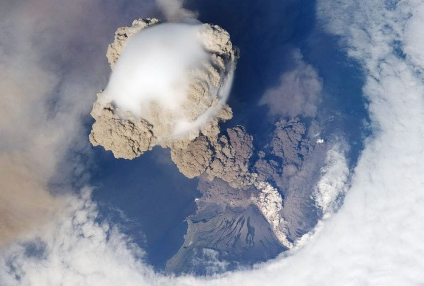
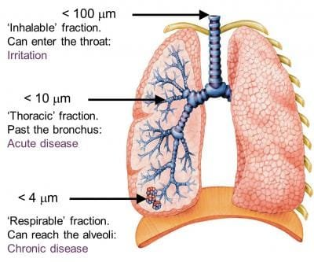
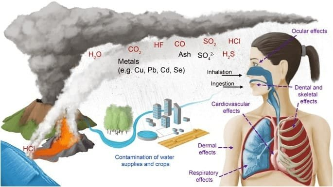
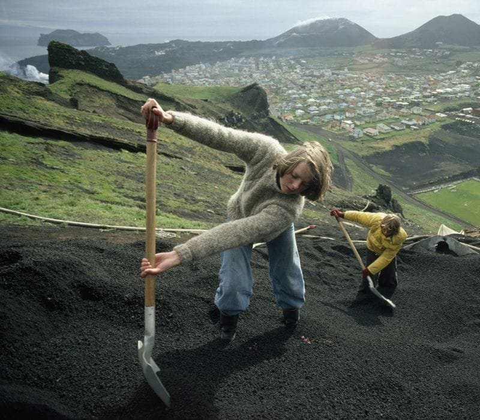

Volcanic eruptions can have a significant impact on human habitats, particularly through the deposition of volcanic ash. As molten rock, gases, and debris are ejected from a volcano, ash is released into the atmosphere, and can travel great distances depending on wind patterns. When this ash settles onto the surrounding areas, it can cause a range of problems for human populations. The fine particles can disrupt air quality, making it difficult to breathe, and can also contaminate water sources. Additionally, the weight of volcanic ash can cause structural damage to buildings and infrastructure. [Understanding the effects of volcanic](https://magmamatters.com/understanding-volcanic-formation-a-comprehensive-guide/ "Understanding Volcanic Formation: A Comprehensive Guide") ash on human habitats is crucial for developing strategies to mitigate the risks and protect communities in volcanic regions.

  

## Impact of Volcanic Ash on Air Quality

Volcanic ash particles can have a significant impact on air pollution. When a volcano erupts, it releases ash into the atmosphere, which can be carried by winds over long distances. These ash particles can contribute to the deterioration of air quality by increasing the concentration of particulate matter in the air.

Inhaling volcanic ash can pose potential health risks. The fine particles of ash can irritate the respiratory system and cause respiratory issues such as coughing, wheezing, and shortness of breath. People with pre-existing respiratory conditions, such as asthma or chronic obstructive pulmonary disease (COPD), are particularly vulnerable to the health effects of inhaling volcanic ash.

Volcanic ash can also impact the visibility and safety of air travel. Ash particles can be hazardous to aircraft engines, as they can cause abrasion and potentially lead to engine failure. In addition, the presence of ash in the atmosphere reduces visibility, making it difficult for pilots to navigate safely. This can result in flight cancellations and disruptions to air travel.

## Influence of Volcanic Ash on Water Sources

The contamination of water bodies is another significant impact of volcanic ash. When ash settles on the surface of lakes, rivers, and streams, it can contaminate the water, making it unsafe for human consumption and affecting aquatic life. The ash can introduce various chemicals and heavy metals into the water, posing a threat to both human health and the ecosystem.

Volcanic ash can also cause damage to water supply systems. The abrasive nature of the ash particles can wear down pipes and infrastructure, leading to leaks and disruptions in the water supply. This can result in water shortages and the need for extensive repairs and maintenance.

The presence of volcanic ash in water bodies can have adverse effects on marine life and water-based ecosystems. The ash can decrease the oxygen levels in the water, suffocating fish and other aquatic organisms. It can also block sunlight from reaching underwater plants, disrupting photosynthesis and impacting the entire food chain.

This image is property of images.nationalgeographic.org.

## Effect on Infrastructure and Transportation

Volcanic ash can cause significant damage to buildings, roads, and bridges. The weight of accumulated ash can put pressure on structures, leading to structural damage and potential collapse. The abrasive nature of the ash can also erode surface materials, further weakening infrastructure.

The impact of volcanic ash extends to electrical and communication networks. Ash particles can accumulate on power lines and insulators, causing electrical outages and disruptions to communication systems. This can result in a loss of power, affecting homes, businesses, and essential services.

Public and private transportation services also face challenges in the presence of volcanic ash. The accumulation of ash on roads and runways can make them slippery, reducing traction and increasing the risk of accidents. In addition, reduced visibility due to ash in the atmosphere can hinder safe navigation and lead to delays or cancellations of transportation services.

## Volcanic Ash and Agriculture

The impact of volcanic ash on agriculture can be severe. Ashfall can damage crops by covering them with a thick layer of fine particles, blocking sunlight, and inhibiting photosynthesis. This can result in reduced crop yields and even crop failures, leading to significant economic losses for farmers and food shortages for communities.

Volcanic ash can also have long-term effects on soil fertility. While volcanic ash contains nutrients that can initially benefit plants, prolonged exposure to high levels of ash can alter the soil pH and nutrient composition. This can lead to imbalances in soil fertility, making it challenging for certain crops to grow and thrive.

Additionally, volcanic ash can contain harmful substances, such as heavy metals and toxic gases, which can be absorbed by plants. This poses a risk to food safety, as these substances can accumulate in crops and potentially be ingested by humans, posing health hazards.

This image is property of volcanoes.usgs.gov.

## Influence on Regional and Global Climate

The presence of volcanic ash particles in the atmosphere can have a significant impact on regional and even global climate. Ash particles can reflect sunlight back into space, leading to a reduction in sunlight reaching the Earth's surface. This can result in cooling effects on the climate, temporarily lowering temperatures in the surrounding area.

Large volcanic eruptions can even induce volcanic winters, where the substantial amount of ash and gases expelled into the atmosphere create a cooling effect on a global scale. This can cause a decrease in global temperatures, resulting in altered weather patterns, disrupted agricultural cycles, and other climate-related impacts.

While volcanic ash can have short-term cooling effects, the release of gases during volcanic eruptions, such as [carbon dioxide and sulfur](https://magmamatters.com/the-art-and-science-of-volcano-monitoring/ "The Art and Science of Volcano Monitoring") dioxide, can contribute to global warming and climate change in the long term. These gases can trap heat in the atmosphere, leading to increased temperatures and further environmental changes.

## Economy and Livelihood Impact

The impact of volcanic ash on the economy and livelihoods of communities near volcanic eruptions can be significant. Local businesses and industries, such as agriculture, tourism, and transportation, can suffer from the disruptions caused by volcanic ash.

Agricultural sectors heavily rely on stable crop yields for their income and food production. The damage to crops caused by volcanic ash can result in decreased agricultural productivity, leading to financial losses for farmers and higher prices for agricultural products. This can have a ripple effect on the entire supply chain, affecting food availability and affordability.

The costs associated with cleanup and reconstruction after ashfall can also place a burden on communities. Removing ash from structures, roads, and other infrastructure requires significant resources and manpower. Furthermore, repairs and restoration of damaged buildings and facilities can be costly, diverting funds from other development initiatives.

The tourism industry can also be severely impacted by volcanic ash. Eruptions and the resulting ashfall often lead to the closure of popular tourist destinations, cancellation of flights, and the perception of heightened risk. This can result in a decline in tourist arrivals, affecting the local economy and livelihoods dependent on tourism revenue.

This image is property of media.springernature.com.

## Mitigation Strategies for Volcanic Ash Fallout

To mitigate the impacts of volcanic ash fallout, it is crucial to take precautions during volcanic eruptions. Early warning systems and monitoring mechanisms can help alert communities of impending eruptions, allowing for timely evacuation and preparation. Governments and relevant authorities should establish clear communication channels to ensure residents are well-informed and can take appropriate action to protect themselves.

Cleaning up after ashfall requires comprehensive strategies and coordination. Removing ash from roads, roofs, and infrastructure should be done cautiously to minimize the resuspension and dispersal of ash particles. Regular monitoring of air quality is essential to assess potential health risks and determine when it is safe for communities to resume normal activities.

In terms of infrastructure, structural adjustments and improvements can be made to withstand the impact of volcanic ash. This includes designing buildings and roads that are more resistant to ash accumulation and erosion. Implementing appropriate filtration systems in ventilation and air conditioning systems can help reduce the infiltration of ash particles into indoor spaces.

## Case Studies of Major Volcanic Eruptions

Studying past volcanic eruptions can provide valuable insights into the impacts of volcanic ash on human habitats and guide future mitigation efforts. Three notable case studies include:

### 1980 Mount St. Helens eruption:

The eruption of Mount St. Helens in Washington state, USA, resulted in the release of a massive amount of volcanic ash. The ashfall affected air quality, causing health concerns for nearby communities. It also had a significant impact on agriculture and forestry, damaging crops and forests over a wide area. The eruption led to the reevaluation of emergency response procedures and the implementation of improved monitoring systems.

### 2010 Eyjafjallajökull eruption:

The eruption of Eyjafjallajökull in Iceland disrupted air travel across Europe for several weeks. The high concentration of volcanic ash in the atmosphere posed a risk to aircraft engines, leading to numerous flight cancellations and diversions. The incident highlighted the need for better coordination among aviation authorities and improved forecasting models to determine the extent and movement of ash clouds.

### 1815 Mount Tambora eruption:

The eruption of Mount Tambora in Indonesia was one of the most powerful volcanic eruptions in recorded history. The massive amount of ash and gases expelled during the eruption caused a worldwide climate anomaly known as the "Year Without a Summer" in 1816. This resulted in unusual weather patterns, crop failures, and food shortages in various parts of the world. The event led to increased scientific interest in studying the impacts of volcanic eruptions on global climate.

This image is property of images.nationalgeographic.org.

## Community Preparedness and Response

Timely communication and access to accurate information are crucial for community preparedness and response to volcanic eruptions and ashfall. Governments and disaster management agencies should establish effective communication channels to provide updates on volcanic activity, ashfall predictions, and evacuation plans. This allows residents to make informed decisions and take appropriate measures to ensure their safety.

Community cooperation and organization are vital during volcanic eruptions. Local communities should actively participate in disaster preparedness programs, such as emergency drills and training sessions. This helps build awareness and resilience within communities, enabling them to respond effectively to [volcanic hazards](https://magmamatters.com/the-environmental-impact-of-volcanic-eruptions-2/ "The Environmental Impact of Volcanic Eruptions"). Collaborative efforts between residents, local authorities, and non-governmental organizations are essential for a comprehensive and coordinated response.

Understanding and implementing evacuation plans is crucial in areas prone to volcanic eruptions. Communities should have clear evacuation routes, designated shelters, and early warning systems in place. Regular drills and rehearsals can help familiarize residents with evacuation procedures, ensuring a swift and organized response during emergencies.

## Future Research and Predictions

Advancements in [technology](https://magmamatters.com/geothermal-energy-and-its-volcanic-origins/ "Geothermal Energy and Its Volcanic Origins") and scientific understanding are continuously improving our ability to predict volcanic eruptions and assess the long-term impacts of volcanic ash on human habitats. Future research in this field will build upon existing knowledge and address remaining uncertainties.

Predicting volcanic eruptions and ash fallout is a pressing research area. Scientists are developing models and monitoring systems that can provide more accurate predictions of volcanic activity, ash dispersal, and potential hazards. These advancements can help authorities make informed decisions regarding evacuation plans and the allocation of resources during volcanic crises.

Understanding the long-term impacts of volcanic ash on human habitats is also essential for developing appropriate mitigation strategies. Researchers are studying the long-term effects of ash on soil fertility and plant growth, as well as the health impacts of prolonged exposure to volcanic ash. This knowledge can guide land use planning and agricultural practices in volcanic regions, ensuring sustainable development and minimizing risks to human health.

Developments in mitigating the impact of volcanic ash are also on the horizon. Scientists and engineers are exploring innovative strategies to minimize the effects of ash on infrastructure, such as the development of protective coatings and materials. Additionally, advancements in air filtration and purification technologies can aid in reducing the infiltration of ash particles into indoor spaces, improving air quality and protecting human health.

In conclusion, the impact of volcanic ash on human habitats is multi-faceted and wide-ranging. From its influence on air quality and water sources to its effects on infrastructure, agriculture, climate, economy, and livelihoods, volcanic ash can pose significant challenges to communities near volcanic eruptions. However, through research, preparedness, and mitigation strategies, we can better understand and mitigate the impacts of volcanic ash, ensuring the safety and resilience of affected populations.

Related Posts: [Mitigating Risks: Forecasting Volcanic Activity in Prone Areas](https://magmamatters.com/mitigating-risks-forecasting-volcanic-activity-in-prone-areas/), [The Formation and Eruption Patterns of Volcanoes](https://magmamatters.com/the-formation-and-eruption-patterns-of-volcanoes-4/), [The Pyroclastic Phenomena of Pompeii: 7 Insights to Explore](https://magmamatters.com/the-pyroclastic-phenomena-of-pompeii-7-insights-to-explore/), [Tips for Capturing Volcano Pyroclastic Flow Photos](https://magmamatters.com/tips-for-capturing-volcano-pyroclastic-flow-photos/), [Understanding Volcanoes and Their Eruption Patterns](https://magmamatters.com/understanding-volcanoes-and-their-eruption-patterns/)
