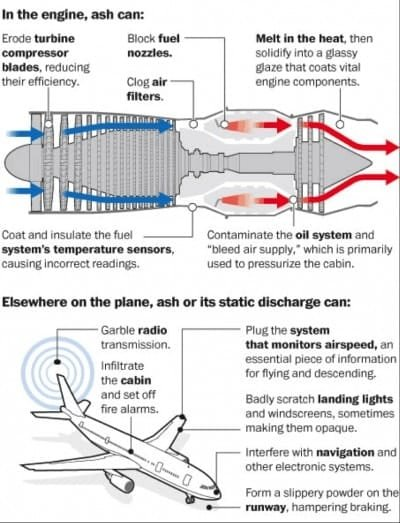
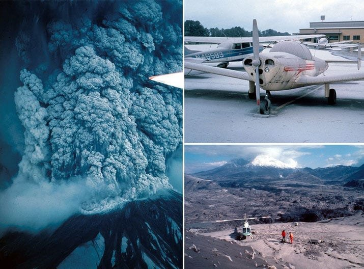
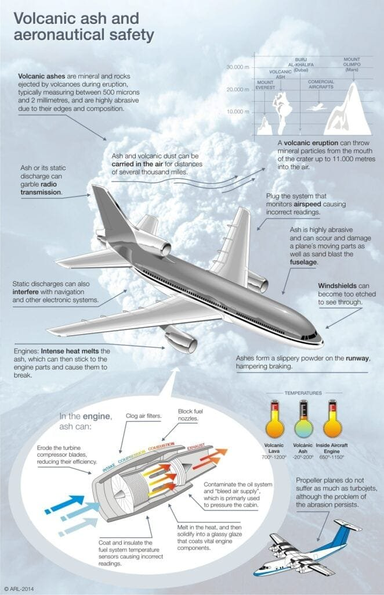
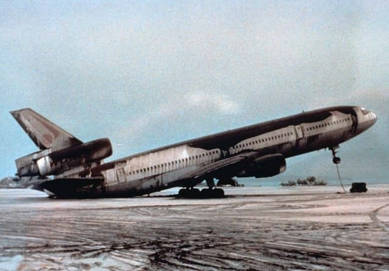
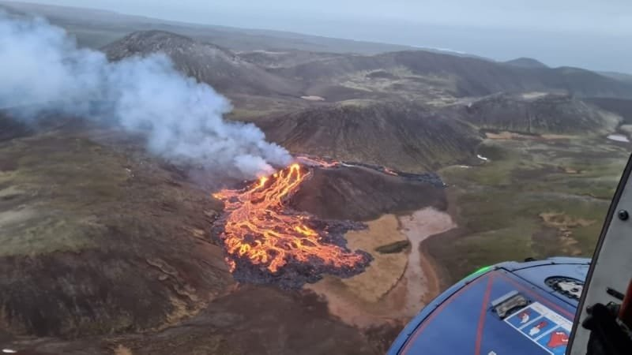

Imagine the awe-inspiring sight of a volcanic eruption, with molten lava shooting into the sky and ash billowing into the atmosphere. While these natural wonders captivate us with their power and beauty, they can also have a profound impact on aviation history. In this article, we will delve into the fascinating world of volcanic eruptions and explore their consequences on the aviation industry. From disrupted flights to damaged aircraft, you'll discover the top five volcanic eruptions that have shaped aviation history. So fasten your seatbelt and prepare for an unforgettable journey through the impact of volcanoes on the skies above.

# Understanding Volcanic Eruptions

[Volcanic eruptions are a powerful and unpredictable force of nature](https://magmamatters.com/the-environmental-impact-of-volcanic-eruptions-2/ "The Environmental Impact of Volcanic Eruptions"). They can have a significant impact on various aspects of life, including aviation. It is crucial to [understand the procedures and types of volcanic](https://magmamatters.com/understanding-volcanic-formation-a-comprehensive-guide/ "Understanding Volcanic Formation: A Comprehensive Guide") eruptions, as well as their effects on aircraft performance. In this article, we will explore some notable incidents involving volcanic eruptions and their implications for aviation. We will also discuss the importance of detecting volcanic eruptions early and the role of aviation policies and guidelines in mitigating the risks associated with them. Finally, we will examine the crucial role of volcano observatories in data collection and monitoring, as well as successful evading strategies that have been implemented in the past.

This image is property of volcanoes.usgs.gov.

## Procedures in Volcanic Eruptions

When a volcano erupts, it releases molten rock, gases, and debris onto the earth's surface. These eruptions can occur at different locations, such as plate boundaries, hotspots, or rift zones. The eruption patterns vary depending on factors like lava viscosity and gas content. Understanding these procedures is vital for predicting volcanic activity and assessing its potential impact on aviation.

## Types of Volcanic Eruptions

Volcanic eruptions can be classified into different types based on their characteristics. Some of the commonly known types include effusive eruptions, explosive eruptions, and phreatomagmatic eruptions. Effusive eruptions occur when lava flows steadily from the volcano without violent explosions. Explosive eruptions, on the other hand, involve the sudden release of gas and volcanic materials, resulting in a more violent and dangerous event. Phreatomagmatic eruptions occur when water comes into contact with magma, leading to explosive activity. Understanding these types of eruptions is crucial for assessing the potential risks to aviation.

## Eruptions and Aviation

The impact of volcanic eruptions on aviation can be significant. This impact can be seen in various aspects, including engine failure and damage, navigation and communication challenges, and visibility impairment. The volcanic ash that is released during an eruption can cause serious damage to aircraft engines, leading to engine failure or reduced performance. Additionally, the presence of volcanic ash in the atmosphere can disrupt navigation systems and interfere with communication between pilots and air traffic controllers. Furthermore, the ash can reduce visibility, making it difficult for pilots to safely operate their aircraft.

## Impact on Aircraft Performance

One of the most critical effects of volcanic eruptions on aviation is the potential for engine failure and damage. When volcanic ash is ingested into an aircraft's engines, it can cause abrasion, corrosion, and melting of engine parts. The ash, which is made up of fine particles of glass and rock, can melt in the hot combustion chamber of the engine and coat the turbine blades. This melting and coating can lead to engine failure or a significant decrease in performance, putting the safety of the aircraft and its passengers at risk.

## Navigation and Communication Challenges

Volcanic ash can have significant implications for the navigation and communication systems of aircraft. The presence of volcanic ash in the atmosphere can interfere with the accuracy of navigation systems, such as GPS, making it difficult for pilots to determine their precise location. This can lead to navigational errors and increase the risk of accidents. Additionally, volcanic ash can disrupt communication systems, making it challenging for pilots to communicate with air traffic controllers or other aircraft in the vicinity. This lack of communication can lead to confusion and potential collisions.

This image is property of miro.medium.com.

## Visibility Impairment

Another crucial impact of volcanic eruptions on aviation is the impairment of visibility. Volcanic ash can reduce visibility by creating a hazy atmosphere and obscuring the pilot's view. This reduced visibility makes it challenging for pilots to see other aircraft, obstacles, or landmarks, increasing the risk of accidents. Moreover, volcanic ash can also affect the clarity of cockpit windows, further reducing visibility and making it even more difficult for pilots to navigate safely.

## 1977 KLM Flight 867 Incident

The 1977 KLM Flight 867 incident serves as a sobering example of the dangers posed by volcanic eruptions to aviation. The incident occurred on January 30, 1977, when KLM Flight 867, a Boeing 747 en route from Amsterdam to Tokyo, encountered a volcanic eruption near Anchorage, Alaska. The eruption was caused by the volcanic activity of Mount Bulusan in the Philippines, which injected volcanic ash into the upper atmosphere.

## Volcano Behind the Incident

The eruption of Mount Bulusan in the Philippines was the primary cause of the volcanic ash encountered by KLM Flight 867. Mount Bulusan is an active stratovolcano located in the province of Sorsogon in the Philippines. It is known for its frequent eruptions, and the volcanic ash it produces can travel long distances through the atmosphere.

## Impact on the Flight

The encounter with volcanic ash had severe consequences for KLM Flight 867. The volcanic ash entered the aircraft's engines, causing a loss of engine power and damage to the turbine blades. This loss of power forced the pilot to make an emergency landing at Anchorage International Airport. Fortunately, all passengers and crew members survived the incident. However, this incident highlighted the potential dangers of volcanic ash to aviation and the importance of implementing measures to detect and avoid volcanic ash clouds.

## Learnings and Ramifications

The 1977 KLM Flight 867 incident served as a catalyst for significant changes in aviation practices and policies. The incident prompted the development of improved detection systems for volcanic ash, as well as the establishment of guidelines and procedures to help pilots avoid volcanic ash clouds. It also increased awareness among aviation authorities and airlines about the potential risks associated with volcanic eruptions, leading to the implementation of measures to mitigate these risks.

This image is property of aertecsolutions.com.

## 2010 Eyjafjallajökull Eruption

One of the most notable volcanic eruptions in recent history was the 2010 eruption of Eyjafjallajökull in Iceland. This eruption had a massive impact on air travel, causing widespread disruption and economic consequences.

## Volcano and Eruption Overview

Eyjafjallajökull is a stratovolcano located in southern Iceland. Its eruption in 2010 was characterized by the release of large amounts of volcanic ash into the atmosphere. The ash plume reached high altitudes and spread over a large area, affecting air travel across Europe.

## Massive Air Travel Disruption

The volcanic ash from the Eyjafjallajökull eruption caused the most extensive airspace closure in Europe since World War II. The ash cloud posed a significant threat to aircraft engines, leading to the closure of airspace and the cancellation of thousands of flights. The disruption lasted for several days, affecting millions of passengers and causing significant economic losses to airlines and the tourism industry.

## Economic Impact

The economic impact of the Eyjafjallajökull eruption was significant. The closure of airspace and the cancellation of flights resulted in lost revenue for airlines and travel companies. Additionally, the disruption affected other industries that rely on air travel, such as tourism and freight transportation. The total economic loss from the eruption was estimated to be in the billions of dollars.

## 1982 British Airways Flight 9 Incident

The 1982 British Airways Flight 9 incident, also known as the "Jakarta incident," is another notable example of the impact of volcanic eruptions on aviation. The incident occurred on June 24, 1982, when a British Airways Boeing 747 flew through a cloud of volcanic ash from the eruption of Mount Galunggung in Indonesia.

This image is property of www.nps.gov.

## Volcano Behind the Incident

The eruption of Mount Galunggung in Indonesia was the primary cause of the volcanic ash encountered by British Airways Flight 9. Mount Galunggung is an active stratovolcano located in West Java, Indonesia. The volcanic ash it produces poses a significant risk to aviation.

## Impact on the Flight

The encounter with volcanic ash had severe consequences for British Airways Flight 9. The volcanic ash caused all four engines to flame out, leading to a loss of power. The aircraft descended rapidly before the engines could be restarted, and the crew was forced to make an emergency landing at Jakarta Airport. Thankfully, all passengers and crew members survived the incident. This incident highlighted the need for improved detection systems and increased awareness among pilots about the hazards associated with volcanic ash.

## Learnings and Ramifications

The 1982 British Airways Flight 9 incident resulted in significant changes to aviation practices and procedures. It led to the establishment of guidelines and protocols for avoiding volcanic ash clouds and the development of improved engine protection systems. The incident also underscored the importance of pilot training and awareness regarding the risks associated with volcanic ash. Safety measures were put in place to ensure that such incidents could be avoided in the future.

## Detecting Volcanic Eruptions

Early detection of volcanic eruptions is crucial in mitigating the risks they pose to aviation. Detecting and monitoring volcanic activity allows aviation authorities to issue timely warnings and advisories to pilots, enabling them to avoid areas affected by volcanic ash.

## Importance of Early Detection

Early detection of volcanic eruptions allows aviation authorities to take prompt action and issue warnings to pilots. This early warning system helps pilots avoid flying into areas with high concentrations of volcanic ash, reducing the risk of engine failure and damage. Early detection also allows airlines to adjust flight routes and minimize disruptions to air travel.

This image is property of nats.aero.

## Emerging Technologies in Detection

Advancements in [technology have significantly improved the detection of volcanic](https://magmamatters.com/geothermal-energy-and-its-volcanic-origins/ "Geothermal Energy and Its Volcanic Origins") eruptions. Volcanic ash detection systems, such as weather radars, satellite imagery, and lidar systems, enable aviation authorities to monitor the movement and dispersion of volcanic ash clouds in real-time. These technologies provide crucial information that helps aviation authorities make informed decisions and issue timely warnings to pilots.

## Impacts on Aviation Routes

The detection of volcanic eruptions and the monitoring of volcanic ash clouds have a significant impact on aviation routes. When a volcanic eruption occurs, aviation authorities may need to close airspace or reroute flights to ensure the safety of aircraft and passengers. This can lead to flight delays, cancellations, and changes in flight paths, causing disruptions to air travel.

## Aviation Policies and Guidelines to Volcanic Eruptions

Aviation policies and guidelines play a crucial role in mitigating the risks associated with volcanic eruptions. International standards and practices, along with the efforts of aviation authorities, help ensure that airlines and pilots are adequately prepared to handle volcanic ash encounters.

## International Standards and Practices

International organizations, such as the International Civil Aviation Organization (ICAO), have established standards and practices to guide aviation authorities and airlines in responding to volcanic eruptions. These standards include the establishment of volcanic ash advisory centers, the development of ash detection and monitoring systems, and the dissemination of information and warnings to pilots.

## Role of Aviation Authorities

Aviation authorities play a crucial role in managing the risks posed by volcanic eruptions. They are responsible for monitoring volcanic activity, issuing warnings and advisories to pilots, and coordinating airspace closures and flight rerouting. Aviation authorities also collaborate with meteorological agencies, volcano observatories, and other relevant organizations to gather information and make informed decisions.

## Volcano Hazard Mitigation Efforts

Volcano hazard mitigation efforts aim to minimize the impact of volcanic eruptions on aviation and surrounding communities. These efforts involve a combination of monitoring and detection systems, public education and awareness campaigns, and infrastructure development. By implementing these measures, the risks associated with volcanic eruptions can be reduced, ensuring the safety of both air travel and the general population.

## Volcano Observatories and Their Roles

Volcano observatories play a vital role in the monitoring and management of volcanic eruptions. They collect data, communicate with aviation authorities, and contribute to mitigation and preparedness strategies.

## Data Collection and Monitoring

Volcano observatories are responsible for collecting data on volcanic activity, such as [seismic activity](https://magmamatters.com/the-art-and-science-of-volcano-monitoring/ "The Art and Science of Volcano Monitoring"), gas emissions, and ground deformation. This data is crucial for monitoring volcanic eruptions and assessing their potential impact on aviation. Observatories use various instruments, including seismometers, gas analyzers, and satellite imagery, to gather this information.

## Communication with Aviation Authorities

Volcano observatories collaborate closely with aviation authorities to share information and provide timely updates on volcanic activity. This collaboration ensures that aviation authorities have the most up-to-date information to issue warnings and advisories to pilots. Clear communication channels between observatories and aviation authorities are essential for effective risk management.

## Mitigation and Preparedness Strategies

Volcano observatories contribute to mitigation and preparedness strategies by providing essential information for decision-making. They assist in the development of eruption scenarios, risk assessments, and emergency response plans. By working closely with aviation authorities, observatories help ensure that appropriate measures are in place to mitigate the risks associated with volcanic eruptions.

## Examples of Successful Evading Strategies

Successful evading strategies have been implemented in the past to minimize the impact of volcanic eruptions on aviation. These strategies involve a combination of proactive measures and practical decision-making.

## Case Studies of Successful Evading Strategies

One example of a successful evading strategy is the response to the Eyjafjallajökull eruption in 2010. Aviation authorities promptly closed airspace and rerouted flights to avoid the volcanic ash cloud. This proactive decision minimized the risks to aircraft and passengers, preventing potential engine failures and damage. Another example is the development of volcanic ash advisory centers, which provide real-time information and assistance to pilots in avoiding volcanic ash clouds.

## Lessons Learned

The implementation of successful evading strategies has provided valuable lessons for future airlines operations. It has highlighted the importance of early detection, effective communication, and proactive decision-making. These lessons reinforce the need for ongoing collaboration between aviation authorities, volcano observatories, and other relevant stakeholders.

## Implications for Future Airlines Operations

The impact of volcanic eruptions on aviation has significant implications for future airline operations. It underscores the importance of continuous monitoring and early detection systems, as well as the need for robust communication channels between aviation authorities and observatories. It also highlights the necessity for ongoing training and education for pilots and airlines to ensure they are well-prepared to handle volcanic ash encounters.

## Summary of the Impact of Volcanic Eruptions

In conclusion, volcanic eruptions have a significant impact on aviation. They can cause engine failure and damage, navigation and communication challenges, and visibility impairment. Incidents such as the 1977 KLM Flight 867 and the 1982 British Airways Flight 9 serve as reminders of the dangers posed by volcanic ash to aircraft and their passengers. The eruption of Eyjafjallajökull in 2010 and the resulting air travel disruption demonstrate the economic consequences of volcanic eruptions. Detecting volcanic eruptions early, implementing aviation policies and guidelines, and establishing volcano observatories with their crucial roles are essential in mitigating the risks associated with volcanic eruptions. Successful evading strategies, such as airspace closures and rerouting, provide valuable lessons for future airline operations. By understanding and addressing the impact of volcanic eruptions, the aviation industry can continue to operate safely amidst volcanic activity.

Related Posts: [Mitigating Risks: Forecasting Volcanic Activity in Prone Areas](https://magmamatters.com/mitigating-risks-forecasting-volcanic-activity-in-prone-areas/), [The Formation and Eruption Patterns of Volcanoes](https://magmamatters.com/the-formation-and-eruption-patterns-of-volcanoes-4/), [The Pyroclastic Phenomena of Pompeii: 7 Insights to Explore](https://magmamatters.com/the-pyroclastic-phenomena-of-pompeii-7-insights-to-explore/), [Tips for Capturing Volcano Pyroclastic Flow Photos](https://magmamatters.com/tips-for-capturing-volcano-pyroclastic-flow-photos/), [Understanding Volcanoes and Their Eruption Patterns](https://magmamatters.com/understanding-volcanoes-and-their-eruption-patterns/)
