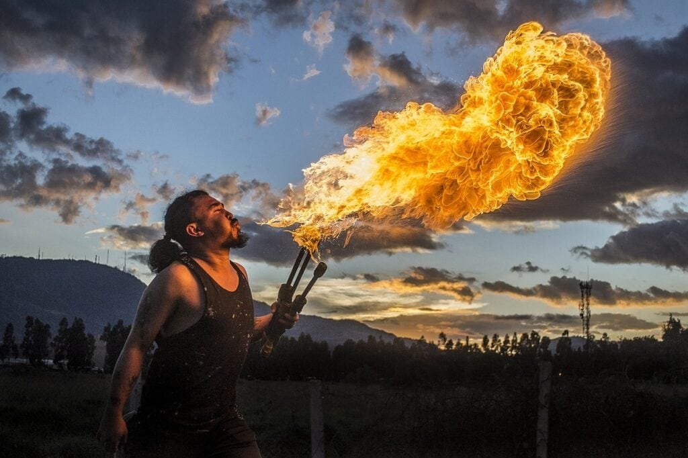

Volcanic eruptions have a significant impact on climate change adaptation. These natural occurrences, formed by molten rock, gases, and debris escaping to the earth's surface, can have both beneficial and destructive effects. Understanding the different types of volcanoes, their causes, and the hazards they pose is crucial in predicting future activity and mitigating risks to surrounding communities. Furthermore, volcanic eruptions contribute to climate change, influencing global temperatures, precipitation patterns, and even the Earth's ozone layer. By delving into the connection between volcanoes and climate change adaptation, we can gain valuable insights to better prepare and respond to these natural phenomena.

This image is property of pixabay.com.

## Understanding Volcano Anatomy and Eruption Mechanisms

Volcanoes are fascinating geological formations that have captivated human curiosity for centuries. To truly comprehend their impact on our environment, it is crucial to understand their anatomy and the mechanisms behind their eruptions.

### The formation of volcanoes

Volcanoes are formed when molten rock, called magma, rises to the Earth's surface. This magma is formed in the Earth's mantle, which lies beneath the crust. As the magma travels upwards, it accumulates in a magma chamber, a reservoir of molten rock beneath the surface.

Over time, the pressure from the accumulating magma becomes too great for the Earth's crust to contain, leading to a volcanic eruption. The eruption can be explosive, as in the case of stratovolcanoes, or relatively gentle, as in the case of shield volcanoes.

### Factors leading to volcanic eruptions

Several factors contribute to volcanic eruptions. The composition of the magma plays a significant role, with variations in silica content influencing the magma's viscosity. High-silica magma is more viscous and tends to trap gases, leading to explosive eruptions. In contrast, low-silica magma is less viscous and allows gases to escape more easily, resulting in less explosive eruptions.

The amount of dissolved gases in the magma is another crucial factor. As magma rises to the surface, the decreasing pressure causes the dissolved gases, such as water vapor, carbon dioxide, and sulfur dioxide, to exsolve. If the magma contains a substantial amount of gases, it can lead to explosive eruptions.

Additionally, the presence of fractures or weaknesses in the Earth's crust can provide pathways for the magma to reach the surface. The tectonic activity along plate boundaries and the presence of hotspots are common factors that create such fractures.

### The 'Ring of Fire' explanation

The "Ring of Fire" is a term used to describe a major area in the basin of the Pacific Ocean where a large number of earthquakes and volcanic eruptions occur. This region is defined by a series of subduction zones, where one tectonic plate is forced beneath another.

The 'Ring of Fire' is home to the majority of the world's active volcanoes because subduction zones provide ideal conditions for volcanic activity. The subducting plate carries water and other volatile substances into the mantle, lowering the melting point of surrounding rocks and promoting the formation of magma.

As a result, volcanic eruptions in the 'Ring of Fire' are often explosive and pose significant hazards to nearby communities. The tectonic activity in this region underscores the importance of understanding [volcano anatomy and eruption mechanisms for effective climate change](https://magmamatters.com/geothermal-energy-and-its-volcanic-origins/ "Geothermal Energy and Its Volcanic Origins") adaptation strategies.

## The Effect of Volcanic Eruptions on the Atmosphere

Volcanic eruptions have a profound impact on the Earth's atmosphere, releasing gases and ash particles that can alter atmospheric chemistry and even contribute to the formation of volcanic smog, or 'vog'.

### Emission of gases and ash particles during eruptions

During volcanic eruptions, several gases are released into the atmosphere. The most common gases include water vapor, carbon dioxide, sulfur dioxide, hydrogen sulfide, and chlorine. These gases can have varying effects on the climate and atmospheric chemistry.

Water vapor is a natural greenhouse gas, meaning it contributes to the greenhouse effect. Carbon dioxide, another greenhouse gas, can remain in the atmosphere for extended periods, contributing to global warming. Sulfur dioxide, on the other hand, can react with water vapor and other aerosols to form sulfate aerosols, which have a cooling effect on the planet.

In addition to gases, volcanic eruptions also emit large amounts of ash particles. Volcanic ash consists of tiny particles of pulverized rock and glass. These particles can stay suspended in the atmosphere for weeks or months, reflecting sunlight back into space and leading to a temporary cooling effect.

### Role of volcanic aerosols in altering atmospheric chemistry

The release of volcanic gases and ash particles during eruptions can have significant effects on atmospheric chemistry. Sulfur dioxide, for example, reacts with water vapor to form sulfate aerosols, which can act as nuclei for cloud formation.

These aerosols can impact the Earth's energy balance by scattering or absorbing sunlight, which affects the amount of radiation reaching the Earth's surface. The presence of volcanic aerosols in the atmosphere can also influence the distribution and persistence of pollutants, such as ozone, which have implications for air quality and human health.

### Creation of volcanic smog, also known as 'vog'

Volcanic smog, or 'vog', is a form of air pollution that occurs when volcanic emissions react with sunlight, oxygen, and other compounds in the atmosphere. The primary component of vog is sulfur dioxide, which is converted into sulfuric acid aerosols under certain atmospheric conditions.

Vog can have significant health impacts, particularly for individuals with respiratory conditions, such as asthma. The effects of vog can extend beyond the immediate vicinity of volcanic eruptions, as the plumes can be carried by wind currents over large distances.

Understanding the effects of volcanic eruptions on the atmosphere is crucial for climate change adaptation efforts. By monitoring and studying the behavior of volcanic emissions, scientists can better predict their impact on weather patterns, air quality, and global climate.

<iframe width="560" height="315" src="https://www.youtube.com/embed/gpYlX5TeQRM" frameborder="0" allow="accelerometer; autoplay; encrypted-media; gyroscope; picture-in-picture" allowfullscreen></iframe>

  

## Volcanoes and Global Cooling

While volcanic eruptions have the potential to cause widespread devastation, they can also lead to temporary global cooling due to the release of aerosols and gases into the atmosphere.

### How volcanic eruptions induce temporary global cooling

When a volcano erupts, it releases large amounts of ash particles and gases into the atmosphere. These particles and gases can remain suspended in the stratosphere for an extended period—affecting the Earth's energy balance, which can result in a temporary cooling effect.

Ash particles reflect sunlight back into space, reducing the amount of solar radiation reaching the Earth's surface. This phenomenon is known as volcanic dimming. Additionally, sulfate aerosols formed from volcanic emissions can scatter sunlight, further contributing to the cooling effect.

### Historical examples of volcano-induced climate change

Throughout history, volcanic eruptions have caused short-term climate shifts. One well-known example is the 1815 eruption of Mount Tambora in Indonesia. This eruption was among the largest in recorded history, resulting in a global decrease in temperatures the following year.

The year 1816, often referred to as the "Year Without a Summer," was marked by abnormally cold weather across much of the Northern Hemisphere. The eruption of Mount Tambora injected significant amounts of ash and sulfur dioxide into the stratosphere, leading to a decrease in global temperatures.

Another notable example is the 1991 eruption of Mount Pinatubo in the Philippines. This eruption released an enormous amount of ash and sulfur dioxide, which led to a short-term cooling of the Earth's surface by approximately 0.5 to 0.6 degrees Celsius.

### Analysis of the duration of the cooling effect

The duration of the cooling effect following a volcanic eruption varies depending on several factors. The magnitude of the eruption, the composition of the volcanic emissions, and the location of the volcano all influence the length of the cooling period.

Generally, the effects of a volcanic eruption on global temperatures are short-lived, lasting for a few years at most. Over time, the emissions disperse, and the climate gradually returns to its previous state.

Understanding the [impact of volcano-induced global cooling is crucial for climate change](https://magmamatters.com/understanding-volcanic-formation-a-comprehensive-guide/ "Understanding Volcanic Formation: A Comprehensive Guide") adaptation strategies. While volcanic eruptions can provide temporary relief from global warming, they do not address the long-term consequences of human-induced climate change. Therefore, it is essential to focus on sustainable mitigation and adaptation measures that address the root causes of global warming.

## Volcanoes and Greenhouse Gases

While volcanic eruptions contribute to the emission of greenhouse gases, their impact on global warming is relatively small compared to human activities.

### Contribution of volcanoes to the emission of greenhouse gases

Volcanic eruptions release significant amounts of carbon dioxide, a prominent greenhouse gas, into the atmosphere. On average, volcanoes emit between 200 and 300 million metric tons of [carbon dioxide](https://magmamatters.com/the-art-and-science-of-volcano-monitoring/ "The Art and Science of Volcano Monitoring") annually.

However, it is essential to consider the context of these emissions. Human activities, such as burning fossil fuels, contribute billions of metric tons of carbon dioxide to the atmosphere each year—far surpassing the emissions from volcanoes. Therefore, volcanic emissions represent only a small fraction of the total greenhouse gas emissions.

### Comparing the volcanic contribution to human-induced global warming

When assessing the impact of volcanic emissions on global warming, it is crucial to differentiate between short-term cooling effects and long-term climate change caused by greenhouse gases.

While volcanic eruptions can lead to temporary cooling, the overall contribution of volcanic emissions to long-term global warming is minor. Human activities, primarily the burning of fossil fuels, are the primary drivers of the increase in greenhouse gas concentrations in the atmosphere.

Focusing on reducing human-induced emissions is key to mitigating the long-term effects of global warming. Nonetheless, studying volcanic emissions and their impact on the climate can provide valuable insights into the Earth's natural processes and enhance our understanding of the complexities of climate change.

This image is property of pixabay.com.

## Volcanic Eruptions and Weather Patterns

Volcanic eruptions can have significant effects on local and global weather patterns, influencing precipitation, storm formations, and atmospheric circulation.

### Influence of volcanic emissions on local and global weather patterns

The emissions from volcanic eruptions, such as sulfur dioxide and ash particles, can influence local and global weather patterns in various ways. The release of gases and aerosols alters the composition of the atmosphere, which can affect the distribution of heat and moisture.

One notable effect is the alteration of atmospheric opacity. Volcanic ash and sulfate aerosols can reduce the amount of solar radiation reaching the Earth's surface, leading to decreased temperatures in the affected areas. This reduction in energy can disrupt local weather patterns and alter the movement of air masses.

### Volcanic effects on precipitation and storm formations

Volcanic emissions can also impact precipitation patterns and storm formations. The injection of sulfate aerosols into the atmosphere can affect cloud formation and cloud properties. Sulfate aerosols act as nuclei for cloud droplets, altering the size, abundance, and reflectivity of clouds.

Changes in cloud properties can affect rainfall patterns. It is observed that volcanic eruptions can lead to regional variations in precipitation, with some areas experiencing decreased rainfall while others may receive increased rainfall.

The effects of volcanoes on storm formations are still an area of ongoing research. The alteration of atmospheric circulation patterns caused by volcanic emissions can influence the development and intensity of storms, including hurricanes and typhoons. Understanding these interactions is crucial for predicting and mitigating the potential impacts of volcanic activity on weather systems.

## Adapting Agricultural Practices to Volcano-Influenced Climates

Volcanic eruptions can have both positive and negative effects on agricultural practices, necessitating adaptation strategies to minimize the negative impacts and harness the benefits of volcanic activity.

### Changes to soil due to volcanic eruptions

Volcanic eruptions can drastically alter soil composition and fertility. The ash and other volcanic materials deposited during eruptions can provide valuable nutrients to the soil, enhancing its productivity. The minerals released during volcanic events, such as potassium, phosphorus, and calcium, are essential for plant growth.

However, the impact of volcanic eruptions on soil quality may not always be positive. The deposition of thick layers of ash can hinder water infiltration and seed germination, making it challenging for plants to establish roots. Additionally, the high acidity of volcanic ash can negatively impact soil pH, affecting nutrient availability for plants.

### Adapting cropping patterns to changes induced by volcanic activities

Agricultural communities living in volcano-influenced climates need to adapt their cropping patterns to the changes induced by volcanic activities. Farmers can take advantage of the nutrient-rich volcanic soil by selecting crops that thrive in these conditions.

Certain crops, such as coffee, bananas, and cocoa, have been found to fare well in volcanic soils. These crops have adapted to the high nutrient content and can provide economic opportunities for communities living in volcanic regions.

Additionally, adopting techniques like contour plowing and terracing can help minimize soil erosion caused by volcanic ash and the increased risk of landslides. These practices help retain moisture and prevent nutrient loss from the soil, ensuring sustainable agricultural production.

### Nutrient-rich volcanic soil as an agricultural boost

The volcanic soil resulting from eruptions, known as volcanic ash soil or andosols, can provide a significant agricultural advantage. The ash particles are rich in nutrients like nitrogen and phosphorus, making them highly fertile.

Farmers can capitalize on this nutrient-rich soil by implementing fertilization practices that complement the existing soil composition. By carefully managing nutrient inputs and soil pH, farmers can maximize the productivity of their crops and mitigate any negative effects caused by volcanic activity.

Efforts in soil conservation, sustainable agricultural practices, and the utilization of volcanic soil resources can help communities living in volcano-influenced climates adapt to the challenges and opportunities posed by volcanic eruptions.

This image is property of pixabay.com.

## Adapting Human Habitats and Infrastructure to Volcano-Influenced Climates

Volcanic eruptions pose significant risks to human habitats and infrastructure. It is crucial to design and implement adaptation strategies that prioritize resilience against volcanic hazards.

### Impact of volcanic events on urban and rural settlements

Volcanic eruptions can have severe impacts on both urban and rural settlements. The immediate effects can include the destruction of buildings and infrastructure due to pyroclastic flows, lava flows, and ashfall. These hazards can displace populations and devastate communities.

The long-term effects of volcanic events on settlements include the alteration of landforms, the degradation of soil, and the loss of arable land. These consequences can have lasting impacts on the livelihoods and well-being of affected communities.

### Designing infrastructure for resilience against volcanic hazards

Designing infrastructure with resilience against volcanic hazards is essential in volcano-influenced climates. Advances in engineering and technology have enabled the development of structures that can withstand the impact of volcanic eruptions.

Building codes and guidelines can incorporate specific provisions for volcanic hazards. These provisions can include the use of reinforced materials and structures, the incorporation of volcanic monitoring systems, and the implementation of evacuation plans.

Furthermore, infrastructure planning should consider the potential risks associated with volcanic eruptions. Settlements should be established in areas with lower volcanic activity, and critical infrastructure, such as hospitals and emergency services, should be located outside high-risk zones.

### Relocation strategies for communities at high risk of volcanic disasters

In cases where communities are at high risk of volcanic disasters, relocation strategies may be necessary. Relocating communities away from active volcanic zones can help protect lives and property from the immediate dangers associated with eruptions.

Relocation efforts should prioritize the involvement and participation of affected communities. Engaging with local residents and stakeholders is crucial to ensure that the process is fair, inclusive, and sustainable. Communities should be provided with support, resources, and infrastructure in their new locations to facilitate their adaptation and resilience-building efforts.

Adapting human habitats and infrastructure to volcano-influenced climates requires a multidimensional approach that incorporates engineering, urban planning, and community engagement. By integrating volcanic hazards into development plans, we can ensure safer and more resilient communities in these high-risk areas.

## Monitoring and Predicting Volcanic Activity for Climate-Adaptive Planning

Effective monitoring and prediction of volcanic activity play a vital role in climate-adaptive planning. By understanding the behavior of volcanoes, scientists can enhance their ability to predict eruptions and mitigate the potential risks.

### Technologies for detecting imminent volcanic eruptions

Over the years, advancements in technology have significantly improved our ability to monitor and detect imminent volcanic eruptions. Seismic monitoring networks allow scientists to detect volcanic tremors and quantify seismic activity associated with magma movement.

Other technologies, such as gas monitoring systems and satellite remote sensing, provide valuable data on volcanic gas emissions. Monitoring the concentration of gases, such as sulfur dioxide, can help identify potential changes in volcanic activity and aid in eruption prediction.

Ground-deformation monitoring using satellite-based radar and GPS systems allows scientists to track changes in the shape and elevation of volcanoes. These measurements help in understanding the movement of magma beneath the surface, providing critical insights into volcanic behavior.

### Use of volcanic prediction in climate modeling

Volcanic eruptions release significant amounts of gases and aerosols into the atmosphere, which can have implications for climate modeling. By incorporating data from volcanic eruptions into climate models, scientists can improve their accuracy in predicting future climate scenarios.

Climate models help quantify the impact of volcanic emissions on global temperatures, precipitation patterns, and atmospheric circulation. They allow scientists to simulate the short-term climate response to volcanic eruptions and assess their influence on climate change adaptation efforts.

The use of volcanic prediction in climate modeling enhances our understanding of the complex interactions between volcanic activity and the Earth's climate. This knowledge is essential for developing effective adaptation strategies that can withstand the challenges posed by volcanic eruptions.

### Incorporation of volcanic data into long-term climate adaptation strategies

The data collected from monitoring and predicting volcanic activity can and should be incorporated into long-term climate adaptation strategies. Volcanic eruptions have the potential to disrupt ecosystems, impact agriculture, and pose significant risks to human populations.

By integrating volcanic data into climate adaptation plans, policymakers and communities can better prepare for and respond to volcanic hazards. This can include the development of early warning systems for volcanic eruptions, the implementation of evacuation plans, and the establishment of resilient infrastructure.

Additionally, the incorporation of volcanic data into climate models can improve the accuracy of future climate projections. This information can assist in decision-making processes related to land-use planning, disaster risk reduction, and resource allocation, ultimately fostering climate resilience.

## The Economic Consequences of Volcano-Induced Climate Shifts

Volcano-induced climate shifts can have substantial economic consequences, affecting local economies dependent on farming and potentially causing global economic repercussions.

### Impact on local economies depending heavily on farming

Agriculture is a vital economic sector in many volcano-influenced regions. Volcanic eruptions can have both positive and negative effects on agricultural productivity, impacting the livelihoods of farmers and the local economy.

The immediate impacts of volcanic eruptions, such as ashfall and lava flows, can destroy crops and damage agricultural infrastructure. These hazards can result in significant financial losses for farmers who rely on agricultural activities for their income.

However, volcanic ash deposits can provide nutrients that enhance soil fertility, potentially leading to increased agricultural productivity in the long term. Farmers who can adapt their practices to harness the benefits of volcanic activity may experience economic resilience and even improved crop yields.

### Potential global economic consequences of major volcanic eruptions

Major volcanic eruptions with widespread impacts have the potential to cause global economic consequences. The release of large quantities of ash and gases into the atmosphere can disrupt air traffic, particularly in heavily affected regions.

The aviation industry can suffer significant financial losses due to flight cancellations and route diversions caused by volcanic ash plumes. The tourism industry may also experience setbacks, as potential visitors may be deterred from traveling to areas affected by volcanic hazards.

Furthermore, the impact of volcanic emissions on the climate, such as temporary global cooling, can influence global agricultural productivity. Changes in precipitation patterns and temperature regimes can affect crop yields and food prices, potentially leading to food shortages and economic instability.

Mitigating the economic consequences of volcano-induced climate shifts requires collaboration between policymakers, economists, and affected communities. By implementing proactive measures, such as diversification of economic activities and climate-resilient infrastructure, economies can become more adaptable and resilient to the uncertainties posed by volcanic eruptions.

## Mitigating the Impact of Volcanic Eruptions on Climate Change

To minimize the impact of volcanic eruptions on climate change, various research approaches, preventive measures, and societal participation are necessary.

### Research approaches in mitigating the impact of volcanic eruptions

Research plays a crucial role in understanding and mitigating the impact of volcanic eruptions on climate change. Scientists strive to enhance their knowledge of volcanic behavior, improve eruption prediction models, and refine climate projections to account for volcanic emissions.

Volcanic monitoring networks need to be expanded and strengthened to detect and track volcanic activity more effectively. This data is vital for developing accurate early warning systems and improving the understanding of volcanic emissions and their impact on the climate.

Collaborative international research efforts can foster innovation and knowledge sharing, enabling scientists to develop more robust strategies for mitigating the impact of volcanic eruptions on climate change.

### Implementation of preventive measures for volcanic disasters

Preventive measures can significantly reduce the impact of volcanic disasters on human populations and infrastructure. These measures include hazard mapping, land-use planning, and the establishment of early warning systems.

Hazard mapping involves identifying areas prone to volcanic hazards and developing zoning regulations to limit human settlement in high-risk zones. Land-use planning takes into account the potential impacts of volcanic eruptions, ensuring critical infrastructure is located outside hazardous areas.

Early warning systems leverage monitoring technologies and data analysis to provide timely and accurate information about impending volcanic eruptions. These systems enable communities to prepare and take necessary actions, such as evacuations, before disaster strikes.

### Societal participation and roles in mitigating the impact of volcanoes on climate

Mitigating the impact of volcanic eruptions on climate change requires the active participation of society. Individuals, communities, and governments all play critical roles in fostering resilience and adapting to the challenges posed by volcanoes.

Education and awareness campaigns can empower individuals and communities to understand the risks associated with volcanic activity and take appropriate actions. This can include preparing emergency kits, developing evacuation plans, and participating in drills and training exercises.

Communities at high risk of volcanic disasters can engage in community-based hazard management, establishing local response teams and fostering collaboration with government agencies and international organizations.

Governments have a crucial responsibility in implementing policies and regulations that prioritize volcanic hazard mitigation and climate change adaptation. By investing in infrastructure, research, and disaster preparedness, governments can enhance the resilience of their communities and minimize the economic and social impacts of volcanic eruptions.

By actively engaging with volcanic hazards and understanding their relationship with climate change, society can work towards a safer and more sustainable future.

In conclusion, understanding the anatomy and eruption mechanisms of volcanoes is crucial for predicting future volcanic activity and mitigating risks to surrounding communities. Volcanic eruptions have significant effects on the atmosphere, weather patterns, agriculture, and human habitats. While volcanic emissions contribute to greenhouse gases, their impact on global warming is minor compared to human activities. Adapting agricultural practices, human habitats, and infrastructure to volcano-influenced climates is essential for climate change adaptation. Monitoring and predicting volcanic activity, integrating volcanic data into climate modeling, and implementing preventive measures are crucial steps in climate-adaptive planning. The economic consequences of volcano-induced climate shifts can be substantial, both locally and globally. However, through research initiatives, preventive measures, and societal participation, the impact of volcanic eruptions on climate change can be mitigated. By understanding and embracing the complexities of volcanoes in our changing world, we can foster resilience and build a more sustainable future.

