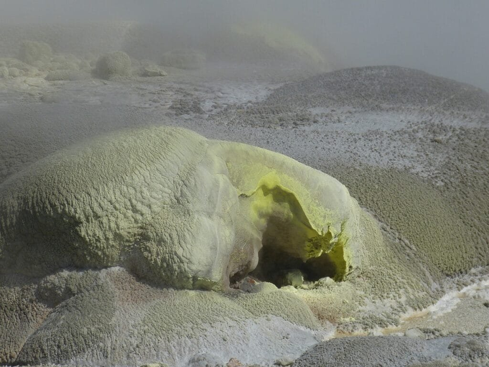
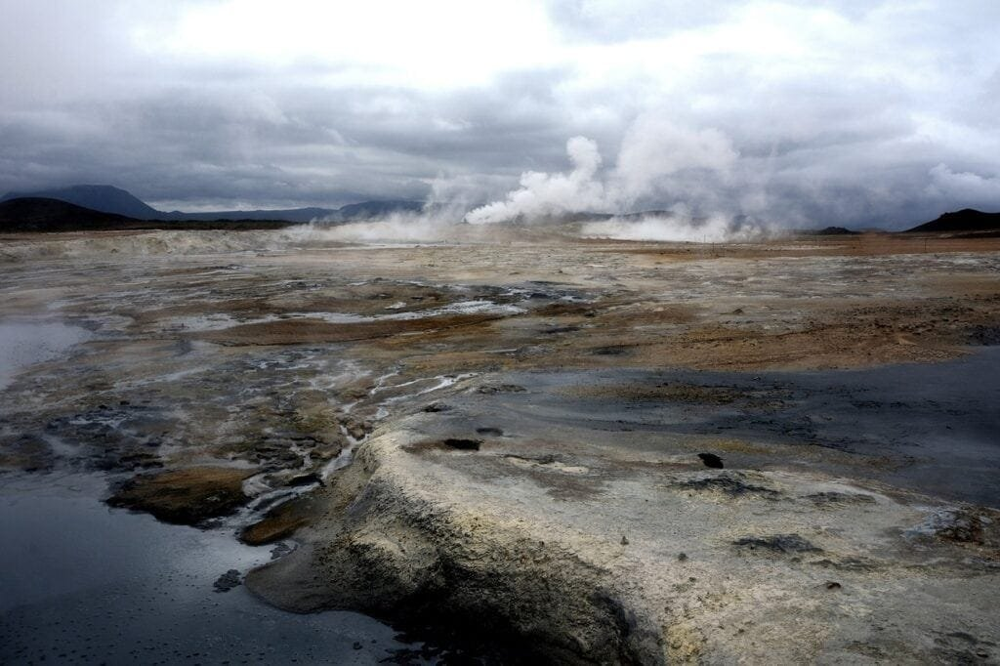
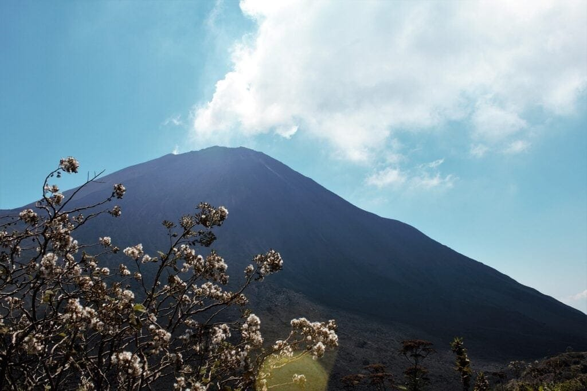

Volcanoes, with their eruptions of molten rock and gases, have a profound impact on the surrounding wildlife. Whether it's the explosive eruptions along the Ring of Fire or the gradual eruptions of shield volcanoes in Hawaii, the gases emitted by these volcanic events can have both positive and negative effects on the ecosystems they inhabit. From enriching the soil and providing nutrients to plants and animals, to causing respiratory problems and even death in wildlife, the impact of volcanic gases is a fascinating and complex subject. In this article, we will explore three key insights into how volcanic gases affect wildlife, shedding light on the intricate relationship between these natural phenomena and the animals and plants that call volcanic areas their home.

<iframe width="560" height="315" src="https://www.youtube.com/embed/VNGUdObDoLk" frameborder="0" allow="accelerometer; autoplay; encrypted-media; gyroscope; picture-in-picture" allowfullscreen></iframe>

  

## Understanding Volcanic Gases

Volcanic gases are a crucial aspect of volcanic eruptions and can have a significant impact on the physical environment. Understanding the different types of gases emitted, how they are released during eruptions, and their overall effects is important for comprehending the full scope of volcanic activity.

### Types of volcanic gases

Volcanic eruptions release a variety of gases into the atmosphere. Some of the primary gases include sulfur dioxide (SO2), [carbon dioxide](https://magmamatters.com/geothermal-energy-and-its-volcanic-origins/ "Geothermal Energy and Its Volcanic Origins") (CO2), hydrogen sulfide (H2S), and hydrogen fluoride (HF). These gases are expelled from the Earth's mantle along with the molten rock during volcanic eruptions.

### How volcanic gases are released during eruptions

During an eruption, gases are released through several mechanisms. The main process involves the ascent of magma from the earth's interior to the surface. As the magma rises, the pressure decreases, causing dissolved gases to exsolve and form bubbles. These gas bubbles then expand as the magma reaches the surface, leading to the eventual release of volcanic gases into the atmosphere.

### The impact of gases on the physical environment

Volcanic gases can have wide-ranging effects on the physical environment. For example, sulfur dioxide (SO2) released during volcanic eruptions can contribute to the formation of acid rain and degrade air quality. Carbon dioxide (CO2), on the other hand, affects atmospheric temperature and can contribute to climate change. Understanding how these different gases interact with the environment is crucial for evaluating their overall impact.

## Emission of Sulfur Dioxide

Sulfur dioxide (SO2) is one of the primary gases emitted during volcanic eruptions. It plays a significant role in air quality degradation and can have adverse effects on both human and wildlife health.

### How sulfur dioxide affects air quality

When sulfur dioxide is released into the atmosphere, it can react with other compounds to form aerosols and contribute to the formation of acid rain. These acidic pollutants can have detrimental effects on air quality, leading to respiratory issues and other health problems for both human and animal populations.

### The impact of sulfur dioxide on wildlife health

[Sulfur dioxide can have direct and indirect effects on wildlife](https://magmamatters.com/the-environmental-impact-of-volcanic-eruptions-2/ "The Environmental Impact of Volcanic Eruptions") health. Inhaling high concentrations of sulfur dioxide can cause respiratory distress and even death in some animals. Additionally, acid rain resulting from sulfur dioxide emissions can contaminate water bodies, affecting aquatic ecosystems and the wildlife that depend on them.

### Specific examples of wildlife affected by sulfur dioxide

Several examples highlight the negative impacts of sulfur dioxide on wildlife. In the past, volcanic eruptions emitting significant amounts of sulfur dioxide have led to mass mortalities among fish, amphibians, and other aquatic organisms. Additionally, terrestrial animals and plants in close proximity to volcanic activity can experience declines in population due to the effects of sulfur dioxide on their habitat.

This image is property of pixabay.com.

## Emission of Carbon Dioxide

Carbon dioxide (CO2) is another essential gas emitted during volcanic eruptions. Understanding its impact on atmospheric temperature and wildlife is crucial for comprehending the long-term consequences of volcanic activity.

### Impact of carbon dioxide on atmospheric temperature

Carbon dioxide is a greenhouse gas that contributes to the Earth's natural greenhouse effect. When released into the atmosphere during volcanic eruptions, it can increase the overall concentration of greenhouse gases and contribute to global warming. This increase in atmospheric temperature can have far-reaching consequences for both terrestrial and aquatic wildlife.

### Effects of increased carbon dioxide on wildlife

Increased levels of carbon dioxide in the atmosphere can lead to various effects on wildlife. For example, changes in temperature and precipitation patterns can alter habitat suitability and affect the distribution of species. Additionally, the acidification of oceans resulting from increased carbon dioxide levels can harm marine life, particularly organisms with calcium carbonate skeletons or shells.

### Case studies of wildlife affected by carbon dioxide

Numerous case studies have documented the impact of carbon dioxide on wildlife. For instance, research has shown that coral reefs, which are vital habitats for numerous marine species, are highly susceptible to the effects of increased carbon dioxide. These case studies highlight the importance of understanding and mitigating the impact of carbon dioxide on wildlife.

## Emission of Hydrogen Sulfide

Hydrogen sulfide (H2S) is a hazardous gas that can be released during volcanic eruptions. Its impact on water quality and aquatic wildlife is of particular concern.

### The effect of hydrogen sulfide on water quality

Hydrogen sulfide gas emitted during volcanic eruptions can dissolve in water bodies, leading to a decrease in water quality. This gas has a characteristic rotten egg odor and can be toxic to aquatic organisms, impacting the overall health of the ecosystem.

### How wildlife in aquatic environments are impacted

Aquatic wildlife is particularly vulnerable to the effects of hydrogen sulfide emissions. High concentrations of this gas can suffocate fish and other organisms by inhibiting their ability to extract oxygen from the water. Additionally, hydrogen sulfide can disrupt the delicate balance of aquatic ecosystems, leading to long-term impacts on species diversity and abundance.

### Specific instances of marine life affected by hydrogen sulfide gas emissions

Several specific instances demonstrate the impact of hydrogen sulfide gas emissions on marine life. For example, in areas where volcanic activity releases high levels of hydrogen sulfide, mass fish die-offs have been observed. Additionally, coral reefs can suffer significant damage due to the toxicity of this gas, leading to declines in the associated marine species.

This image is property of pixabay.com.

## Emission of Hydrogen Fluoride

Hydrogen fluoride (HF) is a corrosive gas that can pose risks to vegetation and herbivorous wildlife during volcanic eruptions.

### Impact of hydrogen fluoride on vegetation

Hydrogen fluoride can have severe detrimental effects on vegetation when released into the environment. This gas can cause visible damage to plant tissues, leading to reduced growth, foliar necrosis, and even death. The impact on vegetation can have cascading effects on the overall ecosystem, including changes in habitat suitability for wildlife.

### Effects on herbivorous wildlife

Herbivorous wildlife can be directly impacted by the presence of hydrogen fluoride. Consumption of contaminated vegetation can lead to a range of health issues, including reduced reproductive success, weakened immune systems, and compromised overall fitness. These effects can then propagate through the food chain, potentially affecting the entire wildlife community.

### Examples of wildlife populations impacted by hydrogen fluoride emissions

Instances of hydrogen fluoride emissions impacting wildlife populations are well-documented. For example, during the eruption of Mount St. Helens in 1980, large herbivorous mammal populations, such as elk and deer, experienced declining numbers due to the negative effects of hydrogen fluoride on their habitat and food sources. These examples underline the importance of monitoring and mitigating the impact of hydrogen fluoride on wildlife.

## Impact on Terrestrial Wildlife

Volcanic gases can have significant impacts on terrestrial wildlife populations, affecting both long-term species abundance and specific local ecosystems.

### How volcanic gases affect land dwellers

Land-dwelling wildlife can be adversely affected by volcanic gases in various ways. Toxic gases like sulfur dioxide and hydrogen fluoride can directly harm animals, while changes in habitat caused by volcanic activity can disrupt ecological balance and food availability. Additionally, the deposition of ash and other volcanic materials can severely impact the habitat suitability for many terrestrial species.

### The long-term impacts on species populations

Volcanic eruptions can have long-lasting effects on species populations. Disruptions to habitats, changes in vegetation, and the direct impact of toxic gases can lead to declines in population numbers and even local extinctions. Over time, the recovery and recolonization of affected areas by wildlife can be a slow process, further highlighting the importance of understanding the long-term impacts.

### Case studies of terrestrial wildlife impact

Numerous case studies have examined the impact of volcanic gases on terrestrial wildlife. For instance, the eruption of Mount Pinatubo in 1991 resulted in the loss of habitat for several species, including various birds and mammals. The insights gained from these case studies can help inform conservation efforts and management strategies to mitigate the impact on terrestrial wildlife.

This image is property of pixabay.com.

## Impact on Aquatic Wildlife

Volcanic activity and the accompanying release of gases can have profound consequences for aquatic wildlife, impacting the health and survival of marine species.

### Effect of volcanic gases on water bodies

Volcanic gases, such as [carbon dioxide and hydrogen sulfide](https://magmamatters.com/understanding-volcanic-formation-a-comprehensive-guide/ "Understanding Volcanic Formation: A Comprehensive Guide"), can significantly affect water bodies. Carbon dioxide dissolved in water can lead to acidification, disrupting the delicate balance of marine ecosystems and affecting the survival of many species. Hydrogen sulfide, as previously mentioned, can have toxic effects on aquatic organisms.

### Implications for aquatic wildlife survival

Aquatic wildlife faces numerous challenges when exposed to volcanic gases. Acidification of water bodies can harm coral reefs, shellfish, and other marine organisms with calcium carbonate structures. Additionally, the suffocating effects of hydrogen sulfide can lead to significant fish and invertebrate die-offs, causing further disruptions to the aquatic food chain.

### Examples of marine species affected by volcanic activity

Numerous examples exist of marine species being affected by volcanic activity and the associated release of gases. For instance, the eruption of the underwater volcano Kavachi in the Solomon Islands has been linked to the decline of coral reefs and the subsequent loss of fish populations. These examples serve as a reminder of the vulnerability of marine species to volcanic gases.

## Impact on Avian Species

Avian species, including birds, can be significantly impacted by volcanic gases, with effects ranging from direct health impacts to changes in migratory patterns.

### Effects of volcanic gases on avian health

Birds can be directly affected by the release of volcanic gases. Toxic gases, such as sulfur dioxide and hydrogen fluoride, can cause respiratory distress and even death in avian species. The inhalation of these gases can also affect the birds' reproductive success and their ability to forage for food.

### Impact on avian migratory patterns

Volcanic eruptions and the associated release of gases can disrupt avian migratory patterns. Changes in air quality, visibility, and availability of food resources can affect the birds' ability to navigate and find suitable stopover sites during migration. These disruptions can have far-reaching effects on bird populations and ecological processes.

### Examples of bird species affected by volcanic gases

Numerous bird species have been affected by volcanic gases in different parts of the world. For example, during the eruption of Eyjafjallajökull in Iceland in 2010, bird populations experienced declines due to the adverse effects of volcanic gases on their habitats and food sources. These examples emphasize the need to protect avian species and their habitats in volcanic areas.

## Mitigation Measures for Wildlife

To minimize the impact of volcanic gases on wildlife, various strategies can be employed. These measures aim to mitigate the immediate effects of volcanic eruptions and promote the recovery of affected ecosystems.

### Common strategies for minimizing impact on wildlife

Common mitigation strategies include monitoring volcanic gas emissions, early warning systems for eruptions, and the establishment of protected areas for wildlife. These strategies help minimize the exposure of wildlife to toxic gases and provide a framework for their conservation in volcanic areas.

### Success stories of wildlife recovery post-volcanic activity

Several success stories exist where wildlife populations have recovered following volcanic activity. Active management, including habitat restoration, establishment of protected areas, and monitoring programs, has played a crucial role in facilitating the recovery of these ecosystems and ensuring biodiversity conservation.

### Future strategies for wildlife protection

Future strategies for wildlife protection in volcanic areas should focus on improving monitoring and surveillance systems. This includes advancements in technology for detecting gas emissions and an increased understanding of the long-term [impacts of volcanic gases](https://magmamatters.com/the-art-and-science-of-volcano-monitoring/ "The Art and Science of Volcano Monitoring") on wildlife. Additionally, public awareness campaigns and community involvement will be essential in driving conservation efforts forward.

## Further Research and Recommendations

While significant progress has been made in understanding the impact of volcanic gases on wildlife, there are still gaps in current research that need to be addressed.

### Gaps in current research on volcanic gases' impact on wildlife

Additional research is needed to fill gaps in our understanding of the long-term effects of volcanic gases on wildlife populations. This includes studying the cumulative impact of multiple eruptions on species abundance and assessing the genetic diversity of affected populations to gauge their resilience.

### Suggestions for future research initiatives

Future research should focus on investigating the interactions between different types of volcanic gases and their combined effects on wildlife. Long-term studies tracking the recovery of ecosystems following volcanic eruptions can also provide valuable insights into the dynamics of post-eruption ecological processes.

### Policy recommendations to mitigate impacts on wildlife

To mitigate the impacts of volcanic gases on wildlife, policymakers should prioritize the establishment of protected areas in volcanic regions. Additionally, integrating wildlife conservation into disaster risk reduction frameworks and promoting sustainable land-use practices can help minimize the vulnerability of wildlife to volcanic activity.

In conclusion, understanding the impact of volcanic gases on wildlife is crucial for effective conservation measures and the protection of biodiversity in volcanic areas. By comprehending the types of gases emitted, their release mechanisms, and their specific impacts on different ecosystems, we can develop strategies to mitigate the negative effects and promote the recovery of affected wildlife populations. Through further research, collaboration, and informed policy decisions, we can work towards minimizing the harm caused by volcanic activity and ensuring the long-term survival of wildlife in these unique environments.

