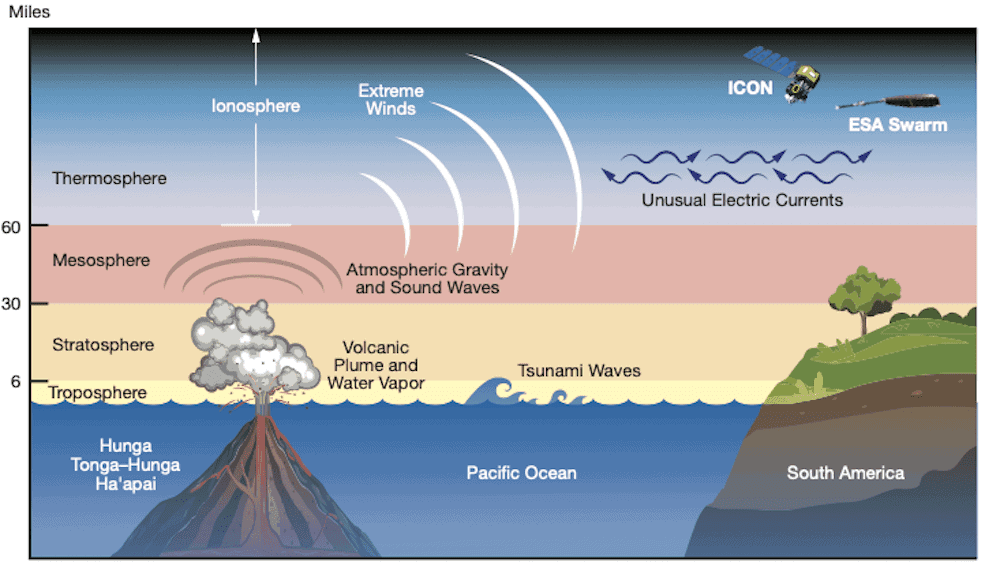
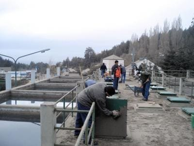
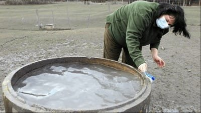
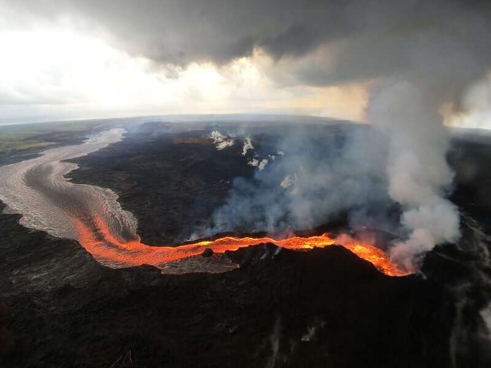

Volcanic eruptions can have a profound impact on water resources, but have you ever wondered why? The release of molten rock, gases, and debris during volcanic activity can contaminate water sources, making them unsafe for human consumption and agricultural use. Additionally, volcanic ash can clog and damage water filtration systems, leading to disruptions in the water supply. These hazards can have significant consequences for communities that rely on these resources for their daily needs. In this article, we will explore the various ways in which volcanic hazards can impact water resources and discuss the importance of understanding these impacts for effective disaster management and mitigation.

This image is property of www.nasa.gov.

## Why Do Volcanic Hazards Impact Water Resources?

Volcanic activities have a significant impact on water resources, causing disruptions to the natural water cycle. Understanding the connection between volcanic hazards and water resources is crucial for assessing the potential risks and implementing effective mitigation strategies.

### Understanding the connection between volcanic activities and water resources

Volcanic eruptions release various gases, chemicals, and minerals into the atmosphere and surrounding environment. These volcanic emissions can directly or indirectly affect water resources, both surface water bodies like rivers and lakes, as well as groundwater and aquifers.

### How volcanic hazards interrupt the natural water cycle

The natural water cycle involves the continuous movement of water between the atmosphere, land, and water bodies. Volcanic hazards can disrupt this cycle in several ways. For instance, volcanic ash particles can contaminate surface water, altering its quality and affecting aquatic ecosystems. Additionally, volcanic gases and minerals can infiltrate and contaminate groundwater and aquifers, impacting their chemistry and potability.

## Volcanic Hazards and Surface Water Contamination

Volcanic ash, a primary volcanic hazard, plays a significant role in polluting rivers and lakes. When volcanic eruptions occur near water bodies, ash particles are deposited onto the water surface, leading to contamination. These particles can block sunlight, lower water clarity, and affect the availability of dissolved oxygen, essential for aquatic life.

Moreover, volcanic chemicals and minerals released during eruptions can have a profound impact on the quality of surface water. For example, acid rain induced by volcanic gases can increase water acidity, making it unsuitable for various aquatic organisms. Additionally, the presence of toxic elements and heavy metals in volcanic emissions can further degrade water quality and pose risks to human health.

Several notable volcanic eruptions serve as case studies to understand the surface water contamination caused by volcanic hazards. The eruption of Mount St. Helens in 1980 resulted in massive amounts of ash deposition in nearby rivers, causing increased turbidity and reduced fish populations. Similarly, the eruption of Mount Pinatubo in 1991 led to the contamination of major water sources in the Philippines, affecting water supplies for millions of people.

<iframe width="560" height="315" src="https://www.youtube.com/embed/BCm6xTZj-vk" frameborder="0" allow="accelerometer; autoplay; encrypted-media; gyroscope; picture-in-picture" allowfullscreen></iframe>

  

## Effects on Groundwater and Aquifers

Volcanic eruptions can significantly alter groundwater pathways, impacting the availability and quality of this vital resource. The intense heat generated during volcanic activities can change the permeability of surrounding rock formations, modifying the flow of groundwater. These alterations can lead to the formation of new aquifers or the reactivation of dormant ones.

Contamination of aquifers with volcanic gases and minerals is another significant concern. Volcanic emissions can infiltrate into groundwater systems, introducing toxic substances and altering the chemical composition of the water. This contamination poses risks to both human consumption and ecosystem sustainability.

Furthermore, volcanic eruptions can cause long-term changes in groundwater chemistry. The release of gases like [carbon dioxide and sulfur](https://magmamatters.com/the-art-and-science-of-volcano-monitoring/ "The Art and Science of Volcano Monitoring") dioxide can result in increased acidity of the underground water, affecting its overall quality and suitability for various uses. These changes can persist for extended periods and necessitate long-term monitoring and management strategies.

## Volcanic Hazards and Marine Ecosystems

The [impact of volcanic hazards is not limited to terrestrial environments](https://magmamatters.com/the-environmental-impact-of-volcanic-eruptions-2/ "The Environmental Impact of Volcanic Eruptions") but extends to marine ecosystems as well. Volcanic debris, such as ash and pumice, can get transported by rivers and streams into coastal areas, significantly affecting marine water quality.

The deposition of volcanic debris in marine environments can lead to increased turbidity, reduced sunlight penetration, and altered water pH. These changes can disrupt the delicate balance of marine ecosystems and affect the survival and reproductive patterns of marine organisms. In some cases, extensive volcanic ash deposition has led to the mass mortality of coral reefs, which serve as crucial habitats for a diverse range of marine life.

Additionally, volcanic eruptions can impact the nutrient cycling and primary productivity of the ocean. The introduction of volcanic minerals and chemicals into the water can influence the availability of essential nutrients for marine organisms. This can result in changes in the composition and abundance of phytoplankton, the foundation of the marine food web.

This image is property of volcanoes.usgs.gov.

## Influence on Rainwater Composition

Volcanic activities can have a profound influence on the composition of rainwater. The release of volcanic gases into the atmosphere can alter atmospheric chemistry, leading to changes in rainfall patterns and characteristics.

One significant effect of volcanic gases is the formation of acid rain. When [volcanic emissions like sulfur dioxide](https://magmamatters.com/understanding-volcanic-formation-a-comprehensive-guide/ "Understanding Volcanic Formation: A Comprehensive Guide") react with atmospheric moisture, sulfuric acid is produced, resulting in acidic rain. Acidic rainwater can have detrimental effects on terrestrial ecosystems and agriculture. It can damage crops, forests, and vegetation, impacting overall ecosystem health and productivity.

Furthermore, the deposition of volcanic ash particles during eruptions can affect rainwater composition. These particles can act as cloud condensation nuclei, altering cloud formation processes and modifying precipitation characteristics. This can result in changes in rainfall distribution and intensity, affecting water availability and agricultural practices.

## Volcanic Activity and Water Supply Disruption

Volcanic hazards pose significant challenges to the infrastructures that support water supply systems. The deposition of volcanic ash can clog and damage water intake structures, pipelines, and treatment facilities, leading to interruptions in the water supply.

Short-term disruptions in community water supply are common following volcanic eruptions. The need to remove ash and debris from water sources and treatment plants, along with the repair and maintenance of damaged infrastructure, can result in temporary water shortages. These disruptions can have severe implications for communities that rely on freshwater resources for drinking, sanitation, and other essential needs.

Even after the immediate aftermath of volcanic eruptions, long-term water supply challenges may persist. The contamination of surface water bodies and aquifers with volcanic gases and minerals can require extended periods of monitoring and remediation to restore water quality to safe levels. This can impact the sustainability and reliability of water supplies in affected regions for years to come.

This image is property of volcanoes.usgs.gov.

## Effects on Water Treatment Processes

Volcano-contaminated water poses unique challenges to the traditional water treatment processes. The presence of volcanic gases, minerals, and other contaminants requires additional treatment steps to ensure the safety and potability of the water.

Volcanic emissions can introduce high concentrations of chemicals and heavy metals, requiring advanced treatment methods like chemical coagulation, flocculation, and activated carbon filtration. These processes help remove the dissolved impurities and suspended particles, making the water fit for consumption.

Moreover, after volcanic eruptions, water treatment facilities may need to modify their existing processes to address the specific contaminants present in the water. This could include the installation of additional filtration or disinfection systems to remove or neutralize the volcanic substances effectively.

Several case studies highlight the modifications made to water treatment processes after volcanic eruptions. Following the eruption of Eyjafjallajökull volcano in Iceland in 2010, increased concentrations of fluoride and sulfur necessitated significant changes in drinking water treatment methods to ensure compliance with acceptable standards.

## Mitigation Strategies for Volcanic Impact on Water Resources

To minimize the impacts of volcanic hazards on water resources, various mitigation strategies can be employed. Predicting volcanic hazards accurately is crucial for effective preparedness and planning. Techniques such as ground and satellite monitoring, measurement of volcanic gas emissions, and seismic activity analysis can aid in predicting and forecasting volcanic eruptions.

Planning and preparation strategies play a vital role in protecting water resources from volcanic impacts. Creating buffer zones around volcanic areas, implementing early warning systems, and developing emergency response plans can help mitigate the effects of volcanic hazards on water supplies and ensure the safety of the surrounding communities.

Technologies for treating volcano-affected water continue to evolve, presenting opportunities for efficient and sustainable treatment solutions. Advanced filtration systems, advanced oxidation processes, and desalination technologies can be employed to remove volcanic contaminants and ensure the provision of safe drinking water to affected areas.

This image is property of scx1.b-cdn.net.

## Role of Policy in Protecting Water Resources from Volcanic Hazards

The protection of water resources from volcanic hazards requires a strong governmental role and appropriate regulations. Governments play a crucial role in formulating and enforcing policies that address the risks posed by volcanic activities to water supplies.

Policy measures should focus on ensuring water safety during volcanic hazards. This includes regular monitoring of water sources, establishing guidelines for acceptable levels of volcanic contaminants, and implementing appropriate water treatment requirements. Additionally, governments should encourage research and development in water treatment technologies to address the specific challenges posed by volcanic hazards.

International cooperation and assistance are also vital in mitigating the impacts of volcanic hazards on water resources, particularly in regions that lack the necessary resources and expertise. Collaborative efforts can help identify best practices, share knowledge and experiences, and provide financial and technical support to affected regions.

## Future Outlook on Volcanic Hazards Impact on Water Resources

Understanding the potential impacts of volcanic hazards on water resources is crucial for future planning and preparedness. With the projected increase in [volcanic activities due to various factors such as climate change](https://magmamatters.com/geothermal-energy-and-its-volcanic-origins/ "Geothermal Energy and Its Volcanic Origins") and population growth, the need to assess and manage these impacts becomes even more significant.

Advancements in technology for water protection and treatment provide hope for better managing volcanic impacts on water resources. Continued research and development in monitoring techniques, treatment technologies, and predictive modeling can enhance our understanding of volcanic hazards and help ensure the long-term sustainability of water supplies in volcanic regions.

Continuous research and preparedness are essential to mitigate the potential risks associated with volcanic hazards on water resources. By understanding the complex interactions between volcanic activities and water systems, we can develop effective strategies to protect our valuable water resources and ensure the well-being of communities in volcanic regions.

