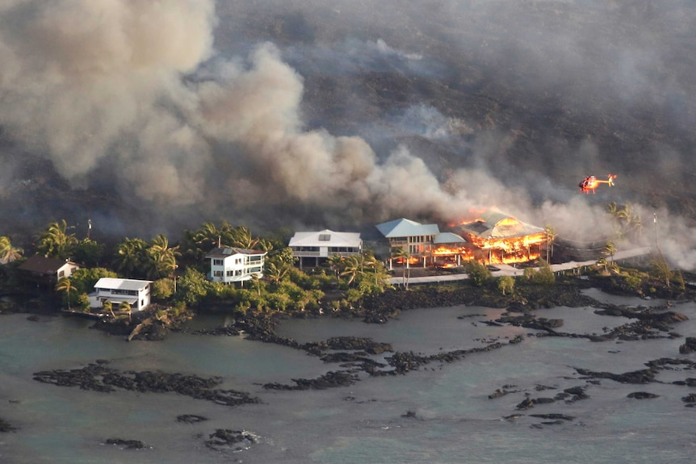
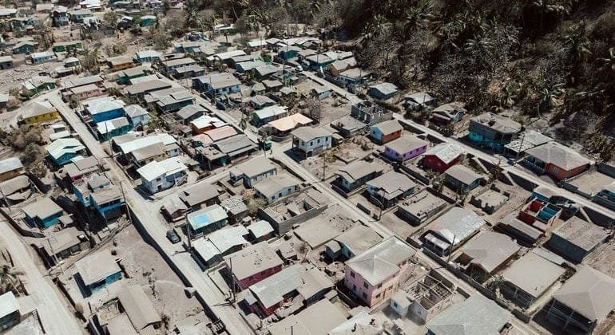
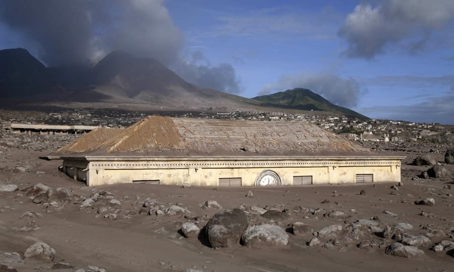
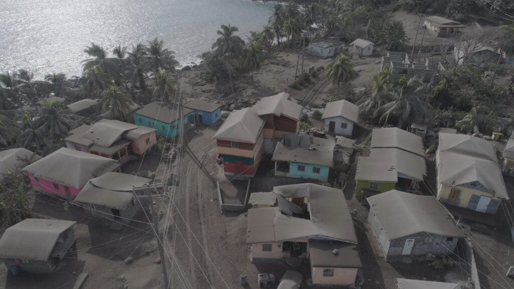
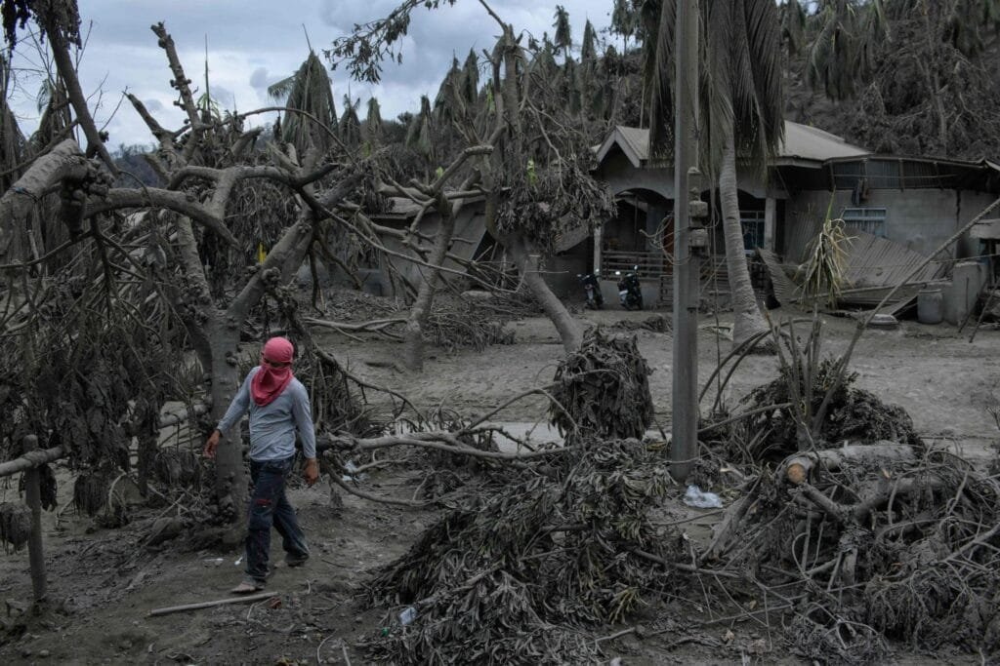

Volcanoes, those majestic and sometimes terrifying wonders of the Earth, have the power to shape our landscapes and alter lives in an instant. When they erupt, molten rock, gases, and debris burst forth, leaving a trail of destruction in their wake. In this article, we will explore the impact of volcano eruptions specifically on homes. From the damage caused by lava flows to the dangers of ashfall, we will uncover the top five effects that these powerful natural phenomena have on our humble abodes. So buckle up and prepare to delve into the world of volcanoes and how they can forever change the lives of those unfortunate enough to be in their path.

This image is property of live-production.wcms.abc-cdn.net.au.

## Overview of Volcanoes

[Volcanoes are natural phenomena](https://magmamatters.com/the-art-and-science-of-volcano-monitoring/ "The Art and Science of Volcano Monitoring") that occur when molten rock, gases, and debris escape to the earth's surface, resulting in eruptions of lava and ash. They can be found along plate boundaries, hotspots under the earth's crust, or rift zones where the earth's tectonic plates are moving apart. Some of the well-known volcanic regions include the "Ring of Fire" encircling the Pacific Ocean and Hawaii.

### Definition of a volcano

A volcano is a landform that is formed by the accumulation of materials ejected through volcanic eruptions. It usually consists of a vent or a fissure in the Earth's crust through which molten rock, gases, and volcanic ash are expelled.

### Types of volcanoes, including shield and composite

There are different types of volcanoes, each with its own characteristics. One type is the shield volcano, which is characterized by its broad, gently sloping sides. Shield volcanoes form gradually over long periods of time and usually have relatively calm eruptions.

Another type is the composite volcano, also known as a stratovolcano. These volcanoes are tall and steep, with layers of hardened lava, volcanic ash, and other volcanic materials. Composite volcanoes are known for their explosive eruptions and can have devastating impacts on the surrounding areas.

### Geographic distribution of volcanoes in places like the Ring of Fire and Hawaii

Volcanoes are found in various parts of the world, but they are particularly concentrated in certain regions. One of the most well-known volcanic regions is the "Ring of Fire," which encircles the Pacific Ocean. This area is highly active in terms of volcanic and seismic activity, with numerous volcanoes and tectonic plate boundaries.

Hawaii is another region famous for its volcanoes, particularly shield volcanoes. The Hawaiian Islands are formed by a hotspot, where a plume of hot mantle material rises to the surface, resulting in the formation of a chain of volcanic islands.

### Causes of volcano eruptions linked to tectonic movements and hotspots

Volcano eruptions are primarily caused by two main factors: tectonic movements and hotspots.

Tectonic movements occur when the Earth's tectonic plates collide, separate, or slide past each other. This movement can create areas of intense pressure and release of magma through volcanic eruptions.

Hotspots, on the other hand, are areas of localized volcanic activity that are not associated with plate boundaries. These hotspots occur when hot mantle material rises to the surface, creating a column of magma that can result in volcanic eruptions.

### Different eruption patterns caused by lava viscosity and gas content

The eruptive behavior of volcanoes can vary greatly depending on factors such as lava viscosity and gas content.

Lava viscosity refers to how sticky or fluid the lava is. Volcanoes with low viscosity lava, such as shield volcanoes, tend to have relatively mild eruptions, with lava flowing easily and covering large areas. In contrast, volcanoes with high viscosity lava, such as composite volcanoes, often experience explosive eruptions, as the thick lava traps gases and builds up pressure before being released.

The gas content of magma also plays a role in eruption patterns. Volcanoes with gas-rich magma are more likely to have explosive eruptions, as the gases expand rapidly as the magma reaches the surface. These explosive eruptions can release a significant amount of ash, rocks, and gases into the atmosphere.

## Volcanic Hazards

While [volcanic eruptions can have significant environmental and geological](https://magmamatters.com/geothermal-energy-and-its-volcanic-origins/ "Geothermal Energy and Its Volcanic Origins") impacts, they can also pose significant risks to human settlements and infrastructure. Here are some of the main volcanic hazards that can affect homes and communities.

### Lava flows and their ability to destroy everything in their path

One of the most iconic images associated with volcanic eruptions is the flow of molten lava. Lava flows can be extremely destructive, as they have the ability to burn and melt anything in their path. The extreme heat of lava can quickly engulf buildings, leading to their destruction.

### Pyroclastic flows as fast, deadly mixtures of hot gas and rock

[Pyroclastic flows are another highly dangerous volcanic hazard](https://magmamatters.com/the-environmental-impact-of-volcanic-eruptions-2/ "The Environmental Impact of Volcanic Eruptions"). These flows consist of a mixture of hot gas, ash, and rock fragments that move rapidly down the slopes of a volcano. Pyroclastic flows can reach speeds of hundreds of kilometers per hour and can cause catastrophic damage to anything in their path.

### Volcanic ash and the extensive damage it can cause to structures

Volcanic ash is made up of tiny rock and mineral fragments that are ejected into the atmosphere during an eruption. While ash may not be as immediately destructive as lava flows or pyroclastic flows, it can cause significant damage to structures over time. The weight of ash can cause roofs to collapse, and if it accumulates in large quantities, it can block drainage systems and cause flooding.

### Volcanic gases such as sulfur dioxide and their impacts on air quality

During volcanic eruptions, various gases are released into the atmosphere, including sulfur dioxide. These gases can have a significant impact on air quality, leading to respiratory issues and other health problems. In areas with high concentrations of volcanic gases, residents may need to take precautions to protect their health, such as wearing masks or staying indoors during eruptions.

This image is property of global.unitednations.entermediadb.net.

## Direct Destruction of Homes by Lava Flows

Lava flows pose a direct threat to homes and other structures in volcanic areas. The extreme heat of lava can quickly burn and melt buildings, leading to their destruction.

In addition to the heat, the physical force of a moving lava flow can also topple buildings. The weight and pressure exerted by the flowing lava can be immense, causing structures to collapse under the weight.

An example of homes destroyed by a specific eruption is the Kilauea eruption in Hawaii in 2018. The eruption produced fast-moving lava flows that destroyed multiple homes in the Leilani Estates subdivision. The relentless advance of the lava flows made it difficult for residents to save their homes, resulting in the loss of many properties.

## Impact of Pyroclastic Flows on Residential Areas

Pyroclastic flows are extremely dangerous and can have devastating impacts on residential areas situated near volcanoes. These fast-moving mixtures of hot gas, ash, and rock can reach temperatures of up to 1,000 degrees Celsius and move at speeds of hundreds of kilometers per hour.

One infamous case study of the destructive power of pyroclastic flows is the ancient Roman town of Pompeii. In 79 AD, the eruption of Mount Vesuvius buried the city under a thick layer of ash and pyroclastic material, destroying homes and killing thousands of people. The preservation of the city under the ash has provided valuable insights into the lives of the ancient Romans.

Pyroclastic flows have the potential to completely bury homes and structures, leaving little chance of survival for those caught in their path. It is crucial for residents living near active volcanoes to have evacuation plans in place and to heed warnings issued by local authorities to ensure their safety.

This image is property of www.eskp.de.

## Damage to Homes from Volcanic Ash

Volcanic ash can cause significant damage to homes and other structures, both immediately and over time. When buildings are exposed to ash fall, it can infiltrate and penetrate small openings in the structure, such as windows, doors, and ventilation systems.

Once inside a home, volcanic ash can cause various problems. The fine particles can clog mechanical systems, such as air conditioning units and plumbing. Ash can also abrade and corrode surfaces, leading to long-term damage.

In addition to the structural damage, volcanic ash can also pose health risks to residents. The fine particles can be easily inhaled, causing respiratory problems and irritation. The composition of volcanic ash can also contain toxic elements, such as heavy metals, which can pose long-term health risks if not properly addressed.

Furthermore, volcanic ash can have an impact on water supplies and plumbing. The accumulation of ash can contaminate water sources, making them unsafe for consumption. The abrasive nature of ash can also cause blockages in plumbing systems, leading to issues with water flow and potential damage to pipes.

## Effects of Volcanic Gases on Indoor Air Quality

Volcanic eruptions release various gases into the atmosphere, which can have impacts on indoor air quality for residents in volcanic areas. These gases include sulfur dioxide, carbon dioxide, hydrogen sulfide, and others.

Sulfur dioxide (SO2) is one of the most common gases released during volcanic eruptions and can have a particularly negative impact on air quality. When inhaled, sulfur dioxide can irritate the respiratory system and cause breathing difficulties, especially for individuals with pre-existing respiratory conditions.

In areas close to active volcanoes, volcanic gases can seep into homes through cracks, open windows, or poor ventilation systems. This infiltration can lead to increased levels of these gases indoors, causing significant health risks for residents.

The long-term effects of volcanic gas exposure can vary depending on the specific gas and its concentration. Prolonged exposure to volcanic gases can lead to chronic respiratory conditions, cardiovascular problems, and other health issues. Therefore, it is important for residents to be aware of the potential risks and take steps to mitigate exposure, such as using air purifiers or evacuating during eruptions.

This image is property of eecentre.org.

## Long-term Impacts on Residences from Volcanic Eruptions

Volcanic eruptions can have lasting impacts on residences in affected areas, extending far beyond the immediate destruction caused by lava flows and other primary volcanic hazards.

Shifts in land topography caused by volcanic eruptions can result in property damage. The movement of lava and other volcanic materials can alter the shape of the land, leading to changes in drainage patterns and potential flooding. Additionally, the deposition of volcanic ash can bury gardens, fields, and other agricultural areas, rendering them unusable for an extended period of time.

Volcanic eruptions can also have significant impacts on the local economy and property values. The destruction of homes and infrastructure can result in the displacement of residents, leading to a decline in economic activity and loss of livelihoods. The stigma associated with living in a volcanic area can also impact property values, making it more difficult for homeowners to sell their houses or access insurance coverage.

The long-term displacement of residents is another major consequence of volcanic eruptions. In some cases, entire communities may need to be relocated due to ongoing volcanic activity or the destruction of critical infrastructure. This displacement can have significant social, economic, and emotional impacts on affected individuals and communities.

Coping with long-term emotional trauma is an important aspect of recovery for residents who have experienced a volcanic eruption. The loss of homes, possessions, and the disruption of daily life can have profound psychological effects. Providing support and resources for mental health services is essential to help individuals and communities recover and rebuild after a volcanic eruption.

## Mitigation Strategies for Homeowners in Volcanic Areas

Living in a volcanic area comes with inherent risks, but there are strategies that homeowners can employ to mitigate these risks and protect their properties.

One important piece of advice is to carefully consider the location and design of homes in volcanic areas. Building in areas that are less prone to lava flows, such as higher elevations or away from known eruption paths, can reduce the risk of direct destruction. Additionally, using materials that are resistant to heat and ash, such as metal roofs and non-combustible siding, can help mitigate the impact of volcanic hazards.

Insurance is also an important tool for homeowners in volcanic areas. Living near an active volcano can make it challenging to obtain insurance coverage, but specialized policies are available that can provide financial protection in the event of volcanic damage. Homeowners should carefully review their insurance options and ensure they have adequate coverage for their specific risks.

Emergency evacuation plans and safety measures are crucial for residents in volcanic areas. Familiarizing oneself with evacuation routes, establishing communication protocols with neighbors and local authorities, and having emergency kits readily available are all important steps in being prepared for a volcanic eruption. Staying informed through reliable sources, such as local volcano observatories or emergency management agencies, can also help homeowners make informed decisions during volcanic crises.

This image is property of media.cnn.com.

## Case Study: Mt. St. Helens Eruption and its Impact on Homes

The eruption of Mount St. Helens in Washington state in 1980 provides a notable case study of the impacts of a volcanic eruption on homes and communities.

The eruption began with a massive landslide, triggering an explosive eruption that sent ash, rocks, and gas into the atmosphere. The lateral blast from the eruption caused significant damage to structures within a radius of 8 miles from the volcano, destroying over 200 homes, numerous bridges, highways, and other infrastructure.

In addition to the immediate destruction caused by the eruption, the long-term impacts on residents were extensive. The ongoing volcanic activity and the threat of future eruptions forced many residents to permanently relocate. The psychological trauma of the eruption and the loss of homes and livelihoods also had a lasting impact on affected individuals and communities.

Recovery efforts following the eruption of Mount St. Helens included rebuilding infrastructure, providing financial assistance and support to affected residents, and implementing measures to monitor and mitigate future volcanic hazards. The case study of Mount St. Helens serves as a reminder of the importance of preparedness, recovery, and resilience in the face of volcanic eruptions.

## Conclusion

Volcanic eruptions can have significant impacts on homes and communities located near active volcanoes. [Understanding the different types of volcanoes](https://magmamatters.com/understanding-volcanic-formation-a-comprehensive-guide/ "Understanding Volcanic Formation: A Comprehensive Guide"), their eruption patterns, and the associated volcanic hazards is crucial for residents in volcanic areas. The direct destruction caused by lava flows, the deadly threat of pyroclastic flows, the damage from volcanic ash, and the impact of volcanic gases on air quality are all factors that homeowners need to consider.

Long-term impacts such as property damage, economic consequences, and the displacement of residents are important considerations in the aftermath of a volcanic eruption. By employing mitigation strategies, such as careful location and design of homes, insurance coverage, and emergency preparedness, homeowners can reduce their vulnerability to volcanic hazards.

Case studies like the eruption of Mount St. Helens highlight the importance of preparedness, recovery, and resilience in volcanic areas. By being knowledgeable and proactive, residents can protect their homes and livelihoods, and ensure the safety and well-being of themselves and their communities in the face of volcanic eruptions.

