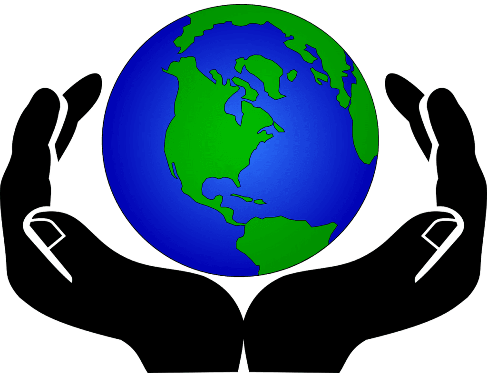
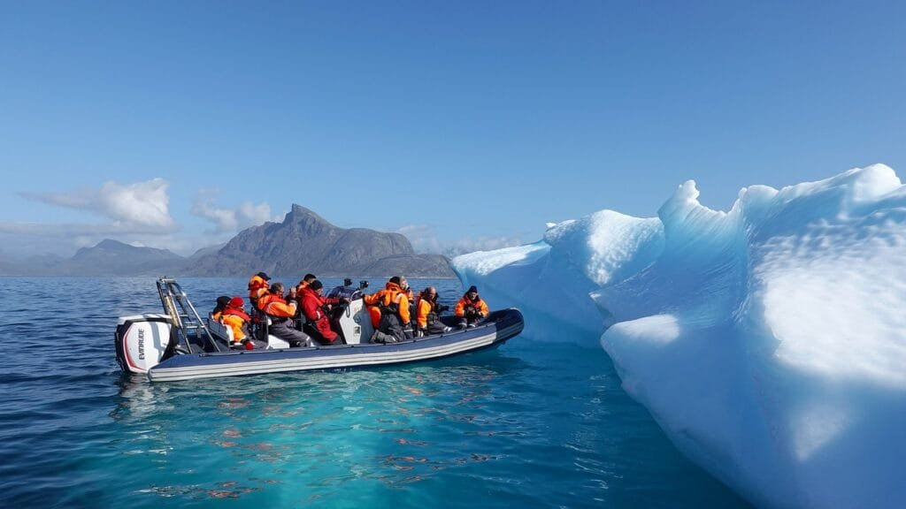

Volcanoes have a mesmerizing and sometimes destructive presence on Earth. The impact of volcanoes on climate change is a fascinating subject that warrants exploration. Volcanoes are not only awe-inspiring natural wonders, but they also hold the potential to significantly influence our planet's climate. In this article, we will delve into the various ways in which volcanoes shape our climate, from emitting gases and aerosols into the atmosphere to the long-term effects their eruptions can have on temperature and weather patterns. So, get ready to embark on a journey of discovery as we uncover the intriguing relationship between volcanoes and climate change.

<iframe width="560" height="315" src="https://www.youtube.com/embed/7zoycrMusK4" frameborder="0" allow="accelerometer; autoplay; encrypted-media; gyroscope; picture-in-picture" allowfullscreen></iframe>

  

## Understanding Volcanoes

Volcanoes are fascinating natural formations that have both positive and negative impacts on the Earth's climate. To truly grasp the magnitude of their influence, it is essential to [understand the formation](https://magmamatters.com/understanding-volcanic-formation-a-comprehensive-guide/ "Understanding Volcanic Formation: A Comprehensive Guide") processes, geographic distribution, and types of volcanoes.

### Formation processes of volcanoes

Volcanoes are formed when molten rock, known as magma, rises to the surface. This molten rock is created deep within the Earth's mantle, where extreme heat and pressure cause rocks to melt. When the pressure becomes too great, the magma finds its way to the surface through vents or cracks in the Earth's crust. This process, known as volcanic activity, gives rise to the formation of volcanoes.

The composition of the magma determines the type of volcano that forms. Magma rich in silica produces viscous lava, resulting in explosive eruptions, while magma with lower silica content produces runny lava, leading to less explosive eruptions. The eruption patterns are influenced by various factors, including the type of volcano, lava viscosity, and gas content.

### Geographic distribution

Volcanoes are found all over the world, but their distribution is not random. They are typically located along plate boundaries, where tectonic plates collide or separate. Areas such as the "Ring of Fire," encircling the Pacific Ocean, are particularly prone to volcanic activity due to the convergence of multiple tectonic plates. These regions experience a high concentration of volcanic eruptions, making them some of the most volatile areas on Earth.

However, there are exceptions to this pattern. Hotspots, which are areas of intense volcanic activity, can occur in the middle of tectonic plates. These hotspots are associated with mantle plumes, where magma rises from deep within the Earth's mantle and creates a series of volcanic islands or mountains. Hawaii, with its shield volcanoes, is a prime example of this type of volcanic activity.

### Types of volcanoes and their eruption patterns

Volcanoes come in various shapes and sizes, each possessing unique characteristics and eruption patterns. The three primary types of volcanoes are shield volcanoes, stratovolcanoes (also known as composite volcanoes), and cinder cone volcanoes.

Shield volcanoes, as the name suggests, resemble a warrior's shield lying on the ground. They are characterized by broad, gently sloping sides and relatively mild eruptions. Lava flows from shield volcanoes tend to be thin and fluid, allowing the lava to travel long distances before solidifying.

Stratovolcanoes, on the other hand, are tall and steep with multiple layers of hardened lava, ash, and rock. These volcanoes have a more explosive nature, typically resulting in pyroclastic flows and ash clouds during eruptions. Mount Vesuvius and Mount St. Helens are examples of stratovolcanoes.

Cinder cone volcanoes are the smallest and simplest type of volcano. They consist of a cone-shaped mound built from ash, cinders, and volcanic rock fragments ejected during eruptions. Cinder cone volcanoes often form on the flanks of larger volcanoes and have short-lived eruptions.

Understanding the different types of volcanoes and their eruption patterns is crucial for assessing the potential impact on climate and the environment.

This image is property of pixabay.com.

## Volcanic Emissions

Volcanic eruptions not only release lava and ash but also emit various gases into the atmosphere. These emissions play a significant role in climate change and can have both short-term and long-term effects on the Earth's atmosphere.

### Components of volcanic emissions

Volcanic emissions consist of a complex mixture of gases, aerosols, and particulate matter. The primary components of volcanic emissions include water vapor (H2O), [carbon dioxide](https://magmamatters.com/the-art-and-science-of-volcano-monitoring/ "The Art and Science of Volcano Monitoring") (CO2), sulfur dioxide (SO2), hydrogen sulfide (H2S), hydrogen chloride (HCl), and hydrogen fluoride (HF).

Water vapor is the most abundant gas released during volcanic eruptions. It is a greenhouse gas that absorbs and re-emits heat, contributing to the warming of the Earth's surface. Carbon dioxide, another significant greenhouse gas, is released in substantial quantities during volcanic activity. However, compared to human-induced emissions, volcanic carbon dioxide emissions are relatively small.

Sulfur dioxide is a highly reactive gas that can lead to the formation of sulfuric acid aerosols in the atmosphere. These aerosols can reflect sunlight back into space, resulting in a cooling effect on the Earth's surface. Hydrogen sulfide, hydrogen chloride, and hydrogen fluoride are also emitted, although in smaller quantities, and can contribute to local and regional air pollution.

### Gases released during volcanic eruptions

Volcanic eruptions release various gases into the atmosphere, each with its own impact on climate and the environment. Sulfur dioxide (SO2) is one of the most notable gases released during volcanic activity. When emitted into the atmosphere, SO2 can react with other gases and particles to form sulfuric acid aerosols. These aerosols can remain in the atmosphere for an extended period, reflecting sunlight and causing a cooling effect.

Another gas of concern is carbon dioxide (CO2), which is a key driver of climate change. While volcanic emissions release CO2 into the atmosphere, the amount is relatively small compared to human-induced emissions. However, during large volcanic eruptions, such as the 1991 eruption of Mount Pinatubo, significant amounts of CO2 can be released, albeit temporarily impacting the atmosphere.

Other gases, such as hydrogen sulfide (H2S), hydrogen chloride (HCl), and hydrogen fluoride (HF), contribute to local and regional air pollution rather than having a significant impact on global climate change.

Understanding the gases released during volcanic eruptions helps to evaluate their potential effects on the atmosphere and climate.

This image is property of pixabay.com.

## Impact of Volcanic Gases on the Atmosphere

The release of gases from volcanic eruptions can have profound effects on the Earth's atmosphere. Understanding the interaction of these gases with the atmosphere and their role in ozone depletion is crucial for comprehending the overall impact of [volcanoes on climate change](https://magmamatters.com/geothermal-energy-and-its-volcanic-origins/ "Geothermal Energy and Its Volcanic Origins").

### Interaction of volcanic gases with the atmosphere

When volcanic gases are released into the atmosphere, they can undergo various chemical reactions and physical processes. Sulfur dioxide (SO2), for example, reacts with water vapor and oxygen to form sulfuric acid (H2SO4). This sulfuric acid can condense to form tiny droplets known as aerosols. These aerosols can remain suspended in the atmosphere for an extended period, reflecting sunlight back into space and causing a cooling effect.

Additionally, volcanic aerosols can act as nuclei for cloud formation, further contributing to the cooling effect. The presence of these aerosols can alter the properties of clouds, affecting their reflectivity and precipitation patterns.

Carbon dioxide (CO2) is another significant gas released during volcanic eruptions. While not directly involved in ozone depletion, CO2 is a greenhouse gas that contributes to global warming. It absorbs and re-emits infrared radiation, trapping heat in the Earth's atmosphere and causing the planet's temperature to rise over time.

### Role of volcanic gases in ozone depletion

Volcanic emissions can also play a role in ozone depletion, particularly due to the presence of halogen compounds. Halogen compounds, such as hydrogen chloride (HCl) and hydrogen fluoride (HF), can reach the stratosphere during explosive volcanic eruptions.

Once in the stratosphere, these compounds can undergo chemical reactions that release chlorine and fluorine radicals. These radicals can then react with ozone molecules, leading to their depletion. Although volcanic emissions are not the primary contributors to ozone depletion, the presence of halogens can enhance chemical reactions that deplete the ozone layer.

Understanding the interaction of volcanic gases with the atmosphere and their role in ozone depletion is essential for assessing the overall [impact of volcanic activity on climate change and the environment](https://magmamatters.com/the-environmental-impact-of-volcanic-eruptions-2/ "The Environmental Impact of Volcanic Eruptions").

