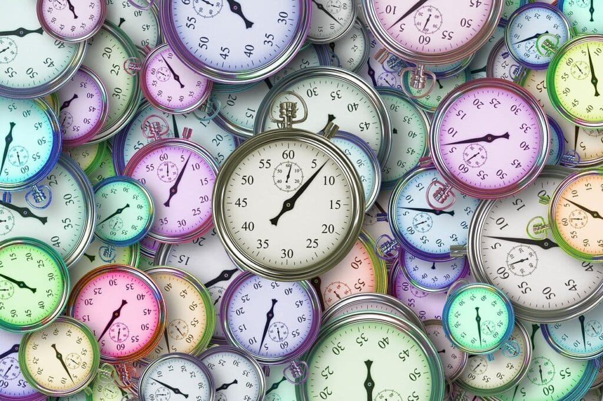

Volcanoes have a profound impact on geological time scales, and understanding their influence is crucial in grasping the Earth's history. Formed by the escape of molten rock and gases from beneath the Earth's surface, volcanic eruptions can have both destructive and beneficial effects on the environment. By examining the different types of volcanoes, their eruption patterns, and the hazards they pose, scientists can gain insights into the Earth's past and even predict future volcanic activity. This article explores how volcanoes shape geological time scales and highlights the significance of studying these natural phenomena.

<iframe width="560" height="315" src="https://www.youtube.com/embed/VNGUdObDoLk" frameborder="0" allow="accelerometer; autoplay; encrypted-media; gyroscope; picture-in-picture" allowfullscreen></iframe>

  

## Understanding Geological Time Scales

Geological Time Scales play a crucial role in helping us understand the long and complex history of our planet. These scales provide a framework for categorizing and organizing geological events that have occurred over billions of years. By studying and analyzing geological time scales, scientists can gain insights into the Earth's evolution, the emergence and extinction of various species, and the changes in climate and environment.

### Definition and concept of Geological Time Scales

Geological Time Scales refer to the divisions and subdivisions of time that are used to describe and measure the Earth's history. They are a way of breaking down vast periods of time into manageable units, allowing scientists to study and analyze specific intervals in Earth's history more effectively.

The concept of Geological Time Scales is based on the principles of stratigraphy, which is the study of rock layers (strata) and the sequence of events recorded in them. These rock layers contain a wealth of information about the Earth's history, including fossil records, past climate conditions, and even the occurrence of volcanic eruptions.

### Major divisions of the geological time scales: eons, eras, periods, epochs, and ages

Geological Time Scales are divided into several major divisions, each representing a different span of time and geological events. The largest division is the eon, followed by eras, periods, epochs, and ages. Let's take a closer look at each of these divisions:

- Eon: Eons are the longest divisions of Geological Time Scales, representing billions of years. The Earth's history is commonly divided into two eons: the Precambrian Eon, which spans from the formation of the Earth about 4.6 billion years ago to the beginning of the Paleozoic Era, and the Phanerozoic Eon, which encompasses the subsequent 542 million years.
    
- Era: Eras are the second-largest divisions of Geological Time Scales and represent distinct intervals in Earth's history. The Phanerozoic Eon is divided into three eras: the Paleozoic Era, the Mesozoic Era, and the Cenozoic Era.
    
- Period: Periods are subdivisions of eras and represent smaller intervals of time. For example, the Mesozoic Era is divided into three periods: the Triassic, the Jurassic, and the Cretaceous.
    
- Epoch: Epochs are even smaller subdivisions of periods, representing relatively short intervals of time. They provide further details and allow for more precise dating of geological events.
    
- Age: Ages are the smallest divisions of Geological Time Scales and represent the shortest intervals of time. They are often named after significant events or characteristic fossils found within that time period.
    

By categorizing time in this way, scientists can establish a chronological framework to study and understand the geological history of the Earth.

## Volcanic Eruptions and Geological Time Scales

Volcanic eruptions play a significant role in shaping Geological Time Scales. These powerful events leave a lasting impact on the Earth's landscape and record. They are often seen as markers in geological time, indicating shifts and changes in the Earth's history.

### Volcanic activity as a marking point in geological time scales

Volcanic activity is a crucial marking point in geological time scales due to its distinct impact on the Earth's surface. When a volcano erupts, it releases molten rock, gases, and debris onto the surface, altering the landscape and leaving behind volcanic deposits.

These volcanic deposits can be observed as different layers of rock, ash, and lava that are preserved in the geological record. By studying these layers, scientists can determine the timing and presence of volcanic eruptions, which helps establish the sequence of events in Earth's history.

### Examples of major volcanic events that marked shifts in Geological Time Scales

Throughout Earth's history, there have been several major volcanic events that have left a significant mark on the geological time scale. One such event occurred approximately 66 million years ago when a massive asteroid impact and subsequent volcanic activity caused the extinction of the dinosaurs and marked the end of the Cretaceous Period.

Another notable volcanic event is the eruption of the Toba supervolcano around 74,000 years ago. This eruption caused a global volcanic winter, resulting in a significant decrease in temperatures and a major impact on the Earth's climate. The Toba eruption left behind a distinctive volcanic ash layer that serves as a marker in the geological time scale.

These examples highlight the influence of volcanic eruptions on the geological record and demonstrate how they can be used to understand and categorize different periods in Earth's history.

This image is property of pixabay.com.

## Volcanoes and Mass Extinctions

Volcanic eruptions have been linked to several mass extinction events throughout Earth's history. These catastrophic events have had a profound impact on the diversity and evolution of life on our planet.

### Volcanic eruptions causing mass extinction events

When volcanoes erupt on a massive scale, they release vast amounts of volcanic gases, ash, and aerosols into the atmosphere. These volcanic emissions can trigger significant changes in climate and result in global environmental disruptions.

One example of a volcanic eruption causing a mass extinction event is the eruption of the Siberian Traps in present-day Russia about 252 million years ago. This volcanic event, known as the Permian-Triassic extinction, resulted in the extinction of approximately 96% of marine species and 70% of terrestrial vertebrate species. The release of volcanic gases, particularly carbon dioxide, led to significant global warming and acidification of the oceans, severely disrupting ecosystems.

### How mass extinctions correspond with the geological time scale

Mass extinction events are significant markers in the geological time scale and can be identified through the sudden disappearance of certain species or a significant decrease in biodiversity. These events represent crucial shifts in Earth's history and can be correlated with specific intervals in the geological record.

By analyzing the distribution and occurrence of fossils, scientists can identify the timing and scale of mass extinctions, allowing for a better understanding of the relationship between volcanic activity and the changing face of life on Earth.

## Volcanoes and Climate Changes

Volcanic eruptions have the potential to cause significant changes in the Earth's climate. The release of volcanic gases and ash into the atmosphere can have both short-term and long-term effects on global temperatures and weather patterns.

### Effects of volcanic eruptions on global climate

When a volcano erupts, it releases large amounts of volcanic gases, including [sulfur dioxide and carbon](https://magmamatters.com/the-art-and-science-of-volcano-monitoring/ "The Art and Science of Volcano Monitoring") dioxide, into the atmosphere. These gases can reach the stratosphere, where they can remain for several years. In the stratosphere, sulfur dioxide reacts with water vapor to form sulfate aerosols, which reflect sunlight back into space. This results in a cooling effect on the Earth's surface, leading to a temporary drop in global temperatures.

Volcanic eruptions can also release ash particles into the atmosphere, which can act as nuclei for cloud formation. These volcanic aerosols can affect precipitation patterns and cloud cover, leading to changes in regional weather patterns.

### How such changes are recorded in geological time scales

The impact of volcanic eruptions on global climate can be recorded in the geological time scale through the analysis of various proxies. For example, ice cores taken from polar regions can contain layers of volcanic ash, allowing scientists to determine the timing and composition of past volcanic eruptions.

Additionally, the presence of specific isotopes and chemicals in sediment cores from oceans and lakes can provide insights into past climate conditions influenced by volcanic activity. By studying these records, scientists can establish the relationship between volcanic eruptions and changes in global climate over geological time scales.

This image is property of pixabay.com.

## The Role of Radiometric Dating

Radiometric dating is a crucial tool used to determine the age of volcanic rocks and minerals. By analyzing the decay of radioactive isotopes within these materials, scientists can establish accurate and precise dates for volcanic eruptions.

### How we date volcanic rocks through radiometric dating

Radiometric dating relies on the principle of radioactive decay. Certain isotopes within volcanic rocks, such as uranium and potassium, are unstable and decay over time. By measuring the abundance of parent isotopes and their decay products, scientists can calculate the age of the rock.

One commonly used radiometric dating method is potassium-argon dating. This technique is particularly useful for dating volcanic rocks because it relies on the decay of potassium-40 to argon-40, which occurs at a known rate.

### Radiometric dating's influence on understanding geological time scales

Radiometric dating has revolutionized our understanding of geological time scales. By providing precise dates for volcanic eruptions and other geological events, radiometric dating allows us to establish the sequence and duration of events in Earth's history.

This technique has been instrumental in determining the ages of various rock layers, fossils, and volcanic ash deposits, providing a basis for the subdivisions and categorization within the geological time scale.

## Volcanoes and Plate Tectonics

The movement of tectonic plates is closely associated with the formation of volcanoes. Volcanic activity occurs at plate boundaries, where the plates interact and generate significant geological changes.

### How the movement of tectonic plates creates volcanoes

Volcanic activity is primarily driven by the movement and interaction of tectonic plates. There are two main types of plate boundaries where volcanoes are commonly found:

1. Convergent Boundaries: These are areas where two plates are moving towards each other. When an oceanic plate collides with a continental plate, the denser oceanic plate is forced beneath the continental plate in a process called subduction. As the subducting plate sinks into the mantle, it melts due to the high temperatures and pressures, forming a magma chamber. This magma eventually rises to the surface, resulting in volcanic eruptions.
    
2. Divergent Boundaries: These are areas where two plates are moving away from each other. As the plates separate, magma from the mantle can rise to fill the gap, forming new crust and creating a volcanic ridge. This type of volcanic activity is often associated with mid-oceanic ridges and rift zones.
    

### Importance of plate tectonics in shaping the Geological Time Scales

Plate tectonics is a fundamental process that shapes the Earth's surface and plays a significant role in the formation of volcanic activity. By understanding the movement of tectonic plates, scientists can identify the locations and patterns of volcanic eruptions throughout geological time.

The study of plate tectonics helps us establish the connections between volcanic activity, the distribution of volcanoes, and the geological time scale. It provides valuable insights into the evolution of our planet and the dynamic processes that have shaped it over millions of years.

This image is property of pixabay.com.

## Volcanic Ash Layers as Geological Markers

Volcanic ash layers are valuable geological markers that can provide essential information about past volcanic eruptions and their relationship to the geological time scale.

### The preservation of volcanic ash layers over time

When a volcano erupts, it releases ash particles into the atmosphere, which are then dispersed and may settle over vast distances. Over time, these ash particles can accumulate and become preserved within layers of sediment or even frozen in ice. With proper geological preservation, these ash layers can persist for millions of years.

Volcanic ash layers contain unique chemical and mineral compositions that allow scientists to trace their origin back to specific volcanic eruptions. By analyzing the characteristics of these layers, scientists can determine the timing, intensity, and geographic extent of past volcanic events.

### How ash layers are used as reference points in geological time scales

Ash layers serve as invaluable reference points in the geological time scale. These layers can be identified and correlated across different regions, allowing scientists to establish a geological timeline of volcanic events.

By comparing the composition and dating of ash layers from different locations, scientists can gain insights into the frequency and magnitude of volcanic eruptions throughout history. This information helps refine the subdivisions within the geological time scale and provides a more comprehensive understanding of Earth's volcanic activity.

## Volcanoes and Paleomagnetism

Volcanic rocks have played a crucial role in the study of paleomagnetism, which involves understanding past changes in Earth's magnetic field. By analyzing volcanic rocks and their magnetic properties, scientists can gain insights into the Earth's geological history and its relationship to the geological time scale.

### Volcanic rocks and preservation of Earth's magnetic field changes

When volcanic rocks form, their minerals align with the Earth's magnetic field at the time of their cooling. This alignment, known as magnetization, gets locked into the rock and preserved over geological time.

By analyzing the magnetic properties of volcanic rocks, scientists can determine the strength and direction of the Earth's magnetic field at the time of the eruption. These magnetic records provide critical information about the past behavior of Earth's magnetic field and can be used to reconstruct the positions of tectonic plates and the movement of continents.

### Correlation between paleomagnetism and geological time scales

Paleomagnetic analyses of volcanic rocks have played a significant role in establishing and refining the geological time scale. By comparing the magnetic properties of rocks from different locations and time periods, scientists can correlate the timing and sequence of geological events.

The study of paleomagnetism has allowed for the development of magnetic polarity time scales, which provide an additional layer of information for dating and categorizing different intervals in the geological time scale. These magnetic records provide valuable insights into Earth's past and its relationship to the ever-evolving field of geology.

## Volcanoes and Fossil Records

Volcanic activity can have a profound impact on the preservation and distribution of fossils. By affecting the environment and climate, volcanic eruptions have played a role in shaping the fossil record and influencing the evolution and extinction of various species.

### Fossil preservation during volcanic events

Volcanic eruptions can have both positive and negative effects on the preservation of fossils. On the one hand, volcanic ash and sediment can quickly bury and encapsulate organisms, providing ideal conditions for fossilization. This rapid burial can result in the exquisite preservation of delicate structures and soft tissues, allowing scientists to study and learn from these exceptional fossils.

On the other hand, volcanic eruptions can also destroy habitats and entire ecosystems, leading to mass extinctions and the loss of many species. Volcanic ash and toxic gases released during eruptions can have devastating effects on plants and animals, often resulting in the destruction of ecosystems and widespread extinction events.

### Role of volcanic activity in influencing species' evolution and extinction in fossil records

Volcanic activity has influenced the evolution and extinction of various species throughout Earth's history. Major volcanic events, such as supervolcano eruptions and large-scale lava flows, can cause significant disruptions to ecosystems, leading to the extinction of certain species and the emergence of new ecological niches.

These volcanic events can create new habitats, reshape landscapes, and alter local climates, which in turn drive natural selection and evolutionary processes. This dynamic interaction between volcanic activity, climate change, and species adaptation is reflected in the fossil record, providing crucial evidence for understanding the complex relationship between volcanoes and the evolution of life on Earth.

## Volcanic Hazards and Risks Over Geological Time Scales

Understanding the patterns of volcanic hazards over geological time scales is essential for predicting future volcanic activity and mitigating risks to surrounding communities. By analyzing past volcanic events, scientists can identify recurring patterns and develop strategies to minimize the impact of future eruptions.

### How patterns of volcanic hazards have evolved over geological time

Volcanic hazards have varied over geological time scales due to changes in the Earth's tectonic activity, climate, and geographic distribution. While some volcanic eruptions have been relatively localized and have had minimal impact on surrounding regions, others have had far-reaching and devastating effects.

Through the analysis of past volcanic events, scientists can identify patterns and trends in volcanic hazards, such as the frequency and magnitude of eruptions. This information is crucial for understanding the potential threats posed by volcanoes and developing effective strategies for risk management.

### Predicting future volcanic hazards based on past patterns in geological time scales

By studying the patterns of volcanic hazards over geological time scales, scientists can develop models and predictive tools to assess future volcanic activity. These models take into account factors such as historical eruption data, geological characteristics of specific volcanic regions, and ongoing monitoring of volcanic activity.

While predicting volcanic eruptions with absolute certainty is still challenging, understanding past patterns and trends can help identify high-risk areas and establish early warning systems. This proactive approach to volcanic hazard management can save lives and minimize the impact of future volcanic events.

In conclusion, volcanoes have played a significant role in shaping Geological Time Scales and understanding Earth's history. They have left a lasting mark in the geological record, providing valuable information about past climate changes, mass extinctions, and the evolution of life on our planet. By studying volcanic activity, the preservation of volcanic ash layers, and the role of plate tectonics, scientists can unravel the complex history of the Earth and develop strategies to mitigate the risks associated with future eruptions. The study of volcanoes continues to be a fascinating and vital field of research, as it provides us with insights into the past and guides our efforts to protect the future.

