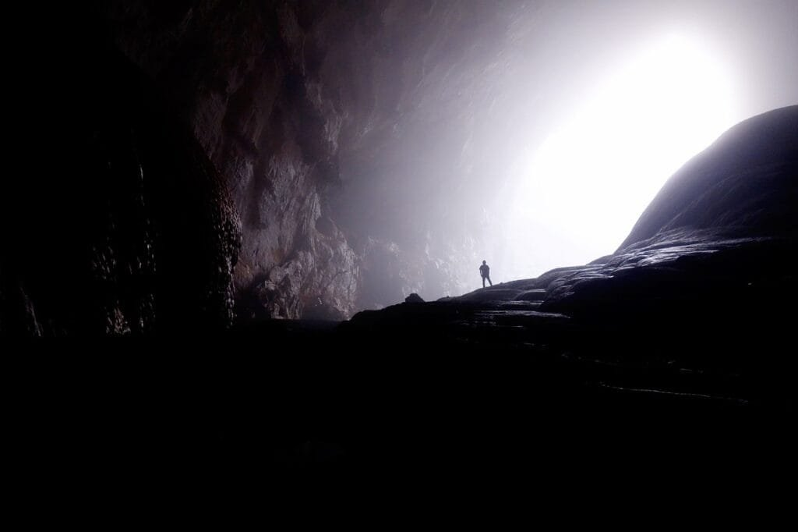
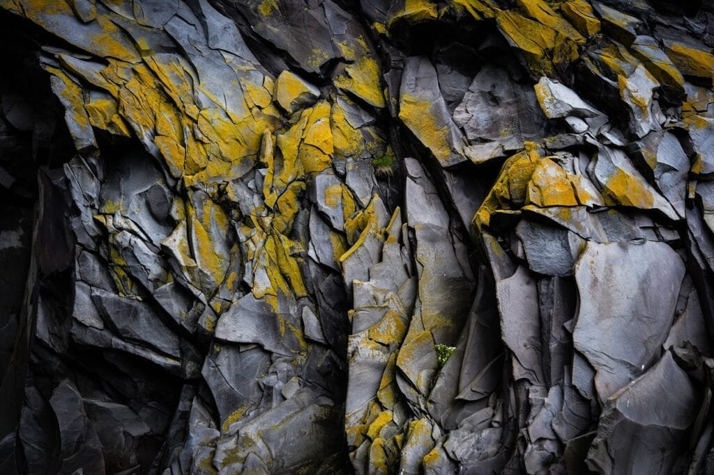

Volcanoes are fascinating and powerful natural phenomena that have captivated humanity for centuries. From their majestic beauty to the destructive potential they possess, volcanoes are both awe-inspiring and dangerous. That's why effective monitoring of volcanoes is crucial in order to mitigate risks and protect surrounding communities. In this article, we will explore the importance of volcano monitoring and discuss the three best tools that help scientists and researchers gather essential data for predicting volcanic activity. By understanding the different types of volcanoes, their eruption causes, and the hazards and benefits they bring, we can gain valuable insights into the inner workings of these geological wonders and minimize the potential damage they can inflict. Let's delve into the world of volcano monitoring and discover the tools that play a vital role in this crucial scientific endeavor.

<iframe width="560" height="315" src="https://www.youtube.com/embed/t3Bm_xUgFms" frameborder="0" allow="accelerometer; autoplay; encrypted-media; gyroscope; picture-in-picture" allowfullscreen></iframe>

  

## The Nature of Volcanoes

Volcanoes are fascinating geological formations that have captivated humans for centuries. They are formed when molten rock, gases, and debris escape to the earth's surface, leading to eruptions of lava and ash. These eruptions can be both awe-inspiring and destructive, showcasing the immense power and beauty of nature.

### Formation of Volcanoes

Volcanoes are generally formed in locations along plate boundaries, hotspots under the earth's crust, or rift zones where the earth's tectonic plates are moving apart. The movement and interaction of these plates create the ideal conditions for volcanic activity.

At plate boundaries, where two plates are colliding or moving apart, magma from beneath the earth's surface rises and accumulates in chambers. When the pressure becomes too great, the magma is forced upward, creating a vent through which it can erupt.

Hotspots, on the other hand, occur deep underground, and they are places where a column of extremely hot mantle material rises towards the surface. This mantle material melts, forming magma chambers that eventually lead to volcanic eruptions. [Shield volcanoes](https://magmamatters.com/understanding-volcanic-formation-a-comprehensive-guide/ "Understanding Volcanic Formation: A Comprehensive Guide") in places like Hawaii are often formed over hotspots and have a more gradual formation compared to other types of volcanoes.

### Types of Volcanoes: Shield, Composite, and Others

There are several types of volcanoes, each with its own distinctive features and eruption characteristics. Three common types are shield volcanoes, composite volcanoes, and cinder cones.

Shield volcanoes, such as those found in Hawaii, are characterized by their low, broad profile. They are built up over time as layers of lava flow out and spread in all directions, creating a gently sloping shape resembling a warrior's shield. Shield volcanoes typically have relatively non-explosive eruptions, with lava flowing slowly and covering large areas.

Composite, or stratovolcanoes, like Mount St. Helens in the United States, are steep-sided conical mountains. They are constructed from layers of hardened lava, volcanic ash, and other materials. Composite volcanoes often have more explosive eruptions due to the higher viscosity of their lava. These eruptions can produce pyroclastic flows, ash clouds, and volcanic bombs.

Cinder cones are small volcanoes that form from explosive eruptions of ash and rock fragments. They are typically found on the flanks of larger volcanoes and often have a simple, cone-shaped structure. While cinder cones may not be as large or explosive as shield or composite volcanoes, they can still pose risks to nearby communities.

### Geographical Distribution and Hot Spots

Volcanoes can be found all around the world, but their distribution is not uniform. Many volcanic regions are concentrated along plate boundaries, where the movement of tectonic plates creates ideal conditions for volcanic activity.

One well-known volcanic region is the "Ring of Fire," which encircles the Pacific Ocean. This area is highly active and experiences frequent volcanic eruptions and earthquakes. Examples of volcanoes in the Ring of Fire include Mount Fuji in Japan, Mount Rainier in the United States, and Mount Pinatubo in the Philippines.

Hot spots, like those in Hawaii and Yellowstone National Park, are another important aspect of volcanic distribution. These are areas where molten material rises from deep within the earth to the surface, creating a volcanic hotspot. The Hawaiian Islands, for instance, are the result of the Pacific Plate moving over a stationary hotspot, causing a chain of volcanic islands to form.

Understanding the geographical distribution of volcanoes and the presence of hot spots is crucial for monitoring and predicting volcanic activity, as well as assessing the potential risks to surrounding communities.

## Understanding Volcanic Eruptions

Volcanic eruptions are dynamic and complex events that result from the release of pent-up energy below the earth's surface. They can occur suddenly or build up over time, and each eruption is unique in its characteristics and impact.

### Causes of Volcanic Eruptions

Volcanic eruptions occur when the pressure within a magma chamber becomes too great for the overlying rocks to contain. This pressure can be the result of various factors, including the accumulation of magma, the release of gases, or the interaction of different types of magma.

One common cause of volcanic eruptions is the accumulation of magma in a chamber beneath the earth's surface. As magma rises from deeper levels, it can become trapped in a chamber, causing pressure to build up. When the pressure exceeds the strength of the surrounding rocks, an eruption occurs, releasing the pressure and allowing the magma to escape to the surface.

Another factor that can trigger volcanic eruptions is the release of gases from the magma. As magma rises towards the surface, the decreasing pressure allows dissolved gases, such as water vapor and carbon dioxide, to escape. The sudden release of these gases can cause the magma to expand rapidly and fragment into volcanic ash, leading to explosive eruptions.

The interaction of different types of magma can also contribute to volcanic eruptions. When two different magmas with different compositions mix, it can result in changes in viscosity, gas content, and eruptive behavior. These changes can significantly impact the explosiveness and intensity of the eruption.

### Pattern of Eruptions

Volcanic eruptions can display a wide range of patterns and behaviors. Some eruptions occur suddenly and explosively, while others can be more prolonged and effusive. The pattern of eruptions depends on various factors, including the type of volcano, the composition of the magma, and the presence of gases.

Explosive eruptions, characterized by violent explosions and the ejection of volcanic ash, rocks, and gases, are often associated with composite volcanoes. These eruptions result from the rapid release of gas-rich magma and can generate [pyroclastic flows and ash clouds that can travel](https://magmamatters.com/the-environmental-impact-of-volcanic-eruptions-2/ "The Environmental Impact of Volcanic Eruptions") long distances.

Effusive eruptions, on the other hand, involve the slow and steady outpouring of lava from a volcanic vent. Shield volcanoes, such as those in Hawaii, are known for their effusive eruptions. The lava flows steadily from the vent and can cover large areas over time.

Some eruptions exhibit a combination of explosive and effusive characteristics. These eruptions, known as Vulcanian eruptions, involve powerful explosions followed by the effusion of lava. They can occur in various types of volcanoes and can be highly dangerous due to the rapid transition from explosive to effusive activity.

### Effects of Lava Viscosity and Gas Content

The viscosity of lava and the gas content within it play significant roles in shaping the behavior and impact of volcanic eruptions. Viscosity refers to the resistance of a liquid to flow, and in the context of volcanoes, it determines how easily lava can move and spread.

Lava with low viscosity, such as basaltic lava, flows more easily and can cover large areas. This type of lava is typically associated with shield volcanoes and effusive eruptions. In contrast, lava with high viscosity, such as andesitic or rhyolitic lava, is more sticky and tends to flow less easily. This type of lava is often associated with composite volcanoes and explosive eruptions.

The gas content within lava also affects the behavior of volcanic eruptions. As magma rises towards the surface, the decreasing pressure allows dissolved gases to escape from the magma. The presence of gases can greatly increase the explosiveness of an eruption. High gas content can lead to the fragmentation of magma into volcanic ash and the formation of explosive eruptions.

Understanding the viscosity of lava and the gas content within it is crucial for predicting the behavior of volcanic eruptions and assessing the potential hazards they may pose.

This image is property of pixabay.com.

## Positive Impacts of Volcanoes

While volcanic eruptions may have destructive consequences, they also have positive impacts on the environment and create unique opportunities for life to thrive.

### Nutrient Contribution to Soil

Volcanic eruptions contribute to the fertility of soil by releasing a wide range of essential nutrients. When lava flows slowly and cools, it weathers and breaks down into small particles that eventually form fertile soil. The minerals and elements present in the lava enrich the soil, making it highly conducive for the growth of plants.

Volcanic ash, which is produced during explosive eruptions, is also rich in nutrients. When ash settles on the ground, it adds important elements like phosphorus, potassium, and calcium to the soil. These nutrients promote plant growth and contribute to the overall productivity of the land.

The fertile soils created by volcanic activity have been crucial for the development of agriculture in many volcanic regions. Farmers often seek out areas near volcanoes for their fertile soils, resulting in abundant and diverse agricultural production.

### Formation of New Landforms

Volcanoes are responsible for the creation of various landforms that can be both awe-inspiring and valuable. The accumulation of lava and volcanic ash over time can shape the landscape and form unique features.

Shield volcanoes, with their gradual eruption patterns, often result in the formation of vast lava fields and gently sloping mountains. These landforms can provide opportunities for recreation, such as hiking or exploring lava tubes.

Volcanic cones, including cinder cones and composite volcanoes, create striking landscapes. Their steep slopes and conical shapes can form iconic landmarks that attract tourists and adventurers from around the world. These landforms can also have geological significance and provide valuable insight into the history of volcanic activity in the area.

Volcanic activity can also lead to the formation of islands. Hotspots like those in Hawaii have created a chain of islands as the Pacific Plate moves over the stationary hotspot. These islands not only offer unique ecosystems but also serve as important habitats for a wide range of plant and animal species.

### Impact on Climate

Volcanic eruptions can have a significant impact on the climate, both on a regional and global scale. When volcanoes release large amounts of gases and particles into the atmosphere, they can affect the balance of heat and radiation on Earth.

During explosive eruptions, volcanic ash and gases can be injected high into the stratosphere. This can result in the formation of volcanic clouds that can spread over large areas and persist for months or even years. These clouds can reflect sunlight back into space, causing a cooling effect and potentially lowering global temperatures.

Volcanic eruptions can also release large amounts of sulfur dioxide (SO2) gas into the atmosphere. When this gas combines with water vapor, it forms sulfuric acid aerosols, which can reflect sunlight and contribute to the cooling of the Earth's surface. These aerosols can also lead to the formation of colorful sunsets and sunrises due to the scattering of light.

On a regional scale, volcanic eruptions can have more immediate effects on climate. The release of ash and gases can lead to the formation of acid rain, which can be damaging to vegetation and aquatic ecosystems. The cooling effect of volcanic clouds can also impact agriculture and disrupt local weather patterns.

Understanding the impact of volcanic eruptions on climate is crucial for predicting and mitigating their effects, especially in areas with high volcanic activity.

## Negative Impacts of Volcanic Eruptions

As awe-inspiring as volcanic eruptions may be, they can also cause significant damage and pose risks to human habitation, the environment, and various industries.

### Damage to Human Habitation

Volcanic eruptions can have devastating consequences for nearby communities. Explosive eruptions can hurl volcanic bombs, rocks, and ash over long distances, causing damage to buildings, infrastructure, and agricultural fields. The weight of volcanic ash can collapse roofs, disrupt power lines, and contaminate water sources.

Lahars, or volcanic mudflows, can also pose a significant threat to human habitation. These mudflows occur when volcanic ash mixes with water, often as a result of heavy rain or melting snow on nearby volcanoes. Lahars can move rapidly downhill, destroying everything in their path and burying communities under meters of debris.

Furthermore, [volcanic gases](https://magmamatters.com/the-art-and-science-of-volcano-monitoring/ "The Art and Science of Volcano Monitoring") emitted during eruptions can be highly toxic and pose health risks to people living in the vicinity of volcanoes. Gases like sulfur dioxide (SO2), carbon dioxide (CO2), and hydrogen sulfide (H2S) can cause respiratory problems, eye irritation, and even death in severe cases.

### Landscape Destruction

Volcanic eruptions can dramatically alter the landscape, destroying ecosystems and habitats. The intense heat, ash, and gases released during eruptions can kill plants and animals, leaving behind a barren and lifeless terrain.

The deposition of thick layers of ash can smother vegetation and prevent the growth of new plants. The destruction of forests and other natural habitats can lead to the loss of biodiversity and disrupt ecological balance.

Volcanic eruptions can also result in the destruction of important geological features and cultural sites. Lava flows and pyroclastic flows can bury archaeological sites, erasing valuable evidence of past civilizations. The loss of these sites not only affects our understanding of history but also impacts tourism and cultural identity.

### Impacts on Air Travel

Volcanic eruptions can have far-reaching impacts on air travel, especially when they produce large ash clouds. The fine particles of volcanic ash can pose a serious hazard to aircraft by clogging engines, damaging critical instruments, and reducing visibility.

When volcanic ash is ingested by jet engines, it can melt and form a glassy substance, which can cause engine failure and loss of power. The abrasive nature of volcanic ash can also damage surfaces of the aircraft, including windshields and flight control systems.

To mitigate the risks associated with volcanic ash, aviation authorities closely monitor volcanic activity and issue ash cloud advisories and flight restrictions when necessary. These measures are taken to ensure the safety of passengers and crew and prevent potential accidents caused by volcanic ash encounters during flight.

### Health Risks

Volcanic eruptions can have serious health consequences for individuals exposed to volcanic ash, gases, and other volcanic hazards. The fine particles of ash, when breathed in, can cause respiratory problems, such as coughing, wheezing, and shortness of breath. Prolonged exposure to volcanic ash can also lead to chronic conditions like bronchitis and asthma.

Volcanic gases, both during and after eruptions, can release toxic compounds that pose significant health risks. Sulfur dioxide, for example, can cause eye irritation, breathing difficulties, and exacerbate existing respiratory conditions. Hydrogen sulfide, when released in high concentrations, can cause nausea, headaches, and even loss of consciousness.

Communities living near volcanoes must take precautions to protect themselves during eruptions. This includes wearing respiratory masks, staying indoors, and following evacuation orders when necessary. Proper monitoring and timely warnings are essential in ensuring the safety and well-being of those at risk.

This image is property of pixabay.com.

## Historical Instances of Major Volcanic Eruptions

Throughout history, several major volcanic eruptions have occurred that have left a lasting impact on their surrounding communities and the global climate.

### Famous Eruptions and their Consequences

One of the most famous volcanic eruptions in history is the eruption of Mount Vesuvius in 79 AD. This eruption buried the Roman cities of Pompeii and Herculaneum under several meters of volcanic ash, preserving them remarkably well. The eruption resulted in the deaths of thousands of people and was a tragedy for the region. However, the preservation of the cities has provided invaluable insights into ancient Roman life and culture.

Another significant eruption was the eruption of Mount Tambora in 1815, located in present-day Indonesia. This eruption is considered one of the largest and most devastating in recorded history. The eruption ejected an immense amount of volcanic ash and gases into the atmosphere, causing global climate anomalies known as the "Year Without a Summer" in 1816. The eruption led to agricultural failures, famine, and social unrest in various parts of the world.

### The Effects on Surrounding Communities and Recovery Process

Major volcanic eruptions can have long-lasting effects on surrounding communities. In addition to the immediate damage caused by lava flows, ash, and gases, these communities often face significant challenges in rebuilding and recovering from the disaster.

Communities affected by volcanic eruptions must deal with the loss of infrastructure, homes, and livelihoods. The removal of thick layers of ash and debris is a monumental task that requires coordinated efforts and resources. The resettlement and reestablishment of communities in safer areas also pose challenges in terms of logistical considerations and social cohesion.

Despite the challenges, communities have shown resilience and adaptability in the face of volcanic eruptions. Through community collaboration, governmental support, and international aid, areas affected by volcanic disasters can begin the recovery process and rebuild their lives.

### Impact on Global Climate

Major volcanic eruptions have the potential to impact the global climate due to the release of gases and volcanic particles into the atmosphere. These emissions can lead to changes in temperature, precipitation patterns, and atmospheric composition, with far-reaching consequences.

Volcanic aerosols, consisting of tiny particles of volcanic ash and sulfuric acid, can reflect sunlight back into space, causing a cooling effect on the Earth's surface. This can lead to a temporary decrease in global temperatures, similar to the effects seen during the eruption of Mount Tambora in 1815.

However, the long-term impact of volcanic eruptions on global climate is complex and depends on various factors, including the magnitude of the eruption, the composition of the emissions, and the duration of their presence in the atmosphere. Volcanic emissions can also interact with other climate drivers and contribute to the overall climate system.

Understanding the role of major volcanic eruptions in global climate dynamics is crucial for accurately predicting future climate patterns and assessing the impact of human-induced climate change.

## Introduction to Volcano Monitoring

Volcano monitoring plays a critical role in understanding volcanic activity, predicting eruptions, and mitigating the risks posed by volcanic hazards. By continuously monitoring volcanoes, scientists can gather valuable data that helps in the assessment of volcanic behavior and informs decision-making processes.

### Reasons for Monitoring Volcanoes

There are several reasons why it is essential to monitor volcanoes:

1. **Early Warning Systems**: Volcano monitoring helps in the early detection of changes in volcanic activity that could indicate an impending eruption. By continuously monitoring various parameters, such as seismic activity, gas emissions, and ground deformation, scientists can identify patterns and anomalies that may be associated with volcanic unrest.
    
2. **Risk Assessment**: Monitoring volcanoes allows scientists to assess the potential hazards and risks posed by volcanic activity to surrounding communities and infrastructure. This information is crucial for emergency management agencies and decision-makers in developing strategies and plans for disaster preparedness and response.
    
3. **Understanding Volcanic Processes**: Volcano monitoring provides valuable insights into the behavior and dynamics of volcanic systems. By studying the data collected from monitoring networks, scientists can better understand the processes that drive volcanic eruptions and the factors that influence their intensity and duration.
    
4. **Scientific Research**: Volcano monitoring data is vital for scientific research aimed at improving our understanding of volcanoes and volcanic phenomena. The data collected from monitoring networks can be used to develop models and simulations that help in predicting eruptions and assessing their potential impact.
    

### Methods used in Volcano Monitoring

Scientists employ a variety of monitoring methods to gather data on volcanic activity. These methods include:

1. **Seismic Monitoring**: Seismic instruments, such as seismometers, are used to detect and record ground vibrations caused by volcanic activity. Changes in seismic activity, such as increased frequency and amplitude of earthquakes, can provide valuable information on the movement of magma beneath the surface.
    
2. **Gas Monitoring**: Gas sensors are used to measure the composition and flux of gases emitted by volcanoes. Changes in gas emissions, such as the increase in sulfur dioxide (SO2) or carbon dioxide (CO2) levels, can indicate an impending eruption.
    
3. **Ground Deformation Monitoring**: Ground-based instruments, such as GPS and InSAR (Interferometric Synthetic Aperture Radar), are used to measure changes in the shape and elevation of the ground. These measurements can help identify the inflation or deflation of magma chambers below the surface, providing insights into the movement and accumulation of magma.
    
4. **Remote Sensing**: Satellite-based remote sensing techniques, such as thermal imaging and radar, are used to monitor volcanic activity from space. These techniques can provide valuable information on changes in temperature, surface deformation, and gas emissions over large areas, enhancing the efficiency and coverage of volcano monitoring.
    
5. **Geological and Geochemical Monitoring**: Field observations, geological mapping, and geochemical analysis of volcanic samples are crucial for understanding the past and present behavior of volcanoes. These methods help in reconstructing the volcanic history and identifying signs of potential future eruptions.
    

By combining and analyzing data from multiple monitoring methods, scientists can develop a comprehensive understanding of volcanic systems and improve their ability to predict and mitigate volcanic hazards.

This image is property of pixabay.com.

## Technologies Employed in Volcano Monitoring

Advancements in technology have greatly enhanced the capabilities of volcano monitoring networks. Innovative tools and techniques are constantly being developed to improve data collection, analysis, and dissemination.

### Use of Seismographs

Seismographs, or instruments used to measure ground vibrations, are critical tools in volcano monitoring. Modern seismographs are highly sensitive and can detect even the tiniest ground movements associated with volcanic activity.

Digital seismographs have replaced older analog instruments, allowing for real-time data collection and analysis. These instruments can record and transmit seismic data continuously, providing scientists with up-to-date information on volcanic activity.

### Satellite Imaging

Satellite imaging has revolutionized volcano monitoring by providing a bird's-eye view of volcanic regions. Remote sensing satellites equipped with cameras, thermal sensors, and radar systems capture high-resolution images and data that can be used to monitor changes in temperature, gas emissions, and ground deformation.

By comparing satellite images taken at different times, scientists can identify changes in surface features, such as the formation of new vents or the growth of lava flows. Satellite imaging also allows for the monitoring of remote or inaccessible volcanoes, providing a valuable source of data for volcanic research and hazard assessment.

### Thermal Imaging

Thermal imaging has become an essential tool in volcano monitoring. Infrared cameras can detect and measure the temperature of volcanic surfaces, providing insights into the distribution and movement of magma beneath the surface.

Thermal imaging allows scientists to identify areas of high heat flux, which can indicate the presence of magma close to the surface. Changes in the thermal signature of a volcano can also indicate variations in volcanic activity and help in predicting potential eruptions.

### Gas Sensors

Gas sensors play a crucial role in volcano monitoring by measuring the composition and flux of gases emitted by volcanoes. These sensors can detect and analyze gases such as sulfur dioxide (SO2), carbon dioxide (CO2), and hydrogen sulfide (H2S), providing valuable information on volcanic activity.

The development of portable gas sensors has significantly improved the efficiency and accuracy of gas monitoring. These handheld devices allow scientists to collect gas samples directly from volcanic vents, providing real-time information on gas emissions and helping in the assessment of volcanic hazards.

## Predicting Volcanic Eruptions

Despite advances in volcano monitoring, accurately predicting volcanic eruptions remains a significant challenge. Volcanoes are complex systems, and eruptions can be influenced by a multitude of factors, making precise prediction a difficult task.

### Indicators of an Imminent Eruption

Scientists look for various indicators that may suggest an imminent volcanic eruption. These indicators include:

1. **Seismic Activity**: An increase in the frequency and intensity of volcanic earthquakes can indicate the movement of magma beneath the surface. Seismic monitoring networks can detect these changes and provide valuable information for eruption prediction.
    
2. **Ground Deformation**: Inflation or deflation of the ground surface can occur as magma moves underground. Monitoring changes in ground deformation using instruments like GPS and InSAR can help in identifying patterns that may precede an eruption.
    
3. **Gas Emissions**: Changes in gas emissions, such as an increase in the concentration of sulfur dioxide (SO2) or carbon dioxide (CO2), can suggest rising magma levels and an increased likelihood of an eruption.
    
4. **Volcanic Tremor**: Volcanic tremor refers to continuous, low-frequency ground vibrations associated with the movement of magma. Monitoring volcanic tremor can provide insights into the dynamics of volcanic systems and help in eruption prediction.
    

While these indicators can provide valuable information, they are not foolproof predictors of volcanic eruptions. Volcanoes are highly complex systems, and eruptions can occur without clear precursory signs. Therefore, it is essential to combine monitoring data with a deep understanding of each specific volcano to make accurate predictions.

### Challenges in Accurate Prediction

Accurately predicting volcanic eruptions is challenging due to several factors:

1. **Volcanic Complexity**: Volcanic systems are highly complex, with numerous variables affecting eruption behavior. The interaction between magma, gas, and the surrounding rocks is still not fully understood, making it difficult to accurately predict how a volcano will behave.
    
2. **Limited Data**: Volcanic monitoring networks provide valuable data, but there are often limitations in coverage and resolution. Some volcanoes are remote or inaccessible, making it challenging to gather comprehensive data. Additionally, eruptions can occur suddenly, leaving little time for observation and analysis.
    
3. **Variability of Eruptions**: Volcanic eruptions can exhibit a wide range of behaviors, from slow and effusive eruptions to explosive and catastrophic ones. Each volcano has its own unique characteristics, and eruptions can vary in terms of duration, intensity, and style. Capturing this variability in predictive models is a significant challenge.
    
4. **Uncertainty and False Alarms**: Volcano monitoring involves dealing with a degree of uncertainty. There can be false alarms, where volcanic activity intensifies but does not lead to an eruption. Balancing the need to issue timely warnings with the risk of false alarms is a delicate task.
    

Despite these challenges, ongoing research and advancements in volcano monitoring technologies offer hope for improved prediction capabilities in the future.

## Role of Early Warnings in Disaster Mitigation

Early warnings play a crucial role in mitigating the impacts of volcanic eruptions and ensuring the safety of vulnerable communities. By providing timely and accurate information, early warnings help individuals and authorities take appropriate actions to protect lives and property.

### Importance of Early Alerts

Early alerts give people time to evacuate, prepare emergency supplies, and secure their homes and belongings. By providing advance notice of a potential eruption, authorities can effectively coordinate evacuation efforts and minimize the risk of casualties.

Early warnings also allow emergency management agencies to mobilize resources and establish communication channels to effectively respond to volcanic disasters. This includes deploying rescue teams, setting up temporary shelters, and ensuring essential services like healthcare and utilities are available to affected communities.

Additionally, early warnings provide the opportunity for communities to engage in preparedness measures, such as developing emergency plans, conducting drills, and educating residents on volcanic hazards. This increases community resilience and reduces the potential for panic during an actual eruption.

### Case Studies of Successful Prediction and Mitigation

There have been instances where early warnings and effective disaster mitigation measures have significantly reduced the impact of volcanic eruptions.

One such case is the eruption of Mount Pinatubo in the Philippines in 1991. Prior to the eruption, scientists closely monitored seismic activity and other signs of volcanic unrest. This early warning allowed authorities to evacuate approximately 60,000 people from the surrounding areas, minimizing the loss of life. The eruption, though one of the largest of the 20th century, resulted in fewer casualties due to the successful evacuation efforts.

Another notable case is the eruption of Eyjafjallajökull in Iceland in 2010. The eruption produced a large ash cloud that disrupted air travel across Europe for several days. However, early warnings and ash cloud advisories allowed aviation authorities to close airspace, preventing any accidents or damage to airplanes. This proactive approach ensured the safety of passengers and crew and helped mitigate the economic impact of the eruption.

These case studies highlight the importance of proactive monitoring, effective communication, and coordinated response in mitigating the impacts of volcanic eruptions. By combining scientific knowledge with efficient early warning systems, authorities can save lives and minimize damage during volcanic events.

## Future Developments in Volcano Monitoring and Prediction

Advancements in technology and increased international collaboration are driving innovations in volcano monitoring and prediction. These developments offer new opportunities for enhancing our understanding of volcanic activity and improving our ability to forecast volcanic eruptions.

### Advancements in Technology

Technological advancements continue to enhance volcano monitoring capabilities. Miniaturization of sensors and instruments allows for the development of more compact and portable monitoring devices. These advancements enable scientists to deploy sensors in remote and inaccessible areas, providing a more comprehensive understanding of volcanic systems.

Improvements in satellite technology, such as higher-resolution imaging and faster data processing, enhance the accuracy and coverage of satellite-based monitoring. This allows for near real-time monitoring of volcanic activity on a global scale, improving our ability to detect and predict eruptions.

The development of advanced modeling and simulation techniques also holds promise for improving volcano prediction. Using data collected from monitoring networks, scientists can develop models that simulate volcanic processes and predict future volcanic activity with greater accuracy.

### Opportunities for Research

Volcano monitoring and prediction is an active area of research, offering numerous opportunities for further exploration and discovery. Some key areas of research include:

1. **Volcano-Atmosphere Interactions**: Studying the interactions between volcanic emissions and the atmosphere is crucial for understanding the impact of eruptions on climate. Further research in this area can enhance our understanding of global climatic effects and improve climate model predictions.
    
2. **Volcanic Hazards Assessment**: The development of more accurate and precise methods for assessing volcanic hazards can improve risk management strategies. Research in this field can help refine hazard maps, develop early warning systems, and enhance evacuation planning.
    
3. **Integration of Monitoring Data**: Integrating data from various monitoring methods, such as seismic and gas measurements, can provide a more holistic view of volcanic activity. Research focused on integrating and analyzing these datasets can contribute to a deeper understanding of volcanic systems and improve eruption prediction capabilities.
    
4. **Volcano-Induced Tsunamis**: The potential for volcanic eruptions triggering tsunamis is an area of ongoing research. Investigating the mechanisms and consequences of volcano-induced tsunamis can lead to improved monitoring and warning systems for coastal areas prone to volcanic activity.
    

### Increasing International Collaboration

Collaboration between scientists, government agencies, and communities across different countries is crucial for advancing volcano monitoring and prediction efforts. Volcanic eruptions can have widespread impacts that transcend national boundaries, making international collaboration imperative.

Sharing data, knowledge, and resources between countries can enhance the accuracy and effectiveness of volcano monitoring networks. International collaborations can also facilitate the exchange of best practices, allowing countries to learn from each other's experiences and improve their own hazard mitigation strategies.

Furthermore, international collaborations can foster greater public awareness and preparedness for volcanic hazards. By sharing experiences and educating communities, countries can work together to build resilience and reduce the impact of volcanic disasters.

In conclusion, the comprehensive monitoring and prediction of volcanic eruptions are essential for mitigating the risks posed by these natural phenomena. Through ongoing research, advancements in technology, and increased international collaboration, scientists and authorities can work towards improving our understanding of volcanoes and protecting vulnerable communities. Effective [volcano monitoring](https://magmamatters.com/geothermal-energy-and-its-volcanic-origins/ "Geothermal Energy and Its Volcanic Origins") and prediction not only save lives but also provide valuable insights into the geological processes that shape our planet.

