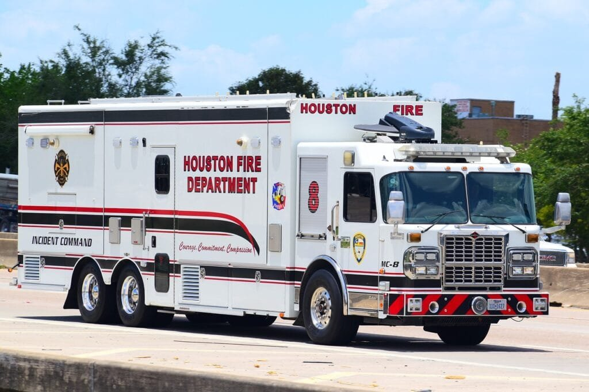

Imagine living in an area surrounded by majestic volcanoes, their beauty marvelously intertwined with the dangers they possess. In such a place, it becomes crucial to be prepared for any potential volcanic eruption. That is where volcano emergency drills come into play. These drills are essential for communities living near active volcanoes, as they help educate and equip individuals with the necessary skills and knowledge to respond effectively in the event of an eruption. From evacuation procedures to communication strategies, these drills ensure that when Mother Nature awakens, everyone knows what to do to stay safe. So, let's explore the importance of volcano emergency drills and why they are crucial in protecting lives and minimizing the impact of these mighty [natural phenomena](https://magmamatters.com/the-art-and-science-of-volcano-monitoring/ "The Art and Science of Volcano Monitoring").

This image is property of pixabay.com.

## Understanding Volcanic Hazards

Volcanic activity is a fascinating but potentially dangerous natural phenomenon. To comprehend the hazards associated with volcanoes, it is crucial to grasp the fundamentals of volcanic activity. Volcanoes form when molten rock, gases, and debris escape to the Earth's surface, resulting in eruptions of lava and ash. The occurrence of volcanoes is primarily concentrated along plate boundaries, hotspots beneath the Earth's crust, and rift zones where tectonic plates are diverging.

Volcanic hazards come in various forms, each posing unique risks to human communities. Pyroclastic flows, for instance, are fast-moving currents of hot gas and volcanic matter that can reach speeds of hundreds of kilometers per hour. These deadly flows can cause extensive destruction, incinerating everything in their path. Another significant hazard is ashfall, which occurs when fine particles of volcanic ash are released into the atmosphere and settle over vast areas. Ashfall can disrupt transport systems, contaminate water sources, and damage infrastructure.

Lahars, on the other hand, are rapidly flowing mixtures of water and volcanic debris, often triggered by heavy rainfall or the melting of snow and ice on the slopes of volcanoes. These powerful mudflows can travel long distances, burying everything in their wake and causing catastrophic damage to communities downstream.

The distribution and frequency of volcanic hazards vary across the globe. Volcanoes located in the "Ring of Fire," encircling the Pacific Ocean, are particularly active, making the surrounding regions more prone to volcanic eruptions. However, volcanic activity is not limited to this area alone. Volcanoes exist on every continent and have the potential to affect communities even in remote locations. Understanding the distribution and frequency of volcanic hazards is crucial for disaster preparedness and effective emergency response.

## Impact on Human Communities

Volcanic eruptions have direct and indirect impacts on human communities. Direct impacts refer to the immediate consequences that individuals and infrastructure experience during an eruption. These can include injuries, loss of life, property damage, and displacement. Indirect impacts, on the other hand, manifest over a more extended period and can dramatically affect the social, economic, and psychological aspects of a community.

Case studies of volcanic disasters highlight the devastating effects that eruptions can have on human populations. The eruption of Mount Vesuvius in 79 AD, for example, buried the Roman cities of Pompeii and Herculaneum under layers of volcanic ash and pyroclastic material. This catastrophic event resulted in the loss of thousands of lives and the destruction of thriving communities.

The long-term effects of volcanic eruptions on populations can be profound. Displacement and loss of infrastructure can lead to the migration of affected communities to other areas, resulting in cultural and demographic changes. The economic consequences can be severe, with disrupted industries, decreased tourism, and increased costs of reconstruction. The psychological impact of living in the shadow of an active volcano can also take a toll on the mental well-being of individuals and communities.

This image is property of pixabay.com.

## The Advantage of Preparedness

Preparation is key when it comes to mitigating the risks associated with volcanic eruptions. Volcano emergency drills play a crucial role in preparing communities for potential disasters. These drills simulate various scenarios and allow individuals and organizations to practice their response and evacuation procedures. By familiarizing themselves with the necessary actions to take in an emergency, people can be better equipped to protect themselves and their communities.

Statistics and case studies support the effectiveness of preparedness in reducing the impact of volcanic eruptions. Communities that have invested in comprehensive evacuation plans, early warning systems, and public education campaigns have shown better outcomes during eruptions. Prepared communities are more likely to evacuate quickly and efficiently, reducing the risk of injury and loss of life.

Comparing the consequences of prepared versus unprepared communities reveals the significant advantage that preparedness provides. Well-prepared communities are better able to mobilize emergency services, allocate resources effectively, and communicate critical information to the public. These factors contribute to quicker response times, more efficient evacuations, and reduced damage to infrastructure.

## Volcano Emergency Drills: An Overview

Volcano emergency drills are simulated exercises designed to test the preparedness and response capabilities of communities facing volcanic hazards. These drills are essential for ensuring that individuals, organizations, and authorities know what to do in the event of an eruption and can coordinate their efforts effectively.

The concept of volcano emergency drills revolves around the notion that practice makes perfect. By rehearsing emergency response procedures, communities can identify any weaknesses or gaps in their preparedness plans and make necessary adjustments. These drills also strengthen communication and coordination among various stakeholders, such as emergency services, local government, and community members.

Key components of volcano emergency drills include a combination of tabletop exercises and full-scale simulations. Tabletop exercises involve gathering key stakeholders in a room to discuss and simulate different scenarios and responses. This allows participants to discuss potential challenges, review evacuation routes, and establish lines of communication. Full-scale simulations, on the other hand, involve conducting a comprehensive drill that involves multiple organizations and emergency responders, incorporating realistic scenarios and time constraints.

Research has shown a positive correlation between emergency drills and survival rates. Communities that have regularly conducted volcano emergency drills are found to have higher levels of preparedness, leading to a more effective response during eruptions.

This image is property of pixabay.com.

## Designing a Volcano Emergency Drill

Designing a volcano emergency drill requires a systematic approach tailored to the specific risks faced by a community. The first step is to identify the potential hazards and vulnerabilities associated with volcanoes in the area. This information can be obtained through the analysis of geological data, historical eruption records, and input from experts in the field.

Interacting with professionals and agencies specializing in emergency management and disaster preparedness is crucial in the design phase. Their expertise can provide valuable insights on best practices, resources, and tools that can be integrated into the drill. Collaboration with local government agencies, emergency services, and community organizations ensures a holistic and comprehensive approach to drill design.

Vital elements that should be included in a volcano emergency drill are evacuation routes, safe zones, and communication protocols. Identifying the most accessible and efficient evacuation routes helps ensure the smooth flow of people away from danger zones. Safe zones should be established where people can gather for shelter and receive necessary assistance. Communication protocols, including alert systems and designated emergency contacts, are also crucial for disseminating critical information quickly and effectively.

## Implementation of Volcano Emergency Drills

The frequency of volcano emergency drills is an important factor in maintaining preparedness within communities. Regularly scheduled drills help ensure that individuals and organizations are continuously familiarizing themselves with emergency procedures and refining their response capabilities. The ideal frequency of drills may vary depending on local factors, but conducting them at least once a year is recommended.

Ensuring participation and community involvement is essential for the success of volcano emergency drills. Engaging and educating the public about the importance of drills and their role in protecting lives and property is crucial. Community outreach programs, public meetings, and educational campaigns can help raise awareness and encourage active participation.

Assessing the effectiveness of the drill is also a critical step. Conducting post-drill evaluations, gathering feedback from participants, and analyzing drill outcomes can help identify areas for improvement and inform future preparedness efforts. These evaluations should be conducted in collaboration with relevant stakeholders to ensure a comprehensive and objective assessment of the drill's effectiveness.

## Training and Education for Volcanic Emergencies

Widespread knowledge and education about volcanic risks and safety measures can significantly enhance community preparedness. Schools, community centers, and other institutions play a vital role in disseminating information and providing training on volcanic emergencies.

Incorporating volcanic risk education into school curricula helps ensure that future generations are equipped with the knowledge and skills needed to respond effectively during eruptions. The curriculum can cover topics such as volcano geography, eruption predictability, evacuation procedures, and the importance of early warning systems.

Community centers and other local institutions can also organize workshops, seminars, and training programs to educate residents about volcanic hazards and encourage preparedness. These initiatives can include practical demonstrations of emergency response procedures, learning sessions on communication technologies, and information on accessing resources during an eruption. By empowering individuals with the necessary knowledge, communities can become more resilient in the face of volcanic emergencies.

## Technology in Volcano Emergency Drills

The integration of advanced technologies is transforming the landscape of volcano emergency preparedness. Technology plays a crucial role in risk prediction, early warning systems, and communication during emergencies.

Advanced monitoring technologies, such as seismological sensors and remote sensing tools, enable scientists and authorities to detect subtle changes in volcanic activity that can indicate an impending eruption. This allows for timely warnings to be issued to at-risk communities, increasing the chances of an effective response and evacuation.

Communication technologies, including mobile apps, emergency alert systems, and social media platforms, play a significant role in volcano emergency drills. These technologies can disseminate vital information, such as evacuation orders and updates on volcanic activity, to a wide audience within seconds. By harnessing the power of communication technologies, communities can ensure that accurate and timely information reaches those in need, allowing for a more coordinated and efficient emergency response.

Future advancements in volcano monitoring and emergency preparedness are continuously being explored. Emerging technologies, such as artificial intelligence and machine learning, hold the potential to enhance the accuracy and efficiency of eruption prediction models. Increased collaboration between scientists, engineers, and technology developers will be crucial in harnessing the full potential of these advancements for volcano emergency drills.

## Collaborations and Partnerships for Effective Drills

Effective volcano emergency drills require collaboration and partnerships among local, national, and international organizations. No single entity can address the challenges of volcanic emergencies alone. Local government agencies, emergency services, nonprofit organizations, and research institutions must work together to pool resources, share expertise, and coordinate efforts.

Local organizations play a vital role in understanding the unique needs and challenges faced by their communities. They can provide valuable insights into community dynamics, cultural practices, and local resources that can influence the effectiveness of volcano emergency drills.

National and international organizations contribute to preparedness efforts by providing funding, training, and technical assistance. Their expertise in disaster management and access to specialized resources can significantly enhance the effectiveness of drills. Collaborations with these organizations help build capacity, ensure best practices are followed, and facilitate knowledge exchange among communities facing similar volcanic hazards.

Successful collaborations have been observed in various regions around the world. Examples include partnerships between government agencies, universities, and nonprofit organizations to develop comprehensive evacuation plans, establish early warning systems, and conduct regular volcano emergency drills. These collaborations demonstrate the power of collective action in enhancing community resilience and mitigating the impact of volcanic eruptions.

## Challenges in Volcano Emergency Drills and Ways to Overcome Them

Conducting volcano emergency drills is not without its challenges. Common obstacles include limited resources, community engagement, coordination among stakeholders, and the unpredictable nature of volcanic activity. However, with proactive measures and continuous monitoring, these challenges can be overcome.

To address limited resources, governments, organizations, and communities can seek funding opportunities, both domestically and internationally. Grant programs, public-private partnerships, and crowdfunding initiatives can provide the necessary financial support for drills. Prioritizing disaster preparedness in budgets and allocating sufficient resources for training and equipment can also help overcome resource constraints.

Community engagement is crucial for the success of volcano emergency drills. Building trust, fostering awareness, and encouraging active participation can be achieved through effective communication strategies. Educational campaigns, public meetings, and outreach programs can help bridge the gap between authorities and community members, ensuring that everyone understands the importance of drills and their role in protecting lives and property.

Coordination among stakeholders can be challenging, especially when multiple organizations and agencies are involved. Establishing clear lines of communication, designating key points of contact, and conducting regular coordination meetings can help streamline efforts and ensure effective collaboration. Regular sharing of information, lessons learned, and best practices among stakeholders can also enhance coordination and enable continuous improvement.

The unpredictable nature of volcanic activity poses a significant challenge in designing drills. Volcanoes can exhibit sudden changes in behavior, making it difficult to accurately simulate real-life scenarios. However, continuous monitoring and research can help improve our understanding of volcanic processes and inform the design of drills. Ongoing scientific studies and the integration of data from monitoring networks can provide valuable insights into eruption patterns and help refine simulation models.

In Conclusion,

Volcano emergency drills play an essential role in mitigating the risks associated with volcanic eruptions. By understanding the fundamentals of volcanic hazards, recognizing the impact on human communities, and embracing the advantage of preparedness, communities can enhance their resilience and minimize the damage caused by volcanic disasters. The design and implementation of volcano emergency drills, coupled with training and education initiatives, can empower individuals and organizations to respond effectively during emergencies. The integration of technology, collaborations among various stakeholders, and ongoing research efforts further contribute to improving the effectiveness of drills and overcoming the challenges associated with volcanic emergencies. With dedicated efforts and a proactive approach, communities can ensure the safety and well-being of their residents in the face of these powerful natural phenomena.

