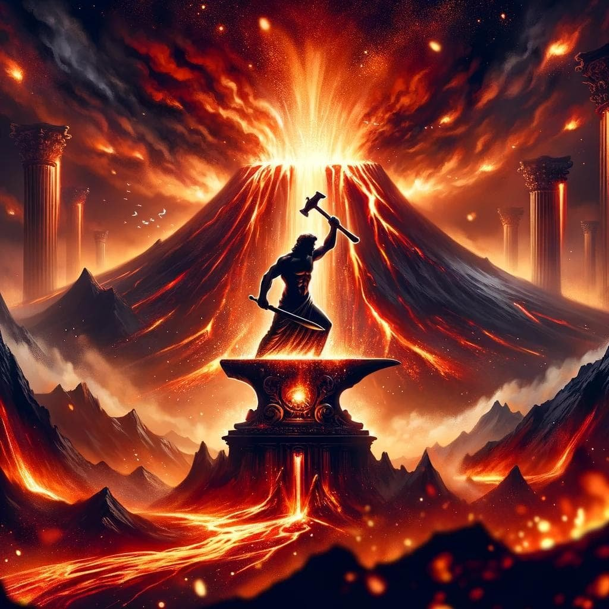
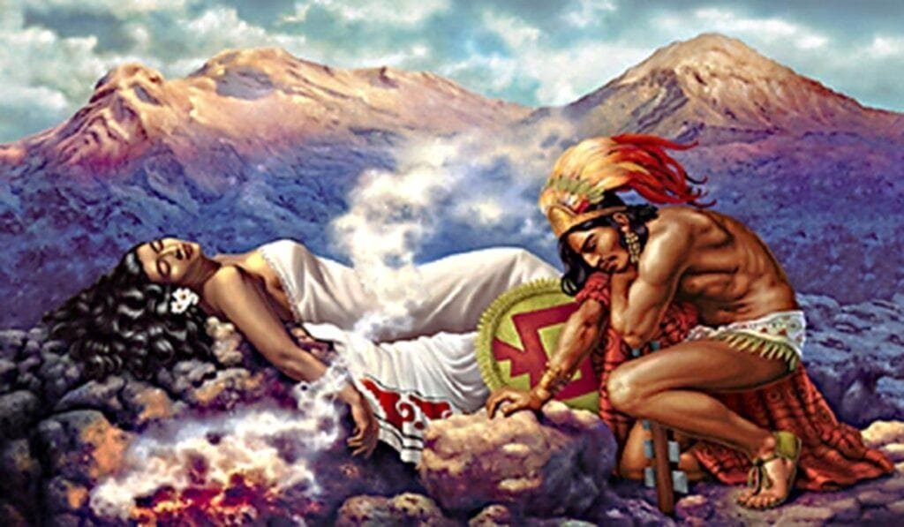

Imagine walking through the pages of ancient literature and discovering a world where volcanoes hold a mysterious and powerful presence. From tales of monstrous creatures dwelling deep within these fiery mountains to stories of gods and goddesses unleashing their wrath upon civilizations, volcano myths have shaped the narratives of ancient cultures. These captivating tales not only enriched the literature of the time but also held deeper meanings, reflecting the human fascination with the raw power and destructive beauty of volcanoes. In this article, we will explore the influence of volcano myths on ancient literature, delving into the intriguing connections between ancient civilizations and the fiery forces of nature. Get ready to embark on a journey that uncovers the hidden depths of these mesmerizing stories and their enduring impact.

This image is property of oldworldgods.com.

## Understanding Volcano Myths

### Basics of Volcano Myths

Volcano myths are ancient tales and legends that revolve around volcanoes and their mesmerizing power. These myths, passed down through generations, were an important part of various cultures and civilizations. They sought to explain the origins of volcanoes, their eruptions, and the powerful forces that lay beneath the Earth's surface.

### Common Elements in Volcano Myths

Although volcano myths vary across different cultures, they often share common elements. These include the belief that volcanoes were the creation of gods or divine beings, and that volcanic eruptions were a result of their anger or dissatisfaction. Volcano myths often center around a mythical creature or deity residing within the volcano, who controlled its eruptions and determined the fate of nearby communities.

### Origins and Evolution of Volcano Myths

The origins of volcano myths can be traced back to ancient times, where the awe-inspiring and terrifying nature of volcanic eruptions captivated the imagination of early humans. As civilizations developed, these myths evolved and became intertwined with cultural beliefs, folklore, and religious practices. The stories were passed down through oral traditions, and later, through ancient literature, such as epic poems and mythological texts.

## Influence on Greek Literature

### Representation of Volcanoes in Greek Myths

In Greek mythology, volcanoes were often personified as gods or mythical beings. One of the most prominent examples is Hephaestus, the god of fire, blacksmithing, and volcanoes. He was believed to forge his weapons and crafts in the heart of Mount Etna, a volcano in Sicily. The Greeks also associated volcanoes with their deities of creation and destruction, such as Hades and Zeus.

### Impact of Greek Volcano Myths on Greek Literature

Greek volcano myths had a significant impact on Greek literature. They served as metaphors for the uncontrollable and unpredictable forces of nature, as well as symbols of divine power and punishment. These myths inspired Greek poets and playwrights, who incorporated volcano imagery and themes into their works. The depiction of volcanic landscapes and their associated myths added depth and drama to Greek literary masterpieces.

### Notable Greek Texts featuring Volcano Myths

One of the most famous examples of Greek literature that features volcano myths is "The Aeneid" by Virgil. This epic poem tells the story of Aeneas, a Trojan hero, and his journey to establish the city of Rome. In the poem, the powerful and destructive forces of Mount Etna serve as a backdrop for Aeneas' adventures and symbolize the challenges he faces along the way. Another notable work is "The Bacchae" by Euripides, which explores the theme of divine wrath through the personification of volcanoes.

<iframe width="560" height="315" src="https://www.youtube.com/embed/VNGUdObDoLk" frameborder="0" allow="accelerometer; autoplay; encrypted-media; gyroscope; picture-in-picture" allowfullscreen></iframe>

  

## Influence on Roman Literature

### Volcanoes in Roman Myths

In Roman mythology, volcanoes played a significant role, just as in Greek mythology. The Romans associated volcanoes with Vulcan, their god of fire, blacksmithing, and craftsmanship. Vulcan was believed to have his forge beneath the fiery depths of Mount Vesuvius, a volcano near the ancient city of Pompeii. This association between volcanoes and their deities influenced Roman interpretations of volcanic activity.

### Reflections of Roman Volcano Myths in Roman Literature

Roman volcano myths influenced Roman literature by providing a source of inspiration and symbolism. Roman writers drew upon these myths to convey ideas of power, destruction, and transformation. The volcanic landscapes became settings for epic battles, tragic events, and divine interventions in Roman literary works. The inclusion of volcano myths added a sense of peril and grandeur to the narratives.

### Famous Roman Works with Volcano Myths

One of the most famous works of Roman literature that features volcano myths is "The Aeneid" by Virgil. This epic poem, heavily influenced by Greek mythology, explores the themes of destiny, divine intervention, and the founding of Rome. Mount Vesuvius, with its volcanic eruptions, is portrayed as a symbol of the unpredictable and destructive forces of nature. Other notable works that incorporate volcano myths include the poems of Ovid and the works of the Roman historian Pliny the Elder.

## Influence on Native American Literature

### Native American Volcano Myths

Native American cultures have their own rich traditions of volcano myths. These myths vary widely across different tribes and regions. For example, the Kilauea Volcano in Hawaii holds great significance for the Hawaiian people and is associated with the goddess Pele. In Native American cultures, volcano myths often explain the creation of the world, the origins of [natural phenomena](https://magmamatters.com/the-art-and-science-of-volcano-monitoring/ "The Art and Science of Volcano Monitoring"), and the relationship between humans and the natural world.

### Depictions of Volcano Myths in Native American Literature

Native American literature, which encompasses a vast range of oral and written traditions, reflects the cultural significance of volcano myths. These myths are often included in creation stories, moral tales, and tribal histories. Native American authors and storytellers draw upon these myths to preserve their cultural heritage and convey important messages about the interconnectedness of humans and nature.

### Prominent Native American Stories Harboring Volcano Myths

One example of a prominent Native American story featuring volcano myths is the Navajo creation story, which explains the origins of the Navajo people and their relationship with the land. This myth includes the depiction of Shiprock, a volcanic rock formation in present-day New Mexico, as a divine landmark. Other tribes, such as the Pueblo and the Hopi, also have their own volcano myths that are integral to their cultural traditions.

This image is property of www.ancient-origins.net.

## Influence on Polynesian Literature

### Volcano Myths in Polynesian Cultures

Volcano myths hold a significant place in Polynesian cultures. Various Polynesian islands, such as Hawaii, Samoa, and Fiji, are home to active volcanoes that have shaped the landscape and influenced the mythology of these regions. In Polynesian cultures, volcano myths explain the creation of islands, the power of the gods, and the connection between humans and the divine.

### Effect of Polynesian Volcano Myths on Polynesian Literature

Polynesian literature, which encompasses oral narratives, chants, and songs, often incorporates volcano myths to highlight the cultural significance and reverence for volcanoes. These myths are interwoven into traditional storytelling practices and serve as a way to pass down ancestral knowledge. Polynesian authors and poets continue to draw inspiration from these [volcano myths](https://magmamatters.com/geothermal-energy-and-its-volcanic-origins/ "Geothermal Energy and Its Volcanic Origins") to preserve their cultural heritage and raise awareness about environmental issues.

### Noteworthy Polynesian Narratives Centered around Volcano Myths

One example of a noteworthy Polynesian narrative featuring volcano myths is the legend of Pele, the Hawaiian volcano goddess. The story of Pele's journey across the Pacific, her battles with her siblings, and her eventual residence in Hawaii is a central part of Hawaiian literature and folklore. Other Polynesian cultures, such as the Maori of New Zealand, also have volcano myths that are celebrated in their oral traditions and artistic expressions.

## Influence on Japanese Literature

### Volcano Myths in Japanese Folklore

Japanese folklore is replete with volcano myths that reflect the country's volcanic landscapes and geothermal activity. Mount Fuji, the iconic volcano in Japan, holds great cultural and spiritual significance. In Japanese folklore, volcanoes are often personified as deities or powerful spirits, and they play a vital role in explaining volcanic eruptions and their impact on society.

### Impact of Japanese Volcano Myths on Japanese Literature

Volcano myths have had a profound influence on Japanese literature, particularly in poetry and drama. The awe-inspiring beauty and power of volcanoes are often depicted in haiku and tanka poetry, capturing the transient nature of life and the immense forces of nature. Japanese playwrights and authors have also incorporated volcano myths into their works, exploring themes of fate, impermanence, and the interconnectedness of humans and the natural world.

### Significant Japanese Writings Influenced by Volcano Myths

One of the most famous examples of Japanese literature featuring volcano myths is "The Tale of the Bamboo Cutter," an ancient folktale. This tale, woven with supernatural elements, explores the story of a princess who emerges from a bamboo plant and eventually ascends to the moon. Mount Fuji is symbolically depicted as a gateway to the celestial realm. Japanese literature, from ancient poetry to contemporary novels, continues to draw inspiration from volcano myths, capturing the spirit of Japanese culture and its deep-rooted connection to the natural world.

This image is property of www.ancient-origins.net.

## Influence on Indian Literature

### Volcano Myths in Indian Epics

Indian mythology and epics, such as the Ramayana and the Mahabharata, encompass a vast range of narratives that include volcano myths. In Indian culture, volcanoes are often associated with gods and goddesses, who are believed to reside within the fiery depths. These myths explain the origins of volcanoes, their eruptions, and the consequences of disturbing the divine forces that govern them.

### Influence of Indian Volcano Myths on Indian Literature

Indian literature, from ancient texts to modern works, has been influenced by volcano myths. These myths form an integral part of Indian storytelling traditions, reflecting the cultural beliefs and worldview of the Indian people. Indian authors and poets have woven volcano myths into their works, exploring themes of morality, divine intervention, and the delicate balance between humans and the natural world.

### Important Indian Literature Inspired by Volcano Myths

