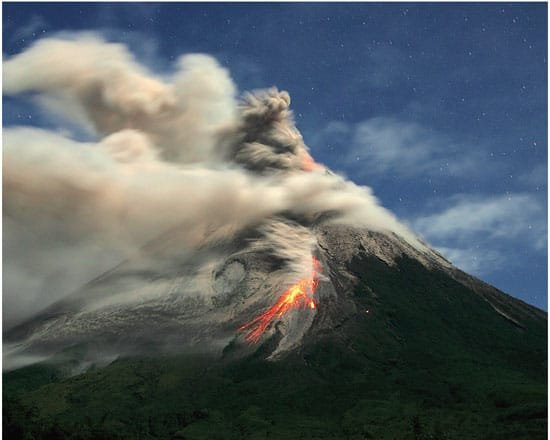
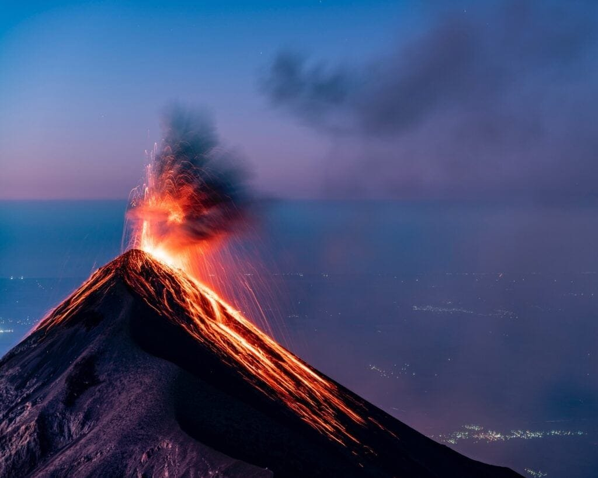
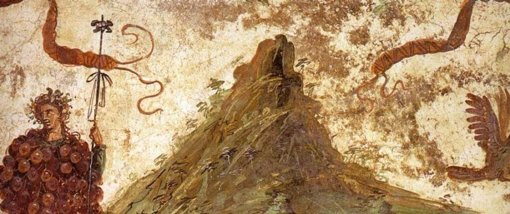
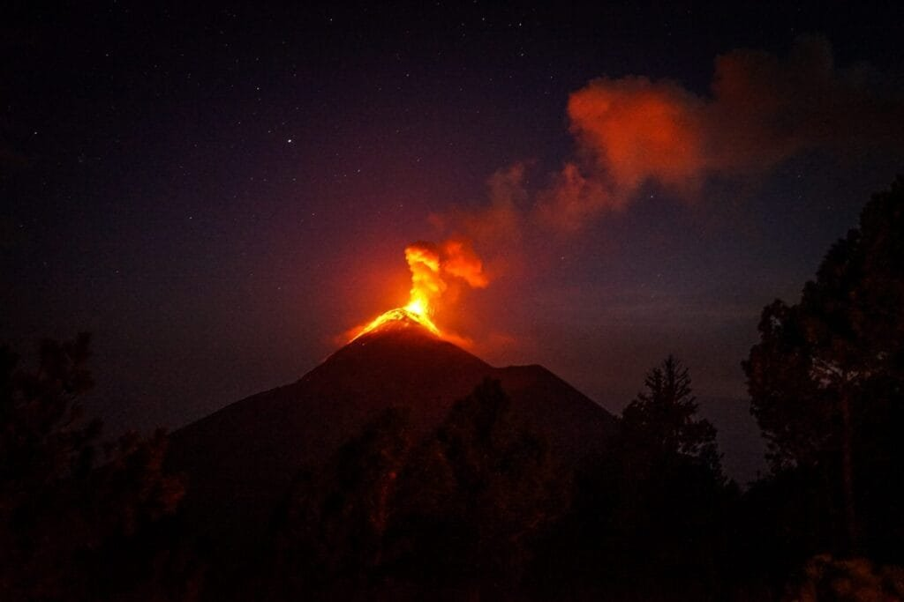

Did you know that volcanoes have had a significant influence on various cultures throughout history? Volcanoes, with their powerful eruptions and awe-inspiring displays of nature's force, have been the source of myths, legends, and beliefs in many societies. These myths not only provide insights into how ancient civilizations perceived volcanoes but also reflect their fears, hopes, and reverence for these natural wonders. From the fiery wrath of the Hawaiian goddess Pele to the creation stories of the Aztecs and the Romans, volcano myths have shaped the cultural fabric of different societies, leaving an indelible mark on their traditions and beliefs. In this article, we will explore the intriguing ways in which volcano myths have influenced various cultures around the world.

This image is property of www.americanscientist.org.

## Understanding Volcano Myths

Volcano myths are stories and legends that have been passed down through generations in different cultures around the world. These myths often revolve around the powerful and unpredictable nature of volcanoes, depicting them as supernatural forces capable of shaping the world and impacting human lives. While volcano myths may vary across different cultures, they share common elements and themes that reflect humanity's fascination with these natural wonders.

### Defining a Volcano Myth

A volcano myth is a narrative that explains the origin and behavior of volcanoes, as well as their significance in the cultural, spiritual, and natural realms. These myths typically incorporate mystical beings, gods, or spirits, and often seek to understand the forces behind volcanic eruptions and their effects on the surrounding environment. Volcano myths are often deeply rooted in the oral traditions of indigenous cultures, passed down from one generation to another, serving as a way to preserve ancient knowledge and beliefs.

### Significance of Volcano Myths

Volcano myths hold immense cultural and historical significance for the communities that cherish them. They serve as a repository of collective wisdom and are highly valued for their ability to transmit cultural heritage. These myths offer insights into the ways ancient civilizations perceived and interacted with their natural surroundings. By understanding the myths, we can gain a deeper appreciation for the spiritual and emotional connections that these cultures had with the volcanoes in their midst.

### Common Elements in Volcano Myths

While volcano myths differ across cultures, there are several recurring elements that reflect the universal human experiences and perceptions of volcanic phenomena. One common motif is the depiction of volcanoes as the dwelling places of gods or spirits, imbuing them with a sense of divinity or otherworldliness. These myths often explore the themes of creation, destruction, and renewal, as volcanic eruptions can both devastate and rejuvenate the landscape. Additionally, many volcano myths feature heroes or heroines who confront the volcanic forces, embodying the human struggle to understand and find meaning in the face of natural disasters.

## Native American Volcano Myths

Native American [cultures have a rich tapestry of volcano myths](https://magmamatters.com/geothermal-energy-and-its-volcanic-origins/ "Geothermal Energy and Its Volcanic Origins") that reflect the spiritual and cultural significance of these geological features. These myths often reveal the deep connection between indigenous peoples and the natural world, as well as their respect for the power of volcanoes.

### Impact of Volcano Myths on Traditional Beliefs

In Native American cultures, volcano myths were integral to traditional beliefs and religious practices. These myths helped explain the origins and purpose of volcanoes, and were woven into the larger cosmologies of these cultures. They provided a framework through which indigenous peoples understood and interacted with the natural world, shaping their spiritual relationships with the land.

### Influence on Cultural Practices and Rituals

The volcano myths of Native American cultures influenced various cultural practices and rituals. For example, some tribes would hold ceremonies and make offerings to the volcanoes, seeking protection and blessings from the gods or spirits associated with them. Other tribes would incorporate volcano imagery and symbolism into their artwork, clothing, and pottery, paying homage to the volcanic forces that shaped their landscapes and lives.

### Specific Myths and Their Implications

Among the Native American volcano myths, one of the most well-known is the story of the eruption of Mount Mazama, which created Crater Lake in Oregon. According to the Klamath tribe, this eruption was the result of a battle between the powerful god Llao and the hero-god Skell. The myth paints a vivid picture of the immense power and significance of volcanic eruptions in Native American culture, with the formation of Crater Lake being seen as a sacred site of spiritual importance.

<iframe width="560" height="315" src="https://www.youtube.com/embed/4FxFmcm4a08" frameborder="0" allow="accelerometer; autoplay; encrypted-media; gyroscope; picture-in-picture" allowfullscreen></iframe>

  

## Greek and Roman Volcano Myths

In ancient Greek and Roman mythology, volcanoes held a prominent place, being intimately linked to the gods and their actions. These myths played a crucial role in shaping the cultural and philosophical perspectives of these civilizations.

### Connection to the Gods

In Greek and Roman mythology, volcanoes were associated with gods such as Hephaestus/Vulcan, the blacksmith of the gods and the deity of fire and craftsmanship. According to the myths, Hephaestus and Vulcan had their forges and workshops located beneath a volcano, where they produced the weapons and tools of the gods. This connection between volcanoes and divine craftsmanship highlights the importance of fire and volcanic activity in the creation and order of the world.

### Destruction and Renewal Themes

Volcanoes played a significant role in Greek and Roman mythology as symbols of destruction and renewal. The eruption of a volcano was seen as a metaphorical representation of the cycle of life and death. The destructive power of volcanic eruptions was believed to be necessary for the rebirth and rejuvenation of the natural world, as new land would be formed from the volcanic debris and fertile soil.

### Influence on Classic Literature and Philosophy

Greek and Roman volcano myths, such as the story of the eruption of Mount Etna, have had a profound impact on classic literature and philosophy. These myths were often referenced by ancient writers and philosophers to illustrate concepts such as the power of nature, the role of the gods, and the fleeting nature of human existence. Additionally, volcanic imagery and metaphors permeate ancient texts, adding depth and symbolism to the narratives.

## Polynesian Volcano Myths

The Polynesian cultures of Hawaii and other Pacific islands have a rich tradition of volcano myths, with the goddess Pele taking center stage in many of these stories. These myths have played a central role in shaping the cultural practices and environmental understanding of the Polynesian peoples.

### The Legends of Pele

Pele is the Hawaiian goddess of volcanoes, fire, and lightning, and is a central figure in Polynesian volcano myths. According to the legends, Pele is a fiery and unpredictable goddess, capable of both destruction and creation. She is believed to reside in the Halema'uma'u Crater of the Kilauea volcano in Hawaii and is revered as a powerful and respected deity by the Polynesian people.

### Effects on Hawaiian Culture and Practices

The volcano myths surrounding Pele have had a profound impact on Hawaiian culture and practices. The Polynesian people hold deep reverence for Pele and consider her to be a guardian deity of the land. This reverence is reflected in various cultural practices, such as conducting ceremonies and offerings to honor and appease Pele, as well as seeking her protection during volcanic eruptions.

### Impact on Environmental Understanding

Polynesian volcano myths, particularly those involving Pele, have contributed to the Polynesian peoples' understanding of the natural environment. These myths serve as cautionary tales, reminding people of the power and volatility of volcanoes. Through storytelling and mythology, the Polynesians have passed down valuable knowledge about volcanic phenomena, such as identifying signs of an impending eruption or understanding the importance of volcanic soil for agriculture.

This image is property of tropicanahostel.com.

## Japanese Volcano Myths

In Japanese folklore and mythology, volcanoes are deeply intertwined with Shinto beliefs and play a significant role in shaping the cultural and spiritual landscape of Japan. These volcano myths have influenced various aspects of Japanese arts, aesthetics, and community resilience.

### Links to Shinto Beliefs

Shinto, the indigenous religion of Japan, places great importance on the concept of kami, which can be translated as gods or spirits. Mount Fuji, the most famous volcano in Japan, is believed to be the dwelling place of a kami. This association between volcanoes and kami highlights the reverence and spiritual significance given to volcanoes in Japanese culture.

### Impact on Arts and Aesthetics

Japanese volcano myths have had a profound influence on the arts and aesthetics of the country. Mount Fuji, in particular, has been depicted in numerous artworks, from ancient woodblock prints to contemporary paintings. The symmetrical beauty and majestic presence of volcanoes have been celebrated in Japanese art, reflecting the cultural appreciation for the natural wonders of the volcanic landscape.

### Influence on Community Resilience

Volcano myths in Japan have also played a role in fostering community resilience in the face of volcanic hazards. Many Japanese communities located near active volcanoes have developed emergency plans and evacuation procedures that are deeply influenced by local volcano myths. These myths serve as cautionary tales and reminders of the potential dangers associated with volcanic activity, prompting communities to be prepared and vigilant.

## African Volcano Myths

Volcano myths in Africa are diverse and reflect the continent's rich tapestry of cultures and traditions. These myths often explore themes of life, death, and rebirth, and hold great significance in tribal customs, storytelling, and folklore.

### Themes of Life, Death, and Rebirth

African volcano myths often incorporate themes of life, death, and rebirth, mirroring the cycle of nature and the human experience. These myths often portray volcanoes as gateways between the earthly realm and the spirit world, where the souls of the deceased embark on their journey to the afterlife. The fiery eruptions and the subsequent formation of new land are seen as symbolic representations of the eternal cycle of life and death.

### Impact on Tribal Customs and Rules

Volcano myths have played an influential role in shaping tribal customs and rules in various African cultures. These myths are often deeply interwoven with rituals and ceremonies, providing a spiritual foundation for important life events such as birth, initiation rites, and funerals. The volcano myths guide the behavior and actions of individuals within the tribe, fostering a sense of communal identity and reinforcing the cultural values upheld by the community.

### Role in Folklore and Storytelling

African volcano myths have found their place in the rich tapestry of African folklore and storytelling traditions. These myths are often passed down orally from one generation to the next, serving as a means of preserving cultural heritage and teachings. Through captivating narratives and enchanting characters, volcano myths provide moral lessons, cultural insights, and entertainment, fostering a deeper connection to the ancestral wisdom and the spirit of Africa.

This image is property of orion-uploads.openroadmedia.com.

## Mesoamerican Volcano Myths

The ancient civilizations of Mesoamerica, such as the Aztecs and Mayans, had a profound spiritual and cultural connection to volcanoes. Volcanoes were seen as the abode of gods and spirits, shaping the religious practices, architecture, and ceremonies of these civilizations.

### Association with Gods and Spirits

Volcanoes held deep religious significance in Mesoamerican cultures, with each volcano believed to be the dwelling place of a particular deity. For example, the Aztecs revered the volcano Popocatépetl as the home of the god of war, and the volcano Iztaccíhuatl as a representation of a sleeping princess. These volcano myths helped define the relationship between humans, gods, and the natural world.

### Influence on Architecture and Ceremonies

Mesoamerican volcano myths influenced the architecture and ceremonial practices of ancient civilizations. Temples and pyramids were often built at the foothills or on the slopes of volcanoes, serving as sacred sites for religious rituals and ceremonies. The design and orientation of these structures were often influenced by the volcano myths and their association with specific gods and spirits.

### Historical Context and Reinterpretation

The volcano myths of Mesoamerica provide valuable insights into the history and cultural practices of ancient civilizations. These myths often depict significant historical events, such as volcanic eruptions and their impact on human settlements. By examining and interpreting these myths, researchers can gain a deeper understanding of the social, political, and environmental dynamics of Mesoamerican societies.

## Icelandic Volcano Myths

In the land of fire and ice, Iceland, volcano myths have shaped the cultural and societal values of the Icelandic people. These myths often feature tales of fire and frost giants, embodying the contrasting forces of destruction and creation that are intrinsic to the volcanic landscape.

### Tales of Fire and Frost Giants

Icelandic volcano myths often feature epic tales of fire and frost giants locked in eternal conflict. These myths reflect the constant battle between the heat of volcanic eruptions and the icy landscapes that surround them. The giants represent the wild and untamed forces of nature, while the Icelandic people, who live in close proximity to these volatile volcanoes, stand as resilient and resourceful heroes.

### Effect on Nordic Lore and Sagas

Volcano myths have had a profound influence on Nordic lore and sagas, which form an integral part of Icelandic cultural identity. These myths have been woven into the rich tapestry of Icelandic storytelling, shaping the narratives and themes of sagas that recount the heroic exploits of legendary figures. Volcanoes serve as dramatic backdrops and catalysts for these tales, adding depth and symbolism to the sagas.

### Implications for Societal Values and Ethics

Volcano myths have played a significant role in shaping Icelandic societal values and ethics. The Icelandic people have developed a deep respect and understanding of the powerful volcanic forces that surround them. These myths have instilled a sense of resilience, adaptability, and environmental stewardship in the Icelandic cultural fabric, creating a society that is grounded in an appreciation for the natural world and its potential for both beauty and destruction.

This image is property of tropicanahostel.com.

## Volcano Myths and Modern Culture

Volcano myths continue to leave their mark on modern culture, permeating various forms of literature, media, and education. These myths provide inspiration, metaphor, and a perspective that connects us to the ancient wisdom and enduring power of volcanoes.

### Reflection in Contemporary Literature and Media

Volcano myths have found new life in contemporary literature and media, serving as a source of inspiration for authors, filmmakers, and artists. These myths are often reimagined and reinterpreted, offering fresh perspectives on the enduring themes of creation, destruction, and transformation. From novels to movies, volcano myths continue to capture the imagination of people around the world, bridging the gap between ancient folklore and modern storytelling.

### Application in Science Education

[Volcano myths have proven to be invaluable tools in science](https://magmamatters.com/the-art-and-science-of-volcano-monitoring/ "The Art and Science of Volcano Monitoring") education, offering engaging and relatable stories that help students understand the complex geological processes behind volcanic eruptions. By contextualizing scientific concepts within the framework of volcano myths, educators can spark curiosity and foster a deeper appreciation for the natural world. Students can explore the cultural and historical context of these myths while simultaneously gaining a deeper understanding of the scientific principles at work.

### Cultural Tourism and Location Identity

Volcano myths have also become an important aspect of cultural tourism and location identity. Many volcanic regions around the world capitalize on their rich mythologies to attract tourists seeking a deeper understanding of the cultural, historical, and natural significance of the location. Volcano myths serve as a gateway into the cultural landscape, providing visitors with a sense of connection and appreciation for the communities that have shaped the land in the shadow of these majestic geological wonders.

## Preservation of Volcano Myths

Preserving volcano myths is crucial for the preservation of cultural heritage, diversity, and the understanding of our shared human experiences. Folklore studies and anthropology play a vital role in documenting and interpreting these myths, while also presenting challenges and methodologies for their preservation.

### Role of Folklore Studies and Anthropology

Folklore studies and anthropology play a vital role in the preservation of volcano myths. These disciplines help document and analyze myths, providing insights into the cultural, historical, and spiritual significance of these narratives. Researchers work closely with indigenous communities to ensure that their myths are respectfully recorded, shared, and celebrated, preserving a crucial part of their cultural heritage.

### Importance for Cultural Heritage and Diversity

Preserving volcano myths is essential for the conservation of cultural heritage and diversity. These myths are unique expressions of human creativity and spirituality, representing the beliefs, values, and experiences of different cultures. By safeguarding volcano myths, we ensure that future generations can learn from and appreciate the rich tapestry of global cultural traditions, fostering respect, tolerance, and understanding.

### Challenges and Methodologies of Preserving Oral Traditions

Preserving oral traditions, including volcano myths, poses specific challenges due to their reliance on spoken words rather than written texts. Ensuring the accurate transmission and interpretation of these myths requires close collaboration and trust between researchers and indigenous communities. Efforts to preserve oral traditions may involve recording and archiving oral performances, conducting interviews with storytellers, and involving community members in the documentation and revitalization of their myths.

In conclusion, volcano myths have played a significant role in shaping various cultures around the world. From Native American traditions to Greek and Roman mythology, these myths reflect our fascination with the power and unpredictability of volcanoes. They provide insights into ancient beliefs, cultural practices, and environmental understanding. Volcano myths continue to leave their mark on modern culture, inspiring literature, media, and science education. Preserving these myths is crucial for the conservation of cultural heritage and diversity, highlighting the importance of folklore studies and anthropology in safeguarding the rich tapestry of our shared human experiences.

