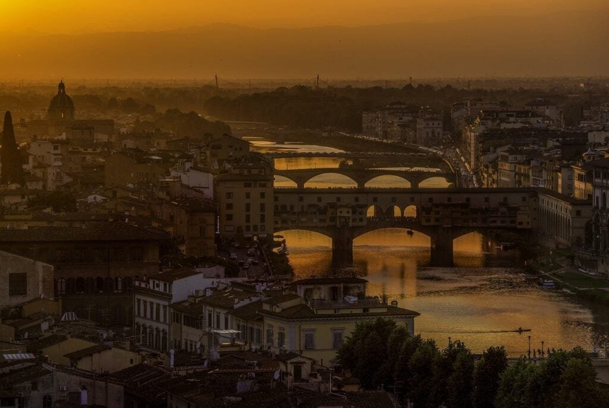
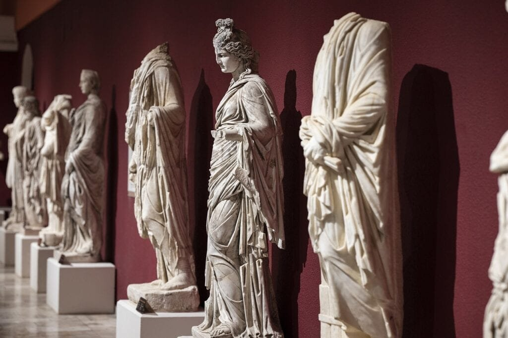

In the realm of Renaissance art, there is a fascinating connection between artistic expression and the powerful forces of nature - volcanoes, to be precise. The presence of volcanoes in this period's artwork provides a captivating glimpse into the lives of the artists grappling with the beauty and peril of these natural wonders. From fiery eruptions to serene landscapes, the depictions of volcanoes in Renaissance art offer a unique perspective on the intersection of human creativity and the awe-inspiring forces of the Earth. This article will explore three of the best examples of volcanoes in Renaissance art, shedding light on the profound influence these geological phenomena had on the artistic imagination. Get ready to be transported into a world where molten rock and brushstrokes intertwine to create masterpieces that have stood the test of time.

This image is property of pixabay.com.

## Historical Background of Volcanoes and Renaissance Art

During the Renaissance period, which spanned from the 14th to the 17th century, there was a revival of art, culture, and learning after the Dark Ages. This era saw significant advancements in various fields, including science, philosophy, and art. Volcanoes, which have been a natural phenomenon for millions of years, also played a notable role during this period.

### Volcanoes in the Renaissance period

In the Renaissance period, volcanoes held a certain fascination among artists and scholars. Explorers and voyagers brought back tales of volcanic eruptions from their journeys, capturing the imagination of people during this time. These awe-inspiring geological events sparked curiosity and inspired artists to depict them in their works.

### The European Renaissance era

The Renaissance era was characterized by a renewed interest in humanism, exploration, and the arts. It originated in Italy but quickly spread throughout Europe. This cultural movement emphasized a shift from religious to more secular and human-centered perspectives. Artists during this period sought inspiration from nature, mythology, and the natural world.

### Significance of volcanoes in Renaissance thought

Volcanoes held significant symbolic and metaphorical meaning in Renaissance thought. They were seen as powerful natural forces that could both create and destroy. Volcanic eruptions were considered as manifestations of divine power or punishment.

## Depictions of Volcanoes in Renaissance Paintings

### Symbolism of volcanoes in paintings

In Renaissance paintings, volcanoes often symbolized the power of nature and acted as metaphors for human emotions and the unpredictability of life. The eruptive nature of volcanoes was associated with passion, chaos, and transformation. Artists used this symbolism to convey not only the destructive force of nature but also the potential for rebirth and renewal.

### Famous Renaissance paintings featuring volcanoes

One of the most famous paintings featuring a volcano is "The Last Judgment" by Michelangelo, located on the altar wall of the Sistine Chapel in Vatican City. The depiction of Hell in this painting features a volcanic landscape, with fire and smoke emanating from the depths. This representation of a volcanic landscape added a visceral element to the portrayal of damnation.

### Interpretations of volcanic eruptions in the art

Volcanic eruptions were often depicted in Renaissance art as a backdrop for biblical scenes or historical events. Artists used the drama and intensity of volcanic eruptions to heighten the emotional impact of their works. The erupting volcano served as a representation of divine intervention or a metaphor for the upheaval and turmoil happening within the depicted scene.

<iframe width="560" height="315" src="https://www.youtube.com/embed/O_osRH4GJSI" frameborder="0" allow="accelerometer; autoplay; encrypted-media; gyroscope; picture-in-picture" allowfullscreen></iframe>

  

## Iconography and Symbolism of Volcanoes in Renaissance Art

### Beliefs and superstitions around volcanoes

During the Renaissance period, there were various beliefs and superstitions surrounding volcanoes. Some saw volcanic eruptions as signs of imminent doom or divine punishment. Others believed that volcanoes were gateways to the underworld or entrances to Hell. These beliefs influenced the way [volcanoes were depicted in art](https://magmamatters.com/geothermal-energy-and-its-volcanic-origins/ "Geothermal Energy and Its Volcanic Origins"), imbuing them with a sense of terror and awe.

### Symbolic meanings of volcanoes in art

In Renaissance art, volcanoes were often depicted as symbols of power, destruction, and the uncontrollable forces of nature. They represented the duality of creation and destruction, reminding viewers of the fleeting nature of life. The depiction of volcanoes in art allowed artists to explore the complex relationship between humans and the natural world.

### Iconographic elements related to volcanoes

In addition to the volcano itself, various iconographic elements were associated with volcanoes in Renaissance art. These included smoke, fire, rocks, and crumbling structures. These elements were used to create a sense of chaos, danger, and impending doom. The inclusion of these iconographic elements helped convey the intensity and scale of volcanic eruptions.

## Volcanoes and the Landscape Genre in Renaissance Art

### Influence of volcanoes on the birth of landscape painting

The depiction of volcanoes played a significant role in the development of the landscape genre in Renaissance art. Artists were drawn to the unique and dramatic landscapes created by volcanic eruptions, inspiring them to create detailed and realistic landscapes in their works. The study of volcanoes and their impact on the land played a crucial role in the representation of nature in Renaissance art.

### Role of volcanoes in constructing visual narratives

Volcanoes often served as focal points or backdrops for landscape paintings, allowing artists to construct visual narratives that captured the grandeur and power of nature. The inclusion of volcanoes added depth and drama to landscape compositions, creating a sense of awe and wonder in the viewer. Volcanic landscapes provided artists with an opportunity to explore different techniques and perspectives in their works.

### Examples of landscape paintings with volcanoes

One iconic example of a landscape painting featuring a volcano is "View of Naples with Mount Vesuvius" by Jacob Philipp Hackert. This painting showcases the picturesque landscape of Naples with the imposing presence of Mount Vesuvius in the background. The inclusion of the volcano enhances the overall composition and adds a sense of drama and dynamism to the scene.

This image is property of pixabay.com.

## Influence of Volcanic Eruptions on the Color Palette of Renaissance Artists

### Impact of volcano's ash on the artist's color choices

Volcanic eruptions often result in the release of ash particles into the atmosphere. These tiny ash particles can have a significant impact on the color palette used by Renaissance artists. The presence of volcanic ash in the atmosphere can create a diffused sunlight effect, resulting in a muted or hazy appearance in paintings. Artists incorporated these atmospheric effects into their works, using softer and more muted colors to capture the ethereal quality of volcanic landscapes.

### The artistic depiction of 'volcanic skies'

The dramatic skies created by volcanic eruptions were a captivating subject for Renaissance artists. The deep reds, oranges, and purples of a volcanic sunset provided a striking backdrop for their paintings. Artists skillfully captured the vibrant colors and dynamic cloud formations in their works, creating a sense of awe and wonder in the viewer.

### Fascination with the contrasting light in volcanic eruptions

The contrast between light and shadow is a fundamental element in art. Volcanic eruptions brought forth a unique interplay of light and darkness, as the fiery glow and billowing smoke contrasted with the surrounding landscape. Renaissance artists were captivated by this contrast and skillfully represented it in their paintings, creating a sense of drama, depth, and movement.

## The Role of Volcanoes in Religious Narratives in Renaissance Art

### Depiction of biblical scenes with volcanoes

Volcanoes were frequently used as a backdrop for depicting biblical scenes in Renaissance art. The presence of a volcano added a heightened sense of divine power and intervention. It conveyed the magnitude and significance of the events taking place, emphasizing the spiritual and eternal nature of the depicted narratives.

### Volcanoes as symbols of divine wrath and punishment

In religious narratives, volcanoes were often seen as symbols of divine wrath and punishment. The destructive force of a volcanic eruption was believed to be a consequence of human transgressions or divine judgment. Artists used the iconography of volcanoes to convey the consequences of sinful behavior or to emphasize the power and authority of God.

### Role of volcanoes in portraying Hell and the Apocalypse

Hell and the Apocalypse were recurring themes in Renaissance art, often depicted with scenes of chaos and destruction. Volcanoes were frequently used to portray these infernal landscapes, symbolizing the wrath of God and the torment of sinners. The portrayal of volcanic landscapes added a visceral element to the depiction of damnation and everlasting punishment.

This image is property of pixabay.com.

## Scientific Approach: Depicting Volcanoes in Renaissance Art

### Influence of Renaissance scientific discoveries on depicting volcanoes

The Renaissance period was a time of great scientific discovery and exploration. Scholars and artists during this time sought to understand the natural world through empirical observation and scientific inquiry. The study of volcanoes and their behavior influenced the way artists depicted them in their works, incorporating scientific knowledge into their artistic representations.

### Conflicts between the religious and scientific views of volcanoes

As scientific understanding of volcanoes grew during the Renaissance, conflicts arose between religious and scientific perspectives. The religious interpretation of volcanic eruptions as divine punishment clashed with the emerging scientific understanding of the geological processes behind these events. Artists often found themselves navigating this conflict, attempting to reconcile the spiritual meanings with scientific observations.

### Evidence of early scientific understanding of volcanoes in art

Despite the conflicts between religious and scientific views, some Renaissance artists incorporated early scientific understanding of volcanoes into their works. Detailed and accurate depictions of volcanic landscapes and geological features can be seen in paintings from this period. Artists used their observational skills to depict the physical characteristics of volcanoes, showcasing their growing knowledge of these natural phenomena.

## Influence of Volcanoes on Renaissance Sculpture and Architecture

### Use of volcanic stone in Renaissance buildings

Volcanic stone, such as basalt and pumice, was widely used in Renaissance architecture. The durability and unique properties of volcanic stone made it a preferred material for building structures. Its ability to withstand high temperatures and pressure made it suitable for creating decorative elements, facades, and sculptures in architectural designs.

### Sculptures illustrating volcanic phenomena

In addition to using volcanic stone in construction, Renaissance sculptors also created sculptures that depicted volcanic phenomena. These sculptures showcased the dynamic and fluid nature of volcanic eruptions, capturing their power and movement in stone. These sculptural representations became popular decorative elements in both religious and secular buildings.

### Impact of volcanic eruptions on architectural designs

Volcanic eruptions, while devastating, also had an impact on architectural designs during the Renaissance. The destruction caused by these natural events led to the development of architectural techniques and designs that could withstand [seismic activity](https://magmamatters.com/the-art-and-science-of-volcano-monitoring/ "The Art and Science of Volcano Monitoring"). Architects incorporated features such as buttresses and domes to better distribute the weight and forces exerted by volcanic eruptions and earthquakes.

## The legacy of Volcano Depictions in Post-Renaissance Art

### Influence of Renaissance volcano depictions on later artistic periods

The depictions of volcanoes in Renaissance art had a profound influence on later artistic periods. The dramatic landscapes, symbolism, and narrative potential of volcanoes continued to captivate artists throughout history. Artists in subsequent periods drew inspiration from the Renaissance masterpieces, incorporating volcanic motifs into their own works.

### Evolution of volcano symbolism in art

Over time, the symbolism associated with volcanoes in art evolved. While the Renaissance period emphasized the power and destructive nature of volcanoes, later periods began to focus on the beauty and awe-inspiring aspects of volcanic landscapes. Volcanoes became symbols of both destruction and creation, reflecting shifting cultural and artistic perspectives.

### Continued use of volcanic iconography in modern art

Even in modern art, volcanic iconography continues to be used as a metaphor for various concepts and emotions. Artists explore themes of transformation, power, and the cycle of life through depictions of volcanoes. The enduring popularity of volcanic imagery is a testament to the lasting impact of Renaissance art and the ongoing fascination with the raw power of nature.

## Conclusion: Volcanoes as a Multifaceted Theme in Renaissance Art

In conclusion, volcanoes played a multifaceted role in Renaissance art. They served as symbols of power, destruction, and the divine. Volcanic landscapes inspired the birth of the landscape genre and provided artists with opportunities to explore the interplay of light and shadow. The depiction of volcanic eruptions in religious narratives added a sense of drama and conveyed spiritual messages. The influence of volcanoes extended beyond paintings to sculpture and architecture, shaping artistic techniques and architectural designs. The legacy of volcano depictions in Renaissance art can still be seen in later artistic periods and continues to inspire artists today. The fascination with the raw power and beauty of volcanoes continues to captivate and intrigue audiences, making them an enduring theme in art.

