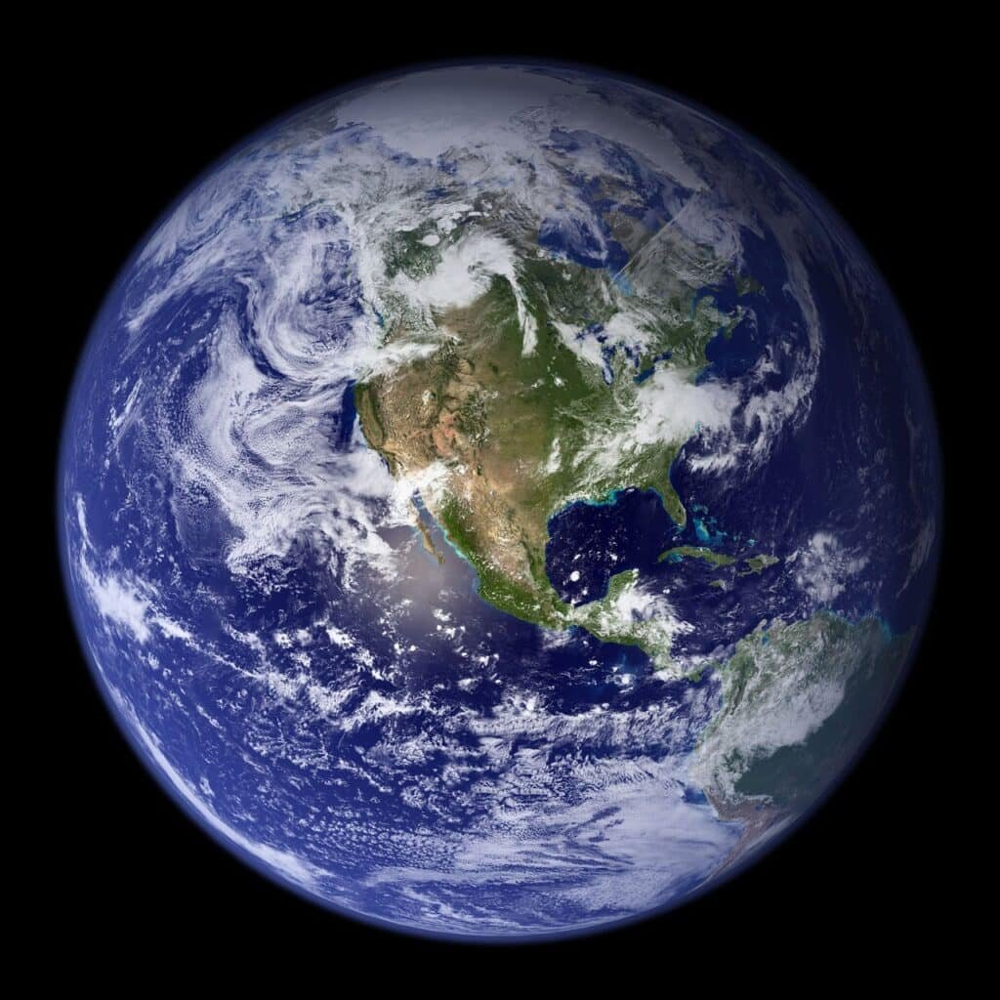

Imagine a world without volcanoes. No towering mountains spewing out molten lava, no massive eruptions that shape the very landscape we live on. It's hard to fathom, isn't it? Volcanoes have had an immense influence on our geological time scale, shaping the Earth's surface and leaving behind a rich record of past eruptions. But their impact goes beyond their awe-inspiring displays of power. Volcanoes, whether they're the explosive type found in the Ring of Fire or the more gentle shield volcanoes of Hawaii, play a vital role in our understanding of Earth's history. From providing vital nutrients to the soil to causing devastating natural disasters, volcanoes are an integral part of our planet's story. In this article, we'll explore the five best ways volcanoes influence the geological time scale, giving us a deeper appreciation for these incredible forces of nature.

This image is property of pixabay.com.

## Understanding the Geological Time Scale

### Definition of the Geological Time Scale

The Geological Time Scale is a system used by geologists and paleontologists to divide Earth's history into distinct time periods. It provides a framework for understanding the order and duration of events that have shaped the planet. The time scale is divided into various units, including eons, eras, periods, epochs, and ages, each representing a different span of time.

### Breakdown of the Geological Time Scale: Eons, Eras, Periods, Epochs, and Ages

The Geological Time Scale is organized hierarchically, with each unit representing a different level of time division. The largest unit is the eon, which represents the longest span of time. It is then divided into eras, which are further subdivided into periods. The periods are then divided into epochs, and finally, epochs are divided into ages.

The breakdown of the Geological Time Scale allows scientists to categorize and analyze Earth's history in a systematic way. By studying the different time periods, scientists can gain insights into the evolution of life, the changes in Earth's climate, and the formation and extinction of various species.

### Influence of Fossils in Delineating Geological Time

Fossils play a crucial role in delineating geological time. They provide evidence of past life forms and help establish the sequence and timing of events. Fossils can be found in sedimentary rocks, which are formed from the accumulation of sediments over time. By studying the fossils found in different rock layers, scientists can determine the relative age of the rocks and the organisms that lived during that time.

Fossils can also provide insights into the environmental conditions that existed during a particular time period. For example, the presence of marine fossils in a rock layer indicates that the area was once covered by an ocean. By examining the fossils and their distribution, scientists can reconstruct past ecosystems and understand how they have changed over time.

### Methods of Dating Geological Time: Radiometric and Relative

There are two primary methods used to date geological time: radiometric dating and relative dating.

Radiometric dating is based on the principle of radioactive decay. Certain elements in rocks and minerals, such as uranium and potassium, undergo radioactive decay over time and transform into different elements. By measuring the ratio of parent isotopes to daughter isotopes, scientists can determine the age of a rock or mineral.

Relative dating, on the other hand, relies on the principle of superposition. It states that in a sequence of undisturbed rock layers, the youngest rocks are at the top, and the oldest rocks are at the bottom. By studying the relative positions of rocks and the fossils they contain, scientists can determine the relative age of the rocks.

Both radiometric and relative dating methods are important tools in establishing the chronology of events in the Geological Time Scale. They provide a means to determine the absolute and relative ages of rocks and fossils, allowing scientists to piece together the puzzle of Earth's history.

## Formation Mechanisms of Volcanoes

### Plate Boundaries and Tectonic Activity

Volcanoes are formed at plate boundaries where tectonic plates interact. These boundaries can be of three types: convergent, divergent, and transform.

Convergent boundaries occur when two plates collide, one riding over the other. This collision can lead to the formation of subduction zones, where one plate sinks beneath another, creating a trench. The subducting plate experiences increasing pressure and temperature, causing melting of the crust and the formation of magma. This magma rises through the crust, leading to volcanic activity.

At divergent boundaries, two tectonic plates move away from each other. This movement creates a gap where magma from the mantle can rise and fill the space left by the separating plates. As the magma reaches the surface, it forms a volcano. Divergent boundaries are responsible for the creation of mid-oceanic ridges and volcanic islands.

Transform boundaries are characterized by plates sliding past each other horizontally. While these boundaries are not typically associated with volcanic activity, there are exceptions. In certain cases, the movement along the transform boundary can cause significant stress and fracturing of the crust, leading to the formation of volcanic activity.

### Hotspots and Shield Volcanoes

Hotspots are another mechanism for volcano formation. These are stationary plumes of hot mantle material that rise from deep within the Earth. The heat from the hotspot melts the overlying crust, creating a magma chamber. As the magma rises, it eventually reaches the surface and forms a volcano.

One notable example of hotspot volcanism is the Hawaiian Islands. The Pacific plate moves over a hotspot, creating a series of volcanic islands that extend from the Big Island of Hawaii to the northwest. The oldest island, Kauai, is in the process of eroding away, while the youngest island, the Big Island, is currently active.

Shield volcanoes are commonly associated with hotspot volcanism. These volcanoes have broad, gently sloping sides that resemble a warrior's shield. They are formed by the eruption of low-viscosity lava, which flows easily over long distances. The lava spreads out in thin sheets, building up the volcano's wide base. Shield volcanoes are typically not explosive and have long eruption durations.

### Rift Zones and Distribution of Volcanoes

Rift zones are areas where the Earth's crust is being pulled apart, leading to the formation of a rift valley. In these zones, magma from the mantle can rise to the surface, creating a chain of volcanoes.

One prominent example of rift zone volcanism is the East African Rift System. This rift extends for thousands of kilometers, from the Red Sea to Mozambique. Along the rift, there are several active volcanoes, including Mount Kilimanjaro, Mount Kenya, and Mount Nyiragongo.

Volcanic activity is not evenly distributed across the globe. It is concentrated along plate boundaries and hotspot locations. The "Ring of Fire" is a prime example of this concentration. Encircling the Pacific Ocean, the Ring of Fire is a region of intense volcanic and [seismic activity](https://magmamatters.com/the-art-and-science-of-volcano-monitoring/ "The Art and Science of Volcano Monitoring"). It is home to numerous active volcanoes, including Mount Fuji in Japan, Mount Rainier in the United States, and Mount Merapi in Indonesia.

Understanding the formation mechanisms of volcanoes and their distribution is crucial for assessing volcanic hazards and predicting future volcanic activity.

This image is property of pixabay.com.

## Types of Volcanoes and Their Eruption Patterns

### Stratovolcanoes and the "Ring of Fire"

Stratovolcanoes, also known as composite volcanoes, are characterized by their steep-sided peaks and alternating layers of hardened lava, ash, and volcanic debris. These volcanoes are typically formed at subduction zones where one tectonic plate is being forced beneath another.

The "Ring of Fire," a region encircling the Pacific Ocean, is home to numerous stratovolcanoes. This area experiences intense tectonic activity due to the presence of several convergent plate boundaries. Volcanoes like Mount St. Helens in the United States, Mount Fuji in Japan, and Mount Vesuvius in Italy are examples of stratovolcanoes found in the Ring of Fire.

Stratovolcanoes are known for their explosive eruptions. The eruption pattern of a stratovolcano can range from relatively mild to catastrophic. These eruptions are characterized by the ejection of ash, gas, and pyroclastic flows. The explosive nature of stratovolcanoes is due to the high viscosity of the magma, which traps gas and builds up pressure before eruptions.

### Shield Volcanoes and Hawaii

Shield volcanoes, as mentioned earlier, have broad, gently sloping sides and are formed by the eruption of low-viscosity lava. These volcanoes often have a flattened, shield-like shape, which gives them their name.

Hawaii is famous for its shield volcanoes, particularly the ones found on the Big Island. Mauna Loa and Kilauea are two of the most well-known shield volcanoes in the world. They have been continuously erupting for decades, with eruptions characterized by the gentle flow of lava rather than explosive eruptions.

The eruption pattern of shield volcanoes is often described as effusive. They release low-viscosity lava, which can flow easily and cover large areas. The lava tends to have a high temperature and low gas content, allowing it to flow smoothly down the slopes of the volcano. However, shield volcanoes can also experience more explosive eruptions if the magma interacts with water or gas-rich pockets within the volcano.

### Cinder Cones

[Cinder cones](https://magmamatters.com/the-birth-of-new-land-understanding-cinder-cones/), also known as scoria cones, are small, steep-sided volcanoes formed by explosive eruptions of gas-rich magma. The eruptions of cinder cones are typically short-lived and can occur as a result of a single eruption event.

Cinder cones are characterized by their conical shape and their accumulation of pyroclastic material, such as cinders and volcanic ash. These cones are often found on the flanks of larger volcanoes or as standalone features on the landscape.

The eruption pattern of cinder cones is characterized by explosive bursts of gas and pyroclastic material. The low viscosity of the magma allows gas to escape easily, resulting in explosive eruptions. The pyroclastic material is ejected into the air and forms a steep cone shape around the vent.

### Lava Viscosity and Gas Content Affecting Eruption Patterns

The eruption patterns of different types of volcanoes are influenced by the viscosity of the magma and the gas content within it.

High-viscosity magma, such as that found in stratovolcanoes, tends to trap gas bubbles within it. As the pressure builds up, the eruptions can be explosive, with the ejection of ash, gas, and pyroclastic flows. The high viscosity of the magma prevents it from easily flowing down the slopes of the volcano, leading to the formation of steep-sided peaks.

Low-viscosity magma, as found in shield volcanoes, allows gas to escape more easily. This results in gentle, effusive eruptions characterized by the flow of lava. The low viscosity of the magma allows it to spread out and cover larger areas, creating broad shield-shaped volcanoes.

The gas content within the magma also plays a significant role in eruption patterns. Higher gas content can lead to more explosive eruptions, as the gas bubbles expand and break apart the magma. Lower gas content typically results in less explosive eruptions, where the lava flows more smoothly.

Understanding the relationship between lava viscosity, gas content, and eruption patterns is critical for assessing volcanic hazards and predicting the behavior of volcanoes.

## Role of Volcanic Eruptions in Defining Geological Periods

### Volcanic Activity and the Paleozoic Era

Volcanic eruptions have played a significant role in shaping Earth's geological periods. In the Paleozoic Era, which spanned from around 541 million to 252 million years ago, large volcanic events were responsible for shaping the landscape and influencing the evolution of life.

One notable example is the Ordovician-Silurian extinction event, which occurred around 444 million years ago. This event was marked by a significant increase in volcanic activity, leading to the release of large amounts of volcanic gases into the atmosphere. The release of these gases altered the climate and ocean chemistry, resulting in the extinction of numerous marine species.

Volcanic activity during the Paleozoic Era also played a role in the formation of mineral deposits. The release of mineral-rich fluids during volcanic eruptions contributed to the formation of valuable resources such as gold, silver, and copper.

### Eruptions in the Mesozoic Era

The Mesozoic Era, often referred to as the Age of Dinosaurs, spanned from around 252 million to 66 million years ago. During this era, volcanic activity continued to shape the Earth's landscape and influence the evolution of life.

One significant volcanic event during the Mesozoic Era was the eruption of the Central Atlantic Magmatic Province (CAMP) around 201 million years ago. This massive volcanic event released vast amounts of lava and volcanic gases, leading to environmental changes and the extinction of many species.

The CAMP eruptions are believed to have had a significant impact on the climate and the oceans, resulting in a global warming event. This warming event, coupled with the release of volcanic gases, is thought to have played a role in the Triassic-Jurassic extinction event, which marked the end of the Triassic Period and the beginning of the Jurassic Period.

### Major Volcanic Events of the Cenozoic Era

The Cenozoic Era began around 66 million years ago and continues to the present day. It is often referred to as the Age of Mammals. Throughout this era, volcanic activity has continued to shape the Earth's geological record.

One of the most notable volcanic events of the Cenozoic Era is the eruption of the Deccan Traps in India. This massive volcanic event occurred around 66 million years ago, coinciding with the end of the Cretaceous Period and the extinction of the dinosaurs. The Deccan Traps eruptions released vast amounts of lava and volcanic gases, significantly impacting the climate and contributing to the mass extinction event.

Volcanic activity during the Cenozoic Era has also influenced landscapes and led to the formation of unique geological features. The eruption of the Yellowstone supervolcano, for example, resulted in the creation of the Yellowstone Caldera and the formation of the famous geothermal features found in Yellowstone National Park.

Understanding the role of volcanic eruptions in defining geological periods is crucial for interpreting the Earth's history and gaining insights into the evolution of life.

This image is property of pixabay.com.

## Impact of Volcanic Ash and Lava Deposits on Geological Record

### Formation and Distribution of Ash Layers

Volcanic eruptions release ash into the atmosphere, which can be transported long distances and deposited as layers on the Earth's surface. These ash layers, also known as tephra deposits, can provide valuable information about past volcanic activity and help establish the chronology of events.

When volcanic ash settles on the land or in bodies of water, it can accumulate over time, forming distinct layers. The ash layers can be preserved in sedimentary rocks and can act as a time marker, allowing scientists to correlate events across different regions.

By analyzing the composition and characteristics of ash layers, scientists can identify the volcanic source and estimate the age of the eruption. They can also study the thickness and distribution of ash layers to understand the magnitude and extent of the eruption.

### Lava Flow Records and Their Geological Significance

Lava flows, the streams of molten rock released during volcanic eruptions, can also leave a lasting impact on the geological record. The hardened lava preserves the morphology of the volcanic landscape and provides insights into past volcanic activity.

Different types of lava flows have distinct characteristics. Pahoehoe flows, for example, have smooth and rope-like textures, while aa flows are rough and blocky. By studying the textures and structures of lava flows, scientists can gain insights into the dynamics of volcanic eruptions and the behavior of lava.

Lava flows can also create unique landforms, such as lava tubes and lava caves. These features are formed when the outer layers of the lava flow cool and solidify, while the inner molten lava continues to flow and eventually drains away. Exploring these features can provide insights into the history of volcanic activity in an area.

### Radioisotope Dating of Ash and Lava Deposits

Radioisotope dating is a key method used to determine the age of volcanic ash and lava deposits. It relies on the radioactive decay of isotopes within the volcanic material.

One commonly used radiometric dating method is potassium-argon dating. This method is based on the decay of potassium-40 to argon-40, which has a half-life of approximately 1.3 billion years. By measuring the ratio of potassium-40 to argon-40 in a volcanic sample, scientists can calculate the age of the deposit.

Another radiometric dating method that is often used is uranium-lead dating. This method is based on the decay of uranium isotopes to lead isotopes. By measuring the ratios of uranium and lead in the volcanic material, scientists can determine the age of the deposit.

Radioisotope dating provides a valuable tool for establishing the absolute age of volcanic ash and lava deposits. It allows scientists to assign precise ages to volcanic events and correlate them with other geological events.

## Volcanoes and Mass Extinction Events

### End Permian Mass Extinction and the Siberian Traps

The End Permian mass extinction, also known as the Great Dying, was the most severe extinction event in Earth's history. It occurred approximately 252 million years ago and resulted in the extinction of about 96% of all marine species and 70% of terrestrial vertebrate species.

One proposed cause for this mass extinction is the eruption of the Siberian Traps, a large igneous province in modern-day Russia. The Siberian Traps eruptions released massive amounts of lava and volcanic gases, leading to significant environmental changes.

The volcanic activity of the Siberian Traps resulted in the release of greenhouse gases and the warming of the climate. This warming, combined with the release of toxic gases, such as sulfur dioxide, resulted in widespread environmental devastation and mass extinctions.

### End Cretaceous Mass Extinction and the Deccan Traps

The End Cretaceous mass extinction event, which occurred approximately 66 million years ago, marked the demise of the dinosaurs and the end of the Mesozoic Era. This event is famously associated with the impact of a large asteroid or comet, creating the Chicxulub crater in Mexico.

However, volcanic activity also played a role in this mass extinction. The eruption of the Deccan Traps in India during the late Cretaceous Period released massive amounts of lava and volcanic gases into the atmosphere.

The Deccan Traps eruptions are believed to have contributed to environmental changes, including global cooling, acid rain, and a decline in sea levels. These changes, combined with the catastrophic impact of the asteroid or comet, likely led to the extinction of numerous species, including the dinosaurs.

### Impact of Massive Volcanism on Global Climate and Biosphere

The link between massive volcanism and mass extinctions highlights the significant impact that volcanic eruptions can have on the global climate and biosphere. Volcanic eruptions release large amounts of greenhouse gases, such as carbon dioxide and methane, into the atmosphere. These gases trap heat, leading to global warming and climate change.

Volcanic eruptions can also release aerosols, small particles suspended in the atmosphere, that can reflect sunlight back into space. This can lead to temporary global cooling, as the aerosols block a portion of the sun's radiation.

The release of volcanic gases can also result in changes to the chemistry of the atmosphere and oceans. The sulfur dioxide released during volcanic eruptions can react with water vapor to form sulfuric acid, leading to acid rain. This acid rain can have detrimental effects on terrestrial and aquatic ecosystems.

Understanding the impact of volcanic eruptions on the climate and biosphere is vital for predicting and mitigating the risks associated with future eruptions. It also provides insights into the complex interactions between geology, climate, and life on Earth.

## Correlation between Volcanic Activity and Climate Changes

### Volcanic Gas Emissions and Atmospheric Composition

Volcanic eruptions release large amounts of gases into the atmosphere, including carbon dioxide, sulfur dioxide, and water vapor. These gases can have a significant impact on the composition of the atmosphere and contribute to climate change.

Carbon dioxide is a greenhouse gas that traps heat in the atmosphere, leading to warming. [Volcanic emissions of carbon dioxide](https://magmamatters.com/geothermal-energy-and-its-volcanic-origins/ "Geothermal Energy and Its Volcanic Origins") can contribute to the increase in atmospheric carbon dioxide levels and have a long-term impact on global climate.

Sulfur dioxide, on the other hand, can react with water vapor in the atmosphere to form sulfuric acid aerosols. These aerosols can reflect sunlight back into space, resulting in temporary cooling of the Earth's surface. The cooling effect of sulfuric acid aerosols can counteract the warming effect of greenhouse gases in the short term.

Water vapor, released during volcanic eruptions, is another important greenhouse gas. While its lifetime in the atmosphere is relatively short compared to carbon dioxide, it can have a potent warming effect in the vicinity of the eruption.

### Global Temperature Fluctuations Triggered by Eruptions

Volcanic eruptions can trigger global temperature fluctuations due to the release of gases and aerosols.

The release of greenhouse gases, such as carbon dioxide and methane, can contribute to global warming and lead to long-term temperature increases. These gases trap heat in the atmosphere, creating a greenhouse effect.

In contrast, the release of aerosols, particularly sulfuric acid aerosols, can lead to temporary global cooling. The aerosols reflect sunlight back into space, reducing the amount of solar radiation reaching the Earth's surface.

The impact of volcanic eruptions on global temperature depends on various factors, including the magnitude of the eruption, the composition of the volcanic gases, and the altitude at which the materials are released into the atmosphere.

### Ice Core Records of Volcanic Influences

Ice cores provide valuable records of past volcanic eruptions and their impact on the climate. In polar regions, such as Antarctica and Greenland, layers of ice build up over time and trap gases, aerosols, and other substances carried by the atmosphere.

By analyzing ice cores, scientists can identify layers corresponding to past volcanic eruptions. The presence of volcanic ash, sulfuric acid aerosols, and other volcanic markers in the ice cores allows scientists to estimate the timing and magnitude of past eruptions.

Ice cores also provide insights into the impact of volcanic eruptions on the climate. Changes in the isotopic composition of the ice and the presence of chemical tracers can reveal shifts in temperature and precipitation patterns associated with volcanic events.

The study of ice cores provides a valuable tool for understanding the correlation between [volcanic activity and climate changes](https://magmamatters.com/the-role-of-volcanoes-in-earths-carbon-cycle-5/ "The Role Of Volcanoes In Earth’s Carbon Cycle"). It allows scientists to reconstruct past climates and establish the mechanisms through which volcanic eruptions influence global temperature.

## Societal Impact and Geological History of Active Volcanoes

### Volcanic Contributions to Fertile Soils

Despite the dangers they pose, active volcanoes contribute to the development of fertile soils. Volcanic ash and lava deposits contain vital minerals and nutrients that can enrich the soil.

Volcanic ash, composed of very fine particles, is rich in minerals such as potassium, phosphorus, and calcium. When deposited on the land, these minerals enhance the fertility of the soil. The ash can also improve soil structure, water retention, and nutrient availability, leading to increased agricultural productivity.

Lava deposits, although initially inhospitable, break down over time and weather into nutrient-rich soil. The breakdown of lava rocks releases minerals and trace elements essential for plant growth. The porous nature of lava soil allows for efficient water drainage, reducing the risk of waterlogging.

Areas surrounding active volcanoes often have highly productive agricultural systems. Volcanic soils, known as andisols, can support a wide range of crops due to their fertility and water-retaining capacity. Farmers in regions like the slopes of Mount Etna in Sicily or the volcanoes of Central America benefit from the nutrient-rich volcanic soils, enabling the cultivation of crops such as coffee, cocoa, and tropical fruits.

### Documented Historical Eruptions and Societal Responses

Throughout history, societies have experienced and responded to volcanic eruptions. Documented historical eruptions provide valuable insights into the impact of volcanoes on human civilization.

One notable example is the eruption of Mount Vesuvius in 79 AD, which buried the Roman cities of Pompeii and Herculaneum under a thick layer of volcanic ash and pumice. The destruction and preservation of these cities have provided a glimpse into ancient Roman life and culture. It has also highlighted the need for communities living near active volcanoes to be prepared for potential eruptions.

In modern times, advances in technology and scientific understanding have allowed for improved monitoring and response to volcanic eruptions. Efforts to predict eruptions and mitigate risks have been crucial in protecting communities living near active volcanoes.

Historical eruptions have also led to the establishment of volcanic observatories and monitoring networks. These institutions collect data on volcanic activity, analyze trends, and issue warnings to communities at risk. The continuous monitoring of volcanoes helps save lives and allows for better management of resources and infrastructure in areas prone to eruptions.

### Volcanic Landscapes and Human Civilization

Volcanic landscapes often attract tourism and contribute to the development of local economies. The unique beauty and geological features of volcanic regions make them popular destinations for travelers.

Volcanoes like Mount Fuji in Japan, Mount Kilimanjaro in Tanzania, and the volcanoes of Hawaii draw visitors from around the world. The tourism industry in these regions provides employment opportunities and economic benefits to local communities.

Volcanic landscapes also have cultural and spiritual significance for many societies. Volcanoes have been revered as sacred places and considered manifestations of divine power in various cultures. They have been the subjects of myths, legends, and artistic expressions.

Understanding the societal impact and geological history of active volcanoes allows for the appreciation of their multifaceted contributions to the world. From their role in shaping fertile soils to their impact on human civilizations, active volcanoes have shaped landscapes and cultures throughout history.

## Modern Monitoring and Prediction of Volcanic Activity

### Seismological Studies for Eruption Prediction

Seismological studies play a crucial role in the monitoring and prediction of volcanic activity. By analyzing the seismic waves generated by volcanic processes, scientists can gain insights into the behavior of volcanoes and detect signs of imminent eruptions.

Volcanic activity generates various types of seismic signals, including volcano-tectonic earthquakes, long-period events, and volcanic tremors. These signals can be indicative of magma movement, gas release, and the fracturing of rock layers within the volcano.

Seismic monitoring networks are installed around active volcanoes to detect and record these signals. By analyzing the patterns and trends in seismic activity, scientists can identify changes that may precede eruptions. This information can help in issuing timely warnings and making informed decisions regarding evacuation and emergency response.

### Satellite Technology and Thermal Imaging

Satellite technology has revolutionized the monitoring of volcanic activity. Satellites equipped with thermal imaging sensors can detect and measure the heat emitted by volcanoes. This information provides valuable insights into volcanic activity and can help in identifying areas of increased heat, which may indicate the presence of magma near the surface.

Thermal imaging can also reveal changes in the temperature and distribution of lava flows. By monitoring these changes, scientists can assess the extent of ongoing eruptions and track the evolution of volcanic activity over time.

Satellite sensors can also measure volcanic gases, such as sulfur dioxide, in the atmosphere. These measurements provide valuable data on gas emissions and can help in assessing the potential impact of volcanic eruptions on the environment and human health.

### Understanding Patterns of Past Eruptions for Future Predictions

Studying the patterns of past volcanic eruptions is crucial for predicting future volcanic activity. By analyzing the geological record and historical data, scientists can identify recurring patterns and understand the behavior of specific volcanoes.

The analysis of past eruptions can provide insights into the frequency, magnitude, and duration of volcanic events. By establishing the average interval between eruptions and the range of eruption styles, scientists can make predictions about future volcanic activity.

Volcanoes often exhibit a cyclic behavior, with periods of activity followed by periods of dormancy. This cyclicity can be observed by studying the eruption history of a volcano. By identifying the patterns and understanding the underlying mechanisms, scientists can make informed predictions about the likelihood and timing of future eruptions.

Understanding the potential hazards associated with volcanic activity allows for effective risk management and the development of strategies to mitigate the impact on surrounding communities. By combining various monitoring techniques and analyzing past eruption patterns, scientists strive to improve the accuracy of eruption predictions and enhance societal resilience to volcanic hazards.

## Educational and Scientific Value of Volcanoes in Geology

### Volcanic Natural Reserves and Geoparks

Volcanic areas are often designated as natural reserves and geoparks due to their educational and scientific value. These protected areas allow for the preservation and study of unique geological features and the promotion of geology education.

Volcanic natural reserves and geoparks provide opportunities for researchers, students, and visitors to learn about volcanic processes and their impact on the Earth's systems. These areas often feature interpretative centers, walking trails, and guided tours that highlight the geological features and the cultural significance of the volcanoes.

One example of a volcanic natural reserve is the Hawaii Volcanoes National Park, located on the Big Island of Hawaii. The park is home to two active volcanoes, Mauna Loa and Kilauea, and offers visitors the chance to explore lava tube caves, hike on volcanic terrain, and witness ongoing volcanic activity.

Geoparks, such as the Jeju Volcanic Island and Lava Tubes in South Korea, showcase the geological, ecological, and cultural aspects of volcanic regions. These parks provide a platform for scientific research, environmental education, and sustainable tourism.

### Role of Volcanology in Geological Education

Volcanology plays a crucial role in geological education. The study of volcanic processes provides insights into various aspects of geology, including plate tectonics, mineralogy, and the formation of Earth's crust.

Volcanic activity is often used as a case study in geology courses to illustrate concepts such as rock formation, magma generation, and volcanic hazards. Field trips to volcanic areas allow students to observe geological features firsthand and apply their knowledge in a real-world setting.

Learning about volcanoes also fosters an appreciation for Earth's dynamic nature and the interconnectedness of geological, environmental, and biological systems. It provides a context for understanding natural disasters and the potential impact of human activities on the planet.

Volcanology research and education contribute to advancements in the field of geology and deepen our understanding of Earth's history and processes. By studying volcanoes, scientists can gain insights into the formation of rocks and minerals, the movement of tectonic plates, and the evolution of Earth's surface.

### Scientific Research Advancements from Volcanic Studies

Scientific research on volcanoes has led to significant advancements in various disciplines, contributing to our understanding of Earth's systems and the development of new technologies.

Studying volcanic eruptions provides insights into the physics and chemistry of magma generation and the dynamics of volcanic processes. This knowledge is crucial for predicting eruptions, assessing volcanic hazards, and developing strategies for risk management.

Volcanic research also contributes to our understanding of climate change. Volcanic eruptions release gases and aerosols that can impact the Earth's climate, and studying their effects helps to refine climate models and improve predictions.

Advancements in technology, such as satellite monitoring and thermal imaging, have revolutionized volcanic research and monitoring. These tools allow scientists to collect data on volcanic activity from remote areas and provide near-real-time information on eruptions.

Volcanic research has also given rise to interdisciplinary collaborations, bringing together scientists from various fields to study the complex interactions between geology, atmospheric science, biology, and other disciplines. This integrated approach has led to breakthroughs in understanding Earth's systems and the impact of volcanic activity on the environment and human societies.

In conclusion, the study of volcanoes is essential for understanding Earth's geological time scale, the formation mechanisms of volcanoes, their eruption patterns, and their impact on the geological record. Volcanic activity has shaped the Earth's landscape, influenced the evolution of life, and played a role in mass extinction events. The understanding of volcanic activity and its impact on climate change is critical for predicting future eruptions, mitigating risks, and managing the societal impacts of volcanic activity. Volcanoes also contribute to the development of fertile soils, are of cultural and scientific value, and have educational and scientific importance in the field of geology. Overall, the study of volcanoes is vital for expanding our knowledge of the Earth and its dynamic processes.

