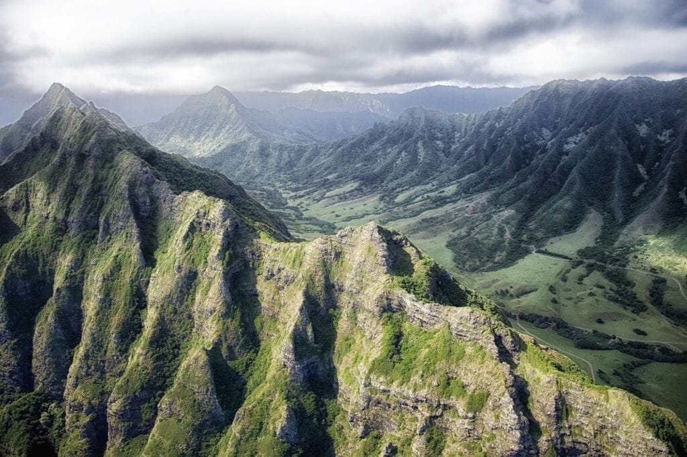
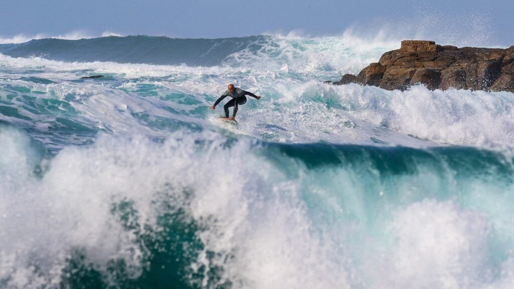

Imagine standing on the edge of a fiery crater, the air thick with the smell of sulfur and the ground rumbling beneath your feet. As you gaze into the depths of the volcano, you can't help but wonder about the powerful force behind this natural wonder. Enter the legend of Goddess Pele, a captivating and mystifying tale that has been passed down through generations. In Hawaiian mythology, Pele is the goddess of volcanoes, fire, lightning, and wind. She is said to reside in Kīlauea, one of the world's most active volcanoes, and is both feared and revered by the people of Hawaii. Join us as we delve into the rich history and intriguing mythology surrounding the legendary Goddess Pele.

This image is property of pixabay.com.

## Understanding Volcanoes

[Volcanoes are fascinating natural phenomena](https://magmamatters.com/the-art-and-science-of-volcano-monitoring/ "The Art and Science of Volcano Monitoring") that have captivated human interest for centuries. These majestic mountains, with their towering heights and fiery eruptions, hold a sense of mystery and awe. In order to truly understand volcanoes, it is important to examine their visible characteristics, the various types of volcanoes, the role of tectonic plates and hot spots, as well as the patterns and causes of volcanic eruptions. Additionally, we must explore both the hazards and benefits that volcanoes bring to our world.

### Visible Characteristics of Volcanoes

Volcanoes are easily recognizable due to their distinctive physical features. They usually consist of a cone-shaped mountain with a crater at the summit. This crater is the vent through which volcanic materials such as lava, gases, and debris escape from the Earth's interior to the surface. Volcanoes can range in size from small [cinder cones](https://magmamatters.com/the-birth-of-new-land-understanding-cinder-cones/) to massive shield volcanoes. The surface of a volcano is often covered in layers of hardened lava and volcanic ash, giving it a rugged and dramatic appearance.

### Types of Volcanoes and How They Form

There are several different types of volcanoes, each formed through a unique geological process. Shield volcanoes, like the ones found in Hawaii, are formed by the gradual accumulation of lava over time. These volcanoes have gentle slopes and are characterized by their large size. Stratovolcanoes, on the other hand, are formed by alternating layers of lava, ash, and other volcanic materials. These volcanoes are often cone-shaped and can be the most explosive type.

Another type of volcano is the cinder cone volcano, which forms from the eruption of pyroclastic material, including volcanic ash and rock fragments. These volcanoes are typically small in size and have steep sides. Finally, there are also calderas, which are massive volcanic depressions created by the collapse of a volcano's summit region. These formations can be hundreds of kilometers in diameter and are often associated with extremely powerful eruptions.

### The Role of Tectonic Plates and Hot Spots

Volcanoes are closely tied to the movements of the Earth's tectonic plates. When these massive plates collide or separate, it creates opportunities for volcanic activity. The "Ring of Fire," a region encompassing the Pacific Ocean, is known for its high concentration of volcanoes. This is because it is located at the boundaries of several tectonic plates, where the interactions between these plates generate intense geological activity.

Hot spots are another important factor in volcano formation. These are areas of the Earth's mantle where molten rock, or magma, rises to the surface. Hot spots are stationary, so as tectonic plates move over them, they create chains of volcanic islands. The Hawaiian Islands are a prime example of this process. As the Pacific Plate moves slowly northwest over the Hawaiian hot spot, it has resulted in the [formation of a chain of volcanic](https://magmamatters.com/understanding-volcanic-formation-a-comprehensive-guide/ "Understanding Volcanic Formation: A Comprehensive Guide") islands, with the youngest island, Hawaii, being the most volcanically active.

### Patterns and Causes of Volcanic Eruptions

Understanding the patterns and causes of volcanic eruptions is crucial for predicting future volcanic activity and mitigating risks to surrounding communities. Volcanic eruptions occur when pressure builds up within the Earth's crust and forces magma to rise to the surface. The viscosity, or thickness, of the magma plays a key role in determining eruption styles. Magma with high viscosity, such as that found in stratovolcanoes, can trap gases and build up pressure, leading to explosive eruptions. In contrast, low viscosity magma, like that of shield volcanoes, flows more easily, resulting in less explosive eruptions.

Other factors that can contribute to volcanic eruptions include the amount of gas dissolved in the magma, the speed at which the magma rises to the surface, and the presence of fractures or weaknesses in the Earth's crust. Volcanic eruptions can vary widely in intensity and duration, from short-lived explosive eruptions to sustained effusive eruptions that release lava over an extended period of time.

### Hazards and Benefits of Volcanoes

While volcanoes may possess a certain allure, it is important to recognize the hazards they can pose to human populations and the environment. Volcanic eruptions can unleash a variety of destructive forces, including pyroclastic flows, lahars (volcanic mudflows), ashfall, and toxic gases. These hazards can endanger lives, destroy infrastructure, and have long-lasting impacts on surrounding ecosystems.

Despite the risks associated with volcanic eruptions, volcanoes also bring numerous benefits to our planet. Volcanic activity can enrich the soil with important nutrients, making it highly fertile for agriculture. Volcanic eruptions can create new landmasses, as well as shape the Earth's topography over time. Additionally, many volcanic regions have become popular tourist destinations, attracting visitors from around the world and contributing to local economies.

By understanding the visible characteristics, types, and formation of volcanoes, as well as the role of tectonic plates and hot spots, the patterns and causes of volcanic eruptions, and the hazards and benefits they bring, we can gain a deeper appreciation for these geological wonders and work towards better preparedness and conservation efforts.

## The Origin of the Legend of Goddess Pele

The Legend of Goddess Pele holds great significance in Hawaiian mythology and provides insights into the cultural beliefs and traditions of the Hawaiian people. This ancient legend revolves around the powerful goddess Pele, who is associated with volcanoes and volcanic activity. Exploring the cultural significance of Goddess Pele, her origin story in the Chain of Hawaiian Islands, and the different variations of the legend allows us to delve into the rich tapestry of Hawaiian folklore.

### Cultural Significance of Goddess Pele in Hawaiian Mythology

In Hawaiian mythology, Pele is a highly revered figure and is considered the deity associated with volcanoes, fire, and lightning. She holds a prominent place in the hearts and minds of the Hawaiian people, who respect and honor her as a powerful and capricious goddess.

Pele represents not only the destructive forces of volcanic eruptions but also the transformative power of creation and regeneration. She is viewed as both a bringer of destruction and a creator of new land. This duality reflects the complex relationship between humans and the natural world, emphasizing the need for balance and harmony.

### Pele’s Origin Story in the Chain of Hawaiian Islands

According to the legend, Pele is said to have originated from Tahiti, but her journey eventually led her to the Hawaiian Islands. She traveled in the form of fire, along with her family, which included her brothers and sisters. As they moved across the vast Pacific Ocean, each of Pele's siblings settled in different locations, representing the various volcanic islands in the Hawaiian chain.

When Pele finally found her desired home, the fiery and fertile Big Island of Hawaii, she dug her fire pit, Halemaumau, at the summit of the volcano now known as Kilauea. It is believed that Pele's presence resides within Kilauea, making it a sacred place and the embodiment of her power.

### Different Variations of the Legend

As with any ancient legend, variations of the story of Pele exist throughout the Hawaiian archipelago. Different regions have developed their own unique versions and interpretations of the tale, adding to the richness and diversity of Hawaiian folklore. Variations may offer alternative explanations for Pele's origins, emphasize different aspects of her personality, or highlight her interactions with other deities and characters.

These different variations of the legend not only reflect the vibrant oral tradition of storytelling but also serve as a testament to the ongoing evolution of Hawaiian culture.

This image is property of pixabay.com.

## Pele’s Association with Volcanoes

Pele – The Volcano Goddess. The mere mention of her name conjures images of fiery landscapes and untamed power. Pele is intrinsically connected to volcanic activity, and her association with volcanoes permeates countless legends and cultural beliefs. By exploring Pele's identity as the volcano goddess, her relationship with the Kilauea volcano, and the reasons behind her association with volcanic activity, we gain a deeper understanding of the spiritual significance she holds in Hawaiian culture.

### Pele – The Volcano Goddess

Pele is widely recognized and revered as the goddess of volcanoes. Known for her fiery temperament and ever-changing moods, she is considered both a source of destruction and creation. Pele's association with volcanic activity represents the unpredictable and intense nature of volcanic eruptions, mirroring the constant changes and cycles of life itself.

In Hawaiian mythology, Pele is believed to have control over the elements of fire and lava. She is known to roam the slopes of Kilauea and other volcanic peaks, guiding the flow of lava and shaping the land. Pele is depicted as a powerful and independent deity, embodying both the destructive and creative forces of nature.

### Pele and Kilauea Volcano

Kilauea, located on the Big Island of Hawaii, is considered to be the most active volcano in the world and holds a deep connection to Pele. It is believed that Pele chose Kilauea as her home, creating her fire pit, Halemaumau, at the volcano's summit. This sacred site is considered the physical manifestation of Pele's spirit and power.

The relationship between Pele and Kilauea is dynamic and ever-changing, reflecting the constant volcanic activity of the volcano itself. Legends tell of Pele's travels beneath the earth, searching for a place to reside or engaging in battles with her sister, Hi'iaka. These stories highlight the intimate connection between Pele and the volcanic landscape she calls home.

### Why Pele is Associated with Volcanic Activity

The association between Pele and volcanic activity can be understood through the spiritual and cultural significance of volcanic eruptions in Hawaiian tradition. Volcanoes, with their power to shape the land and create new landmasses, are viewed as sites of creation and regeneration. This aligns with Pele's role as a goddess of creation and transformation, as she brings about the birth of new land through volcanic eruptions.

Furthermore, the destructive nature of volcanic eruptions serves as a reminder of the immense power of nature and the need for human beings to respect and coexist with it. Pele's association with volcanic activity serves as a cautionary tale, highlighting the consequences of disrespecting the natural world and the importance of living in harmony with the environment.

## Pele’s Family and Relationships

The legend of Pele is not only about her fierce presence as a deity, but it also delves into her complex family dynamics and relationships. Pele is said to have had siblings and lovers, and these relationships shaped her story and influence her actions. Exploring Pele's siblings and her relationships with them, her lovers, and the feuds and rivalries within her family provides insight into the intricate web of relationships that surround this powerful goddess.

### Pele's Siblings and Her Relationships With Them

In Hawaiian mythology, Pele is said to have several siblings, each with their unique characteristics and associations. Among her siblings are Kamohoali'i, the god of sharks, and Hi'iaka, the goddess of hula. Pele has both close familial ties and complex relationships with her siblings.

Kamohoali'i, as the god of sharks, represents the deep connection between Pele and the ocean. Legends tell of their joint efforts to protect Hawaii from external threats, with Kamohoali'i acting as a guardian and navigator for Pele during her voyages to the Hawaiian Islands.

Hi'iaka, on the other hand, is Pele's favorite sister and plays a significant role in several legends involving Pele. Hi'iaka is known for her beauty and skill in hula, and her connection with Pele highlights the interplay between fire and water. However, their relationship is not without conflict, as there are legends that describe their fierce rivalries and disagreements.

### Pele's Lovers and Their Stories

Pele's romantic relationships play a vital role in her legend and contribute to her complex character. The legends recount the tales of Pele's multiple lovers, each representing different aspects of her personality and desires.

One of Pele's most famous lovers is Lohiau, a handsome chief from Kauai. Their love story is one of passion and tragedy, as their union is tested by loyalty, jealousy, and the pursuit of eternal love. The legend of Pele and Lohiau showcases the depth of Pele's emotions and the lengths she is willing to go to be with the one she loves.

Another prominent love interest in Pele's legend is Pelehonuamea, also known as Kalei Pele. This sisterly union represents the connection between Pele and her own divine essence. Together, they embody the forces of creation and destruction, reflecting the dual nature of Pele herself.

### Feuds and Rivalries within Pele's Family

Like any family, Pele's divine family is not without its own share of feuds and rivalries. One notable feud involves Pele and her sister, Namakaokahai, who is the goddess of the sea. Legends tell of intense battles and conflicts between Pele and Namakaokahai, symbolizing the clash between fire and water. These feuds highlight the dynamism within the natural world and serve as cautionary tales about the consequences of imbalance and disharmony.

Furthermore, there are tales of tension and rivalry between Pele and her sister, Hi'iaka. Their disagreements often stem from Hi'iaka's attempts to protect their family and resolve conflicts caused by Pele's eruptions and fiery temperament. This tension between the sisters mirrors the complexities and challenges that arise in familial relationships.

Exploring the family dynamics and relationships of Pele deepens our understanding of her character and the broader themes within Hawaiian mythology. These legends convey not only the turbulence that can exist within families but also the power of love, loyalty, and conflict resolution.

This image is property of pixabay.com.

## Famous Myths Involving Pele

Pele, the powerful volcano goddess, is the central character in numerous Hawaiian myths and legends. These captivating stories provide insight into her personality, her interactions with other deities, and her influence on the creation and transformation of the Hawaiian Islands. Exploring the story of Pele and Kamapua'a, the tale of Pele and the creation of the Hawaiian Islands, and the battle between Pele and her sister Hi'iaka allows us to delve deeper into the intriguing world of Pele and her role in Hawaiian mythology.

### Story of Pele and Kamapua’a

The story of Pele and Kamapua'a is one of love, passion, and the clash of different elemental forces. Kamapua'a, also known as the Pig God, represents the wild and untamed aspects of nature, while Pele personifies the fiery and powerful [volcanic energy](https://magmamatters.com/geothermal-energy-and-its-volcanic-origins/ "Geothermal Energy and Its Volcanic Origins"). Their tumultuous relationship is characterized by intense attraction and fierce disputes, reflecting the opposing forces of fire and water.

Legends recount a series of battles and confrontations between Pele and Kamapua'a, with each using their unique powers to gain the upper hand. The story serves as a metaphor for the forces of nature coming together and the ensuing conflicts that arise from such encounters. It also highlights the delicate balance needed to maintain harmony between opposing elements.

### Pele and the Creation of Hawaiian Islands

The creation of the Hawaiian Islands is intricately linked to the legend of Pele. According to Hawaiian mythology, each island in the chain is the result of Pele's journey across the Pacific Ocean in search of a home. As she traveled, she battled with her sister, Namakaokahai, the goddess of the sea, who sought to prevent Pele from settling on the islands.

These epic battles between Pele and Namakaokahai resulted in the formation of various landforms. Each eruption by Pele's fiery power was met with the resistance of the sea, shaping the landscape of the Hawaiian Islands we see today. This legend serves as a reminder of the ongoing dynamic relationship between the elements of fire and water and the ever-changing nature of the Earth's geology.

### The Battle Between Pele and Her Sister Hi'iaka

The story of the battle between Pele and her sister Hi'iaka explores the complex relationship between the volcano goddess and the goddess of hula. Hi'iaka, who is known for her beauty and skill in hula, often finds herself caught in the middle of Pele's fiery temper and destructive power.

The legend tells of Hi'iaka's arduous journey to retrieve Pele's lover, Lohiau, from the land of the dead. As Hi'iaka embarks on this dangerous mission, she must face numerous obstacles and challenges set in her path by Pele. The battle between the two sisters represents the struggle between passion and reason, highlighting the profound impact Pele's volcanic eruptions can have on the lives of those around her.

These famous myths involving Pele demonstrate the dynamic and rich storytelling tradition of Hawaiian culture. They emphasize the interconnectedness of nature, the forces of creation and destruction, and the complex relationships between deities and mortals.

## Depiction of Pele in Popular Culture

The mesmerizing legend of Goddess Pele has permeated popular culture, influencing various forms of artistic expression. Pele's enigmatic and powerful character has inspired writers, artists, filmmakers, and musicians alike. By exploring Pele's presence in literature, visual arts, movies, television, and music, we can gain a deeper appreciation for the enduring legacy of this remarkable deity within popular culture.

### Pele in Literature and Storytelling

The legend of Pele has been a source of inspiration for numerous authors and storytellers throughout the years. Writers have sought to capture the essence of Pele's fiery spirit and complex personality through vivid descriptions and captivating narratives. From traditional folklore to contemporary literature, Pele's character continues to fascinate and engage readers.

In some works, Pele is portrayed as a protagonist, embodying resilience and adaptability. These stories often explore the transformative power of volcanic eruptions and emphasize the importance of finding balance in the face of chaos. Other works delve into the psychological aspects of Pele's character, delving into her motivations and desires.

### Pele in Visual Arts

Pele's striking image and symbolic significance make her a popular subject in visual arts. Paintings, sculptures, and other forms of artistic expression often depict Pele in her fiery form, surrounded by flowing lava and billowing smoke. These artworks aim to capture the raw energy and power associated with Pele's volcanic nature.

Artists' interpretations of Pele vary in style and medium, from traditional Hawaiian art to contemporary and abstract representations. Some artworks incorporate actual volcanic materials, such as volcanic ash or lava rock, to pay homage to Pele's association with natural elements.

### Pele's Presence in Movies and Television

Pele's captivating story has found its way onto the silver screen and television, captivating audiences across the globe. Numerous movies and TV shows have drawn inspiration from Pele's legend, incorporating elements of her mythology and character into their narratives.

Whether portrayed directly or indirectly, Pele's presence adds an element of mystique and intrigue to these visual storytelling mediums. Her fiery energy and tempestuous nature often serves as a catalyst for the plot and provides an opportunity to explore themes of transformation and rebirth.

### Pele’s Influence on Music and Dance

The legend of Pele has resonated deeply with musicians and dancers, who draw inspiration from her powerful and ever-changing persona. Traditional Hawaiian chants and songs often pay homage to Pele, praising her strength and significance in Hawaiian mythology. These musical compositions provide a connection to ancient traditions and serve as a celebration of Pele's divine essence.

In addition to traditional music, contemporary artists have also been inspired by Pele's legend. Songs referencing Pele's fiery nature and her association with volcanic activity evoke a sense of passion, power, and transformation. The rhythmic movements of hula dance, often accompanied by chants and music, also honor Pele's connection to the Hawaiian Islands and the primal forces of creation.

The presence of Pele in popular culture testifies to the enduring legacy and fascination surrounding this enigmatic goddess. Writers, artists, filmmakers, and musicians continue to find inspiration in her story, bringing her character to life across various creative mediums.

## Pele’s Spiritual Significance

Pele is not merely a character in ancient mythology but holds profound spiritual significance within Hawaiian religion and cultural practices. Exploring Pele's role in Hawaiian religion, the ways in which she is honored through ritual and ceremony, and her place in modern Hawaiian spirituality provides insights into the enduring spiritual and cultural relevance of this powerful goddess.

### Pele's Role in Hawaiian Religion

In Hawaiian religion, Pele is worshipped as a revered deity and holds a central place within the pantheon of Hawaiian gods and goddesses. She is considered the goddess of fire, volcanoes, and the creator and destroyer of land. Pele's role extends beyond the physical manifestations of volcanic activity and encompasses the spiritual realm as well.

Worship of Pele often involves offerings and prayers, which are made to honor and appease her. These rituals reflect the belief in the power of Pele and the need to maintain a harmonious relationship between humans and the natural world. Pele's role in Hawaiian religion highlights the profound connection between spirituality, nature, and the sacredness of the land.

### Honoring Pele through Ritual and Ceremony

Pele is honored through various rituals and ceremonies, which range from private devotions to large community gatherings. Offerings, known as ho'okupu, are presented to Pele as a gesture of respect and gratitude. These offerings can include flowers, fruits, and other natural materials, symbolizing the interconnectedness of humans and the land.

Hula, the traditional Hawaiian dance, also plays a significant role in honoring Pele. Through dance, practitioners seek to channel Pele's power and spirit, embodying her fiery energy. The movements and chants associated with hula connect individuals to the ancient traditions and express devotion to Pele's divine essence.

### Pele in Modern Hawaiian Spirituality

Pele's spiritual significance extends beyond traditional religious practices and remains relevant in modern Hawaiian spirituality. Many Hawaiians continue to hold deep reverence for Pele as a guardian of the land and a symbol of their cultural heritage. Pele represents the strength, resilience, and untamed beauty of the Hawaiian Islands.

In contemporary Hawaiian spirituality, Pele is often invoked in healing ceremonies, where individuals seek her guidance and protection. She is viewed as a nurturing and transformative force, capable of bringing about personal and societal change. Pele's presence in modern Hawaiian spirituality reflects the enduring connection between the Hawaiian people and the land, symbolizing the continued importance of cultural identity and preservation.

Pele's spiritual significance within Hawaiian religion and contemporary spirituality showcases the deep respect and reverence the Hawaiian people hold for this powerful goddess. Her role as a source of inspiration, transformation, and protection resonates throughout the centuries and continues to shape the spiritual practices of the Hawaiian people.

## Etiquettes and Superstitions Connected to Pele

The powerful and capricious nature of Pele has given rise to numerous etiquettes and superstitions surrounding her legacy. These beliefs reflect the respect and caution with which Pele is regarded, acknowledging her temper and the potential danger associated with volcanic activity. Understanding the taboos and prohibitions related to Pele, the superstitions surrounding volcanic eruptions and Pele, and the things believed to invite the wrath of Pele sheds light on the deeply ingrained cultural practices that surround this goddess.

### Taboos and Prohibitions Related to Pele

Hawaiians have long observed various taboos and prohibitions related to Pele as a way of showing respect and avoiding potential harm. These practices acknowledge the immense power and volatile nature of volcanic eruptions and seek to maintain a harmonious relationship with Pele.

Some of the taboos associated with Pele include refraining from removing volcanic rocks from the islands, as it is believed to anger the deity. Additionally, disturbing any volcanic formations or disrupting natural landforms associated with Pele is considered disrespectful and can invite negative consequences.

### Superstitions Surrounding Volcanic Eruptions and Goddess Pele

Superstitions surrounding volcanic eruptions and Pele often reflect the beliefs and anxieties associated with living in close proximity to active volcanoes. It is believed that certain natural signs can indicate an impending eruption, such as an increase in volcanic activity or changes in the behavior of animals. These signs are seen as warnings from Pele and are taken seriously by the local communities.

Furthermore, it is considered bad luck to speak Pele's name aloud, especially if it is mentioned in a negative context. This superstition stems from the belief that uttering Pele's name will bring about her wrath and can result in volcanic eruptions or other calamities. This serves as a cautionary reminder of the power Pele holds over the volcanic landscape.

### Things Believed to Invite the Wrath of Pele

In Hawaiian culture, there are certain things that are believed to invite the wrath of Pele and should be avoided to maintain her favor. These include disrespecting the land, desecrating sacred sites, or ignoring the warnings and signs of volcanic activity. It is believed that those who disregard the power and authority of Pele may face dire consequences, including destruction and misfortune.

Understanding these etiquettes and superstitions connected to Pele provides insight into the deep respect and caution with which Hawaiians approach volcanic activity. These cultural practices serve as a reminder of the importance of living in harmony with the natural world and acknowledging the power of natural forces.

## Scientific Basis Behind The Legends of Pele

The legends of Pele, while steeped in mythology and spirituality, find intriguing correlations with real volcanic activities. These connections highlight the intricate relationship between mythology and science, where ancient stories often provide insights that align with modern scientific understanding. By examining these correlations and understanding the scientific basis behind the legends of Pele, we can gain a deeper appreciation for the relevance of these tales in the context of geological phenomena.

### Correlations Between Pele’s Stories and Real Volcanic Activities

Many aspects of Pele's legend appear to align with observations and scientific understanding of volcanic activity. The depiction of Pele's fiery temperament, her association with volcanic eruptions, and her transformative powers find similarities with the actual behavior of volcanoes.

Pele's character, portrayed as fierce and unpredictable, is reflected in the nature of volcanic eruptions themselves. Just as Pele's temper flares and subsides, volcanic eruptions can vary in intensity and duration. Additionally, the creation and destruction associated with Pele's mythology mirrors the processes that occur during volcanic eruptions, with the formation of new land and the alteration of existing landscapes.

### How Science Interprets the Myth of Pele

While mythology and science may seem like distinct realms, they often converge when it comes to explaining natural phenomena. Modern science provides a framework to interpret the legends of Pele in a way that aligns with our understanding of volcanic activity.

Science allows us to explain the formation of the Hawaiian Islands, the influence of tectonic plates and hot spots, and the processes that occur during volcanic eruptions, shedding light on the realities behind the legends. By examining the geological processes at work, such as the movement of tectonic plates and the effects of magma viscosity, we can rationalize and explain the connection between Pele's character and volcanic activity.

The scientific basis behind the legends of Pele enhances our understanding of the natural world and provides a bridge between ancient mythology and modern scientific exploration.

## Enduring Legacy of Goddess Pele

The enduring legacy of Goddess Pele holds great importance for the Hawaiian people today. Pele serves as a symbol of Hawaiian culture and pride, representing the strength, resilience, and connection to the land that is deeply ingrained in the hearts of the Hawaiian people. Understanding the importance of Pele for the Hawaiian people today, her role as a symbol of Hawaiian culture and pride, and her impact on the context of ecotourism and conservation allows us to appreciate the lasting influence of this remarkable goddess.

### Importance of Pele for the Hawaiian People Today

For the Hawaiian people, Pele is more than just a mythological figure; she is a source of cultural identity and pride. Pele embodies the spirit of the Hawaiian Islands, representing the power of creation and the tenacity needed to thrive in an ever-changing world.

Pele's legend continues to be passed down through generations, ensuring her significance remains a vital part of Hawaiian culture. It serves as a reminder of ancient traditions and the deep connection between the Hawaiian people and their ancestral land.

### Pele as a Symbol of Hawaiian Culture and Pride

Pele's association with volcanoes and the natural landscape of Hawaii makes her a potent symbol of Hawaiian culture and pride. Her fierce energy reflects the untamed beauty of the Hawaiian Islands, while her transformative nature represents the resilience of the Hawaiian people.

In times of adversity and in moments of celebration, Pele remains a beacon of strength and inspiration. Her legacy serves as a reminder to embrace one's cultural heritage, respect the power of nature, and adapt to life's challenges with grace and perseverance.

### Pele in the Context of Ecotourism and Conservation

The allure of Pele and the natural wonders associated with her mythology have played a significant role in Hawaii's tourism industry. The Hawaiian Islands, with their active volcanoes and stunning landscapes, attract visitors from around the world who seek to experience the power and beauty of Pele's realm firsthand.

However, the increasing popularity of ecotourism and conservation efforts has prompted a shift in how Pele's legacy is approached. It has become crucial to strike a balance between sharing the wonders of Pele's volcanic landscapes with the preservation and protection of these delicate natural ecosystems.

Efforts are being made to educate visitors on the cultural significance of Pele and the importance of responsible tourism. These initiatives aim to ensure that Pele's enduring legacy can coexist with sustainable practices and conservation efforts, preserving the natural beauty of the Hawaiian Islands for future generations.

The enduring legacy of Pele transcends time and continues to influence the cultural fabric of the Hawaiian people. Her symbolism, cultural significance, and the role she plays in ecotourism and conservation serve as a testament to the profound impact she has had on the Hawaiian Islands and its people throughout history.

In conclusion, understanding volcanoes provides insights into the visible characteristics, types, and formation of these natural phenomena, as well as the role of tectonic plates and hot spots and the patterns and causes of volcanic eruptions. The legend of Goddess Pele further enriches our knowledge by exploring her cultural significance, origin story, associations with volcanoes, family dynamics, famous myths involving her, depiction in popular culture, spiritual significance, etiquettes and superstitions, scientific basis behind the legends, and enduring legacy. Pele serves as a bridge between mythology and reality, reflecting the interconnectedness between human beliefs and scientific understanding. The enduring legacy of Goddess Pele reverberates through Hawaiian culture, symbolizing the strength, resilience, and connection to the land that is deeply cherished by the Hawaiian people. By comprehending the comprehensive aspects of both volcanoes and the legend of Goddess Pele, we deepen our understanding of the natural world and the rich tapestry of human beliefs and cultural heritage.

