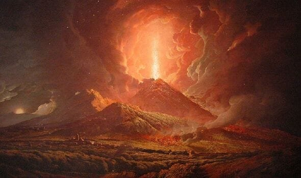
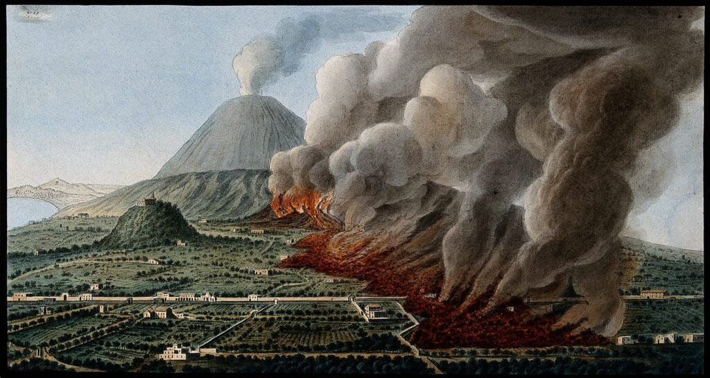
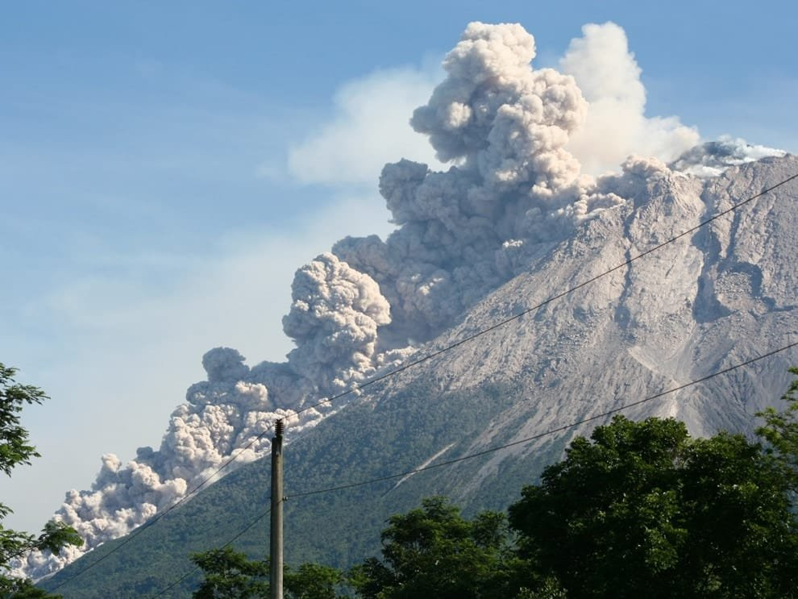
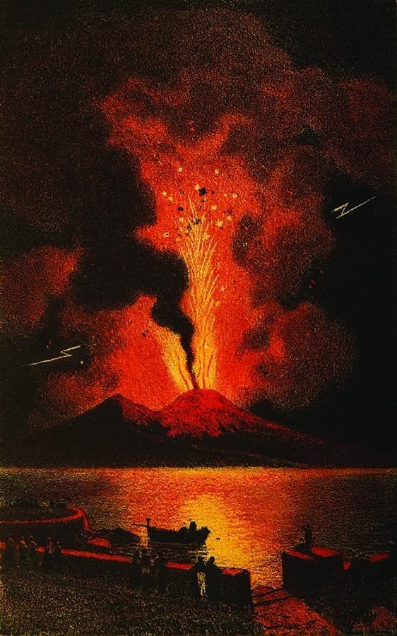
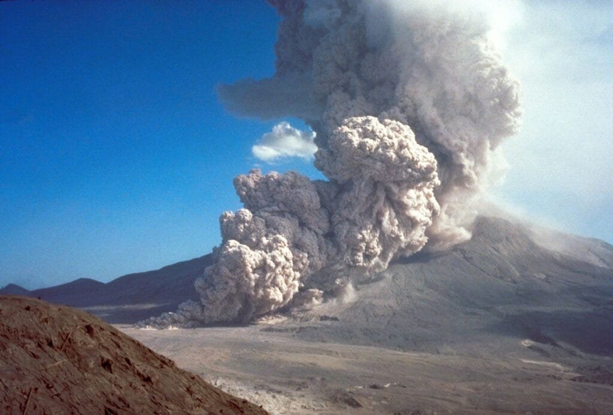

In "The Pyroclastic Phenomena of Pompeii: 7 Insights to Explore," you will discover fascinating details about the volcanic eruptions that buried the ancient city of Pompeii. Volcanoes, formed when molten rock and debris escape to the surface, can cause catastrophic eruptions of lava and ash. By understanding the different types of volcanoes and their eruption patterns, we can gain insights into the hazards and benefits they bring. Through this article, we will explore the specific pyroclastic phenomena that led to the destruction of Pompeii, providing seven captivating insights into this tragic event.

This image is property of cdn.images.express.co.uk.

## The Formation of Pompeii's Volcano

Pompeii's volcano, known as Mount Vesuvius, was formed due to a combination of geological conditions. The area where Pompeii is located is part of a region called the Campanian volcanic arc. This arc is formed as a result of the subduction of the African Plate underneath the Eurasian Plate.

The tectonic plate movement plays a crucial role in the formation of Pompeii's volcano. The subduction of the African Plate causes the melting of rocks in the Earth's mantle. This molten rock, known as magma, rises towards the surface, creating a volcanic magma chamber. Over time, the accumulation of magma leads to the formation of the volcano.

In addition to tectonic plate movement, underground hot spots also contribute to the formation of Pompeii's volcano. These hot spots are areas of intense heat in the Earth's mantle that can cause localized melting of rocks. When the molten rocks rise towards the surface, they can contribute to the creation of volcanic activity, including the formation of Pompeii's volcano.

## Eruption Patterns of Pompeii's Volcano

The eruption pattern of Pompeii's volcano is influenced by various factors. One of the contributing factors is the viscosity of the magma. Magma with high viscosity tends to be more explosive, leading to violent eruptions. On the other hand, magma with low viscosity allows gases to escape more easily, resulting in less explosive eruptions.

Comparing the eruption patterns of Pompeii's volcano with other global volcanoes, it is evident that Pompeii experienced a particularly devastating eruption. The eruption of Mount Vesuvius in 79 AD resulted in the burial of Pompeii and surrounding areas under layers of ash and pyroclastic material. This catastrophic eruption differs from the more gradual and less destructive eruptions of shield volcanoes like those in Hawaii.

The viscosity and gas content of the magma play a significant role in shaping the eruption patterns of Pompeii's volcano. The high viscosity of the magma in the 79 AD eruption allowed for the build-up of pressure, leading to a massive explosion that released a tremendous amount of volcanic material. The high gas content added to the explosive nature of the eruption.

This image is property of miro.medium.com.

## Devastating Impact of Volcanic Eruptions in Pompeii

The eruption of Mount Vesuvius in 79 AD had a devastating impact on Pompeii and its inhabitants. The eruption unleashed a combination of ash, pumice, and other volcanic debris, covering the city and surrounding areas. This pyroclastic fallout led to the collapse of buildings and structures, burying them under layers of volcanic material.

The impact on people was catastrophic, with thousands losing their lives as they were unable to escape the sudden eruption. The high temperatures of the pyroclastic flow incinerated human bodies, leaving behind only their outlines, known as "voids."

The infrastructure of the city was also severely affected. Buildings were crushed under the weight of the volcanic material, and streets were completely blocked. The city's water supply and sewage systems were destroyed, further exacerbating the tragedy.

Archaeological findings provide compelling evidence of the scale of devastation caused by the eruption. Excavations have revealed the well-preserved remains of the city, with buildings, artifacts, and even human casts buried under layers of ash. These findings serve as a somber reminder of the destructive power of volcanic eruptions.

## Features of the Pyroclastic Flow Emanating from Pompeii's Volcano

Pyroclastic flows are one of the deadliest volcanic hazards associated with Pompeii's volcano. These flows consist of a mixture of hot gases, ash, and volcanic debris that move rapidly down the slopes of the volcano.

Pyroclastic flows have high speeds and temperatures, making them particularly dangerous. They can reach speeds of hundreds of kilometers per hour, making it almost impossible for anyone in their path to escape. The extreme heat of the flowing materials can incinerate anything in its way, adding to the devastating impact.

The materials carried by pyroclastic flows vary depending on the eruption. They can range from fine ash particles to large boulders. The mix of sizes and densities makes the flows more destructive, as they can easily destroy buildings and infrastructure in their path.

The deadly nature of pyroclastic flows lies in their ability to devastate everything in their path within minutes. Their high speeds and temperatures make it impossible to outrun them, and their destructive force can wipe out entire communities.

This image is property of images.nationalgeographic.org.

## Benefits of Volcanic Activity in Pompeii Region

Despite the devastating impact of volcanic eruptions, volcanic activity in the Pompeii region also brings some benefits. One of the main benefits is the enrichment of the soil with nutrients. The ash and volcanic material deposited during eruptions are rich in minerals, making the land fertile for agriculture. Farmers in the region have been able to take advantage of this fertile land to grow crops and produce high-quality agricultural products.

Volcanic activity also has an influence on Pompeii's climate and natural features. The volcanic ash can act as a natural insulator, regulating temperature and moisture levels in the region. Additionally, volcanic activity can shape the landscape, creating unique features such as volcanic craters and lava fields that attract tourists from around the world.

The economic activities in Pompeii, such as farming and tourism, have benefitted from the volcanic activity in the region. The fertile soil allows for a thriving agricultural industry, while the unique natural features attract visitors, boosting the local tourism sector.

## Predicting Future Activity of Pompeii's Volcano

Scientists use various methods and technologies to predict future activity of Pompeii's volcano. One of the key methods is [monitoring seismic activity](https://magmamatters.com/the-art-and-science-of-volcano-monitoring/ "The Art and Science of Volcano Monitoring"). By tracking earthquakes and ground vibrations around the volcano, scientists can detect changes that may indicate an impending eruption.

Other monitoring techniques include measuring gas emissions and changes in ground deformation. These indicators can provide valuable information about the movement of magma below the surface and the buildup of pressure within the volcano.

To improve the accuracy and reliability of predictions, scientists also rely on historical data and geological findings. Studying past eruptions and the geological history of the volcano can provide insight into its behavior and help in making more informed predictions about future activity.

While predicting volcanic eruptions can be challenging, advancements in technology and data analysis have improved the accuracy of predictions in recent years. However, it is important to note that predicting volcanic activity is not an exact science, and uncertainties still exist.

This image is property of www.rom.on.ca.

## Risk Mitigation Measures in Modern Pompeii

In response to the potential threat of future eruptions, the modern Pompeii community has taken several measures to mitigate the risks. One crucial aspect is community preparedness. Regular drills and awareness campaigns aim to inform residents about evacuation plans and safety protocols in case of an eruption. This preparedness helps residents to respond quickly and effectively in the event of an emergency.

Structural modifications to buildings have been implemented to enhance their resilience to volcanic activity. Reinforced structures and improved roofing materials can better withstand the impact of volcanic debris and ashfall. Additionally, the development of early warning systems has allowed for quicker evacuation of vulnerable areas, minimizing the risk to human life.

The government and international agencies also play a crucial role in risk mitigation. They invest in research, monitoring systems, and infrastructure to ensure the safety of the population. Collaboration between scientists, emergency management agencies, and local authorities is essential for effective disaster preparedness and response.

## The Lasting Influence of Pompeii's Volcano on Art and Culture

The eruption of Mount Vesuvius in 79 AD had a significant influence on art and culture, both during the Roman era and throughout history. Contemporary art from the time depicts the catastrophic event, showcasing the destruction and devastation caused by the eruption. These artworks provide valuable insights into the impact of the eruption on the lives of the people living in Pompeii and the surrounding areas.

The eruption of Pompeii's volcano has also inspired literature, theatre, and cinema. Countless works of literature have been written about the tragedy, and plays and films have been produced depicting the events leading up to the eruption and its aftermath. The eruption of Pompeii's volcano has become a symbol of natural disaster and its human consequences, often serving as a powerful backdrop for storytelling.

The cultural significance of the archaeological sites preserved under the ash cannot be overstated. These sites provide a unique glimpse into the daily life and culture of the ancient Roman civilization. The well-preserved buildings, artifacts, and human casts offer invaluable insights into the customs, traditions, and social structures of the time, contributing to our understanding of the past.

This image is property of cdn.britannica.com.

## Pyroclastic Phenomena Preservation in Pompeii Archaeology

Preserving the pyroclastic phenomena in Pompeii archaeology is of utmost importance to ensure the conservation of valuable artifacts and insights into the eruption. Various means and methods are employed to protect and preserve the volcanic artifacts found in the area.

One method is the use of advanced conservation techniques. These techniques involve stabilizing and treating the fragile artifacts to prevent further deterioration. This can include removing the ash and other debris that may be covering the artifacts, as well as conducting chemical treatments to reinforce their structural integrity.

Another crucial aspect of preservation is proper storage and display methods. The artifacts need to be stored in controlled environments that maintain stable temperature and humidity levels to prevent damage. Additionally, the artifacts are carefully displayed in museums and exhibitions, utilizing safe mounting and lighting techniques to ensure their longevity.

The preservation of pyroclastic phenomena in Pompeii archaeology has yielded significant findings and insights. The well-preserved artifacts provide a wealth of information about the daily life, culture, and customs of the people living in Pompeii before the eruption. They allow archaeologists and historians to piece together a more comprehensive understanding of the ancient Roman civilization and its interactions with the natural world.

The preservation of pyroclastic phenomena also plays a crucial role in archaeological tourism. Visitors from around the world are able to witness the remains of Pompeii and experience the power of the volcanic eruption firsthand. This tourism not only generates economic benefits for the region but also helps raise awareness about the importance of preserving cultural heritage.

## Lessons Learned From Pompeii's Pyroclastic Phenomena

The pyroclastic phenomena of Pompeii have provided valuable lessons and insights into volcanic behavior and safety protocols. The catastrophic eruption of Mount Vesuvius in 79 AD served as a wake-up call for the dangers posed by volcanic activity and the importance of preparedness.

The study of Pompeii's pyroclastic phenomena has improved our understanding of volcanic behaviors. It has allowed scientists to analyze the factors that contribute to the intensity and scale of eruptions, such as magma viscosity and gas content. The lessons learned from Pompeii's eruption have helped shape our knowledge of volcanic processes and dynamics.

The eruption of Pompeii's volcano also had a significant impact on the development of safety protocols and measures. The tragedy highlighted the importance of early warning systems, evacuation plans, and community preparedness. Today, these lessons have been incorporated into disaster management strategies and guidelines, helping communities in volcano-prone areas to better prepare and respond to potential eruptions.

The lessons learned from Pompeii's pyroclastic phenomena also extend to other regions prone to volcanic eruptions. By studying the eruption and its consequences, scientists and authorities can identify similarities and differences with other volcanoes around the world. This comparative analysis aids in the development of effective strategies for risk mitigation and disaster preparedness in volcanic regions globally.

In conclusion, the pyroclastic phenomena of Pompeii provide a wealth of insights into volcanic activity, its impact on communities, and its lasting influence on art and culture. Understanding the formation and eruption patterns of Pompeii's volcano, as well as the devastating impact of volcanic eruptions, helps us comprehend the risks and benefits associated with volcanic activity. By predicting future activity, implementing risk mitigation measures, and learning from Pompeii's pyroclastic phenomena, we can enhance our understanding of volcanoes and work towards creating safer communities in volcanic regions.

